# 一、`Vue.js3.0`的优化

**`Vue.js` 从 `1.x` 到 2.0 版本，最大的升级就是引入了虚拟 DOM 的概念，它为后续做服务端渲染以及跨端框架 `Weex` 提供了基础。**

在迭代 `2.x` 版本的过程中，存在很多需要解决的痛点，比如**源码自身的维护性，数据量大后带来的渲染和更新的性能问题，一些想舍弃但为了兼容一直保留的鸡肋 `API**` 等**；另外还有**更好的 `TypeScript` 支持、更好的逻辑复用实践等**，所以`Vue.js`的作者希望能从**源码、性能和语法 `API`** 三个大的方面优化框架。

## 1.1 源码优化

### 更好的代码管理方式：`monorepo`

> `Monorepo` 其实不是一个新的概念，在软件工程领域，它已经有着十多年的历史了。概念上很好理解，就是把**多个项目**放在**一个仓库**里面，相对立的是传统的 `MultiRepo` 模式，即每个项目对应一个单独的仓库来分散管理。
>
> 参考链接：[现代前端工程为什么越来越离不开 `Monorepo`?](https://juejin.cn/post/6944877410827370504#heading-2)

首先，源码的优化体现在代码管理方式上。`Vue.js 2.x` 的源码托管在 `src` 目录，然后依据功能拆分出了 `compiler`（模板编译的相关代码）、`core`（与平台无关的通用运行时代码）、`platforms`（平台专有代码）、`server`（服务端渲染的相关代码）、`sfc`（`.vue` 单文件解析相关代码）、`shared`（共享工具代码） 等目录：

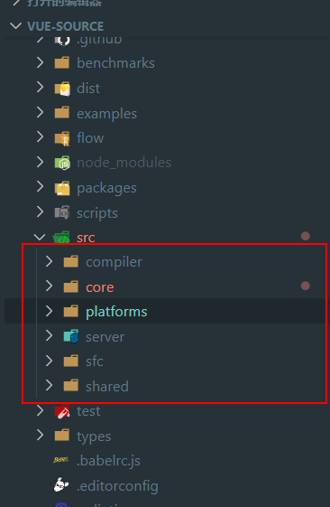

而到了 `Vue.js 3.0` ，整个源码是通过 `monorepo` 的方式维护的，根据功能将不同的模块拆分到 packages 目录下面不同的子目录中：

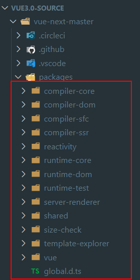

可以看出相对于 `Vue.js 2.x` 的源码组织方式，`monorepo` 把这些模块拆分到不同的 `package` 中，每个 `package` 有各自的 `API`、类型定义和测试。这样**使得模块拆分更细化，职责划分更明确，模块之间的依赖关系也更加明确，开发人员也更容易阅读、理解和更改所有模块源码，提高代码的可维护性。**

另外**一些 `package`（比如 `reactivity` 响应式库）是可以独立于 `Vue.js` 使用的，这样用户如果只想使用 `Vue.js 3.0` 的响应式能力，可以单独依赖这个响应式库而不用去依赖整个 `Vue.js`，减小了引用包的体积大小**，而 `Vue.js 2 .x` 是做不到这一点的。

### 有类型的 `JavaScript：TypeScript`

其次，源码的优化还体现在 `Vue.js 3.0` 自身采用了 `TypeScript` 开发。`Vue.js 1.x` 版本的源码是没有用类型语言的，尤雨溪用 `JavaScript` 开发了整个框架，但对于复杂的框架项目开发，**使用类型语言非常有利于代码的维护，因为它可以在编码期间帮你做类型检查，避免一些因类型问题导致的错误；也可以利于它去定义接口的类型，利于 `IDE` 对变量类型的推导**。

因此在重构 `2.0` 的时候，尤雨溪选型了 `Flow`，但是在 `Vue.js 3.0` 的时候抛弃 `Flow` 转而采用 `TypeScript` 重构了整个项目，这里有两方面原因：

①`Flow` 是 `Facebook` 出品的 `JavaScript` 静态类型检查工具，它可以以非常小的成本对已有的 JavaScript 代码迁入，非常灵活，这也是 `Vue.js 2.0` 当初选型它时一方面的考量。但是 `Flow` 对于一些复杂场景类型的检查，支持得并不好。记得在看 `Vue.js 2.x` 源码的时候，在某行代码的注释中看到了对 `Flow` 的吐槽，比如在组件更新 `props` 的地方出现了：

```javascript
const propOptions: any = vm.$options.props // wtf flow?
```

什么意思呢？其实是由于这里 `Flow` 并没有正确推导出 `vm.$options.props` 的类型 ，开发人员不得不强制申明 `propsOptions` 的类型为 `any`，显得很不合理；另外他也在社区平台吐槽过 `Flow` 团队的烂尾。

②其次，`Vue.js 3.0` 抛弃 Flow 后，使用 `TypeScript` 重构了整个项目。 `TypeScript`提供了更好的类型检查，能支持复杂的类型推导；由于源码就使用 `TypeScript` 编写，也省去了单独维护 `d.ts` 文件的麻烦；就整个 `TypeScript` 的生态来看，`TypeScript` 团队也是越做越好，`TypeScript` 本身保持着一定频率的迭代和更新，支持的 `feature` 也越来越多。

## 1.2 性能优化

性能优化一直是前端老生常谈的问题。对于 `Vue.js 2.x` 已经足够优秀的前端框架，它的性能优化主要从**源码体积、数据劫持、编译优化**几个方面进行突破。

### 源码体积优化

首先是源码体积优化，我们在平时工作中也经常会尝试优化静态资源的体积，因为 `JavaScript` 包体积越小，意味着网络传输时间越短，`JavaScript` 引擎解析包的速度也越快。

`Vue.js 3.0` 在源码体积的减少方面做了以下工作：

- **首先，移除一些冷门的 `feature`（比如 `filter、inline-template` 等）；**
- **其次，引入 `tree-shaking` 的技术，减少打包体积。**

####  `tree-shaking`

`tree-shaking`的原理比较简单，`tree-shaking` 依赖 `ES2015` 模块语法的静态结构（即 `import 和 export`），通过编译阶段的静态分析，找到没有引入的模块并打上标记。

举个例子，一个 `math` 模块定义了 2 个方法 `square(x)` 和 `cube(x)` ：

```javascript
export function square(x) {
  return x * x
}

export function cube(x) {
  return x * x * x
}
```

我们在这个模块外面只引入了 `cube` 方法：

```javascript
import { cube } from './math.js'
// do something with cube
```

最终 `math` 模块会被 `webpack` 打包生成如下代码：

```javascript
/* 1 */

/***/ (function(module, __webpack_exports__, __webpack_require__) {

  'use strict';

  /* unused harmony export square */

  /* harmony export (immutable) */ __webpack_exports__['a'] = cube;

  function square(x) {
    return x * x;
  }

  function cube(x) {
    return x * x * x;
  }
});

```

可以看到，未被引入的 `square` 模块被标记了`（unused harmony export square）`， 然后**压缩阶段会利用例如 `uglify-js、terser` 等压缩工具真正地删除这些没有用到的代码**。

也就是说，利用 `tree-shaking` 技术，**如果你在项目中没有引入 `Transition、KeepAlive` 等组件，那么它们对应的代码就不会打包，这样也就间接达到了减少项目引入的 `Vue.js` 包体积的目的。**

### 数据劫持优化

其次是数据劫持优化。`Vue.js` 区别于 `React` 的一大特色是它的数据是响应式的，这个特性从 `Vue.js 1.x` 版本就一直伴随着，这也是 `Vue.js` 粉喜欢 `Vue.js` 的原因之一，**`DOM` 是数据的一种映射，数据发生变化后可以自动更新 DOM，用户只需要专注于数据的修改，没有其余的心智负担。**

**在 `Vue.js` 内部，想实现这个功能是要付出一定代价的，那就是必须劫持数据的访问和更新。**其实这点很好理解，当数据改变后，为了自动更新 `DOM`，那么就必须劫持数据的更新，也就是说当数据发生改变后能自动执行一些代码去更新 DOM，那么问题来了，`Vue.js` 怎么知道更新哪一片 `DOM` 呢？因为在渲染 `DOM` 的时候访问了数据，我们可以对它进行访问劫持，这样就在内部建立了依赖关系，也就知道数据对应的 `DOM` 是什么了。以上只是大体的思路，具体实现要比这更复杂，内部还依赖了一个 `watcher` 的数据结构做依赖管理，参考下图：

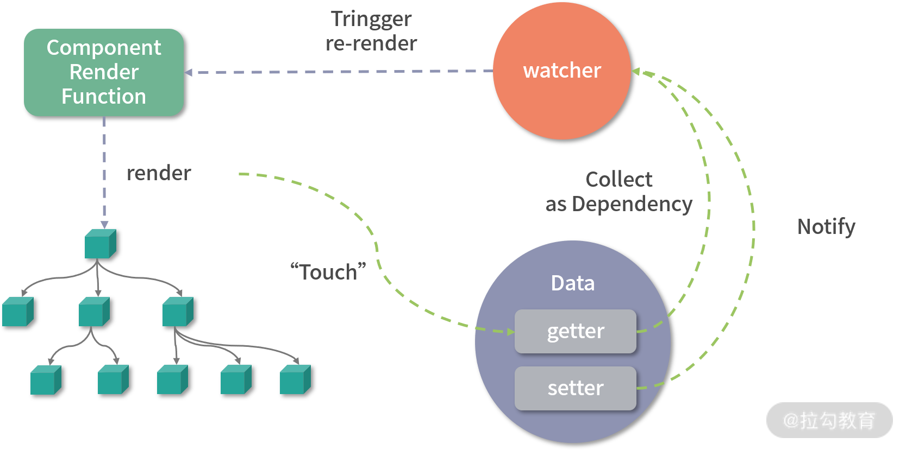

#### `Vue.js1.x 和 Vue.js2.x的不足`

`Vue.js 1.x 和 Vue.js 2.x` 内部都是通过 `Object.defineProperty` 这个 `API` 去劫持数据的 getter 和 setter，**针对于的是对象中的单个属性进行劫持**，具体是这样的：

```javascript
Object.defineProperty(data, 'a',{
  get(){
    // track
  },
  set(){
    // trigger
  }
})

```

但这个 `API` 有一些缺陷，它必须预先知道要拦截的 key 是什么，所以它并不能检测对象属性的添加和删除。尽管 `Vue.js` 为了解决这个问题提供了 `$set` 和 ​`$delete` 实例方法，但是对于用户来说，还是增加了一定的心智负担。

另外 `Object.defineProperty` 的方式还有一个问题，举个例子，比如这个嵌套层级比较深的对象：

```javascript
export default {
  data: {
    a: {
      b: {
        c: {
          d: 1
        }
      }
    }
  }
}
```

由于 **`Vue.js` 无法判断你在运行时到底会访问到哪个属性，所以对于这样一个嵌套层级较深的对象，如果要劫持它内部深层次的对象变化，就需要递归遍历这个对象，执行 `Object.defineProperty` 把每一层对象数据都变成响应式的。**毫无疑问，如果我们定义的响应式数据过于复杂，这就会有相当大的性能负担。

#### `Vue.js3.0`的优化

为了解决上述 2 个问题，`Vue.js 3.0` 使用了 `Proxy API` 做数据劫持，它的内部是这样的：

```javascript
observed = new Proxy(data, {
  get() {
    // track
  },
  set() {
    // trigger
  }
})

```

**由于它劫持的是整个对象，那么自然对于对象的属性的增加和删除都能检测到。**

但要注意的是，**`Proxy API` 并不能监听到内部深层次的对象变化，因此 `Vue.js 3.0` 的处理方式是在 `getter` 中去递归响应式，这样的好处是真正访问到的内部对象才会变成响应式，而不是无脑递归，这样无疑也在很大程度上提升了性能。**

### 编译优化

最后是编译优化，为了便于理解，我们先来看一张图：

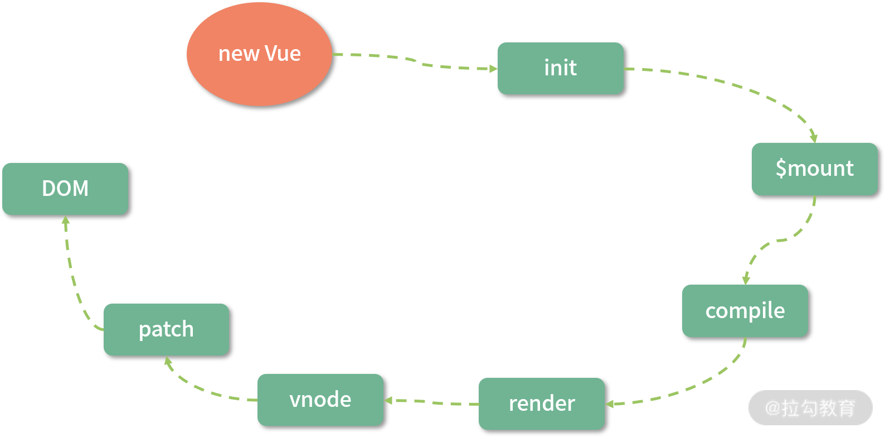

这是 `Vue.js 2.x` 从 `new Vue` 开始渲染成 DOM 的流程，上面说过的响应式过程就发生在图中的 `init` 阶段，另外 `template compile to render function` 的流程是可以借助 `vue-loader` 在 `webpack` 编译阶段离线完成，并非一定要在运行时完成。

所以**想优化整个 `Vue.js` 的运行时，除了数据劫持部分的优化，我们可以在耗时相对较多的 `patch` 阶段想办法**，`Vue.js 3.0` 也是这么做的，并且它通过在编译阶段优化编译的结果，来实现运行时 `patch` 过程的优化。

我们知道，通过数据劫持和依赖收集，`Vue.js 2.x` 的数据更新并触发重新渲染的粒度是组件级的：

> 在`Vue.js1.x`中，是通过细粒度的绑定来更新视图，也就是说：假如有一个状态绑定着好多个依赖，每个依赖表示一个具体的DOM节点，那么当这个状态发生变化时，向这个状态的所有依赖发送通知，让它们进行`DOM`更新操作。但是这样也会有一定的代价，因为粒度越细，每个状态所绑定的依赖就越多，依赖追踪在内存上的开销就会越大。因此，从`Vue.js2.0`开始，引入了虚拟DOM，将粒度调整为中等粒度，即一个状态所绑定的依赖不再是具体的DOM节点，而是一个组件。这样状态变化后，会通知到组件，组件内部再使用虚拟DOM进行比对。这可以大大降低依赖数量，从而降低依赖追踪所消耗的内存。

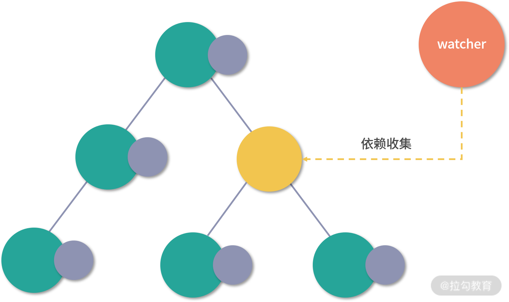

虽然 `Vue` 能保证触发更新的组件最小化，但在单个组件内部依然需要遍历该组件的整个 `vnode` 树，举个例子，比如我们要更新这个组件：

```vue
<template>
  <div id="content">
    <p class="text">static text</p>
    <p class="text">static text</p>
    <p class="text">{{message}}</p>
    <p class="text">static text</p>
    <p class="text">static text</p>
  </div>
</template>

```

整个 `diff` 过程如图所示：

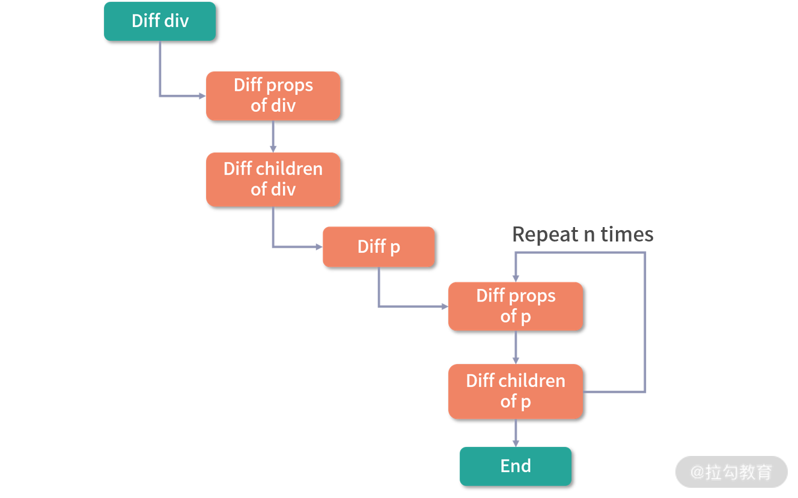

可以看到，**因为这段代码中只有一个动态节点，所以这里有很多 `diff` 和遍历其实都是不需要的，这就会导致 `vnode` 的性能跟模版大小正相关，跟动态节点的数量无关，当一些组件的整个模版内只有少量动态节点时，这些遍历都是性能的浪费。**

而对于上述例子，**理想状态只需要 `diff` 这个绑定 `message` 动态节点的 `p` 标签即可。**

**`Vue.js 3.0` 做到了，它通过编译阶段对静态模板的分析，编译生成了 `Block tree`。`Block tree` 是一个将模版基于动态节点指令切割的嵌套区块，每个区块内部的节点结构是固定的，而且每个区块只需要以一个 `Array` 来追踪自身包含的动态节点。借助 `Block tree`，`Vue.js` 将 `vnode` 更新性能由与模版整体大小相关提升为与动态内容的数量相关，这是一个非常大的性能突破。**

除此之外，`Vue.js 3.0` 在编译阶段还包含了对 `Slot` 的编译优化、事件侦听函数的缓存优化，并且在运行时重写了 `diff` 算法。

## 1.3 语法 `API` 优化：`Composition API`

除了源码和性能方面，`Vue.js 3.0` 还在语法方面进行了优化，主要是提供了 `Composition API`。

### 优化逻辑组织

首先，是优化逻辑组织。

在 `Vue.js 1.x 和 2.x` 版本中，编写组件本质就是在编写一个“包含了描述组件选项的对象”，我们把它称为 `Options API`，它的好处是在于写法非常符合直觉思维，对于新手来说这样很容易理解，这也是很多人喜欢 `Vue.js` 的原因之一。

**`Options API` 的设计是按照 `methods、computed、data、props` 这些不同的选项分类，当组件小的时候，这种分类方式一目了然；但是在大型组件中，一个组件可能有多个逻辑关注点，当使用 `Options API` 的时候，每一个关注点都有自己的 `Options`，如果需要修改一个逻辑点关注点，就需要在单个文件中不断上下切换和寻找。**

举一个官方例子 `Vue CLI UI file explorer`，它是 `vue-cli GUI` 应用程序中的一个复杂的文件浏览器组件。这个组件需要处理许多不同的逻辑关注点：

- 跟踪当前文件夹状态并显示其内容
- 处理文件夹导航（比如打开、关闭、刷新等）
- 处理新文件夹的创建
- 切换显示收藏夹
- 切换显示隐藏文件夹
- 处理当前工作目录的更改

如果我们按照逻辑关注点做颜色编码，就可以看到当使用 `Options API` 去编写组件时，这些逻辑关注点是非常分散的：

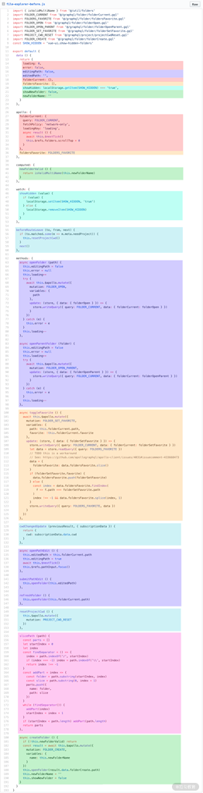

`Vue.js 3.0` 提供了一种新的 `API：Composition API`，它有一个很好的机制去解决这样的问题，就是将某个逻辑关注点相关的代码全都放在一个函数里，这样当需要修改一个功能时，就不再需要在文件中跳来跳去。

通过下图，我们可以很直观地感受到 `Composition API` 在逻辑组织方面的优势：

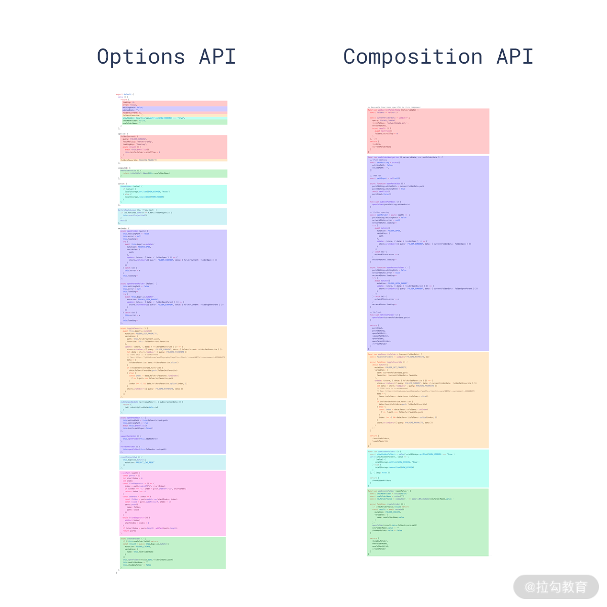

### 优化逻辑复用

其次，是优化逻辑复用。

当我们开发项目变得复杂的时候，免不了需要抽象出一些复用的逻辑。在 `Vue.js 2.x` 中，我们通常会用 `mixins` 去复用逻辑，举一个鼠标位置侦听的例子，我们会编写如下函数 `mousePositionMixin`：

```javascript
const mousePositionMixin = {
  data() {
    return {
      x: 0,
      y: 0
    }
  },
  mounted() {
    window.addEventListener('mousemove', this.update)
  },
  destroyed() {
    window.removeEventListener('mousemove', this.update)
  },
  methods: {
    update(e) {
      this.x = e.pageX
      this.y = e.pageY
    }
  }
}
export default mousePositionMixin
```

然后在组件中使用：

```vue
<template>
  <div>
    Mouse position: x {{ x }} / y {{ y }}
  </div>
</template>
<script>
import mousePositionMixin from './mouse'
export default {
  mixins: [mousePositionMixin]
}
</script>
```

**使用单个 `mixin` 似乎问题不大，但是当我们一个组件混入大量不同的 `mixins` 的时候，会存在两个非常明显的问题：命名冲突和数据来源不清晰。**

首先每个 `mixin` 都可以定义自己的 `props、data`，它们之间是无感的，所以很容易定义相同的变量，导致命名冲突。另外对组件而言，如果模板中使用不在当前组件中定义的变量，那么就会不太容易知道这些变量在哪里定义的，这就是数据来源不清晰。但是`Vue.js 3.0` 设计的 `Composition API`，就很好地帮助我们解决了 `mixins` 的这两个问题。

我们来看一下在 `Vue.js 3.0` 中如何书写这个示例：

```javascript
import { ref, onMounted, onUnmounted } from 'vue'
export default function useMousePosition() {
  const x = ref(0)
  const y = ref(0)
  const update = e => {
    x.value = e.pageX
    y.value = e.pageY
  }
  onMounted(() => {
    window.addEventListener('mousemove', update)
  })
  onUnmounted(() => {
    window.removeEventListener('mousemove', update)
  })
  return { x, y }
}
```

这里我们约定 `useMousePosition` 这个函数为 hook 函数，然后在组件中使用：

```vue
<template>
  <div>
    Mouse position: x {{ x }} / y {{ y }}
  </div>
</template>
<script>
  import useMousePosition from './mouse'
  export default {
    setup() {
      const { x, y } = useMousePosition()
      return { x, y }
    }
  }
</script>
```

可以看到，整个数据来源清晰了，即使去编写更多的 `hook` 函数，也不会出现命名冲突的问题。

`Composition API` 除了在逻辑复用方面有优势，也会有更好的类型支持，因为它们都是一些函数，在调用函数时，自然所有的类型就被推导出来了，不像 `Options API` 所有的东西使用 `this`。另外，`Composition API` 对 `tree-shaking` 友好，代码也更容易压缩。

虽然 `Composition API` 有诸多优势，它也不是一点缺点都没有。这里还需要说明的是，`Composition API` 属于 `API` 的增强，它并不是 `Vue.js 3.0` 组件开发的范式，如果你的组件足够简单，你还是可以使用 `Options API`。

## 1.4 引入 RFC：使每个版本改动可控

作为一个流行开源框架，可能每天都会收到各种各样的 `feature request`。但并不是社区一有新功能的需求，框架就会立马支持，因为随着 `Vue.js` 的用户越来越多，肯定会更加重视稳定性，会仔细考虑所做的每一个可能对最终用户影响的更改，以及有意识去防止新 `API` 对框架本身实现带来的复杂性的提升。

因此在 `Vue.js 2.x` 版本开发到后期的阶段 ，小右就启用了 `RFC` ，它的全称是 `Request For Comments`，旨在为新功能进入框架提供一个一致且受控的路径。当社区有一些新需求的想法时，它可以提交一个 RFC，然后由社区和 `Vue.js` 的核心团队一起讨论，如果这个 `RFC` 最终被通过了，那么它才会被实现。比如 2.6 版本对于 `slot 新 API` 的改动，就是[这条 RFC](https://github.com/vuejs/rfcs/blob/master/active-rfcs/0001-new-slot-syntax.md) 里。

到了 `Vue.js 3.0` ，小右在实现代码前就大规模启用 `RFC`，来确保他的改动和设计都是经过讨论并确认的，这样可以避免走弯路。`Vue.js 3.0` 版本有很多重大的改动，每一条改动都会有对应的 `RFC`，通过阅读这些 `RFC`，你可以了解每一个 `feature` 采用或被废弃掉的前因后果。

`Vue.js 3.0` 目前已被实现并合并的 RFC 都在[这里](https://github.com/vuejs/rfcs/pulls?q=is%3Apr+is%3Amerged+label%3A3.x)，通过阅读它们，你也可以大致了解 `Vue.js 3.0` 的一些变化，以及为什么会产生这些变化，帮助你了解它的前因后果。 

## 1.5 过渡期

通常框架的 `major` 版本从升级到大规模投入使用，都需要经历相当长的一段过渡期。不过， `Vue.js 1.x` 到 `Vue.js 2.0` 的升级过渡期不长，主要是因为那个时候 `Vue.js` 的用户还不多，生态也不完善，很多用户都是直接上手的 2.0 版本，没有旧项目的历史包袱。

而 `Vue.js 2.x` 的发展历经了 3 年多的时间，用户众多，而且周边生态也已经非常完善了。通常 `major` 版本的升级会有很多 `breaking change`，这就意味着想从 `2.x` 升级到 `3.0` 的项目需要改代码，而且不仅仅项目的代码要修改，所依赖的周边生态也需要升级。这其实是一个相当大的工作量，也需要承担一定的风险，所以如果你的项目非常庞大且已经相对稳定，没有什么特别的痛点，那么升级要慎重。

**`Vue.js 3.0` 使用 `ES2015` 的语法开发，有些 `API` 如 `Proxy` 是没有 `polyfill` 的，这就意味着官方需要单独出一个 `IE11 compat` 版本来支持 `IE11`。如果你的项目需要兼容 `IE11`，你就不得不小心使用某些 `API`，这也就带来了一些额外的心智负担。**

因此可能在 `Vue.js 3.0` 出来的相当长的一段时间，复杂的大项目都不会考虑去升级，而一些小的、对浏览器兼容要求不高的新项目可以考虑尝鲜了。

官方会继续维护 `Vue.js 2.x` 版本 18 个月，如果你的有些项目一辈子都不打算升级 `Vue.js 3.0`，那么你应该去认真学习 `Vue.js 2.x` 的源码，在官方不再维护的时候遇到问题你可以自己去修改它的源码来解决。

不过，虽然 `Vue.js 3.0` 距离大规模应用还有相当长一段时间，但是越早开始学习你就越能在未来掌握主动权。这段时间里，你可以关注它的发展，去学习它的设计思想，也可以去为它的生态建设贡献代码，从而提升自己的技术能力。另外也可以尝试在一些小项目中应用 `Vue.js 3.0`，不仅可以享受 `Vue.js 3.0` 带来的性能方面的优势以及 `Composition API` 在逻辑复用方面便利，也为了将来某一天全面升级 `Vue.js 3.0` 做技术储备。

# 二、`Vue.js`核心组件的实现原理

我们开发 `Vue.js` 的项目，大部分时间都是在写组件，组件系统是 `Vue.js` 的一个重要概念，它是一种对 `DOM` 结构的抽象，我们可以使用小型、独立和通常可复用的组件构建大型应用。仔细想想，几乎任意类型的应用界面都可以抽象为一个组件树，如下：

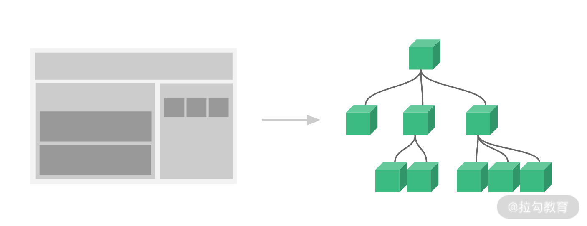

组件化也是 `Vue.js` 的核心思想之一，它允许我们用模板加对象描述的方式去创建一个组件，再加上我们给组件注入不同的数据，就可以完整地渲染出组件：


当数据更新后，组件可以自动重新渲染，因此用户只需要专注于数据逻辑的处理，而无须关心 DOM 的操作，无论是开发体验和开发效率都得到了很大的提升。

## 2.1 组件渲染：`vnode` 到真实 DOM 是如何转变的？

首先，组件是一个抽象的概念，它是对一棵 `DOM` 树的抽象，我们在页面中写一个组件节点：

```vue
<hello-world></hello-world>
```

这段代码并不会在页面上渲染一个`<hello-world>`标签，而它具体渲染成什么，取决于你怎么编写 `HelloWorld` 组件的模板。举个例子，`HelloWorld` 组件内部的模板定义是这样的：

```javascript
<template>
  <div>
    <p>Hello World</p>
  </div>
</template>
```

可以看到，模板内部最终会在页面上渲染一个 `div`，内部包含一个 `p` 标签，用来显示 `Hello World` 文本。

所以，从表现上来看，组件的模板决定了组件生成的 `DOM` 标签，而在 `Vue.js` 内部，一个组件想要真正的渲染生成 `DOM`，还需要经历`“创建 vnode - 渲染 vnode - 生成 DOM”` 这几个步骤：


### 应用程序初始化

> 一个组件可以通过“模板加对象描述”的方式创建，组件创建好以后是如何被调用并初始化的呢？因为整个组件树是由根组件开始渲染的，为了找到根组件的渲染入口，我们需要从应用程序的初始化过程开始分析。

在这里，我分别给出了通过 `Vue.js 2.x` 和 `Vue.js 3.0` 来初始化应用的代码：

```javascript
// 在 Vue.js 2.x 中，初始化一个应用的方式如下
import Vue from 'vue'
import App from './App'
const app = new Vue({
  render: h => h(App)
})
app.$mount('#app')
```

```javascript
// 在 Vue.js 3.0 中，初始化一个应用的方式如下
import { createApp } from 'vue'
import App from './app'
const app = createApp(App)
app.mount('#app')
```

可以看到，`Vue.js 3.0` 初始化应用的方式和 `Vue.js 2.x` 差别并不大，本质上都是把 `App` 组件挂载到 `id` 为 `app` 的 `DOM` 节点上。

但是，在 `Vue.js 3.0` 中还导入了一个 `createApp`，其实这是个入口函数，它是 `Vue.js` 对外暴露的一个函数，我们来看一下它的内部实现：

```javascript
const createApp = ((...args) => {
  // 创建 app 对象
  const app = ensureRenderer().createApp(...args)
  const { mount } = app
  // 重写 mount 方法
  app.mount = (containerOrSelector) => {
    // ...
  }
  return app
})

```

从代码中可以看出 `createApp` 主要做了两件事情：**创建 `app` 对象和重写 `app.mount` 方法**。

#### 创建 `app` 对象

首先，我们使用 `ensureRenderer().createApp()` 来创建 `app` 对象 ：

```javascript
 const app = ensureRenderer().createApp(...args)
```

其中 `ensureRenderer()` 用来创建一个渲染器对象，它的内部代码是这样的：

> 为什么说用`ensureRenderer()` 来延时创建渲染器？因为 `ensureRenderer` 是在执行 `createApp` 的时候调用的，如果你不执行 `createApp` 而只使用 `vue` 的一些响应式 `API`，就不会创建这个渲染器，所以说延时渲染。

```javascript
// 渲染相关的一些配置，比如更新属性的方法，操作 DOM 的方法
const rendererOptions = {
  patchProp,
  ...nodeOps
}
let renderer
// 延时创建渲染器，当用户只依赖响应式包的时候，可以通过 tree-shaking 移除核心渲染逻辑相关的代码
function ensureRenderer() {
  return renderer || (renderer = createRenderer(rendererOptions))
}
function createRenderer(options) {
  return baseCreateRenderer(options)
}
function baseCreateRenderer(options) {
  function render(vnode, container) {
    // 组件渲染的核心逻辑
  }
  return {
    render,
    createApp: createAppAPI(render)
  }
}
function createAppAPI(render) {
  // createApp createApp 方法接受的两个参数：根组件的对象和 prop
  return function createApp(rootComponent, rootProps = null) {
    const app = {
      _component: rootComponent,
      _props: rootProps,
      mount(rootContainer) {
        // 创建根组件的 vnode
        const vnode = createVNode(rootComponent, rootProps)
        // 利用渲染器渲染 vnode
        render(vnode, rootContainer)
        app._container = rootContainer
        return vnode.component.proxy
      }
    }
    return app
  }
}
```

可以看到，这里先用 `ensureRenderer()` 来延时创建渲染器，这样做的好处是当用户只依赖响应式包的时候，就不会创建渲染器，因此可以通过 `tree-shaking` 的方式移除核心渲染逻辑相关的代码。

这里涉及了渲染器的概念，它是为跨平台渲染做准备的，之后我会在自定义渲染器的相关内容中详细说明。在这里，你可以简单地把渲染器理解为包含平台渲染核心逻辑的 `JavaScript` 对象。

我们结合上面的代码继续深入，在 `Vue.js 3.0` 内部通过 `createRenderer` 创建一个渲染器，这个渲染器内部会有一个 `createApp` 方法，它是执行 `createAppAPI` 方法返回的函数，接受了 `rootComponent` 和 `rootProps` 两个参数，我们在应用层面执行 `createApp(App)` 方法时，会把 `App` 组件对象作为根组件传递给 `rootComponent`。这样，`createApp` 内部就创建了一个 `app` 对象，它会提供 `mount` 方法，这个方法是用来挂载组件的。

在整个 `app` 对象创建过程中，`Vue.js` 利用闭包和函数柯里化的技巧，很好地实现了参数保留。比如，在执行 `app.mount` 的时候，并不需要传入渲染器 `render`，这是因为在执行 `createAppAPI` 的时候渲染器 `render` 参数已经被保留下来了。

#### 重写 `app.mount` 方法

接下来，是重写 `app.mount` 方法。

根据前面的分析，我们知道 `createApp` 返回的 `app` 对象已经拥有了 `mount` 方法了，但在入口函数中，接下来的逻辑却是对 `app.mount` 方法的重写。先思考一下，为什么要重写这个方法，而不把相关逻辑放在 `app` 对象的 `mount` 方法内部来实现呢？

这是因为 `Vue.js` 不仅仅是为 Web 平台服务，它的目标是支持跨平台渲染，而 `createApp` 函数内部的 `app.mount` 方法是一个标准的可跨平台的组件渲染流程：

```javascript
mount(rootContainer) {
  // 创建根组件的 vnode
  const vnode = createVNode(rootComponent, rootProps)
  // 利用渲染器渲染 vnode
  render(vnode, rootContainer)
  app._container = rootContainer
  return vnode.component.proxy
}
```

**标准的跨平台渲染流程是先创建 `vnode`，再渲染 `vnode`。**此外参数 `rootContainer` 也可以是不同类型的值，比如，在 `Web` 平台它是一个 `DOM` 对象，而在其他平台（比如 `Weex` 和小程序）中可以是其他类型的值。所以这里面的代码不应该包含任何特定平台相关的逻辑，也就是说这些代码的执行逻辑都是与平台无关的。因此我们需要在外部重写这个方法，来完善 Web 平台下的渲染逻辑。

接下来，再来看 `app.mount` 重写都做了哪些事情：

```javascript
app.mount = (containerOrSelector) => {
  // 标准化容器
  // 通过 normalizeContainer 标准化容器
  // 开发者可以给mout方法传字符串选择器或者 DOM 对象作为参数，
  // 但如果是字符串选择器，就需要把它转成 DOM 对象，作为最终挂载的容器
  const container = normalizeContainer(containerOrSelector)
  if (!container)
    return
  const component = app._component
   // 如组件对象没有定义 render 函数和 template 模板，则取容器的 innerHTML 作为组件模板内容
  if (!isFunction(component) && !component.render && !component.template) {
    component.template = container.innerHTML
  }
  // 挂载前清空容器内容
  container.innerHTML = ''
  // 真正的挂载
  return mount(container)
}
```

**首先是通过 `normalizeContainer` 标准化容器（这里可以传字符串选择器或者 DOM 对象，但如果是字符串选择器，就需要把它转成 DOM 对象，作为最终挂载的容器），然后做一个 `if` 判断，如果组件对象没有定义 `render` 函数和 `template` 模板，则取容器的 `innerHTML` 作为组件模板内容；接着在挂载前清空容器内容，最终再调用 `app.mount` 的方法走标准的组件渲染流程（创建 `vnode`，再渲染 `vnode`）。**

在这里，重写的逻辑都是和 `Web` 平台相关的，所以要放在外部实现。此外，这么做的目的是既能让用户在使用 `API` 时可以更加灵活，也兼容了 `Vue.js 2.x` 的写法，比如 `app.mount` 的第一个参数就同时支持选择器字符串和 `DOM` 对象两种类型。

**从 `app.mount` 开始，才算真正进入组件渲染流程，核心渲染流程做的两件事情：创建 `vnode` 和渲染 `vnode`。**

### 核心渲染流程：创建 `vnode` 和渲染 `vnode`

#### 创建 `vnode`

首先，是创建 `vnode` 的过程。

**`vnode` 本质上是用来描述 `DOM` 的 `JavaScript` 对象**，它在 `Vue.js` 中可以描述不同类型的节点，比如普通元素节点、组件节点等。

##### 普通元素节点

什么是普通元素节点呢？举个例子，在 `HTML` 中我们使用 `<button>` 标签来写一个按钮：

```javascript
<button class="btn" style="width:100px;height:50px">click me</button>
```

可以用 `vnode` 这样表示`<button>`标签：

```javascript
const vnode = {
  type: 'button',
  props: { 
    'class': 'btn',
    style: {
      width: '100px',
      height: '50px'
    }
  },
  children: 'click me'
}
```

其中，`type` 属性表示 `DOM` 的标签类型，`props` 属性表示 `DOM` 的一些附加信息，比如 `style` 、`class` 等，`children` 属性表示 `DOM` 的子节点，它也可以是一个 `vnode` 数组，只不过 `vnode` 可以用字符串表示简单的文本 。

##### 组件节点

什么是**组件节点**呢？其实， `vnode` 除了可以像上面那样用于描述一个真实的 `DOM`，也可以用来描述组件。

我们先在模板中引入一个组件标签 `<custom-component>`：

```html
<custom-component msg="test"></custom-component>
```

我们可以用 `vnode` 这样表示 `<custom-component>` 组件标签：

```javascript
const CustomComponent = {
  // 在这里定义组件对象
}
const vnode = {
  type: CustomComponent,
  props: { 
    msg: 'test'
  }
}
```

组件 `vnode` 其实是**对抽象事物的描述**，这是因为我们并不会在页面上真正渲染一个 `<custom-component>` 标签，而是渲染组件内部定义的 HTML 标签。

除了上两种 `vnode` 类型外，还有纯文本 `vnode`、注释 `vnode` 等等，但是主线只需要研究组件 `vnode` 和普通元素 `vnode`即可。

另外，`Vue.js 3.0` 内部还针对 `vnode` 的 `type`，做了更详尽的分类，包括 `Suspense`、`Teleport` 等，且把 `vnode` 的类型信息做了编码，以便在后面的 `patch` 阶段，可以根据不同的类型执行相应的处理逻辑：

```javascript
const shapeFlag = isString(type)
  ? 1 /* ELEMENT */
  : isSuspense(type)
    ? 128 /* SUSPENSE */
    : isTeleport(type)
      ? 64 /* TELEPORT */
      : isObject(type)
        ? 4 /* STATEFUL_COMPONENT */
        : isFunction(type)
          ? 2 /* FUNCTIONAL_COMPONENT */
          : 0
```

##### `vnode`的优势

 **`vnode` 有什么优势呢？为什么一定要设计 `vnode` 这样的数据结构呢？**

* 首先是**抽象**，引入 `vnode`，可以把渲染过程抽象化，从而使得组件的抽象能力也得到提升。

* 其次是**跨平台**，因为 `patch vnode` 的过程不同平台可以有自己的实现，基于 `vnode` 再做服务端渲染、`Weex` 平台、小程序平台的渲染都变得容易了很多。

>  不过这里要特别注意，使用 `vnode` 并不意味着不用操作 DOM 了，很多人会误以为 `vnode` 的性能一定比手动操作原生 `DOM` 好，这个其实是不一定的。
>
> 因为，首先这种基于 `vnode` 实现的 `MVVM` 框架，在每次 `render to vnode` 的过程中，渲染组件会有一定的 `JavaScript` 耗时，特别是大组件，比如一个 `1000 * 10` 的 Table 组件，`render to vnode` 的过程会遍历 `1000 * 10` 次去创建内部 `cell vnode`，整个耗时就会变得比较长，加上 `patch vnode` 的过程也会有一定的耗时，当我们去更新组件的时候，用户会感觉到明显的卡顿。虽然 `diff` 算法在减少 `DOM` 操作方面足够优秀，但最终还是免不了操作 `DOM`，所以说性能并不是 `vnode` 的优势。

##### `vnode`的创建

回顾 `app.mount` 函数的实现，内部是通过 `createVNode` 函数创建了根组件的 `vnode` ：

```javascript
 const vnode = createVNode(rootComponent, rootProps)
```

`createVNode` 函数的大致实现：

```javascript
function createVNode(type, props = null
,children = null) {
  if (props) {
    // 处理 props 相关逻辑，标准化 class 和 style
  }
  // 对 vnode 类型信息编码
  const shapeFlag = isString(type)
    ? 1 /* ELEMENT */
    : isSuspense(type)
      ? 128 /* SUSPENSE */
      : isTeleport(type)
        ? 64 /* TELEPORT */
        : isObject(type)
          ? 4 /* STATEFUL_COMPONENT */
          : isFunction(type)
            ? 2 /* FUNCTIONAL_COMPONENT */
            : 0
  const vnode = {
    type,
    props,
    shapeFlag,
    // 一些其他属性
  }
  // 标准化子节点，把不同数据类型的 children 转成数组或者文本类型
  normalizeChildren(vnode, children)
  return vnode
}
```

通过上述代码可以看到，其实 `createVNode` 做的事情很简单，就是：对 `props` 做标准化处理、对 `vnode` 的类型信息编码、创建 `vnode` 对象，标准化子节点 `children` 。

拥有了这个 `vnode` 对象，接下来要做的事情就是把它渲染到页面中去。

#### 渲染 `vnode`

##### `render`

回顾 `app.mount` 函数的实现，内部通过执行这段代码去渲染创建好的 `vnode`：

```javascript
render(vnode, rootContainer)
const render = (vnode, container) => {
  if (vnode == null) {
    // 销毁组件
    if (container._vnode) {
      unmount(container._vnode, null, null, true)
    }
  } else {
    // 创建或者更新组件
    patch(container._vnode || null, vnode, container)
  }
  // 缓存 vnode 节点，表示已经渲染
  container._vnode = vnode
}
```

这个渲染函数 `render` 的实现很简单，如果它的第一个参数 `vnode` 为空，则执行销毁组件的逻辑，否则执行创建或者更新组件的逻辑。

##### `patch`

主要是看渲染 `vnode` 的代码中涉及的 `patch` 函数的实现：

```javascript
const patch = (n1, n2, container, anchor = null, parentComponent = null, parentSuspense = null, isSVG = false, optimized = false) => {
  // 如果存在旧节点, 且新旧节点类型不同，则销毁旧节点
  if (n1 && !isSameVNodeType(n1, n2)) {
    anchor = getNextHostNode(n1)
    unmount(n1, parentComponent, parentSuspense, true)
    n1 = null
  }
  const { type, shapeFlag } = n2
  switch (type) {
    case Text:
      // 处理文本节点
      break
    case Comment:
      // 处理注释节点
      break
    case Static:
      // 处理静态节点
      break
    case Fragment:
      // 处理 Fragment 元素
      break
    default:
      if (shapeFlag & 1 /* ELEMENT */) {
        // 处理普通 DOM 元素
        processElement(n1, n2, container, anchor, parentComponent, parentSuspense, isSVG, optimized)
      }
      else if (shapeFlag & 6 /* COMPONENT */) {
        // 处理组件
        processComponent(n1, n2, container, anchor, parentComponent, parentSuspense, isSVG, optimized)
      }
      else if (shapeFlag & 64 /* TELEPORT */) {
        // 处理 TELEPORT
      }
      else if (shapeFlag & 128 /* SUSPENSE */) {
        // 处理 SUSPENSE
      }
  }
}
```

**`patch` 本意是打补丁的意思，这个函数有两个功能，一个是根据 `vnode` 挂载 `DOM`，一个是根据新旧 `vnode` 更新 DOM。**对于初次渲染，先只分析创建过程，更新过程在后面分析。

在创建的过程中，patch 函数接受多个参数，目前只重点关注前三个：

1. 第一个参数 **`n1` 表示旧的 `vnode`**，当 `n1 为 null` 的时候，表示是一次挂载的过程；
2. 第二个参数 **`n2` 表示新的 `vnode` 节点**，后续会根据这个 `vnode` 类型执行不同的处理逻辑；
3. 第三个参数 **container 表示 DOM 容器**，也就是 `vnode` 渲染生成 `DOM` 后，会挂载到 `container` 下面。

对于渲染的节点，重点关注两种类型节点的渲染逻辑：对组件的处理和对普通 `DOM` 元素的处理。

##### 对组件节点的处理

###### `processComponent`

**先来看对组件的处理**。由于初始化渲染的是 `App` 组件，它是一个组件 `vnode`，所以我们来看一下组件的处理逻辑是怎样的。首先是用来处理组件的 `processComponent` 函数的实现：

```javascript
const processComponent = (n1, n2, container, anchor, parentComponent, parentSuspense, isSVG, optimized) => {
  if (n1 == null) {
    // 挂载组件
    mountComponent(n2, container, anchor, parentComponent, parentSuspense, isSVG, optimized)
  }
  else {
    // 更新组件
    updateComponent(n1, n2, parentComponent, optimized)
  }
}
```

该函数的逻辑很简单，如果 `n1 为 null`，则执行挂载组件的逻辑，否则执行更新组件的逻辑。

###### `mountComponent`

我们接着来看挂载组件的 `mountComponent` 函数的实现：

```javascript
const mountComponent = (initialVNode, container, anchor, parentComponent, parentSuspense, isSVG, optimized) => {
  // 创建组件实例
  const instance = (initialVNode.component = createComponentInstance(initialVNode, parentComponent, parentSuspense))
  // 设置组件实例
  setupComponent(instance)
  // 设置并运行带副作用的渲染函数
  setupRenderEffect(instance, initialVNode, container, anchor, parentSuspense, isSVG, optimized)
}
```

可以看到，**挂载组件函数 `mountComponent` 主要做三件事情：创建组件实例、设置组件实例、设置并运行带副作用的渲染函数。**

首先是创建组件实例，`Vue.js 3.0` 虽然不像 `Vue.js 2.x` 那样通过类的方式去实例化组件，但内部也通过对象的方式去创建了当前渲染的组件实例。

其次设置组件实例，`instance` 保留了很多组件相关的数据，维护了组件的上下文，包括对 `props`、插槽，以及其他实例的属性的初始化处理。

创建和设置组件实例这两个流程在后面进行详细分析。

###### `setupRenderEffect`

最后是运行带副作用的渲染函数 `setupRenderEffect`，重点来看一下这个函数的实现：

```javascript
const setupRenderEffect = (instance, initialVNode, container, anchor, parentSuspense, isSVG, optimized) => {
  // 创建响应式的副作用渲染函数
  instance.update = effect(function componentEffect() {
    if (!instance.isMounted) {
      // 渲染组件生成子树 vnode
      const subTree = (instance.subTree = renderComponentRoot(instance))
      // 把子树 vnode 挂载到 container 中
      patch(null, subTree, container, anchor, instance, parentSuspense, isSVG)
      // 保留渲染生成的子树根 DOM 节点
      initialVNode.el = subTree.el
      instance.isMounted = true
    }
    else {
      // 更新组件
    }
  }, prodEffectOptions)
}
```

**该函数利用响应式库的 `effect` 函数创建了一个副作用渲染函数 `componentEffect` （`effect` 的实现在响应式那里会具体说）。副作用，可以简单地理解为，当组件的数据发生变化时，effect 函数包裹的内部渲染函数 `componentEffect` 会重新执行一遍，从而达到重新渲染组件的目的。**

渲染函数内部也会判断这是一次初始渲染还是组件更新。这里只分析初始渲染流程。

**初始渲染主要做两件事情：渲染组件生成 `subTree`、把 `subTree` 挂载到 `container` 中。**

首先，是渲染组件生成 `subTree`，它也是一个 `vnode` 对象。这里要注意别把 `subTree` 和 `initialVNode` 弄混了（其实在 `Vue.js 3.0` 中，根据命名我们已经能很好地区分它们了，而在 `Vue.js 2.x` 中它们分别命名为 `_vnode` 和 `$vnode`）。比如说，在父组件 `App` 中里引入了 `Hello` 组件：

```vue
<template>
  <div class="app">
    <p>This is an app.</p>
    <hello></hello>
  </div>
</template>
```

在 `Hello` 组件中是 `<div>` 标签包裹着一个 `<p>` 标签：

```vue
<template>
  <div class="hello">
    <p>Hello, Vue 3.0!</p>
  </div>
</template>
```

在 `App` 组件中， `<hello>` 节点渲染生成的 `vnode` ，对应的就是 `Hello` 组件的 `initialVNode` ，为了好记，你也可以把它称作“组件 `vnode`”。而 `Hello` 组件内部整个 `DOM` 节点对应的 `vnode` 就是执行 `renderComponentRoot` 渲染生成对应的 `subTree`，我们可以把它称作“子树 `vnode`”。

我们知道每个组件都会有对应的 `render` 函数，即使你写 `template`，也会编译成 `render` 函数，而 `renderComponentRoot` 函数就是去执行 render 函数创建整个组件树内部的 `vnode`，把这个 `vnode` 再经过内部一层标准化，就得到了该函数的返回结果：子树 `vnode`。

渲染生成子树 `vnode` 后，接下来就是继续调用 `patch` 函数把子树 `vnode` 挂载到 `container` 中了。

那么我们又再次回到了 `patch` 函数，会继续对这个子树 `vnode` 类型进行判断，对于上述例子，`App` 组件的根节点是 `<div>` 标签，那么对应的子树 `vnode` 也是一个普通元素 `vnode`，那么我们**接下来看对普通 DOM 元素的处理流程。**

##### 对普通元素节点的处理

首先看处理普通 `DOM`元素的 `processElement` 函数的实现：

######  `processElement` 

```javascript
const processElement = (n1, n2, container, anchor, parentComponent, parentSuspense, isSVG, optimized) => {
  isSVG = isSVG || n2.type === 'svg'
  if (n1 == null) {
    //挂载元素节点
    mountElement(n2, container, anchor, parentComponent, parentSuspense, isSVG, optimized)
  }
  else {
    //更新元素节点
    patchElement(n1, n2, parentComponent, parentSuspense, isSVG, optimized)
  }
}
```

该函数的逻辑很简单，如果 `n1` 为 `null`，走挂载元素节点的逻辑，否则走更新元素节点逻辑。

###### `mountElement`

接着来看挂载元素的 `mountElement` 函数的实现：

```javascript
const mountElement = (vnode, container, anchor, parentComponent, parentSuspense, isSVG, optimized) => {
  let el
  const { type, props, shapeFlag } = vnode
  // 创建 DOM 元素节点
  el = vnode.el = hostCreateElement(vnode.type, isSVG, props && props.is)
  if (props) {
    // 处理 props，比如 class、style、event 等属性
    for (const key in props) {
      if (!isReservedProp(key)) {
        hostPatchProp(el, key, null, props[key], isSVG)
      }
    }
  }
  if (shapeFlag & 8 /* TEXT_CHILDREN */) {
    // 处理子节点是纯文本的情况
    hostSetElementText(el, vnode.children)
  }
  else if (shapeFlag & 16 /* ARRAY_CHILDREN */) {
    // 处理子节点是数组的情况
    mountChildren(vnode.children, el, null, parentComponent, parentSuspense, isSVG && type !== 'foreignObject', optimized || !!vnode.dynamicChildren)
  }
  // 把创建的 DOM 元素节点挂载到 container 上
  hostInsert(el, container, anchor)
}
```

**可以看到，挂载元素函数主要做四件事：创建 `DOM` 元素节点、处理 `props`、处理 `children`、挂载 `DOM` 元素到 `container` 上。**

首先是创建 `DOM` 元素节点，通过 `hostCreateElement` 方法创建，这是一个平台相关的方法，以下是它在 Web 环境下的定义：

```javascript
function createElement(tag, isSVG, is) {
  isSVG ? document.createElementNS(svgNS, tag)
    : document.createElement(tag, is ? { is } : undefined)
}
```

**它调用了底层的 `DOM API document.createElement` 创建元素，所以本质上 `Vue.js` 强调不去操作 `DOM` ，只是希望用户不直接碰触 `DOM`，它并没有什么神奇的魔法，底层还是会操作 `DOM`。**

另外，如果是其他平台比如 `Weex`，`hostCreateElement` 方法就不再是操作 `DOM` ，而是平台相关的 `API` 了，这些平台相关的方法是在创建渲染器阶段作为参数传入的。

创建完 `DOM` 节点后，接下来要做的是判断如果有 `props` 的话，给这个 `DOM` 节点添加相关的 `class`、`style`、`event` 等属性，并做相关的处理，这些逻辑都是在 `hostPatchProp` 函数内部做的，这里就不展开讲了。

接下来是对子节点的处理，我们知道 `DOM` 是一棵树，`vnode` 同样也是一棵树，并且它和 `DOM` 结构是一一映射的。

###### `hostSetElementText`

如果子节点是纯文本，则执行 `hostSetElementText` 方法，它在 Web 环境下通过设置 `DOM` 元素的 `textContent` 属性设置文本：

```javascript
function setElementText(el, text) {
  el.textContent = text
}
```

######  `mountChildren` 

如果子节点是数组，则执行 `mountChildren` 方法：

```javascript
const mountChildren = (children, container, anchor, parentComponent, parentSuspense, isSVG, optimized, start = 0) => {
  for (let i = start; i < children.length; i++) {
    // 预处理 child
    const child = (children[i] = optimized
      ? cloneIfMounted(children[i])
      : normalizeVNode(children[i]))
    // 递归 patch 挂载 child
    patch(null, child, container, anchor, parentComponent, parentSuspense, isSVG, optimized)
  }
}
```

子节点的挂载逻辑同样很简单，遍历 `children` 获取到每一个 `child`，然后递归执行 `patch` 方法挂载每一个 `child` 。注意，这里有对 `child` 做预处理的情况（后面编译优化的章节再进行详细分析）。

可以看到，`mountChildren` 函数的第二个参数是 `container`，而我们调用 `mountChildren` 方法传入的第二个参数是在 `mountElement` 时创建的 DOM 节点，这就很好地建立了父子关系。

另外，通过递归 patch 这种深度优先遍历树的方式，我们就可以构造完整的 DOM 树，完成组件的渲染。

###### `hostInsert` 

处理完所有子节点后，最后通过 `hostInsert` 方法把创建的 `DOM` 元素节点挂载到 `container` 上，它在 `Web` 环境下这样定义：

```javascript
function insert(child, parent, anchor) {
  if (anchor) {
    parent.insertBefore(child, anchor)
  }
  else {
    parent.appendChild(child)
  }
}
```

这里会做一个 `if` 判断，如果有参考元素 `anchor`，就执行 `parent.insertBefore` ，否则执行 `parent.appendChild` 来把 child 添加到 `parent` 下，完成节点的挂载。

因为 `insert` 的执行是在处理子节点后，所以挂载的顺序是先子节点，后父节点，最终挂载到最外层的容器上。

> **知识延伸：嵌套组件**
> 细心的你可能会发现，在 `mountChildren` 的时候递归执行的是 patch 函数，而不是 `mountElement` 函数，这是因为子节点可能有其他类型的 `vnode`，比如组件 `vnode`。
>
> 在真实开发场景中，嵌套组件场景是再正常不过的了，前面我们举的 `App` 和 `Hello` 组件的例子就是嵌套组件的场景。组件 `vnode` 主要维护着组件的定义对象，组件上的各种 `props`，而组件本身是一个抽象节点，它自身的渲染其实是通过执行组件定义的 `render` 函数渲染生成的子树 `vnode` 来完成，然后再 `patch` 。通过这种递归的方式，无论组件的嵌套层级多深，都可以完成整个组件树的渲染。

### 总结

以上主要分析了组件的渲染流程，从入口开始，一层层分析组件渲染。


### 问题：

**问：** 我们平时开发页面就是把页面拆成一个个组件，那么组件的拆分粒度是越细越好吗？为什么呢？

**答：** 并不是拆分粒度越小越好。

原因：1、在我的日常开发中，有两种情况会去拆分组件，第一种是根据页面的布局或功能，将整个页面拆分成不同的模块组件，最后将这些模块组件拼起来形成页面；第二种是在实现第一部拆分出来的这些模块组件的时候，发现其中有一些模块组件具有相同或相似的功能点，将这些相似的功能点抽离出来写成公共组件，然后在各个模块中引用。无论是模块组件还是公共组件，拆分组件的出发点都和组件的大小粒度无关。可维护性和复用性才是拆分组件的出发点。2、对于组件的渲染，会先通过`renderComponentRoot`去生成组件的子树`vnode`，再递归`patch`去处理这个子树`vnode`。也就是说，对于同样一个`div`，如果将其封装成组件的话，会比直接渲染一个`div`要多执行一次生成组件的子树`vnode`的过程。并且还要设置并运行带副作用的渲染函数。也就是说渲染组件比直接渲染元素要耗费更多的性能。如果组件过多，这些对应的过程就越多。如果按照组件粒度大小去划分组件的话会多出很多没有意义的渲染子树和设置并运行副作用函数的过程。综上所述，并不是拆分粒度越小越好，只要按照可维护性和复用性去划分组件就好。

**问：**

```javascript
// 延时创建渲染器，当用户只依赖响应式包的时候，可以通过 tree-shaking 移除核心渲染逻辑相关的代码
function ensureRenderer() {
  return renderer || (renderer = createRenderer<Node, Element>(rendererOptions))
}
```

这段不是就加个 || 吗？跟`tree-shaking`有什么关系？

**答：**因为 `ensureRenderer` 的调用实际是用户在执行 `createApp` 的时候触发的，如果你只从 `Vue` 里引入 `reactivity` 相关 `API`，而不执行 `createApp`，也就不会执行 `ensureRenderer`，就不会创建渲染器，渲染器相关代码就会在打包过程中通过 `tree-shaking` 移除掉。

## 2.2 组件更新：完整的 DOM diff 流程是怎样的？（上）

组件渲染的过程，本质上就是把各种类型的 `vnode` 渲染成真实 DOM。组件是由模板、组件描述对象和数据构成的，数据的变化会影响组件的变化。在组件的渲染过程中创建了一个带副作用的渲染函数，当数据变化的时候就会执行这个渲染函数来触发组件的更新。

### 副作用渲染函数更新组件的过程

下面是带副作用渲染函数 `setupRenderEffect` 的实现，但是这次要重点关注更新组件部分的逻辑：

```javascript
const setupRenderEffect = (instance, initialVNode, container, anchor, parentSuspense, isSVG, optimized) => {
  // 创建响应式的副作用渲染函数
  instance.update = effect(function componentEffect() {
    if (!instance.isMounted) {
      // 渲染组件
    }
    else {
      // 更新组件
      let { next, vnode } = instance
      // next 表示新的组件 vnode
      if (next) {
        // 更新组件 vnode 节点信息
        updateComponentPreRender(instance, next, optimized)
      }
      else {
        next = vnode
      }
      // 渲染新的子树 vnode
      const nextTree = renderComponentRoot(instance)
      // 缓存旧的子树 vnode
      const prevTree = instance.subTree
      // 更新子树 vnode
      instance.subTree = nextTree
      // 组件更新核心逻辑，根据新旧子树 vnode 做 patch
      patch(prevTree, nextTree,
        // 如果在 teleport 组件中父节点可能已经改变，所以容器直接找旧树 DOM 元素的父节点
        hostParentNode(prevTree.el),
        // 参考节点在 fragment 的情况可能改变，所以直接找旧树 DOM 元素的下一个节点
        getNextHostNode(prevTree),
        instance,
        parentSuspense,
        isSVG)
      // 缓存更新后的 DOM 节点
      next.el = nextTree.el
    }
  }, prodEffectOptions)
}
```

更新组件主要做三件事情：**更新组件 `vnode` 节点、渲染新的子树 `vnode`、根据新旧子树 `vnode` 执行 `patch` 逻辑**。

首先是**更新组件 `vnode` 节点，这里会有一个条件判断，判断组件实例中是否有新的组件 `vnode`（用 `next` 表示），有则更新组件 `vnode`，没有 `next` 指向之前的组件 `vnode`。为什么需要判断，这其实涉及一个组件更新策略的逻辑**，稍后会讲。

接着是**渲染新的子树 `vnode`，因为数据发生了变化，模板又和数据相关，所以渲染生成的子树 `vnode` 也会发生相应的变化。**

最后就是**核心的 patch 逻辑**，用来找出新旧子树 `vnode` 的不同，并找到一种合适的方式更新 `DOM`，接下来我们就来分析这个过程。

#### 核心逻辑：patch 流程

`patch` 流程的实现代码：

```javascript
const patch = (n1, n2, container, anchor = null, parentComponent = null, parentSuspense = null, isSVG = false, optimized = false) => {
  // 如果存在新旧节点, 且新旧节点类型不同，则销毁旧节点
  if (n1 && !isSameVNodeType(n1, n2)) {
    anchor = getNextHostNode(n1)
    unmount(n1, parentComponent, parentSuspense, true)
    // n1 设置为 null 保证后续都走 mount 逻辑
    n1 = null
  }
  const { type, shapeFlag } = n2
  switch (type) {
    case Text:
      // 处理文本节点
      break
    case Comment:
      // 处理注释节点
      break
    case Static:
      // 处理静态节点
      break
    case Fragment:
      // 处理 Fragment 元素
      break
    default:
      if (shapeFlag & 1 /* ELEMENT */) {
        // 处理普通 DOM 元素
        processElement(n1, n2, container, anchor, parentComponent, parentSuspense, isSVG, optimized)
      }
      else if (shapeFlag & 6 /* COMPONENT */) {
        // 处理组件
        processComponent(n1, n2, container, anchor, parentComponent, parentSuspense, isSVG, optimized)
      }
      else if (shapeFlag & 64 /* TELEPORT */) {
        // 处理 TELEPORT
      }
      else if (shapeFlag & 128 /* SUSPENSE */) {
        // 处理 SUSPENSE
      }
  }
}
function isSameVNodeType (n1, n2) {
  // n1 和 n2 节点的 type 和 key 都相同，才是相同节点
  return n1.type === n2.type && n1.key === n2.key
}
```

在这个过程中，**首先判断新旧节点是否是相同的 `vnode` 类型，如果不同，比如一个 `div` 更新成一个 `ul`，那么最简单的操作就是删除旧的 `div` 节点，再去挂载新的 `ul` 节点。**

**如果是相同的 `vnode` 类型，就需要走 `diff` 更新流程了**，接着会根据不同的 `vnode` 类型执行不同的处理逻辑，这里仍然只分析普通元素类型和组件类型的处理过程。

##### 1. 处理组件

举个例子，我们在父组件 `App` 中里引入了 `Hello` 组件：

```vue
<template>
  <div class="app">
    <p>This is an app.</p>
    <hello :msg="msg"></hello>
    <button @click="toggle">Toggle msg</button>
  </div>
</template>
<script>
  export default {
    data() {
      return {
        msg: 'Vue'
      }
    },
    methods: {
      toggle() {
        this.msg = this.msg ==== 'Vue'? 'World': 'Vue'
      }
    }
  }
</script>
```

`Hello` 组件中是 `<div>` 包裹着一个 `<p>` 标签， 如下所示：

```vue
<template>
  <div class="hello">
    <p>Hello, {{msg}}</p>
  </div>
</template>
<script>
  export default {
    props: {
      msg: String
    }
  }
</script>
```

点击 `App` 组件中的按钮执行 `toggle` 函数，就会修改 `data` 中的 `msg`，并且会触发`App` 组件的重新渲染。

结合前面对渲染函数的流程分析，这里 `App` 组件的根节点是 `div` 标签，重新渲染的子树 `vnode` 节点是一个普通元素的 `vnode`，应该先走 `processElement` 逻辑。组件的更新最终还是要转换成内部真实 `DOM` 的更新，而实际上普通元素的处理流程才是真正做 `DOM` 的更新，由于稍后我们会详细分析普通元素的处理流程，所以我们先跳过这里，继续往下看。

和渲染过程类似，更新过程也是一个树的深度优先遍历过程，更新完当前节点后，就会遍历更新它的子节点，因此在遍历的过程中会遇到 `hello` 这个组件 `vnode` 节点，就会执行到 `processComponent` 处理逻辑中，我们再来看一下它的实现，我们重点关注一下组件更新的相关逻辑：

```javascript
const processComponent = (n1, n2, container, anchor, parentComponent, parentSuspense, isSVG, optimized) => {
  if (n1 == null) {
    // 挂载组件
  }
  else {
    // 更新子组件
    updateComponent(n1, n2, parentComponent, optimized)
  }
}
const updateComponent = (n1, n2, parentComponent, optimized) => {
  const instance = (n2.component = n1.component)
  // 根据新旧子组件 vnode 判断是否需要更新子组件
  if (shouldUpdateComponent(n1, n2, parentComponent, optimized)) {
    // 新的子组件 vnode 赋值给 instance.next
    instance.next = n2
    // 子组件也可能因为数据变化被添加到更新队列里了，移除它们防止对一个子组件重复更新
    invalidateJob(instance.update)
    // 执行子组件的副作用渲染函数
    instance.update()
  }
  else {
    // 不需要更新，只复制属性
    n2.component = n1.component
    n2.el = n1.el
  }
}
```

可以看到，`processComponent` 主要通过执行 `updateComponent` 函数来更新子组件，`updateComponent` 函数在更新子组件的时候，会先执行 `shouldUpdateComponent` 函数，根据新旧子组件 `vnode` 来判断是否需要更新子组件。这里你只需要知道，在 `shouldUpdateComponent` 函数的内部，主要是通过检测和对比组件 `vnode` 中的 `props、chidren、dirs、transiton` 等属性，来决定子组件是否需要更新。

这是很好理解的，因为在一个组件的子组件是否需要更新，我们主要依据子组件 `vnode` 是否存在一些会影响组件更新的属性变化进行判断，如果存在就会更新子组件。

虽然 `Vue.js` 的更新粒度是组件级别的，组件的数据变化只会影响当前组件的更新，但是在组件更新的过程中，也会对子组件做一定的检查，判断子组件是否也要更新，并通过某种机制避免子组件重复更新。

我们接着看 `updateComponent` 函数，如果 `shouldUpdateComponent` 返回 true ，那么在它的最后，先执行 `invalidateJob（instance.update）`避免子组件由于自身数据变化导致的重复更新，然后又执行了子组件的副作用渲染函数 `instance.update` 来主动触发子组件的更新。

再回到副作用渲染函数中，有了前面的讲解，我们再看组件更新的这部分代码，就能很好地理解它的逻辑了：

```javascript
// 更新组件
let { next, vnode } = instance
// next 表示新的组件 vnode
if (next) {
  // 更新组件 vnode 节点信息
  updateComponentPreRender(instance, next, optimized)
}
else {
  next = vnode
}
const updateComponentPreRender = (instance, nextVNode, optimized) => {
  // 新组件 vnode 的 component 属性指向组件实例
  nextVNode.component = instance
  // 旧组件 vnode 的 props 属性
  const prevProps = instance.vnode.props
  // 组件实例的 vnode 属性指向新的组件 vnode
  instance.vnode = nextVNode
  // 清空 next 属性，为了下一次重新渲染准备
  instance.next = null
  // 更新 props
  updateProps(instance, nextVNode.props, prevProps, optimized)
  // 更新 插槽
  updateSlots(instance, nextVNode.children)
}
```

结合上面的代码，我们在更新组件的 `DOM` 前，需要先更新组件 `vnode` 节点信息，包括更改组件实例的 `vnode` 指针、更新 `props` 和更新插槽等一系列操作，因为组件在稍后执行 `renderComponentRoot` 时会重新渲染新的子树 `vnode` ，它依赖了更新后的组件 `vnode` 中的 `props` 和 `slots` 等数据。

所以我们现在知道了**一个组件重新渲染可能会有两种场景，一种是组件本身的数据变化，这种情况下 next 是 null；另一种是父组件在更新的过程中，遇到子组件节点，先判断子组件是否需要更新，如果需要则主动执行子组件的重新渲染方法，这种情况下 next 就是新的子组件 `vnode`。**

你可能还会有疑问，这个子组件对应的新的组件 `vnode` 是什么时候创建的呢？答案很简单，它是在父组件重新渲染的过程中，通过 `renderComponentRoot` 渲染子树 `vnode` 的时候生成，因为子树 `vnode` 是个树形结构，通过遍历它的子节点就可以访问到其对应的组件 `vnode`。再拿我们前面举的例子说，当 App 组件重新渲染的时候，在执行 `renderComponentRoot` 生成子树 `vnode` 的过程中，也生成了 hello 组件对应的新的组件 `vnode`。

**所以 `processComponent` 处理组件 `vnode`，本质上就是去判断子组件是否需要更新，如果需要则递归执行子组件的副作用渲染函数来更新，否则仅仅更新一些 `vnode` 的属性，并让子组件实例保留对组件 `vnode` 的引用，用于子组件自身数据变化引起组件重新渲染的时候，在渲染函数内部可以拿到新的组件 `vnode`。**

前面也说过，组件是抽象的，组件的更新最终还是会落到对普通 DOM 元素的更新。所以接下来详细分析一下组件更新中**对普通元素**的处理流程。

##### 2. 处理普通元素

把之前的示例稍加修改，将其中的 Hello 组件删掉，如下所示：

```vue
<template>
  <div class="app">
    <p>This is {{msg}}.</p>
    <button @click="toggle">Toggle msg</button>
  </div>
</template>
<script>
  export default {
    data() {
      return {
        msg: 'Vue'
      }
    },
    methods: {
      toggle() {
        this.msg = 'Vue'? 'World': 'Vue'
      }
    }
  }
</script>
```

当我们点击 `App` 组件中的按钮会执行 `toggle` 函数，然后修改 `data` 中的 `msg`，这就触发了 `App` 组件的重新渲染。

`App` 组件的根节点是 `div` 标签，重新渲染的子树 `vnode` 节点是一个普通元素的 `vnode`，所以应该先走 `processElement` 逻辑，我们来看这个函数的实现：

```javascript
const processElement = (n1, n2, container, anchor, parentComponent, parentSuspense, isSVG, optimized) => {
  isSVG = isSVG || n2.type === 'svg'
  if (n1 == null) {
    // 挂载元素
  }
  else {
    // 更新元素
    patchElement(n1, n2, parentComponent, parentSuspense, isSVG, optimized)
  }
}

const patchElement = (n1, n2, parentComponent, parentSuspense, isSVG, optimized) => {
  const el = (n2.el = n1.el)
  const oldProps = (n1 && n1.props) || EMPTY_OBJ
  const newProps = n2.props || EMPTY_OBJ
  // 更新 props
  patchProps(el, n2, oldProps, newProps, parentComponent, parentSuspense, isSVG)
  const areChildrenSVG = isSVG && n2.type !== 'foreignObject'
  // 更新子节点
  patchChildren(n1, n2, el, null, parentComponent, parentSuspense, areChildrenSVG)
}
```

可以看到，**更新元素的过程主要做两件事情：更新 `props` 和更新子节点。**其实这是很好理解的，因为一个 `DOM` 节点元素就是由它自身的一些属性和子节点构成的。

首先是更新 `props`，这里的 `patchProps` 函数就是在更新 `DOM` 节点的 `class、style、event` 以及其它的一些 `DOM` 属性。

###### 更新子节点

其次是更新子节点，我们来看一下这里的 `patchChildren` 函数的实现：

```javascript
const patchChildren = (n1, n2, container, anchor, parentComponent, parentSuspense, isSVG, optimized = false) => {
  const c1 = n1 && n1.children
  const prevShapeFlag = n1 ? n1.shapeFlag : 0
  const c2 = n2.children
  const { shapeFlag } = n2
  // 子节点有 3 种可能情况：文本、数组、空
  if (shapeFlag & 8 /* TEXT_CHILDREN */) {
    if (prevShapeFlag & 16 /* ARRAY_CHILDREN */) {
      // 数组 -> 文本，则删除之前的子节点
      unmountChildren(c1, parentComponent, parentSuspense)
    }
    if (c2 !== c1) {
      // 文本对比不同，则替换为新文本
      hostSetElementText(container, c2)
    }
  }
  else {
    if (prevShapeFlag & 16 /* ARRAY_CHILDREN */) {
      // 之前的子节点是数组
      if (shapeFlag & 16 /* ARRAY_CHILDREN */) {
        // 新的子节点仍然是数组，则做完整地 diff
        patchKeyedChildren(c1, c2, container, anchor, parentComponent, parentSuspense, isSVG, optimized)
      }
      else {
        // 数组 -> 空，则仅仅删除之前的子节点
        unmountChildren(c1, parentComponent, parentSuspense, true)
      }
    }
    else {
      // 之前的子节点是文本节点或者为空
      // 新的子节点是数组或者为空
      if (prevShapeFlag & 8 /* TEXT_CHILDREN */) {
        // 如果之前子节点是文本，则把它清空
        hostSetElementText(container, '')
      }
      if (shapeFlag & 16 /* ARRAY_CHILDREN */) {
        // 如果新的子节点是数组，则挂载新子节点
        mountChildren(c2, container, anchor, parentComponent, parentSuspense, isSVG, optimized)
      }
    }
  }
}
```

对于一个元素的子节点 `vnode` 可能会有三种情况：纯文本、`vnode` 数组和空。那么根据排列组合对于新旧子节点来说就有九种情况，可以通过三张图来表示。

首先来看一下**旧子节点是纯文本**的情况：

- 如果新子节点也是纯文本，那么做简单地文本替换即可；

- 如果新子节点是空，那么删除旧子节点即可；

- 如果新子节点是 `vnode` 数组，那么先把旧子节点的文本清空，再去旧子节点的父容器下添加多个新子节点。

  

接下来看一下**旧子节点是空**的情况：

- 如果新子节点是纯文本，那么在旧子节点的父容器下添加新文本节点即可；

- 如果新子节点也是空，那么什么都不需要做；

- 如果新子节点是 `vnode` 数组，那么直接去旧子节点的父容器下添加多个新子节点即可。

  

最后来看一下**旧子节点是 `vnode` 数组**的情况：

- 如果新子节点是纯文本，那么先删除旧子节点，再去旧子节点的父容器下添加新文本节点；

- 如果新子节点是空，那么删除旧子节点即可；

- **如果新子节点也是 `vnode` 数组，那么就需要做完整的 `diff` 新旧子节点了，这是最复杂的情况，内部运用了核心 `diff` 算法。**

  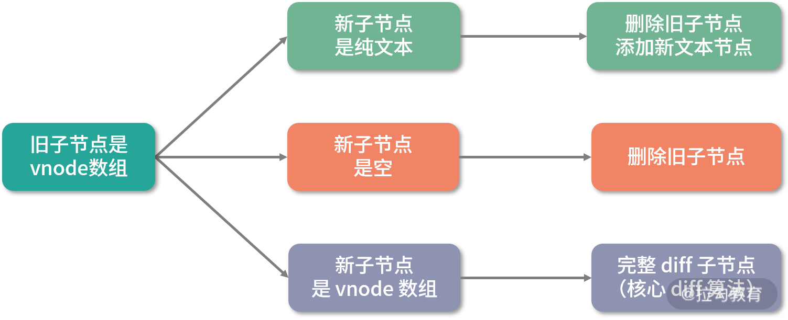

## 2.3 组件更新：完整的 DOM diff 流程是怎样的？（下）

### 核心 diff 算法

新子节点数组相对于旧子节点数组的变化，无非是通过更新、删除、添加和移动节点来完成，而核心 `diff` 算法，就是在已知旧子节点的 `DOM` 结构、`vnode` 和新子节点的 `vnode` 情况下，以较低的成本完成子节点的更新为目的，求解生成新子节点 `DOM` 的系列操作。

为了方便理解，先举个例子，假设有这样一个列表：

```vue
<ul>
  <li key="a">a</li>
  <li key="b">b</li>
  <li key="c">c</li>
  <li key="d">d</li>
</ul>
```

然后在中间插入一行，得到一个新列表：

```vue
<ul>
  <li key="a">a</li>
  <li key="b">b</li>
  <li key="e">e</li>
  <li key="c">c</li>
  <li key="d">d</li>
</ul>
```

在插入操作的前后，它们对应渲染生成的 `vnode` 可以用一张图表示：


从图中可以直观地感受到，差异主要在新子节点中的 `b` 节点后面多了一个 `e` 节点。

再把这个例子稍微修改一下，多添加一个 `e` 节点：

```vue
<ul>
  <li key="a">a</li>
  <li key="b">b</li>
  <li key="c">c</li>
  <li key="d">d</li>
  <li key="e">e</li>
</ul>
```

然后我们删除中间一项，得到一个新列表：

```vue
<ul>
  <li key="a">a</li>
  <li key="b">b</li>
  <li key="d">d</li>
  <li key="e">e</li>
</ul>
```

在删除操作的前后，它们对应渲染生成的 `vnode` 可以用一张图表示：

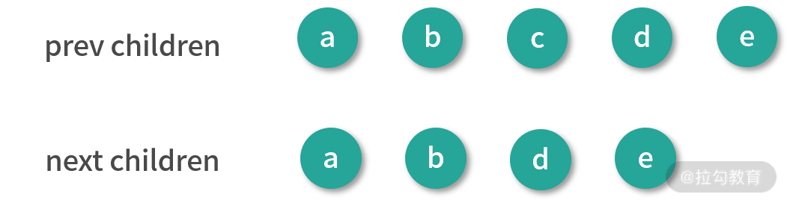

可以看到，这时差异主要在新子节点中的 `b` 节点后面少了一个 `c` 节点。

综合这两个例子，我们很容易发现新旧 `children` 拥有相同的头尾节点。对于相同的节点，我们只需要做对比更新即可，所以 diff 算法的第一步**从头部开始同步**。

#### 同步头部节点

先来看一下头部节点同步的实现代码：

```javascript
const patchKeyedChildren = (c1, c2, container, parentAnchor, parentComponent, parentSuspense, isSVG, optimized) => {
  let i = 0
  const l2 = c2.length
  // 旧子节点的尾部索引
  let e1 = c1.length - 1
  // 新子节点的尾部索引
  let e2 = l2 - 1
  // 1. 从头部开始同步
  // i = 0, e1 = 3, e2 = 4
  // (a b) c d
  // (a b) e c d
  while (i <= e1 && i <= e2) {
    const n1 = c1[i]
    const n2 = c2[i]
    if (isSameVNodeType(n1, n2)) {
      // 相同的节点，递归执行 patch 更新节点
      patch(n1, n2, container, parentAnchor, parentComponent, parentSuspense, isSVG, optimized)
    }
    else {
      break
    }
    i++
  }
}
```

在整个 diff 的过程，需要维护几个变量：头部的索引 `i`、旧子节点的尾部索引 `e1`和新子节点的尾部索引 `e2`。

同步头部节点就是从头部开始，依次对比新节点和旧节点，如果它们相同的则执行 `patch` 更新节点；如果不同或者索引 `i` 大于索引 `e1` 或者 `e2`，则同步过程结束。

我们拿第一个例子来说，通过下图看一下同步头部节点后的结果：


可以看到，完成头部节点同步后：`i` 是 2，`e1` 是 3，`e2` 是 4。

#### 同步尾部节点

接着从尾部开始**同步尾部节点**，实现代码如下：

```javascript
const patchKeyedChildren = (c1, c2, container, parentAnchor, parentComponent, parentSuspense, isSVG, optimized) => {
  let i = 0
  const l2 = c2.length
  // 旧子节点的尾部索引
  let e1 = c1.length - 1
  // 新子节点的尾部索引
  let e2 = l2 - 1
  // 1. 从头部开始同步
  // i = 0, e1 = 3, e2 = 4
  // (a b) c d
  // (a b) e c d
  // 2. 从尾部开始同步
  // i = 2, e1 = 3, e2 = 4
  // (a b) (c d)
  // (a b) e (c d)
  while (i <= e1 && i <= e2) {
    const n1 = c1[e1]
    const n2 = c2[e2]
    if (isSameVNodeType(n1, n2)) {
      patch(n1, n2, container, parentAnchor, parentComponent, parentSuspense, isSVG, optimized)
    }
    else {
      break
    }
    e1--
    e2--
  }
}
```

同步尾部节点就是从尾部开始，依次对比新节点和旧节点，如果相同的则执行 `patch` 更新节点；如果不同或者索引 `i` 大于索引 `e1` 或者 `e2`，则同步过程结束。

我们来通过下图看一下同步尾部节点后的结果：


可以看到，完成尾部节点同步后：`i` 是 2，`e1` 是 1，`e2` 是 2。

接下来只有 3 种情况要处理：

- **新子节点有剩余要添加的新节点；**
- **旧子节点有剩余要删除的多余节点；**
- **未知子序列。**

继续看一下具体是怎样操作的。

#### 添加新的节点

首先要判断新子节点是否有剩余的情况，如果满足则添加新子节点，实现代码如下：

```javascript
const patchKeyedChildren = (c1, c2, container, parentAnchor, parentComponent, parentSuspense, isSVG, optimized) => {
  let i = 0
  const l2 = c2.length
  // 旧子节点的尾部索引
  let e1 = c1.length - 1
  // 新子节点的尾部索引
  let e2 = l2 - 1
  // 1. 从头部开始同步
  // i = 0, e1 = 3, e2 = 4
  // (a b) c d
  // (a b) e c d
  // ...
  // 2. 从尾部开始同步
  // i = 2, e1 = 3, e2 = 4
  // (a b) (c d)
  // (a b) e (c d)
  // 3. 挂载剩余的新节点
  // i = 2, e1 = 1, e2 = 2
  if (i > e1) {
    if (i <= e2) {
      const nextPos = e2 + 1
      const anchor = nextPos < l2 ? c2[nextPos].el : parentAnchor
      while (i <= e2) {
        // 挂载新节点
        patch(null, c2[i], container, anchor, parentComponent, parentSuspense, isSVG)
        i++
      }
    }
  }
}
```

如果索引 `i` 大于尾部索引 `e1` 且 `i` 小于 `e2`，那么从索引 `i` 开始到索引 `e2` 之间，直接挂载新子树这部分的节点。

对上面的例子而言，同步完尾部节点后 `i` 是 `2`，e1 是 `1`，e2 是 `2`，此时满足条件需要添加新的节点，通过下图看一下添加后的结果：


#### 删除多余节点

如果不满足添加新节点的情况，就要接着判断旧子节点是否有剩余，如果满足则删除旧子节点，实现代码如下：

```javascript
const patchKeyedChildren = (c1, c2, container, parentAnchor, parentComponent, parentSuspense, isSVG, optimized) => {
  let i = 0
  const l2 = c2.length
  // 旧子节点的尾部索引
  let e1 = c1.length - 1
  // 新子节点的尾部索引
  let e2 = l2 - 1
  // 1. 从头部开始同步
  // i = 0, e1 = 4, e2 = 3
  // (a b) c d e
  // (a b) d e
  // ...
  // 2. 从尾部开始同步
  // i = 2, e1 = 4, e2 = 3
  // (a b) c (d e)
  // (a b) (d e)
  // 3. 普通序列挂载剩余的新节点
  // i = 2, e1 = 2, e2 = 1
  // 不满足
  if (i > e1) {
  }
  // 4. 普通序列删除多余的旧节点
  // i = 2, e1 = 2, e2 = 1
  else if (i > e2) {
    while (i <= e1) {
      // 删除节点
      unmount(c1[i], parentComponent, parentSuspense, true)
      i++
    }
  }
}
```

如果索引 `i` 大于尾部索引 `e2`，那么从索引 `i` 开始到索引 `e1` 之间，我们直接删除旧子树这部分的节点。

第二个例子是就删除节点的情况，我们从同步头部节点开始，用图的方式演示这一过程。

首先从头部同步节点：

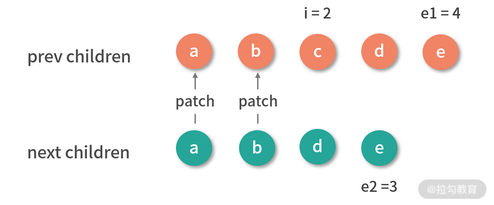

此时的结果：`i` 是 2，`e1` 是 4，`e2` 是 3。

接着从尾部同步节点：

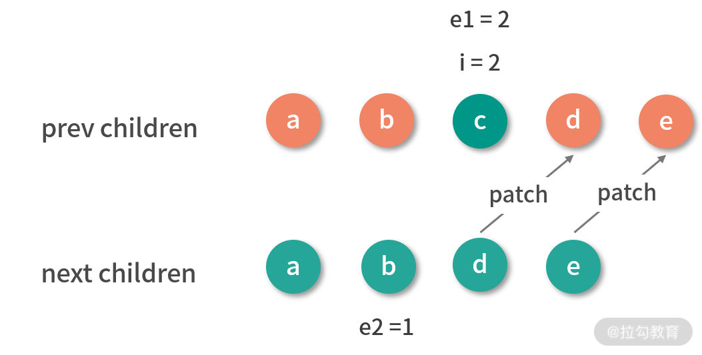

此时的结果：`i` 是 2，`e1` 是 2，`e2` 是 1，满足删除条件，因此删除子节点中的多余节点：

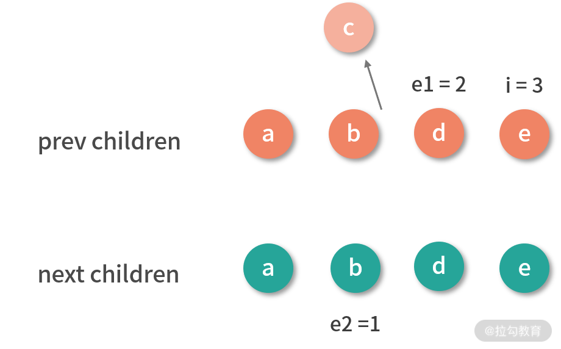

#### 处理未知子序列

单纯的添加和删除节点都是比较理想的情况，操作起来也很容易，但是有些时候并非这么幸运，也会遇到比较复杂的未知子序列，这时候 `diff` 算法会怎么做呢？

再通过例子来演示存在未知子序列的情况，假设一个按照字母表排列的列表：

```vue
<ul>
  <li key="a">a</li>
  <li key="b">b</li>
  <li key="c">c</li>
  <li key="d">d</li>
  <li key="e">e</li>
  <li key="f">f</li>
  <li key="g">g</li>
  <li key="h">h</li>
</ul>
```

然后打乱之前的顺序得到一个新列表：

```vue
<ul>
  <li key="a">a</li>
  <li key="b">b</li>
  <li key="e">e</li>
  <li key="d">c</li>
  <li key="c">d</li>
  <li key="i">i</li>
  <li key="g">g</li>
  <li key="h">h</li>
</ul>
```

在操作前，它们对应渲染生成的 `vnode` 可以用一张图表示：


还是从同步头部节点开始，用图的方式演示这一过程。

首先从头部同步节点：


同步头部节点后的结果：`i` 是 2，`e1` 是 7，`e2` 是 7。

接着从尾部同步节点：

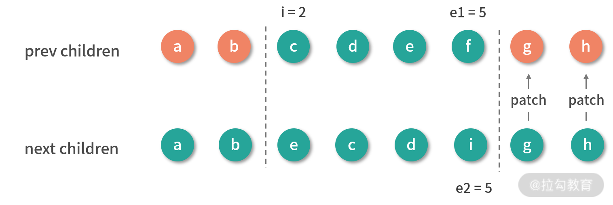

同步尾部节点后的结果：`i` 是 2，`e1` 是 5，`e2` 是 5。可以看到它既不满足添加新节点的条件，也不满足删除旧节点的条件。那么对于这种情况，应该怎么处理呢？

结合上图可以知道，要把旧子节点的 `c、d、e、f` 转变成新子节点的 `e、c、d、i`。从直观上看，我们把 `e` 节点移动到 `c` 节点前面，删除 `f` 节点，然后在 `d` 节点后面添加 `i` 节点即可。

**其实无论多复杂的情况，最终无非都是通过更新、删除、添加、移动这些动作来操作节点，而我们要做的就是找到相对优的解。**

**当两个节点类型相同时，我们执行更新操作；当新子节点中没有旧子节点中的某些节点时，我们执行删除操作；当新子节点中多了旧子节点中没有的节点时，我们执行添加操作，这些操作我们在前面已经阐述清楚了。相对来说这些操作中最麻烦的就是移动，我们既要判断哪些节点需要移动也要清楚如何移动。**

##### 移动子节点

**那么什么时候需要移动呢，就是当子节点排列顺序发生变化的时候**，举个简单的例子具体看一下：

```javascript
var prev = [1, 2, 3, 4, 5, 6]

var next = [1, 3, 2, 6, 4, 5]
```

可以看到，从 `prev` 变成 `next`，数组里的一些元素的顺序发生了变化，我们可以把子节点类比为元素，现在问题就简化为我们如何用最少的移动使元素顺序从 `prev` 变化为 `next` 。

一种思路是在 `next` 中找到一个递增子序列，比如 `[1, 3, 6]` 、`[1, 2, 4, 5]`。之后对 `next` 数组进行倒序遍历，移动所有不在递增序列中的元素即可。

如果选择了 `[1, 3, 6]` 作为递增子序列，那么在倒序遍历的过程中，遇到 `6、3、1` 不动，遇到 `5、4、2` 移动即可，如下图所示：

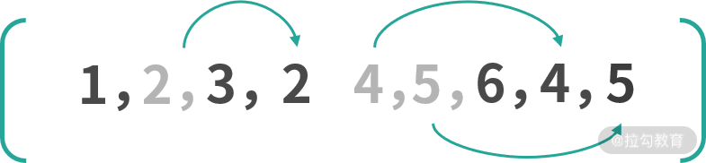

如果选择了 `[1, 2, 4, 5]` 作为递增子序列，那么在倒序遍历的过程中，遇到 `5、4、2、1` 不动，遇到 `6、3` 移动即可，如下图所示：

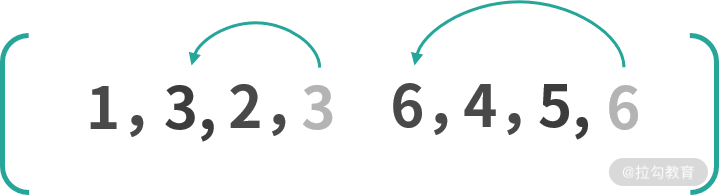

**可以看到第一种移动了三次，而第二种只移动了两次，递增子序列越长，所需要移动元素的次数越少，所以如何移动的问题就回到了求解最长递增子序列的问题。**稍后会详细讲求解最长递增子序列的算法，所以先回到这里的问题，对未知子序列的处理。

现在要做的是在新旧子节点序列中找出相同节点并更新，找出多余的节点删除，找出新的节点添加，找出是否有需要移动的节点，如果有该如何移动。

**在查找过程中需要对比新旧子序列，那么我们就要遍历某个序列，如果在遍历旧子序列的过程中需要判断某个节点是否在新子序列中存在，这就需要双重循环，而双重循环的复杂度是 O(n2) ，为了优化这个复杂度，我们可以用一种空间换时间的思路，建立索引图，把时间复杂度降低到 O(n)。**

##### 建立索引图

所以处理未知子序列的第一步，就是建立索引图。

**通常在开发过程中， 会给 v-for 生成的列表中的每一项分配唯一 key 作为项的唯一 ID，这个 key 在 diff 过程中起到很关键的作用。对于新旧子序列中的节点，认为 key 相同的就是同一个节点，直接执行 patch 更新即可。**

根据 key 建立新子序列的索引图，实现如下：

```javascript
const patchKeyedChildren = (c1, c2, container, parentAnchor, parentComponent, parentSuspense, isSVG, optimized) => {
  let i = 0
  const l2 = c2.length
  // 旧子节点的尾部索引
  let e1 = c1.length - 1
  // 新子节点的尾部索引
  let e2 = l2 - 1
  // 1. 从头部开始同步
  // i = 0, e1 = 7, e2 = 7
  // (a b) c d e f g h
  // (a b) e c d i g h
  // 2. 从尾部开始同步
  // i = 2, e1 = 7, e2 = 7
  // (a b) c d e f (g h)
  // (a b) e c d i (g h)
  // 3. 普通序列挂载剩余的新节点， 不满足
  // 4. 普通序列删除多余的旧节点，不满足
  // i = 2, e1 = 4, e2 = 5
  // 旧子序列开始索引，从 i 开始记录
  const s1 = i
  // 新子序列开始索引，从 i 开始记录
  const s2 = i //
  // 5.1 根据 key 建立新子序列的索引图
  const keyToNewIndexMap = new Map()
  for (i = s2; i <= e2; i++) {
    const nextChild = c2[i]
    keyToNewIndexMap.set(nextChild.key, i)
  }
}
```

新旧子序列是从 `i` 开始的，所以我们先用 `s1、s2` 分别作为新旧子序列的开始索引，接着建立一个 `keyToNewIndexMap` 的 `Map<key, index>` 结构，遍历新子序列，把节点的 `key` 和 `index` 添加到这个 `Map` 中，注意这里假设所有节点都是有 `key` 标识的。

`keyToNewIndexMap` 存储的就是新子序列中每个节点在新子序列中的索引，示例处理后的结果如下图所示：

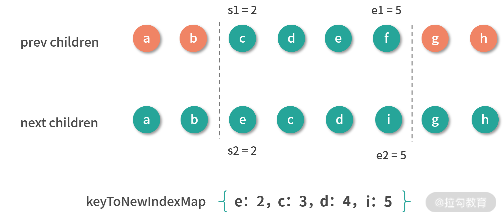

我们得到了一个值为 `{e:2,c:3,d:4,i:5}` 的新子序列索引图。

##### 更新和移除旧节点

接下来，就需要遍历旧子序列，有相同的节点就通过 `patch` 更新，并且移除那些不在新子序列中的节点，同时找出是否有需要移动的节点，来看一下这部分逻辑的实现：

```javascript
const patchKeyedChildren = (c1, c2, container, parentAnchor, parentComponent, parentSuspense, isSVG, optimized) => {
  let i = 0
  const l2 = c2.length
  // 旧子节点的尾部索引
  let e1 = c1.length - 1
  // 新子节点的尾部索引
  let e2 = l2 - 1
  // 1. 从头部开始同步
  // i = 0, e1 = 7, e2 = 7
  // (a b) c d e f g h
  // (a b) e c d i g h
  // 2. 从尾部开始同步
  // i = 2, e1 = 7, e2 = 7
  // (a b) c d e f (g h)
  // (a b) e c d i (g h)
  // 3. 普通序列挂载剩余的新节点，不满足
  // 4. 普通序列删除多余的旧节点，不满足
  // i = 2, e1 = 4, e2 = 5
  // 旧子序列开始索引，从 i 开始记录
  const s1 = i
  // 新子序列开始索引，从 i 开始记录
  const s2 = i
  // 5.1 根据 key 建立新子序列的索引图
  // 5.2 正序遍历旧子序列，找到匹配的节点更新，删除不在新子序列中的节点，判断是否有移动节点
  // 新子序列已更新节点的数量
  let patched = 0
  // 新子序列待更新节点的数量，等于新子序列的长度
  const toBePatched = e2 - s2 + 1
  // 是否存在要移动的节点
  let moved = false
  // 用于跟踪判断是否有节点移动
  let maxNewIndexSoFar = 0
  // 这个数组存储新子序列中的元素在旧子序列节点的索引，用于确定最长递增子序列
  const newIndexToOldIndexMap = new Array(toBePatched)
  // 初始化数组，每个元素的值都是 0
  // 0 是一个特殊的值，如果遍历完了仍有元素的值为 0，则说明这个新节点没有对应的旧节点
  for (i = 0; i < toBePatched; i++)
    newIndexToOldIndexMap[i] = 0
  // 正序遍历旧子序列
  for (i = s1; i <= e1; i++) {
    // 拿到每一个旧子序列节点
    const prevChild = c1[i]
    if (patched >= toBePatched) {
      // 所有新的子序列节点都已经更新，剩余的节点删除
      unmount(prevChild, parentComponent, parentSuspense, true)
      continue
    }
    // 查找旧子序列中的节点在新子序列中的索引
    let newIndex = keyToNewIndexMap.get(prevChild.key)
    if (newIndex === undefined) {
      // 找不到说明旧子序列已经不存在于新子序列中，则删除该节点
      unmount(prevChild, parentComponent, parentSuspense, true)
    }
    else {
      // 更新新子序列中的元素在旧子序列中的索引，这里加 1 偏移，是为了避免 i 为 0 的特殊情况，影响对后续最长递增子序列的求解
      newIndexToOldIndexMap[newIndex - s2] = i + 1
      // maxNewIndexSoFar 始终存储的是上次求值的 newIndex，如果不是一直递增，则说明有移动
      if (newIndex >= maxNewIndexSoFar) {
        maxNewIndexSoFar = newIndex
      }
      else {
        moved = true
      }
      // 更新新旧子序列中匹配的节点
      patch(prevChild, c2[newIndex], container, null, parentComponent, parentSuspense, isSVG, optimized)
      patched++
    }
  }
}
```

**建立了一个 `newIndexToOldIndexMap` 的数组，来存储新子序列节点的索引和旧子序列节点的索引之间的映射关系，用于确定最长递增子序列，这个数组的长度为新子序列的长度，每个元素的初始值设为 0， 它是一个特殊的值，如果遍历完了仍有元素的值为 0，则说明遍历旧子序列的过程中没有处理过这个节点，这个节点是新添加的。**

下面说说具体的操作过程：**正序遍历旧子序列，根据前面建立的 `keyToNewIndexMap` 查找旧子序列中的节点在新子序列中的索引，如果找不到就说明新子序列中没有该节点，就删除它；如果找得到则将它在旧子序列中的索引更新到 `newIndexToOldIndexMap` 中。**

注意这里索引加了长度为 1 的偏移，是为了应对 `i` 为 0 的特殊情况，如果不这样处理就会影响后续求解最长递增子序列。

**遍历过程中，用变量 `maxNewIndexSoFar` 跟踪判断节点是否移动，`maxNewIndexSoFar` 始终存储的是上次求值的 `newIndex`，一旦本次求值的 `newIndex` 小于 `maxNewIndexSoFar`，这说明顺序遍历旧子序列的节点在新子序列中的索引并不是一直递增的，也就说明存在移动的情况。**

除此之外，这个过程中我们也会更新新旧子序列中匹配的节点，另外如果所有新的子序列节点都已经更新，而对旧子序列遍历还未结束，说明剩余的节点就是多余的，删除即可。

至此，完成了新旧子序列节点的更新、多余旧节点的删除，并且建立了一个 `newIndexToOldIndexMap` 存储新子序列节点的索引和旧子序列节点的索引之间的映射关系，并确定是否有移动。

示例处理后的结果如下图所示：

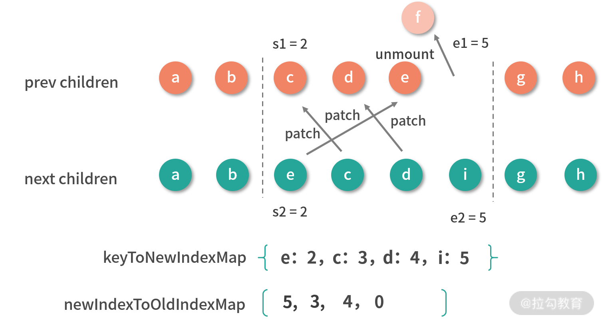

可以看到， `c、d、e` 节点被更新，`f` 节点被删除，`newIndexToOldIndexMap` 的值为 [5, 3, 4 ,0]，此时 `moved` 也为 `true`，也就是存在节点移动的情况。

##### 移动和挂载新节点

接下来，就到了处理未知子序列的最后一个流程，移动和挂载新节点，来看一下这部分逻辑的实现：

```javascript
const patchKeyedChildren = (c1, c2, container, parentAnchor, parentComponent, parentSuspense, isSVG, optimized) => {
  let i = 0
  const l2 = c2.length
  // 旧子节点的尾部索引
  let e1 = c1.length - 1
  // 新子节点的尾部索引
  let e2 = l2 - 1
  // 1. 从头部开始同步
  // i = 0, e1 = 6, e2 = 7
  // (a b) c d e f g
  // (a b) e c d h f g
  // 2. 从尾部开始同步
  // i = 2, e1 = 6, e2 = 7
  // (a b) c (d e)
  // (a b) (d e)
  // 3. 普通序列挂载剩余的新节点， 不满足
  // 4. 普通序列删除多余的节点，不满足
  // i = 2, e1 = 4, e2 = 5
  // 旧子节点开始索引，从 i 开始记录
  const s1 = i
  // 新子节点开始索引，从 i 开始记录
  const s2 = i //
  // 5.1 根据 key 建立新子序列的索引图
  // 5.2 正序遍历旧子序列，找到匹配的节点更新，删除不在新子序列中的节点，判断是否有移动节点
  // 5.3 移动和挂载新节点
  // 仅当节点移动时生成最长递增子序列
  const increasingNewIndexSequence = moved
    ? getSequence(newIndexToOldIndexMap)
    : EMPTY_ARR
  let j = increasingNewIndexSequence.length - 1
  // 倒序遍历以便我们可以使用最后更新的节点作为锚点
  for (i = toBePatched - 1; i >= 0; i--) {
    const nextIndex = s2 + i
    const nextChild = c2[nextIndex]
    // 锚点指向上一个更新的节点，如果 nextIndex 超过新子节点的长度，则指向 parentAnchor
    const anchor = nextIndex + 1 < l2 ? c2[nextIndex + 1].el : parentAnchor
    if (newIndexToOldIndexMap[i] === 0) {
      // 挂载新的子节点
      patch(null, nextChild, container, anchor, parentComponent, parentSuspense, isSVG)
    }
    else if (moved) {
      // 没有最长递增子序列（reverse 的场景）或者当前的节点索引不在最长递增子序列中，需要移动
      if (j < 0 || i !== increasingNewIndexSequence[j]) {
        move(nextChild, container, anchor, 2)
      }
      else {
        // 倒序递增子序列
        j--
      }
    }
  }
}
```

前面已经判断了是否移动，如果 `moved` 为 `true` 就通过 `getSequence(newIndexToOldIndexMap)` 计算最长递增子序列，这部分算法会在后文详细介绍。

**接着采用倒序的方式遍历新子序列，因为倒序遍历可以方便我们使用最后更新的节点作为锚点。在倒序的过程中，锚点指向上一个更新的节点，然后判断 `newIndexToOldIndexMap[i]` 是否为 0，如果是则表示这是新节点，就需要挂载它；接着判断是否存在节点移动的情况，如果存在的话则看节点的索引是不是在最长递增子序列中，如果在则倒序最长递增子序列，否则把它移动到锚点的前面。**

**为了便于更直观地理解，用前面的例子展示一下这个过程，此时 `toBePatched（新子序列待更新节点的数量）` 的值为 4，`j（最长递增子序列长度减一，当j<0时，说明没有最长递增子序列）` 的值为 1，最长递增子序列 `increasingNewIndexSequence` 的值是 `[1, 2]`。在倒序新子序列的过程中，首先遇到节点 `i`，发现它在 `newIndexToOldIndexMap` 中的值是 0，则说明它是新节点，我们需要挂载它；然后继续遍历遇到节点 `d`，因为 `moved` 为 `true`，且 `d` 的索引存在于最长递增子序列中，则执行 `j--` 倒序最长递增子序列，`j` 此时为 0；接着继续遍历遇到节点 c，它和 d 一样，索引也存在于最长递增子序列中，则执行 `j--`，`j` 此时为 -1；接着继续遍历遇到节点 e，此时 j 是 -1 并且 e 的索引也不在最长递增子序列中，所以做一次移动操作，把 `e` 节点移到上一个更新的节点，也就是 `c` 节点的前面。**

新子序列倒序完成，即完成了新节点的插入和旧节点的移动操作，也就完成了整个核心 diff 算法对节点的更新。

示例处理后的结果如下图所示：


可以看到新子序列中的新节点 `i` 被挂载，旧子序列中的节点 `e` 移动到了 `c` 节点前面，至此，就在已知旧子节点 `DOM` 结构和 `vnode`、新子节点 `vnode` 的情况下，求解出生成新子节点的 `DOM` 的更新、移动、删除、新增等系列操作，并且以一种较小成本的方式完成 `DOM` 更新。

知道了子节点更新调用的是 `patch` 方法， `Vue.js` 正是通过这种递归的方式完成了整个组件树的更新。

核心 diff 算法中最复杂就是求解最长递增子序列，下面再来详细学习一下这个算法。

##### 最长递增子序列

求解最长递增子序列是一道经典的算法题，多数解法是使用动态规划的思想，算法的时间复杂度是 `O(n2)`，而 `Vue.js` 内部使用的是维基百科提供的一套“贪心 + 二分查找”的算法，贪心算法的时间复杂度是 `O(n)`，二分查找的时间复杂度是 `O(logn)`，所以它的总时间复杂度是 `O(nlogn)`。

单纯地看代码并不好理解，我们用示例来看一下这个子序列的求解过程。

假设有这个样一个数组 `arr：[2, 1, 5, 3, 6, 4, 8, 9, 7]`，求解它最长递增子序列的步骤如下：


最终求得最长递增子序列的值就是 `[1, 3, 4, 8, 9]`。

通过演示可以得到这个算法的主要思路：对数组遍历，依次求解长度为 `i` 时的最长递增子序列，当 `i` 元素大于 `i - 1` 的元素时，添加 `i` 元素并更新最长子序列；否则往前查找直到找到一个比 `i` 小的元素，然后插在该元素后面并更新对应的最长递增子序列。

这种做法的主要目的是让递增序列的差尽可能的小，从而可以获得更长的递增子序列，这便是一种贪心算法的思想。

了解了算法的大致思想后，接下来看一下源码实现：

```javascript
function getSequence (arr) {
  const p = arr.slice()
  const result = [0]
  let i, j, u, v, c
  const len = arr.length
  for (i = 0; i < len; i++) {
    const arrI = arr[i]
    if (arrI !== 0) {
      j = result[result.length - 1]
      if (arr[j] < arrI) {
        // 存储在 result 更新前的最后一个索引的值
        p[i] = j
        result.push(i)
        continue
      }
      u = 0
      v = result.length - 1
      // 二分搜索，查找比 arrI 小的节点，更新 result 的值
      while (u < v) {
        c = ((u + v) / 2) | 0
        if (arr[result[c]] < arrI) {
          u = c + 1
        }
        else {
          v = c
        }
      }
      if (arrI < arr[result[u]]) {
        if (u > 0) {
          p[i] = result[u - 1]
        }
        result[u] = i
      }
    }
  }
  u = result.length
  v = result[u - 1]
  // 回溯数组 p，找到最终的索引
  while (u-- > 0) {
    result[u] = v
    v = p[v]
  }
  return result
}
```

其中 `result` 存储的是长度为 `i` 的递增子序列最小末尾值的索引。比如我们上述例子的第九步，在对数组 `p` 回溯之前， `result` 值就是 `[1, 3, 4, 7, 9]` ，这不是最长递增子序列，它只是存储的对应长度递增子序列的最小末尾。因此在整个遍历过程中会额外用一个数组 `p`，来存储在每次更新 `result` 前最后一个索引的值，并且它的 `key` 是这次要更新的 `result` 值：

```javascript
j = result[result.length - 1]

p[i] = j

result.push(i)
```

可以看到，`result` 添加的新值 `i` 是作为 `p` 存储 `result` 最后一个值 `j` 的 `key`。上述例子遍历后 `p` 的结果如图所示：

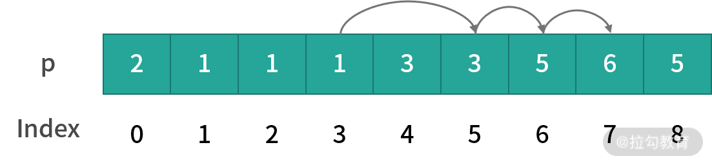

从 `result` 最后一个元素 9 对应的索引 7 开始回溯，可以看到 `p[7] = 6，p[6] = 5，p[5] = 3，p[3] = 1`，所以通过对 `p` 的回溯，得到最终的 `result` 值是 `[1, 3 ,5 ,6 ,7]`，也就找到最长递增子序列的最终索引了。这里要注意，求解的是最长子序列索引值，它的每个元素其实对应的是数组的下标。对于我们的例子而言，`[2, 1, 5, 3, 6, 4, 8, 9, 7]` 的最长子序列是 `[1, 3, 4, 8, 9]`，而求解的 `[1, 3 ,5 ,6 ,7]` 就是最长子序列中元素在原数组中的下标所构成的新数组。

### 总结

以上主要分析了组件的更新流程，知道了 `Vue.js` 的更新粒度是组件级别的，并且 `Vue.js` 在 `patch` 某个组件的时候，如果遇到组件这类抽象节点，在某些条件下也会触发子组件的更新。

对于普通元素节点的更新，主要是更新一些属性，以及它的子节点。子节点的更新又分为多种情况，其中最复杂的情况为数组到数组的更新，内部又根据不同情况分成几个流程去 `diff`，遇到需要移动的情况还要去求解子节点的最长递增子序列。

整个更新过程还是利用了树的深度遍历，递归执行 `patch` 方法，最终完成了整个组件树的更新。

通过下图可以更加直观感受组件的更新流程：

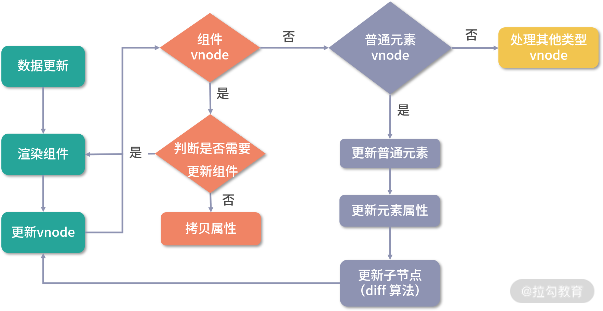

### 问题

**问：**使用 `v-for` 编写列表的时候 `key` 能用遍历索引 `index` 表示吗，为什么？

**答：**在一个列表中，使用`index`来当`key`值在进行排序或删除操作的时候，那么根据`key`建立的索引图会导致重新绑定，使得`diff`算法重新`patch`，那么会导致不必要的`patch`和渲染，有时候还会导致明明删除的指定的元素，但却删除了另一个元素的问题。静态数据 `v-for` 是可以的，因为未涉及到 `DOM` 的更新。

举个例子：`oldVnode`列表的key值和元素文本节点关系为0 - 1, 1 - 2, 2 - 3。此时我进行了`reverse`操作，那么此时的关系为0 - 3, 1 - 2, 2 - 1，由于key值相同的`vnode`是同一个节点，那么此时这三个`newVnode`需要进行建立索引图-`patch` - 重新建立索引图- 依次update -Re render。如果key值不是用index索引做值的话，`diff`算法在进行`patch`时，由于key到元素没有变化(索引图没有变化)，那么`diff`算法只会做必要的操作(删除或移动`Vnode`)，这样就大大的减少了不必要的patch和渲染。综上，个人认为如果静态数据 v-for的话，是可以使用`index`作为元素的`key`值的，反之，需要使用唯一的值来作为`key`值。

**问：**`Vue3`的`diff`算法和`vue2`的对比有什么优势么？

**答：**`Vue 3 diff` 算法的主要优势是设计了 `Block` 的概念，在编译阶段对静态模板分析，生成 `Block tree`，收集动态更新的节点，然后在 `patch` 阶段就可以只比对 `Block tree` 中的节点，达到提升 `diff` 性能的目的。而核心 `diff` 算法，也就是去头尾的最长递增子序列算法和双端比较算法就性能而言差别并不大。

# 三、`Composition API`设计

**`Vue.js 3.0` 设计了一个很强大的 `API —— Composition API`，它主要用来优化代码逻辑的组织和复用。**

从语法上看，它提供了一个 `setup` 启动函数作为逻辑组织的入口，暴露了响应式 `API` 为用户所用，也提供了生命周期函数以及依赖注入的接口，这让我们不依托于 `Options API` 也可以完成一个组件的开发，并且更有利于代码逻辑的组织和复用。

但是要明确一点，`Composition API` 属于 `API` 的增强，它并不是 `Vue.js 3.0` 组件开发的范式，如果你的组件足够简单，你还是可以使用 `Options API`。

了解了 `Composition API` 的应用场景和使用方式后，需要进一步思考，这样一套 API 是如何设计出来的？它是怎么和组件配合的？在组件整个渲染过程中它又做了哪些事情？带着这些疑问，一起来探索 Composition API 的实现原理。

## 3.1 Setup：组件渲染前的初始化过程是怎样的？

`Vue.js 3.0` 允许我们在编写组件的时候添加一个 `setup` 启动函数，它是 `Composition API` 逻辑组织的入口。

先通过一段代码认识它，在这里编写一个 button 组件：

```vue
<template>
  <button @click="increment">
    Count is: {{ state.count }}, double is: {{ state.double }}
  </button>
</template>
<script>
import { reactive, computed } from 'vue'
export default {
  setup() {
    const state = reactive({
      count: 0,
      double: computed(() => state.count * 2)
    })
    function increment() {
      state.count++
    }
    return {
      state,
      increment
    }
  }
}
</script>
```

可以看到，这段代码和 `Vue.js 2.x` 组件的写法相比，多了一个 `setup` 启动函数，另外组件中也没有定义 props、data、computed 这些 `options`。

在 `setup` 函数内部，定义了一个响应式对象 `state`，它是通过 `reactive API` 创建的。`state` 对象有 `count` 和 `double` 两个属性，其中 `count` 对应一个数字属性的值；而`double` 通过 `computed API` 创建，对应一个计算属性的值。`reactive API` 和 `computed` API 不是目前关注的重点，在后续响应式章节会详细介绍。

这里需要注意的是，**模板中引用到的变量 state 和 increment 包含在 setup 函数的返回对象中，那么它们是如何建立联系的呢？**

我们先来回想一下 `Vue.js 2.x` 编写组件的时候，会在 `props、data、methods、computed` 等 `options` 中定义一些变量。在组件初始化阶段，`Vue.js` 内部会处理这些 `options`，即把定义的变量添加到了组件实例上。等模板编译成 `render` 函数的时候，内部通过 `with(this){}` 的语法去访问在组件实例中的变量。

那么到了 `Vue.js 3.0`，既支持组件定义 `setup` 函数，而且在模板 `render` 的时候，又可以访问到 `setup` 函数返回的值，这是如何实现的？下面来一探究竟。

### 创建和设置组件实例

首先，我们来回顾一下组件的渲染流程：创建 `vnode` 、渲染 `vnode` 和生成 `DOM`。


其中渲染 `vnode` 的过程主要就是在挂载组件：

```javascript
const mountComponent = (initialVNode, container, anchor, parentComponent, parentSuspense, isSVG, optimized) => {
  // 创建组件实例
  const instance = (initialVNode.component = createComponentInstance(initialVNode, parentComponent, parentSuspense))
  // 设置组件实例
  setupComponent(instance)
  // 设置并运行带副作用的渲染函数
  setupRenderEffect(instance, initialVNode, container, anchor, parentSuspense, isSVG, optimized)
}
```

可以看到，这段挂载组件的代码主要做了三件事情：**创建组件实例、设置组件实例和设置并运行带副作用的渲染函数**。前两个流程就跟我们今天提到的问题息息相关，所以这一节课我们将重点分析它们。

#### 创建组件实例

先看**创建组件实例**的流程，我们要关注 **`createComponentInstance`** 方法的实现：

```javascript
function createComponentInstance (vnode, parent, suspense) {
  // 继承父组件实例上的 appContext，如果是根组件，则直接从根 vnode 中取。
  const appContext = (parent ? parent.appContext : vnode.appContext) || emptyAppContext;
  const instance = {
    // 组件唯一 id
    uid: uid++,
    // 组件 vnode
    vnode,
    // 父组件实例
    parent,
    // app 上下文
    appContext,
    // vnode 节点类型
    type: vnode.type,
    // 根组件实例
    root: null,
    // 新的组件 vnode
    next: null,
    // 子节点 vnode
    subTree: null,
    // 带副作用更新函数
    update: null,
    // 渲染函数
    render: null,
    // 渲染上下文代理
    proxy: null,
    // 带有 with 区块的渲染上下文代理
    withProxy: null,
    // 响应式相关对象
    effects: null,
    // 依赖注入相关
    provides: parent ? parent.provides : Object.create(appContext.provides),
    // 渲染代理的属性访问缓存
    accessCache: null,
    // 渲染缓存
    renderCache: [],
    // 渲染上下文
    ctx: EMPTY_OBJ,
    // data 数据
    data: EMPTY_OBJ,
    // props 数据
    props: EMPTY_OBJ,
    // 普通属性
    attrs: EMPTY_OBJ,
    // 插槽相关
    slots: EMPTY_OBJ,
    // 组件或者 DOM 的 ref 引用
    refs: EMPTY_OBJ,
    // setup 函数返回的响应式结果
    setupState: EMPTY_OBJ,
    // setup 函数上下文数据
    setupContext: null,
    // 注册的组件
    components: Object.create(appContext.components),
    // 注册的指令
    directives: Object.create(appContext.directives),
    // suspense 相关
    suspense,
    // suspense 异步依赖
    asyncDep: null,
    // suspense 异步依赖是否都已处理
    asyncResolved: false,
    // 是否挂载
    isMounted: false,
    // 是否卸载
    isUnmounted: false,
    // 是否激活
    isDeactivated: false,
    // 生命周期，before create
    bc: null,
    // 生命周期，created
    c: null,
    // 生命周期，before mount
    bm: null,
    // 生命周期，mounted
    m: null,
    // 生命周期，before update
    bu: null,
    // 生命周期，updated
    u: null,
    // 生命周期，unmounted
    um: null,
    // 生命周期，before unmount
    bum: null,
    // 生命周期, deactivated
    da: null,
    // 生命周期 activated
    a: null,
    // 生命周期 render triggered
    rtg: null,
    // 生命周期 render tracked
    rtc: null,
    // 生命周期 error captured
    ec: null,
    // 派发事件方法
    emit: null
  }
  // 初始化渲染上下文
  instance.ctx = { _: instance }
  // 初始化根组件指针
  instance.root = parent ? parent.root : instance
  // 初始化派发事件方法
  instance.emit = emit.bind(null, instance)
  return instance
}
```

从上述代码中可以看到，组件实例 `instance` 上定义了很多属性，你千万不要被这茫茫多的属性吓到，因为其中一些属性是为了实现某个场景或者某个功能所定义的，你只需要通过在代码中的注释大概知道它们是做什么的即可。

`Vue.js 2.x` 使用 `new Vue` 来初始化一个组件的实例，到了 `Vue.js 3.0`，我们直接通过创建对象去创建组件的实例。这两种方式并无本质的区别，都是引用一个对象，在整个组件的生命周期中去维护组件的状态数据和上下文环境。

创建好 `instance` 实例后，接下来就是设置它的一些属性。目前已完成了组件的上下文、根组件指针以及派发事件方法的设置。我们在后面会继续分析更多 `instance` 实例属性的设置逻辑。

#### 设置组件实例

接着是**组件实例的设置流程**，对 `setup` 函数的处理就在这里完成，我们来看一下 `setupComponent` 方法的实现：

```javascript
function setupComponent (instance, isSSR = false) {
  const { props, children, shapeFlag } = instance.vnode
  // 判断是否是一个有状态的组件
  const isStateful = shapeFlag & 4
  // 初始化 props
  initProps(instance, props, isStateful, isSSR)
  // 初始化 插槽
  initSlots(instance, children)
  // 设置有状态的组件实例
  const setupResult = isStateful
    ? setupStatefulComponent(instance, isSSR)
    : undefined
  return setupResult
}
```

可以看到，从组件 `vnode` 中获取了 `props、children、shapeFlag` 等属性，然后分别对 `props` 和插槽进行初始化，这两部分逻辑在后续的章节再详细分析。根据 `shapeFlag` 的值，我们可以判断这是不是一个有状态组件，如果是则要进一步去设置有状态组件的实例。

接下来要关注到 `setupStatefulComponent` 函数，它主要做了三件事：**创建渲染上下文代理、判断处理 setup 函数和完成组件实例设置**。它代码如下所示：

```javascript
function setupStatefulComponent (instance, isSSR) {
  const Component = instance.type
  // 创建渲染代理的属性访问缓存
  instance.accessCache = {}
  // 创建渲染上下文代理
  instance.proxy = new Proxy(instance.ctx, PublicInstanceProxyHandlers)
  // 判断处理 setup 函数
  const { setup } = Component
  if (setup) {
    // 如果 setup 函数带参数，则创建一个 setupContext
    const setupContext = (instance.setupContext =
      setup.length > 1 ? createSetupContext(instance) : null)
    // 执行 setup 函数，获取结果
    const setupResult = callWithErrorHandling(setup, instance, 0 /* SETUP_FUNCTION */, [instance.props, setupContext])
    // 处理 setup 执行结果
    handleSetupResult(instance, setupResult)
  }
  else {
    // 完成组件实例设置
    finishComponentSetup(instance)
  }
}
```

##### 创建渲染上下文代理

首先是创建渲染上下文代理的流程，它主要对 `instance.ctx` 做了代理。在分析实现前，我们需要思考一个问题，这里为什么需要代理呢？

其实在 `Vue.js 2.x` 中，也有类似的数据代理逻辑，比如 `props` 求值后的数据，实际上存储在 `this._props` 上，而 `data` 中定义的数据存储在 `this._data` 上。举个例子：

```javascript
<template>
  <p>{{ msg }}</p>
</template>
<script>
export default {
  data() {
    msg: 1
  }
}
</script>
```

在初始化组件的时候，`data` 中定义的 `msg` 在组件内部是存储在 `this._data` 上的，而模板渲染的时候访问 `this.msg`，实际上访问的是 `this._data.msg`，这是因为 `Vue.js 2.x` 在初始化 `data` 的时候，做了一层 `proxy` 代理。

**到了 `Vue.js 3.0`，为了方便维护，我们把组件中不同状态的数据存储到不同的属性中，比如存储到 `setupState、ctx、data、props` 中。我们在执行组件渲染函数的时候，为了方便用户使用，会直接访问渲染上下文 `instance.ctx` 中的属性，所以我们也要做一层 `proxy`，对渲染上下文 `instance.ctx` 属性的访问和修改，代理到对 `setupState、ctx、data、props` 中的数据的访问和修改。**

明确了代理的需求后，我们接下来就要分析 `proxy` 的几个方法： `get、set` 和 `has`。 

###### `get`

当我们**访问 `instance.ctx` 渲染上下文中的属性**时，就会**进入 `get` 函数**。我们来看一下它的实现：

```javascript
const PublicInstanceProxyHandlers = {
  get ({ _: instance }, key) {
    const { ctx, setupState, data, props, accessCache, type, appContext } = instance
    if (key[0] !== '$') {
      // setupState / data / props / ctx
      // 渲染代理的属性访问缓存中
      const n = accessCache[key]
      if (n !== undefined) {
        // 从缓存中取
        switch (n) {
          case 0: /* SETUP */
            return setupState[key]
          case 1 :/* DATA */
            return data[key]
          case 3 :/* CONTEXT */
            return ctx[key]
          case 2: /* PROPS */
            return props[key]
        }
      }
      else if (setupState !== EMPTY_OBJ && hasOwn(setupState, key)) {
        accessCache[key] = 0
        // 从 setupState 中取数据
        return setupState[key]
      }
      else if (data !== EMPTY_OBJ && hasOwn(data, key)) {
        accessCache[key] = 1
        // 从 data 中取数据
        return data[key]
      }
      else if (
        type.props &&
        hasOwn(normalizePropsOptions(type.props)[0], key)) {
        accessCache[key] = 2
        // 从 props 中取数据
        return props[key]
      }
      else if (ctx !== EMPTY_OBJ && hasOwn(ctx, key)) {
        accessCache[key] = 3
        // 从 ctx 中取数据
        return ctx[key]
      }
      else {
        // 都取不到
        accessCache[key] = 4
      }
    }
    const publicGetter = publicPropertiesMap[key]
    let cssModule, globalProperties
    // 公开的 $xxx 属性或方法
    if (publicGetter) {
      return publicGetter(instance)
    }
    else if (
      // css 模块，通过 vue-loader 编译的时候注入
      (cssModule = type.__cssModules) &&
      (cssModule = cssModule[key])) {
      return cssModule
    }
    else if (ctx !== EMPTY_OBJ && hasOwn(ctx, key)) {
      // 用户自定义的属性，也用 `$` 开头
      accessCache[key] = 3
      return ctx[key]
    }
    else if (
      // 全局定义的属性
      ((globalProperties = appContext.config.globalProperties),
        hasOwn(globalProperties, key))) {
      return globalProperties[key]
    }
    else if ((process.env.NODE_ENV !== 'production') &&
      currentRenderingInstance && key.indexOf('__v') !== 0) {
      if (data !== EMPTY_OBJ && key[0] === '$' && hasOwn(data, key)) {
        // 如果在 data 中定义的数据以 $ 开头，会报警告，因为 $ 是保留字符，不会做代理
        warn(`Property ${JSON.stringify(key)} must be accessed via $data because it starts with a reserved ` +
          `character and is not proxied on the render context.`)
      }
      else {
        // 在模板中使用的变量如果没有定义，报警告
        warn(`Property ${JSON.stringify(key)} was accessed during render ` +
          `but is not defined on instance.`)
      }
    }
  }
}
```

可以看到，函数首先判断 `key` 不以 `$` 开头的情况，这部分数据可能是 `setupState、data、props、ctx` 中的一种，其中 `data、props` 我们已经很熟悉了；`setupState` 就是 `setup` 函数返回的数据，稍后我们会详细说；`ctx` 包括了计算属性、组件方法和用户自定义的一些数据。

**如果 `key` 不以 `$` 开头，那么就依次判断 `setupState、data、props、ctx` 中是否包含这个 `key`，如果包含就返回对应值。注意这个判断顺序很重要**，**在 `key` 相同时它会决定数据获取的优先级**，举个例子：

```javascript
<template>
  <p>{{msg}}</p>
</template>
<script>
  import { ref } from 'vue'
  export default {
    data() {
      return {
        msg: 'msg from data'
      }
    },
    setup() {
      const msg = ref('msg from setup')
      return {
        msg
      }
    }
  }
</script>
```

我们在 `data` 和 `setup` 中都定义了 `msg` 变量，但最终输出到界面上的是`"msg from setup"`，这是因为 `setupState` 的判断优先级要高于 `data`。

**再回到 `get` 函数中，可以看到这里定义了 `accessCache` 作为渲染代理的属性访问缓存，它具体是干什么的呢？组件在渲染时会经常访问数据进而触发 `get` 函数，这其中最昂贵的部分就是多次调用 `hasOwn` 去判断 `key` 在不在某个类型的数据中，但是在普通对象上执行简单的属性访问相对要快得多。所以在第一次获取 `key` 对应的数据后，我们利用 `accessCache[key]` 去缓存数据，下一次再次根据 `key` 查找数据，我们就可以直接通过 `accessCache[key]` 获取对应的值，就不需要依次调用 `hasOwn` 去判断了。这也是一个性能优化的小技巧。**

如果 `key` 以 `$` 开头，那么接下来又会有一系列的判断，首先判断是不是 `Vue.js` 内部公开的 `$xxx` 属性或方法（比如 `$parent`）；然后判断是不是 `vue-loader` 编译注入的 `css` 模块内部的 `key`；接着判断是不是用户自定义以` $ `开头的 `key`；最后判断是不是全局属性。如果都不满足，就剩两种情况了，即在非生产环境下就会报两种类型的警告，第一种是在 `data` 中定义的数据以 `$` 开头的警告，因为 `$` 是保留字符，不会做代理；第二种是在模板中使用的变量没有定义的警告。

###### `set`

接下来是 `set `代理过程，当**修改 `instance.ctx` 渲染上下文中的属性**的时候，就会**进入 `set` 函数**。来看一下 `set` 函数的实现：

```javascript
const PublicInstanceProxyHandlers = {
  set ({ _: instance }, key, value) {
    const { data, setupState, ctx } = instance
    if (setupState !== EMPTY_OBJ && hasOwn(setupState, key)) {
      // 给 setupState 赋值
      setupState[key] = value
    }
    else if (data !== EMPTY_OBJ && hasOwn(data, key)) {
      // 给 data 赋值
      data[key] = value
    }
    else if (key in instance.props) {
      // 不能直接给 props 赋值
      (process.env.NODE_ENV !== 'production') &&
      warn(`Attempting to mutate prop "${key}". Props are readonly.`, instance)
      return false
    }
    if (key[0] === '$' && key.slice(1) in instance) {
      // 不能给 Vue 内部以 $ 开头的保留属性赋值
      (process.env.NODE_ENV !== 'production') &&
      warn(`Attempting to mutate public property "${key}". ` +
        `Properties starting with $ are reserved and readonly.`, instance)
      return false
    }
    else {
      // 用户自定义数据赋值
      ctx[key] = value
    }
    return true
  }
}
```

结合代码来看，函数主要做的事情就是对渲染上下文 `instance.ctx` 中的属性赋值，它实际上是代理到对应的数据类型中去完成赋值操作的。这里仍然要注意顺序问题，和 `get` 一样，优先判断 `setupState`，然后是 `data`，接着是 `props`。

>  注意，如果我们直接对 `props` 中的数据赋值，在非生产环境中会收到一条警告，这是因为直接修改 `props` 不符合数据单向流动的设计思想；如果对 `Vue.js` 内部以 `$` 开头的保留属性赋值，同样也会收到一条警告。

对之前的例子做点修改，添加一个方法：

```vue
<template>
  <p>{{ msg }}</p>
  <button @click="random">Random msg</button>
</template>
<script>
  import { ref } from 'vue'
  export default {
    data() {
      return {
        msg: 'msg from data'
      }
    },
    setup() {
      const msg = ref('msg from setup')
      return {
        msg
      }
    },
    methods: {
      random() {
        this.msg = Math.random()
      }
    }
  }
</script>
```

当点击按钮会执行 `random` 函数，这里的 `this` 指向的就是 `instance.ctx`，我们修改 `this.msg` 会触发 `set` 函数，所以最终修改的是 `setupState` 中的 `msg` 对应的值。

如果是用户自定义的数据，比如在 `created` 生命周期内定义的数据，它仅用于组件上下文的共享，如下所示：

```javascript
export default {
  created() {
    this.userMsg = 'msg from user'
  }
}
```

当执行 `this.userMsg` 赋值的时候，会触发 `set` 函数，最终 `userMsg` 会被保留到 `ctx` 中。

###### `has`

最后是 `has` 代理过程，当我们**判断属性是否存在于 `instance.ctx` 渲染上下文中**时，就**会进入 has 函数**，这个在平时项目中用的比较少，同样来举个例子，当执行 `created` 钩子函数中的 `'msg' in this` 时，就会触发 `has` 函数。

```javascript
export default {
  created () {
    console.log('msg' in this)
  }
}
```

下面我们来看一下 `has` 函数的实现：

```javascript
const PublicInstanceProxyHandlers = {
  has
    ({ _: { data, setupState, accessCache, ctx, type, appContext } }, key) {
    // 依次判断
    return (accessCache[key] !== undefined ||
      (data !== EMPTY_OBJ && hasOwn(data, key)) ||
      (setupState !== EMPTY_OBJ && hasOwn(setupState, key)) ||
      (type.props && hasOwn(normalizePropsOptions(type.props)[0], key)) ||
      hasOwn(ctx, key) ||
      hasOwn(publicPropertiesMap, key) ||
      hasOwn(appContext.config.globalProperties, key))
  }
}
```

这个函数的实现很简单，依次判断 `key` 是否存在于 `accessCache、data、setupState、props` 、用户数据、公开属性以及全局属性中，然后返回结果。

至此，我们就搞清楚了创建上下文代理的过程，让我们回到 `setupStatefulComponent` 函数中，接下来分析第二个流程——判断处理 `setup` 函数。

##### 判断处理 `setup` 函数

看一下整个逻辑涉及的代码：

```javascript
// 判断处理 setup 函数
const { setup } = Component
if (setup) {
  // 如果 setup 函数带参数，则创建一个 setupContext
  const setupContext = (instance.setupContext =
    setup.length > 1 ? createSetupContext(instance) : null)
  // 执行 setup 函数获取结果
  const setupResult = callWithErrorHandling(setup, instance, 0 /* SETUP_FUNCTION */, [instance.props, setupContext])
  // 处理 setup 执行结果
  handleSetupResult(instance, setupResult)
}
```

如果我们在组件中定义了 `setup` 函数，接下来就是处理 `setup` 函数的流程，主要是三个步骤：创建 `setup` 函数上下文、执行 `setup` 函数并获取结果和处理 `setup` 函数的执行结果。接下来我们就逐个来分析。

###### 创建 `setup` 函数上下文

首先**判断 setup 函数的参数长度**，**如果大于 1**，**则创建 `setupContext` 上下文**。

```javascript
const setupContext = (instance.setupContext =
    setup.length > 1 ? createSetupContext(instance) : null)
```

举个例子，我们有个 `HelloWorld` 子组件，如下：

```javascript
<template>
  <p>{{ msg }}</p>
  <button @click="onClick">Toggle</button>
</template>
<script>
  export default {
    props: {
      msg: String
    },
    setup (props, { emit }) {
      function onClick () {
        emit('toggle')
      }
      return {
        onClick
      }
    }
  }
</script>
```

我们在父组件引用这个组件：

```javascript
<template>
  <HelloWorld @toggle="toggle" :msg="msg"></HelloWorld>
</template>
<script>
  import { ref } from 'vue'
  import HelloWorld from "./components/HelloWorld";
  export default {
    components: { HelloWorld },
    setup () {
      const msg = ref('Hello World')
      function toggle () {
        msg.value = msg.value === 'Hello World' ? 'Hello Vue' : 'Hello World'
      }
      return {
        toggle,
        msg
      }
    }
  }
</script>
```

可以看到，`HelloWorld` 子组件的 `setup` 函数接收两个参数，第一个参数 `props` 对应父组件传入的 `props` 数据，第二个参数 `emit` 是一个对象，实际上就是 `setupContext`。

下面我们来看一下用 `createSetupContext` 函数来创建 `setupContext`：

```javascript
function createSetupContext (instance) {
  return {
    attrs: instance.attrs,
    slots: instance.slots,
    emit: instance.emit
  }
}
```

**这里返回了一个对象，包括 `attrs、slots 和 emit` 三个属性。`setupContext` 让我们在 `setup` 函数内部可以获取到组件的属性、插槽以及派发事件的方法 `emit`。**

可以预见的是，这个 `setupContext` 对应的就是 `setup` 函数第二个参数，我们接下来看一下 `setup` 函数具体是如何执行的。

###### 执行 `setup` 函数并获取结果

我们通过下面这行代码来**执行 setup 函数并获取结果**：

```javascript
const setupResult = callWithErrorHandling(setup, instance, 0 /* SETUP_FUNCTION */, [instance.props, setupContext])
```

我们具体来看一下 `callWithErrorHandling` 函数的实现：

```javascript
function callWithErrorHandling (fn, instance, type, args) {
  let res
  try {
    res = args ? fn(...args) : fn()
  }
  catch (err) {
    handleError(err, instance, type)
  }
  return res
}
```

可以看到，它其实就是对 `fn` 做的一层包装，内部还是执行了 `fn`，并在有参数的时候传入参数，所以 `setup` 的第一个参数是 `instance.props`，第二个参数是 `setupContext`。函数执行过程中如果有 `JavaScript` 执行错误就会捕获错误，并执行 `handleError` 函数来处理。

###### 用 `handleSetupResult` 函数来处理结果

执行 `setup` 函数并拿到了返回的结果，那么接下来就要**用 `handleSetupResult` 函数来处理结果**。

```javascript
handleSetupResult(instance, setupResult)
```

我们详细看一下 `handleSetupResult` 函数的实现：

```javascript
function handleSetupResult(instance, setupResult) {
  if (isFunction(setupResult)) {
    // setup 返回渲染函数
    instance.render = setupResult
  }
  else if (isObject(setupResult)) {
    // 把 setup 返回结果变成响应式
    instance.setupState = reactive(setupResult)
  }
  finishComponentSetup(instance)
}
```

可以看到，当 `setupResult` 是一个对象的时候，我们把它变成了响应式并赋值给 `instance.setupState`，这样在模板渲染的时候，依据前面的代理规则，`instance.ctx` 就可以从 `instance.setupState` 上获取到对应的数据，这就在 `setup` 函数与模板渲染间建立了联系。

> `setup`函数内返回的结果如果是对象，在`handleSteupResult`内将结果挂在实例上时是会被`reactive`包一层的：`instance.setupState=reactive(setupResult)`。所以在`setup`内定义的变量，即使不主动`reactive`，只要返回给`render`使用到，就算在`setup`内设置为基本值，内部还是会做响应式处理。

另外 `setup` 不仅仅支持返回一个对象，也可以返回一个函数作为组件的渲染函数。我们可以改写前面的示例，来看一下这时的情况：

```javascript
<script>
  import { h } from 'vue'
  export default {
    props: {
      msg: String
    },
    setup (props, { emit }) {
      function onClick () {
        emit('toggle')
      }
      return (ctx) => {
        return [
          h('p', null, ctx.msg),
          h('button', { onClick: onClick }, 'Toggle')
        ]
      }
    }
  }
</script>
```

这里，我们删除了 `HelloWorld` 子组件的 `template` 部分，并把 `setup` 函数的返回结果改成了函数，也就是说它会作为组件的渲染函数，一切运行正常。

在 `handleSetupResult` 的最后，会执行 `finishComponentSetup` 函数完成组件实例的设置，其实这个函数和 `setup` 函数的执行结果已经没什么关系了，提取到外面放在 `handleSetupResult` 函数后面执行更合理一些。

另外当组件没有定义的 `setup` 的时候，也会执行 `finishComponentSetup` 函数去完成组件实例的设置。

##### 完成组件实例设置

接下来我们来看一下 `finishComponentSetup` 函数的实现：

```javascript
function finishComponentSetup (instance) {
  const Component = instance.type
  // 对模板或者渲染函数的标准化
  if (!instance.render) {
    if (compile && Component.template && !Component.render) {
      // 运行时编译
      Component.render = compile(Component.template, {
        isCustomElement: instance.appContext.config.isCustomElement || NO
      })
      Component.render._rc = true
    }
    if ((process.env.NODE_ENV !== 'production') && !Component.render) {
      if (!compile && Component.template) {
        // 只编写了 template 但使用了 runtime-only 的版本
        warn(`Component provided template option but ` +
          `runtime compilation is not supported in this build of Vue.` +
          (` Configure your bundler to alias "vue" to "vue/dist/vue.esm-bundler.js".`
          ) /* should not happen */)
      }
      else {
        // 既没有写 render 函数，也没有写 template 模板
        warn(`Component is missing template or render function.`)
      }
    }
    // 组件对象的 render 函数赋值给 instance
    instance.render = (Component.render || NOOP)
    if (instance.render._rc) {
      // 对于使用 with 块的运行时编译的渲染函数，使用新的渲染上下文的代理
      instance.withProxy = new Proxy(instance.ctx, RuntimeCompiledPublicInstanceProxyHandlers)
    }
  }
  // 兼容 Vue.js 2.x Options API
  {
    currentInstance = instance
    applyOptions(instance, Component)
    currentInstance = null
  }
}
```

函数主要做了两件事情：**标准化模板或者渲染函数和兼容 Options API**。接下来我们详细分析这两个流程。

###### 标准化模板或者渲染函数

在分析这个过程之前，我们需要了解一些背景知识。组件最终通过运行 `render` 函数生成子树 `vnode`，但是我们很少直接去编写 `render` 函数，通常会使用两种方式开发组件。

**第一种是使用 SFC（Single File Components）单文件的开发方式来开发组件**，即通过编写组件的 `template` 模板去描述一个组件的 DOM 结构。我们知道 `.vue` 类型的文件无法在 Web 端直接加载，因此在 `webpack` 的编译阶段，它会通过 `vue-loader` 编译生成组件相关的 `JavaScript 和 CSS`，并把 `template` 部分转换成 `render` 函数添加到组件对象的属性中。

**另外一种开发方式**是不借助 `webpack` 编译，**直接引入 Vue.js**，开箱即用，我们直接在组件对象 `template` 属性中编写组件的模板，然后在运行阶段编译生成 `render` 函数，这种方式通常用于有一定历史包袱的古老项目。

因此 `Vue.js` 在 `Web` 端有两个版本：`runtime-only` 和 `runtime-compiled`。我们更推荐用 `runtime-only` 版本的 `Vue.js`，因为相对而言它体积更小，而且在运行时不用编译，不仅耗时更少而且性能更优秀。遇到一些不得已的情况比如上述提到的古老项目，我们也可以选择 `runtime-compiled` 版本。

`runtime-only 和 runtime-compiled` 的主要区别在于是否注册了这个 `compile` 方法。

在 `Vue.js 3.0` 中，`compile` 方法是通过外部注册的：

```javascript
let compile;
function registerRuntimeCompiler(_compile) {
    compile = _compile;
}
```

回到标准化模板或者渲染函数逻辑，我们先看 `instance.render` 是否存在，如果不存在则开始标准化流程，这里主要需要处理以下三种情况。

1. **compile 和组件 template 属性存在**，**render 方法不存在的情况**。此时， `runtime-compiled` 版本会在 `JavaScript` 运行时进行模板编译，生成 `render` 函数。
2. **compile 和 render 方法不存在，组件 template 属性存在的情况**。此时由于没有 `compile`，这里用的是 `runtime-only` 的版本，因此要报一个警告来告诉用户，想要运行时编译得使用 `runtime-compiled` 版本的 `Vue.js`。
3. **组件既没有写 render 函数，也没有写 template 模板**，此时要报一个警告，告诉用户组件缺少了 `render` 函数或者 `template` 模板。

处理完以上情况后，就要把组件的 `render` 函数赋值给 `instance.render`。到了组件渲染的时候，就可以运行 `instance.render` 函数生成组件的子树 `vnode` 了。

另外对于使用 `with` 块运行时编译的渲染函数，渲染上下文的代理是 `RuntimeCompiledPublicInstanceProxyHandlers`，它是在之前渲染上下文代理 `PublicInstanceProxyHandlers` 的基础上进行的扩展，主要对 `has` 函数的实现做了优化：

```javascript
const RuntimeCompiledPublicInstanceProxyHandlers = {
  ...PublicInstanceProxyHandlers,
  get(target, key) {
    if (key === Symbol.unscopables) {
      return
    }
    return PublicInstanceProxyHandlers.get(target, key, target)
  },
  has(_, key) {
    // 如果 key 以 _ 开头或者 key 在全局变量白名单内，则 has 为 false
    const has = key[0] !== '_' && !isGloballyWhitelisted(key)
    if ((process.env.NODE_ENV !== 'production') && !has && PublicInstanceProxyHandlers.has(_, key)) {
      warn(`Property ${JSON.stringify(key)} should not start with _ which is a reserved prefix for Vue internals.`)
    }
    return has
  }
}
```

这里如果 `key` 以 `_` 开头，或者 `key` 在全局变量的白名单内，则 `has` 为 `false`，此时则直接命中警告，不用再进行之前那一系列的判断了。

###### `Options API`：兼容 `Vue.js 2.x`

了解完标准化模板或者渲染函数流程，我们来看完成组件实例设置的最后一个流程——兼容 `Vue.js 2.x` 的 `Options API`。

我们知道 `Vue.js 2.x` 是通过组件对象的方式去描述一个组件，之前我们也说过，`Vue.js 3.0 `仍然支持 `Vue.js 2.x Options API `的写法，这主要就是通过 `applyOptions`方法实现的。

```javascript
function applyOptions(instance, options, deferredData = [], deferredWatch = [], asMixin = false) {
  const {
    // 组合
    mixins, extends: extendsOptions,
    // 数组状态
    props: propsOptions, data: dataOptions, computed: computedOptions, methods, watch: watchOptions, provide: provideOptions, inject: injectOptions,
    // 组件和指令
    components, directives,
    // 生命周期
    beforeMount, mounted, beforeUpdate, updated, activated, deactivated, beforeUnmount, unmounted, renderTracked, renderTriggered, errorCaptured } = options;
  // instance.proxy 作为 this
  const publicThis = instance.proxy;
  const ctx = instance.ctx;
  // 处理全局 mixin
  // 处理 extend
  // 处理本地 mixins
  // props 已经在外面处理过了
  // 处理 inject
  // 处理 方法
  // 处理 data
  // 处理计算属性
  // 处理 watch
  // 处理 provide
  // 处理组件
  // 处理指令
  // 处理生命周期 option
}
```

### 总结

以上主要分析了组件的初始化流程，主要包括创建组件实例和设置组件实例。通过进一步细节的深入，也了解了渲染上下文的代理过程；了解了 `Composition API 中的 setup` 启动函数执行的时机，以及如何建立 `setup` 返回结果和模板渲染之间的联系；了解了组件定义的模板或者渲染函数的标准化过程；了解了如何兼容 `Vue.js 2.x 的 Options API`。

通过下图可以直观感受一下 Vue.js 3.0 组件的初始化流程：


### 问题

**问：**在执行 `setup` 函数并获取结果的时候，我们使用 `callWithErrorHandling` 把 `setup` 包装了一层，它有哪些好处？

**答：**

1. `setup` 函数是用户自己写的，很容易出现错误。因此要对 `setup` 函数的错误进行捕获，以此达到不阻塞后面`vue`逻辑的执行（比如：`finishComponentSetup`）。
2. 需要对 `setup` 不同的入参情况分隔出不同的逻辑，这一部分封装在 `callWithErrorHandling `中，符合开放封闭原则，之后如果有扩展内容，可以直接补充在 `callWithErrorHandling`，而不是写在`setupStatefulComponent`中，逻辑多了会导致臃肿。
3. `setupStatefulComponent `函数负责处理的是 创建渲染上下文代理、判断处理 `setup` 函数和完成组件实例设置这种比较宏观的职责，对于` setup，setupStatefulComponent `只关心执行结果即可，具体处理setup结果的职责应该交给其他函数——`callWithErrorHandling`。否则会显得职责分配混乱
4. 封装的逻辑，保留了复用潜力，防止一次改到处改。

## 3.2 响应式：响应式内部的实现原理是怎样的？

 上面了解了`Composition API` 的核心 `setup` 函数的实现，在 `setup` 函数中，可以多次使用一些 `API `让数据变成响应式，那么现在就来深入学习响应式内部的实现原理。

**除了组件化，`Vue.js` 另一个核心设计思想就是响应式。它的本质是当数据变化后会自动执行某个函数，映射到组件的实现就是，当数据变化后，会自动触发组件的重新渲染。响应式是 `Vue.js` 组件化更新渲染的一个核心机制。**

###  `Vue.js 2.x` 响应式实现原理

在介绍 `Vue.js 3.0` 响应式实现之前，可以先来回顾一下 `Vue.js 2.x` 响应式实现的部分： 它在内部通过 `Object.defineProperty API` 劫持数据的变化，在数据被访问的时候收集依赖，然后在数据被修改的时候通知依赖更新。下图可以直观地看清这个流程。

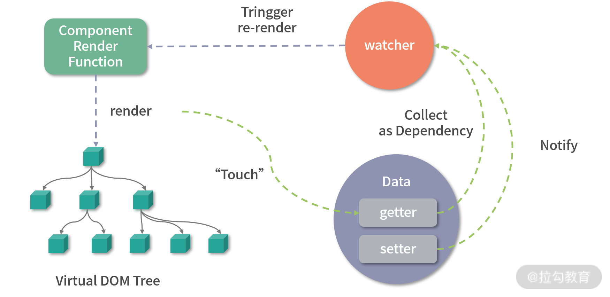

在 `Vue.js 2.x` 中，`Watcher` 就是依赖，有专门针对组件渲染的 `render watcher`。注意这里有两个流程，**首先是依赖收集流程，组件在 `render` 的时候会访问模板中的数据，触发 `getter` 把 `render watcher` 作为依赖收集，并和数据建立联系；然后是派发通知流程，当我对这些数据修改的时候，会触发 `setter`，通知 `render watcher` 更新，进而触发了组件的重新渲染。**

在导读章节，**提到了 `Object.defineProperty API` 的一些缺点：不能监听对象属性新增和删除；初始化阶段递归执行 `Object.defineProperty` 带来的性能负担。**

`Vue.js 3.0 `为了解决 `Object.defineProperty` 的这些缺陷，使用 `Proxy API` 重写了响应式部分，并独立维护和发布整个 `reactivity` 库，下面一起来深入学习 `Vue.js 3.0` 响应式部分的实现原理。

###  `Vue.js 3.0` 响应式实现原理

#### 响应式对象的实现差异

**在 `Vue.js 2.x` 中构建组件时，只要我们在 `data、props、computed` 中定义数据，那么它就是响应式的**，举个例子：

```vue
<template>
  <div>
    <p>{{ msg }}</p>
    <button @click="random">Random msg</button>
  </div>
</template>
<script>
  export default {
    data() {
      return {
        msg: 'msg reactive'
      }
    },
    methods: {
      random() {
        this.msg = Math.random()
      }
    }
  }
</script>
```

上述组件初次渲染会显示`“msg reactive”`，当我们点击按钮的时候，会执行` random` 函数，`random` 函数会修改 `this.msg`，就会发现组件重新渲染了。

我们对这个例子做一些改动，模板部分不变，我们把 `msg` 数据的定义放到`created` 钩子中：

```javascript
export default {
  created() {
    this.msg = 'msg not reactive'
  }, 
  methods: {
    random() {
      this.msg = Math.random()
    }
  }
}
```

此时，组件初次渲染显示`“msg not reactive”`，但是我们再次点击按钮就会发现组件并没有重新渲染。

这个问题相信你可能遇到过，其中的根本原因是我们**在 `created `中定义的 `this.msg` 并不是响应式对象**，所以 `Vue.js` 内部不会对它做额外的处理。而 `data` 中定义的数据，`Vue.js` 内部在组件初始化的过程中会把它变成响应式，这是一个相对黑盒的过程，用户通常不会感知到。

你可能会好奇，为什么我在 `created` 钩子函数中定义数据而不在 `data` 中去定义？**其实在 `data` 中定义数据最终也是挂载到组件实例 `this` 上，这和我直接在 `created` 钩子函数通过 `this.xxx `定义的数据唯一区别就是，在 `data` 中定义的数据是响应式的。**

**在一些场景下，如果我们仅仅想在组件上下文中共享某个变量，而不必去监测它的这个数据变化，这时就特别适合在 `created` 钩子函数中去定义这个变量，因为创建响应式的过程是有性能代价的，这相当于一种 `Vue.js` 应用的性能优化小技巧**，你掌握了这一点就可以在合适的场景中应用了。

到了 **Vue.js 3.0** 构建组件时，你可以不依赖于 `Options API`，而**使用 Composition API** 去编写。对于刚才的例子，我们可以用 `Composition API` 这样改写：

```vue
<template>
  <div>
    <p>{{ state.msg }}</p>
    <button @click="random">Random msg</button>
  </div>
</template>
<script>
  import { reactive } from 'vue'
  export default {
    setup() {
      const state = reactive({
        msg: 'msg reactive'
      })
      const random = function() {
        state.msg = Math.random()
      }
      return {
        random,
        state
      }
    }
  }
</script>
```

可以看到，我们通过 `setup` 函数实现和前面示例同样的功能。请注意，这里我们引入了 **reactive API，它可以把一个对象数据变成响应式。 可以看出来 `Composition API` 更推荐用户主动定义响应式对象，而非内部的黑盒处理。这样用户可以更加明确哪些数据是响应式的，如果你不想让数据变成响应式，就定义成它的原始数据类型即可。**

也就是在 `Vue.js 3.0` 中，我们用 `reactive` 这个有魔力的函数，把数据变成了响应式，那么它内部到底是怎么实现的呢？我们接下来一探究竟。

#### Reactive API

##### `createReactiveObject`

先来看一下 `reactive` 函数的具体实现过程：

```javascript
function reactive (target) {
   // 如果尝试把一个 readonly proxy 变成响应式，直接返回这个 readonly proxy
  if (target && target.__v_isReadonly) {
     return target
  } 
  return createReactiveObject(target, false, mutableHandlers, mutableCollectionHandlers)
}
function createReactiveObject(target, isReadonly, baseHandlers, collectionHandlers) {
  if (!isObject(target)) {
    // 目标必须是对象或数组类型
    if ((process.env.NODE_ENV !== 'production')) {
      console.warn(`value cannot be made reactive: ${String(target)}`)
    }
    return target
  }
  if (
    target[ReactiveFlags.RAW] &&
    !(isReadonly && target[ReactiveFlags.IS_REACTIVE])
  ) {
    // target 已经是 Proxy 对象，直接返回
    // 有个例外，如果是 readonly 作用于一个响应式对象，则继续
    return target
  }
  // target 已经有对应的 Proxy 了，则直接返回
  const proxyMap = isReadonly ? readonlyMap : reactiveMap
  const existingProxy = proxyMap.get(target)
  if (existingProxy) {
    return existingProxy
  }
  // 只有在白名单里的数据类型才能变成响应式
  const targetType = getTargetType(target)
  if (targetType === TargetType.INVALID) {
    return target
  }
  // 利用 Proxy 创建响应式
  const observed = new Proxy(target, collectionTypes.has(target.constructor) ? collectionHandlers : baseHandlers)
  // 将target对应的proxy绑定到proxyMap（readonlyMap or reactiveMap）上
  // 以便于下次判断target是否已有对应的响应式对象
  proxyMap.set(target, proxy)
  return observed
}
```

可以看到，`reactive` 内部通过 `createReactiveObject` 函数把 `target` 变成了一个响应式对象。

在这个过程中，`createReactiveObject` 函数主要做了以下几件事情。

1. 函数首先判断 `target` 是不是数组或者对象类型，如果不是则直接返回。所以**原始数据 target 必须是对象或者数组**。

2. **如果对一个已经是响应式的对象再次执行 `reactive`，还应该返回这个响应式对象**，举个例子：

   ```javascript
   import { reactive } from 'vue'
   const original = { foo: 1 }
   const observed = reactive(original)
   const observed2 = reactive(observed)
   observed === observed2 // true
   ```

   可以看到 `observed` 已经是响应式结果了，如果对它再去执行 `reactive`，返回的值 `observed2` 和 `observed` 还是同一个对象引用。

   **因为这里 `reactive` 函数会通过 `target.__v_raw `属性来判断 `target `是否已经是一个响应式对象（因为响应式对象的 `__v_raw` 属性会指向它自身，后面会提到），如果是的话则直接返回响应式对象。**

3. **如果对同一个原始数据多次执行 `reactive` ，那么会返回相同的响应式对象**，举个例子：

   ```javascript
   import { reactive } from 'vue'
   const original = { foo: 1 }
   const observed = reactive(original)
   const observed2 = reactive(original)
   observed === observed2 // true
   ```

   可以看到，原始数据 `original` 被反复执行 `reactive`，但是响应式结果 `observed` 和 `observed2 `是同一个对象。

   **所以这里 `reactive` 函数会通过 `proxyMap`去判断` target` 是否已经有对应的响应式对象（因为创建完响应式对象后，会将原始对象作为`key`，响应式对象作为`value`，设置到`proxyMap`上），如果有则返回这个响应式对象。**

4. 使用 `getTargetType` 函数对 `target` 对象做一进步限制：

   ```javascript
   const targetType = getTargetType(target)
   if (targetType === TargetType.INVALID) {
     return target
   }
   
   function getTargetType(value: Target) {
     return value[ReactiveFlags.SKIP] || !Object.isExtensible(value)
       ? TargetType.INVALID
       : targetTypeMap(toRawType(value))
   }
   
   const enum TargetType {
     INVALID = 0,
     COMMON = 1,
     COLLECTION = 2
   }
   
   // target type 映射关系
   function targetTypeMap(rawType: string) {
     switch (rawType) {
       case 'Object':
       case 'Array':
         return TargetType.COMMON
       case 'Map':
       case 'Set':
       case 'WeakMap':
       case 'WeakSet':
         return TargetType.COLLECTION
       default:
         return TargetType.INVALID
     }
   }
   ```

   比如，**带有 `__v_skip` 属性的对象、被冻结的对象，以及不在白名单内的对象如 `Date` 类型的对象实例是不能变成响应式的。**

5. 通过 `Proxy API` 劫持` target `对象，把它变成响应式。我们把 `Proxy `函数返回的结果称作响应式对象，这里 `Proxy `对应的处理器对象会根据数据类型的不同而不同，我们稍后会重点分析基本数据类型的 `Proxy` 处理器对象，`reactive` 函数传入的 `baseHandlers` 值是 `mutableHandlers`。

6. **将target对应的proxy绑定到proxyMap（readonlyMap or reactiveMap）上，方便通过 `proxyMap`去判断` target` 是否已经有对应的响应式对象**，如下：

   ```javascript
   proxyMap.set(target, proxy)
   ```

   这就是前面**“对同一个原始数据多次执行 reactive ，那么会返回相同的响应式对象”**逻辑的判断依据。

仔细想想看，响应式的实现方式无非就是劫持数据，`Vue.js 3.0` 的 `reactive API` 就是通过 `Proxy `劫持数据，而且由于 `Proxy` 劫持的是整个对象，所以我们可以检测到任何对对象的修改，弥补了 `Object.defineProperty API` 的不足。

##### ` Proxy `处理器对象 `mutableHandlers `

接下来，我们继续看` Proxy `处理器对象 `mutableHandlers `的实现：

```javascript
const mutableHandlers = {
  get,
  set,
  deleteProperty,
  has,
  ownKeys
}
```

它其实就是劫持了我们对 `observed `对象的一些操作，比如：

- **访问对象属性会触发 `get` 函数；**
- **设置对象属性会触发 `set` 函数；**
- **删除对象属性会触发 `deleteProperty` 函数；**
- **`in` 操作符会触发 `has` 函数；**
- **通过 `Object.getOwnPropertyNames` 访问对象属性名会触发 `ownKeys `函数。**

因为无论命中哪个处理器函数，它都会做依赖收集和派发通知这两件事其中的一个，所以这里我只要分析常用的 `get` 和 `set` 函数就可以了。

##### 依赖收集：`get` 函数

###### `createGetter`

**依赖收集发生在数据访问的阶段**，由于我们用 `Proxy API` 劫持了数据对象，所以当这个响应式对象属性被访问的时候就会执行 `get` 函数，我们来看一下 `get `函数的实现，其实它是执行 `createGetter` 函数的返回值，为了分析主要流程，这里省略了 `get `函数中的一些分支逻辑，`isReadonly` 也默认为 `false`：

```javascript
function createGetter(isReadonly = false) {
  return function get(target, key, receiver) {
    if (key === "__v_isReactive" /* isReactive */) {
      // 代理 observed.__v_isReactive
      return !isReadonly
    }
    else if (key === "__v_isReadonly" /* isReadonly */) {
      // 代理 observed.__v_isReadonly
      return isReadonly;
    }
    else if (key === "__v_raw" /* raw */) {
      // 代理 observed.__v_raw
      return target
    }
    const targetIsArray = isArray(target)
    // arrayInstrumentations 包含对数组一些方法修改的函数
    if (targetIsArray && hasOwn(arrayInstrumentations, key)) {
      return Reflect.get(arrayInstrumentations, key, receiver)
    }
    // 求值
    const res = Reflect.get(target, key, receiver)
    // 内置 Symbol key 不需要依赖收集
    if (isSymbol(key) && builtInSymbols.has(key) || key === '__proto__') {
      return res
    }
    // 依赖收集
    !isReadonly && track(target, "get" /* GET */, key)
    return isObject(res)
      ? isReadonly
        ?
        readonly(res)
        // 如果 res 是个对象或者数组类型，则递归执行 reactive 函数把 res 变成响应式
        : reactive(res)
      : res
  }
}
```

结合上述代码来看，`get `函数主要做了四件事情，**首先对特殊的 key 做了代理**，这就是为什么我们在 `createReactiveObject `函数中判断响应式对象是否存在 `__v_raw `属性，如果存在就返回这个响应式对象本身。

###### `arrayInstrumentations`

**接着通过 Reflect.get 方法求值**，如果` target `是数组且` key `命中了` arrayInstrumentations`，则执行对应的函数，我们可以大概看一下` arrayInstrumentations `的实现：

```javascript
const arrayInstrumentations = {}
['includes', 'indexOf', 'lastIndexOf'].forEach(key => {
  arrayInstrumentations[key] = function (...args) {
    // toRaw 可以把响应式对象转成原始数据
    const arr = toRaw(this)
    for (let i = 0, l = this.length; i < l; i++) {
      // 依赖收集
      track(arr, "get" /* GET */, i + '')
    }
    // 先尝试用参数本身，可能是响应式数据
    const res = arr[key](...args)
    if (res === -1 || res === false) {
      // 如果失败，再尝试把参数转成原始数据
      return arr[key](...args.map(toRaw))
    }
    else {
      return res
    }
  }
})
```

也就是说，**当 `target` 是一个数组的时候，我们去访问` target.includes、target.indexOf `或者 `target.lastIndexOf `就会执行 `arrayInstrumentations` 代理的函数，除了调用数组本身的方法求值外，还对数组每个元素做了依赖收集**。因为一旦数组的元素被修改，数组的这几个 `API `的返回结果都可能发生变化，所以我们需要跟踪数组每个元素的变化。

回到 `get `函数，第三步就是**通过 Reflect.get 求值，然后会执行 track 函数收集依赖**，我们稍后重点分析这个过程。

**函数最后会对计算的值 res 进行判断，如果它也是数组或对象，则递归执行 `reactive`把 `res `变成响应式对象。这么做是因为 `Proxy` 劫持的是对象本身，并不能劫持子对象的变化，这点和 `Object.defineProperty API` 一致。但是 `Object.defineProperty` 是在初始化阶段，即定义劫持对象的时候就已经递归执行了，而 `Proxy` 是在对象属性被访问的时候才递归执行下一步 `reactive`，这其实是一种延时定义子对象响应式的实现，在性能上会有较大的提升。**

###### ` track `函数收集依赖

整个 `get` 函数最核心的部分其实是**执行 track 函数收集依赖**，下面我们重点分析这个过程。

我们先来看一下` track` 函数的实现：

```javascript
// 是否应该收集依赖
let shouldTrack = true
// 当前激活的 effect
let activeEffect
// 原始数据对象 map
const targetMap = new WeakMap()
function track(target, type, key) {
  if (!shouldTrack || activeEffect === undefined) {
    return
  }
  let depsMap = targetMap.get(target)
  if (!depsMap) {
    // 每个 target 对应一个 depsMap
    targetMap.set(target, (depsMap = new Map()))
  }
  let dep = depsMap.get(key)
  if (!dep) {
    // 每个 key 对应一个 dep 集合
    depsMap.set(key, (dep = new Set()))
  }
  if (!dep.has(activeEffect)) {
    // 收集当前激活的 effect 作为依赖
    dep.add(activeEffect)
   // 当前激活的 effect 收集 dep 集合作为依赖
    activeEffect.deps.push(dep)
    if (__DEV__ && activeEffect.options.onTrack) {
      activeEffect.options.onTrack({
        effect: activeEffect,
        target,
        type,
        key
      })
    }
  }
}
```

分析这个函数的实现前，我们先想一下要收集的依赖是什么，我们的目的是实现响应式，就是当数据变化的时候可以自动做一些事情，比如执行某些函数，所以我们**收集的依赖就是数据变化后执行的副作用函数**。

再来看实现，我们把` target `作为原始的数据，`key` 作为访问的属性。我们创建了全局的 `targetMap` 作为原始数据对象的 `Map`，它的键是 `target`，值是 `depsMap`，作为依赖的 `Map`；这个 `depsMap` 的键是 `target` 的 `key`，值是 `dep` 集合，`dep `集合中存储的是依赖的副作用函数。为了方便理解，可以通过下图表示它们之间的关系：


所以每次` track` ，就是把当前激活的副作用函数 `activeEffect `作为依赖，然后收集到 `target `相关的 `depsMap` 对应 `key `下的依赖集合 `dep` 中。

##### 派发通知：`set `函数

###### `createSetter` 

派发通知发生在数据更新的阶段 ，由于我们用 `Proxy API` 劫持了数据对象，所以当这个响应式对象属性更新的时候就会执行 `set `函数。我们来看一下 `set` 函数的实现，它是执行 `createSetter` 函数的返回值：

```javascript
function createSetter() {
  return function set(target, key, value, receiver) {
    const oldValue = target[key]
    value = toRaw(value)
    const hadKey = hasOwn(target, key)
    const result = Reflect.set(target, key, value, receiver)
    // 如果目标的原型链也是一个 proxy，通过 Reflect.set 修改原型链上的属性会再次触发 setter，这种情况下就没必要触发两次 trigger 了
    if (target === toRaw(receiver)) {
      if (!hadKey) {
        trigger(target, "add" /* ADD */, key, value)
      }
      else if (hasChanged(value, oldValue)) {
        trigger(target, "set" /* SET */, key, value, oldValue)
      }
    }
    return result
  }
}
```

结合上述代码来看，`set` 函数的实现逻辑很简单，主要就做两件事情， **首先通过 `Reflect.set `求值** ， **然后通过` trigger `函数派发通知** ，并依据 `key `是否存在于 `target `上来确定通知类型，即新增还是修改。

整个 `set` 函数最核心的部分就是 **执行 `trigger` 函数派发通知** ，下面我们将重点分析这个过程。

###### ` trigger` 

我们先来看一下 `trigger` 函数的实现，为了分析主要流程，这里省略了` trigger` 函数中的一些分支逻辑：

```javascript
// 原始数据对象 map
const targetMap = new WeakMap()
function trigger(target, type, key, newValue) {
  // 通过 targetMap 拿到 target 对应的依赖集合
  const depsMap = targetMap.get(target)
  if (!depsMap) {
    // 没有依赖，直接返回
    return
  }
  // 创建运行的 effects 集合
  const effects = new Set()
  // 添加 effects 的函数
  const add = (effectsToAdd) => {
    if (effectsToAdd) {
      effectsToAdd.forEach(effect => {
        effects.add(effect)
      })
    }
  }
  // SET | ADD | DELETE 操作之一，添加对应的 effects
  if (key !== void 0) {
    add(depsMap.get(key))
  }
  const run = (effect) => {
    // 调度执行
    if (effect.options.scheduler) {
      effect.options.scheduler(effect)
    }
    else {
      // 直接运行
      effect()
    }
  }
  // 遍历执行 effects
  effects.forEach(run)
}
```

`trigger` 函数的实现也很简单，主要做了四件事情：

1. 通过` targetMap `拿到 `target `对应的依赖集合 `depsMap`；
2. 创建运行的 `effects` 集合；
3. 根据 `key` 从 `depsMap` 中找到对应的 `effects` 添加到 `effects `集合；
4. 遍历 `effects` 执行相关的副作用函数。

所以每次 `trigger` 函数就是根据 `target `和 `key` ，从 `targetMap `中找到相关的所有副作用函数遍历执行一遍。

在描述依赖收集和派发通知的过程中，我们都提到了一个词：副作用函数，依赖收集过程中我们把 `activeEffect`（当前激活副作用函数）作为依赖收集，它又是什么？

##### 副作用函数

介绍副作用函数前，我们先回顾一下响应式的原始需求，即我们修改了数据就能自动执行某个函数，举个简单的例子：

```javascript
import { reactive } from 'vue'
const counter = reactive({
  num: 0
})
function logCount() {
  console.log(counter.num)
}
function count() {
  counter.num++
}
logCount()
count()
```

可以看到，这里我们定义了响应式对象 `counter`，然后我们在 `logCount `中访问了 `counter.num`，我们希望通过执行 `count` 函数修改 `counter.num` 值的时候，能自动执行 `logCount` 函数。

按我们之前对依赖收集过程的分析，如果这个` logCount` 就是 `activeEffect` 的话，那么就可以实现需求，但显然是做不到的，因为代码在执行到 `console.log(counter.num)`这一行 的时候，它对自己在` logCount` 函数中的运行是一无所知的。

那么该怎么办呢？其实只要我们运行` logCount` 函数前，把`logCount `赋值给 `activeEffect` 就好了，如下：

```javascript
activeEffect = logCount 
logCount()
```

顺着这个思路，我们可以利用高阶函数的思想，对` logCount `做一层封装，如下：

```javascript
function wrapper(fn) {
  const wrapped = function(...args) {
    activeEffect = fn
    fn(...args)
  }
  return wrapped
}
const wrappedLog = wrapper(logCount)
wrappedLog()
```

这里，`wrapper `本身也是一个函数，它接受 `fn `作为参数，返回一个新的函数 `wrapped`，然后维护一个全局的 `activeEffect`，当 `wrapped `执行的时候，把 `activeEffect `设置为` fn`，然后执行 `fn `即可。

这样当我们执行 `wrappedLog` 后，再去修改 `counter.num`，就会自动执行 `logCount `函数了。

###### `createReactiveEffect`

实际上 `Vue.js 3.0` 就是采用类似的做法，在它内部就有一个` effect` 副作用函数，我们来看一下它的实现：

```javascript
// 全局 effect 栈
const effectStack = []
// 当前激活的 effect
let activeEffect
function effect(fn, options = EMPTY_OBJ) {
  if (isEffect(fn)) {
    // 如果 fn 已经是一个 effect 函数了，则指向原始函数
    fn = fn.raw
  }
  // 创建一个 wrapper，它是一个响应式的副作用的函数
  const effect = createReactiveEffect(fn, options)
  if (!options.lazy) {
    // lazy 配置，计算属性会用到，非 lazy 则直接执行一次
    effect()
  }
  return effect
}

function createReactiveEffect(fn, options) {
  const effect = function reactiveEffect(...args) {
    if (!effect.active) {
      // 非激活状态，则判断如果非调度执行，则直接执行原始函数。
      return options.scheduler ? undefined : fn(...args)
    }
    if (!effectStack.includes(effect)) {
      // 清空 effect 引用的依赖
      cleanup(effect)
      try {
        // 开启全局 shouldTrack，允许依赖收集
        enableTracking()
        // 压栈
        effectStack.push(effect)
        activeEffect = effect
        // 执行原始函数
        return fn(...args)
      }
      finally {
        // 出栈
        effectStack.pop()
        // 恢复 shouldTrack 开启之前的状态
        resetTracking()
        // 指向栈最后一个 effect
        activeEffect = effectStack[effectStack.length - 1]
      }
    }
  }
  effect.id = uid++
  // 标识是一个 effect 函数
  effect._isEffect = true
  // effect 自身的状态
  effect.active = true
  // 包装的原始函数
  effect.raw = fn
  // effect 对应的依赖，双向指针，依赖包含对 effect 的引用，effect 也包含对依赖的引用
  effect.deps = []
  // effect 的相关配置
  effect.options = options
  return effect
}
```

结合上述代码来看，`effect `内部通过执行 `createReactiveEffect` 函数去创建一个新的 `effect` 函数，为了和外部的 `effect` 函数区分，我们把它称作 `reactiveEffect `函数，并且还给它添加了一些额外属性（我在注释中都有标明）。另外，`effect `函数还支持传入一个配置参数以支持更多的 `feature`，我们这里就不展开了，在后续的章节会详细分析。

接着说，这个 `reactiveEffect` 函数就是响应式的副作用函数，当执行` trigger` 过程派发通知的时候，执行的 `effect` 就是它。

按我们之前的分析，这个 `reactiveEffect `函数只需要做两件事情： **把全局的 activeEffect 指向它** ， **然后执行被包装的原始函数 fn 即可** 。

但实际上它的实现要更复杂一些，首先它会判断 `effect `的状态是否是` active`，这其实是一种控制手段，允许在非 `active` 状态且非调度执行情况，则直接执行原始函数 `fn `并返回，在后续学习完侦听器后你会对它的理解更加深刻。

###### ` effectStack `

接着判断` effectStack `中是否包含 `effect`，如果没有就把` effect `压入栈内。之前我们提到，只要设置` activeEffect = effect` 即可，那么这里为什么要设计一个栈的结构呢？

其实是考虑到以下这样一个嵌套` effect` 的场景：

```javascript
import { reactive} from 'vue' 
import { effect } from '@vue/reactivity' 
const counter = reactive({ 
  num: 0, 
  num2: 0 
}) 
function logCount() { 
  effect(logCount2) 
  console.log('num:', counter.num) 
} 
function count() { 
  counter.num++ 
} 
function logCount2() { 
  console.log('num2:', counter.num2) 
} 
effect(logCount) 
count()
```

我们每次执行 `effect `函数时，如果仅仅把 `reactiveEffect` 函数赋值给 `activeEffect`，那么针对这种嵌套场景，执行完 `effect(logCount2) `后，`activeEffect `还是 `effect(logCount2) `返回的` reactiveEffect `函数，这样后续访问` counter.num` 的时候，依赖收集对应的 `activeEffect `就不对了，此时我们外部执行` count `函数修改 `counter.num` 后执行的便不是` logCount `函数，而是` logCount2 `函数，最终输出的结果如下：

```javascript
num2: 0 
num: 0 
num2: 0
```

而我们期望的结果应该如下：

```javascript
num2: 0 
num: 0 
num2: 0 
num: 1
```

因此针对嵌套 `effect `的场景，我们不能简单地赋值 `activeEffect`，应该考虑到函数的执行本身就是一种入栈出栈操作，因此我们也可以设计一个` effectStack`，这样每次进入 `reactiveEffect `函数就先把它入栈，然后 `activeEffect` 指向这个 `reactiveEffect` 函数，接着在 `fn` 执行完毕后出栈，再把 `activeEffect `指向` effectStack `最后一个元素，也就是外层 `effect` 函数对应的 `reactiveEffect`。

###### `cleanup `

这里我们还注意到一个细节，**在入栈前会执行 cleanup 函数清空 reactiveEffect 函数对应的依赖** 。在执行 `track `函数的时候，除了收集当前激活的` effect` 作为依赖，还通过 `activeEffect.deps.push(dep) `把`dep `作为 `activeEffect` 的依赖，这样在` cleanup` 的时候我们就可以找到` effect `对应的 `dep `了，然后把 `effect` 从这些 `dep `中删除。`cleanup `函数的代码如下所示：

```javascript
function cleanup(effect) {
  const { deps } = effect
  if (deps.length) {
    for (let i = 0; i < deps.length; i++) {
      deps[i].delete(effect)
    }
    deps.length = 0
  }
}
```

为什么需要 `cleanup `呢？如果遇到这种场景：

```vue
<template>
  <div v-if="state.showMsg">
    {{ state.msg }}
  </div>
  <div v-else>
    {{ Math.random()}}
  </div>
  <button @click="toggle">Toggle Msg</button>
  <button @click="switchView">Switch View</button>
</template>
<script>
  import { reactive } from 'vue'
  export default {
    setup() {
      const state = reactive({
        msg: 'Hello World',
        showMsg: true
      })
      function toggle() {
        state.msg = state.msg === 'Hello World' ? 'Hello Vue' : 'Hello World'
      }
      function switchView() {
        state.showMsg = !state.showMsg
      }
      return {
        toggle,
        switchView,
        state
      }
    }
  }
</script>
```

结合代码可以知道，这个组件的视图会根据 `showMsg `变量的控制显示 `msg `或者一个随机数，当我们点击 `Switch View` 的按钮时，就会修改这个变量值。

**假设没有 `cleanup`，在第一次渲染模板的时候，`activeEffect `是组件的副作用渲染函数，因为模板 `render` 的时候访问了 `state.msg`，所以会执行依赖收集，把副作用渲染函数作为 `state.msg` 的依赖，我们把它称作 `render effect`。然后我们点击 `Switch View` 按钮，视图切换为显示随机数，此时我们再点击 `Toggle Msg `按钮，由于修改了 `state.msg `就会派发通知，找到了 `render effect `并执行，就又触发了组件的重新渲染。**

**但这个行为实际上并不符合预期，因为当我们点击 `Switch View` 按钮，视图切换为显示随机数的时候，也会触发组件的重新渲染，但这个时候视图并没有渲染 `state.msg`，所以对它的改动并不应该影响组件的重新渲染。**

**因此在组件的` render effect` 执行之前，如果通过 `cleanup `清理依赖，我们就可以删除之前 `state.msg` 收集的 `render effect` 依赖。这样当我们修改` state.msg` 时，由于已经没有依赖了就不会触发组件的重新渲染，符合预期。**

至此，从` reactive API` 入手了解了整个响应式对象的实现原理。除了` reactive API`，Vue.js 3.0 还提供了其他好用的响应式 `API`，接下来一起分析一些常用的。

#### readonly API

##### `createReactiveObject`

如果用 `const `声明一个对象变量，虽然不能直接对这个变量赋值，但我们可以修改它的属性。如果我们希望创建只读对象，不能修改它的属性，也不能给这个对象添加和删除属性，让它变成一个真正意义上的只读对象。

```javascript
const original = {
  foo: 1
}
const wrapped = readonly(original)
wrapped.foo = 2
// warn: Set operation on key "foo" failed: target is readonly.
```

显然，想实现上述需求就需要劫持对象，于是` Vue.js 3.0` 在 `reactive API `的基础上，设计并实现了 `readonly API`。

我们先来看一下 `readonly `的实现：

```javascript
function readonly(target) {
    return createReactiveObject(target, true, readonlyHandlers, readonlyCollectionHandlers)
}

function createReactiveObject(target, isReadonly, baseHandlers, collectionHandlers) {
  if (!isObject(target)) {
    // 目标必须是对象或数组类型
    if ((process.env.NODE_ENV !== 'production')) {
      console.warn(`value cannot be made reactive: ${String(target)}`)
    }
    return target
  }
  if (
    target[ReactiveFlags.RAW] &&
    !(isReadonly && target[ReactiveFlags.IS_REACTIVE])
  ) {
    // target 已经是 Proxy 对象，直接返回
    // 有个例外，如果是 readonly 作用于一个响应式对象，则继续
    return target
  }
  // target 已经有对应的 Proxy 了，则直接返回
  const proxyMap = isReadonly ? readonlyMap : reactiveMap
  const existingProxy = proxyMap.get(target)
  if (existingProxy) {
    return existingProxy
  }
  // 只有在白名单里的数据类型才能变成响应式
  const targetType = getTargetType(target)
  if (targetType === TargetType.INVALID) {
    return target
  }
  // 利用 Proxy 创建响应式
  const observed = new Proxy(target, collectionTypes.has(target.constructor) ? collectionHandlers : baseHandlers)
  // 将target对应的proxy绑定到proxyMap（readonlyMap or reactiveMap）上
  // 以便于下次判断target是否已有对应的响应式对象
  proxyMap.set(target, proxy)
  return observed
}
```

其实 `readonly `和 `reactive `函数的主要区别，就是执行` createReactiveObject `函数时的参数 `isReadonly `不同。

我们来看这里的代码，首先` isReadonly `变量为 `true`，所以在创建过程中会给原始对象 `target `打上一个` __v_readonly` 的标识。另外还有一个特殊情况，如果 `target` 已经是一个 `reactive` 对象，就会把它继续变成一个` readonly` 响应式对象。

其次就是 `baseHandlers` 的` collectionHandlers `的区别，我们这里仍然只关心基本数据类型的` Proxy `处理器对象，`readonly `函数传入的 `baseHandlers` 值是 `readonlyHandlers`。

##### ` Proxy `处理器对象`readonlyHandlers`

接下来，我们来看一下其中 `readonlyHandlers` 的实现：

```javascript
const readonlyHandlers = {
  get: readonlyGet,
  has,
  ownKeys,
  set(target, key) {
    if ((process.env.NODE_ENV !== 'production')) {
      console.warn(`Set operation on key "${String(key)}" failed: target is readonly.`, target)
    }
    return true
  },
  deleteProperty(target, key) {
    if ((process.env.NODE_ENV !== 'production')) {
      console.warn(`Delete operation on key "${String(key)}" failed: target is readonly.`, target)
    }
    return true
  }
}
```

`readonlyHandlers `和` mutableHandlers `的区别主要在` get、set` 和 `deleteProperty `三个函数上。很显然，作为一个只读的响应式对象，是不允许修改属性以及删除属性的，所以在非生产环境下 `set` 和 `deleteProperty` 函数的实现都会报警告，提示用户 `target` 是` readonly `的。

#####  `readonlyGet` 

接下来我们来看一下其中 `readonlyGet` 的实现，它其实就是 `createGetter(true) `的返回值：

```javascript
function createGetter(isReadonly = false) {
  return function get(target, key, receiver) {
    // ...
    // isReadonly 为 true 则不需要依赖收集
    !isReadonly && track(target, "get" /* GET */, key)
    return isObject(res)
      ? isReadonly
        ?
        // 如果 res 是个对象或者数组类型，则递归执行 readonly 函数把 res readonly
        readonly(res)
        : reactive(res)
      : res
  }
}
```

可以看到，它和` reactive API `最大的区别就是不做依赖收集了，这一点也非常好理解，因为它的属性不会被修改，所以就不用跟踪它的变化了。

到这里，`readonly API `就介绍完了，接下来我们分析一下另一个常用的响应式 `API：ref`。

#### `ref API`

通过前面的分析，我们知道 `reactive API `对传入的` target `类型有限制，必须是对象或者数组类型，而对于一些基础类型（比如 `String、Number、Boolean`）是不支持的。

但是有时候从需求上来说，可能我只希望把一个字符串变成响应式，却不得不封装成一个对象，这样使用上多少有一些不方便，于是 `Vue.js 3.0 `设计并实现了 `ref API`。

```javascript
const msg = ref('Hello World') 
msg.value = 'Hello Vue'
```

我们先来看一下` ref `的实现：

```javascript
function ref(value) {
  return createRef(value)
}

const convert = (val) => isObject(val) ? reactive(val) : val

function createRef(rawValue: unknown, shallow = false) {
  if (isRef(rawValue)) {
    // 如果传入的就是一个 ref，那么返回自身即可，处理嵌套 ref 的情况。
    return rawValue
  }
  return new RefImpl(rawValue, shallow)
}

class RefImpl<T> {
  private _value: T

  public readonly __v_isRef = true

  constructor(private _rawValue: T, private readonly _shallow = false) {
    // 如果是对象或者数组类型，则转换一个 reactive 对象。
    this._value = _shallow ? _rawValue : convert(_rawValue)
  }

  get value() {
    // getter
    // 依赖收集，key 为固定的 value
    track(toRaw(this), TrackOpTypes.GET, 'value')
    return this._value
  }

  set value(newVal) {
    // setter，只处理 value 属性的修改
    if (hasChanged(toRaw(newVal), this._rawValue)) {
      // 判断有变化后更新值
      this._rawValue = newVal
      this._value = this._shallow ? newVal : convert(newVal)
      // 派发通知
      trigger(toRaw(this), TriggerOpTypes.SET, 'value', newVal)
    }
  }
}
```

可以看到，函数首先处理了嵌套 `ref `的情况，如果传入的 `rawValue `也是` ref`，那么直接返回。

接着对`rawValue `做了一层转换，如果` rawValue` 是对象或者数组类型，那么把它转换成一个 `reactive `对象。

最后定义一个对` value `属性做 `getter `和 `setter `劫持的对象并返回，`get` 部分就是执行`track `函数做依赖收集然后返回它的值；`set` 部分就是设置新值并且执行` trigger` 函数派发通知。

### 总结

通过上面的学习明白了响应式 `API` 的实现原理，知道什么时候收集依赖，什么时候派发更新，以及副作用函数的作用和设计原理。同时我们还应该清楚` reactive、readonly、ref `三种 `API `的区别和各自的使用场景，这样就可以在今后的开发中对它们应用自如了。

最后通过下图来看一下整个响应式` API` 实现和组件更新的关系：


这幅图是不是很眼熟？没错，它和前面 `Vue.js 2.x` 的响应式原理图很接近，其实 `Vue.js 3.0 `在响应式的实现思路和 `Vue.js 2.x `差别并不大，主要就是 **劫持数据的方式改成用 Proxy 实现** ， **以及收集的依赖由 watcher 实例变成了组件副作用渲染函数** 。

### 问题

**问：**为什么说 `Vue.js 3 `的响应式 `API` 实现和 `Vue.js 2.x `相比性能要好，具体好在哪里呢？它又有哪些不足呢？

**答：**

**优点：**

- `Object.defineProperty` 不能监听对象属性新增和删除，在初始化阶段递归执行劫持对象属性，性能损耗较大；而 `Proxy` 可以监听到对象属性的增删改，在访问对象属性时才递归执行劫持对象属性，在性能上有所提升。

**不足：**

-  `Proxy API` 属于 `ES6 `规范，目前 `IE` 尚不支持。

## 3.3 计算属性：计算属性比普通函数好在哪里？

计算属性是 `Vue.js` 开发中一个非常实用的 `API` ，它允许用户定义一个计算方法，然后根据一些依赖的响应式数据计算出新值并返回。当依赖发生变化时，计算属性可以自动重新计算获取新值，所以使用起来非常方便。

在 `Vue.js 2.x` 中，相信你对计算属性的应用已经如数家珍了，我们可以在组件对象中定义 `computed` 属性。到了 `Vue.js 3.0` ，虽然也可以在组件中沿用 `Vue.js 2.x` 的使用方式，但是我们也可以单独使用计算属性 `API`。

### 计算属性 `API`： `computed`

`Vue.js 3.0` 提供了一个 `computed` 函数作为计算属性 `API`，我们先来看看它是如何使用的。

我们举个简单的例子：

```javascript
const count = ref(1) 
const plusOne = computed(() => count.value + 1) 
console.log(plusOne.value) // 2 
plusOne.value++ // error 
count.value++ 
console.log(plusOne.value) // 3
```

从代码中可以看到，我们先使用 `ref API` 创建了一个响应式对象 `count`，然后使用 `computed API` 创建了另一个响应式对象 `plusOne`，它的值是 `count.value + 1`，当我们修改 `count.value` 的时候， `plusOne.value` 就会自动发生变化。

注意，这里我们直接修改 `plusOne.value` 会报一个错误，这是因为如果我们传递给 `computed` 的是一个函数，那么这就是一个 `getter` 函数，我们只能获取它的值，而不能直接修改它。

在 `getter` 函数中，我们会根据响应式对象重新计算出新的值，这也就是它被叫做计算属性的原因，而这个响应式对象，就是计算属性的依赖。

当然，有时候我们也希望能够直接修改 `computed` 的返回值，那么我们可以给 `computed` 传入一个对象：

```javascript
const count = ref(1) 
const plusOne = computed({ 
  get: () => count.value + 1, 
  set: val => { 
    count.value = val - 1 
  } 
}) 
plusOne.value = 1 
console.log(count.value) // 0
```

在这个例子中，结合上述代码可以看到，我们给 `computed` 函数传入了一个拥有 `getter` 函数和 `setter` 函数的对象，`getter `函数和之前一样，还是返回` count.value + 1`；而` setter` 函数，请注意**，这里我们修改 `plusOne.value `的值就会触发 `setter` 函数，其实 `setter` 函数内部实际上会根据传入的参数修改计算属性的依赖值 `count.value`，因为一旦依赖的值被修改了，我们再去获取计算属性就会重新执行一遍 `getter`，所以这样获取的值也就发生了变化。**

好了，我们现在已经知道了 `computed API` 的两种使用方式了，接下来就看看它是怎样实现的：

```javascript
function computed(getterOrOptions) { 
  // getter 函数 
  let getter 
  // setter 函数 
  let setter 
  // 标准化参数 
  if (isFunction(getterOrOptions)) { 
    // 表面传入的是 getter 函数，不能修改计算属性的值 
    getter = getterOrOptions 
    setter = (process.env.NODE_ENV !== 'production') 
      ? () => { 
        console.warn('Write operation failed: computed value is readonly') 
      } 
      : NOOP 
  } 
  else { 
    getter = getterOrOptions.get 
    setter = getterOrOptions.set 
  } 
  // 数据是否脏的 
  let dirty = true 
  // 计算结果 
  let value 
  let computed 
  // 创建副作用函数 
  const runner = effect(getter, { 
    // 延时执行 
    lazy: true, 
    // 标记这是一个 computed effect 用于在 trigger 阶段的优先级排序 
    computed: true, 
    // 调度执行的实现 
    scheduler: () => { 
      if (!dirty) { 
        dirty = true 
        // 派发通知，通知运行访问该计算属性的 activeEffect 
        trigger(computed, "set" /* SET */, 'value') 
      } 
    } 
  }) 
  // 创建 computed 对象 
  computed = { 
    __v_isRef: true, 
    // 暴露 effect 对象以便计算属性可以停止计算 
    effect: runner, 
    get value() { 
      // 计算属性的 getter 
      if (dirty) { 
        // 只有数据为脏的时候才会重新计算 
        value = runner() 
        dirty = false 
      } 
      // 依赖收集，收集运行访问该计算属性的 activeEffect 
      track(computed, "get" /* GET */, 'value') 
      return value 
    }, 
    set value(newValue) { 
      // 计算属性的 setter 
      setter(newValue) 
    } 
  } 
  return computed 
}
```

从代码中可以看到，`computed `函数的流程主要做了三件事情：标准化参数，创建副作用函数和创建` computed `对象。我们来详细分析一下这几个步骤。

1. **标准化参数**。`computed `函数接受两种类型的参数，一个是 `getter` 函数，一个是拥有` getter `和 `setter `函数的对象，通过判断参数的类型，我们初始化了函数内部定义的` getter` 和 `setter `函数。
2. **创建副作用函数 runner**。`computed` 内部通过` effect `创建了一个副作用函数，它是对 `getter `函数做的一层封装，另外我们这里要注意第二个参数，也就是 `effect `函数的配置对象。其中 `lazy` 为 `true` 表示 `effect` 函数返回的 `runner `并不会立即执行；**`computed `为 `true` 用于表示这是一个 `computed effect`，用于 `trigger` 阶段的优先级排序，我们稍后会分析 (该部分在最新版本已移除)；**`scheduler` 表示它的调度运行的方式，我们也稍后分析。
3. **创建 computed 对象并返回**，这个对象也拥有` getter `和 `setter` 函数。当 `computed `对象被访问的时候会触发 `getter`，然后会判断是否 `dirty`，如果是就执行` runner`，然后做依赖收集；当我们直接设置` computed `对象时会触发 `setter`，即执行 `computed `函数内部定义的 `setter `函数。

### 计算属性的运行机制

`computed `函数的逻辑会有一点绕，不过不要紧，我们可以结合一个应用 `computed `计算属性的例子，来理解整个计算属性的运行机制。分析之前我们需要记住` computed `内部两个重要的变量，第一个 `dirty `表示一个计算属性的值是否是“脏的”，用来判断需不需要重新计算，第二个` value `表示计算属性每次计算后的结果。

现在，我们来看这个示例：

```javascript
<template> 
  <div> 
    {{ plusOne }} 
  </div> 
  <button @click="plus">plus</button> 
</template> 
<script> 
  import { ref, computed } from 'vue' 
  export default { 
    setup() { 
      const count = ref(0) 
      const plusOne = computed(() => {
        return count.value + 1 
      }) 
      function plus() { 
        count.value++ 
      } 
      return { 
        plusOne, 
        plus 
      } 
    } 
  } 
</script>
```

可以看到，在这个例子中我们利用` computed API `创建了计算属性对象 `plusOne`，它传入的是一个 `getter `函数，为了和后面计算属性对象的 `getter` 函数区分，我们把它称作 `computed getter`。另外，组件模板中引用了 `plusOne `变量和 `plus `函数。

组件渲染阶段会访问 `plusOne`，也就触发了` plusOne `对象的 `getter `函数：

```javascript
get value() { 
  // 计算属性的 getter 
  if (dirty) { 
    // 只有数据为脏的时候才会重新计算 
    value = runner() 
    dirty = false 
  } 
  // 依赖收集，收集运行访问该计算属性的 activeEffect 
  track(computed, "get" /* GET */, 'value') 
  return value 
}
```

由于默认 `dirty `是 `true`，所以这个时候会执行 `runner` 函数，并进一步执行 `computed getter`，也就是 `count.value + 1`，因为访问了` count `的值，并且由于 `count `也是一个响应式对象，所以就会触发 `count` 对象的依赖收集过程。

请注意，由于是在` runner` 执行的时候访问 `count`，所以这个时候的 `activeEffect` 是 `runner `函数。`runner `函数执行完毕，会把 `dirty` 设置为 `false`，并进一步执行` track（computed,"get",'value') `函数做依赖收集，这个时候 `runner `已经执行完了，所以 `activeEffect` 是组件副作用渲染函数。

所以你要特别注意这是两个依赖收集过程：**对于 `plusOne `来说，它收集的依赖是组件副作用渲染函数；对于 `count` 来说，它收集的依赖是` plusOne `内部的` runner `函数。**

然后当我们点击按钮的时候，会执行 `plus` 函数，函数内部通过` count.value++` 修改 `count `的值，并派发通知。请注意，这里不是直接调用 `runner `函数，而是把 `runner` 作为参数去执行` scheduler `函数。我们来回顾一下` trigger` 函数内部对于` effect` 函数的执行方式:

```javascript
const run = (effect) => { 
  // 调度执行 
  if (effect.options.scheduler) { 
    effect.options.scheduler(effect) 
  } 
  else { 
    // 直接运行 
    effect() 
  } 
}
```

`computed API `内部创建副作用函数时，已经配置了` scheduler` 函数，如下：

```javascript
scheduler: () => { 
  if (!dirty) { 
    dirty = true 
    // 派发通知，通知运行访问该计算属性的 activeEffect 
    trigger(computed, "set" /* SET */, 'value') 
  } 
}
```

它并没有对计算属性求新值，而仅仅是把 `dirty `设置为` true`，再执行` trigger(computed, "set" , 'value')`，去通知执行 `plusOne` 依赖的组件渲染副作用函数，即触发组件的重新渲染。

在组件重新渲染的时候，会再次访问 `plusOne`，我们发现这个时候 `dirty `为` true`，然后会再次执行 `computed getter`，此时才会执行` count.value + 1 `求得新值。这就是虽然组件没有直接访问 `count`，但是当我们修改 `count` 的值的时候，组件仍然会重新渲染的原因。

通过下图可以更加直观展示上述过程：


通过以上分析，我们可以看出 `computed `计算属性有两个特点：

1. **延时计算**，只有当我们访问计算属性的时候，它才会真正运行 `computed getter `函数计算；
2. **缓存**，它的内部会缓存上次的计算结果 `value`，而且只有 `dirty `为` true `时才会重新计算。如果访问计算属性时 `dirty `为 `false`，那么直接返回这个 `value`。

现在，我们就可以回答开头提的问题了。和单纯使用普通函数相比，计算属性的优势是：**只要依赖不变化**，**就可以使用缓存的 value 而不用每次在渲染组件的时候都执行函数去计算**，这是典型的空间换时间的优化思想。

### 嵌套计算属性

计算属性也支持嵌套，我们可以针对上述例子做个小修改，即不在渲染函数中访问 `plusOne`，而在另一个计算属性中访问：

```javascript
const count = ref(0) 
const plusOne = computed(() => { 
  return count.value + 1 
}) 
const plusTwo = computed(() => { 
  return plusOne.value + 1 
}) 
console.log(plusTwo.value)
```

从代码中可以看到，**当我们访问 `plusTwo` 的时候，过程和前面都差不多，同样也是两个依赖收集的过程。对于 `plusOne `来说，它收集的依赖是 `plusTwo `内部的 `runner` 函数；对于` count `来说，它收集的依赖是 `plusOne` 内部的 `runner` 函数。**

**接着当我们修改 `count` 的值时，它会派发通知，先运行` plusOne` 内部的 `scheduler` 函数，把 `plusOne `内部的 `dirty `变为 `true`，然后执行 `trigger` 函数再次派发通知，接着运行 `plusTwo` 内部的 `scheduler `函数，把` plusTwo` 内部的`dirty `设置为 `true`。**

**然后当我们再次访问 `plusTwo `的值时，发现` dirty` 为 `true`，就会执行 `plusTwo` 的 `computed getter` 函数去执行 `plusOne.value + 1`，进而执行 `plusOne` 的 `computed gette `即` count.value + 1 + 1`，求得最终新值` 2`。**

得益于 `computed `这种巧妙的设计，无论嵌套多少层计算属性都可以正常工作。

### 计算属性的执行顺序

我们曾提到计算属性内部创建副作用函数的时候会配置` computed `为` true`，标识这是一个` computed effect`，用于在 `trigger `阶段的优先级排序。我们来回顾一下` trigger` 函数执行` effects `的过程：

```javascript
const add = (effectsToAdd) => { 
  if (effectsToAdd) { 
    effectsToAdd.forEach(effect => { 
      if (effect !== activeEffect || !shouldTrack) { 
        if (effect.options.computed) { 
          computedRunners.add(effect) 
        } 
        else { 
          effects.add(effect) 
        } 
      } 
    }) 
  } 
} 
const run = (effect) => { 
  if (effect.options.scheduler) { 
    effect.options.scheduler(effect) 
  } 
  else { 
    effect() 
  } 
} 
computedRunners.forEach(run) 
effects.forEach(run)
```

在上一节课分析` trigger` 函数的时候，为了方便你理解主干逻辑，我省略了 `computedRunners` 的分支逻辑。实际上，在添加待运行的 `effects `的时候，我们会判断每一个` effect `是不是一个 `computed effect`，如果是的话会添加到` computedRunners `中，在后面运行的时候会优先执行 `computedRunners`，然后再执行普通的 `effects`。

那么为什么要这么设计呢？其实是考虑到了一些特殊场景，我们通过一个示例来说明：

```javascript
import { ref, computed } from 'vue' 
import { effect } from '@vue/reactivity' 
const count = ref(0) 
const plusOne = computed(() => { 
  return count.value + 1 
})
effect(() => { 
  console.log(plusOne.value + count.value) 
}) 
function plus() { 
  count.value++ 
} 
plus()
```

这个示例运行后的结果输出：

```javascript
1 
3 
3
```

在执行 `effect` 函数时运行 `console.log(plusOne.value + count.value)`，所以第一次输出 1，此时 `count.value` 是 0，`plusOne.value` 是 1。

后面连续输出两次 3 是因为， `plusOne `和 `count` 的依赖都是这个 `effect` 函数，所以当我们执行 `plus` 函数修改 `count` 的值时，会触发并执行这个 `effect` 函数，因为 `plusOne` 的 `runner` 也是 `count` 的依赖，`count` 值修改也会执行 `plusOne` 的 `runner`，也就会再次执行 `plusOne` 的依赖即 `effect` 函数，因此会输出两次。

> 在新版本中，这里只会输出一次，移除了重复effect

那么为什么两次都输出 3 呢？这就跟先执行 `computed runner `有关。首先，由于` plusOne` 的 `runner `和 `effect `都是` count` 的依赖，当我们修改` count `值的时候， `plusOne` 的 `runner` 和 `effect `都会执行，那么此时执行顺序就很重要了。

**这里先执行` plusOne `的 `runner`，把 `plusOne `的 `dirty `设置为 `true`，然后通知它的依赖 `effect `执行 `plusOne.value + count.value`。这个时候，由于 `dirty` 为 `true`，就会再次执行` plusOne` 的 `getter `计算新值，拿到了新值 2， 再加上 1 就得到 3。执行完` plusOne `的 `runner `以及依赖更新之后，再去执行` count` 的普通`effect` 依赖，从而去执行 `plusOne.value + count.value`，这个时候 `plusOne dirty `为 `false`， 直接返回上次的计算结果 2，然后再加 1 就又得到 3。**

如果我们把 `computed runner` 和 `effect `的执行顺序换一下会怎样呢？我来告诉你，会输出如下结果：

```javascript
1 
2 
3
```

第一次输出 1 很好理解，因为流程是一样的。第二次为什么会输出 2 呢？我们来分析一下，当我们执行 `plus `函数修改` count` 的值时，会触发 `plusOne `的 `runner `和` effect `的执行，这一次我们先让 `effect `执行 `plusOne.value + count.value`，那么就会访问 `plusOne.value`，但由于 `plusOne `的 `runner `还没执行，所以此时 `dirty` 为` false`，得到的值还是上一次的计算结果 1，然后再加 1 得到 2。

接着再执行 `plusOne` 的 `runner`，把` plusOne `的 `dirty `设置为 `true`，然后通知它的依赖` effect` 执行 `plusOne.value + count.value`，这个时候由于` dirty `为 `true`，就会再次执行 `plusOne` 的` getter` 计算新值，拿到了 2，然后再加上 1 就得到 3。

知道原因后，我们再回过头看例子。**因为 `effect `函数依赖了 `plusOne` 和 `count`，所以 `plusOne `先计算会更合理**，这就是为什么我们需要让 `computed runner `的执行优先于普通的 `effect` 函数。

### 总结

通过学习，理解了计算属性的工作机制，明白了计算属性嵌套场景代码的执行顺序，知道计算属性的两个特点——延时计算和缓存。

### 问题

**问：**为什么`vue-next` 最新版本移除了` computedRunners`

**答：**因为`effect`本身就是基于`effect id `做了排序，而这个`id`就是根据创建顺序来指定的，因此效果总是根据创建顺序来刷新。而`computed effect`也必须写在依赖它的`effect`的前面（如果`computed effect`写在依赖它的`effect`后面，这是不合理的，并且也会报错），也就保证了能按照预期的执行，所以实际上并不需要` computedRunners`(` computedRunners`初衷就是用于 `trigger` 阶段的优先级排序，但是通过上面的说明可知，优先级并不需要依赖` computedRunners`来实现)。

> 具体原因可以看这个 issue：https://github.com/vuejs/vue-next/pull/1458

**问：**`computed` 函数返回的对象实际上劫持的是 `value `属性的 `getter` 和` setter`，但为什么我们在组件的模板中访问一个计算属性变量，不用手动在后面加 `.value `呢？

**答：**

## 3.4 侦听器：侦听器的实现原理和使用场景是什么？

在平时的开发工作中，我们经常使用侦听器帮助我们去观察某个数据的变化然后去执行一段逻辑。

在` Vue.js 2.x` 中，你可以通过` watch `选项去初始化一个侦听器，称作 `watcher`：

```javascript
export default { 
  watch: { 
    a(newVal, oldVal) { 
      console.log('new: %s,00 old: %s', newVal, oldVal) 
    } 
  } 
} 
```

当然你也可以通过 `$watch API `去创建一个侦听器：

```javascript
const unwatch = vm.$watch('a', function(newVal, oldVal) { 
  console.log('new: %s, old: %s', newVal, oldVal) 
}) 
```

与 `watch` 选项不同，通过` $watch API `创建的侦听器 `watcher `会返回一个` unwatch` 函数，你可以随时执行它来停止这个` watcher `对数据的侦听，而对于` watch `选项创建的侦听器，它会随着组件的销毁而停止对数据的侦听。

在 `Vue.js 3.0` 中，虽然你仍可以使用 `watch` 选项，但针对 `Composition API，Vue.js 3.0 `提供了 `watch API` 来实现侦听器的效果。

那么，接下来就随我一起来学习` watch API `吧。

### `watch API `的用法

我们先来看 `Vue.js 3.0` 中 `watch API` 有哪些用法。

1. `watch API` 可以**侦听一个 getter 函数**，但是它必须返回一个响应式对象，当该响应式对象更新后，会执行对应的回调函数。

   ```javascript
   import { reactive, watch } from 'vue' 
   const state = reactive({ count: 0 }) 
   watch(() => state.count, (count, prevCount) => { 
     // 当 state.count 更新，会触发此回调函数 
   }) 
   ```

2. `watch API `也可以直接**侦听一个响应式对象**，当响应式对象更新后，会执行对应的回调函数。

   ```javascript
   import { ref, watch } from 'vue' 
   const count = ref(0) 
   watch(count, (count, prevCount) => { 
     // 当 count.value 更新，会触发此回调函数 
   }) 
   ```

3. `watch API `还可以直接**侦听多个响应式对象**，任意一个响应式对象更新后，就会执行对应的回调函数。

   ```javascript
   import { ref, watch } from 'vue' 
   const count = ref(0) 
   const count2 = ref(1) 
   watch([count, count2], ([count, count2], [prevCount, prevCount2]) => { 
     // 当 count.value 或者 count2.value 更新，会触发此回调函数 
   }) 
   ```

### `watch API `实现原理

侦听器的言下之意就是，当侦听的对象或者函数发生了变化则自动执行某个回调函数，这和我们前面说过的副作用函数` effect` 很像， 那它的内部实现是不是依赖了 `effect` 呢？带着这个疑问，我们来探究` watch API` 的具体实现：

```javascript
function watch(source, cb, options) { 
  if ((process.env.NODE_ENV !== 'production') && !isFunction(cb)) { 
    warn(`\`watch(fn, options?)\` signature has been moved to a separate API. ` + 
      `Use \`watchEffect(fn, options?)\` instead. \`watch\` now only ` + 
      `supports \`watch(source, cb, options?) signature.`) 
  } 
  return doWatch(source, cb, options) 
} 
function doWatch(source, cb, { immediate, deep, flush, onTrack, onTrigger } = EMPTY_OBJ) { 
  // 标准化 source 
  // 构造 applyCb 回调函数 
  // 创建 scheduler 时序执行函数 
  // 创建 effect 副作用函数 
  // 返回侦听器销毁函数 
}    
```

从代码中可以看到，`watch` 函数内部调用了 `doWatch` 函数，调用前会在非生产环境下判断第二个参数 `cb` 是不是一个函数，如果不是则会报警告以告诉用户应该使用` watchEffect(fn, options) API，watchEffect API `也是侦听器相关的 `API`，稍后我们会详细介绍。

这个 `doWatch` 函数很长，所以我只贴出了需要理解的部分，我用注释将这个函数的实现逻辑拆解成了几个步骤。可以看到，内部确实创建了 effect 副作用函数。接下来，就随我一步步看它具体做了哪些事情吧。

#### 标准化 source

我们先来看`watch `函数的第一个参数 `source`。

通过前文知道 `source `可以是` getter `函数，也可以是响应式对象甚至是响应式对象数组，所以我们需要标准化 `source`，这是**标准化 source 的流程**：

```javascript
// source 不合法的时候会报警告 
const warnInvalidSource = (s) => { 
  warn(`Invalid watch source: `, s, `A watch source can only be a getter/effect function, a ref, ` + 
    `a reactive object, or an array of these types.`) 
} 
// 当前组件实例 
const instance = currentInstance 
let getter 
if (isArray(source)) { 
  getter = () => source.map(s => { 
    if (isRef(s)) { 
      return s.value 
    }
    else if (isReactive(s)) { 
      return traverse(s) 
    } 
    else if (isFunction(s)) { 
      return callWithErrorHandling(s, instance, 2 /* WATCH_GETTER */) 
    } 
    else { 
      (process.env.NODE_ENV !== 'production') && warnInvalidSource(s) 
    } 
  }) 
} 
else if (isRef(source)) { 
  getter = () => source.value 
} 
else if (isReactive(source)) { 
  getter = () => source 
  deep = true 
} 
else if (isFunction(source)) { 
  if (cb) { 
    // getter with cb 
    getter = () => callWithErrorHandling(source, instance, 2 /* WATCH_GETTER */) 
  } 
  else { 
    // watchEffect 的逻辑 
  } 
} 
else { 
  getter = NOOP 
  (process.env.NODE_ENV !== 'production') && warnInvalidSource(source) 
} 
if (cb && deep) { 
  const baseGetter = getter 
  getter = () => traverse(baseGetter()) 
} 
```

其实，`source `标准化主要是根据` source `的类型，将其变成 标准成`getter `函数。具体来说：

1. 如果 `source` 是 `ref `对象，则创建一个访问 `source.value `的 `getter` 函数;
2. 如果 `source` 是 `reactive `对象，则创建一个访问 `source` 的 `getter` 函数，并设置 `deep` 为 `true`（`deep `的作用深度侦听）;

1. 如果` source` 是一个函数，则会进一步判断第二个参数` cb `是否存在，对于 `watch API `来说，`cb `是一定存在且是一个回调函数，这种情况下，`getter `就是一个简单的对 `source` 函数封装的函数。

如果 `source `不满足上述条件，则在非生产环境下报警告，提示 `source `类型不合法。

**我们来看一下最终标准化生成的 `getter `函数，它会返回一个响应式对象，在后续创建` effect runner` 副作用函数需要用到，每次执行 `runner` 就会把` getter `函数返回的响应式对象作为` watcher `求值的结果**，`effect runner `的创建流程我们后续会详细分析，这里不需要深入了解。

最后我们来关注一下 `deep `为` true` 的情况。此时，我们会发现生成的` getter` 函数会被 `traverse` 函数包装一层。`traverse` 函数的实现很简单，即通过递归的方式访问` value` 的每一个子属性。那么，为什么要递归访问每一个子属性呢？

**其实 `deep` 属于 `watcher` 的一个配置选项，`Vue.js 2.x `也支持，表面含义是深度侦听，实际上是通过遍历对象的每一个子属性来实现。**举个例子你就明白了：

```javascript
import { reactive, watch } from 'vue' 
const state = reactive({ 
  count: { 
    a: { 
      b: 1 
    } 
  } 
}) 
watch(state.count, (count, prevCount) => { 
  console.log(count) 
}) 
state.count.a.b = 2  
```

这里，我们利用 `reactive API `创建了一个嵌套层级较深的响应式对象` state`，然后再调用 `watch API `侦听` state.count `的变化。接下来我们修改内部属性` state.count.a.b `的值，你会发现 `watcher` 的回调函数执行了，为什么会执行呢？

学过响应式章节，我们知道只有对象属性先被访问触发了依赖收集，再去修改这个属性，才可以通知对应的依赖更新。而从上述业务代码来看，我们修改` state.count.a.b `的值时并没有访问它 ，但还是触发了 `watcher `的回调函数。

根本原因是，**当我们执行 `watch `函数的时候，我们知道如果侦听的是一个` reactive `对象，那么内部会设置` deep `为 `true`，然后执行 `traverse `去递归访问对象深层子属性，这个时候就会访问 `state.count.a.b `触发依赖收集，这里收集的依赖是 `watcher` 内部创建的 `effect runner`。因此，当我们再去修改` state.count.a.b `的时候，就会通知这个 `effect` ，所以最终会执行` watcher `的回调函数。**

**当我们侦听一个通过` reactive API `创建的响应式对象时，内部会执行` traverse` 函数，如果这个对象非常复杂，比如嵌套层级很深，那么递归` traverse `就会有一定的性能耗时。因此如果我们需要侦听这个复杂响应式对象内部的某个具体属性，就可以想办法减少 `traverse` 带来的性能损耗。**

比如刚才的例子，我们就可以直接侦听 `state.count.a.b` 的变化：

```javascript
watch(state.count.a, (newVal, oldVal) => { 
  console.log(newVal) 
}) 
state.count.a.b = 2 
```

这样就可以减少内部执行 `traverse `的次数。你可能会问，直接侦听`state.count.a.b `可以吗？答案是不行，因为 `state.count.a.b `已经是一个基础数字类型了，不符合 `source `要求的参数类型，所以会在非生产环境下报警告。

那么有没有办法优化使得 `traverse `不执行呢？答案是可以的。我们可以侦听一个` getter `函数：

```javascript
watch(() => state.count.a.b, (newVal, oldVal) => { 
  console.log(newVal) 
}) 
state.count.a.b = 2 
```

这样函数内部会访问并返回 `state.count.a.b`，一次` traverse` 都不会执行并且依然可以侦听到它的变化从而执行` watcher `的回调函数。

#### 构造回调函数

处理完 `watch API `第一个参数 `source` 后，接下来处理第二个参数` cb`。

`cb `是一个回调函数，它有三个参数：第一个 `newValue` 代表新值；第二个 `oldValue `代表旧值。第三个参数 `onInvalidate`，我打算放在后面介绍。

其实这样的 `API `设计非常好理解，即侦听一个值的变化，如果值变了就执行回调函数，回调函数里可以访问到新值和旧值。

接下来我们来看一下构造回调函数的处理逻辑：

```javascript
let cleanup 
// 注册无效回调函数 
const onInvalidate = (fn) => { 
  cleanup = runner.options.onStop = () => { 
    callWithErrorHandling(fn, instance, 4 /* WATCH_CLEANUP */) 
  } 
} 
// 旧值初始值 
let oldValue = isArray(source) ? [] : INITIAL_WATCHER_VALUE /*{}*/ 
// 回调函数 
const applyCb = cb 
  ? () => { 
    // runner effect未激活直接返回
    if (!runner.active) {
      return
    }
    // 求得新值 
    const newValue = runner() 
    if (deep || hasChanged(newValue, oldValue)) { 
      // 执行清理函数 
      if (cleanup) { 
        cleanup() 
      } 
      callWithAsyncErrorHandling(cb, instance, 3 /* WATCH_CALLBACK */, [ 
        newValue, 
        // 第一次更改时传递旧值为 undefined 
        oldValue === INITIAL_WATCHER_VALUE ? undefined : oldValue, 
        onInvalidate 
      ]) 
      // 更新旧值 
      oldValue = newValue 
    } 
  } 
  : void 0 
```

`onInvalidate` 函数用来注册无效回调函数 ，我们暂时不需要关注它，我们需要重点来看 `applyCb`。 这个函数实际上就是对` cb `做一层封装，当侦听的值发生变化时就会执行` applyCb `方法，我们来分析一下它的实现。

首先，`watch API` 和组件实例相关，因为通常我们会在组件的` setup `函数中使用它，当组件销毁后，回调函数` cb `不应该被执行而是直接返回。

接着，执行 `runner` 求得新值，这里实际上就是执行前面创建的` getter `函数求新值。

最后进行判断，如果是` deep` 的情况或者新旧值发生了变化，则执行回调函数` cb`，传入参数 `newValue` 和 `oldValue`。注意，第一次执行的时候旧值的初始值是空数组或者 `undefined`。执行完回调函数` cb `后，把旧值 `oldValue` 再更新为 `newValue`，这是为了下一次的比对。

#### 创建` scheduler`

接下来我们要分析创建 `scheduler` 过程。

`scheduler `的作用是根据某种调度的方式去执行某种函数，在` watch API `中，主要影响到的是回调函数的执行方式。我们来看一下它的实现逻辑：

```javascript
const invoke = (fn) => fn() 
let scheduler 
if (flush === 'sync') { 
  // 同步 
  scheduler = invoke 
} 
else if (flush === 'pre') { 
  scheduler = job => { 
    if (!instance || instance.isMounted) { 
      // 进入异步队列，组件更新前执行 
      queueJob(job) 
    } 
    else { 
      // 如果组件还没挂载，则同步执行确保在组件挂载前 
      job() 
    } 
  } 
}
else { 
  // 进入异步队列，组件更新后执行 
  scheduler = job => queuePostRenderEffect(job, instance && instance.suspense) 
} 
```

`Watch API` 的参数除了` source `和 `cb`，还支持第三个参数 `options`，不同的配置决定了` watcher `的不同行为。前面我们也分析了 `deep `为 `true` 的情况，除了 `source `为` reactive `对象时会默认把 `deep `设置为 `true`，你也可以主动传入第三个参数，把 `deep `设置为 `true`。

**这里，`scheduler `的创建逻辑受到了第三个参数` Options `中的 `flush` 属性值的影响，不同的 `flush `决定了 `watcher` 的执行时机。**

- **当 `flush` 为 `sync `的时候，表示它是一个同步` watcher`，即当数据变化时同步执行回调函数。**
- **当` flush` 为 `pre `的时候，回调函数通过 `queueJob` 的方式在组件更新之前执行，如果组件还没挂载，则同步执行确保回调函数在组件挂载之前执行。**
- **如果没设置 `flush`，那么回调函数通过 `queuePostRenderEffect` 的方式在组件更新之后执行。**

`queueJob` 和 `queuePostRenderEffect` 在这里不是重点，所以我们放到后面介绍。总之，你现在要记住，**`watcher` 的回调函数是通过一定的调度方式执行的**。

#### 创建 effect

前面的分析我们提到了` runner`，它其实就是 `watcher `内部创建的 `effect `函数，接下来，我们来分析它逻辑：

```javascript
const runner = effect(getter, { 
  // 延时执行 
  lazy: true, 
  // computed effect 可以优先于普通的 effect 先运行，比如组件渲染的 effect (该部分在最新版本已移除)
  computed: true, 
  onTrack, 
  onTrigger, 
  scheduler: applyCb ? () => scheduler(applyCb) : scheduler 
}) 
// 在组件实例中记录这个 effect 
recordInstanceBoundEffect(runner) 
// 初次执行 
if (applyCb) { 
  if (immediate) { 
    applyCb() 
  } 
  else { 
    // 求旧值 
    oldValue = runner() 
  } 
} 
else { 
  // 没有 cb 的情况 
  runner() 
} 
```

这块代码逻辑是整个 `watcher` 实现的核心部分，即通过 `effect API `创建一个副作用函数` runner`，我们需要关注以下几点。

- **runner 执行的方式**。`runner `是 `lazy `的，它不会在创建后立刻执行。第一次手动执行 `runner` 会执行前面的 `getter `函数，访问响应式数据并做依赖收集。注意，此时`activeEffect `就是` runner`，这样在后面更新响应式数据时，就可以触发 `runner`执行 `scheduler `函数，以一种调度方式来执行回调函数。
- **runner 的返回结果**。手动执行 `runner` 就相当于执行了前面标准化的 `getter `函数，`getter` 函数的返回值就是` watcher `计算出的值，所以我们第一次执行 `runner `求得的值可以作为` oldValue`。
- **配置了 immediate 的情况**。当我们配置了 `immediate` ，创建完` watcher` 会立刻执行 `applyCb `函数，此时 `oldValue` 还是初始值，在` applyCb` 执行时也会执行 `runner` 进而执行前面的 `getter` 函数做依赖收集，求得新值。
- **`flush`**对应的执行时机

#### 返回销毁函数

最后，会返回侦听器销毁函数，也就是 `watch API `执行后返回的函数。我们可以通过调用它来停止 `watcher `对数据的侦听。

```javascript
return () => { 
  stop(runner) 
  if (instance) { 
    // 移除组件 effects 对这个 runner 的引用 
    remove(instance.effects, runner) 
  } 
} 
function stop(effect) { 
  if (effect.active) { 
    cleanup(effect) 
    if (effect.options.onStop) { 
      effect.options.onStop() 
    } 
    effect.active = false 
  }
} 
```

**销毁函数内部会执行`stop `方法让 `runner` 失活，并清理 `runner` 的相关依赖，这样就可以停止对数据的侦听。并且，如果是在组件中注册的 `watcher`，也会移除组件 `effects `对这个 `runner `的引用。**

好了，到这里我们对 `watch API` 的分析就可以告一段落了。侦听器的内部设计很巧妙，我们可以侦听响应式数据的变化，内部创建 `effect runner`，首次执行 `runner `做依赖收集，然后在数据发生变化后，以某种调度方式去执行回调函数。

### 异步任务队列的设计

前面多次提到回调函数是以一种调度的方式执行的，特别是当 `flush` 不是` sync` 时，它会把回调函数执行的任务推到一个异步队列中执行。接下来，我们就来分析异步执行队列的设计。分析之前，我们先来思考一下，为什么会需要异步队列？

把之前的例子简单修改一下：

```javascript
import { reactive, watch } from 'vue' 
const state = reactive({ count: 0 }) 
watch(() => state.count, (count, prevCount) => { 
  console.log(count) 
}) 
state.count++ 
state.count++ 
state.count++ 
```

这里，我们修改了三次 `state.count`，那么 `watcher `的回调函数会执行三次吗？

答案是不会，实际上只输出了一次` count `的值，也就是最终计算的值 3。这在大多数场景下都是符合预期的，因为在一个 `Tick`（宏任务执行的生命周期）内，即使多次修改侦听的值，它的回调函数也只执行一次。

> **知识延伸**
> 组件的更新过程是异步的，我们知道修改模板中引用的响应式对象的值时，会触发组件的重新渲染，但是在一个 `Tick `内，即使你多次修改多个响应式对象的值，组件的重新渲染也只执行一次。这是因为如果每次更新数据都触发组件重新渲染，那么重新渲染的次数和代价都太高了。

那么，这是怎么做到的呢？我们先从异步任务队列的创建说起。

### 异步任务队列的创建

通过前面的分析我们知道，在创建一个` watcher `时，如果配置 `flush` 为` pre `或不配置` flush` ，那么 `watcher `的回调函数就会异步执行。此时分别是通过 `queueJob `和 `queuePostRenderEffect `把回调函数推入异步队列中的。

在不涉及` suspense` 的情况下，`queuePostRenderEffect `相当于 `queuePostFlushCb`，我们来看它们的实现：

```javascript
// 异步任务队列 
const queue = [] 
// 队列任务执行完后执行的回调函数队列 
const postFlushCbs = [] 
function queueJob(job) { 
  if (!queue.includes(job)) { 
    queue.push(job) 
    queueFlush() 
  } 
} 
function queuePostFlushCb(cb) { 
  if (!isArray(cb)) { 
    postFlushCbs.push(cb) 
  } 
  else { 
    // 如果是数组，把它拍平成一维 
    postFlushCbs.push(...cb) 
  } 
  queueFlush() 
} 
```

`Vue.js` 内部维护了一个 `queue `数组和一个 `postFlushCbs` 数组，其中 `queue` 数组用作异步任务队列， `postFlushCbs `数组用作异步任务队列执行完毕后的回调函数队列。

执行 `queueJob` 时会把这个任务` job `添加到 `queue `的队尾，而执行 `queuePostFlushCb` 时，会把这个 `cb` 回调函数添加到 `postFlushCbs` 的队尾。它们在添加完毕后都执行了 `queueFlush `函数，我们接着看它的实现：

```javascript
const p = Promise.resolve() 
// 异步任务队列是否正在执行 
let isFlushing = false 
// 异步任务队列是否等待执行 
let isFlushPending = false 
function nextTick(fn) { 
  return fn ? p.then(fn) : p 
} 
function queueFlush() { 
  if (!isFlushing && !isFlushPending) { 
    isFlushPending = true 
    nextTick(flushJobs) 
  } 
} 
```

可以看到，`Vue.js `内部还维护了` isFlushing` 和 `isFlushPending` 变量，用来控制异步任务的刷新逻辑。

**在` queueFlush `首次执行时，`isFlushing `和` isFlushPending` 都是 false，此时会把 `isFlushPending` 设置为 true，并且调用 `nextTick(flushJobs) `去执行队列里的任务。**

**因为` isFlushPending` 的控制，这使得即使多次执行` queueFlush`，也不会多次去执行` flushJobs`。另外 `nextTick `在 `Vue.js 3.0` 中的实现也是非常简单，通过 `Promise.resolve().then` 去异步执行` flushJobs`。**

**因为` JavaScript `是单线程执行的，这样的异步设计使你在一个 `Tick `内，可以多次执行 `queueJob `或者 `queuePostFlushCb` 去添加任务，也可以保证在宏任务执行完毕后的微任务阶段执行一次` flushJobs`。**

### 异步任务队列的执行

创建完任务队列后，接下来要异步执行这个队列，我们来看一下 `flushJobs` 的实现：

```javascript
const getId = (job) => (job.id == null ? Infinity : job.id) 
function flushJobs(seen) { 
  isFlushPending = false 
  isFlushing = true 
  let job 
  if ((process.env.NODE_ENV !== 'production')) { 
    seen = seen || new Map() 
  } 
  // 组件的更新是先父后子 
  // 如果一个组件在父组件更新过程中卸载，它自身的更新应该被跳过 
  queue.sort((a, b) => getId(a) - getId(b)) 
  while ((job = queue.shift()) !== undefined) { 
    if (job === null) { 
      continue 
    } 
    if ((process.env.NODE_ENV !== 'production')) { 
      checkRecursiveUpdates(seen, job) 
    } 
    callWithErrorHandling(job, null, 14 /* SCHEDULER */) 
  } 
  flushPostFlushCbs(seen) 
  isFlushing = false 
  // 一些 postFlushCb 执行过程中会再次添加异步任务，递归 flushJobs 会把它们都执行完毕 
  if (queue.length || postFlushCbs.length) { 
    flushJobs(seen) 
  } 
} 
```

可以看到，`flushJobs`函数开始执行的时候，会把` isFlushPending` 重置为 `false`，把` isFlushing `设置为` true` 来表示正在执行异步任务队列。

**对于异步任务队列` queue`，在遍历执行它们前会先对它们做一次从小到大的排序，这是因为两个主要原因：**

- **我们创建组件的过程是由父到子，所以创建组件副作用渲染函数也是先父后子，父组件的副作用渲染函数的 `effect id `是小于子组件的，每次更新组件也是通过 `queueJob` 把 `effect` 推入异步任务队列 `queue `中的。所以为了保证先更新父组再更新子组件，要对 `queue `做从小到大的排序。**
- **如果一个组件在父组件更新过程中被卸载，它自身的更新应该被跳过。所以也应该要保证先更新父组件再更新子组件，要对 `queue `做从小到大的排序。**

接下来，就是遍历这个 `queue`，依次执行队列中的任务了，在遍历过程中，注意有一个 `checkRecursiveUpdates` 的逻辑，它是用来在非生产环境下检测是否有循环更新的，它的作用我们稍后会提。

遍历完 `queue` 后，又会进一步执行 `flushPostFlushCbs `方法去遍历执行所有推入到 `postFlushCbs` 的回调函数：

```javascript
 function flushPostFlushCbs(seen) { 
  if (postFlushCbs.length) { 
    // 拷贝副本 
    const cbs = [...new Set(postFlushCbs)] 
    postFlushCbs.length = 0 
    if ((process.env.NODE_ENV !== 'production')) { 
      seen = seen || new Map() 
    } 
    for (let i = 0; i < cbs.length; i++) { 
      if ((process.env.NODE_ENV !== 'production')) {                                                       
        checkRecursiveUpdates(seen, cbs[i]) 
      } 
      cbs[i]() 
    } 
  } 
} 
```

注意这里遍历前会通过 `const cbs = [...new Set(postFlushCbs)]` 拷贝一个` postFlushCbs `的副本，这是因为在遍历的过程中，可能某些回调函数的执行会再次修改 `postFlushCbs`，所以拷贝一个副本循环遍历则不会受到` postFlushCbs `修改的影响。

遍历完` postFlushCbs `后，会重置` isFlushing `为 false，因为一些 `postFlushCb `执行过程中可能会再次添加异步任务，所以需要继续判断如果` queue `或者 `postFlushCbs `队列中还存在任务，则递归执行` flushJobs `把它们都执行完毕。

### 检测循环更新

前面我们提到了，在遍历执行异步任务和回调函数的过程中，都会在非生产环境下执行` checkRecursiveUpdates `检测是否有循环更新，它是用来解决什么问题的呢？

我们把之前的例子改写一下：

```javascript
import { reactive, watch } from 'vue' 
const state = reactive({ count: 0 }) 
watch(() => state.count, (count, prevCount) => { 
  state.count++ 
  console.log(count) 
}) 
state.count++ 
```

如果你去跑这个示例，你会在控制台看到输出了 101 次值，然后报了错误： `Maximum recursive updates exceeded` 。这是因为我们在 `watcher` 的回调函数里更新了数据，这样会再一次进入回调函数，如果我们不加任何控制，那么回调函数会一直执行，直到把内存耗尽造成浏览器假死。
为了避免这种情况，`Vue.js` 实现了` checkRecursiveUpdates `方法：

```javascript
const RECURSION_LIMIT = 100 
function checkRecursiveUpdates(seen, fn) { 
  if (!seen.has(fn)) { 
    seen.set(fn, 1) 
  } 
  else { 
    const count = seen.get(fn) 
    if (count > RECURSION_LIMIT) { 
      throw new Error('Maximum recursive updates exceeded. ' + 
        "You may have code that is mutating state in your component's " + 
        'render function or updated hook or watcher source function.') 
    } 
    else { 
      seen.set(fn, count + 1) 
    } 
  } 
} 
```

通过前面的代码，我们知道 `flushJobs` 一开始便创建了` seen`，它是一个 `Map `对象，然后在 `checkRecursiveUpdates `的时候会把任务添加到 `seen `中，记录引用计数` count`，初始值为 1，如果` postFlushCbs `再次添加了相同的任务，则引用计数 `count `加 1，如果 `count `大于我们定义的限制 100 ，则说明一直在添加这个相同的任务并超过了 100 次。那么，`Vue.js `会抛出这个错误，因为在正常的使用中，不应该出现这种情况，而我们上述的错误示例就会触发这种报错逻辑。

### 优化：只用一个变量

到这里，异步队列的设计就介绍完毕了，你可能会对 `isFlushPending `和` isFlushing` 有些疑问，为什么需要两个变量来控制呢？

从语义上来看，`isFlushPending` 用于判断是否在等待 `nextTick `执行 `flushJobs`，而 `isFlushing `是判断是否正在执行任务队列。

从功能上来看，它们的作用是为了确保以下两点：

1. 在一个 `Tick `内可以多次添加任务到队列中，但是任务队列会在` nextTick` 后执行；
2. 在执行任务队列的过程中，也可以添加新的任务到队列中，并且在当前 `Tick` 去执行剩余的任务队列。

但实际上，这里我们可以进行优化。在我看来，这里用一个变量就足够了，我们来稍微修改一下源码：

```javascript
function queueFlush() { 
  if (!isFlushing) { 
    isFlushing = true 
    nextTick(flushJobs) 
  } 
} 
function flushJobs(seen) { 
  let job 
  if ((process.env.NODE_ENV !== 'production')) { 
    seen = seen || new Map() 
  } 
  queue.sort((a, b) => getId(a) - getId(b)) 
  while ((job = queue.shift()) !== undefined) { 
    if (job === null) { 
      continue 
    } 
    if ((process.env.NODE_ENV !== 'production')) { 
      checkRecursiveUpdates(seen, job) 
    } 
    callWithErrorHandling(job, null, 14 /* SCHEDULER */) 
  } 
  flushPostFlushCbs(seen) 
  if (queue.length || postFlushCbs.length) { 
    flushJobs(seen) 
  } 
  isFlushing = false 
} 
```

可以看到，我们只需要一个 `isFlushing `来控制就可以实现相同的功能了。在执行` queueFlush` 的时候，判断` isFlushing `为 `false`，则把它设置为 `true`，然后` nextTick `会执行` flushJobs`。在` flushJobs `函数执行完成的最后，也就是所有的任务（包括后添加的）都执行完毕，再设置` isFlushing `为 `false`。

了解完 `watch API` 和异步任务队列的设计后，我们再来学习侦听器提供的另一个` API—— watchEffect API`。

### `watchEffect API`

`watchEffect API` 的作用是注册一个副作用函数，副作用函数内部可以访问到响应式对象，当内部响应式对象变化后再立即执行这个函数。

可以先来看一个示例：

```javascript
import { ref, watchEffect } from 'vue' 
const count = ref(0) 
watchEffect(() => console.log(count.value)) 
count.value++ 
```

它的结果是依次输出 `0` 和 `1`。
`watchEffect` 和前面的 `watch API `有哪些不同呢？主要有三点：

1. **侦听的源不同** 。`watch API `可以侦听一个或多个响应式对象，也可以侦听一个 `getter` 函数，而 `watchEffect API` 侦听的是一个普通函数，只要内部访问了响应式对象即可，这个函数并不需要返回响应式对象。
2. **没有回调函数** 。`watchEffect API `没有回调函数，副作用函数的内部响应式对象发生变化后，会再次执行这个副作用函数。
3. **立即执行** 。`watchEffect API `在创建好` watcher `后，会立刻执行它的副作用函数，而` watch API `需要配置` immediate `为 `true`，才会立即执行回调函数。

对` watchEffect API `有大体了解后，我们来看一下在我整理的 `watchEffect` 场景下， `doWatch` 函数的简化版实现：

```javascript
function watchEffect(effect, options) { 
  return doWatch(effect, null, options); 
} 
function doWatch(source, cb, { immediate, deep, flush, onTrack, onTrigger } = EMPTY_OBJ) { 
  instance = currentInstance; 
  let getter; 
  if (isFunction(source)) { 
    getter = () => { 
      if (instance && instance.isUnmounted) { 
        return; 
      } 
       // 执行清理函数 
      if (cleanup) { 
        cleanup(); 
      } 
      // 执行 source 函数，传入 onInvalidate 作为参数 
      return callWithErrorHandling(source, instance, 3 /* WATCH_CALLBACK */, [onInvalidate]); 
    }; 
  } 
  let cleanup; 
  const onInvalidate = (fn) => { 
    cleanup = runner.options.onStop = () => { 
      callWithErrorHandling(fn, instance, 4 /* WATCH_CLEANUP */); 
    }; 
  }; 
  let scheduler; 
  // 创建 scheduler 
  if (flush === 'sync') { 
    scheduler = invoke; 
  } 
  else if (flush === 'pre') { 
    scheduler = job => { 
      if (!instance || instance.isMounted) { 
        queueJob(job); 
      } 
      else { 
        job(); 
      } 
    }; 
  } 
  else { 
    scheduler = job => queuePostRenderEffect(job, instance && instance.suspense); 
  } 
  // 创建 runner 
  const runner = effect(getter, { 
    lazy: true, 
    computed: true, 
    onTrack, 
    onTrigger, 
    scheduler 
  }); 
  recordInstanceBoundEffect(runner); 
   
  // 立即执行 runner 
  runner(); 
   
  // 返回销毁函数 
  return () => { 
    stop(runner); 
    if (instance) { 
      remove(instance.effects, runner); 
    } 
  }; 
} 
```

可以看到，`getter `函数就是对 `source `函数的简单封装，它会先判断组件实例是否已经销毁，然后每次执行 `source` 函数前执行 `cleanup `清理函数。

`watchEffect` 内部创建的` runner` 对应的 `scheduler `对象就是 `scheduler `函数本身，这样它再次执行时，就会执行这个` scheduler` 函数，并且传入 `runner` 函数作为参数，其实就是按照一定的调度方式去执行基于` source `封装的 `getter `函数。

创建完 `runner `后就立刻执行了 `runner`，其实就是内部同步执行了基于` source`封装的 `getter `函数。

在执行 `source `函数的时候，会传入一个 `onInvalidate` 函数作为参数，接下来我们就来分析它的作用。

### 注册无效回调函数

有些时候，`watchEffect` 会注册一个副作用函数，在函数内部可以做一些异步操作，但是当这个` watcher `停止后，如果我们想去对这个异步操作做一些额外事情（比如取消这个异步操作），我们可以通过 `onInvalidate `参数注册一个无效函数。

```javascript
import {ref, watchEffect } from 'vue' 
const id = ref(0) 
watchEffect(onInvalidate => { 
  // 执行异步操作 
  const token = performAsyncOperation(id.value) 
  onInvalidate(() => { 
    // 如果 id 发生变化或者 watcher 停止了，则执行逻辑取消前面的异步操作 
    token.cancel() 
  }) 
}) 
```

我们利用 `watchEffect `注册了一个副作用函数，它有一个` onInvalidate `参数。在这个函数内部通过` performAsyncOperation `执行某些异步操作，并且访问了` id `这个响应式对象，然后通过 `onInvalidate `注册了一个回调函数。

如果` id`发生变化或者 `watcher `停止了，这个回调函数将会执行，然后执行` token.cancel `取消之前的异步操作。

我们来回顾` onInvalidate `在 `doWatch` 中的实现：

```javascript
const onInvalidate = (fn) => { 
  cleanup = runner.options.onStop = () => { 
    callWithErrorHandling(fn, instance, 4 /* WATCH_CLEANUP */); 
  }; 
}; 
```

实际上，当你执行` onInvalidate` 的时候，就是注册了一个 `cleanup `和 `runner `的 `onStop `方法，这个方法内部会执行` fn`，也就是你注册的无效回调函数。

也就是说当响应式数据发生变化，会执行 `cleanup `方法，当 `watcher `被停止，会执行` onStop` 方法，这两者都会执行注册的无效回调函数 `fn`。

通过这种方式，`Vue.js` 就很好地实现了 `watcher` 注册无效回调函数的需求。

### 总结

好的，到这里我们这一节的学习也要结束啦，通过这节课的学习，你应该掌握了侦听器内部实现原理，了解侦听器支持的几种配置参数的作用，以及异步任务队列的设计原理。

你也应该掌握侦听器的常见应用场景：**如何用` watch API` 观测数据的变化去执行一些逻辑，如何利用` watchEffect API `去注册一些副作用函数，如何去注册无效回调函数，以及如何停止一个正在运行的` watcher`。**

**相比于计算属性，侦听器更适合用于在数据变化后执行某段逻辑的场景，而计算属性则用于一个数据依赖另外一些数据计算而来的场景。**

### 问题

**问：**在组件中创建的自定义 `watcher`，在组件销毁的时候会被销毁吗？是如何做的呢？

**答：**会被销毁。

在创建`watch`的时候，当前组件实例`instance`是存在全局的变量`(runtime-core/src/component.ts)`，`component`文件中也提供了`recordInstanceBoundEffect`方法在`watch`创建的时候，把`runner`方法存到组件实例`instance`的`effects`属性数组中，这样在组件销毁执行`unmountComponent`的时候，可以通过`instance.effets`拿到所有的`watch`做`stop`清除操作

1. 从`effet`上`deps`集合里删除所有当前`effect`。
2. 若有`onStop`函数则执行，清除监听无效后的影响。
3. 标记当前`effect`为未激活状态。

## 3.5 生命周期：各个生命周期的执行时机和应用场景是怎样的？

`Vue.js `组件的生命周期包括创建、更新、销毁等过程。在这些过程中也会运行叫生命周期钩子的函数，这给了用户在不同阶段添加自己的代码的机会。

在 `Vue.js 2.x` 中，我们通常会在组件对象中定义一些生命周期钩子函数，到了` Vue.js 3.0`，依然兼容 `Vue.js 2.x `生命周期的语法，但是 `Composition API `提供了一些生命周期函数的 `API`，让我们可以主动注册不同的生命周期。

```javascript
// Vue.js 2.x 定义生命周期钩子函数 
export default { 
  created() { 
    // 做一些初始化工作 
  }, 
  mounted() { 
    // 可以拿到 DOM 节点 
  }, 
  beforeDestroy() { 
    // 做一些清理操作 
  } 
} 
//  Vue.js 3.x 生命周期 API 改写上例 
import { onMounted, onBeforeUnmount } from 'vue' 
export default { 
  setup() { 
    // 做一些初始化工作 

    onMounted(() => { 
      // 可以拿到 DOM 节点 
    }) 
    onBeforeUnmount(()=>{ 
      // 做一些清理操作 
    }) 
  } 
}
```

可以看到，在` Vue.js 3.0 `中，`setup `函数已经替代了 `Vue.js 2.x `的` beforeCreate` 和` created `钩子函数，我们可以在` setup` 函数做一些初始化工作，比如发送一个异步 Ajax 请求获取数据。

我们用` onMounted API `替代了 `Vue.js 2.x `的` mounted `钩子函数，用 `onBeforeUnmount API `替代了` Vue.js 2.x `的 `beforeDestroy `钩子函数。

其实，`Vue.js 3.0` 针对` Vue.js 2.x `的生命周期钩子函数做了全面替换，映射关系如下：

```javascript
beforeCreate -> 使用 setup() 
created -> 使用 setup() 
beforeMount -> onBeforeMount 
mounted -> onMounted 
beforeUpdate -> onBeforeUpdate 
updated -> onUpdated 
beforeDestroy-> onBeforeUnmount 
destroyed -> onUnmounted 
activated -> onActivated 
deactivated -> onDeactivated 
errorCaptured -> onErrorCaptured
```

除此之外，`Vue.js 3.0` 还新增了两个用于调试的生命周期 `API：onRenderTracked `和` onRenderTriggered`。

那么，这些生命周期钩子函数内部是如何实现的？它们又分别在组件生命周期的哪些阶段执行的？分别适用于哪些开发场景？

带着这些疑问，我们来深入学习生命周期钩子函数背后的实现原理。

### 注册钩子函数

首先，我们来看这些钩子函数是如何注册的，先来看一下它们的实现：

```javascript
const onBeforeMount = createHook('bm' /* BEFORE_MOUNT */) 
const onMounted = createHook('m' /* MOUNTED */) 
const onBeforeUpdate = createHook('bu' /* BEFORE_UPDATE */) 
const onUpdated = createHook('u' /* UPDATED */) 
const onBeforeUnmount = createHook('bum' /* BEFORE_UNMOUNT */) 
const onUnmounted = createHook('um' /* UNMOUNTED */) 
const onRenderTriggered = createHook('rtg' /* RENDER_TRIGGERED */) 
const onRenderTracked = createHook('rtc' /* RENDER_TRACKED */) 
const onErrorCaptured = (hook, target = currentInstance) => { 
  injectHook('ec' /* ERROR_CAPTURED */, hook, target) 
}
```

我们发现除了 `onErrorCaptured`，其他钩子函数都是通过` createHook `函数创建的，通过传入不同的字符串来表示不同的钩子函数。

#### `createHook `

那么，我们就来分析一下 `createHook `钩子函数的实现原理：

```javascript
const createHook = function(lifecycle)  { 
  return function (hook, target = currentInstance) { 
    injectHook(lifecycle, hook, target) 
  } 
}
```

`createHook` 会返回一个函数，它的内部通过` injectHook` 注册钩子函数。你可能会问，这里为什么要用 `createHook `做一层封装而不直接使用 `injectHook API `呢？比如：

```javascript
const onBeforeMount = function(hook,target = currentInstance) { 
  injectHook('bm', hook, target) 
} 
const onMounted = function(hook,target = currentInstance) { 
  injectHook('m', hook, target) 
}
```

这样实现当然也是可以的，不过，我们可以发现，这些钩子函数内部执行逻辑很类似，都是执行` injectHook`，唯一的区别是第一个参数字符串不同，所以这样的代码是可以进一步封装的，即用 `createHook` 封装，这就是一个典型的函数柯里化技巧。

在调用` createHook `返回的函数时，也就不需要传入` lifecycle `字符串，因为它在执行 `createHook` 函数时就已经实现了该参数的保留。

#### `injectHook `

所以，当我们通过 `onMounted(hook) `注册一个钩子函数时，内部就是通过` injectHook('m', hook) `去注册的，接下来我们来进一步看 `injectHook `函数的实现原理：

```javascript
function injectHook(type, hook, target = currentInstance, prepend = false) { 
  const hooks = target[type] || (target[type] = []) 
  // 封装 hook 钩子函数并缓存 
  const wrappedHook = hook.__weh || 
    (hook.__weh = (...args) => { 
      if (target.isUnmounted) { 
        return 
      } 
      // 停止依赖收集 
      pauseTracking() 
      // 设置 target 为当前运行的组件实例 
      setCurrentInstance(target) 
      // 执行钩子函数 
      const res = callWithAsyncErrorHandling(hook, target, type, args) 
      setCurrentInstance(null) 
      // 恢复依赖收集 
      resetTracking() 
      return res 
    }) 
  if (prepend) { 
    hooks.unshift(wrappedHook) 
  } 
  else { 
    hooks.push(wrappedHook) 
  } 
}
```

结合代码来看，**该函数主要是对用户注册的钩子函数 `hook `做了一层封装，然后添加到一个数组中，把数组保存在当前组件实例的 `target `上，这里，key 是用来区分钩子函数的字符串。比如， `onMounted `注册的钩子函数在组件实例上就是通过 `instance.m` 来保存。**

**这样的设计其实非常好理解，因为生命周期的钩子函数，是在组件生命周期的各个阶段执行，所以钩子函数必须要保存在当前的组件实例上，这样后面就可以在组件实例上通过不同的字符串 key 找到对应的钩子函数数组并执行。**

对于相同的钩子函数，会把封装的 `wrappedHook `钩子函数缓存到 `hook.__weh `中，这样后续通过` scheduler `方式执行的钩子函数就会被去重。

**在后续执行 `wrappedHook `函数时，**

1. **会先停止依赖收集，因为钩子函数内部访问的响应式对象，通常都已经执行过依赖收集，所以钩子函数执行的时候没有必要再次收集依赖，毕竟这个过程也有一定的性能消耗。**
2. **接着是设置` target` 为当前组件实例。**在` Vue.js `的内部，会一直维护当前运行的组件实例 `currentInstance`，在注册钩子函数的过程中，我们可以拿到当前运行组件实例` currentInstance`，并用` target` 保存，然后在钩子函数执行时，为了确保此时的 `currentInstance` 和注册钩子函数时一致，会通过 `setCurrentInstance(target)` 设置 `target `为当前组件实例。
3. **接下来就是通过 `callWithAsyncErrorHandling `方法去执行我们注册的 `hook `钩子函数，函数执行完毕则设置当前运行组件实例为 null，并恢复依赖收集。**

到这里，我们就了解了生命周期钩子函数是如何注册以及如何执行的，接下来，我们来依次分析各个钩子函数的执行时机和应用场景。

首先，我们来看通过 `onBeforeMount `和 `onMounted `注册的钩子函数。

### `onBeforeMount` 和 `onMounted`

**`onBeforeMount` 注册的 `beforeMount` 钩子函数会在组件挂载之前执行，`onMounted `注册的 `mounted` 钩子函数会在组件挂载之后执行**。我们来回顾一下组件副作用渲染函数关于组件挂载部分的实现：

```javascript
const setupRenderEffect = (instance, initialVNode, container, anchor, parentSuspense, isSVG, optimized) => { 
  // 创建响应式的副作用渲染函数 
  instance.update = effect(function componentEffect() { 
    if (!instance.isMounted) { 
      // 获取组件实例上通过 onBeforeMount 钩子函数和 onMounted 注册的钩子函数 
      const { bm, m } = instance; 
      // 渲染组件生成子树 vnode 
      const subTree = (instance.subTree = renderComponentRoot(instance)) 
      // 执行 beforemount 钩子函数 
      if (bm) { 
        invokeArrayFns(bm) 
      } 
      // 把子树 vnode 挂载到 container 中 
      patch(null, subTree, container, anchor, instance, parentSuspense, isSVG) 
      // 保留渲染生成的子树根 DOM 节点 
      initialVNode.el = subTree.el 
      // 执行 mounted 钩子函数 
      if (m) { 
        queuePostRenderEffect(m, parentSuspense) 
      } 
      instance.isMounted = true 
    } 
    else { 
      // 更新组件 
    } 
  }, prodEffectOptions) 
}
```

**在执行 `patch` 挂载组件之前，会检测组件实例上是有否有注册的 `beforeMount `钩子函数` bm`，如果有则通过` invokeArrayFns` 执行它，因为用户可以通过多次执行` onBeforeMount `函数注册多个 `beforeMount `钩子函数，所以这里` instance.bm` 是一个数组，通过遍历这个数组来依次执行` beforeMount `钩子函数。**

**在执行` patch` 挂载组件之后，会检查组件实例上是否有注册的 `mounted` 钩子函数` m`，如果有的话则执行 `queuePostRenderEffect`，把 `mounted `钩子函数推入` postFlushCbs `中，然后在整个应用` render` 完毕后，同步执行 `flushPostFlushCbs `函数调用 mounted 钩子函数。**

我经常在社区里听到一种争论：**在组件初始化阶段，对于发送一些 Ajax 异步请求的逻辑，是应该放在 created 钩子函数中，还是应该放在 `mounted` 钩子函数中？**

其实都可以，**因为` created` 和 `mounted` 钩子函数执行的时候都能拿到组件数据，它们执行的顺序虽然有先后，但都会在一个 `Tick` 内执行完毕，而异步请求是有网络耗时的，其耗时远远大于一个 `Tick `的时间。所以，你无论在 `created` 还是在` mounted` 里发请求，都要等请求的响应回来，然后更新数据，再触发组件的重新渲染。**

前面说过，`Vue.js 2.x` 中的 `beforeCreate` 和 `created` 钩子函数可以用` setup` 函数替代。所以，对于组件初始化阶段发送异步请求的逻辑，放在 `setup `函数中、`beforeMount` 钩子函数中或者 `mounted `钩子函数中都可以，它们都可以拿到组件相关的数据。当然，**我更推荐在` setup` 函数中执行，因为从语义化的角度来看这样更合适。**

不过，**如果你想依赖` DOM` 去做一些初始化操作，那就只能把相关逻辑放在 `mounted` 钩子函数中了，这样你才能拿到组件渲染后的 `DOM`。**

对于嵌套组件，组件在挂载相关的生命周期钩子函数时，先执行父组件的 `beforeMount`，然后是子组件的 `beforeMount`，接着是子组件的` mounted` ，最后执行父组件的 `mounted`。

接下来，我们来看通过 `onBeforeUpdate` 和 `onUpdated` 注册的钩子函数。

### onBeforeUpdate 和 onUpdated

**`onBeforeUpdate` 注册的 `beforeUpdate` 钩子函数会在组件更新之前执行，`onUpdated `注册的 `updated `钩子函数会在组件更新之后执行**。我们来回顾一下组件副作用渲染函数关于组件更新的实现：

```javascript
const setupRenderEffect = (instance, initialVNode, container, anchor, parentSuspense, isSVG, optimized) => { 
  // 创建响应式的副作用渲染函数 
  instance.update = effect(function componentEffect() { 
    if (!instance.isMounted) { 
      // 渲染组件 
    } 
    else { 
      // 更新组件 
      // 获取组件实例上通过 onBeforeUpdate 钩子函数和 onUpdated 注册的钩子函数 
      let { next, vnode, bu, u } = instance 
      // next 表示新的组件 vnode 
      if (next) { 
        // 更新组件 vnode 节点信息 
        updateComponentPreRender(instance, next, optimized) 
      } 
      else { 
        next = vnode 
      } 
      // 渲染新的子树 vnode 
      const nextTree = renderComponentRoot(instance) 
      // 缓存旧的子树 vnode 
      const prevTree = instance.subTree 
      // 更新子树 vnode 
      instance.subTree = nextTree 
      // 执行 beforeUpdate 钩子函数 
      if (bu) { 
        invokeArrayFns(bu) 
      } 
      // 组件更新核心逻辑，根据新旧子树 vnode 做 patch 
      patch(prevTree, nextTree, 
 // 如果在 teleport 组件中父节点可能已经改变，所以容器直接找旧树 DOM 元素的父节点 
        hostParentNode(prevTree.el), 
   // 缓存更新后的 DOM 节点 
        getNextHostNode(prevTree), 
        instance, 
        parentSuspense, 
        isSVG) 
      // 缓存更新后的 DOM 节点 
      next.el = nextTree.el 
      // 执行 updated 钩子函数 
      if (u) { 
        queuePostRenderEffect(u, parentSuspense) 
      } 
    } 
  }, prodEffectOptions) 
}
```

在执行 `patch `更新组件之前，会检测组件实例上是有否有注册的 `beforeUpdate `钩子函数 `bu`，如果有则通过 `invokeArrayFns `执行它。

**在执行 `patch` 更新组件之后，会检查组件实例上是否有注册的 `updated `钩子函数 `u`，如果有，则通过` queuePostRenderEffect `把 `updated` 钩子函数推入 `postFlushCbs` 中，因为组件的更新本身就是在` nextTick `后进行` flushJobs`，因此此时再次执行 `queuePostRenderEffect` 推入到队列的任务，会在同一个 `Tick` 内执行这些` postFlushCbs`，也就是执行所有 `updated `的钩子函数。**

在 `beforeUpdate `钩子函数执行时，组件的 `DOM` 还未更新，如果你想在组件更新前访问` DOM`，比如手动移除已添加的事件监听器，你可以注册这个钩子函数。

在 `updated `钩子函数执行时，组件 `DOM` 已经更新，所以你现在可以执行依赖于` DOM `的操作。如果要监听数据的改变并执行某些逻辑，最好不要使用 `updated `钩子函数而用计算属性或` watcher` 取而代之，因为任何数据的变化导致的组件更新都会执行 `updated `钩子函数。另外注意， **不要在 updated 钩子函数中更改数据，因为这样会再次触发组件更新，导致无限递归更新** 。

还有，**父组件的更新不一定会导致子组件的更新，因为 `Vue.js `的更新粒度是组件级别的。**

接下来，我们来看通过 `onBeforeUnmount `和 `onUnmounted `注册的钩子函数。

### `onBeforeUnmount `和 `onUnmounted`

**`onBeforeUnmount` 注册的 `beforeUnMount `钩子函数会在组件销毁之前执行，`onUnmounted` 注册的 `unmounted `钩子函数会在组件销毁之后执行** 。我们来看一下组件销毁相关逻辑实现：

```javascript
const unmountComponent = (instance, parentSuspense, doRemove) => { 
  const { bum, effects, update, subTree, um } = instance 
  // 执行 beforeUnmount 钩子函数 
  if (bum) { 
    invokeArrayFns(bum) 
  } 
  // 清理组件引用的 effects 副作用函数 
  if (effects) { 
    for (let i = 0; i < effects.length; i++) { 
      stop(effects[i]) 
    } 
  } 
  // 如果一个异步组件在加载前就销毁了，则不会注册副作用渲染函数 
  if (update) { 
    stop(update) 
    // 调用 unmount 销毁子树 
    unmount(subTree, instance, parentSuspense, doRemove) 
  } 
  // 执行 unmounted 钩子函数 
  if (um) { 
    queuePostRenderEffect(um, parentSuspense) 
  } 
}
```

其实整个组件销毁的逻辑很简单，主要就是**清理组件实例上绑定的 effects 副作用函数和注册的副作用渲染函数 update**，以及**调用 unmount 销毁子树**。

**`unmount `主要就是遍历子树，它会通过递归的方式来销毁子节点，遇到组件节点时执行 `unmountComponent`，遇到普通节点时则删除 `DOM` 元素。组件的销毁过程和渲染过程类似，都是递归的过程。**

在组件销毁前，会检测组件实例上是有否有注册的 `beforeUnmount `钩子函数` bum`，如果有则通过` invokeArrayFns` 执行。

在组件销毁后，会检测组件实例上是否有注册的 `unmounted` 钩子函数 `um`，如果有则通过 `queuePostRenderEffect `把` unmounted` 钩子函数推入到 `postFlushCbs` 中，因为组件的销毁就是组件更新的一个分支逻辑，所以在 `nextTick `后进行` flushJobs`，因此此时再次执行 `queuePostRenderEffect `推入队列的任务，会在同一个 `Tick `内执行这些 `postFlushCbs`，也就是执行所有的 `unmounted `钩子函数。

对于嵌套组件，组件在执行销毁相关的生命周期钩子函数时，**先执行父组件的 `beforeUnmount`，再执行子组件的 `beforeUnmount`，然后执行子组件的` unmounted `，最后执行父组件的 `unmounted`。**

**虽然组件在销毁阶段会清理一些定义的` effects `函数，删除组件内部的 `DOM `元素，但是有一些需要清理的对象，组件并不能自动完成它们的清理，比如你在组件内部创建一个定时器，就应该在 `beforeUnmount `或者 `unmounted `钩子函数中清除**，举个例子：

```javascript
<template> 
  <div> 
    <div> 
      <p>{{count}}</p> 
    </div> 
  </div> 
</template> 
<script> 
  import { ref, onBeforeUnmount } from 'vue' 
  export default { 
    setup () { 
      const count = ref(0) 
      const timer = setInterval(() => { 
        console.log(count.value++) 
      }, 1000) 
      onBeforeUnmount(() => { 
        clearInterval(timer) 
      }) 
      return { 
        count 
      } 
    } 
  } 
</script>
```

可以看到，这里我们在 `setup` 函数内部定义了一个` timer` 计时器， `count` 每秒会加 1 并在控制台中输出。如果这个组件被销毁，就会触发 `onBeforeUnmount` 注册的` beforeUnmount `钩子函数，然后清除定时器。如果你不清除，就会发现组件销毁后，虽然 DOM 被移除了，计时器仍然存在，并且会一直计时并在控制台输出，这就造成了不必要的内存泄漏。

接下来，我们来看通过 `onErrorCaptured `注册的钩子函数。

### `onErrorCaptured`

在前面的课时中，我们多次接触过一个方法 `callWithErrorHandling`，它就是执行一段函数并通过 `handleError `处理错误。那么，`handleError` 具体做了哪些事情呢？

我们先来看一下它的实现：

```javascript
function handleError(err, instance, type) { 
  const contextVNode = instance ? instance.vnode : null 
  if (instance) { 
    let cur = instance.parent 
    // 为了兼容 2.x 版本，暴露组件实例给钩子函数 
    const exposedInstance = instance.proxy 
    // 获取错误信息 
    const errorInfo = (process.env.NODE_ENV !== 'production') ? ErrorTypeStrings[type] : type 
    // 尝试向上查找所有父组件，执行 errorCaptured 钩子函数 
    while (cur) { 
      const errorCapturedHooks = cur.ec 
      if (errorCapturedHooks) { 
        for (let i = 0; i < errorCapturedHooks.length; i++) { 
          // 如果执行的 errorCaptured 钩子函数并返回 true，则停止向上查找。
          if (errorCapturedHooks[i](err, exposedInstance, errorInfo)) { 
            return 
          } 
        } 
      } 
      cur = cur.parent 
    } 
  } 
  // 往控制台输出未处理的错误 
  logError(err, type, contextVNode) 
}
```

**`handleError` 的实现其实很简单，它会从当前报错的组件的父组件实例开始，尝试去查找注册的 `errorCaptured` 钩子函数，如果有则遍历执行并且判断`errorCaptured` 钩子函数的返回值是否为` true`，如果是则说明这个错误已经得到了正确的处理，就会直接结束。**

**否则会继续遍历，遍历完当前组件实例的` errorCaptured `钩子函数后，如果这个错误还没得到正确处理，则向上查找它的父组件实例，以同样的逻辑去查找是否有正确处理该错误的` errorCaptured `钩子函数，直到查找完毕。**

如果整个链路上都没有正确处理错误的 `errorCaptured` 钩子函数，则通过` logError` 往控制台输出未处理的错误。所以 **`errorCaptured` 本质上是捕获一个来自子孙组件的错误**，**它返回` true `就可以阻止错误继续向上传播**。

`errorCaptured `在平时工作中可能用的不多，但它的确是一个很实用的功能，比如你可以在根组件注册一个 `errorCaptured `钩子函数，去捕获所有子孙组件的错误，并且可以根据错误的类型和信息统计和上报错误。

接下来，我们来看通过` onRenderTracked` 和 `onRenderTriggered `注册的钩子函数。

### `onRenderTracked` 和` onRenderTriggered`

`onRenderTracked `和 `onRenderTriggered` 是 `Vue.js 3.0` 新增的生命周期` API`，它们是在开发阶段渲染调试用的。这里再次回顾一下我们创建的副作用渲染函数的第二个参数，在开发环境下它的代码是这样的：

```javascript
instance.update = effect(function componentEffect() { 
// 创建或者更组件 
}, createDevEffectOptions(instance)) 
function createDevEffectOptions(instance) { 
  return { 
    scheduler: queueJob, 
    onTrack: instance.rtc ? e => invokeArrayFns(instance.rtc, e) : void 0, 
    onTrigger: instance.rtg ? e => invokeArrayFns(instance.rtg, e) : void 0 
  } 
}
```

通过上述代码我们发现，`onRenderTracked` 和 `onRenderTriggered` 注册的钩子函数，原来是在副作用渲染函数的 `onTrack` 和 `onTrigger `对应的函数中执行的。

我们当时介绍` effect `副作用函数的配置时并没有介绍这两个属性，那么它们是做什么用的呢？

这就要先来看 `onTrack` 函数的执行时机。我们知道当访问一个响应式对象时，会执行 `track `函数做依赖收集，我们来回顾一下它的实现：

```javascript
function track(target, type, key) { 
  // 执行一些依赖收集的操作 
  if (!dep.has(activeEffect)) { 
    dep.add(activeEffect) 
    activeEffect.deps.push(dep) 
    if ((process.env.NODE_ENV !== 'production') && activeEffect.options.onTrack) { 
      // 执行 onTrack 函数 
      activeEffect.options.onTrack({ 
        effect: activeEffect, 
        target, 
        type, 
        key 
      }) 
    } 
  } 
}
```

可以看到，`track `函数先执行依赖收集，然后在非生产环境下检测当前的 `activeEffect `的配置有没有定义 `onTrack `函数，如果有的则执行该方法。

因此对应到副作用渲染函数，当它执行的时候，`activeEffect` 就是这个副作用渲染函数，这时访问响应式数据就会触发` track `函数，**在执行完依赖收集后**，**会执行` onTrack` 函数**，**也就是遍历执行我们注册的` renderTracked` 钩子函数**。

接下来，我们再来回顾一下 `trigger` 函数的实现：

```javascript
function trigger (target, type, key, newValue) { 
  // 添加要运行的 effects 集合 
  const run = (effect) => { 
    if ((process.env.NODE_ENV !== 'production') && effect.options.onTrigger) { 
        // 执行 onTrigger 
      effect.options.onTrigger({ 
        effect, 
        target, 
        key, 
        type, 
        newValue, 
        oldValue, 
        oldTarget 
      }) 
    } 
    if (effect.options.scheduler) { 
      effect.options.scheduler(effect) 
    } 
    else { 
      effect() 
    } 
  } 
  // 遍历执行 effects 
  effects.forEach(run) 
}
```

我们知道，`trigger` 函数首先要创建运行的 `effects `集合，然后遍历执行，在执行的过程中，会在非生产环境下检测待执行的` effect` 配置中有没有定义 `onTrigger` 函数，如果有则执行该方法。

因此对应到我们的副作用渲染函数，当它内部依赖的响应式对象值被修改后，就会触发 trigger 函数 ，这个时候副作用渲染函数就会被添加到要运行的 `effects `集合中，**在遍历执行 `effects `的时候会执行` onTrigger` 函数**，**也就是遍历执行我们注册的 `renderTriggered `钩子函数**。

了解完 `renderTracked `和` renderTriggered` 钩子函数的执行时机后，我们来看一下实际场景的应用：

```javascript
<template> 
  <div> 
    <div> 
      <p>{{count}}</p> 
      <button @click="increase">Increase</button> 
    </div> 
  </div> 
</template> 
<script> 
  import { ref, onRenderTracked, onRenderTriggered } from 'vue' 
  export default { 
    setup () { 
      const count = ref(0) 
      function increase () { 
        count.value++ 
      } 
      onRenderTracked((e) => { 
        console.log(e) 
        debugger 
      }) 
      onRenderTriggered((e) => { 
        console.log(e) 
        debugger 
      }) 
      return { 
        count, 
        increase 
      } 
    } 
  } 
</script>
```

像这样在开发阶段，我们可以通过注册这两个钩子函数，来追踪组件渲染的依赖来源以及触发组件重新渲染的数据更新来源。

### 总结

通过学习，应该掌握` Vue.js `中生命周期注册的` API`，了解各个生命周期的执行时机和应用场景。

最后，我们通过一张图再来直观地感受一下组件的各个生命周期：

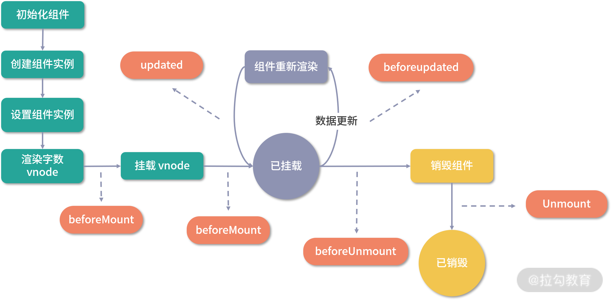

`Vue.js 3.0` 还有 2 个生命周期` API`，分别是 `onActivated` 和 `onDeactivated`，我们将会在介绍 `KeepAlive`组件时详细分析。

### 问题

**问：**如果你想在路由组件切换的时候，取消组件正在发送的异步 `Ajax` 请求，那你应该在哪个生命周期写这个逻辑呢？

**答：**取消`ajax`的请求和`setInterval`其实是类似的，所以建议在`beforeUnmount`中写这个逻辑，当然理论上在`unmount`写也是没问题的。

**问：**在组件初始化阶段，对于发送一些 Ajax 异步请求的逻辑，是应该放在 created 钩子函数中，还是应该放在 `mounted` 钩子函数中？

**答：**其实都可以

因为` created` 和 `mounted` 钩子函数执行的时候都能拿到组件数据，它们执行的顺序虽然有先后，但都会在一个 `Tick` 内执行完毕，而异步请求是有网络耗时的，其耗时远远大于一个 `Tick `的时间。所以，你无论在 `created` 还是在` mounted` 里发请求，都要等请求的响应回来，然后更新数据，再触发组件的重新渲染。

`Vue.js 2.x` 中的 `beforeCreate` 和 `created` 钩子函数可以用` setup` 函数替代。所以，对于组件初始化阶段发送异步请求的逻辑，放在 `setup `函数中、`beforeMount` 钩子函数中或者 `mounted `钩子函数中都可以，它们都可以拿到组件相关的数据。当然，**我更推荐在` setup` 函数中执行，因为从语义化的角度来看这样更合适。**

不过，**如果你想依赖` DOM` 去做一些初始化操作，那就只能把相关逻辑放在 `mounted` 钩子函数中了，这样你才能拿到组件渲染后的 `DOM`。**

## 3.6 依赖注入：子孙组件如何共享数据？

`Vue.js` 为我们提供了很多组件通讯的方式，常见的是父子组件通过` prop `传递数据。但是有时，我们希望能**跨父子组件通讯**，比如，无论组件之间嵌套多少层级，我都希望在后代组件中能访问它们祖先组件的数据。

`Vue.js 2.x `给我们提供了一种依赖注入的解决方案，即在祖先组件提供一个 `provide `选项，举个例子：

```javascript
// Provider 
import { provide, ref } from 'vue' 
export default { 
  setup() { 
    const theme = ref('dark') 
    provide('theme', theme) 
  } 
}
```

然后在子孙组件调用` inject API`：

```javascript
// Consumer 
import { inject } from 'vue' 
export default { 
  setup() { 
    const theme = inject('theme', 'light') 
    return { 
      theme 
    } 
  } 
}
```

这里要说明的是，`inject `函数接受第二个参数作为默认值，如果祖先组件上下文没有提供` theme`，则使用这个默认值。

实际上，你可以把依赖注入看作一部分“大范围有效的 `prop`”，而且它的规则更加宽松：**祖先组件不需要知道哪些后代组件在使用它提供的数据，后代组件也不需要知道注入的数据来自哪里**。

那么，依赖注入的背后实现原理是怎样的呢？接下来我们就一起分析吧。

### provide API

我们先来分析 `provide API` 的实现原理：

```javascript
function provide(key, value) { 
  let provides = currentInstance.provides 
  const parentProvides = currentInstance.parent && currentInstance.parent.provides 
  if (parentProvides === provides) { 
    provides = currentInstance.provides = Object.create(parentProvides) 
  } 
  provides[key] = value 
}
```

在创建组件实例的时候，组件实例的 `provides `对象指向父组件实例的 `provides `对象：

```javascript
const instance = { 
  // 依赖注入相关 
  provides: parent ? parent.provides : Object.create(appContext.provides), 
  // 其它属性 
  // ... 
}
```

这里，我们可以通过一张图直观感受一下它们之间的关系：

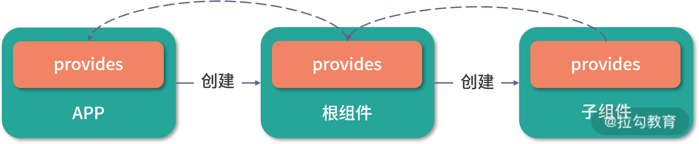

所以在默认情况下，组件实例的 `provides `继承它的父组件，但是当组件实例需要提供自己的值的时候，它使用父级提供的对象创建自己的 `provides `的对象原型。通过这种方式，在` inject `阶段，我们可以非常容易通过原型链查找来自直接父级提供的数据。

另外，如果组件实例提供和父级` provides` 中有相同` key `的数据，是可以覆盖父级提供的数据。举个例子：

```javascript
import { createApp, h, provide, inject } from 'vue' 
const ProviderOne = { 
  setup () { 
    provide('foo', 'foo') 
    provide('bar', 'bar') 
    return () => h(ProviderTwo) 
  } 
} 
const ProviderTwo = { 
  setup () { 
    provide('foo', 'fooOverride') 
    provide('baz', 'baz') 
    return () => h(Consumer) 
  } 
} 
const Consumer = { 
  setup () { 
    const foo = inject('foo') 
    const bar = inject('bar') 
    const baz = inject('baz') 
    return () => h('div', [foo, bar, baz].join('&')) 
  } 
} 
createApp(ProviderOne).mount('#app')
```

可以看到，这是一个嵌套 `provider` 的情况。根据 `provide` 函数的实现，`ProviderTwo `提供的 `key` 为 `foo` 的 `provider` 会覆盖 `ProviderOne` 提供的 `key` 为 `foo` 的 `provider`，所以最后渲染在 `Consumer` 组件上的就是 `fooOverride&bar&baz` 。

接下来，我们来分析另一个依赖注入的 `API —— inject`。

### `inject API`

我们先来看` inject API `的实现原理：

```javascript
function inject(key, defaultValue) { 
  const instance = currentInstance || currentRenderingInstance 
  if (instance) { 
    const provides = instance.provides 
    if (key in provides) { 
      return provides[key] 
    } 
    else if (arguments.length > 1) { 
      return defaultValue 
    } 
    else if ((process.env.NODE_ENV !== 'production')) { 
      warn(`injection "${String(key)}" not found.`) 
    } 
  } 
}
```

前文我们已经分析了` provide` 的实现后，在此基础上，理解` inject `的实现就非常简单了。`inject `支持两个参数，第一个参数是 `key`，我们可以访问组件实例中的 `provides `对象对应的 `key`，层层查找父级提供的数据。第二个参数是默认值，如果查找不到数据，则直接返回默认值。

如果既查找不到数据且也没有传入默认值，则在非生产环境下报警告，提示用户找不到这个注入的数据。

到这里我们就掌握了 `provide `和` inject` 的实现原理。但是，我曾经看到过一个问题：**“ `Vue.js 3` 跨组件共享数据，为何要用 `provide/inject` ？直接 `export/import `数据行吗？“**

接下来我们就来探讨依赖注入和模块化共享数据的差异。

### 对比模块化共享数据的方式

我们先来看提问者给出的一个模块化共享数据的示例，即首先在根组件创建一个共享的数据 `sharedData`：

```javascript
// Root.js 
export const sharedData = ref('') 
export default { 
  name: 'Root', 
  setup() {
    // ... 
  }, 
  // ... 
}
```

然后在子组件中使用 `sharedData`：

```javascript
import { sharedData } from './Root.js' 
export default { 
  name: 'Root', 
  setup() {
    // 这里直接使用 sharedData 即可 
  } 
}
```

当然，从这个示例上来看，模块化的方式是可以共享数据，但是 provide 和 inject 与模块化方式有如下几点不同。

- **作用域不同**

对于依赖注入，它的作用域是局部范围，所以你只能把数据注入以这个节点为根的后代组件中，不是这棵子树上的组件是不能访问到该数据的；而对于模块化的方式，它的作用域是全局范围的，你可以在任何地方引用它导出的数据。

- **数据来源不同**

对于依赖注入，后代组件是不需要知道注入的数据来自哪里，只管注入并使用即可；而对于模块化的方式提供的数据，用户必须明确知道这个数据是在哪个模块定义的，从而引入它。

- **上下文不同**

对于依赖注入，提供数据的组件的上下文就是组件实例，而且同一个组件定义是可以有多个组件实例的，我们可以根据不同的组件上下文提供不同的数据给后代组件；而对于模块化提供的数据，它是没有任何上下文的，仅仅是这个模块定义的数据，如果想要根据不同的情况提供不同数据，那么从 `API` 层面设计就需要做更改。

比如允许用户传递一个参数：

```javascript
export function getShareData(context) { 
  // 根据不同的 context 参数返回不同的数据 
}
```

掌握了这些不同，在不同场景下你就应该知道选择哪种方式提供数据了。

### 依赖注入的缺陷和应用场景

我们再回到依赖注入，它确实提供了一种组件共享的方式，但并非完美的。正因为依赖注入是上下文相关的，所以它会将你应用程序中的组件与它们当前的组织方式耦合起来，这使得重构变得困难。

来回顾一下依赖注入的特点 ：**祖先组件不需要知道哪些后代组件使用它提供的数据**，**后代组件也不需要知道注入的数据来自哪里**。

如果在一次重构中我们不小心挪动了有依赖注入的后代组件的位置，或者是挪动了提供数据的祖先组件的位置，都有可能导致后代组件丢失注入的数据，进而导致应用程序异常。所以，我**并不推荐在普通应用程序代码中使用依赖注入**。

但是我推荐你在组件库的开发中使用，因为对于一个特定组件，它和其嵌套的子组件上下文联系很紧密。

这里来举一个 `Element-UI `组件库` Select `组件的例子：

```vue
<template> 
  <el-select v-model="value" placeholder="请选择"> 
    <el-option 
      v-for="item in options" 
      :key="item.value" 
      :label="item.label" 
      :value="item.value"> 
    </el-option> 
  </el-select> 
</template> 
<script> 
  export default { 
    data() { 
      return { 
        options: [{ 
          value: '选项1', 
          label: '黄金糕' 
        }, { 
          value: '选项2', 
          label: '双皮奶' 
        }, { 
          value: '选项3', 
          label: '蚵仔煎' 
        }, { 
          value: '选项4', 
          label: '龙须面' 
        }, { 
          value: '选项5', 
          label: '北京烤鸭' 
        }], 
        value: '' 
      } 
    } 
  } 
</script>
```

这是 `Select `组件的基础示例，它最终会在页面上渲染成这样：

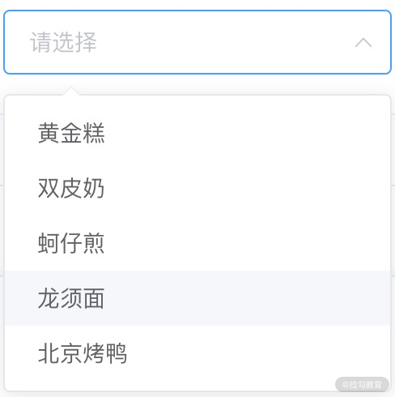

子组件` ElOption `负责渲染每一个选项，它的内部想要访问最外层的` ElSelect `组件时，就可以通过依赖注入的方式，在 `ElSelect `组件中提供组件的实例：

```javascript
export default { 
  provide() { 
    return { 
      'select': this 
    }; 
  } 
}
```

就这样，我们可以在` ElOption` 组件注入这个数据：

```javascript
export default { 
  inject: ['select'] 
}
```

虽然这些代码还是用的 `Vue.js 2.x `的` Options API `方式，但是依赖注入的思想是不变的。

你可能会问，为什么不在` ElOption` 子组件内通过` this.$parent `访问外层的` ElSelect `组件实例呢？

虽然` this.$parent `指向的是它的父组件实例，在我们这个例子是可以的，但如果组件结构发生了变化呢？

我们再来看另一个 `Select` 组件的例子：

```vue
<template> 
  <el-select v-model="value" placeholder="请选择"> 
    <el-option-group 
      v-for="group in options" 
      :key="group.label" 
      :label="group.label"> 
      <el-option 
        v-for="item in group.options" 
        :key="item.value" 
        :label="item.label" 
        :value="item.value"> 
      </el-option> 
    </el-option-group> 
  </el-select> 
</template> 
<script> 
  export default { 
    data() { 
      return { 
        options: [{ 
          label: '热门城市', 
          options: [{ 
            value: 'Shanghai', 
            label: '上海' 
          }, { 
            value: 'Beijing', 
            label: '北京' 
          }] 
        }, { 
          label: '城市名', 
          options: [{ 
            value: 'Chengdu', 
            label: '成都' 
          }, { 
            value: 'Shenzhen', 
            label: '深圳' 
          }, { 
            value: 'Guangzhou', 
            label: '广州' 
          }, { 
            value: 'Dalian', 
            label: '大连' 
          }] 
        }], 
        value: '' 
      } 
    } 
  } 
</script>
```

这是 `Select` 组件的分组示例，最终会在页面上渲染成这样：

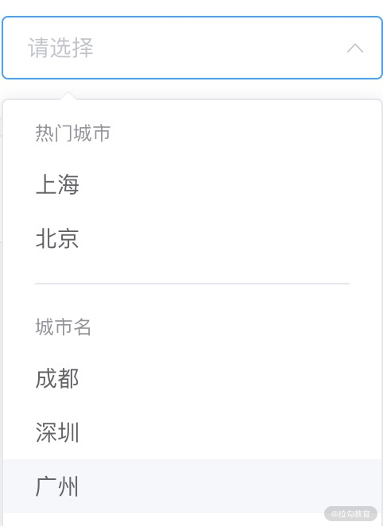

显然，这里` ElOption `中的` this.$parent` 指向的就不是` ElSelect `组件实例，而是` ElOptionGroup `组件实例。但如果我们用依赖注入的方式，即使结构变了，还是可以在 `ElOption `组件中正确访问到 `ElSelect `的实例。

所以，`this.$parent `是一种强耦合的获取父组件实例方式，非常不利于代码的重构，因为一旦组件层级发生变化，就会产生非预期的后果，所以在平时的开发工作中你应该慎用这个属性。

相反，**在组件库的场景中，依赖注入还是很方便的，除了示例中提供组件实例数据，还可以提供任意类型的数据。因为入口组件和它的相关子组件关联性是很强的，无论后代组件的结构如何变化，最终都会渲染在入口组件的子树上。**

### 总结

通过学习，应该掌握 `Vue.js `依赖注入的实现原理，了解依赖注入的使用场景和它的缺陷。

到目前为止，我们已经学习了` Vue.js 3.0` 提供的所有常用的` Composition API`。可以看到和 `Vue.js 2.x Options API `相比，我们不再是通过编写一些组件配置去描述一个组件，更像是主动调用一些 `API `去编写组件的实现逻辑。

`Vue.js 2.x `中，框架背后帮我们做了很多事情，比如我们在 `data `中定义的变量，在组件实例化阶段会把它们变成响应式的，这个行为是黑盒的，用户是无感知的。反观 `Vue.js 3.0 Composition API`，用户会利用 `reactive` 或者 `ref API `主动去申明一个响应式对象。

所以**通过 `Composition API `去编写组件**，**用户更清楚自己在做什么事情**。

另外，为什么说` Composition API` 比 `mixin `更适合逻辑复用呢？

其实，二者都是把复用的逻辑放在单独的文件中维护。但从使用的方式而言，用户只是在需要混入` mixin `的组件中去申明这个 `mixin`，使用方式如下：

```vue
<template> 
  <div> 
    Mouse position: x {{ x }} / y {{ y }} 
  </div> 
</template> 
<script> 
import mousePositionMixin from './mouse' 
export default { 
  mixins: [mousePositionMixin] 
} 
</script>
```

我们在组件中申明了 `mousePositionMixin`，组件模板中使用的 `x、y `就来源于这个` mixin`，这一切都是 `Vue.js `内部帮我们做的。如果该组件只引入这单个 `mixin`，问题倒不大，但如果这个组件引入的 `mixin` 越来越多，很容易出现命名冲突的情况，以及造成数据来源不清晰等问题。

而我们通过 `Composition API `去编写功能类似的 `hook `函数，使用方式如下：

```vue
<template> 
  <div> 
    Mouse position: x {{ x }} / y {{ y }} 
  </div> 
</template> 
<script> 
  import useMousePosition from './mouse' 
  export default { 
    setup() { 
      const { x, y } = useMousePosition() 
      return { x, y } 
    } 
  } 
</script>
```

我们可以清楚地分辨出模板中使用的 `x、y `是来源于 `useMousePosition` 函数，即便我们引入更多的` hook `函数，也不会出现命名冲突的情况。

`Composition API `在逻辑复用上确实有不错的优势，但是它并非完美的，使用起来会增加代码量。`Composition API `属于` API `的增强，它并不是` Vue.js 3.0 `组件开发的范式，如果你的组件足够简单，还是可 以使用` Options API `的。

### 问题

**问：**如果你想利用依赖注入让整个应用下组件都能共享某个数据，你会怎么做？为什么？

**答：**应该在需要下发的父组件中下发数据，因为在复杂而组件嵌套深度大的情况下，通过上文阐述那样，子组件通过原型链来查找父组件的数据，而查找原型链越长，则查找时间越大，所以原型链应该尽可能短。`Vue`的依赖注入和`react`的`context`一样，都是从父组件下发到子组件中，不论是否嵌套。

# 四、编译过程以及优化

在组件实现的章节，分析了组件生成到页面 `DOM` 会经历创建 `vnode`、渲染 `vnode` 到 `DOM` 的过程。但其实编写组件时，并不会直接去手写组件 `vnode`，其中创建 `vnode` 的过程，实际上是` Vue.js `内部完成的。

在组件的渲染过程中，会通过` renderComponentRoot` 方法渲染子树 `vnode`，然后再把子树` vnode patch` 生成 `DOM`。`renderComponentRoot` 内部主要通过执行组件实例的 `render `函数，创建生成子树` vnode`。

而最常见的开发组件的方式就是编写` template `模板去描述组件的` DOM `结构，很少直接去编写组件的 `render `函数，那么 `Vue.js `内部就需要把 `template `编译生成` render` 函数，这就是` Vue.js` 的编译过程。组件` template` 的编译过程，可以离线完成，也可以运行时完成。

由于编译过程平时开发中很难接触到，所以不需要对每一个细节都了解，只要对整体有一个理解和掌握即可。另外，后续在分析 `Vue.js` 的一些特性时，也会结合编译过程一起分析，也会经常回顾编译的过程和结果，以加深印象。

可以使用官方的一个[模板导出工具](https://vue-next-template-explorer.netlify.app/)，在线调试模板的实时编译结果，辅助学习。如果你想在线调试编译的过程，可以在 `vue-next` 的源码 `packages/template-explorer/dist/template-explorer.global.js `中的关键流程上打`debugger` 断点，然后在根目录下运行` npm run dev-compiler `命令，接着访问 http://localhost:5000/packages/template-explorer调试即可。

## 4.1  模板解析：构造 `AST` 的完整流程是怎样的？

`Vue.js 3.0 `的编译场景分服务端 `SSR `编译和 `web `编译，本文我们只分析 `web `的编译。

我们先来看` web` 编译的入口 `compile `函数，分析它的实现原理：

```javascript
function compile(template, options = {}) { 
  return baseCompile(template, extend({}, parserOptions, options, { 
    nodeTransforms: [...DOMNodeTransforms, ...(options.nodeTransforms || [])], 
    directiveTransforms: extend({}, DOMDirectiveTransforms, options.directiveTransforms || {}), 
    transformHoist:  null 
  })) 
} 
```

`compile` 函数支持两个参数，第一个参数` template `是待编译的模板字符串，第二个参数 `options `是编译的一些配置信息。

`compile` 内部通过执行` baseCompile` 方法完成编译工作，可以看到 `baseCompile`在参数 `options` 的基础上又扩展了一些配置。对于这些编译相关的配置，我们后面会在具体的场景具体分析。

接下来，我们来看一下`baseCompile` 的实现：

```javascript
function baseCompile(template,  options = {}) { 
  const prefixIdentifiers = false 
  // 解析 template 生成 AST 
  const ast = isString(template) ? baseParse(template, options) : template 
  const [nodeTransforms, directiveTransforms] = getBaseTransformPreset() 
  // AST 转换 
  transform(ast, extend({}, options, { 
    prefixIdentifiers, 
    nodeTransforms: [ 
      ...nodeTransforms, 
      ...(options.nodeTransforms || []) 
    ], 
    directiveTransforms: extend({}, directiveTransforms, options.directiveTransforms || {} 
    ) 
  })) 
  // 生成代码 
  return generate(ast, extend({}, options, { 
    prefixIdentifiers 
  })) 
}     
```

可以看到，`baseCompile` 函数主要做三件事情：解析 `template `生成` AST`，`AST `转换和生成代码。

这一节课我们的目标就是解析 `template` 生成` AST `背后的实现原理。

### 生成 `AST` 抽象语法树

你可以在百度百科中看到` AST` 的定义，这里我就不赘述啦，对应到我们的` template`，也可以用 `AST` 去描述它，比如我们有如下 `template`：

```vue
<div class="app"> 
  <!-- 这是一段注释 --> 
  <hello> 
    <p>{{ msg }}</p> 
  </hello> 
  <p>This is an app</p> 
</div> 
```

它经过第一步解析后，生成相应的 `AST `对象：

```javascript
{ 
  "type": 0, 
  "children": [ 
    { 
      "type": 1, 
      "ns": 0, 
      "tag": "div", 
      "tagType": 0, 
      "props": [ 
        { 
          "type": 6, 
          "name": "class", 
          "value": { 
            "type": 2, 
            "content": "app", 
            "loc": { 
              "start": { 
                "column": 12, 
                "line": 1, 
                "offset": 11 
              }, 
              "end": { 
                "column": 17, 
                "line": 1, 
                "offset": 16 
              }, 
              "source": "\"app\"" 
            } 
          }, 
          "loc": { 
            "start": { 
              "column": 6, 
              "line": 1, 
              "offset": 5 
            }, 
            "end": { 
              "column": 17, 
              "line": 1, 
              "offset": 16 
            }, 
            "source": "class=\"app\"" 
          } 
        } 
      ], 
      "isSelfClosing": false, 
      "children": [ 
        { 
          "type": 3, 
          "content": " 这是一段注释 ", 
          "loc": { 
            "start": { 
              "column": 3, 
              "line": 2, 
              "offset": 20 
            }, 
            "end": { 
              "column": 18, 
              "line": 2, 
              "offset": 35 
            }, 
            "source": "<!-- 这是一段注释 -->" 
          } 
        }, 
        { 
          "type": 1, 
          "ns": 0, 
          "tag": "hello", 
          "tagType": 1, 
          "props": [], 
          "isSelfClosing": false, 
          "children": [ 
            { 
              "type": 1, 
              "ns": 0, 
              "tag": "p", 
              "tagType": 0, 
              "props": [], 
              "isSelfClosing": false, 
              "children": [ 
                { 
                  "type": 5, 
                  "content": { 
                    "type": 4, 
                    "isStatic": false, 
                    "isConstant": false, 
                    "content": "msg", 
                    "loc": { 
                      "start": { 
                        "column": 11, 
                        "line": 4, 
                        "offset": 56 
                      }, 
                      "end": { 
                        "column": 14, 
                        "line": 4, 
                        "offset": 59 
                      }, 
                      "source": "msg" 
                    } 
                  }, 
                  "loc": { 
                    "start": { 
                      "column": 8, 
                      "line": 4, 
                      "offset": 53 
                    }, 
                    "end": { 
                      "column": 17, 
                      "line": 4, 
                      "offset": 62 
                    }, 
                    "source": "{{ msg }}" 
                  } 
                } 
              ], 
              "loc": { 
                "start": { 
                  "column": 5, 
                  "line": 4, 
                  "offset": 50 
                }, 
                "end": { 
                  "column": 21, 
                  "line": 4, 
                  "offset": 66 
                }, 
                "source": "<p>{{ msg }}</p>" 
              } 
            } 
          ], 
          "loc": { 
            "start": { 
              "column": 3, 
              "line": 3, 
              "offset": 38 
            }, 
            "end": { 
              "column": 11, 
              "line": 5, 
              "offset": 77 
            }, 
            "source": "<hello>\n    <p>{{ msg }}</p>\n  </hello>" 
          } 
        }, 
        { 
          "type": 1, 
          "ns": 0, 
          "tag": "p", 
          "tagType": 0, 
          "props": [], 
          "isSelfClosing": false, 
          "children": [ 
            { 
              "type": 2, 
              "content": "This is an app", 
              "loc": { 
                "start": { 
                  "column": 6, 
                  "line": 6, 
                  "offset": 83 
                }, 
                "end": { 
                  "column": 20, 
                  "line": 6, 
                  "offset": 97 
                }, 
                "source": "This is an app" 
              } 
            } 
          ], 
          "loc": { 
            "start": { 
              "column": 3, 
              "line": 6, 
              "offset": 80 
            }, 
            "end": { 
              "column": 24, 
              "line": 6, 
              "offset": 101 
            }, 
            "source": "<p>This is an app</p>" 
          } 
        } 
      ], 
      "loc": { 
        "start": { 
          "column": 1, 
          "line": 1, 
          "offset": 0 
        }, 
        "end": { 
          "column": 7, 
          "line": 7, 
          "offset": 108 
        }, 
        "source": "<div class=\"app\">\n  <!-- 这是一段注释 -->\n  <hello>\n    <p>{{ msg }}</p>\n  </hello>\n  <p>This is an app</p>\n</div>" 
      } 
    } 
  ], 
  "helpers": [], 
  "components": [], 
  "directives": [], 
  "hoists": [], 
  "imports": [], 
  "cached": 0, 
  "temps": 0, 
  "loc": { 
    "start": { 
      "column": 1, 
      "line": 1, 
      "offset": 0 
    }, 
    "end": { 
      "column": 7, 
      "line": 7, 
      "offset": 108 
    }, 
    "source": "<div class=\"app\">\n  <!-- 这是一段注释 -->\n  <hello>\n    <p>{{ msg }}</p>\n  </hello>\n  <p>This is an app</p>\n</div>" 
  } 
} 
```

可以看到，**`AST `是树状结构，对于树中的每个节点，会有 `type` 字段描述节点的类型，`tag `字段描述节点的标签，`props `描述节点的属性，`loc` 描述节点对应代码相关信息，`children` 指向它的子节点对象数组。**

当然` AST `中的节点还包含其他的一些属性，我在这里就不一一介绍了，你现在要理解的是` AST `中的节点是可以完整地描述它在模板中映射的节点信息。

注意，**`AST` 对象根节点其实是一个虚拟节点，它并不会映射到一个具体节点，另外它还包含了其他的一些属性，这些属性在后续的 `AST` 转换的过程中会赋值，并在生成代码阶段用到。**

那么，为什么要设计一个虚拟节点呢？

**因为 `Vue.js 3.0` 和 `Vue.js 2.x `有一个很大的不同——`Vue.js 3.0` 支持了` Fragment` 的语法，即组件可以有多个根节点**，比如：

```javascript
 
<hello :msg="msg"></hello> 
```

这种写法在 `Vue.js 2.x `中会报错，提示模板只能有一个根节点，而` Vue.js 3.0 `允许了这种写法。但是对于一棵树而言，必须有一个根节点，所以虚拟节点在这种场景下就非常有用了，它可以作为 `AST` 的根节点，然后其` children `包含了` img `和` hello `的节点。

好了，到这里你已经大致了解了 `AST`，那么接下来我们看一下如何根据模板字符串来构建这个` AST` 对象吧。

先来看一下 `baseParse` 的实现：

```javascript
function baseParse(content, options = {}) { 
    // 创建解析上下文 
    const context = createPa  rserContext(content, options) 
    const start = getCursor(context) 
    // 解析子节点，并创建 AST  
    return createRoot(parseChildren(context, 0 /* DATA */, []), getSelection(context, start)) 
} 
```

**`baseParse `主要就做三件事情：创建解析上下文，解析子节点，创建 `AST `根节点。**

#### 创建解析上下文

首先，我们来分析创建解析上下文的过程，先来看 `createParserContext `的实现：

```javascript
// 默认解析配置 
const defaultParserOptions = { 
  delimiters: [`{{`, `}}`], 
  getNamespace: () => 0 /* HTML */, 
  getTextMode: () => 0 /* DATA */, 
  isVoidTag: NO, 
  isPreTag: NO, 
  isCustomElement: NO, 
  decodeEntities: (rawText) => rawText.replace(decodeRE, (_, p1) => decodeMap[p1]), 
  onError: defaultOnError 
} 
function createParserContext(content, options) { 
  return { 
    options: extend({}, defaultParserOptions, options), 
    column: 1, 
    line: 1, 
    offset: 0, 
    originalSource: content, 
    source: content, 
    inPre: false, 
    inVPre: false 
  } 
} 
```

解析上下文实际上就是一个` JavaScript `对象，它维护着解析过程中的上下文，其中 `options `表示解析相关配置 ，`column `表示当前代码的列号，`line `表示当前代码的行号，`originalSource` 表示最初的原始代码，`source`表示当前代码，`offset` 表示当前代码相对于原始代码的偏移量，`inPre` 表示当前代码是否在` pre` 标签内，`inVPre` 表示当前代码是否在 `v-pre` 指令的环境下。

在后续解析的过程中，会始终维护和更新这个解析上下文，它能够表示当前解析的状态。

创建完解析上下文，接下来就开始解析子节点了。

#### 解析子节点

我们先来看一下 `parseChildren` 函数的实现：

```javascript
function parseChildren(context, mode, ancestors) { 
  const parent = last(ancestors) 
  const ns = parent ? parent.ns : 0 /* HTML */ 
  const nodes = [] 
   
  // 自顶向下分析代码，生成 nodes 
   
  let removedWhitespace = false 
  // 空白字符管理 
   
  return removedWhitespace ? nodes.filter(Boolean) : nodes 
} 
```

`parseChildren` 的目的就是解析并创建` AST `节点数组。它有两个主要流程，**第一个是自顶向下分析代码，生成` AST `节点数组 `nodes`；第二个是空白字符管理，用于提高编译的效率。**

首先，我们来看生成 `AST `节点数组的流程：

```javascript
function parseChildren(context, mode, ancestors) { 
  // 父节点 
  const parent = last(ancestors) 
  const ns = parent ? parent.ns : 0 /* HTML */ 
  const nodes = [] 
  // 判断是否遍历结束 
  while (!isEnd(context, mode, ancestors)) { 
    const s = context.source 
    let node = undefined 
    if (mode === 0 /* DATA */ || mode === 1 /* RCDATA */) { 
      if (!context.inVPre && startsWith(s, context.options.delimiters[0])) { 
        // 处理 {{ 插值代码 
        node = parseInterpolation(context, mode) 
      } 
      else if (mode === 0 /* DATA */ && s[0] === '<') { 
        // 处理 < 开头的代码 
        if (s.length === 1) { 
          // s 长度为 1，说明代码结尾是 <，报错 
          emitError(context, 5 /* EOF_BEFORE_TAG_NAME */, 1) 
        } 
        else if (s[1] === '!') { 
          // 处理 <! 开头的代码 
          if (startsWith(s, '<!--')) { 
            // 处理注释节点 
            node = parseComment(context) 
          } 
          else if (startsWith(s, '<!DOCTYPE')) { 
            // 处理 <!DOCTYPE 节点 
            node = parseBogusComment(context) 
          } 
          else if (startsWith(s, '<![CDATA[')) { 
            // 处理 <![CDATA[ 节点 
            if (ns !== 0 /* HTML */) { 
              node = parseCDATA(context, ancestors) 
            } 
            else { 
              emitError(context, 1 /* CDATA_IN_HTML_CONTENT */) 
              node = parseBogusComment(context) 
            } 
          } 
          else { 
            emitError(context, 11 /* INCORRECTLY_OPENED_COMMENT */) 
            node = parseBogusComment(context) 
          } 
        } 
        else if (s[1] === '/') { 
          // 处理 </ 结束标签 
          if (s.length === 2) { 
            // s 长度为 2，说明代码结尾是 </，报错 
            emitError(context, 5 /* EOF_BEFORE_TAG_NAME */, 2) 
          } 
          else if (s[2] === '>') { 
            // </> 缺少结束标签，报错 
            emitError(context, 14 /* MISSING_END_TAG_NAME */, 2) 
            advanceBy(context, 3) 
            continue 
          } 
          else if (/[a-z]/i.test(s[2])) { 
            // 多余的结束标签 
            emitError(context, 23 /* X_INVALID_END_TAG */) 
            parseTag(context, 1 /* End */, parent) 
            continue 
          } 
          else { 
            emitError(context, 12 /* INVALID_FIRST_CHARACTER_OF_TAG_NAME */, 2) 
            node = parseBogusComment(context) 
          } 
        } 
        else if (/[a-z]/i.test(s[1])) { 
          // 解析标签元素节点 
          node = parseElement(context, ancestors) 
        } 
        else if (s[1] === '?') { 
          emitError(context, 21 /* UNEXPECTED_QUESTION_MARK_INSTEAD_OF_TAG_NAME */, 1) 
          node = parseBogusComment(context) 
        } 
        else { 
          emitError(context, 12 /* INVALID_FIRST_CHARACTER_OF_TAG_NAME */, 1) 
        } 
      } 
    } 
    if (!node) { 
      // 解析普通文本节点 
      node = parseText(context, mode) 
    } 
    if (isArray(node)) { 
      // 如果 node 是数组，则遍历添加 
      for (let i = 0; i < node.length; i++) { 
        pushNode(nodes, node[i]) 
      } 
    } 
    else { 
      // 添加单个 node 
      pushNode(nodes, node) 
    } 
  } 
} 
```

这些代码看起来很复杂，但它的思路就是自顶向下地去遍历代码，然后根据不同的情况尝试去解析代码，然后把生成的 `node` 添加到 `AST nodes` 数组中。在解析的过程中，解析上下文` context `的状态也是在不断发生变化的，我们可以通过` context.source` 拿到当前解析剩余的代码` s`，然后根据 `s `不同的情况走不同的分支处理逻辑。在解析的过程中，可能会遇到各种错误，都会通过 `emitError `方法报错。

我们没有必要去了解所有代码的分支细节，只需要知道大致的解析思路即可，因此我们这里只分析四种情况：**注释节点的解析、插值的解析、普通文本的解析，以及元素节点的解析。**

##### 注释节点的解析

首先，我们来看注释节点的解析过程，它会解析模板中的注释节点，比如 <!-- 这是一段注释 -->， 即当前代码 `s `是以 <!-- 开头的字符串，则走到注释节点的解析处理逻辑。

我们来看 `parseComment` 的实现：

```javascript
function parseComment(context) { 
  const start = getCursor(context) 
  let content 
  // 常规注释的结束符 
  const match = /--(\!)?>/.exec(context.source) 
  if (!match) { 
    // 没有匹配的注释结束符 
    content = context.source.slice(4) 
    advanceBy(context, context.source.length) 
    emitError(context, 7 /* EOF_IN_COMMENT */) 
  } 
  else { 
    if (match.index <= 3) { 
      // 非法的注释符号 
      emitError(context, 0 /* ABRUPT_CLOSING_OF_EMPTY_COMMENT */) 
    } 
    if (match[1]) { 
      // 注释结束符不正确 
      emitError(context, 10 /* INCORRECTLY_CLOSED_COMMENT */) 
    } 
    // 获取注释的内容 
    content = context.source.slice(4, match.index) 
    // 截取到注释结尾之间的代码，用于后续判断嵌套注释 
    const s = context.source.slice(0, match.index) 
    let prevIndex = 1, nestedIndex = 0 
    // 判断嵌套注释符的情况，存在即报错 
    while ((nestedIndex = s.indexOf('<!--', prevIndex)) !== -1) { 
      advanceBy(context, nestedIndex - prevIndex + 1) 
      if (nestedIndex + 4 < s.length) { 
        emitError(context, 16 /* NESTED_COMMENT */) 
      } 
      prevIndex = nestedIndex + 1 
    } 
    // 前进代码到注释结束符后 
    advanceBy(context, match.index + match[0].length - prevIndex + 1) 
  } 
  return { 
    type: 3 /* COMMENT */, 
    content, 
    loc: getSelection(context, start) 
  } 
} 
```

**其实，`parseComment `的实现很简单，首先它会利用注释结束符的正则表达式去匹配代码，找出注释结束符。如果没有匹配到或者注释结束符不合法，都会报错。**
**如果找到合法的注释结束符，则获取它中间的注释内容 `content`，然后截取注释开头到结尾之间的代码，并判断是否有嵌套注释，如果有嵌套注释也会报错。**

**接着就是通过调用 `advanceBy` 前进代码到注释结束符后，这个函数在整个模板解析过程中经常被调用，它的目的是用来前进代码，更新` context `解析上下文**，我们来看一下它的实现：

```javascript
function advanceBy(context, numberOfCharacters) { 
  const { source } = context 
  // 更新 context 的 offset、line、column 
  advancePositionWithMutation(context, source, numberOfCharacters) 
  // 更新 context 的 source 
  context.source = source.slice(numberOfCharacters) 
} 
function advancePositionWithMutation(pos, source, numberOfCharacters = source.length) { 
  let linesCount = 0 
  let lastNewLinePos = -1 
  for (let i = 0; i < numberOfCharacters; i++) { 
    if (source.charCodeAt(i) === 10 /* newline char code */) { 
      linesCount++ 
      lastNewLinePos = i 
    } 
  } 
  pos.offset += numberOfCharacters 
  pos.line += linesCount 
  pos.column = 
    lastNewLinePos === -1 
      ? pos.column + numberOfCharacters 
      : numberOfCharacters - lastNewLinePos 
  return pos 
} 
```

`advanceBy` 的实现很简单，主要就是更新解析上下文` context` 中的` source `来前进代码，同时更新 `offset、line、column `等和代码位置相关的属性。

为了更直观地说明 `advanceBy` 的作用，前面的示例可以通过下图表示：

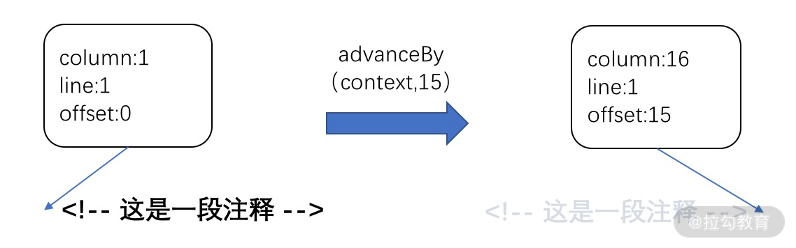

经过` advanceBy` 前进代码到注释结束符后，表示注释部分代码处理完毕，可以继续解析后续代码了。

`parseComment `最终返回的值就是一个描述注释节点的对象，其中 `type `表示它是一个注释节点，`content `表示注释的内容，`loc` 表示注释的代码开头和结束的位置信息。

##### 插值的解析

接下来，我们来看插值的解析过程，它会解析模板中的插值，比如 `{{ msg }}` ，即当前代码` s `是以 `{{ `开头的字符串，且不在 `v-pre` 指令的环境下（`v-pre` 会跳过插值的解析），则会走到插值的解析处理逻辑 `parseInterpolation` 函数，我们来看它的实现：

```javascript
function parseInterpolation(context, mode) { 
  // 从配置中获取插值开始和结束分隔符，默认是 {{ 和 }} 
  const [open, close] = context.options.delimiters 
  const closeIndex = context.source.indexOf(close, open.length) 
  if (closeIndex === -1) { 
    emitError(context, 25 /* X_MISSING_INTERPOLATION_END */) 
    return undefined 
  } 
  const start = getCursor(context) 
  // 代码前进到插值开始分隔符后 
  advanceBy(context, open.length) 
  // 内部插值开始位置 
  const innerStart = getCursor(context) 
  // 内部插值结束位置 
  const innerEnd = getCursor(context) 
  // 插值原始内容的长度 
  const rawContentLength = closeIndex - open.length 
  // 插值原始内容 
  const rawContent = context.source.slice(0, rawContentLength) 
  // 获取插值的内容，并前进代码到插值的内容后 
  const preTrimContent = parseTextData(context, rawContentLength, mode) 
  const content = preTrimContent.trim() 
  // 内容相对于插值开始分隔符的头偏移 
  const startOffset = preTrimContent.indexOf(content) 
  if (startOffset > 0) { 
    // 更新内部插值开始位置 
    advancePositionWithMutation(innerStart, rawContent, startOffset) 
  } 
  // 内容相对于插值结束分隔符的尾偏移 
  const endOffset = rawContentLength - (preTrimContent.length - content.length - startOffset) 
  // 更新内部插值结束位置 
  advancePositionWithMutation(innerEnd, rawContent, endOffset); 
  // 前进代码到插值结束分隔符后 
  advanceBy(context, close.length) 
  return { 
    type: 5 /* INTERPOLATION */, 
    content: { 
      type: 4 /* SIMPLE_EXPRESSION */, 
      isStatic: false, 
      isConstant: false, 
      content, 
      loc: getSelection(context, innerStart, innerEnd) 
    }, 
    loc: getSelection(context, start) 
  } 
} 
```

**`parseInterpolation` 的实现也很简单，首先它会尝试找插值的结束分隔符，如果找不到则报错。**

**如果找到，先前进代码到插值开始分隔符后，然后通过` parseTextData `获取插值中间的内容并前进代码到插值内容后，除了普通字符串，`parseTextData `内部会处理一些` HTML` 实体符号比如 `&nbsp` 。由于插值的内容可能是前后有空白字符的，所以最终返回的 `content `需要执行一下` trim` 函数。**

**为了准确地反馈插值内容的代码位置信息，我们使用了 `innerStart` 和`innerEnd `去记录插值内容（不包含空白字符）的代码开头和结束位置。**

**接着就是前进代码到插值结束分隔符后，表示插值部分代码处理完毕，可以继续解析后续代码了。**

`parseInterpolation `最终返回的值就是一个描述插值节点的对象，其中 `type` 表示它是一个插值节点，`loc `表示插值的代码开头和结束的位置信息，而 `content `又是一个描述表达式节点的对象，其中 `type `表示它是一个表达式节点，`loc` 表示内容的代码开头和结束的位置信息，`content `表示插值的内容。

##### 普通文本的解析

接下来，我们来看普通文本的解析过程，它会解析模板中的普通文本，比如 `This is an app `，即当前代码` s `既不是以` {{ `插值分隔符开头的字符串，也不是以 `< `开头的字符串，则走到普通文本的解析处理逻辑，我们来看` parseText `的实现：

```javascript
function parseText(context, mode) { 
  // 文本结束符 
  const endTokens = ['<', context.options.delimiters[0]] 
  if (mode === 3 /* CDATA */) { 
    // CDATA 标记 XML 中的纯文本 
    endTokens.push(']]>') 
  } 
  let endIndex = context.source.length 
  // 遍历文本结束符，匹配找到结束的位置 
  for (let i = 0; i < endTokens.length; i++) { 
    const index = context.source.indexOf(endTokens[i], 1) 
    if (index !== -1 && endIndex > index) { 
      endIndex = index 
    } 
  } 
  const start = getCursor(context) 
  // 获取文本的内容，并前进代码到文本的内容后 
  const content = parseTextData(context, endIndex, mode) 
  return { 
    type: 2 /* TEXT */, 
    content, 
    loc: getSelection(context, start) 
  } 
} 
```

同样，`parseText` 的实现很简单。对于一段文本来说，都是在遇到 `< `或者插值分隔符` {{` 结束，所以会遍历这些结束符，匹配并找到文本结束的位置，然后执行 `parseTextData` 获取文本的内容，并前进代码到文本的内容后。

`parseText` 最终返回的值就是一个描述文本节点的对象，其中 `type` 表示它是一个文本节点，`content `表示文本的内容，`loc `表示文本的代码开头和结束的位置信息。

##### 元素节点的解析

最后，我们来看元素节点的解析过程，它会解析模板中的标签节点，举个例子：

```javascript
<div class="app">
  <hello :msg="msg"></hello>
</div>
```

相对于前面三种类型的解析过程，元素节点的解析过程应该是最复杂的了，即当前代码` s `是以` < `开头，并且后面跟着字母，说明它是一个标签的开头，则走到元素节点的解析处理逻辑，我们来看` parseElement` 的实现：

```javascript
function parseElement(context, ancestors) {
  // 是否在 pre 标签内
  const wasInPre = context.inPre
  // 是否在 v-pre 指令内
  const wasInVPre = context.inVPre
  // 获取当前元素的父标签节点
  const parent = last(ancestors)
  // 解析开始标签，生成一个标签节点，并前进代码到开始标签后
  const element = parseTag(context, 0 /* Start */, parent)
  // 是否在 pre 标签的边界
  const isPreBoundary = context.inPre && !wasInPre
  // 是否在 v-pre 指令的边界
  const isVPreBoundary = context.inVPre && !wasInVPre
  if (element.isSelfClosing || context.options.isVoidTag(element.tag)) {
    // 如果是自闭和标签，直接返回标签节点
    return element
  }
  // 下面是处理子节点的逻辑
  // 先把标签节点添加到 ancestors，入栈
  ancestors.push(element)
  const mode = context.options.getTextMode(element, parent)
  // 递归解析子节点，传入 ancestors
  const children = parseChildren(context, mode, ancestors)
  // ancestors 出栈
  ancestors.pop()
  // 添加到 children 属性中
  element.children = children
  // 结束标签
  if (startsWithEndTagOpen(context.source, element.tag)) {
    // 解析结束标签，并前进代码到结束标签后
    parseTag(context, 1 /* End */, parent)
  }
  else {
    emitError(context, 24 /* X_MISSING_END_TAG */, 0, element.loc.start);
    if (context.source.length === 0 && element.tag.toLowerCase() === 'script') {
      const first = children[0];
      if (first && startsWith(first.loc.source, '<!--')) {
        emitError(context, 8 /* EOF_IN_SCRIPT_HTML_COMMENT_LIKE_TEXT */)
      }
    }
  }
  // 更新标签节点的代码位置，结束位置到结束标签后
  element.loc = getSelection(context, element.loc.start)
  if (isPreBoundary) {
    context.inPre = false
  }
  if (isVPreBoundary) {
    context.inVPre = false
  }
  return element
}
```

可以看到，这个过程中` parseElement `主要做了三件事情：**解析开始标签，解析子节点，解析闭合标签**。

###### 解析开始标签

首先，我们来看解析开始标签的过程。主要通过` parseTag` 方法来解析并创建一个标签节点，来看它的实现原理：

```javascript
function parseTag(context, type, parent) {
  // 标签打开
  const start = getCursor(context)
  // 匹配标签文本结束的位置
  const match = /^<\/?([a-z][^\t\r\n\f />]*)/i.exec(context.source);
  const tag = match[1];
  const ns = context.options.getNamespace(tag, parent);
  // 前进代码到标签文本结束位置
  advanceBy(context, match[0].length);
  // 前进代码到标签文本后面的空白字符后
  advanceSpaces(context);
  // 保存当前状态以防我们需要用 v-pre 重新解析属性
  const cursor = getCursor(context);
  const currentSource = context.source;
  // 解析标签中的属性，并前进代码到属性后
  let props = parseAttributes(context, type);
  // 检查是不是一个 pre 标签
  if (context.options.isPreTag(tag)) {
    context.inPre = true;
  }
  // 检查属性中有没有 v-pre 指令
  if (!context.inVPre &&
    props.some(p => p.type === 7 /* DIRECTIVE */ && p.name === 'pre')) {
    context.inVPre = true;
    // 重置 context
    extend(context, cursor);
    context.source = currentSource;
    // 重新解析属性，并把 v-pre 过滤了
    props = parseAttributes(context, type).filter(p => p.name !== 'v-pre');
  }
  // 标签闭合
  let isSelfClosing = false;
  if (context.source.length === 0) {
    emitError(context, 9 /* EOF_IN_TAG */);
  }
  else {
    // 判断是否自闭合标签
    isSelfClosing = startsWith(context.source, '/>');
    if (type === 1 /* End */ && isSelfClosing) {
      // 结束标签不应该是自闭和标签
      emitError(context, 4 /* END_TAG_WITH_TRAILING_SOLIDUS */);
    }
    // 前进代码到闭合标签后
    advanceBy(context, isSelfClosing ? 2 : 1);
  }
  let tagType = 0 /* ELEMENT */;
  const options = context.options;
  // 接下来判断标签类型，是组件、插槽还是模板
  if (!context.inVPre && !options.isCustomElement(tag)) {
    // 判断是否有 is 属性
    const hasVIs = props.some(p => p.type === 7 /* DIRECTIVE */ && p.name === 'is');
    if (options.isNativeTag && !hasVIs) {
      if (!options.isNativeTag(tag))
        tagType = 1 /* COMPONENT */;
    }
    else if (hasVIs ||
      isCoreComponent(tag) ||
      (options.isBuiltInComponent && options.isBuiltInComponent(tag)) ||
      /^[A-Z]/.test(tag) ||
      tag === 'component') {
      tagType = 1 /* COMPONENT */;
    }
    if (tag === 'slot') {
      tagType = 2 /* SLOT */;
    }
    else if (tag === 'template' &&
      props.some(p => {
        return (p.type === 7 /* DIRECTIVE */ && isSpecialTemplateDirective(p.name));
      })) {
      tagType = 3 /* TEMPLATE */;
    }
  }
  return {
    type: 1 /* ELEMENT */,
    ns,
    tag,
    tagType,
    props,
    isSelfClosing,
    children: [],
    loc: getSelection(context, start),
    codegenNode: undefined
  };
}
```

`parseTag` 首先匹配标签文本结束的位置，并前进代码到标签文本后面的空白字符后，然后解析标签中的属性，比如 `class、style `和指令等，`parseAttributes` 函数的实现我就不多说了，感兴趣的同学可以自己去看，它最终会解析生成一个` props `的数组，并前进代码到属性后。

接着去检查是不是一个` pre` 标签，如果是则设置 `context.inPre `为` true`；再去检查属性中有没有 `v-pre `指令，如果有则设置 `context.inVPre` 为` true`，并重置上下文 `context` 和重新解析属性；接下来再去判断是不是一个自闭和标签，并前进代码到闭合标签后；最后判断标签类型，是组件、插槽还是模板。

`parseTag `最终返回的值就是一个描述标签节点的对象，其中` type` 表示它是一个标签节点，`tag` 表示标签名，`tagType` 表示标签的类型，`content `表示文本的内容，`isSelfClosing `表示是否是一个闭合标签，`loc` 表示文本的代码开头和结束的位置信息，`children` 是标签的子节点数组，会先初始化为空。

###### 解析子节点

解析完开始标签后，再回到 `parseElement`，接下来第二步就是解析子节点，它把解析好的 `element` 节点添加到 `ancestors` 数组中，然后执行 `parseChildren `去解析子节点，并传入 `ancestors`。

如果有嵌套的标签，那么就会递归执行 `parseElement`，可以看到，在` parseElement `的一开始，我们能获取` ancestors` 数组的最后一个值拿到父元素的标签节点，这个就是我们在执行` parseChildren` 前添加到数组尾部的。

解析完子节点后，我们再把` element `从 `ancestors `中弹出，然后把` children `数组添加到` element.children `中，同时也把代码前进到子节点的末尾。

###### 解析结束标签

最后，就是解析结束标签，并前进代码到结束标签后，然后更新标签节点的代码位置。`parseElement `最终返回的值就是这样一个标签节点 `element`。

其实 `HTML `的嵌套结构的解析过程，就是一个递归解析元素节点的过程，为了维护父子关系，当需要解析子节点时，我们就把当前节点入栈，子节点解析完毕后，我们就把当前节点出栈，因此 `ancestors `的设计就是一个栈的数据结构，整个过程是一个不断入栈和出栈的过程。

通过不断地递归解析，我们就可以完整地解析整个模板，并且标签类型的 `AST `节点会保持对子节点数组的引用，这样就构成了一个树形的数据结构，所以整个解析过程构造出的 `AST `节点数组就能很好地映射整个模板的 `DOM `结构。

##### 空白字符管理

在前面的解析过程中，有些时候我们会遇到空白字符的情况，比如前面的例子：

```vue
<div class="app">
  <hello :msg="msg"></hello>
</div>
```

`div` 标签到下一行会有一个换行符，`hello` 标签前面也有空白字符，这些空白字符在解析的过程中会被当作文本节点解析处理。但这些空白节点显然是没有什么意义的，所以我们需要移除这些节点，减少后续对这些没用意义的节点的处理，以提高编译效率。

我们先来看一下空白字符管理相关逻辑代码：

```javascript
function parseChildren(context, mode, ancestors) {
  const parent = last(ancestors)
  const ns = parent ? parent.ns : 0 /* HTML */
  const nodes = []
  
  // 自顶向下分析代码，生成 nodes
  
  let removedWhitespace = false
  if (mode !== 2 /* RAWTEXT */) {
    if (!context.inPre) {
      for (let i = 0; i < nodes.length; i++) {
        const node = nodes[i]
        if (node.type === 2 /* TEXT */) {
          if (!/[^\t\r\n\f ]/.test(node.content)) {
            // 匹配空白字符
            const prev = nodes[i - 1]
            const next = nodes[i + 1] 
            // 如果空白字符是开头或者结尾节点
            // 或者空白字符与注释节点相连
            // 或者空白字符在两个元素之间并包含换行符
            // 那么这些空白字符节点都应该被移除
            if (!prev ||
              !next ||
              prev.type === 3 /* COMMENT */ ||
              next.type === 3 /* COMMENT */ ||
              (prev.type === 1 /* ELEMENT */ &&
                next.type === 1 /* ELEMENT */ &&
                /[\r\n]/.test(node.content))) {
              removedWhitespace = true
              nodes[i] = null
            }
            else {
              // 否则压缩这些空白字符到一个空格
              node.content = ' '
            }
          }
          else {
            // 替换内容中的空白空间到一个空格
            node.content = node.content.replace(/[\t\r\n\f ]+/g, ' ')
          }
        }
        else if (!(process.env.NODE_ENV !== 'production') && node.type === 3 /* COMMENT */) {
          // 生产环境移除注释节点
          removedWhitespace = true
          nodes[i] = null
        }
      }
    }
    else if (parent && context.options.isPreTag(parent.tag)) {
      // 根据 HTML 规范删除前导换行符
      const first = nodes[0]
      if (first && first.type === 2 /* TEXT */) {
        first.content = first.content.replace(/^\r?\n/, '')
      }
    }
  }
  
  // 过滤空白字符节点
  return removedWhitespace ? nodes.filter(Boolean) : nodes
}
```

这段代码逻辑很简单，主要就是遍历 `nodes`，拿到每一个 `AST `节点，判断是否为一个文本节点，如果是则判断它是不是空白字符；如果是则进一步判断空白字符是开头或还是结尾节点，或者空白字符与注释节点相连，或者空白字符在两个元素之间并包含换行符，如果满足上述这些情况，这些空白字符节点都应该被移除。

此外，不满足这三种情况的空白字符都会被压缩成一个空格，非空文本中间的空白字符也会被压缩成一个空格，在生产环境下注释节点也会被移除。

在` parseChildren `函数的最后，会过滤掉这些被标记清除的节点并返回过滤后的` AST `节点数组。

#### 创建 `AST` 根节点

子节点解析完毕，`baseParse `过程就剩最后一步创建 `AST `根节点了，我们来看一下 `createRoot `的实现：

```javascript
function createRoot(children, loc = locStub) {
  return {
    type: 0 /* ROOT */,
    children,
    helpers: [],
    components: [],
    directives: [],
    hoists: [],
    imports: [],
    cached: 0,
    temps: 0,
    codegenNode: undefined,
    loc
  }
}
```

`createRoot `的实现非常简单，它就是返回一个` JavaScript `对象，作为` AST `根节点。其中` type `表示它是一个根节点类型，`children `是我们前面解析的子节点数组。除此之外，这个根节点还添加了其它的属性，当前我们并不需要搞清楚每一个属性代表的含义，这些属性我们在分析后续的处理流程中会介绍。

### 总结

通过学习，应该掌握` Vue.js `编译过程的第一步，即把 `template `解析生成 `AST` 对象，整个解析过程是一个自顶向下的分析过程，也就是从代码开始，通过语法分析，找到对应的解析处理逻辑，创建 `AST `节点，处理的过程中也在不断前进代码，更新解析上下文，最终根据生成的 `AST `节点数组创建 `AST `根节点。

### 问题

**问：**在 `parseTag` 的过程中，如果解析的属性有 `v-pre` 标签，为什么要回到之前的 `context`，重新解析一次？

**答：**`v-pre`是想跳过这次的`tag`解析，因为解析到`v-pre`的时候，上下文环境已经发生了变化，这个时候设置标志位，回滚到之前的上下文重新解析，通过判断`v-pre`的标志位来决定是否跳过这次解析。如果解析完这次的话，`v-pre`标志位也会被重置

## 4.2 `AST `转换：`AST` 节点内部做了哪些转换？

**前面了解了`template `的解析过程，最终拿到了一个` AST` 节点对象。这个对象是对模板的完整描述，但是它还不能直接拿来生成代码，因为它的语义化还不够，没有包含和编译优化的相关属性，所以还需要进一步转换。**

`AST `转换过程非常复杂，有非常多的分支逻辑，为了方便你理解它的核心流程，我精心准备了一个示例，我们只分析示例场景在 `AST `转换过程中的相关代码逻辑，不过我希望你在学习完之后，可以举一反三，对示例做一些修改，学习更多场景的代码逻辑。

```vue
<div class="app">
  <hello v-if="flag"></hello>
  <div v-else>
    <p>>hello {{ msg + test }}</p>
    <p>static</p>
    <p>static</p>
  </div>
</div>
```

示例中，我们有普通的` DOM `节点，有组件节点，有 `v-bind `指令，有 `v-if `指令，有文本节点，也有表达式节点。

对于这个模板，我们通过 `parse` 生成一个` AST `对象，接下来我们就来分析这个 `AST `对象的转换都做了哪些事情。

我们会先通过` getBaseTransformPreset` 方法获取节点和指令转换的方法，然后调用 `transform `方法做` AST` 转换，并且把这些节点和指令的转换方法作为配置的属性参数传入。

```javascript
// 获取节点和指令转换的方法
const [nodeTransforms, directiveTransforms] = getBaseTransformPreset()
// AST 转换
transform(ast, extend({}, options, {
  prefixIdentifiers,
  nodeTransforms: [
    ...nodeTransforms,
    ...(options.nodeTransforms || []) // 用户自定义  transforms
  ],
  directiveTransforms: extend({}, directiveTransforms, options.directiveTransforms || {} // 用户自定义 transforms
  )
}))
```

我们先来看一下 `getBaseTransformPreset `返回哪些节点和指令的转换方法：

```javascript
function getBaseTransformPreset(prefixIdentifiers) {
  return [
    [
      transformOnce,
      transformIf,
      transformFor,
      transformExpression,
      transformSlotOutlet,
      transformElement,
      trackSlotScopes,
      transformText
    ],
    {
      on: transformOn,
      bind: transformBind,
      model: transformModel
    }
  ]
}
```

这里并不需要你进一步去看每个转换函数的实现，只要大致了解有哪些转换函数即可，这些转换函数会在后续执行` transform `的时候调用。

>  注意这里我们只分析在 `Node.js`环境下的编译过程。`Web `环境的编译结果可能会有一些差别，我们会在后续章节说明。

我们主要来看` transform `函数的实现：

```javascript
function transform(root, options) {
  const context = createTransformContext(root, options)
  traverseNode(root, context)
  if (options.hoistStatic) {
    hoistStatic(root, context)
  }
  if (!options.ssr) {
    createRootCodegen(root, context)
  }
  root.helpers = [...context.helpers]
  root.components = [...context.components]
  root.directives = [...context.directives]
  root.imports = [...context.imports]
  root.hoists = context.hoists
  root.temps = context.temps
  root.cached = context.cached
}
```

`transform` 的核心流程主要有四步：**创建 `transform `上下文、遍历` AST` 节点、静态提升以及创建根代码生成节点**。接下来，我们就好好分析一下每一步主要做了什么。

### 创建`transform` 上下文

首先，我们来看创建` transform `上下文的过程，其实和 `parse `过程一样，在 `transform `阶段会创建一个上下文对象，它的实现过程是这样的：

```javascript
function createTransformContext(root, { prefixIdentifiers = false, hoistStatic = false, cacheHandlers = false, nodeTransforms = [], directiveTransforms = {}, transformHoist = null, isBuiltInComponent = NOOP, expressionPlugins = [], scopeId = null, ssr = false, onError = defaultOnError }) {
  const context = {
    // 配置
    prefixIdentifiers,
    hoistStatic,
    cacheHandlers,
    nodeTransforms,
    directiveTransforms,
    transformHoist,
    isBuiltInComponent,
    expressionPlugins,
    scopeId,
    ssr,
    onError,
    // 状态数据
    root,
    helpers: new Set(),
    components: new Set(),
    directives: new Set(),
    hoists: [],
    imports: new Set(),
    temps: 0,
    cached: 0,
    identifiers: {},
    scopes: {
      vFor: 0,
      vSlot: 0,
      vPre: 0,
      vOnce: 0
    },
    parent: null,
    currentNode: root,
    childIndex: 0,
    // methods
    helper(name) {
      context.helpers.add(name)
      return name
    },
    helperString(name) {
      return `_${helperNameMap[context.helper(name)]}`
    },
    replaceNode(node) {
      context.parent.children[context.childIndex] = context.currentNode = node
    },
    removeNode(node) {
      const list = context.parent.children
      const removalIndex = node
        ? list.indexOf(node)
        : context.currentNode
          ? context.childIndex
          : -1
      if (!node || node === context.currentNode) {
        // 移除当前节点
        context.currentNode = null
        context.onNodeRemoved()
      }
      else {
        // 移除兄弟节点
        if (context.childIndex > removalIndex) {
          context.childIndex--
          context.onNodeRemoved()
        }
      }
      // 移除节点
      context.parent.children.splice(removalIndex, 1)
    },
    onNodeRemoved: () => { },
    addIdentifiers(exp) {
    },
    removeIdentifiers(exp) {
    },
    hoist(exp) {
      context.hoists.push(exp)
      const identifier = createSimpleExpression(`_hoisted_${context.hoists.length}`, false, exp.loc, true)
      identifier.hoisted = exp
      return identifier
    },
    cache(exp, isVNode = false) {
      return createCacheExpression(++context.cached, exp, isVNode)
    }
  }
  return context
}
```

其实，这个上下文对象 `context` 维护了` transform `过程的一些配置，比如前面提到的节点和指令的转换函数等；还维护了 `transform` 过程的一些状态数据，比如当前处理的 `AST `节点，当前 `AST `节点在子节点中的索引，以及当前 `AST` 节点的父节点等。此外，`context` 还包含了在转换过程中可能会调用的一些辅助函数，和一些修改 context 对象的方法。

你现在也没必要去了解它的每一个属性和方法的含义，只需要你大致有一个印象即可，未来分析某个具体场景，再回过头了解它们的实现即可。

创建完上下文对象后，接下来就需要遍历 `AST` 节点。

### 遍历` AST` 节点

遍历 `AST` 节点的过程很关键，因为核心的转换过程就是在遍历中实现的：

```javascript
function traverseNode(node, context) {
  context.currentNode = node
  // 节点转换函数
  const { nodeTransforms } = context
  const exitFns = []
  for (let i = 0; i < nodeTransforms.length; i++) {
    // 有些转换函数会设计一个退出函数，在处理完子节点后执行
    const onExit = nodeTransforms[i](node, context)
    if (onExit) {
      if (isArray(onExit)) {
        exitFns.push(...onExit)
      }
      else {
        exitFns.push(onExit)
      }
    }
    if (!context.currentNode) {
      // 节点被移除
      return
    }
    else {
      // 因为在转换的过程中节点可能被替换，恢复到之前的节点
      node = context.currentNode
    }
  }
  switch (node.type) {
    case 3 /* COMMENT */:
      if (!context.ssr) {
        // 需要导入 createComment 辅助函数
        context.helper(CREATE_COMMENT)
      }
      break
    case 5 /* INTERPOLATION */:
      // 需要导入 toString 辅助函数
      if (!context.ssr) {
        context.helper(TO_DISPLAY_STRING)
      }
      break
    case 9 /* IF */:
      // 递归遍历每个分支节点
      for (let i = 0; i < node.branches.length; i++) {
        traverseNode(node.branches[i], context)
      }
      break
    case 10 /* IF_BRANCH */:
    case 11 /* FOR */:
    case 1 /* ELEMENT */:
    case 0 /* ROOT */:
      // 遍历子节点
      traverseChildren(node, context)
      break
  }
  // 执行转换函数返回的退出函数
  let i = exitFns.length
  while (i--) {
    exitFns[i]()
  }
}
```

这里，`traverseNode `函数的基本思路就是递归遍历` AST` 节点，针对每个节点执行一系列的转换函数，有些转换函数还会设计一个退出函数，当你执行转换函数后，它会返回一个新函数，然后在你处理完子节点后再执行这些退出函数，这是因为有些逻辑的处理需要依赖子节点的处理结果才能继续执行。

**`Vue.js` 内部大概内置了八种转换函数，分别处理指令、表达式、元素节点、文本节点等不同的特性。**限于篇幅，我不会介绍所有转换函数，感兴趣的同学可以后续自行分析。

下面我会介绍四种类型的转换函数，并结合前面的示例来分析。

#### `Element` 节点转换函数

首先，我们来看一下` Element `节点转换函数的实现：

```javascript
const transformElement = (node, context) => {
  if (!(node.type === 1 /* ELEMENT */ &&
    (node.tagType === 0 /* ELEMENT */ ||
      node.tagType === 1 /* COMPONENT */))) {
    return
  }
  // 返回退出函数，在所有子表达式处理并合并后执行
  return function postTransformElement() {
    // 转换的目标是创建一个实现 VNodeCall 接口的代码生成节点
    const { tag, props } = node
    const isComponent = node.tagType === 1 /* COMPONENT */
    const vnodeTag = isComponent
      ? resolveComponentType(node, context)
      : `"${tag}"`
    const isDynamicComponent = isObject(vnodeTag) && vnodeTag.callee === RESOLVE_DYNAMIC_COMPONENT
    // 属性
    let vnodeProps
    // 子节点
    let vnodeChildren
    // 标记更新的类型标识，用于运行时优化
    let vnodePatchFlag
    let patchFlag = 0
    // 动态绑定的属性
    let vnodeDynamicProps
    let dynamicPropNames
    let vnodeDirectives
    // 动态组件、svg、foreignObject 标签以及动态绑定 key prop 的节点都被视作一个 Block
    let shouldUseBlock =
      isDynamicComponent ||
      (!isComponent &&
        (tag === 'svg' ||
          tag === 'foreignObject' ||
          findProp(node, 'key', true)))
    // 处理 props
    if (props.length > 0) {
      const propsBuildResult = buildProps(node, context)
      vnodeProps = propsBuildResult.props
      patchFlag = propsBuildResult.patchFlag
      dynamicPropNames = propsBuildResult.dynamicPropNames
      const directives = propsBuildResult.directives
      vnodeDirectives =
        directives && directives.length
          ? createArrayExpression(directives.map(dir => buildDirectiveArgs(dir, context)))
          : undefined
    }
    // 处理 children
    if (node.children.length > 0) {
      if (vnodeTag === KEEP_ALIVE) {
        // 把 KeepAlive 看做是一个 Block，这样可以避免它的子节点的动态节点被父 Block 收集
        shouldUseBlock = true
        // 2. 确保它始终更新
        patchFlag |= 1024 /* DYNAMIC_SLOTS */
        if ((process.env.NODE_ENV !== 'production') && node.children.length > 1) {
          context.onError(createCompilerError(42 /* X_KEEP_ALIVE_INVALID_CHILDREN */, {
            start: node.children[0].loc.start,
            end: node.children[node.children.length - 1].loc.end,
            source: ''
          }))
        }
      }
      const shouldBuildAsSlots = isComponent &&
        // Teleport不是一个真正的组件，它有专门的运行时处理
        vnodeTag !== TELEPORT &&
        vnodeTag !== KEEP_ALIVE
      if (shouldBuildAsSlots) {
        // 组件有 children，则处理插槽
        const { slots, hasDynamicSlots } = buildSlots(node, context)
        vnodeChildren = slots
        if (hasDynamicSlots) {
          patchFlag |= 1024 /* DYNAMIC_SLOTS */
        }
      }
      else if (node.children.length === 1 && vnodeTag !== TELEPORT) {
        const child = node.children[0]
        const type = child.type
        const hasDynamicTextChild = type === 5 /* INTERPOLATION */ ||
          type === 8 /* COMPOUND_EXPRESSION */
        if (hasDynamicTextChild && !getStaticType(child)) {
          patchFlag |= 1 /* TEXT */
        }
        // 如果只是一个普通文本节点、插值或者表达式，直接把节点赋值给 vnodeChildren
        if (hasDynamicTextChild || type === 2 /* TEXT */) {
          vnodeChildren = child
        }
        else {
          vnodeChildren = node.children
        }
      }
      else {
        vnodeChildren = node.children
      }
    }
    // 处理 patchFlag 和 dynamicPropNames
    if (patchFlag !== 0) {
      if ((process.env.NODE_ENV !== 'production')) {
        if (patchFlag < 0) {
          vnodePatchFlag = patchFlag + ` /* ${PatchFlagNames[patchFlag]} */`
        }
        else {
          // 获取 flag 对应的名字，生成注释，方便理解生成代码对应节点的 pathFlag
          const flagNames = Object.keys(PatchFlagNames)
            .map(Number)
            .filter(n => n > 0 && patchFlag & n)
            .map(n => PatchFlagNames[n])
            .join(`, `)
          vnodePatchFlag = patchFlag + ` /* ${flagNames} */`
        }
      }
      else {
        vnodePatchFlag = String(patchFlag)
      }
      if (dynamicPropNames && dynamicPropNames.length) {
        vnodeDynamicProps = stringifyDynamicPropNames(dynamicPropNames)
      }
    }
    node.codegenNode = createVNodeCall(context, vnodeTag, vnodeProps, vnodeChildren, vnodePatchFlag, vnodeDynamicProps, vnodeDirectives, !!shouldUseBlock, false /* disableTracking */, node.loc)
  }
}
```

可以看到，只有当` AST `节点是组件或者普通元素节点时，才会返回一个退出函数，而且它会在该节点的子节点逻辑处理完毕后执行。

分析这个退出函数前，我们需要知道节点函数的转换目标，即创建一个实现` VNodeCall `接口的代码生成节点，也就是说，生成这个代码生成节点后，后续的代码生成阶段可以根据这个节点对象生成目标代码。

知道了这个目标，我们再去理解` transformElement `函数的实现就不难了。

首先，**判断这个节点是不是一个` Block `节点。**

**为了运行时的更新优化，`Vue.js 3.0` 设计了一个` Block tree` 的概念。`Block tree` 是一个将模版基于动态节点指令切割的嵌套区块，每个区块只需要以一个 `Array `来追踪自身包含的动态节点。借助 `Block tree`，`Vue.js` 将` vnode` 更新性能由与模版整体大小相关提升为与动态内容的数量相关，极大优化了 `diff `的效率，模板的动静比越大，这个优化就会越明显。**

因此在编译阶段，我们需要找出哪些节点可以构成一个` Block`，其中动态组件、`svg、foreignObject` 标签以及动态绑定的` prop` 的节点都被视作一个 `Block`。

其次，**是处理节点的` props`。**

这个过程主要是从` AST `节点的 `props `对象中进一步解析出指令` vnodeDirectives`、动态属性` dynamicPropNames`，以及更新标识 `patchFlag`。`patchFlag` 主要用于标识节点更新的类型，在组件更新的优化中会用到，我们在后续章节会详细讲。

接着，**是处理节点的 `children`。**

对于一个组件节点而言，如果它有子节点，则说明是组件的插槽，另外还会有对一些内置组件比如 `KeepAlive、Teleport` 的处理逻辑。

对于一个普通元素节点，我们通常直接拿节点的` children `属性给` vnodeChildren `即可，但有一种特殊情况，**如果节点只有一个子节点，并且是一个普通文本节点、插值或者表达式，那么直接把节点赋值给` vnodeChildren`。**

然后，**会对前面解析 `props` 求得的` patchFlag` 和` dynamicPropNames` 做进一步处理。**

在这个过程中，我们会根据 `patchFlag `的值从` PatchFlagNames` 中获取` flag` 对应的名字，从而生成注释，因为 `patchFlag` 本身就是一个个数字，通过名字注释的方式，我们就可以一眼从最终生成的代码中了解到 `patchFlag` 代表的含义。

另外，我们还会把数组` dynamicPropNames `转化生成` vnodeDynamicProps` 字符串，便于后续对节点生成代码逻辑的处理。

**最后，通过` createVNodeCall `创建了实现` VNodeCall` 接口的代码生成节点**，我们来看它的实现：

```javascript
function createVNodeCall(context, tag, props, children, patchFlag, dynamicProps, directives, isBlock = false, disableTracking = false, loc = locStub) {
  if (context) {
    if (isBlock) {
      context.helper(OPEN_BLOCK)
      context.helper(CREATE_BLOCK)
    }
    else {
      context.helper(CREATE_VNODE)
    }
    if (directives) {
      context.helper(WITH_DIRECTIVES) 
    }
  }
  return {
    type: 13 /* VNODE_CALL */,
    tag,
    props,
    children,
    patchFlag,
    dynamicProps,
    directives,
    isBlock,
    disableTracking,
    loc
  }
}
```

`createVNodeCall `的实现很简单，它最后返回了一个对象，包含了传入的参数数据。这里要注意`context.helper `函数的调用，它会把一些` Symbol `对象添加到` context.helpers `数组中，目的是为了后续代码生成阶段，生成一些辅助代码。

对于我们示例中的根节点：

```vue
<div class="app">
  // ...
</div>
```

它转换后生成的` node.codegenNode `：

```javascript
{
  "children": [
    // 子节点
  ],
  "directives": undefined,
  "dynamicProps": undefined,
  "isBlock": false,
  "isForBlock": false,
  "patchFlag": undefined,
  "props": {
    // 属性相关
  },
  "tag": "div",
  "type": 13
}
```

这个 `codegenNode `相比之前的` AST` 节点对象，多了很多和编译优化相关的属性，它们会在代码生成阶段会起到非常重要作用，在后续的章节你就可以深入了解到。

#### 表达式节点转换函数

接下来，我们来看一下表达式节点转换函数的实现：

```javascript
const transformExpression = (node, context) => {
  if (node.type === 5 /* INTERPOLATION */) {
    // 处理插值中的动态表达式
    node.content = processExpression(node.content, context)
  }
  else if (node.type === 1 /* ELEMENT */) {
    // 处理元素指令中的动态表达式
    for (let i = 0; i < node.props.length; i++) {
      const dir = node.props[i]
      // v-on 和 v-for 不处理，因为它们都有各自的处理逻辑
      if (dir.type === 7 /* DIRECTIVE */ && dir.name !== 'for') {
        const exp = dir.exp
        const arg = dir.arg
        if (exp &&
          exp.type === 4 /* SIMPLE_EXPRESSION */ &&
          !(dir.name === 'on' && arg)) {
          dir.exp = processExpression(exp, context, dir.name === 'slot')
        }
        if (arg && arg.type === 4 /* SIMPLE_EXPRESSION */ && !arg.isStatic) {
          dir.arg = processExpression(arg, context)
        }
      }
    }
  }
}
```

由于表达式本身不会再有子节点，所以它也不需要退出函数，直接在进入函数时做转换处理即可。

> 需要注意的是，只有在` Node.js` 环境下的编译或者是 `Web `端的非生产环境下才会执行 `transformExpression`

`transformExpression `主要做的事情就是转换插值和元素指令中的动态表达式，把简单的表达式对象转换成复合表达式对象，内部主要是通过` processExpression `函数完成。举个例子，比如这个模板：`{{ msg + test }}`，它执行` parse `后生成的表达式节点 `node.content` 值为一个简单的表达式对象：

```javascript
{
  "type": 4,
  "isStatic": false,
  "isConstant": false,
  "content": "msg + test"
}
```

经过 `processExpression `处理后，`node.content `的值变成了一个复合表达式对象：

```javascript
{
  "type": 8,
  "children": [
    {
      "type": 4,
      "isConstant": false,
      "content": "_ctx.msg",
      "isStatic": false
    },
    " + ",
    {
      "type": 4,
      "isConstant": false,
      "content": "_ctx.test",
      "isStatic": false
    }
  ],
  "identifiers": []
}
```

这里，我们重点关注对象中的 `children `属性，它是一个长度为 3 的数组，其实就是把表达式`msg + test`拆成了三部分，其中变量 `msg `和` test `对应都加上了前缀` _ctx`。

那么为什么需要加这个前缀呢？

我们就要想到**模板中引用的的` msg `和` test `对象最终都是在组件实例中访问的，但为了书写模板方便，`Vue.js `并没有让我们在模板中手动加组件实例的前缀，例如：`{{ this.msg + this.test }}`，这样写起来就会不够方便，但如果用` JSX `写的话，通常要手动写 `this`。**

**你可能会有疑问，为什么` Vue.js 2.x `编译的结果没有` _ctx `前缀呢？这是因为` Vue.js 2.x `的编译结果使用了”黑魔法“ `with`，比如上述模板，在 `Vue.js 2.x `最终编译的结果：`with(this){return _s(msg + test)}`。**

**它利用` with `的特性动态去 this 中查找 `msg `和 `test `属性，所以不需要手动加前缀。**

**但是，`Vue.js 3.0` 在` Node.js` 端的编译结果舍弃了` with`，它会在 `processExpression `过程中对表达式动态分析，给该加前缀的地方加上前缀。**

`processExpression `的详细实现我们不会分析，但你需要知道，这个过程肯定有一定的成本，因为它内部依赖了 `@babel/parser `库去解析表达式生成 `AST `节点，并依赖了` estree-walker `库去遍历这个 `AST` 节点，然后对节点分析去判断是否需要加前缀，接着对 `AST` 节点修改，最终转换生成新的表达式对象。

`@babel/parser `这个库通常是在` Node.js `端用的，而且这库本身体积非常大，如果打包进 `Vue.js `的话会让包体积膨胀 4 倍，所以我们并不会在生产环境的 `Web` 端引入这个库，`Web` 端生产环境下的运行时编译最终仍然会用 `with `的方式。

因为用 `with `的话就完全不需要对表达式做转换了，这也就回答我前面的问题：只有在` Node.js` 环境下的编译或者是` Web` 端的非生产环境下才会执行 `transformExpression`。

#### `Text `节点转换函数

接下来，我们来看一下 `Text `节点转换函数的实现：

```javascript
const transformText = (node, context) => {
  if (node.type === 0 /* ROOT */ ||
    node.type === 1 /* ELEMENT */ ||
    node.type === 11 /* FOR */ ||
    node.type === 10 /* IF_BRANCH */) {
    // 在节点退出时执行转换，保证所有表达式都已经被处理
    return () => {
      const children = node.children
      let currentContainer = undefined
      let hasText = false
      // 将相邻文本节点合并
      for (let i = 0; i < children.length; i++) {
        const child = children[i]
        if (isText(child)) {
          hasText = true
          for (let j = i + 1; j < children.length; j++) {
            const next = children[j]
            if (isText(next)) {
              if (!currentContainer) {
                // 创建复合表达式节点
                currentContainer = children[i] = {
                  type: 8 /* COMPOUND_EXPRESSION */,
                  loc: child.loc,
                  children: [child]
                }
              }
              currentContainer.children.push(` + `, next)
              children.splice(j, 1)
              j--
            }
            else {
              currentContainer = undefined
              break
            }
          }
        }
      }
      if (!hasText ||
        // 如果是一个带有单个文本子元素的纯元素节点，什么都不需要转换，因为这种情况在运行时可以直接设置元素的 textContent 来更新文本。
        (children.length === 1 &&
          (node.type === 0 /* ROOT */ ||
            (node.type === 1 /* ELEMENT */ &&
              node.tagType === 0 /* ELEMENT */)))) {
        return
      }
      // 为子文本节点创建一个调用函数表达式的代码生成节点
      for (let i = 0; i < children.length; i++) {
        const child = children[i]
        if (isText(child) || child.type === 8 /* COMPOUND_EXPRESSION */) {
          const callArgs = []
          // 为 createTextVNode 添加执行参数
          if (child.type !== 2 /* TEXT */ || child.content !== ' ') {
            callArgs.push(child)
          }
          // 标记动态文本
          if (!context.ssr && child.type !== 2 /* TEXT */) {
            callArgs.push(`${1 /* TEXT */} /* ${PatchFlagNames[1 /* TEXT */]} */`)
          }
          children[i] = {
            type: 12 /* TEXT_CALL */,
            content: child,
            loc: child.loc,
            codegenNode: createCallExpression(context.helper(CREATE_TEXT), callArgs)
          }
        }
      }
    }
  }
}
```

**`transformText` 函数只处理根节点、元素节点、` v-for `以及 `v-if `分支相关的节点，它也会返回一个退出函数，因为` transformText `要保证所有表达式节点都已经被处理才执行转换逻辑。**

`transformText` 主要的目的就是合并一些相邻的文本节点，然后为内部每一个文本节点创建一个代码生成节点。

在内部，静态文本节点和动态插值节点都被看作是一个文本节点，所以函数首先遍历节点的子节点，然后把子节点中的相邻文本节点合并成一个。

比如示例中的文本节点：`<p>hello {{ msg + test }}</p>`。

在转换之前，`p `节点对应的 `children` 数组有两个元素，第一个是纯文本节点，第二个是一个插值节点，这个数组也是前面提到的表达式节点转换后的结果：

```javascript
[
  {
    "type": 2,
    "content": "hello ",
  },
  {
    "type": 5,
    "content": {
      "type": 8,
      "children": [
        {
          "type": 4,
          "isConstant": false,
          "content": "_ctx.msg",
          "isStatic": false
        },
        " + ",
        {
          "type": 4,
          "isConstant": false,
          "content": "_ctx.test",
          "isStatic": false
        }
      ],
      "identifiers": []
    }
  }
]
```

转换后，这两个文本节点被合并成一个复合表达式节点，结果如下：

```javascript
[
  {
    "type": 8,
    "children": [
      {
        "type": 2,
        "content": "hello ",
      },
      " + ",
      {
        "type": 5,
        "content": {
          "type": 8,
          "children": [
            {
              "type": 4,
              "isConstant": false,
              "content": "_ctx.msg",
              "isStatic": false
            },
            " + ",
            {
              "type": 4,
              "isConstant": false,
              "content": "_ctx.test",
              "isStatic": false
            }
          ],
          "identifiers": []
        }
      }
    ]
  }
]
```

合并完子文本节点后，接着判断如果是一个只带有单个文本子元素的纯元素节点，则什么都不需要转换，因为这种情况在运行时可以直接设置元素的 `textContent` 来更新文本。

最后就是去处理节点包含文本子节点且多个子节点的情况，举个例子：

```vue
<p>
  hello {{ msg + test }}
  <a href="foo"/>
  hi
</p>
```

上述 `p `标签的子节点经过前面的文本合并流程后，还有 3 个子节点。针对这种情况，我们可以遍历子节点，找到所有的文本节点或者是复合表达式节点，然后为这些子节点通过` createCallExpression` 创建一个调用函数表达式的代码生成节点。

我们来看` createCallExpression `的实现：

```javascript
function createCallExpression(callee, args = [], loc = locStub) {
  return {
    type: 14 /* JS_CALL_EXPRESSION */,
    loc,
    callee,
    arguments: args
  }
}
```

`createCallExpression` 的实现很简单，就是返回一个类型为` JS_CALL_EXPRESSION `的对象，它包含了执行的函数名和参数。

这里，针对我们创建的函数表达式所生成的节点，它对应的函数名是 `createTextVNode`，参数` callArgs `是子节点本身 `child`，如果是动态插值节点，那么参数还会多一个` TEXT `的` patchFlag`。

#### v-if 节点转换函数

接下来，我们来看一下` v-if` 节点转换函数的实现：

```javascript
const transformIf = createStructuralDirectiveTransform(/^(if|else|else-if)$/, (node, dir, context) => {
  return processIf(node, dir, context, (ifNode, branch, isRoot) => {
    return () => {
      // 退出回调函数，当所有子节点转换完成执行
    }
  })
})
```

在分析函数的实现前，我们先来看一下 `v-if `节点转换的目的，为了方便你的理解，我还是通过示例来说明：

```vue
<hello v-if="flag"></hello>
<div v-else>
  <p>hello {{ msg + test }}</p>
  <p>static</p>
  <p>static</p>
</div>
```

在 `parse `阶段，这个模板解析生成的` AST `节点如下：

```javascript
[
  {
    "children": [],
    "codegenNode": undefined,
    "isSelfClosing": false,
    "ns": 0,
    "props": [{
      "type": 7,
      "name": "if",
      "exp": {
        "type": 4,
        "content": "flag",
        "isConstant": false,
        "isStatic": false
      },
      "arg": undefined,
      "modifiers": []
    }],
    "tag": "hello",
    "tagType": 1,
    "type": 1
  },
  {
    "children": [
      // 子节点
    ],
    "codegenNode": undefined,
    "isSelfClosing": false,
    "ns": 0,
    "props": [{ 
      "type": 7,
      "name": "else",
      "exp": undefined,
      "arg": undefined,
      "modifiers": []
    }],
    "tag": "div",
    "tagType": 0,
    "type": 1
  }
]
```

`v-if `指令用于条件性地渲染一块内容，显然上述` AST `节点对于最终去生成条件的代码而言，是不够语义化的，于是我们需要对它们做一层转换，使其成为语义化强的代码生成节点。

现在我们回过头看` transformIf `的实现，它是通过 `createStructuralDirectiveTransform` 函数创建的一个结构化指令的转换函数，在 `Vue.js `中，`v-if、v-else-if、v-else 和 v-for `这些都属于结构化指令，因为它们能影响代码的组织结构。

##### ` createStructuralDirectiveTransform `

我们来看一下` createStructuralDirectiveTransform `的实现：

```javascript
function createStructuralDirectiveTransform(name, fn) {
  const matches = isString(name)
    ? (n) => n === name
    : (n) => name.test(n)
  return (node, context) => {
    // 只处理元素节点
    if (node.type === 1 /* ELEMENT */) {
      const { props } = node
      // 结构化指令的转换与插槽无关，插槽相关处理逻辑在 vSlot.ts 中
      if (node.tagType === 3 /* TEMPLATE */ && props.some(isVSlot)) {
        return
      }
      const exitFns = []
      for (let i = 0; i < props.length; i++) {
        const prop = props[i]
        if (prop.type === 7 /* DIRECTIVE */ && matches(prop.name)) {
          // 删除结构指令以避免无限递归
          props.splice(i, 1)
          i--
          const onExit = fn(node, prop, context)
          if (onExit)
            exitFns.push(onExit)
        }
      }
      return exitFns
    }
  }
}
```

可以看到，**`createStructuralDirectiveTransform` 接受 2 个参数，第一个` name` 是指令的名称，第二个 `fn `是构造转换退出函数的方法。**

`createStructuralDirectiveTransform` 最后会返回一个函数，在我们的场景下，这个函数就是` transformIf `转换函数。

我们进一步看这个函数的实现，它只处理元素节点，这个很好理解，因为只有元素节点才会有 v-if 指令，接着会解析这个节点的 `props` 属性，如果发现 `props `包含 `if `属性，也就是节点拥有 `v-if `指令，那么先从` props` 删除这个结构化指令防止无限递归，然后执行` fn `获取对应的退出函数，最后将这个退出函数返回。

接着我们来看` fn `的实现，在我们这个场景下` fn `对应的是前面传入的匿名函数：

```javascript
(node, dir, context) => {
  return processIf(node, dir, context, (ifNode, branch, isRoot) => {
    return () => {
       // 退出回调函数，当所有子节点转换完成执行
    }
  })
}
```

可以看出，这个匿名函数内部执行了 `processIf` 函数，它会先对` v-if `和它的相邻节点做转换，然后返回一个退出函数，在它们的子节点都转换完毕后执行。

我们来看 `processIf `函数的实现：

```javascript
function processIf(node, dir, context, processCodegen) {
  if (dir.name === 'if') {
    // 创建分支节点
    const branch = createIfBranch(node, dir)
    // 创建 IF 节点，替换当前节点
    const ifNode = {
      type: 9 /* IF */,
      loc: node.loc,
      branches: [branch]
    }
    context.replaceNode(ifNode)
    if (processCodegen) {
      return processCodegen(ifNode, branch, true)
    }
  }
  else {
    // 处理 v-if 相邻节点，比如 v-else-if 和 v-else
  }
}
```

`processIf `主要就是用来处理 `v-if `节点以及` v-if `的相邻节点，比如` v-else-if `和` v-else`，并且它们会走不同的处理逻辑。

我们先来看` v-if `的处理逻辑。首先，它会执行 `createIfBranch `去创建一个分支节点：

```javascript
function createIfBranch(node, dir) {
  return {
    type: 10 /* IF_BRANCH */,
    loc: node.loc,
    condition: dir.name === 'else' ? undefined : dir.exp,
    children: node.tagType === 3 /* TEMPLATE */ ? node.children : [node]
  }
}
```

这个分支节点很好理解，因为` v-if `节点内部的子节点可以属于一个分支，`v-else-if `和` v-else` 节点内部的子节点也都可以属于一个分支，而最终页面渲染执行哪个分支，这取决于哪个分支节点的` condition `为 `true`。

所以分支节点返回的对象，就包含了` condition `条件，以及它的子节点` children`。注意，如果节点 `node` 不是` template`，那么 `children `指向的就是这个单个 `node `构造的数组。

接下来它会创建 `IF` 节点替换当前节点，`IF` 节点拥有 `branches `属性，包含我们前面创建的分支节点，显然，相对于原节点，`IF `节点的语义化更强，更利于后续生成条件表达式代码。

最后它会执行 `processCodegen `创建退出函数。我们先不着急去分析退出函数的创建过程，先把 `v-if `相邻节点的处理逻辑分析完：

```javascript
function processIf(node, dir, context, processCodegen) {
  if (dir.name === 'if') {
    // 处理 v-if 节点
  }
  else {
    // 处理 v-if 相邻节点，比如 v-else-if 和 v-else
    const siblings = context.parent.children
    let i = siblings.indexOf(node)
    while (i-- >= -1) {
      const sibling = siblings[i]
      if (sibling && sibling.type === 9 /* IF */) {
        // 把节点移动到 IF 节点的 branches 中
        context.removeNode()
        const branch = createIfBranch(node, dir)
        sibling.branches.push(branch)
        const onExit = processCodegen && processCodegen(sibling, branch, false)
        // 因为分支已被删除，所以它的子节点需要在这里遍历
        traverseNode(branch, context)
        // 执行退出函数
        if (onExit)
          onExit()
        // 恢复 currentNode 为 null，因为它已经被移除
        context.currentNode = null
      }
      else {
        context.onError(createCompilerError(28 /* X_V_ELSE_NO_ADJACENT_IF */, node.loc))
      }
      break
    }
  }
}
```

这段处理逻辑就是从当前节点往前面的兄弟节点遍历，找到 `v-if `节点后，把当前节点删除，然后根据当前节点创建一个分支节点，把这个分支节点添加到前面创建的` IF` 节点的` branches` 中。此外，由于这个节点已经删除，那么需要在这里把这个节点的子节点通过 `traverseNode `遍历一遍。

这么处理下来，就相当于完善了 `IF` 节点的信息了，`IF `节点的 `branches `就包含了所有分支节点了。

那么至此，进入 `v-if、v-else-if、v-else `这些节点的转换逻辑我们就分析完毕了，即最终创建了一个 `IF `节点，它包含了所有的分支节点。

接下来，我们再来分析这个退出函数的逻辑：

```javascript
(node, dir, context) => {
  return processIf(node, dir, context, (ifNode, branch, isRoot) => {
    // 退出回调函数，当所有子节点转换完成执行
    return () => {
      if (isRoot) {
        // v-if 节点的退出函数
        // 创建 IF 节点的 codegenNode
        ifNode.codegenNode = createCodegenNodeForBranch(branch, 0, context)
      }
      else {
        // v-else-if、v-else 节点的退出函数
        // 将此分支的 codegenNode 附加到 上一个条件节点的 codegenNode 的 alternate 中
        let parentCondition = ifNode.codegenNode
        while (parentCondition.alternate.type ===
        19 /* JS_CONDITIONAL_EXPRESSION */) {
          parentCondition = parentCondition.alternate
        }
        // 更新候选节点
        parentCondition.alternate = createCodegenNodeForBranch(branch, ifNode.branches.length - 1, context)
      }
    }
  })
}
```

可以看到，当` v-if `节点执行退出函数时，会通过 `createCodegenNodeForBranch` 创建` IF` 分支节点的`codegenNode`，我们来看一下它的实现：

```javascript
function createCodegenNodeForBranch(branch, index, context) {
  if (branch.condition) {
    return createConditionalExpression(branch.condition, createChildrenCodegenNode(branch, index, context),
      createCallExpression(context.helper(CREATE_COMMENT), [
        (process.env.NODE_ENV !== 'production') ? '"v-if"' : '""',
        'true'
      ]))
  }
  else {
    return createChildrenCodegenNode(branch, index, context)
  }
}
```

当分支节点存在` condition` 的时候，比如` v-if、和 v-else-if`，它通过 `createConditionalExpression` 返回一个条件表达式节点：

```javascript
function createConditionalExpression(test, consequent, alternate, newline = true) {
  return {
    type: 19 /* JS_CONDITIONAL_EXPRESSION */,
    test,
    consequent,
    alternate,
    newline,
    loc: locStub
  }
}
```

其中 `consequent `在这里是 IF 主 `branch `的子节点对应的代码生成节点，`alternate `是后补` branch `子节点对应的代码生成节点。

##### `createChildrenCodegenNode`

接着，我们来看一下 `createChildrenCodegenNode` 的实现：

```javascript
function createChildrenCodegenNode(branch, index, context) {
  const { helper } = context
  // 根据 index 创建 key 属性
  const keyProperty = createObjectProperty(`key`, createSimpleExpression(index + '', false))
  const { children } = branch
  const firstChild = children[0]
  const needFragmentWrapper = children.length !== 1 || firstChild.type !== 1 /* ELEMENT */
  if (needFragmentWrapper) {
    if (children.length === 1 && firstChild.type === 11 /* FOR */) {
      const vnodeCall = firstChild.codegenNode
      injectProp(vnodeCall, keyProperty, context)
      return vnodeCall
    }
    else {
      return createVNodeCall(context, helper(FRAGMENT), createObjectExpression([keyProperty]), children, `${64 /* STABLE_FRAGMENT */} /* ${PatchFlagNames[64 /* STABLE_FRAGMENT */]} */`, undefined, undefined, true, false, branch.loc)
    }
  } 
  else {
    const vnodeCall = firstChild
      .codegenNode;
    // 把 createVNode 改变为 createBlock
    if (vnodeCall.type === 13 /* VNODE_CALL */ &&
      // 组件节点的 children 会被视为插槽，不需要添加 block
      (firstChild.tagType !== 1 /* COMPONENT */ ||
        vnodeCall.tag === TELEPORT)) {
      vnodeCall.isBlock = true
      // 创建 block 的辅助代码
      helper(OPEN_BLOCK)
      helper(CREATE_BLOCK)
    }
    // 给 branch 注入 key 属性
    injectProp(vnodeCall, keyProperty, context)
    return vnodeCall
  }
}
```

`createChildrenCodegenNode `主要就是判断每个分支子节点是不是一个 `vnodeCall`，如果这个子节点不是组件节点的话，则把它转变成一个 `BlockCall`，也就是让 `v-if` 的每一个分支都可以创建一个 `Block`。

这个行为是很好理解的，因为` v-if `是条件渲染的，我们知道在某些条件下某些分支是不会渲染的，那么它内部的动态节点就不能添加到外部的 `Block `中的，所以它就需要单独创建一个 `Block `来维护分支内部的动态节点，这样也就构成了 `Block tree`。

为了直观让你感受` v-if `节点最终转换的结果，我们来看前面示例转换后的结果，最终转换生成的` IF `节点对象大致如下：

```javascript
{
  "type": 9,
  "branches": [{
     "type": 10,
     "children": [{
        "type": 1,
        "tagType": 1,
        "tag": "hello"
     }],
     "condition": {
       "type": 4,
       "content": "_ctx.flag"
     }
  },{
     "type": 10,
     "children": [{
        "type": 1,
        "tagType": 0,
        "tag": "hello"
     }],
     "condition": {
       "type": 4,
       "content": "_ctx.flag"
     }
  }],
  "codegenNode": {
    "type": 19,
    "consequent": {
      "type": 13,
      "tag": "_component_hello",
      "children": undefined,
      "directives": undefined,
      "dynamicProps": undefined,
      "isBlock": false,
      "patchFlag": undefined
    },
    "alternate": {
      "type": 13,
      "tag": "_component_hello",
      "children": [
        // 子节点
      ],
      "directives": undefined,
      "dynamicProps": undefined,
      "isBlock": false,
      "patchFlag": undefined
    }
  }
}
```

可以看到，相比原节点，转换后的` IF `节点无论是在语义化还是在信息上，都更加丰富，我们可以依据它在代码生成阶段生成所需的代码。

### 静态提升

节点转换完毕后，接下来会判断编译配置中是否配置了 `hoistStatic`，如果是就会执行` hoistStatic `做静态提升：

```javascript
if (options.hoistStatic) {
  hoistStatic(root, context)
}
```

静态提升也是 `Vue.js 3.0 `在编译阶段设计了一个优化策略，为了便于你理解，我先举个简单的例子：

```vue
<p>>hello {{ msg + test }}</p>
<p>static</p>
<p>static</p>
```

我们为它配置了 `hoistStatic`，经过编译后，它的代码就变成了这样：

```javascript
import { toDisplayString as _toDisplayString, createVNode as _createVNode, Fragment as _Fragment, openBlock as _openBlock, createBlock as _createBlock } from "vue"
const _hoisted_1 = /*#__PURE__*/_createVNode("p", null, "static", -1 /* HOISTED */)
const _hoisted_2 = /*#__PURE__*/_createVNode("p", null, "static", -1 /* HOISTED */)
export function render(_ctx, _cache) {
  return (_openBlock(), _createBlock(_Fragment, null, [
    _createVNode("p", null, "hello " + _toDisplayString(_ctx.msg + _ctx.test), 1 /* TEXT */),
    _hoisted_1,
    _hoisted_2
  ], 64 /* STABLE_FRAGMENT */))
}
```

这里，我们先忽略 `openBlock、Fragment` ，我会在代码生成章节详细说明，重点看一下 `_hoisted_1 `和 `_hoisted_2` 这两个变量，它们分别对应模板中两个静态` p` 标签生成的 `vnode`，可以发现它的创建是在` render` 函数外部执行的。
这样做的好处是，**不用每次在` render `阶段都执行一次` createVNode `创建 `vnode `对象，直接用之前在内存中创建好的` vnode `即可。**

那么为什么叫静态提升呢？

**因为这些静态节点不依赖动态数据，一旦创建了就不会改变，所以只有静态节点才能被提升到外部创建。**

了解以上背景知识后，我们接下来看一下静态提升的实现：

```javascript
function hoistStatic(root, context) {
  walk(root, context, new Map(),
    // Root node is unfortunately non-hoistable due to potential parent fallthrough attributes.
    isSingleElementRoot(root, root.children[0]));
}
function walk(node, context, resultCache, doNotHoistNode = false) {
  let hasHoistedNode = false
  // 是否包含运行时常量
  let hasRuntimeConstant = false
  const { children } = node
  for (let i = 0; i < children.length; i++) {
    const child = children[i]
    // 只有普通元素和文本节点才能被静态提升
    if (child.type === 1 /* ELEMENT */ &&
      child.tagType === 0 /* ELEMENT */) {
      let staticType
      if (!doNotHoistNode &&
        // 获取静态节点的类型，如果是元素，则递归检查它的子节点
        (staticType = getStaticType(child, resultCache)) > 0) {
        if (staticType === 2 /* HAS_RUNTIME_CONSTANT */) {
          hasRuntimeConstant = true
        }
        // 更新 patchFlag
        child.codegenNode.patchFlag =
          -1 /* HOISTED */ + ((process.env.NODE_ENV !== 'production') ? ` /* HOISTED */` : ``)
        // 更新节点的 codegenNode
        child.codegenNode = context.hoist(child.codegenNode)
        hasHoistedNode = true
        continue
      }
      else {
        // 节点可能会包含一些动态子节点，但它的静态属性还是可以被静态提升
        const codegenNode = child.codegenNode
        if (codegenNode.type === 13 /* VNODE_CALL */) {
          const flag = getPatchFlag(codegenNode)
          if ((!flag ||
            flag === 512 /* NEED_PATCH */ ||
            flag === 1 /* TEXT */) &&
            !hasDynamicKeyOrRef(child) &&
            !hasCachedProps()) {
            const props = getNodeProps(child)
            if (props) {
              codegenNode.props = context.hoist(props)
            }
          }
        }
      }
    }
    else if (child.type === 12 /* TEXT_CALL */) {
      // 文本节点也可以静态提升
      const staticType = getStaticType(child.content, resultCache)
      if (staticType > 0) {
        if (staticType === 2 /* HAS_RUNTIME_CONSTANT */) {
          hasRuntimeConstant = true
        }
        child.codegenNode = context.hoist(child.codegenNode)
        hasHoistedNode = true
      }
    }
    if (child.type === 1 /* ELEMENT */) {
      // 递归遍历子节点
      walk(child, context, resultCache)
    }
    else if (child.type === 11 /* FOR */) {
      walk(child, context, resultCache, child.children.length === 1)
    }
    else if (child.type === 9 /* IF */) {
      for (let i = 0; i < child.branches.length; i++) {
        walk(child.branches[i], context, resultCache, child.branches[i].children.length === 1)
      }
    }
  }
  if (!hasRuntimeConstant && hasHoistedNode && context.transformHoist) {
    // 如果编译配置了 transformHoist，则执行
    context.transformHoist(children, context, node)
  }
}
```

```javascript
function hoist(exp) {
  context.hoists.push(exp);
  const identifier = createSimpleExpression(`_hoisted_${context.hoists.length}`, false, exp.loc, true)
  identifier.hoisted = exp
  return identifier
}
child.codegenNode = context.hoist(child.codegenNode)
```

改动后的 `codegenNode` 会在生成代码阶段帮助我们生成静态提升的相关代码。

### `createRootCodegen`

完成静态提升后，我们来到了 `AST `转换的最后一步，即创建根节点的代码生成节点。我们先来看一下` createRootCodegen `的实现：

```javascript
function createRootCodegen(root, context) {
  const { helper } = context;
  const { children } = root;
  const child = children[0];
  if (children.length === 1) {
    // 如果子节点是单个元素节点，则将其转换成一个 block
    if (isSingleElementRoot(root, child) && child.codegenNode) {
      const codegenNode = child.codegenNode;
      if (codegenNode.type === 13 /* VNODE_CALL */) {
        codegenNode.isBlock = true;
        helper(OPEN_BLOCK);
        helper(CREATE_BLOCK);
      }
      root.codegenNode = codegenNode;
    }
    else {
      root.codegenNode = child;
    }
  }
  else if (children.length > 1) {
    // 如果子节点是多个节点，则返回一个 fragement 的代码生成节点
    root.codegenNode = createVNodeCall(context, helper(FRAGMENT), undefined, root.children, `${64 /* STABLE_FRAGMENT */} /* ${PatchFlagNames[64 /* STABLE_FRAGMENT */]} */`, undefined, undefined, true);
  }
}
```

**`createRootCodegen `做的事情很简单，就是为` root` 这个虚拟的` AST `根节点创建一个代码生成节点，如果 `root` 的子节点` children` 是单个元素节点，则将其转换成一个` Block`，把这个 `child` 的` codegenNode` 赋值给` root `的` codegenNode`。**

如果 `root `的子节点` children `是多个节点，则返回一个 `fragement `的代码生成节点，并赋值给 `root` 的` codegenNode`。

这里，创建` codegenNode `就是为了后续生成代码时使用。

`createRootCodegen` 完成之后，接着把 `transform `上下文在转换`AST `节点过程中创建的一些变量赋值给` root `节点对应的属性，在这里可以看一下这些属性：

```javascript
root.helpers = [...context.helpers]
root.components = [...context.components]
root.directives = [...context.directives]
root.imports = [...context.imports]
root.hoists = context.hoists
root.temps = context.temps
root.cached = context.cached
```

这样后续在代码生成节点时，就可以通过 `root `这个根节点访问到这些变量了。

### 总结

如果说 `parse `阶段是一个词法分析过程，构造基础的` AST `节点对象，那么` transform `节点就是语法分析阶段，把` AST `节点做一层转换，构造出语义化更强，信息更加丰富的 `codegenCode`，它在后续的代码生成阶段起着非常重要的作用。

### 问题

**问：**我们已经知道静态提升的好处是，针对静态节点不用每次在`render` 阶段都执行一次` createVNode `创建 `vnode `对象，但它有没有成本呢？为什么？

**答：**空间(内存)换时间(性能)

不用在 `render` 阶段创建，但是会在组件被 "引入" 的时候就被执行，一方面这个执行过程被前置，会抢占初始化的时候的的计算资源。另一方面这个执行的结果是一直保留在内存中，即使组件不使用了，也仍然存在于内存中无法释放，除非退出页面。

## 4.3 生成代码：`AST` 如何生成可运行的代码？

分析了` AST `节点转换的过程，也知道了` AST `节点转换的作用是通过语法分析，创建了语义和信息更加丰富的代码生成节点 `codegenNode`，便于后续生成代码。

现在就来分析整个编译的过程的最后一步——代码生成的实现原理。

同样的，代码生成阶段由于要处理的场景很多，所以代码也非常多而复杂。为了方便你理解它的核心流程，我们还是通过这个示例来演示整个代码生成的过程：

```vue
<div class="app">
  <hello v-if="flag"></hello>
  <div v-else>
    <p>hello {{ msg + test }}</p>
    <p>static</p>
    <p>static</p>
  </div>
</div>
```

代码生成的结果是和编译配置相关的，你可以打开官方提供的模板导出工具平台，点击右上角的 `Options` 修改编译配置。为了让你理解核心的流程，这里我只分析一种配置方案，当然当你理解整个编译核心流程后，也可以修改这些配置分析其他的分支逻辑。

我们分析的编译配置是：`mode` 为` module`，`prefixIdentifiers` 开启，`hoistStatic` 开启，其他配置均不开启。

为了让你有个大致印象，我们先来看一下上述例子生成代码的结果：

```javascript
import { resolveComponent as _resolveComponent, createVNode as _createVNode, createCommentVNode as _createCommentVNode, toDisplayString as _toDisplayString, openBlock as _openBlock, createBlock as _createBlock } from "vue"
const _hoisted_1 = { class: "app" }
const _hoisted_2 = { key: 1 }
const _hoisted_3 = /*#__PURE__*/_createVNode("p", null, "static", -1 /* HOISTED */)
const _hoisted_4 = /*#__PURE__*/_createVNode("p", null, "static", -1 /* HOISTED */)
export function render(_ctx, _cache) {
  const _component_hello = _resolveComponent("hello")
  return (_openBlock(), _createBlock("div", _hoisted_1, [
    (_ctx.flag)
      ? _createVNode(_component_hello, { key: 0 })
      : (_openBlock(), _createBlock("div", _hoisted_2, [
          _createVNode("p", null, "hello " + _toDisplayString(_ctx.msg + _ctx.test), 1 /* TEXT */),
          _hoisted_3,
          _hoisted_4
        ]))
  ]))
}
```

示例的模板是如何转换生成这样的代码的？在 `AST `转换后，会执行`generate `函数生成代码：

```javascript
return generate(ast, extend({}, options, {
  prefixIdentifiers
}))
```

`generate `函数的输入就是转换后的` AST `根节点，我们看一下它的实现：

```javascript
function generate(ast, options = {}) {
  // 创建代码生成上下文
  const context = createCodegenContext(ast, options);
  const { mode, push, prefixIdentifiers, indent, deindent, newline, scopeId, ssr } = context;
  const hasHelpers = ast.helpers.length > 0;
  const useWithBlock = !prefixIdentifiers && mode !== 'module';
  const genScopeId = scopeId != null && mode === 'module';
  // 生成预设代码
  if ( mode === 'module') {
    genModulePreamble(ast, context, genScopeId);
  }
  else {
    genFunctionPreamble(ast, context);
  }
  if (!ssr) {
    push(`function render(_ctx, _cache) {`);
  }
  else {
    push(`function ssrRender(_ctx, _push, _parent, _attrs) {`);
  }
  indent();
  if (useWithBlock) {
    // 处理带 with 的情况，Web 端运行时编译
    push(`with (_ctx) {`);
    indent();
    if (hasHelpers) {
      push(`const { ${ast.helpers
        .map(s => `${helperNameMap[s]}: _${helperNameMap[s]}`)
        .join(', ')} } = _Vue`);
      push(`\n`);
      newline();
    }
  }
  // 生成自定义组件声明代码
  if (ast.components.length) {
    genAssets(ast.components, 'component', context);
    if (ast.directives.length || ast.temps > 0) {
      newline();
    }
  }
  // 生成自定义指令声明代码
  if (ast.directives.length) {
    genAssets(ast.directives, 'directive', context);
    if (ast.temps > 0) {
      newline();
    }
  }
  // 生成临时变量代码
  if (ast.temps > 0) {
    push(`let `);
    for (let i = 0; i < ast.temps; i++) {
      push(`${i > 0 ? `, ` : ``}_temp${i}`);
    }
  }
  if (ast.components.length || ast.directives.length || ast.temps) {
    push(`\n`);
    newline();
  }
  if (!ssr) {
    push(`return `);
  }
  // 生成创建 VNode 树的表达式
  if (ast.codegenNode) {
    genNode(ast.codegenNode, context);
  }
  else {
    push(`null`);
  }
  if (useWithBlock) {
    deindent();
    push(`}`);
  }
  deindent();
  push(`}`);
  return {
    ast,
    code: context.code,
    map: context.map ? context.map.toJSON() : undefined
  };
}
```

**`generate` 主要做五件事情：创建代码生成上下文，生成预设代码，生成渲染函数，生成资源声明代码，以及生成创建` VNode` 树的表达式。**接下来，我们就依次详细分析这几个流程。

### 创建代码生成上下文

首先，是通过执行 `createCodegenContext` 创建代码生成上下文，我们来看它的实现：

```javascript
function createCodegenContext(ast, { mode = 'function', prefixIdentifiers = mode === 'module', sourceMap = false, filename = `template.vue.html`, scopeId = null, optimizeBindings = false, runtimeGlobalName = `Vue`, runtimeModuleName = `vue`, ssr = false }) {
  const context = {
    mode,
    prefixIdentifiers,
    sourceMap,
    filename,
    scopeId,
    optimizeBindings,
    runtimeGlobalName,
    runtimeModuleName,
    ssr,
    source: ast.loc.source,
    code: ``,
    column: 1,
    line: 1,
    offset: 0,
    indentLevel: 0,
    pure: false,
    map: undefined,
    helper(key) {
      return `_${helperNameMap[key]}`
    },
    push(code) {
      context.code += code
    },
    indent() {
      newline(++context.indentLevel)
    },
    deindent(withoutNewLine = false) {
      if (withoutNewLine) {
        --context.indentLevel
      }
      else {
        newline(--context.indentLevel)
      }
    },
    newline() {
      newline(context.indentLevel)
    }
  }
  function newline(n) {
    context.push('\n' + `  `.repeat(n))
  }
  return context
}
```

这个上下文对象` context `维护了` generate `过程的一些配置，比如 `mode、prefixIdentifiers`；也维护了 `generate` 过程的一些状态数据，比如当前生成的代码 `code`，当前生成代码的缩进` indentLevel `等。

此外，`context `还包含了在 `generate `过程中可能会调用的一些辅助函数，接下来我会介绍几个常用的方法，它们会在整个代码生成节点过程中经常被用到。

`push(code)`，就是在当前的代码 `context.code` 后追加` code` 来更新它的值。

`indent()`，它的作用就是增加代码的缩进，它会让上下文维护的代码缩进 `context.indentLevel `加 1，内部会执行 `newline `方法，添加一个换行符，以及两倍`indentLevel `对应的空格来表示缩进的长度。

`deindent()`，和 `indent` 相反，它会减少代码的缩进，让上下文维护的代码缩进` context.indentLevel` 减 1，在内部会执行 newline 方法去添加一个换行符，并减少两倍`indentLevel `对应的空格的缩进长度。

上下文创建完毕后，接下来就到了真正的代码生成阶段，在分析的过程中我会结合示例讲解，让你更直观地理解整个代码的生成过程，我们先来看生成预设代码。

### 生成预设代码

因为 `mode` 是` module`，所以会执行 `genModulePreamble` 生成预设代码，我们来看它的实现：

```javascript
function genModulePreamble(ast, context, genScopeId) {
  const { push, newline, optimizeBindings, runtimeModuleName } = context
  
  // 处理 scopeId
  
  if (ast.helpers.length) {
     // 生成 import 声明代码
    if (optimizeBindings) {
      push(`import { ${ast.helpers
        .map(s => helperNameMap[s])
        .join(', ')} } from ${JSON.stringify(runtimeModuleName)}\n`)
      push(`\n// Binding optimization for webpack code-split\nconst ${ast.helpers
        .map(s => `_${helperNameMap[s]} = ${helperNameMap[s]}`)
        .join(', ')}\n`)
    }
    else {
      push(`import { ${ast.helpers
        .map(s => `${helperNameMap[s]} as _${helperNameMap[s]}`)
        .join(', ')} } from ${JSON.stringify(runtimeModuleName)}\n`)
    }
  }
  // 处理 ssrHelpers
  
  // 处理 imports
  
  // 处理 scopeId
  
  genHoists(ast.hoists, context)
  newline()
  push(`export `)
}
```

下面我们结合前面的示例来分析这个过程，此时 `genScopeId `为` false`，所以相关逻辑我们可以不看。`ast.helpers `是在` transform `阶段通过 `context.helper` 方法添加的，它的值如下：

```javascript
[
  Symbol(resolveComponent),
  Symbol(createVNode),
  Symbol(createCommentVNode),
  Symbol(toDisplayString),
  Symbol(openBlock),
  Symbol(createBlock)
]
```

`ast.helpers `存储了` Symbol `对象的数组，我们可以从` helperNameMap `中找到每个 `Symbol `对象对应的字符串，`helperNameMap `的定义如下：

```javascript
const helperNameMap = {
  [FRAGMENT]: `Fragment`,
  [TELEPORT]: `Teleport`,
  [SUSPENSE]: `Suspense`,
  [KEEP_ALIVE]: `KeepAlive`,
  [BASE_TRANSITION]: `BaseTransition`,
  [OPEN_BLOCK]: `openBlock`,
  [CREATE_BLOCK]: `createBlock`,
  [CREATE_VNODE]: `createVNode`,
  [CREATE_COMMENT]: `createCommentVNode`,
  [CREATE_TEXT]: `createTextVNode`,
  [CREATE_STATIC]: `createStaticVNode`,
  [RESOLVE_COMPONENT]: `resolveComponent`,
  [RESOLVE_DYNAMIC_COMPONENT]: `resolveDynamicComponent`,
  [RESOLVE_DIRECTIVE]: `resolveDirective`,
  [WITH_DIRECTIVES]: `withDirectives`,
  [RENDER_LIST]: `renderList`,
  [RENDER_SLOT]: `renderSlot`,
  [CREATE_SLOTS]: `createSlots`,
  [TO_DISPLAY_STRING]: `toDisplayString`,
  [MERGE_PROPS]: `mergeProps`,
  [TO_HANDLERS]: `toHandlers`,
  [CAMELIZE]: `camelize`,
  [SET_BLOCK_TRACKING]: `setBlockTracking`,
  [PUSH_SCOPE_ID]: `pushScopeId`,
  [POP_SCOPE_ID]: `popScopeId`,
  [WITH_SCOPE_ID]: `withScopeId`,
  [WITH_CTX]: `withCtx`
}
```

由于 `optimizeBindings` 是` false`，所以会执行如下代码：

```javascript
push(`import { ${ast.helpers
  .map(s => `${helperNameMap[s]} as _${helperNameMap[s]}`)
  .join(', ')} } from ${JSON.stringify(runtimeModuleName)}\n`)
}
```

最终会生成这些代码，并更新到 `context.code `中：

```javascript
import { resolveComponent as _resolveComponent, createVNode as _createVNode, createCommentVNode as _createCommentVNode, toDisplayString as _toDisplayString, openBlock as _openBlock, createBlock as _createBlock } from "vue"
```

通过生成的代码，我们可以直观地感受到，这里就是从` Vue `中引入了一些辅助方法，那么为什么需要引入这些辅助方法呢，这就和 `Vue.js 3.0` 的设计有关了。

在 `Vue.js 2.x `中，创建 `VNode `的方法比如 `$createElement、_c `这些都是挂载在组件的实例上，在生成渲染函数的时候，直接从组件实例` vm` 中访问这些方法即可。

而到了 `Vue.js 3.0`，创建 `VNode `的方法 `createVNode `是直接通过模块的方式导出，其它方法比如 `resolveComponent、openBlock `，都是类似的，所以我们首先需要生成这些` import `声明的预设代码。

我们接着往下看，`ssrHelpers` 是 `undefined`，`imports `的数组长度为空，`genScopeId `为` false`，所以这些内部逻辑都不会执行，接着执行 `genHoists `生成静态提升的相关代码，我们来看它的实现：

```javascript
function genHoists(hoists, context) {
  if (!hoists.length) {
    return
  }
  context.pure = true
  const { push, newline } = context
  
  newline()
  hoists.forEach((exp, i) => {
    if (exp) {
      push(`const _hoisted_${i + 1} = `)
      genNode(exp, context)
      newline()
    }
  })
  
  context.pure = false
}
```

首先通过执行` newline `生成一个空行，然后遍历 `hoists `数组，生成静态提升变量定义的方法。此时` hoists `的值是这样的：

```javascript
[
  {
    "type": 15, /* JS_OBJECT_EXPRESSION */
    "properties": [
      {
        "type": 16, /* JS_PROPERTY */
        "key": {
          "type": 4, /* SIMPLE_EXPRESSION */
          "isConstant": false,
          "content": "class",
          "isStatic": true
        },
        "value": {
          "type": 4, /* SIMPLE_EXPRESSION */
          "isConstant": false,
          "content": "app",
          "isStatic": true
        }
      }
    ]
  },
  {
    "type": 15, /* JS_OBJECT_EXPRESSION */
    "properties": [
      {
        "type": 16, /* JS_PROPERTY */
        "key": {
          "type": 4, /* SIMPLE_EXPRESSION */
          "isConstant": false,
          "content": "key",
          "isStatic": true
        },
        "value": {
          "type": 4, /* SIMPLE_EXPRESSION */
          "isConstant": false,
          "content": "1",
          "isStatic": false
        }
      }
    ]
  },
  {
    "type": 13, /* VNODE_CALL */
    "tag": "\"p\"",
    "children": {
      "type": 2, /* ELEMENT */
      "content": "static"
    },                                                  
    "patchFlag": "-1 /* HOISTED */",
    "isBlock": false,
    "disableTracking": false
  },
  {
    "type": 13, /* VNODE_CALL */
    "tag": "\"p\"",
    "children": {
      "type": 2, /* ELEMENT */
      "content": "static",
    },
    "patchFlag": "-1 /* HOISTED */",
    "isBlock": false,
    "disableTracking": false,
  }
]
```

这里，`hoists` 数组的长度为 4，前两个都是`JavaScript `对象表达式节点，后两个是` VNodeCall` 节点，通过` genNode` 我们可以把这些节点生成对应的代码，这个方法我们后续会详细说明，这里先略过。

然后通过遍历` hoists `我们生成如下代码：

```javascript
import { resolveComponent as _resolveComponent, createVNode as _createVNode, createCommentVNode as _createCommentVNode, toDisplayString as _toDisplayString, openBlock as _openBlock, createBlock as _createBlock } from "vue"
const _hoisted_1 = { class: "app" }
const _hoisted_2 = { key: 1 }
const _hoisted_3 = /*#__PURE__*/_createVNode("p", null, "static", -1 /* HOISTED */)
const _hoisted_4 = /*#__PURE__*/_createVNode("p", null, "static", -1 /* HOISTED */)
```

可以看到，除了从` Vue `中导入辅助方法，我们还创建了静态提升的变量。

我们回到` genModulePreamble`，接着会执行`newline()`和`push(export )`，非常好理解，也就是添加了一个空行和 `export `字符串。

至此，预设代码生成完毕，我们就得到了这些代码：

```javascript
import { resolveComponent as _resolveComponent, createVNode as _createVNode, createCommentVNode as _createCommentVNode, toDisplayString as _toDisplayString, openBlock as _openBlock, createBlock as _createBlock } from "vue"
const _hoisted_1 = { class: "app" }
const _hoisted_2 = { key: 1 }
const _hoisted_3 = /*#__PURE__*/_createVNode("p", null, "static", -1 /* HOISTED */)
const _hoisted_4 = /*#__PURE__*/_createVNode("p", null, "static", -1 /* HOISTED */)
export 
```

### 生成渲染函数

接下来，就是生成渲染函数了，我们回到` generate` 函数：

```javascript
if (!ssr) {
  push(`function render(_ctx, _cache) {`);
}
else {
  push(`function ssrRender(_ctx, _push, _parent, _attrs) {`);
}
indent();
```

由于` ssr `为` false`, 所以生成如下代码：

```javascript
import { resolveComponent as _resolveComponent, createVNode as _createVNode, createCommentVNode as _createCommentVNode, toDisplayString as _toDisplayString, openBlock as _openBlock, createBlock as _createBlock } from "vue"
const _hoisted_1 = { class: "app" }
const _hoisted_2 = { key: 1 }
const _hoisted_3 = /*#__PURE__*/_createVNode("p", null, "static", -1 /* HOISTED */)
const _hoisted_4 = /*#__PURE__*/_createVNode("p", null, "static", -1 /* HOISTED */)
export function render(_ctx, _cache) {
```

注意，**这里代码的最后一行有 2 个空格的缩进**。

另外，由于 `useWithBlock` 为 `false`，所以我们也不需生成 `with` 相关的代码。而且，这里我们创建了 `render `的函数声明，接下来的代码都是在生成` render` 的函数体。

### 生成资源声明代码

在 `render` 函数体的内部，我们首先要生成资源声明代码：

```javascript
// 生成自定义组件声明代码
if (ast.components.length) {
  genAssets(ast.components, 'component', context);
  if (ast.directives.length || ast.temps > 0) {
    newline();
  }
}
// 生成自定义指令声明代码
if (ast.directives.length) {
  genAssets(ast.directives, 'directive', context);
  if (ast.temps > 0) {
    newline();
  }
}
// 生成临时变量代码
if (ast.temps > 0) {
  push(`let `);
  for (let i = 0; i < ast.temps; i++) {
    push(`${i > 0 ? `, ` : ``}_temp${i}`);
  }
}
```

在我们的示例中，`directives` 数组长度为 0，`temps `的值是 0，所以自定义指令和临时变量代码生成的相关逻辑跳过，而这里 `components`的值是`["hello"]`。

接着就通过 `genAssets `去生成自定义组件声明代码，我们来看一下它的实现：

```javascript
function genAssets(assets, type, { helper, push, newline }) {
  const resolver = helper(type === 'component' ? RESOLVE_COMPONENT : RESOLVE_DIRECTIVE)
  for (let i = 0; i < assets.length; i++) {
    const id = assets[i]
    push(`const ${toValidAssetId(id, type)} = ${resolver}(${JSON.stringify(id)})`)
    if (i < assets.length - 1) {
      newline()
    }
  }
}
```

这里的` helper` 函数就是从前面提到的 `helperNameMap `中查找对应的字符串，对于 `component`，返回的就是` resolveComponent`。

接着会遍历` assets` 数组，生成自定义组件声明代码，在这个过程中，它们会把变量通过` toValidAssetId `进行一层包装：

```javascript
function toValidAssetId(name, type) {
  return `_${type}_${name.replace(/[^\w]/g, '_')}`;
}
```

比如 `hello `组件，执行` toValidAssetId `就变成了 `_component_hello`。

因此对于我们的示例而言，`genAssets `后生成的代码是这样的：

```javascript
import { resolveComponent as _resolveComponent, createVNode as _createVNode, createCommentVNode as _createCommentVNode, toDisplayString as _toDisplayString, openBlock as _openBlock, createBlock as _createBlock } from "vue"
const _hoisted_1 = { class: "app" }
const _hoisted_2 = { key: 1 }
const _hoisted_3 = /*#__PURE__*/_createVNode("p", null, "static", -1 /* HOISTED */)
const _hoisted_4 = /*#__PURE__*/_createVNode("p", null, "static", -1 /* HOISTED */)
export function render(_ctx, _cache) {
  const _component_hello = _resolveComponent("hello")
```

这很好理解，通过 `resolveComponent`，我们就可以解析到注册的自定义组件对象，然后在后面创建组件 `vnode` 的时候当做参数传入。

回到 `generate `函数，接下来会执行如下代码：

```javascript
if (ast.components.length || ast.directives.length || ast.temps) {
  push(`\n`);
  newline();
}
if (!ssr) {
  push(`return `);
}
```

这里是指，如果生成了资源声明代码，则在尾部添加一个换行符，然后再生成一个空行，并且如果不是` ssr`，则再添加一个 `return `字符串，此时得到的代码结果如下：

```javascript
import { resolveComponent as _resolveComponent, createVNode as _createVNode, createCommentVNode as _createCommentVNode, toDisplayString as _toDisplayString, openBlock as _openBlock, createBlock as _createBlock } from "vue"
const _hoisted_1 = { class: "app" }
const _hoisted_2 = { key: 1 }
const _hoisted_3 = /*#__PURE__*/_createVNode("p", null, "static", -1 /* HOISTED */)
const _hoisted_4 = /*#__PURE__*/_createVNode("p", null, "static", -1 /* HOISTED */)
export function render(_ctx, _cache) {
  const _component_hello = _resolveComponent("hello")
  return 
```

### 生成创建 `VNode` 树的表达式

我们先来看它的实现：

```javascript
// 生成创建 VNode 树的表达式
if (ast.codegenNode) {
  genNode(ast.codegenNode, context);
}
else {
  push(`null`);
}
```

前面我们在转换过程中给根节点添加了 `codegenNode`，所以接下来就是通过 `genNode` 生成创建 `VNode `树的表达式，我们来看它的实现：

```javascript
function genNode(node, context) {
  if (shared.isString(node)) {
    context.push(node)
    return
  }
  if (shared.isSymbol(node)) {
    context.push(context.helper(node))
    return
  }
  switch (node.type) {
    case 1 /* ELEMENT */:
    case 9 /* IF */:
    case 11 /* FOR */:
      genNode(node.codegenNode, context)
      break
    case 2 /* TEXT */:
      genText(node, context)
      break
    case 4 /* SIMPLE_EXPRESSION */:
      genExpression(node, context)
      break
    case 5 /* INTERPOLATION */:
      genInterpolation(node, context)
      break
    case 12 /* TEXT_CALL */:
      genNode(node.codegenNode, context)
      break
    case 8 /* COMPOUND_EXPRESSION */:
      genCompoundExpression(node, context)
      break
    case 3 /* COMMENT */:
      break
    case 13 /* VNODE_CALL */:
      genVNodeCall(node, context)
      break
    case 14 /* JS_CALL_EXPRESSION */:
      genCallExpression(node, context)
      break
    case 15 /* JS_OBJECT_EXPRESSION */:
      genObjectExpression(node, context)
      break
    case 17 /* JS_ARRAY_EXPRESSION */:
      genArrayExpression(node, context)
      break
    case 18 /* JS_FUNCTION_EXPRESSION */:
      genFunctionExpression(node, context)
      break
    case 19 /* JS_CONDITIONAL_EXPRESSION */:
      genConditionalExpression(node, context)
      break
    case 20 /* JS_CACHE_EXPRESSION */:
      genCacheExpression(node, context)
      break
    // SSR only types
    case 21 /* JS_BLOCK_STATEMENT */:
      genNodeList(node.body, context, true, false)
      break
    case 22 /* JS_TEMPLATE_LITERAL */:
      genTemplateLiteral(node, context)
      break
    case 23 /* JS_IF_STATEMENT */:
      genIfStatement(node, context)
      break
    case 24 /* JS_ASSIGNMENT_EXPRESSION */:
      genAssignmentExpression(node, context)
      break
    case 25 /* JS_SEQUENCE_EXPRESSION */:
      genSequenceExpression(node, context)
      break
    case 26 /* JS_RETURN_STATEMENT */:
      genReturnStatement(node, context)
      break
  }
}
```

`genNode `主要的思路就是根据不同的节点类型，生成不同的代码，这里有十几种情况，我就不全部讲一遍了，仍然是以我们的示例为主，来分析它们的实现，没有分析到的分支我的建议是大致了解即可，未来如果遇到相关的场景，你再来详细看它们的实现也不迟。

现在，我们来看一下根节点 `codegenNode` 的值：

```javascript
{
  type: 13, /* VNODE_CALL */
  tag: "div",
  children: [
    // 子节点
  ],
  props: {
    // 属性表达式节点
  },
  directives: undefined,
  disableTracking: false,
  dynamicProps: undefined,
  isBlock: true,
  patchFlag: undefined
}
```

由于根节点的 `codegenNode` 类型是 13，也就是一个` VNodeCall`，所以会执行 `genVNodeCall `生成创建` VNode`节点的表达式代码，它的实现如下 :

```javascript
function genVNodeCall(node, context) {
  const { push, helper, pure } = context
  const { tag, props, children, patchFlag, dynamicProps, directives, isBlock, disableTracking } = node
  if (directives) {
    push(helper(WITH_DIRECTIVES) + `(`)
  }
  if (isBlock) {
    push(`(${helper(OPEN_BLOCK)}(${disableTracking ? `true` : ``}), `)
  }
  if (pure) {
    push(PURE_ANNOTATION)
  }
  push(helper(isBlock ? CREATE_BLOCK : CREATE_VNODE) + `(`, node)
  genNodeList(genNullableArgs([tag, props, children, patchFlag, dynamicProps]), context)
  push(`)`)
  if (isBlock) {
    push(`)`)
  }
  if (directives) {
    push(`, `)
    genNode(directives, context)
    push(`)`)
  }
}
```

根据我们的示例来看，`directives `没定义，不用处理，`isBlock`为 `true`，`disableTracking `为` false`，那么生成如下打开 `Block` 的代码：

```javascript
import { resolveComponent as _resolveComponent, createVNode as _createVNode, createCommentVNode as _createCommentVNode, toDisplayString as _toDisplayString, openBlock as _openBlock, createBlock as _createBlock } from "vue"
const _hoisted_1 = { class: "app" }
const _hoisted_2 = { key: 1 }
const _hoisted_3 = /*#__PURE__*/_createVNode("p", null, "static", -1 /* HOISTED */)
const _hoisted_4 = /*#__PURE__*/_createVNode("p", null, "static", -1 /* HOISTED */)
export function render(_ctx, _cache) {
  const _component_hello = _resolveComponent("hello")
  return (_openBlock()
```

接着往下看，会判断 `pure` 是否为`true`，如果是则生成相关的注释，虽然这里的 `pure `为` false`，但是之前我们在生成静态提升变量相关代码的时候` pure `为` true`，所以生成了注释代码 /**#\**PURE\****/。

接下来会判断 `isBlock`，如果它为` true` 则在生成创建` Block` 相关代码，如果它为` false`，则生成创建 `VNode `的相关代码。

因为这里` isBlock` 为` true`，所以生成如下代码：

```javascript
import { resolveComponent as _resolveComponent, createVNode as _createVNode, createCommentVNode as _createCommentVNode, toDisplayString as _toDisplayString, openBlock as _openBlock, createBlock as _createBlock } from "vue"
const _hoisted_1 = { class: "app" }
const _hoisted_2 = { key: 1 }
const _hoisted_3 = /*#__PURE__*/_createVNode("p", null, "static", -1 /* HOISTED */)
const _hoisted_4 = /*#__PURE__*/_createVNode("p", null, "static", -1 /* HOISTED */)
export function render(_ctx, _cache) {
  const _component_hello = _resolveComponent("hello")
  return (_openBlock(), _createBlock(
```

生成了一个`_createBlock` 的函数调用后，下面就需要生成函数的参数，通过如下代码生成：

```javascript
genNodeList(genNullableArgs([tag, props, children, patchFlag, dynamicProps]), context)
```

依据代码的执行顺序，我们先来看` genNullableArgs `的实现：

```javascript
function genNullableArgs(args) {
  let i = args.length
  while (i--) {
    if (args[i] != null)
      break
  }
  return args.slice(0, i + 1).map(arg => arg || `null`)
}
```

这个方法很简单，就是倒序遍历参数数组，找到第一个不为空的参数，然后返回该参数前面的所有参数构成的新数组。

`genNullableArgs `传入的参数数组依次是` tag、props、children、patchFlag 和 dynamicProps`，对于我们的示例而言，此时 `patchFlag` 和` dynamicProps` 为 `undefined`，所以` genNullableArgs` 返回的是一个`[tag, props, children]`这样的数组。

其实这是很好理解的，对于一个` vnode `节点而言，构成它的主要几个部分就是节点的标签` tag`，属性` props `以及子节点 `children`，我们的目标就是生成类似下面的代码：`_createBlock(tag, props, children)`。

因此接下来，我们再通过 `genNodeList` 来生成参数相关的代码，来看一下它的实现：

```javascript
function genNodeList(nodes, context, multilines = false, comma = true) {
  const { push, newline } = context
  for (let i = 0; i < nodes.length; i++) {
    const node = nodes[i]
    if (shared.isString(node)) {
      push(node)
    }
    else if (shared.isArray(node)) {
      genNodeListAsArray(node, context)
    }
    else {
      genNode(node, context)
    }
    if (i < nodes.length - 1) {
      if (multilines) {
        comma && push(',')
        newline()
      }
      else {
        comma && push(', ')
      }
    }
  }
}
```

`genNodeList` 就是通过遍历` nodes`，拿到每一个 `node`，然后判断 `node` 的类型，如果 `node` 是字符串，就直接添加到代码中；如果是一个数组，则执行` genNodeListAsArray `生成数组形式的代码，否则是一个对象，则递归执行` genNode` 生成节点代码。

我们还是根据示例代码走完这个流程，此时` nodes `的值如下：

```javascript
['div', {
  type: 4, /* SIMPLE_EXPRESSION */
  content: '_hoisted_1',
  isConstant: true,
  isStatic: false,
  hoisted: {
    // 对象表达式节点
    },
  },
  [
    {
      type: 9, /* IF */
      branches: [
        // v-if 解析出的 2 个分支对象
      ],
      codegenNode: {
        // 代码生成节点
      }
    }
  ]
]
```

接下来我们依据` nodes `的值继续生成代码，首先` nodes` 第一个元素的值是` 'div' `字符串，根据前面的逻辑，直接把字符串添加到代码上即可，由于 `multilines `为` false`，`comma` 为 `true`，因此生成如下代码：

```javascript
import { resolveComponent as _resolveComponent, createVNode as _createVNode, createCommentVNode as _createCommentVNode, toDisplayString as _toDisplayString, openBlock as _openBlock, createBlock as _createBlock } from "vue"
const _hoisted_1 = { class: "app" }
const _hoisted_2 = { key: 1 }
const _hoisted_3 = /*#__PURE__*/_createVNode("p", null, "static", -1 /* HOISTED */)
const _hoisted_4 = /*#__PURE__*/_createVNode("p", null, "static", -1 /* HOISTED */)
export function render(_ctx, _cache) {
  const _component_hello = _resolveComponent("hello")
  return (_openBlock(), _createBlock("div",
```

接下来看` nodes `第二个元素，它代表的是` vnode `的属性 `props`，是一个简单的对象表达式，就会递归执行 `genNode`，进一步执行 `genExpression`，来看一下它的实现：

```javascript
function genExpression(node, context) {
  const { content, isStatic } = node
  context.push(isStatic ? JSON.stringify(content) : content, node)
}
```

这里 `genExpression` 非常简单，就是往代码中添加` content `的内容。此时` node `中的 `content` 值是 `_hoisted_1`，再回到 `genNodeList`，由于 `multilines `为` false，comma` 为 true，因此生成如下代码：

```javascript
import { resolveComponent as _resolveComponent, createVNode as _createVNode, createCommentVNode as _createCommentVNode, toDisplayString as _toDisplayString, openBlock as _openBlock, createBlock as _createBlock } from "vue"
const _hoisted_1 = { class: "app" }
const _hoisted_2 = { key: 1 }
const _hoisted_3 = /*#__PURE__*/_createVNode("p", null, "static", -1 /* HOISTED */)
const _hoisted_4 = /*#__PURE__*/_createVNode("p", null, "static", -1 /* HOISTED */)
export function render(_ctx, _cache) {
  const _component_hello = _resolveComponent("hello")
  return (_openBlock(), _createBlock("div", _hoisted_1,
```

接下来我们再看 `nodes `第三个元素，它代表的是子节点` chidren`，是一个数组，那么会执行` genNodeListAsArray`，来看它的实现：

```javascript
function genNodeListAsArray(nodes, context) {
  const multilines = nodes.length > 3 || nodes.some(n => isArray(n) || !isText$1(n))
  context.push(`[`)
  multilines && context.indent()
  genNodeList(nodes, context, multilines);
  multilines && context.deindent()
  context.push(`]`)
}
```

`genNodeListAsArray` 主要是把一个 `node `列表生成一个类似数组形式的代码，所以前后会添加中括号，并且判断是否要生成多行代码，如果是多行，前后还需要加减代码的缩进，而中间部分的代码，则继续递归调用 `genNodeList `生成。

那么针对我们的示例，此时参数 `nodes `的值如下：

```javascript
[
  {
    type: 9, /* IF */
    branches: [
      // v-if 解析出的 2 个分支对象
    ],
    codegenNode: {
      // 代码生成节点
    }
  }
]
```

它是一个长度为 1 的数组，但是这个数组元素的类型是一个对象，所以` multilines`为 `true`。那么在执行 `genNodeList `之前，生成的代码是这样的：

```javascript
import { resolveComponent as _resolveComponent, createVNode as _createVNode, createCommentVNode as _createCommentVNode, toDisplayString as _toDisplayString, openBlock as _openBlock, createBlock as _createBlock } from "vue"
const _hoisted_1 = { class: "app" }
const _hoisted_2 = { key: 1 }
const _hoisted_3 = /*#__PURE__*/_createVNode("p", null, "static", -1 /* HOISTED */)
const _hoisted_4 = /*#__PURE__*/_createVNode("p", null, "static", -1 /* HOISTED */)
export function render(_ctx, _cache) {
  const _component_hello = _resolveComponent("hello")
  return (_openBlock(), _createBlock("div", _hoisted_1, [
```

接下来就是递归执行 `genNodeList `的过程，由于 `nodes `数组只有一个对象类型的元素，则执行 `genNode`，并且这个对象的类型是 IF 表达式，回顾` genNode `的实现，此时会执行到`genNode(node.codegenNode, context)`，也就是取节点的` codegenNode`，进一步执行 `genNode`，我们来看一下这个` codegenNode`：

```javascript
{
  type: 19, /* JS_CONDITIONAL_EXPRESSION */
  consequent: {
    // 主逻辑
    type: 13, /* VNODE_CALL */
    tag: "_component_hello",
    children: undefined,
    props: {
       // 属性表达式节点
    },
    directives: undefined,
    disableTracking: false,
    dynamicProps: undefined,
    isBlock: false,
    patchFlag: undefined
  },
  alternate: {
    // 备选逻辑
    type: 13, /* VNODE_CALL */
    tag: "div",
    children: [
      // 长度为 3 的子节点
    ],
    props: {
       // 属性表达式节点
    },
    directives: undefined,
    disableTracking: false,
    dynamicProps: undefined,
    isBlock: true,
    patchFlag: undefined
  },
  test: {
    // 逻辑测试
    type: 4, /* SIMPLE_EXPRESSION */
    content: "_ctx.flag",
    isConstant: false,
    isStatic: false
  },
  newline: true
}
```

它是一个条件表达式节点，它主要包括 3 个重要的属性，其中 test 表示逻辑测试，它是一个表达式节点，`consequent` 表示主逻辑，它是一个 `vnode` 调用节点，`alternate `表示备选逻辑，它也是一个 `vnode` 调用节点。

其实条件表达式节点要生成代码就是一个条件表达式，用伪代码表示是：`test ? consequent : alternate`。

`genNode` 遇到条件表达式节点会执行` genConditionalExpression`，我们来看一下它的实现：

```javascript
function genConditionalExpression(node, context) {
  const { test, consequent, alternate, newline: needNewline } = node
  const { push, indent, deindent, newline } = context
  // 生成条件表达式
  if (test.type === 4 /* SIMPLE_EXPRESSION */) {
    const needsParens = !isSimpleIdentifier(test.content)
    needsParens && push(`(`)
    genExpression(test, context)
    needsParens && push(`)`)
  }
  else {
    push(`(`)
    genNode(test, context)
    push(`)`)
  }
  // 换行加缩进
  needNewline && indent()
  context.indentLevel++
  needNewline || push(` `)
  // 生成主逻辑代码
  push(`? `)
  genNode(consequent, context)
  context.indentLevel--
  needNewline && newline()
  needNewline || push(` `)
  // 生成备选逻辑代码
  push(`: `)
  const isNested = alternate.type === 19 /* JS_CONDITIONAL_EXPRESSION */
  if (!isNested) {
    context.indentLevel++
  }
  genNode(alternate, context)
  if (!isNested) {
    context.indentLevel--
  }
  needNewline && deindent(true /* without newline */)
}
```

`genConditionalExpression` 的主要目的就是生成条件表达式代码，所以首先它会生成逻辑测试的代码。对于示例，我们这里是一个简单表达式节点，所以生成的代码是这样的：

```javascript
import { resolveComponent as _resolveComponent, createVNode as _createVNode, createCommentVNode as _createCommentVNode, toDisplayString as _toDisplayString, openBlock as _openBlock, createBlock as _createBlock } from "vue"
const _hoisted_1 = { class: "app" }
const _hoisted_2 = { key: 1 }
const _hoisted_3 = /*#__PURE__*/_createVNode("p", null, "static", -1 /* HOISTED */)
const _hoisted_4 = /*#__PURE__*/_createVNode("p", null, "static", -1 /* HOISTED */)
export function render(_ctx, _cache) {
  const _component_hello = _resolveComponent("hello")
  return (_openBlock(), _createBlock("div", _hoisted_1, [
    (_ctx.flag)
```

接下来就是生成一些换行和缩进，紧接着生成主逻辑代码，也就是把` consequent` 这个` vnode `调用节点通过` genNode `转换生成代码，这又是一个递归过程，其中的细节我就不再赘述了，执行完后会生成如下代码：

```javascript
import { resolveComponent as _resolveComponent, createVNode as _createVNode, createCommentVNode as _createCommentVNode, toDisplayString as _toDisplayString, openBlock as _openBlock, createBlock as _createBlock } from "vue"
const _hoisted_1 = { class: "app" }
const _hoisted_2 = { key: 1 }
const _hoisted_3 = /*#__PURE__*/_createVNode("p", null, "static", -1 /* HOISTED */)
const _hoisted_4 = /*#__PURE__*/_createVNode("p", null, "static", -1 /* HOISTED */)
export function render(_ctx, _cache) {
  const _component_hello = _resolveComponent("hello")
  return (_openBlock(), _createBlock("div", _hoisted_1, [
    (_ctx.flag)
      ? _createVNode(_component_hello, { key: 0 })
```

接下来就是生成备选逻辑的代码，即把 `alternate `这个` vnode `调用节点通过` genNode `转换生成代码，同样内部的细节我就不赘述了，感兴趣同学可以自行调试。

需要注意的是，**`alternate `对应的节点的 `isBlock `属性是 `true`**，**所以会生成创建 `Block `相关的代码**，最终生成的代码如下：

```javascript
import { resolveComponent as _resolveComponent, createVNode as _createVNode, createCommentVNode as _createCommentVNode, toDisplayString as _toDisplayString, openBlock as _openBlock, createBlock as _createBlock } from "vue"
const _hoisted_1 = { class: "app" }
const _hoisted_2 = { key: 1 }
const _hoisted_3 = /*#__PURE__*/_createVNode("p", null, "static", -1 /* HOISTED */)
const _hoisted_4 = /*#__PURE__*/_createVNode("p", null, "static", -1 /* HOISTED */)
export function render(_ctx, _cache) {
  const _component_hello = _resolveComponent("hello")
  return (_openBlock(), _createBlock("div", _hoisted_1, [
    (_ctx.flag)
      ? _createVNode(_component_hello, { key: 0 })
      : (_openBlock(), _createBlock("div", _hoisted_2, [
          _createVNode("p", null, ">hello " + _toDisplayString(_ctx.msg + _ctx.test), 1 /* TEXT */),
          _hoisted_3,
          _hoisted_4
        ]))
```

接下来我们回到 `genNodeListAsArray `函数，处理完` children`，那么下面就会减少缩进，并添加闭合的中括号，就会生成如下的代码：

```javascript
import { resolveComponent as _resolveComponent, createVNode as _createVNode, createCommentVNode as _createCommentVNode, toDisplayString as _toDisplayString, openBlock as _openBlock, createBlock as _createBlock } from "vue"
const _hoisted_1 = { class: "app" }
const _hoisted_2 = { key: 1 }
const _hoisted_3 = /*#__PURE__*/_createVNode("p", null, "static", -1 /* HOISTED */)
const _hoisted_4 = /*#__PURE__*/_createVNode("p", null, "static", -1 /* HOISTED */)
export function render(_ctx, _cache) {
  const _component_hello = _resolveComponent("hello")
  return (_openBlock(), _createBlock("div", _hoisted_1, [
    (_ctx.flag)
      ? _createVNode(_component_hello, { key: 0 })
      : (_openBlock(), _createBlock("div", _hoisted_2, [
          _createVNode("p", null, ">hello " + _toDisplayString(_ctx.msg + _ctx.test), 1 /* TEXT */),
          _hoisted_3,
          _hoisted_4
        ]))
  ]
```

`genNodeListAsArray` 处理完子节点后，回到` genNodeList`，发现所有 `nodes` 也处理完了，则回到 `genVNodeCall` 函数，接下来的逻辑就是补齐函数调用的右括号，此时生成的代码是这样的：

```javascript
import { resolveComponent as _resolveComponent, createVNode as _createVNode, createCommentVNode as _createCommentVNode, toDisplayString as _toDisplayString, openBlock as _openBlock, createBlock as _createBlock } from "vue"
const _hoisted_1 = { class: "app" }
const _hoisted_2 = { key: 1 }
const _hoisted_3 = /*#__PURE__*/_createVNode("p", null, "static", -1 /* HOISTED */)
const _hoisted_4 = /*#__PURE__*/_createVNode("p", null, "static", -1 /* HOISTED */)
export function render(_ctx, _cache) {
  const _component_hello = _resolveComponent("hello")
  return (_openBlock(), _createBlock("div", _hoisted_1, [
    (_ctx.flag)
      ? _createVNode(_component_hello, { key: 0 })
      : (_openBlock(), _createBlock("div", _hoisted_2, [
          _createVNode("p", null, ">hello " + _toDisplayString(_ctx.msg + _ctx.test), 1 /* TEXT */),
          _hoisted_3,
          _hoisted_4
        ]))
  ]))
```

那么至此，根节点 `vnode` 树的表达式就创建好了。我们再回到` generate `函数，接下来就需要添加右括号 “}” 来闭合渲染函数，最终生成如下代码：

```javascript
import { resolveComponent as _resolveComponent, createVNode as _createVNode, createCommentVNode as _createCommentVNode, toDisplayString as _toDisplayString, openBlock as _openBlock, createBlock as _createBlock } from "vue"
const _hoisted_1 = { class: "app" }
const _hoisted_2 = { key: 1 }
const _hoisted_3 = /*#__PURE__*/_createVNode("p", null, "static", -1 /* HOISTED */)
const _hoisted_4 = /*#__PURE__*/_createVNode("p", null, "static", -1 /* HOISTED */)
export function render(_ctx, _cache) {
  const _component_hello = _resolveComponent("hello")
  return (_openBlock(), _createBlock("div", _hoisted_1, [
    (_ctx.flag)
      ? _createVNode(_component_hello, { key: 0 })
      : (_openBlock(), _createBlock("div", _hoisted_2, [
          _createVNode("p", null, "hello " + _toDisplayString(_ctx.msg + _ctx.test), 1 /* TEXT */),
          _hoisted_3,
          _hoisted_4
        ]))
  ]))
}
```

这就是示例` template `编译生成的最终代码，虽然我们忽略了其中子节点的一些实现细节，但是整体流程还是很容易理解的，主要就是一个递归的思想，遇到不同类型的节点，执行相应的代码生成函数生成代码即可。

节点生成代码的所需的信息可以从节点的属性中获取，这完全得益于前面` transform` 的语法分析阶段生成的` codegenNode`，根据这些信息就能很容易地生成对应的代码了。

至此，我们已经了解了模板的编译到代码的全部流程。相比 `Vue.js 2.x，Vue.js 3.0` 在编译阶段设计了` Block` 的概念，我们上述示例编译出来的代码就是通过创建一个` Block `来创建对应的` vnode`。

那么，这个` Block `在运行时是怎么玩的呢？为什么它会对性能优化起到很大的作用呢？接下来我们就来分析它背后的实现原理。

### 运行时优化

首先，我们来看一下 `openBlock` 的实现：

```javascript
const blockStack = []
let currentBlock = null
function openBlock(disableTracking = false) {
  blockStack.push((currentBlock = disableTracking ? null : []));
}
```

`Vue.js 3.0 `在运行时设计了一个` blockStack 和 currentBlock`，其中`blockStack` 表示一个` Block Tree`，因为要考虑嵌套` Block `的情况，而`currentBlock` 表示当前的` Block`。

`openBlock `的实现很简单，往当前 `blockStack push `一个新的 `Block`，作为` currentBlock`。

那么设计 `Block` 的目的是什么呢？主要就是收集动态的` vnode` 的节点，这样才能在 `patch` 阶段只比对这些动态 `vnode `节点，避免不必要的静态节点的比对，优化了性能。

那么动态` vnode` 节点是什么时候被收集的呢？其实是在`createVNode `阶段，我们来回顾一下它的实现：

```javascript
function createVNode(type, props = null
,children = null) {
  // 处理 props 相关逻辑，标准化 class 和 style
  // 对 vnode 类型信息编码 
  // 创建 vnode 对象
  // 标准化子节点，把不同数据类型的 children 转成数组或者文本类型。
  // 添加动态 vnode 节点到 currentBlock 中
  if (shouldTrack > 0 &&
    !isBlockNode &&
    currentBlock &&
    patchFlag !== 32 /* HYDRATE_EVENTS */ &&
    (patchFlag > 0 ||
      shapeFlag & 128 /* SUSPENSE */ ||
      shapeFlag & 64 /* TELEPORT */ ||
      shapeFlag & 4 /* STATEFUL_COMPONENT */ ||
      shapeFlag & 2 /* FUNCTIONAL_COMPONENT */)) {
    currentBlock.push(vnode);
  }
  
  return vnode
}
```

注释中写的前面几个过程，我们在之前的章节已经讲过了，我们来看函数的最后，这里会判断` vnode` 是不是一个动态节点，如果是则把它添加到` currentBlock` 中，这就是动态 `vnode `节点的收集过程。

我们接着来看` createBlock` 的实现：

```javascript
function createBlock(type, props, children, patchFlag, dynamicProps) {
  const vnode = createVNode(type, props, children, patchFlag, dynamicProps, true /* isBlock: 阻止这个 block 收集自身 */)
  // 在 vnode 上保留当前 Block 收集的动态子节点
  vnode.dynamicChildren = currentBlock || EMPTY_ARR
  blockStack.pop()
  // 当前 Block 恢复到父 Block
  currentBlock = blockStack[blockStack.length - 1] || null
  // 节点本身作为父 Block 收集的子节点
  if (currentBlock) {
    currentBlock.push(vnode)
  }
  return vnode
}
```

这时候你可能会好奇，为什么要设计` openBlock 和 createBlock` 两个函数呢？比如下面这个函数`render()`：

```javascript
function render() {
  return (openBlock(),createBlock('div', null, [/*...*/]))
}
```

为什么不把 `openBlock 和 createBlock `放在一个函数中执行呢，像下面这样：

```javascript
function render() {
  return (createBlock('div', null, [/*...*/]))
}
function createBlock(type, props, children, patchFlag, dynamicProps) {
  openBlock()
  // 创建 vnode
  const vnode = createVNode(type, props, children, patchFlag, dynamicProps, true)
  // ...  
  return vnode
}
```

这样是不行的！其中原因其实很简单，`createBlock` 函数的第三个参数是` children`，这些` children` 中的元素也是经过 `createVNode` 创建的，显然一个函数的调用需要先去执行参数的计算，也就是优先去创建子节点的` vnode`，然后才会执行父节点的 `createBlock` 或者是 `createVNode`。

所以在父节点的 `createBlock `函数执行前，子节点就已经通过` createVNode` 创建了对应的 `vnode` ，如果把` openBlock` 的逻辑放在了` createBlock `中，就相当于在子节点创建后才创建 `currentBlock`，这样就不能正确地收集子节点中的动态 `vnode` 了。

再回到 createBlock 函数内部，这个时候你要明白动态子节点已经被收集到 currentBlock 中了。

函数首先会执行` createVNode` 创建一个` vnode` 节点，注意最后一个参数是 true，这表明它是一个` Block node`，所以就不会把自身当作一个动态 `vnode` 收集到` currentBlock` 中。

接着把收集动态子节点的` currentBlock` 保留到当前的` Block vnode 的 dynamicChildren`中，为后续` patch `过程访问这些动态子节点所用。

最后把当前` Block` 恢复到父` Block`，如果父 Block 存在的话，则把当前这个 Block node 作为动态节点添加到父 `Block` 中。

`Block Tree` 的构造过程我们搞清楚了，那么接下来我们就来看它在 patch 阶段具体是如何工作的。

我们之前分析过，在` patch `阶段更新节点元素的时候，会执行` patchElement `函数，我们再来回顾一下它的实现：

```javascript
const patchElement = (n1, n2, parentComponent, parentSuspense, isSVG, optimized) => {
  const el = (n2.el = n1.el)
  const oldProps = (n1 && n1.props) || EMPTY_OBJ
  const newProps = n2.props || EMPTY_OBJ
  // 更新 props
  patchProps(el, n2, oldProps, newProps, parentComponent, parentSuspense, isSVG)
  const areChildrenSVG = isSVG && n2.type !== 'foreignObject'
  // 更新子节点
  if (n2.dynamicChildren) {
    patchBlockChildren(n1.dynamicChildren, n2.dynamicChildren, currentContainer, parentComponent, parentSuspense, isSVG);
  }
  else if (!optimized) {
    patchChildren(n1, n2, currentContainer, currentAnchor, parentComponent, parentSuspense, isSVG);
  }
}
```

我们在前面组件更新的章节分析过这个流程，在分析子节点更新的部分，当时并没有考虑到优化的场景，所以只分析了全量比对更新的场景。

而实际上，如果这个` vnode` 是一个 `Block vnode`，那么我们不用去通过` patchChildren `全量比对，只需要通过 `patchBlockChildren` 去比对并更新 `Block `中的动态子节点即可。

我们来看一下它的实现：

```javascript
const patchBlockChildren = (oldChildren, newChildren, fallbackContainer, parentComponent, parentSuspense, isSVG) => {
  for (let i = 0; i < newChildren.length; i++) {
    const oldVNode = oldChildren[i]
    const newVNode = newChildren[i]
    // 确定待更新节点的容器
    const container =
      // 对于 Fragment，我们需要提供正确的父容器
      oldVNode.type === Fragment ||
      // 在不同节点的情况下，将有一个替换节点，我们也需要正确的父容器
      !isSameVNodeType(oldVNode, newVNode) ||
      // 组件的情况，我们也需要提供一个父容器
      oldVNode.shapeFlag & 6 /* COMPONENT */
        ? hostParentNode(oldVNode.el)
        :
        // 在其他情况下，父容器实际上并没有被使用，所以这里只传递 Block 元素即可
        fallbackContainer
    patch(oldVNode, newVNode, container, null, parentComponent, parentSuspense, isSVG, true)
  }
}
```

`patchBlockChildren `的实现很简单，遍历新的动态子节点数组，拿到对应的新旧动态子节点，并执行` patch `更新子节点即可。

这样一来，更新的复杂度就变成和动态节点的数量正相关，而不与模板大小正相关，如果一个模板的动静比越低，那么性能优化的效果就越明显。

### 总结

通过学习，了解了 `AST` 是如何生成可运行的代码，也应该明白了` Vue.js 3.0 `是如何通过`Block` 的方式实现了运行时组件更新的性能优化。

### 问题

**问：`Block` 数组是一维的，但是动态的子节点可能有嵌套关系，`patchBlockChildren` 内部也是递归执行了` patch `函数，那么在整个更新的过程中，会出现子节点重复更新的情况吗，为什么？**

**答：**不会出现子节点重复更新的情况

因为在 `patchBlockChildren` 函数中，对每个 `child` 节点做 `patch` 的时候，最后一个 `optimize` 参数为 `true`。这个参数最终会在 `patchElement` 函数中，禁止做 `patchChildren` 的操作，也就不会触发子节点再次被 `patch` 的情况了.

# 五、实用特性的实现原理

`Vue.js` 除了核心的组件化和响应式之外，还提供了很多非常实用的特性供我们使用，比如组件的 `props、slot、directive` 等特性，它们让我们的开发更加灵活。

由于我们平时工作中会经常接触到这些特性，除了熟练运用它们之外，我建议你把它们底层的实现原理搞清楚，这样你就能更加自如地应用，并且在出现` bug` 的时候能第一时间定位到问题。

那么接下来，就让我们一起来探索这些实用特性背后的实现原理吧。

## 5.1 `Props` 的初始化和更新流程是怎样的？

前面我们提到过 `Vue.js `的核心思想之一是组件化，页面可以由一个个组件构建而成，组件是一种抽象的概念，它是对页面的部分布局和逻辑的封装。

为了让组件支持各种丰富的功能，`Vue.js` 设计了` Props `特性，它允许组件的使用者在外部传递` Props`，然后组件内部就可以根据这些` Props `去实现各种各样的功能。

为了让你更直观地理解，我们来举个例子，假设有这样一个 `BlogPost `组件，它是这样定义的：

```javascript
<div class="blog-post">
  <h1>{{title}}</h1>
  <p>author: {{author}}</p>
</div>
<script>
  export default {
    props: {
      title: String,
      author: String
    }
  }
</script>
```

然后我们在父组件使用这个 `BlogPost `组件的时候，可以给它传递一些 `Props` 数据：

```vue
<blog-post title="Vue3 publish" author="yyx"></blog-post>
```

从最终结果来看，`BlogPost` 组件会渲染传递的` title `和 `author` 数据。

我们平时写组件，会经常和 `Props` 打交道，但你知道` Vue.js `内部是如何初始化以及更新 `Props `的呢？`Vue.js 3.0` 在 `props `的 `API `设计上和` Vue.js 2.x `保持一致，那它们的底层实现层面有没有不一样的地方呢？带着这些疑问，让我们来一起探索 `Props `的相关实现原理吧。

### `Props` 的初始化

首先，我们来了解`Props` 的初始化过程。之前在介绍` Setup `组件初始化的章节，我们介绍了在执行` setupComponent `函数的时候，会初始化 `Props`：

```javascript
function setupComponent (instance, isSSR = false) {
  const { props, children, shapeFlag } = instance.vnode
  // 判断是否是一个有状态的组件
  const isStateful = shapeFlag & 4
  // 初始化 props
  initProps(instance, props, isStateful, isSSR)
  // 初始化插槽
  initSlots(instance, children)
  // 设置有状态的组件实例
  const setupResult = isStateful
    ? setupStatefulComponent(instance, isSSR)
    : undefined
  return setupResult
}
```

所以 `Props` 初始化，就是通过` initProps `方法来完成的，我们来看一下它的实现：

```javascript
function initProps(instance, rawProps, isStateful, isSSR = false) {
  const props = {}
  const attrs = {}
  def(attrs, InternalObjectKey, 1)
  // 设置 props 的值
  setFullProps(instance, rawProps, props, attrs)
  // 验证 props 合法
  if ((process.env.NODE_ENV !== 'production')) {
    validateProps(props, instance.type)
  }
  if (isStateful) {
    // 有状态组件，响应式处理
    instance.props = isSSR ? props : shallowReactive(props)
  }
  else {
    // 函数式组件处理
    if (!instance.type.props) {
      instance.props = attrs
    }
    else {
      instance.props = props
    }
  }
  // 普通属性赋值
  instance.attrs = attrs
}
```

这里，初始化 `Props `主要做了以下几件事情：**设置 `props `的值，验证 `props `是否合法，把 `props `变成响应式，以及添加到实例 `instance.props` 上**。

注意，这里我们只分析有状态组件的 `Props `初始化过程，所以就默认` isStateful `的值是 `true`。所谓有状态组件，就是你平时通过对象的方式定义的组件。

接下来，我们来看设置 `Props` 的流程。

#### 设置 Props

我们看一下 `setFullProps `的实现：

```javascript
function setFullProps(instance, rawProps, props, attrs) {
  // 标准化 props 的配置
  const [options, needCastKeys] = normalizePropsOptions(instance.type)
  if (rawProps) {
    for (const key in rawProps) {
      const value = rawProps[key]
      // 一些保留的 prop 比如 ref、key 是不会传递的
      if (isReservedProp(key)) {
        continue
      }
      // 连字符形式的 props 也转成驼峰形式
      let camelKey
      if (options && hasOwn(options, (camelKey = camelize(key)))) {
        props[camelKey] = value
      }
      else if (!isEmitListener(instance.type, key)) {
        // 非事件派发相关的，且不在 props 中定义的普通属性用 attrs 保留
        attrs[key] = value
      }
    }
  }
  if (needCastKeys) {
    // 需要做转换的 props
    const rawCurrentProps = toRaw(props)
    for (let i = 0; i < needCastKeys.length; i++) {
      const key = needCastKeys[i]
      props[key] = resolvePropValue(options, rawCurrentProps, key, rawCurrentProps[key])
    }
  }
}
```

我们先注意函数的几个参数的含义：`instance `表示组件实例；`rawProps `表示原始的 `props` 值，也就是创建` vnode` 过程中传入的 `props `数据；`props `用于存储解析后的 `props `数据；`attrs` 用于存储解析后的普通属性数据。

设置 `Props `的过程也分成几个步骤：标准化` props `的配置，遍历` props `数据求值，以及对需要转换的 `props `求值。

##### 标准化` props `的配置

接下来，我们来看标准化 `props `配置的过程，先看一下 `normalizePropsOptions` 函数的实现：

```javascript
function normalizePropsOptions(comp) {
  // comp.__props 用于缓存标准化的结果，有缓存，则直接返回
  if (comp.__props) {
    return comp.__props
  }
  const raw = comp.props
  const normalized = {}
  const needCastKeys = []
  // 处理 mixins 和 extends 这些 props
  let hasExtends = false
  if (!shared.isFunction(comp)) {
    const extendProps = (raw) => {
      const [props, keys] = normalizePropsOptions(raw)
      shared.extend(normalized, props)
      if (keys)
        needCastKeys.push(...keys)
    }
    if (comp.extends) {
      hasExtends = true
      extendProps(comp.extends)
    }
    if (comp.mixins) {
      hasExtends = true
      comp.mixins.forEach(extendProps)
    }
  }
  if (!raw && !hasExtends) {
    return (comp.__props = shared.EMPTY_ARR)
  }
  // 数组形式的 props 定义
  if (shared.isArray(raw)) {
    for (let i = 0; i < raw.length; i++) {
      if (!shared.isString(raw[i])) {
        warn(`props must be strings when using array syntax.`, raw[i])
      }
      const normalizedKey = shared.camelize(raw[i])
      if (validatePropName(normalizedKey)) {
        normalized[normalizedKey] = shared.EMPTY_OBJ
      }
    }
  }
  else if (raw) {
    if (!shared.isObject(raw)) {
      warn(`invalid props options`, raw)
    }
    for (const key in raw) {
      const normalizedKey = shared.camelize(key)
      if (validatePropName(normalizedKey)) {
        const opt = raw[key]
        // 标准化 prop 的定义格式
        const prop = (normalized[normalizedKey] =
          shared.isArray(opt) || shared.isFunction(opt) ? { type: opt } : opt)
        if (prop) {
          const booleanIndex = getTypeIndex(Boolean, prop.type)
          const stringIndex = getTypeIndex(String, prop.type)
          prop[0 /* shouldCast */] = booleanIndex > -1
          prop[1 /* shouldCastTrue */] =
            stringIndex < 0 || booleanIndex < stringIndex
          // 布尔类型和有默认值的 prop 都需要转换
          if (booleanIndex > -1 || shared.hasOwn(prop, 'default')) {
            needCastKeys.push(normalizedKey)
          }
        }
      }
    }
  }
  const normalizedEntry = [normalized, needCastKeys]
  comp.__props = normalizedEntry
  return normalizedEntry
}
```

`normalizePropsOptions `主要目的是标准化 `props `的配置，这里需要注意，你要区分 `props `的配置和 `props `的数据。所谓` props `的配置，就是你在定义组件时编写的 `props` 配置，它用来描述一个组件的 `props`是什么样的；而` props `的数据，是父组件在调用子组件的时候，给子组件传递的数据。

所以这个函数首先会处理 `mixins` 和 `extends `这两个特殊的属性，因为它们的作用都是扩展组件的定义，所以需要对它们定义中的 `props` 递归执行` normalizePropsOptions`。

接着，函数会处理数组形式的` props` 定义，例如：

```javascript
export default {
  props: ['name', 'nick-name']
}
```

如果 `props `被定义成数组形式，那么数组的每个元素必须是一个字符串，然后把字符串都变成驼峰形式作为 `key`，并为`normalized` 的 `key `对应的每一个值创建一个空对象。针对上述示例，最终标准化的 `props `的定义是这样的：

```javascript
export default {
  props: {
    name: {},
    nickName: {}
  }
}
```

如果 `props `定义是一个对象形式，接着就是标准化它的每一个` prop` 的定义，把数组或者函数形式的` prop` 标准化成对象形式，例如：

```javascript
export default {
  title: String,
  author: [String, Boolean]
}
```

注意，上述代码中的` String 和 Boolean `都是内置的构造器函数。经过标准化的` props `的定义：

```javascript
export default {
  props: {
    title: {
      type: String
    },
    author: {
      type: [String, Boolean]
    }
  }
}
```

接下来，就是判断一些 `prop `是否需要转换，其中，含有布尔类型的` prop `和有默认值的 `prop `需要转换，这些 `prop `的 `key `保存在 `needCastKeys `中。注意，这里会给 `prop `添加两个特殊的` key`，`prop[0] `和 `prop[1]`赋值，它们的作用后续我们会说。

最后，返回标准化结果` normalizedEntry`，它包含标准化后的 `props `定义 `normalized`，以及需要转换的 `props key needCastKeys`，并且用 `comp.__props `缓存这个标准化结果，如果对同一个组件重复执行 `normalizePropsOptions`，直接返回这个标准化结果即可。

标准化 `props` 配置的目的无非就是支持用户各种的` props `配置写法，标准化统一的对象格式为了后续统一处理。

##### 遍历` props `数据求值

我们回到` setFullProps `函数，接下来分析遍历` props` 数据求值的流程。

```javascript
function setFullProps(instance, rawProps, props, attrs) {
  // 标准化 props 的配置
  
  if (rawProps) {
    for (const key in rawProps) {
      const value = rawProps[key]
      // 一些保留的 prop 比如 ref、key 是不会传递的
      if (isReservedProp(key)) {
        continue
      }
      // 连字符形式的 props 也转成驼峰形式
      let camelKey
      if (options && hasOwn(options, (camelKey = camelize(key)))) {
        props[camelKey] = value
      }
      else if (!isEmitListener(instance.type, key)) {
        // 非事件派发相关的，且不在 props 中定义的普通属性用 attrs 保留
        attrs[key] = value
      }
    }
  }
  
  // 转换需要转换的 props
}
```

该过程主要就是遍历 `rawProps`，拿到每一个` key`。由于我们在标准化` props `配置过程中已经把 `props `定义的` key `转成了驼峰形式，所以也需要把 `rawProps `的 `key `转成驼峰形式，然后对比看` prop `是否在配置中定义。

如果` rawProps `中的` prop `在配置中定义了，那么把它的值赋值到 `props `对象中，如果不是，那么判断这个` key` 是否为非事件派发相关，如果是那么则把它的值赋值到 `attrs `对象中。另外，在遍历的过程中，遇到` key、ref `这种` key`，则直接跳过。

接下来我们来看 `setFullProps` 的最后一个流程：对需要转换的 `props` 求值。

##### 对需要转换的 `props` 求值

```javascript
function setFullProps(instance, rawProps, props, attrs) {
  // 标准化 props 的配置
  
  // 遍历 props 数据求值
  
  if (needCastKeys) {
    // 需要做转换的 props
    const rawCurrentProps = toRaw(props)
    for (let i = 0; i < needCastKeys.length; i++) {
      const key = needCastKeys[i]
      props[key] = resolvePropValue(options, rawCurrentProps, key, rawCurrentProps[key])
    }
  }
}
```

在 `normalizePropsOptions `的时候，我们拿到了需要转换的` props `的 `key`，接下来就是遍历 `needCastKeys`，依次执行 `resolvePropValue `方法来求值。我们来看一下它的实现：

```javascript
function resolvePropValue(options, props, key, value) {
  const opt = options[key]
  if (opt != null) {
    const hasDefault = hasOwn(opt, 'default')
    // 默认值处理
    if (hasDefault && value === undefined) {
      const defaultValue = opt.default
      value =
        opt.type !== Function && isFunction(defaultValue)
          ? defaultValue()
          : defaultValue
    }
    // 布尔类型转换
    if (opt[0 /* shouldCast */]) {
      if (!hasOwn(props, key) && !hasDefault) {
        value = false
      }
      else if (opt[1 /* shouldCastTrue */] &&
        (value === '' || value === hyphenate(key))) {
        value = true
      }
    }
  }
  return value
}
```

`resolvePropValue `主要就是针对两种情况的转换，第一种是默认值的情况，即我们在` prop`配置中定义了默认值，并且父组件没有传递数据的情况，这里` prop` 对应的值就取默认值。

第二种是布尔类型的值，前面我们在 `normalizePropsOptions `的时候已经给 `prop `的定义添加了两个特殊的 `key`，所以 `opt[0]` 为 `true `表示这是一个含有` Boolean `类型的` prop`，然后判断是否有传对应的值，如果不是且没有默认值的话，就直接转成` false`，举个例子：

```javascript
export default {
  props: {
    author: Boolean
  }
}
```

如果父组件调用子组件的时候没有给` author `这个` prop `传值，那么它转换后的值就是` false`。

接着看 `opt[1]` 为` true`，并且 `props `传值是空字符串或者是` key `字符串的情况，命中这个逻辑表示这是一个含有 `Boolean `和 `String` 类型的 `prop`，且` Boolean` 在` String `前面，例如：

```javascript
export default {
  props: {
    author: [Boolean, String]
  }
}
```

这种时候如果传递的` prop `值是空字符串，或者是 `author` 字符串，则 `prop` 的值会被转换成` true`。

至此，`props` 的转换求值结束，整个 `setFullProps` 函数逻辑也结束了，回顾它的整个流程，我们可以发现它的主要目的就是对 `props `求值，然后把求得的值赋值给` props `对象和` attrs` 对象中。

#### 验证 `Props`

接下来我们再回到 `initProps` 函数，分析第二个流程：验证` props` 是否合法。

```javascript
function initProps(instance, rawProps, isStateful, isSSR = false) {
  const props = {}
  // 设置 props 的值
 
  // 验证 props 合法
  if ((process.env.NODE_ENV !== 'production')) {
    validateProps(props, instance.type)
  }
}
```

验证过程是在非生产环境下执行的，我们来看一下`validateProps `的实现：

```javascript
function validateProps(props, comp) {
  const rawValues = toRaw(props)
  const options = normalizePropsOptions(comp)[0]
  for (const key in options) {
    let opt = options[key]
    if (opt == null)
      continue
    validateProp(key, rawValues[key], opt, !hasOwn(rawValues, key))
  }
}
function validateProp(name, value, prop, isAbsent) {
  const { type, required, validator } = prop
  // 检测 required
  if (required && isAbsent) {
    warn('Missing required prop: "' + name + '"')
    return
  }
  // 虽然没有值但也没有配置 required，直接返回
  if (value == null && !prop.required) {
    return
  }
  // 类型检测
  if (type != null && type !== true) {
    let isValid = false
    const types = isArray(type) ? type : [type]
    const expectedTypes = []
    // 只要指定的类型之一匹配，值就有效
    for (let i = 0; i < types.length && !isValid; i++) {
      const { valid, expectedType } = assertType(value, types[i])
      expectedTypes.push(expectedType || '')
      isValid = valid
    }
    if (!isValid) {
      warn(getInvalidTypeMessage(name, value, expectedTypes))
      return
    }
  }
  // 自定义校验器
  if (validator && !validator(value)) {
    warn('Invalid prop: custom validator check failed for prop "' + name + '".')
  }
}
```

顾名思义，`validateProps` 就是用来检测前面求得的` props `值是否合法，它就是对标准化后的` Props `配置对象进行遍历，拿到每一个配置 `opt`，然后执行 `validateProp` 验证。

对于单个` Prop `的配置，我们除了配置它的类型` type`，还可以配置 `required` 表明它的必要性，以及` validator` 自定义校验器，举个例子：

```javascript
export default {
  props: { 
    value: { 
      type: Number,
      required: true,
      validator(val) {
        return val >= 0
      }
    }
  }
}
```

因此` validateProp `首先验证` required `的情况，一旦` prop` 配置了 `required `为 `true`，那么必须给它传值，否则会报警告。

接着是验证` prop `值的类型，由于 `prop `定义的` type `可以是多个类型的数组，那么只要 `prop` 的值匹配其中一种类型，就是合法的，否则会报警告。

最后是验证如果配了自定义校验器 `validator`，那么 `prop `的值必须满足自定义校验器的规则，否则会报警告。

相信这些警告你在平时的开发工作中或多或少遇到过，了解了 `prop` 的验证原理，今后再遇到这些警告，你就能知其然并知其所以然了。

#### 响应式处理

我们再回到` initProps` 方法，来看最后一个流程：把` props` 变成响应式，添加到实例 `instance.props` 上。

```javascript
function initProps(instance, rawProps, isStateful, isSSR = false) {
  // 设置 props 的值
  // 验证 props 合法
  if (isStateful) {
    // 有状态组件，响应式处理
    instance.props = isSSR ? props : shallowReactive(props)
  }
  else {
    // 函数式组件处理
    if (!instance.type.props) {
      instance.props = attrs
    }
    else {
      instance.props = props
    }
  }
  // 普通属性赋值
  instance.attrs = attrs
}
```

在前两个流程，我们通过 `setFullProps `求值赋值给` props `变量，并对` props `做了检测，接下来，就是把 `props` 变成响应式，并且赋值到组件的实例上。

至此，`Props `的初始化就完成了，相信你可能会有一些疑问，为什么` instance.props `要变成响应式，以及为什么用 `shallowReactive API `呢？在接下来的` Props `更新流程的分析中，我来解答这两个问题。

### `Props `的更新

所谓 `Props `的更新主要是指` Props `数据的更新，它最直接的反应是会触发组件的重新渲染，我们可以通过一个简单的示例分析这个过程。例如我们有这样一个子组件` HelloWorld`，它是这样定义的：

```javascript
<template>
  <div>
    <p>{{ msg }}</p>
  </div>
</template>
<script>
  export default {
    props: {
      msg: String
    }
  }
</script>
```

这里，`HelloWorld `组件接受一个` msg prop`，然后在模板中渲染这个` msg`。

然后我们在` App `父组件中引入这个子组件，它的定义如下：

```vue
<template>
  <hello-world :msg="msg"></hello-world>
  <button @click="toggleMsg">Toggle Msg</button>
</template>
<script>
  import HelloWorld from './components/HelloWorld'
  export default {
    components: { HelloWorld },
    data() {
      return {
        msg: 'Hello world'
      }
    },
    methods: {
      toggleMsg() {
        this.msg = this.msg === 'Hello world' ? 'Hello Vue' : 'Hello world'
      }
    }
  }
</script>
```

我们给 `HelloWorld `子组件传递的 `prop `值是 `App` 组件中定义的 `msg `变量，它的初始值是 `Hello world`，在子组件的模板中会显示出来。

接着当我们点击按钮修改 `msg `的值的时候，就会触发父组件的重新渲染，因为我们在模板中引用了这个 `msg `变量。我们会发现这时 `HelloWorld`子组件显示的字符串变成了 `Hello Vue`，那么子组件是如何被触发重新渲染的呢？

在组件更新的章节我们说过，组件的重新渲染会触发 `patch` 过程，然后遍历子节点递归` patch`，那么遇到组件节点，会执行 `updateComponent` 方法：

```javascript
const updateComponent = (n1, n2, parentComponent, optimized) => {
  const instance = (n2.component = n1.component)
  // 根据新旧子组件 vnode 判断是否需要更新子组件
  if (shouldUpdateComponent(n1, n2, parentComponent, optimized)) {
    // 新的子组件 vnode 赋值给 instance.next
    instance.next = n2
    // 子组件也可能因为数据变化被添加到更新队列里了，移除它们防止对一个子组件重复更新
    invalidateJob(instance.update)
    // 执行子组件的副作用渲染函数
    instance.update()
  }
  else {
    // 不需要更新，只复制属性
    n2.component = n1.component
    n2.el = n1.el
  }
}
```

在这个过程中，会执行` shouldUpdateComponent `方法判断是否需要更新子组件，内部会对比 `props`，由于我们的 `prop `数据 `msg` 由 `Hello world `变成了 `Hello Vue`，值不一样所以 `shouldUpdateComponent `会返回` true`，这样就把新的子组件 `vnode` 赋值给 `instance.next`，然后执行` instance.update `触发子组件的重新渲染。

所以这就是触发子组件重新渲染的原因，但是子组件重新渲染了，子组件实例的 `instance.props `的数据需要更新才行，不然还是渲染之前的数据，那么是如何更新` instance.props `的呢，我们接着往下看。

执行 `instance.update `函数，实际上是执行`componentEffect `组件副作用渲染函数：

```javascript
const setupRenderEffect = (instance, initialVNode, container, anchor, parentSuspense, isSVG, optimized) => {
  // 创建响应式的副作用渲染函数
  instance.update = effect(function componentEffect() {
    if (!instance.isMounted) {
      // 渲染组件
    }
    else {
      // 更新组件
      let { next, vnode } = instance
      // next 表示新的组件 vnode
      if (next) {
        // 更新组件 vnode 节点信息
        updateComponentPreRender(instance, next, optimized)
      }
      else {
        next = vnode
      }
      // 渲染新的子树 vnode
      const nextTree = renderComponentRoot(instance)
      // 缓存旧的子树 vnode
      const prevTree = instance.subTree
      // 更新子树 vnode
      instance.subTree = nextTree
      // 组件更新核心逻辑，根据新旧子树 vnode 做 patch
      patch(prevTree, nextTree,
        // 如果在 teleport 组件中父节点可能已经改变，所以容器直接找旧树 DOM 元素的父节点
        hostParentNode(prevTree.el),
        // 参考节点在 fragment 的情况可能改变，所以直接找旧树 DOM 元素的下一个节点
        getNextHostNode(prevTree),
        instance,
        parentSuspense,
        isSVG)
      // 缓存更新后的 DOM 节点
      next.el = nextTree.el
    }
  }, prodEffectOptions)
}
```

在更新组件的时候，会判断是否有 `instance.next`,它代表新的组件` vnode`，根据前面的逻辑 `next `不为空，所以会执行 `updateComponentPreRender `更新组件` vnode` 节点信息，我们来看一下它的实现：

```javascript
const updateComponentPreRender = (instance, nextVNode, optimized) => {
  nextVNode.component = instance
  const prevProps = instance.vnode.props
  instance.vnode = nextVNode
  instance.next = null
  updateProps(instance, nextVNode.props, prevProps, optimized)
  updateSlots(instance, nextVNode.children)
}
```

其中，会执行` updateProps` 更新` props` 数据，我们来看它的实现：

```javascript
function updateProps(instance, rawProps, rawPrevProps, optimized) {
  const { props, attrs, vnode: { patchFlag } } = instance
  const rawCurrentProps = toRaw(props)
  const [options] = normalizePropsOptions(instance.type)
  if ((optimized || patchFlag > 0) && !(patchFlag & 16 /* FULL_PROPS */)) {
    if (patchFlag & 8 /* PROPS */) {
      // 只更新动态 props 节点
      const propsToUpdate = instance.vnode.dynamicProps
      for (let i = 0; i < propsToUpdate.length; i++) {
        const key = propsToUpdate[i]
        const value = rawProps[key]
        if (options) {
          if (hasOwn(attrs, key)) {
            attrs[key] = value
          }
          else {
            const camelizedKey = camelize(key)
            props[camelizedKey] = resolvePropValue(options, rawCurrentProps, camelizedKey, value)
          }
        }
        else {
          attrs[key] = value
        }
      }
    }
  }
  else {
    // 全量 props 更新
    setFullProps(instance, rawProps, props, attrs)
    // 因为新的 props 是动态的，把那些不在新的 props 中但存在于旧的 props 中的值设置为 undefined
    let kebabKey
    for (const key in rawCurrentProps) {
      if (!rawProps ||
        (!hasOwn(rawProps, key) &&
          ((kebabKey = hyphenate(key)) === key || !hasOwn(rawProps, kebabKey)))) {
        if (options) {
          if (rawPrevProps &&
            (rawPrevProps[key] !== undefined ||
              rawPrevProps[kebabKey] !== undefined)) {
            props[key] = resolvePropValue(options, rawProps || EMPTY_OBJ, key, undefined)
          }
        }
        else {
          delete props[key]
        }
      }
    }
  }
  if ((process.env.NODE_ENV !== 'production') && rawProps) {
    validateProps(props, instance.type)
  }
}
```

`updateProps `主要的目标就是把父组件渲染时求得的 `props `新值，更新到子组件实例的` instance.props `中。

在编译阶段，我们除了捕获一些动态` vnode`，也捕获了动态的 `props`，所以我们可以只去比对动态的` props` 数据更新。

当然，如果不满足优化的条件，我们也可以通过` setFullProps `去全量比对更新` props`，并且，由于新的 `props `可能是动态的，因此会把那些不在新 `props `中但存在于旧` props `中的值设置为` undefined`。

好了，至此我们搞明白了子组件实例的 `props` 值是如何更新的，那么我们现在来思考一下前面的一个问题，为什么` instance.props `需要变成响应式呢？其实这是一种需求，因为我们也希望在子组件中可以监听 `props `值的变化做一些事情，举个例子：

```javascript
import { ref, h, defineComponent, watchEffect } from 'vue'
const count = ref(0)
let dummy
const Parent = {
  render: () => h(Child, { count: count.value })
}
const Child = defineComponent({
  props: { count: Number },
  setup(props) {
    watchEffect(() => {
      dummy = props.count
    })
    return () => h('div', props.count)
  }
})
count.value++
```

这里，我们定义了父组件` Parent `和子组件` Child`，子组件` Child `中定义了 `prop count`，除了在渲染模板中引用了 `count`，我们在 `setup `函数中通过了` watchEffect` 注册了一个回调函数，内部依赖了` props.count`，当修改` count.value` 的时候，我们希望这个回调函数也能执行，所以这个 `prop `的值需要是响应式的，由于` setup `函数的第一个参数是`props `变量，其实就是组件实例 `instance.props`，所以也就是要求 `instance.props `是响应式的。

我们再来看为什么用 `shallowReactive API `呢？`shallow` 的字面意思是浅的，从实现上来说，就是不会递归执行` reactive`，只劫持最外一层对象。

`shallowReactive` 和普通的 `reactive` 函数的主要区别是处理器函数不同，我们来回顾 `getter`的处理器函数：

```javascript
function createGetter(isReadonly = false, shallow = false) {
  return function get(target, key, receiver) {
    if (key === "__v_isReactive" /* IS_REACTIVE */) {
      return !isReadonly;
    }
    else if (key === "__v_isReadonly" /* IS_READONLY */) {
      return isReadonly;
    }
    else if (key === "__v_raw" /* RAW */ &&
      receiver ===
      (isReadonly
        ? target["__v_readonly" /* READONLY */]
        : target["__v_reactive" /* REACTIVE */])) {
      return target;
    }
    const targetIsArray = isArray(target);
    if (targetIsArray && hasOwn(arrayInstrumentations, key)) {
      return Reflect.get(arrayInstrumentations, key, receiver);
    }
    const res = Reflect.get(target, key, receiver);
    if (isSymbol(key)
      ? builtInSymbols.has(key)
      : key === `__proto__` || key === `__v_isRef`) {
      return res;
    }
    if (!isReadonly) {
      track(target, "get" /* GET */, key);
    }
    if (shallow) {
      return res;
    }
    if (isRef(res)) {
      return targetIsArray ? res : res.value;
    }
    if (isObject(res)) {
      return isReadonly ? readonly(res) : reactive(res);
    }
    return res;
  };
}
```

`shallowReactive `创建的` getter `函数，`shallow `变量为 `true`，那么就不会执行后续的递归 `reactive` 逻辑。也就是说，`shallowReactive` 只把对象` target` 的最外一层属性的访问和修改处理成响应式。

之所以可以这么做，是因为 `props` 在更新的过程中，只会修改最外层属性，所以用 `shallowReactive` 就足够了。

### 总结

好的，到这里我们这一节的学习也要结束啦，通过这节课的学习，你应该要了解 `Props `是如何被初始化的，如何被校验的，你需要区分开 `Props `配置和` Props `传值这两个概念；你还应该了解` Props` 是如何更新的以及实例上的 `props `为什么要定义成响应式的。

### 问题

**问：**

我们把前面的示例稍加修改，`HelloWorld `子组件如下：

```vue
<template>
  <div>
    <p>{{ msg }}</p>
    <p>{{ info.name }}</p>
    <p>{{ info.age }}</p>
  </div>
</template>
<script>
  export default {
    props: {
      msg: String,
      info: Object
    }
  }
</script>
```

我们添加了 `info prop`，然后在模板中渲染了` info` 的子属性数据，然后我们再修改一下父组件：

```vue
<template>
  <hello-world :msg="msg" :info="info"></hello-world>
  <button @click="addAge">Add age</button>
  <button @click="toggleMsg">Toggle Msg</button>
</template>
<script>
  import HelloWorld from './components/HelloWorld'
  export default {
    components: { HelloWorld },
    data() {
      return {
        info: {
          name: 'Tom',
          age: 18
        },
        msg: 'Hello world'
      }
    },
    methods: {
      addAge() {
        this.info.age++
      },
      toggleMsg() {
        this.msg = this.msg === 'Hello world' ? 'Hello Vue' : 'Hello world'
      }
    }
  }
</script>
```

我们在` data `中添加了 `info `变量，然后当我们点击` Add age `按钮去修改 `this.info.age` 的时候，触发了子组件` props `的变化了吗？子组件为什么会重新渲染呢？

**答：**

没有触发子组件 `props `的更新，`prop`指向了同一个对象的原因。

子组件子重新渲染的原因是： 父组件中会`reactive(info)`，实际上`child.info(props)=== parent.info (data)`, 子组件在模板中访问了`info.age` ,会收集子组件的`render effect`，当父组件中更新`info.age`触发`setter `,所以自然就会触发子组件的重新渲染。

## 5.2 插槽：如何实现内容分发？

不过，有些时候我们希望子组件模板中的部分内容可以定制化，这个时候使用 `Props` 就显得不够灵活和易用了。因此，`Vue.js` 受到 `Web Component` 草案的启发，通过插槽的方式实现内容分发，它允许我们在父组件中编写 `DOM` 并在子组件渲染时把 `DOM` 添加到子组件的插槽中，使用起来非常方便。

在分析插槽的实现前，我们先来简单回顾一下插槽的使用方法。

### 插槽的用法

举个简单的例子，假设我们有一个 `TodoButton` 子组件：

```vue
<button class="todo-button">
  <slot></slot>
</button>
```
然后我们在父组件中可以这么使用 `TodoButton` 组件：
```vue
<todo-button>
  <!-- 添加一个字体图标 -->
  <i class="icon icon-plus"></i>
  Add todo
</todo-button>
```
其实就是在 `todo-button` 的标签内部去编写插槽中的 `DOM` 内容，最终 `TodoButton` 组件渲染的 `HTML` 是这样的：
```vue
<button class="todo-button">
  <!-- 添加一个字体图标 -->
  <i class="icon icon-plus"></i>
  Add todo
</button>
```
这个例子就是最简单的普通插槽的用法，有时候我们希望子组件可以有多个插槽，再举个例子，假设我们有一个布局组件 `Layout`，定义如下：
```vue
<div class="layout">
  <header>
    <slot name="header"></slot>
  </header>
  <main>
    <slot></slot>
  </main>
  <footer>
    <slot name="footer"></slot>
  </footer>
</div>
```
我们在 `Layout` 组件中定义了多个插槽，并且其中两个插槽标签还添加了 `name` 属性（没有设置 `name` 属性则默认 `name` 是 `default`），然后我们在父组件中可以这么使用 Layout 组件：
```vue
<template>
  <layout>
    <template v-slot:header>
      <h1>{{ header }}</h1>
    </template>
  
    <template v-slot:default>
      <p>{{ main }}</p>
     
    </template>
  
    <template v-slot:footer>
      <p>{{ footer }}</p>
    </template>
  </layout>  
</template>
<script>
  export default {
    data (){
      return {
        header: 'Here might be a page title',
        main: 'A paragraph for the main content.',
        footer: 'Here\'s some contact info'
      }
    }
  }
</script>
```
这里使用 `template` 以及 `v-slot` 指令去把内部的 `DOM` 分发到子组件对应的插槽中，最终 `Layout` 组件渲染的 HTML 如下：
```vue
<div class="layout">
  <header>
    <h1>Here might be a page title</h1>
  </header>
  <main>
    <p>A paragraph for the main content.</p>
  </main>
  <footer>
    <p>Here's some contact info</p>
  </footer>
</div>
```
这个例子就是命名插槽的用法，它实现了在一个组件中定义多个插槽的需求。另外我们需要注意，父组件在插槽中引入的数据，它的作用域是父组件的。

不过有些时候，我们希望父组件填充插槽内容的时候，使用子组件的一些数据，为了实现这个需求，`Vue.js` 提供了作用域插槽。

举个例子，我们有这样一个 `TodoList` 子组件：
```vue
<template>
  <ul>
    <li v-for="(item, index) in items">
      <slot :item="item"></slot>
    </li>
  </ul>
</template>
<script>
  export default {
    data() {
      return {
        items: ['Feed a cat', 'Buy milk']
      }
    }
  }
</script>
```
注意，这里我们给 `slot` 标签加上了 `item` 属性，目的就是传递子组件中的 `item` 数据，然后我们可以在父组件中这么去使用 `TodoList` 组件：
```vue
todo-list>
  <template v-slot:default="slotProps">
    <i class="icon icon-check"></i>
    <span class="green">{{ slotProps.item }}<span>
  </template>
</todo-list>
```
注意，这里的 `v-slot` 指令的值为 `slotProps`，它是一个对象，它的值包含了子组件往 `slot` 标签中添加的 `props`，在我们这个例子中，`v-slot` 就包含了 `item` 属性，然后我们就可以在内部使用这个 `slotProps.item` 了，最终 `TodoList` 子组件渲染的 `HTML` 如下：
```vue
<ul>
  <li v-for="(item, index) in items">
    <i class="icon icon-check"></i>
    <span class="green">{{ item }}<span>
  </li>
</ul>
```
上述例子就是作用域插槽的用法，它实现了在父组件填写子组件插槽内容的时候，可以使用子组件传递数据的需求。

这些就是插槽的一些常见使用方式，那么接下来，我们就来探究一下插槽背后的实现原理吧！
### 插槽的实现
在分析具体的代码前，我们先来想一下插槽的特点，其实就是在父组件中去编写子组件插槽部分的模板，然后在子组件渲染的时候，把这部分模板内容填充到子组件的插槽中。

所以在父组件渲染阶段，子组件插槽部分的 `DOM` 是不能渲染的，需要通过某种方式保留下来，等到子组件渲染的时候再渲染。顺着这个思路，我们来分析具体实现的代码。

我们还是通过例子的方式来分析插槽实现的整个流程，首先来看父组件模板：
```vue
<layout>
  <template v-slot:header>
    <h1>{{ header }}</h1>
  </template>
  <template v-slot:default>
    <p>{{ main }}</p>
    
  </template>
  <template v-slot:footer>
    <p>{{ footer }}</p>
  </template>
</layout>  
```
这里你可以借助模板编译工具看一下它编译后的 `render` 函数：
```javascript
import { toDisplayString as _toDisplayString, createVNode as _createVNode, resolveComponent as _resolveComponent, withCtx as _withCtx, openBlock as _openBlock, createBlock as _createBlock } from "vue"
export function render(_ctx, _cache, $props, $setup, $data, $options) {
  const _component_layout = _resolveComponent("layout")
  return (_openBlock(), _createBlock(_component_layout, null, {
    header: _withCtx(() => [
      _createVNode("h1", null, _toDisplayString(_ctx.header), 1 /* TEXT */)
    ]),
    default: _withCtx(() => [
      _createVNode("p", null, _toDisplayString(_ctx.main), 1 /* TEXT */)
    ]),
    footer: _withCtx(() => [
      _createVNode("p", null, _toDisplayString(_ctx.footer), 1 /* TEXT */)
    ]),
    _: 1
  }))
}
```
前面我们学习过 `createBlock`，它的内部通过执行 `createVNode` 创建了 `vnode`，注意 `createBlock` 函数的第三个参数，它表示创建的 `vnode` 子节点，在我们这个例子中，它是一个对象。

通常，我们创建 `vnode` 传入的子节点是一个数组，那么对于对象类型的子节点，它内部做了哪些处理呢？我们来回顾一下 `createVNode` 的实现：
```javascript
function createVNode(type,props = null,children = null) {
  if (props) {
    // 处理 props 相关逻辑，标准化 class 和 style
  }
  // 对 vnode 类型信息编码
  
  // 创建 vnode 对象
  const vnode = {
    type,
    props
    // 其他一些属性
  }
  // 标准化子节点，把不同数据类型的 children 转成数组或者文本类型
  normalizeChildren(vnode, children)
  return vnode
}
```

其中，`normalizeChildren `就是用来处理传入的参数` children`，我们来看一下它的实现：

```javascript
function normalizeChildren (vnode, children) {
  let type = 0
  const { shapeFlag } = vnode
  if (children == null) {
    children = null
  }
  else if (isArray(children)) {
    type = 16 /* ARRAY_CHILDREN */
  }
  else if (typeof children === 'object') {
    // 标准化 slot 子节点
    if ((shapeFlag & 1 /* ELEMENT */ || shapeFlag & 64 /* TELEPORT */) && children.default) {
      // 处理 Teleport 的情况
      normalizeChildren(vnode, children.default())
      return
    }
    else {
      // 确定 vnode 子节点类型为 slot 子节点
      type = 32 /* SLOTS_CHILDREN */
      const slotFlag = children._
      if (!slotFlag && !(InternalObjectKey in children)) {
        children._ctx = currentRenderingInstance
      }
      else if (slotFlag === 3 /* FORWARDED */ && currentRenderingInstance) {
        // 处理类型为 FORWARDED 的情况
        if (currentRenderingInstance.vnode.patchFlag & 1024 /* DYNAMIC_SLOTS */) {
          children._ = 2 /* DYNAMIC */
          vnode.patchFlag |= 1024 /* DYNAMIC_SLOTS */
        }
        else {
          children._ = 1 /* STABLE */
        }
      }
    }
  }
  else if (isFunction(children)) {
    children = { default: children, _ctx: currentRenderingInstance }
    type = 32 /* SLOTS_CHILDREN */
  }
  else {
    children = String(children)
    if (shapeFlag & 64 /* TELEPORT */) {
      type = 16 /* ARRAY_CHILDREN */
      children = [createTextVNode(children)]
    }
    else {
      type = 8 /* TEXT_CHILDREN */
    }
  }
  vnode.children = children
  vnode.shapeFlag |= type
}
```

`normalizeChildren` 函数主要的作用就是标准化 `children `以及获取` vnode` 的节点类型 `shapeFlag`。

这里，我们重点关注插槽相关的逻辑。经过处理，`vnode.children `仍然是传入的对象数据，而` vnode.shapeFlag` 会与` slot `子节点类型 `SLOTS_CHILDREN `进行或运算，由于` vnode `本身的 `shapFlag `是 `STATEFUL_COMPONENT`，所以运算后的` shapeFlag` 是 `SLOTS_CHILDREN | STATEFUL_COMPONENT`。

确定了 `shapeFlag`，会影响后续的` patch` 过程，我们知道在 `patch` 中会根据 `vnode` 的 `type` 和 `shapeFlag` 来决定后续的执行逻辑，我们来回顾一下它的实现：

```javascript
const patch = (n1, n2, container, anchor = null, parentComponent = null, parentSuspense = null, isSVG = false, optimized = false) => {
  // 如果存在新旧节点, 且新旧节点类型不同，则销毁旧节点
  if (n1 && !isSameVNodeType(n1, n2)) {
    anchor = getNextHostNode(n1)
    unmount(n1, parentComponent, parentSuspense, true)
    n1 = null
  }
  const { type, shapeFlag } = n2
  switch (type) {
    case Text:
      // 处理文本节点
      break
    case Comment:
      // 处理注释节点
      break
    case Static:
      // 处理静态节点
      break
    case Fragment:
      // 处理 Fragment 元素
      break
    default:
      if (shapeFlag & 1 /* ELEMENT */) {
        // 处理普通 DOM 元素
      }
      else if (shapeFlag & 6 /* COMPONENT */) {
        // 处理组件
        processComponent(n1, n2, container, anchor, parentComponent, parentSuspense, isSVG, optimized)
      }
      else if (shapeFlag & 64 /* TELEPORT */) {
        // 处理 TELEPORT
      }
      else if (shapeFlag & 128 /* SUSPENSE */) {
        // 处理 SUSPENSE
      }
  }
}
```

这里由于` type `是组件对象，`shapeFlag` 满足`shapeFlag&6`的情况，所以会走到 `processComponent `的逻辑，递归去渲染子组件。

至此，带有子节点插槽的组件与普通的组件渲染并无区别，还是通过递归的方式去渲染子组件。

渲染子组件又会执行组件的渲染逻辑了，这个流程我们在前面的章节已经分析过，其中有一个 `setupComponent `的流程，我们来回顾一下它的实现：

```javascript
function setupComponent (instance, isSSR = false) {
  const { props, children, shapeFlag } = instance.vnode
  // 判断是否是一个有状态的组件
  const isStateful = shapeFlag & 4
  // 初始化 props
  initProps(instance, props, isStateful, isSSR)
  // 初始化插槽
  initSlots(instance, children)
  // 设置有状态的组件实例
  const setupResult = isStateful
    ? setupStatefulComponent(instance, isSSR)
    : undefined
  return setupResult
}
```

注意，这里的` instance.vnode `就是组件 `vnode`，我们可以从中拿到子组件的实例、`props` 和 `children `等数据。`setupComponent` 执行过程中会通过` initSlots` 函数去初始化插槽，并传入` instance 和 children`，我们来看一下它的实现：

```javascript
const initSlots = (instance, children) => {
  if (instance.vnode.shapeFlag & 32 /* SLOTS_CHILDREN */) {
    const type = children._
    if (type) {
      instance.slots = children
      def(children, '_', type)
    }
    else {
      normalizeObjectSlots(children, (instance.slots = {}))
    }
  }
  else {
    instance.slots = {}
    if (children) {
      normalizeVNodeSlots(instance, children)
    }
  }
  def(instance.slots, InternalObjectKey, 1)
}
```

`initSlots `的实现逻辑很简单，这里的 `children `就是前面传入的插槽对象数据，然后我们把它保留到 `instance.slots` 对象中，后续我们就可以从 `instance.slots` 拿到插槽的数据了。

到这里，我们在子组件的初始化过程中就拿到由父组件传入的插槽数据了，那么接下来，我们就来分析子组件是如何把这些插槽数据渲染到页面上的吧。

我们先来看子组件的模板：

```vue
<div class="layout">
  <header>
    <slot name="header"></slot>
  </header>
  <main>
    <slot></slot>
  </main>
  <footer>
    <slot name="footer"></slot>
  </footer>
</div>
```

这里你可以借助模板编译工具看一下它编译后的` render` 函数：

```javascript
import { renderSlot as _renderSlot, createVNode as _createVNode, openBlock as _openBlock, createBlock as _createBlock } from "vue"
export function render(_ctx, _cache, $props, $setup, $data, $options) {
  return (_openBlock(), _createBlock("div", { class: "layout" }, [
    _createVNode("header", null, [
      _renderSlot(_ctx.$slots, "header")
    ]),
    _createVNode("main", null, [
      _renderSlot(_ctx.$slots, "default")
    ]),
    _createVNode("footer", null, [
      _renderSlot(_ctx.$slots, "footer")
    ])
  ]))
}
```

通过编译后的代码我们可以看出，子组件的插槽部分的` DOM `主要通过 `renderSlot `方法渲染生成的，我们来看它的实现：

```javascript
function renderSlot(slots, name, props = {}, fallback) {
  let slot = slots[name];
  return (openBlock(),
    createBlock(Fragment, { key: props.key }, slot ? slot(props) : fallback ? fallback() : [], slots._ === 1 /* STABLE */
      ? 64 /* STABLE_FRAGMENT */
      : -2 /* BAIL */));
}
```

`renderSlot`函数的第一个参数 `slots `就是 `instance.slots`，我们在子组件初始化的时候已经获得了这个 `slots` 对象，第二个参数是 `name`。

`renderSlot` 的实现也很简单，首先根据第二个参数 name 获取对应的插槽函数` slot`，接着通过` createBlock` 创建了 `vnode` 节点，注意，它的类型是一个` Fragment，children `是执行` slot `插槽函数的返回值。

下面我们来看看` slot` 函数长啥样，先看一下示例中的` instance.slots` 的值：

```javascript
{
  header: _withCtx(() => [
  	_createVNode("h1", null, _toDisplayString(_ctx.header), 1 /* TEXT */)
  ]),
  default: _withCtx(() => [
  	_createVNode("p", null, _toDisplayString(_ctx.main), 1 /* TEXT */)
  ]),
  footer: _withCtx(() => [
  	_createVNode("p", null, _toDisplayString(_ctx.footer), 1 /* TEXT */)
  ]),
  _: 1
}
```

那么对于 `name `为 `header`，它的值就是：

```javascript
_withCtx(() => [
  _createVNode("h1", null, _toDisplayString(_ctx.header), 1 /* TEXT */)
])
```

它是执行 `_withCtx` 函数后的返回值，我们接着看 `withCtx` 函数的实现：

```javascript
function withCtx(fn, ctx = currentRenderingInstance) {
  if (!ctx)
    return fn
  return function renderFnWithContext() {
    const owner = currentRenderingInstance
    setCurrentRenderingInstance(ctx)
    const res = fn.apply(null, arguments)
    setCurrentRenderingInstance(owner)
    return res
  }
}
```

`withCtx `的实现很简单，它支持传入一个函数` fn `和执行的上下文变量 `ctx`，它的默认值是 `currentRenderingInstance`，也就是执行 `render` 函数时的当前组件实例。

`withCtx` 会返回一个新的函数，这个函数执行的时候，会先保存当前渲染的组件实例` owner`，然后把 `ctx` 设置为当前渲染的组件实例，接着执行 `fn`，执行完毕后，再把之前的 `owner` 设置为当前组件实例。

这么做就是为了保证在子组件中渲染具体插槽内容时，它的渲染组件实例是父组件实例，这样也就保证它的数据作用域也是父组件的了。

所以对于` header `这个 `slot`，它的 `slot` 函数的返回值是一个数组，如下：

```javascript
[
  _createVNode("h1", null, _toDisplayString(_ctx.header), 1 /* TEXT */)
]
```

我们回到 `renderSlot` 函数，最终插槽对应的` vnode` 渲染就变成了如下函数：

```javascript
createBlock(Fragment, { key: props.key }, [_createVNode("h1", null, _toDisplayString(_ctx.header), 1 /* TEXT */)], 64 /* STABLE_FRAGMENT */)
```

我们知道，`createBlock` 内部是会执行` createVNode` 创建 `vnode，vnode `创建完后，仍然会通过 `patch `把 `vnode` 挂载到页面上，那么对于插槽的渲染，`patch `过程又有什么不同呢？

注意这里我们的 `vnode` 的` type `是 `Fragement`，所以在执行 `patch` 的时候，会执行` processFragment` 逻辑，我们来看它的实现：

```javascript
const processFragment = (n1, n2, container, anchor, parentComponent, parentSuspense, isSVG, optimized) => {
  const fragmentStartAnchor = (n2.el = n1 ? n1.el : hostCreateText(''))
  const fragmentEndAnchor = (n2.anchor = n1 ? n1.anchor : hostCreateText(''))
  let { patchFlag } = n2
  if (patchFlag > 0) {
    optimized = true
  }
  if (n1 == null) {
   //插入节点
// 先在前后插入两个空文本节点
    hostInsert(fragmentStartAnchor, container, anchor)
    hostInsert(fragmentEndAnchor, container, anchor)
    // 再挂载子节点
    mountChildren(n2.children, container, fragmentEndAnchor, parentComponent, parentSuspense, isSVG, optimized)
  } else {
    // 更新节点
  }
}
```

我们只分析挂载子节点的过程，所以` n1` 的值为` null，n2 `就是我们前面创建的` vnode `节点，它的` children` 是一个数组。

`processFragment` 函数首先通过` hostInsert `在容器的前后插入两个空文本节点，然后在以尾文本节点作为参考锚点，通过 `mountChildren `把 `children` 挂载到 `container `容器中。

至此，我们就完成了子组件插槽内容的渲染。可以看到，插槽的实现实际上就是一种延时渲染，把父组件中编写的插槽内容保存到一个对象上，并且把具体渲染 `DOM `的代码用函数的方式封装，然后在子组件渲染的时候，根据插槽名在对象中找到对应的函数，然后执行这些函数做真正的渲染。

### 总结

了解了插槽的实现原理，知道父组件和子组件在实现插槽 `feature` 的时候各自做了哪些事情。

### 问题

**问：**作用域插槽是如何实现子组件数据传递的？

**答：**父组件定义的插槽最终还是要在子组件中渲染，延迟渲染。虽然作用域是父组件，但是内部通过`apply`传递了子组件的数据。

# 六、`Vue`内置组件的实现原理

# 七、`Vue Router`实现原理