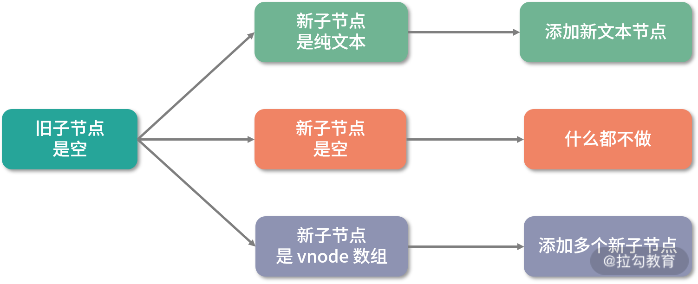
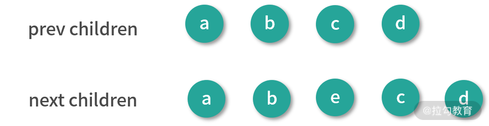
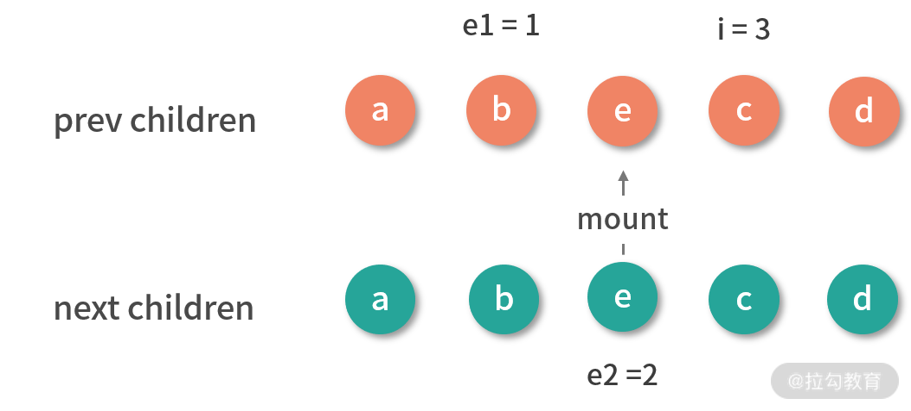
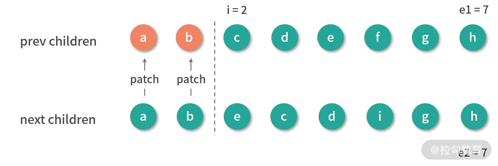
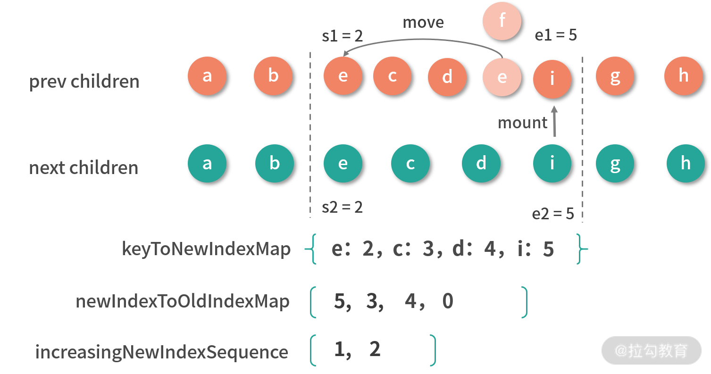

const PublicInstanceProxyHandlers = {

  set ({ _: instance }, key, value) {

    const { data, setupState, ctx } = instance
    
    if (setupState !== EMPTY_OBJ && hasOwn(setupState, key)) {
    
      // 给 setupState 赋值
    
      setupState[key] = value
    
    }
    
    else if (data !== EMPTY_OBJ && hasOwn(data, key)) {
    
      // 给 data 赋值
    
      data[key] = value
    
    }
    
    else if (key in instance.props) {
    
      // 不能直接给 props 赋值
    
      (process.env.NODE_ENV !== 'production') &&
    
      warn(`Attempting to mutate prop "${key}". Props are readonly.`, instance)
    
      return false
    
    }
    
    if (key[0] === '$' && key.slice(1) in instance) {
    
      // 不能给 Vue 内部以 $ 开头的保留属性赋值
    
      (process.env.NODE_ENV !== 'production') &&
    
      warn(`Attempting to mutate public property "${key}". ` +
    
        `Properties starting with $ are reserved and readonly.`, instance)
    
      return false
    
    }
    
    else {
    
      // 用户自定义数据赋值
    
      ctx[key] = value
    
    }
    
    return true

  }

}一、`Vue.js3.0`的优化

**`Vue.js` 从 `1.x` 到 2.0 版本，最大的升级就是引入了虚拟 DOM 的概念，它为后续做服务端渲染以及跨端框架 `Weex` 提供了基础。**

在迭代 `2.x` 版本的过程中，存在很多需要解决的痛点，比如**源码自身的维护性，数据量大后带来的渲染和更新的性能问题，一些想舍弃但为了兼容一直保留的鸡肋 `API**` 等**；另外还有**更好的 `TypeScript` 支持、更好的逻辑复用实践等**，所以`Vue.js`的作者希望能从**源码、性能和语法 `API`** 三个大的方面优化框架。

## 1.1 源码优化

### 更好的代码管理方式：`monorepo`

> `Monorepo` 其实不是一个新的概念，在软件工程领域，它已经有着十多年的历史了。概念上很好理解，就是把**多个项目**放在**一个仓库**里面，相对立的是传统的 `MultiRepo` 模式，即每个项目对应一个单独的仓库来分散管理。
>
> 参考链接：[现代前端工程为什么越来越离不开 `Monorepo`?](https://juejin.cn/post/6944877410827370504#heading-2)

首先，源码的优化体现在代码管理方式上。`Vue.js 2.x` 的源码托管在 `src` 目录，然后依据功能拆分出了 `compiler`（模板编译的相关代码）、`core`（与平台无关的通用运行时代码）、`platforms`（平台专有代码）、`server`（服务端渲染的相关代码）、`sfc`（`.vue` 单文件解析相关代码）、`shared`（共享工具代码） 等目录：


而到了 `Vue.js 3.0` ，整个源码是通过 `monorepo` 的方式维护的，根据功能将不同的模块拆分到 packages 目录下面不同的子目录中：


可以看出相对于 `Vue.js 2.x` 的源码组织方式，`monorepo` 把这些模块拆分到不同的 `package` 中，每个 `package` 有各自的 `API`、类型定义和测试。这样**使得模块拆分更细化，职责划分更明确，模块之间的依赖关系也更加明确，开发人员也更容易阅读、理解和更改所有模块源码，提高代码的可维护性。**

另外**一些 `package`（比如 `reactivity` 响应式库）是可以独立于 `Vue.js` 使用的，这样用户如果只想使用 `Vue.js 3.0` 的响应式能力，可以单独依赖这个响应式库而不用去依赖整个 `Vue.js`，减小了引用包的体积大小**，而 `Vue.js 2 .x` 是做不到这一点的。

### 有类型的 `JavaScript：TypeScript`

其次，源码的优化还体现在 `Vue.js 3.0` 自身采用了 `TypeScript` 开发。`Vue.js 1.x` 版本的源码是没有用类型语言的，尤雨溪用 `JavaScript` 开发了整个框架，但对于复杂的框架项目开发，**使用类型语言非常有利于代码的维护，因为它可以在编码期间帮你做类型检查，避免一些因类型问题导致的错误；也可以利于它去定义接口的类型，利于 `IDE` 对变量类型的推导**。

因此在重构 `2.0` 的时候，尤雨溪选型了 `Flow`，但是在 `Vue.js 3.0` 的时候抛弃 `Flow` 转而采用 `TypeScript` 重构了整个项目，这里有两方面原因：

①`Flow` 是 `Facebook` 出品的 `JavaScript` 静态类型检查工具，它可以以非常小的成本对已有的 JavaScript 代码迁入，非常灵活，这也是 `Vue.js 2.0` 当初选型它时一方面的考量。但是 `Flow` 对于一些复杂场景类型的检查，支持得并不好。记得在看 `Vue.js 2.x` 源码的时候，在某行代码的注释中看到了对 `Flow` 的吐槽，比如在组件更新 `props` 的地方出现了：

```javascript
const propOptions: any = vm.$options.props // wtf flow?
```

什么意思呢？其实是由于这里 `Flow` 并没有正确推导出 `vm.$options.props` 的类型 ，开发人员不得不强制申明 `propsOptions` 的类型为 `any`，显得很不合理；另外他也在社区平台吐槽过 `Flow` 团队的烂尾。

②其次，`Vue.js 3.0` 抛弃 Flow 后，使用 `TypeScript` 重构了整个项目。 `TypeScript`提供了更好的类型检查，能支持复杂的类型推导；由于源码就使用 `TypeScript` 编写，也省去了单独维护 `d.ts` 文件的麻烦；就整个 `TypeScript` 的生态来看，`TypeScript` 团队也是越做越好，`TypeScript` 本身保持着一定频率的迭代和更新，支持的 `feature` 也越来越多。

## 1.2 性能优化

性能优化一直是前端老生常谈的问题。对于 `Vue.js 2.x` 已经足够优秀的前端框架，它的性能优化主要从**源码体积、数据劫持、编译优化**几个方面进行突破。

### 源码体积优化

首先是源码体积优化，我们在平时工作中也经常会尝试优化静态资源的体积，因为 `JavaScript` 包体积越小，意味着网络传输时间越短，`JavaScript` 引擎解析包的速度也越快。

`Vue.js 3.0` 在源码体积的减少方面做了以下工作：

- **首先，移除一些冷门的 `feature`（比如 `filter、inline-template` 等）；**
- **其次，引入 `tree-shaking` 的技术，减少打包体积。**

####  `tree-shaking`

`tree-shaking`的原理比较简单，`tree-shaking` 依赖 `ES2015` 模块语法的静态结构（即 `import 和 export`），通过编译阶段的静态分析，找到没有引入的模块并打上标记。

举个例子，一个 `math` 模块定义了 2 个方法 `square(x)` 和 `cube(x)` ：

```javascript
export function square(x) {
  return x * x
}

export function cube(x) {
  return x * x * x
}
```

我们在这个模块外面只引入了 `cube` 方法：

```javascript
import { cube } from './math.js'
// do something with cube
```

最终 `math` 模块会被 `webpack` 打包生成如下代码：

```javascript
/* 1 */

/***/ (function(module, __webpack_exports__, __webpack_require__) {

  'use strict';

  /* unused harmony export square */

  /* harmony export (immutable) */ __webpack_exports__['a'] = cube;

  function square(x) {
    return x * x;
  }

  function cube(x) {
    return x * x * x;
  }
});

```

可以看到，未被引入的 `square` 模块被标记了`（unused harmony export square）`， 然后**压缩阶段会利用例如 `uglify-js、terser` 等压缩工具真正地删除这些没有用到的代码**。

也就是说，利用 `tree-shaking` 技术，**如果你在项目中没有引入 `Transition、KeepAlive` 等组件，那么它们对应的代码就不会打包，这样也就间接达到了减少项目引入的 `Vue.js` 包体积的目的。**

### 数据劫持优化

其次是数据劫持优化。`Vue.js` 区别于 `React` 的一大特色是它的数据是响应式的，这个特性从 `Vue.js 1.x` 版本就一直伴随着，这也是 `Vue.js` 粉喜欢 `Vue.js` 的原因之一，**`DOM` 是数据的一种映射，数据发生变化后可以自动更新 DOM，用户只需要专注于数据的修改，没有其余的心智负担。**

**在 `Vue.js` 内部，想实现这个功能是要付出一定代价的，那就是必须劫持数据的访问和更新。**其实这点很好理解，当数据改变后，为了自动更新 `DOM`，那么就必须劫持数据的更新，也就是说当数据发生改变后能自动执行一些代码去更新 DOM，那么问题来了，`Vue.js` 怎么知道更新哪一片 `DOM` 呢？因为在渲染 `DOM` 的时候访问了数据，我们可以对它进行访问劫持，这样就在内部建立了依赖关系，也就知道数据对应的 `DOM` 是什么了。以上只是大体的思路，具体实现要比这更复杂，内部还依赖了一个 `watcher` 的数据结构做依赖管理，参考下图：


#### `Vue.js1.x 和 Vue.js2.x的不足`

`Vue.js 1.x 和 Vue.js 2.x` 内部都是通过 `Object.defineProperty` 这个 `API` 去劫持数据的 getter 和 setter，**针对于的是对象中的单个属性进行劫持**，具体是这样的：

```javascript
Object.defineProperty(data, 'a',{
  get(){
    // track
  },
  set(){
    // trigger
  }
})

```

但这个 `API` 有一些缺陷，它必须预先知道要拦截的 key 是什么，所以它并不能检测对象属性的添加和删除。尽管 `Vue.js` 为了解决这个问题提供了 `$set` 和 ​`$delete` 实例方法，但是对于用户来说，还是增加了一定的心智负担。

另外 `Object.defineProperty` 的方式还有一个问题，举个例子，比如这个嵌套层级比较深的对象：

```javascript
export default {
  data: {
    a: {
      b: {
        c: {
          d: 1
        }
      }
    }
  }
}
```

由于 **`Vue.js` 无法判断你在运行时到底会访问到哪个属性，所以对于这样一个嵌套层级较深的对象，如果要劫持它内部深层次的对象变化，就需要递归遍历这个对象，执行 `Object.defineProperty` 把每一层对象数据都变成响应式的。**毫无疑问，如果我们定义的响应式数据过于复杂，这就会有相当大的性能负担。

#### `Vue.js3.0`的优化

为了解决上述 2 个问题，`Vue.js 3.0` 使用了 `Proxy API` 做数据劫持，它的内部是这样的：

```javascript
observed = new Proxy(data, {
  get() {
    // track
  },
  set() {
    // trigger
  }
})

```

**由于它劫持的是整个对象，那么自然对于对象的属性的增加和删除都能检测到。**

但要注意的是，**`Proxy API` 并不能监听到内部深层次的对象变化，因此 `Vue.js 3.0` 的处理方式是在 `getter` 中去递归响应式，这样的好处是真正访问到的内部对象才会变成响应式，而不是无脑递归，这样无疑也在很大程度上提升了性能。**

### 编译优化

最后是编译优化，为了便于理解，我们先来看一张图：


这是 `Vue.js 2.x` 从 `new Vue` 开始渲染成 DOM 的流程，上面说过的响应式过程就发生在图中的 `init` 阶段，另外 `template compile to render function` 的流程是可以借助 `vue-loader` 在 `webpack` 编译阶段离线完成，并非一定要在运行时完成。

所以**想优化整个 `Vue.js` 的运行时，除了数据劫持部分的优化，我们可以在耗时相对较多的 `patch` 阶段想办法**，`Vue.js 3.0` 也是这么做的，并且它通过在编译阶段优化编译的结果，来实现运行时 `patch` 过程的优化。

我们知道，通过数据劫持和依赖收集，`Vue.js 2.x` 的数据更新并触发重新渲染的粒度是组件级的：

> 在`Vue.js1.x`中，是通过细粒度的绑定来更新视图，也就是说：假如有一个状态绑定着好多个依赖，每个依赖表示一个具体的DOM节点，那么当这个状态发生变化时，向这个状态的所有依赖发送通知，让它们进行`DOM`更新操作。但是这样也会有一定的代价，因为粒度越细，每个状态所绑定的依赖就越多，依赖追踪在内存上的开销就会越大。因此，从`Vue.js2.0`开始，引入了虚拟DOM，将粒度调整为中等粒度，即一个状态所绑定的依赖不再是具体的DOM节点，而是一个组件。这样状态变化后，会通知到组件，组件内部再使用虚拟DOM进行比对。这可以大大降低依赖数量，从而降低依赖追踪所消耗的内存。


虽然 `Vue` 能保证触发更新的组件最小化，但在单个组件内部依然需要遍历该组件的整个 `vnode` 树，举个例子，比如我们要更新这个组件：

```vue
<template>
  <div id="content">
    <p class="text">static text</p>
    <p class="text">static text</p>
    <p class="text">{{message}}</p>
    <p class="text">static text</p>
    <p class="text">static text</p>
  </div>
</template>

```

整个 `diff` 过程如图所示：


可以看到，**因为这段代码中只有一个动态节点，所以这里有很多 `diff` 和遍历其实都是不需要的，这就会导致 `vnode` 的性能跟模版大小正相关，跟动态节点的数量无关，当一些组件的整个模版内只有少量动态节点时，这些遍历都是性能的浪费。**

而对于上述例子，**理想状态只需要 `diff` 这个绑定 `message` 动态节点的 `p` 标签即可。**

**`Vue.js 3.0` 做到了，它通过编译阶段对静态模板的分析，编译生成了 `Block tree`。`Block tree` 是一个将模版基于动态节点指令切割的嵌套区块，每个区块内部的节点结构是固定的，而且每个区块只需要以一个 `Array` 来追踪自身包含的动态节点。借助 `Block tree`，`Vue.js` 将 `vnode` 更新性能由与模版整体大小相关提升为与动态内容的数量相关，这是一个非常大的性能突破。**

除此之外，`Vue.js 3.0` 在编译阶段还包含了对 `Slot` 的编译优化、事件侦听函数的缓存优化，并且在运行时重写了 `diff` 算法。

## 1.3 语法 `API` 优化：`Composition API`

除了源码和性能方面，`Vue.js 3.0` 还在语法方面进行了优化，主要是提供了 `Composition API`。

### 优化逻辑组织

首先，是优化逻辑组织。

在 `Vue.js 1.x 和 2.x` 版本中，编写组件本质就是在编写一个“包含了描述组件选项的对象”，我们把它称为 `Options API`，它的好处是在于写法非常符合直觉思维，对于新手来说这样很容易理解，这也是很多人喜欢 `Vue.js` 的原因之一。

**`Options API` 的设计是按照 `methods、computed、data、props` 这些不同的选项分类，当组件小的时候，这种分类方式一目了然；但是在大型组件中，一个组件可能有多个逻辑关注点，当使用 `Options API` 的时候，每一个关注点都有自己的 `Options`，如果需要修改一个逻辑点关注点，就需要在单个文件中不断上下切换和寻找。**

举一个官方例子 `Vue CLI UI file explorer`，它是 `vue-cli GUI` 应用程序中的一个复杂的文件浏览器组件。这个组件需要处理许多不同的逻辑关注点：

- 跟踪当前文件夹状态并显示其内容
- 处理文件夹导航（比如打开、关闭、刷新等）
- 处理新文件夹的创建
- 切换显示收藏夹
- 切换显示隐藏文件夹
- 处理当前工作目录的更改

如果我们按照逻辑关注点做颜色编码，就可以看到当使用 `Options API` 去编写组件时，这些逻辑关注点是非常分散的：


`Vue.js 3.0` 提供了一种新的 `API：Composition API`，它有一个很好的机制去解决这样的问题，就是将某个逻辑关注点相关的代码全都放在一个函数里，这样当需要修改一个功能时，就不再需要在文件中跳来跳去。

通过下图，我们可以很直观地感受到 `Composition API` 在逻辑组织方面的优势：


### 优化逻辑复用

其次，是优化逻辑复用。

当我们开发项目变得复杂的时候，免不了需要抽象出一些复用的逻辑。在 `Vue.js 2.x` 中，我们通常会用 `mixins` 去复用逻辑，举一个鼠标位置侦听的例子，我们会编写如下函数 `mousePositionMixin`：

```javascript
const mousePositionMixin = {
  data() {
    return {
      x: 0,
      y: 0
    }
  },
  mounted() {
    window.addEventListener('mousemove', this.update)
  },
  destroyed() {
    window.removeEventListener('mousemove', this.update)
  },
  methods: {
    update(e) {
      this.x = e.pageX
      this.y = e.pageY
    }
  }
}
export default mousePositionMixin
```

然后在组件中使用：

```vue
<template>
  <div>
    Mouse position: x {{ x }} / y {{ y }}
  </div>
</template>
<script>
import mousePositionMixin from './mouse'
export default {
  mixins: [mousePositionMixin]
}
</script>
```

**使用单个 `mixin` 似乎问题不大，但是当我们一个组件混入大量不同的 `mixins` 的时候，会存在两个非常明显的问题：命名冲突和数据来源不清晰。**

首先每个 `mixin` 都可以定义自己的 `props、data`，它们之间是无感的，所以很容易定义相同的变量，导致命名冲突。另外对组件而言，如果模板中使用不在当前组件中定义的变量，那么就会不太容易知道这些变量在哪里定义的，这就是数据来源不清晰。但是`Vue.js 3.0` 设计的 `Composition API`，就很好地帮助我们解决了 `mixins` 的这两个问题。

我们来看一下在 `Vue.js 3.0` 中如何书写这个示例：

```javascript
import { ref, onMounted, onUnmounted } from 'vue'
export default function useMousePosition() {
  const x = ref(0)
  const y = ref(0)
  const update = e => {
    x.value = e.pageX
    y.value = e.pageY
  }
  onMounted(() => {
    window.addEventListener('mousemove', update)
  })
  onUnmounted(() => {
    window.removeEventListener('mousemove', update)
  })
  return { x, y }
}
```

这里我们约定 `useMousePosition` 这个函数为 hook 函数，然后在组件中使用：

```vue
<template>
  <div>
    Mouse position: x {{ x }} / y {{ y }}
  </div>
</template>
<script>
  import useMousePosition from './mouse'
  export default {
    setup() {
      const { x, y } = useMousePosition()
      return { x, y }
    }
  }
</script>
```

可以看到，整个数据来源清晰了，即使去编写更多的 `hook` 函数，也不会出现命名冲突的问题。

`Composition API` 除了在逻辑复用方面有优势，也会有更好的类型支持，因为它们都是一些函数，在调用函数时，自然所有的类型就被推导出来了，不像 `Options API` 所有的东西使用 `this`。另外，`Composition API` 对 `tree-shaking` 友好，代码也更容易压缩。

虽然 `Composition API` 有诸多优势，它也不是一点缺点都没有。这里还需要说明的是，`Composition API` 属于 `API` 的增强，它并不是 `Vue.js 3.0` 组件开发的范式，如果你的组件足够简单，你还是可以使用 `Options API`。

## 1.4 引入 RFC：使每个版本改动可控

作为一个流行开源框架，可能每天都会收到各种各样的 `feature request`。但并不是社区一有新功能的需求，框架就会立马支持，因为随着 `Vue.js` 的用户越来越多，肯定会更加重视稳定性，会仔细考虑所做的每一个可能对最终用户影响的更改，以及有意识去防止新 `API` 对框架本身实现带来的复杂性的提升。

因此在 `Vue.js 2.x` 版本开发到后期的阶段 ，小右就启用了 `RFC` ，它的全称是 `Request For Comments`，旨在为新功能进入框架提供一个一致且受控的路径。当社区有一些新需求的想法时，它可以提交一个 RFC，然后由社区和 `Vue.js` 的核心团队一起讨论，如果这个 `RFC` 最终被通过了，那么它才会被实现。比如 2.6 版本对于 `slot 新 API` 的改动，就是[这条 RFC](https://github.com/vuejs/rfcs/blob/master/active-rfcs/0001-new-slot-syntax.md) 里。

到了 `Vue.js 3.0` ，小右在实现代码前就大规模启用 `RFC`，来确保他的改动和设计都是经过讨论并确认的，这样可以避免走弯路。`Vue.js 3.0` 版本有很多重大的改动，每一条改动都会有对应的 `RFC`，通过阅读这些 `RFC`，你可以了解每一个 `feature` 采用或被废弃掉的前因后果。

`Vue.js 3.0` 目前已被实现并合并的 RFC 都在[这里](https://github.com/vuejs/rfcs/pulls?q=is%3Apr+is%3Amerged+label%3A3.x)，通过阅读它们，你也可以大致了解 `Vue.js 3.0` 的一些变化，以及为什么会产生这些变化，帮助你了解它的前因后果。 

## 1.5 过渡期

通常框架的 `major` 版本从升级到大规模投入使用，都需要经历相当长的一段过渡期。不过， `Vue.js 1.x` 到 `Vue.js 2.0` 的升级过渡期不长，主要是因为那个时候 `Vue.js` 的用户还不多，生态也不完善，很多用户都是直接上手的 2.0 版本，没有旧项目的历史包袱。

而 `Vue.js 2.x` 的发展历经了 3 年多的时间，用户众多，而且周边生态也已经非常完善了。通常 `major` 版本的升级会有很多 `breaking change`，这就意味着想从 `2.x` 升级到 `3.0` 的项目需要改代码，而且不仅仅项目的代码要修改，所依赖的周边生态也需要升级。这其实是一个相当大的工作量，也需要承担一定的风险，所以如果你的项目非常庞大且已经相对稳定，没有什么特别的痛点，那么升级要慎重。

**`Vue.js 3.0` 使用 `ES2015` 的语法开发，有些 `API` 如 `Proxy` 是没有 `polyfill` 的，这就意味着官方需要单独出一个 `IE11 compat` 版本来支持 `IE11`。如果你的项目需要兼容 `IE11`，你就不得不小心使用某些 `API`，这也就带来了一些额外的心智负担。**

因此可能在 `Vue.js 3.0` 出来的相当长的一段时间，复杂的大项目都不会考虑去升级，而一些小的、对浏览器兼容要求不高的新项目可以考虑尝鲜了。

官方会继续维护 `Vue.js 2.x` 版本 18 个月，如果你的有些项目一辈子都不打算升级 `Vue.js 3.0`，那么你应该去认真学习 `Vue.js 2.x` 的源码，在官方不再维护的时候遇到问题你可以自己去修改它的源码来解决。

不过，虽然 `Vue.js 3.0` 距离大规模应用还有相当长一段时间，但是越早开始学习你就越能在未来掌握主动权。这段时间里，你可以关注它的发展，去学习它的设计思想，也可以去为它的生态建设贡献代码，从而提升自己的技术能力。另外也可以尝试在一些小项目中应用 `Vue.js 3.0`，不仅可以享受 `Vue.js 3.0` 带来的性能方面的优势以及 `Composition API` 在逻辑复用方面便利，也为了将来某一天全面升级 `Vue.js 3.0` 做技术储备。

# 二、`Vue.js`核心组件的实现原理

我们开发 `Vue.js` 的项目，大部分时间都是在写组件，组件系统是 `Vue.js` 的一个重要概念，它是一种对 `DOM` 结构的抽象，我们可以使用小型、独立和通常可复用的组件构建大型应用。仔细想想，几乎任意类型的应用界面都可以抽象为一个组件树，如下：


组件化也是 `Vue.js` 的核心思想之一，它允许我们用模板加对象描述的方式去创建一个组件，再加上我们给组件注入不同的数据，就可以完整地渲染出组件：


当数据更新后，组件可以自动重新渲染，因此用户只需要专注于数据逻辑的处理，而无须关心 DOM 的操作，无论是开发体验和开发效率都得到了很大的提升。

## 2.1 组件渲染：`vnode` 到真实 DOM 是如何转变的？

首先，组件是一个抽象的概念，它是对一棵 `DOM` 树的抽象，我们在页面中写一个组件节点：

```vue
<hello-world></hello-world>
```

这段代码并不会在页面上渲染一个`<hello-world>`标签，而它具体渲染成什么，取决于你怎么编写 `HelloWorld` 组件的模板。举个例子，`HelloWorld` 组件内部的模板定义是这样的：

```javascript
<template>
  <div>
    <p>Hello World</p>
  </div>
</template>
```

可以看到，模板内部最终会在页面上渲染一个 `div`，内部包含一个 `p` 标签，用来显示 `Hello World` 文本。

所以，从表现上来看，组件的模板决定了组件生成的 `DOM` 标签，而在 `Vue.js` 内部，一个组件想要真正的渲染生成 `DOM`，还需要经历`“创建 vnode - 渲染 vnode - 生成 DOM”` 这几个步骤：


### 应用程序初始化

> 一个组件可以通过“模板加对象描述”的方式创建，组件创建好以后是如何被调用并初始化的呢？因为整个组件树是由根组件开始渲染的，为了找到根组件的渲染入口，我们需要从应用程序的初始化过程开始分析。

在这里，我分别给出了通过 `Vue.js 2.x` 和 `Vue.js 3.0` 来初始化应用的代码：

```javascript
// 在 Vue.js 2.x 中，初始化一个应用的方式如下
import Vue from 'vue'
import App from './App'
const app = new Vue({
  render: h => h(App)
})
app.$mount('#app')
```

```javascript
// 在 Vue.js 3.0 中，初始化一个应用的方式如下
import { createApp } from 'vue'
import App from './app'
const app = createApp(App)
app.mount('#app')
```

可以看到，`Vue.js 3.0` 初始化应用的方式和 `Vue.js 2.x` 差别并不大，本质上都是把 `App` 组件挂载到 `id` 为 `app` 的 `DOM` 节点上。

但是，在 `Vue.js 3.0` 中还导入了一个 `createApp`，其实这是个入口函数，它是 `Vue.js` 对外暴露的一个函数，我们来看一下它的内部实现：

```javascript
const createApp = ((...args) => {
  // 创建 app 对象
  const app = ensureRenderer().createApp(...args)
  const { mount } = app
  // 重写 mount 方法
  app.mount = (containerOrSelector) => {
    // ...
  }
  return app
})

```

从代码中可以看出 `createApp` 主要做了两件事情：**创建 `app` 对象和重写 `app.mount` 方法**。

#### 创建 `app` 对象

首先，我们使用 `ensureRenderer().createApp()` 来创建 `app` 对象 ：

```javascript
 const app = ensureRenderer().createApp(...args)
```

其中 `ensureRenderer()` 用来创建一个渲染器对象，它的内部代码是这样的：

> 为什么说用`ensureRenderer()` 来延时创建渲染器？因为 `ensureRenderer` 是在执行 `createApp` 的时候调用的，如果你不执行 `createApp` 而只使用 `vue` 的一些响应式 `API`，就不会创建这个渲染器，所以说延时渲染。

```javascript
// 渲染相关的一些配置，比如更新属性的方法，操作 DOM 的方法
const rendererOptions = {
  patchProp,
  ...nodeOps
}
let renderer
// 延时创建渲染器，当用户只依赖响应式包的时候，可以通过 tree-shaking 移除核心渲染逻辑相关的代码
function ensureRenderer() {
  return renderer || (renderer = createRenderer(rendererOptions))
}
function createRenderer(options) {
  return baseCreateRenderer(options)
}
function baseCreateRenderer(options) {
  function render(vnode, container) {
    // 组件渲染的核心逻辑
  }
  return {
    render,
    createApp: createAppAPI(render)
  }
}
function createAppAPI(render) {
  // createApp createApp 方法接受的两个参数：根组件的对象和 prop
  return function createApp(rootComponent, rootProps = null) {
    const app = {
      _component: rootComponent,
      _props: rootProps,
      mount(rootContainer) {
        // 创建根组件的 vnode
        const vnode = createVNode(rootComponent, rootProps)
        // 利用渲染器渲染 vnode
        render(vnode, rootContainer)
        app._container = rootContainer
        return vnode.component.proxy
      }
    }
    return app
  }
}
```

可以看到，这里先用 `ensureRenderer()` 来延时创建渲染器，这样做的好处是当用户只依赖响应式包的时候，就不会创建渲染器，因此可以通过 `tree-shaking` 的方式移除核心渲染逻辑相关的代码。

这里涉及了渲染器的概念，它是为跨平台渲染做准备的，之后我会在自定义渲染器的相关内容中详细说明。在这里，你可以简单地把渲染器理解为包含平台渲染核心逻辑的 `JavaScript` 对象。

我们结合上面的代码继续深入，在 `Vue.js 3.0` 内部通过 `createRenderer` 创建一个渲染器，这个渲染器内部会有一个 `createApp` 方法，它是执行 `createAppAPI` 方法返回的函数，接受了 `rootComponent` 和 `rootProps` 两个参数，我们在应用层面执行 `createApp(App)` 方法时，会把 `App` 组件对象作为根组件传递给 `rootComponent`。这样，`createApp` 内部就创建了一个 `app` 对象，它会提供 `mount` 方法，这个方法是用来挂载组件的。

在整个 `app` 对象创建过程中，`Vue.js` 利用闭包和函数柯里化的技巧，很好地实现了参数保留。比如，在执行 `app.mount` 的时候，并不需要传入渲染器 `render`，这是因为在执行 `createAppAPI` 的时候渲染器 `render` 参数已经被保留下来了。

#### 重写 `app.mount` 方法

接下来，是重写 `app.mount` 方法。

根据前面的分析，我们知道 `createApp` 返回的 `app` 对象已经拥有了 `mount` 方法了，但在入口函数中，接下来的逻辑却是对 `app.mount` 方法的重写。先思考一下，为什么要重写这个方法，而不把相关逻辑放在 `app` 对象的 `mount` 方法内部来实现呢？

这是因为 `Vue.js` 不仅仅是为 Web 平台服务，它的目标是支持跨平台渲染，而 `createApp` 函数内部的 `app.mount` 方法是一个标准的可跨平台的组件渲染流程：

```javascript
mount(rootContainer) {
  // 创建根组件的 vnode
  const vnode = createVNode(rootComponent, rootProps)
  // 利用渲染器渲染 vnode
  render(vnode, rootContainer)
  app._container = rootContainer
  return vnode.component.proxy
}
```

**标准的跨平台渲染流程是先创建 `vnode`，再渲染 `vnode`。**此外参数 `rootContainer` 也可以是不同类型的值，比如，在 `Web` 平台它是一个 `DOM` 对象，而在其他平台（比如 `Weex` 和小程序）中可以是其他类型的值。所以这里面的代码不应该包含任何特定平台相关的逻辑，也就是说这些代码的执行逻辑都是与平台无关的。因此我们需要在外部重写这个方法，来完善 Web 平台下的渲染逻辑。

接下来，再来看 `app.mount` 重写都做了哪些事情：

```javascript
app.mount = (containerOrSelector) => {
  // 标准化容器
  // 通过 normalizeContainer 标准化容器
  // 开发者可以给mout方法传字符串选择器或者 DOM 对象作为参数，
  // 但如果是字符串选择器，就需要把它转成 DOM 对象，作为最终挂载的容器
  const container = normalizeContainer(containerOrSelector)
  if (!container)
    return
  const component = app._component
   // 如组件对象没有定义 render 函数和 template 模板，则取容器的 innerHTML 作为组件模板内容
  if (!isFunction(component) && !component.render && !component.template) {
    component.template = container.innerHTML
  }
  // 挂载前清空容器内容
  container.innerHTML = ''
  // 真正的挂载
  return mount(container)
}
```

**首先是通过 `normalizeContainer` 标准化容器（这里可以传字符串选择器或者 DOM 对象，但如果是字符串选择器，就需要把它转成 DOM 对象，作为最终挂载的容器），然后做一个 `if` 判断，如果组件对象没有定义 `render` 函数和 `template` 模板，则取容器的 `innerHTML` 作为组件模板内容；接着在挂载前清空容器内容，最终再调用 `app.mount` 的方法走标准的组件渲染流程（创建 `vnode`，再渲染 `vnode`）。**

在这里，重写的逻辑都是和 `Web` 平台相关的，所以要放在外部实现。此外，这么做的目的是既能让用户在使用 `API` 时可以更加灵活，也兼容了 `Vue.js 2.x` 的写法，比如 `app.mount` 的第一个参数就同时支持选择器字符串和 `DOM` 对象两种类型。

**从 `app.mount` 开始，才算真正进入组件渲染流程，核心渲染流程做的两件事情：创建 `vnode` 和渲染 `vnode`。**

### 核心渲染流程：创建 `vnode` 和渲染 `vnode`

#### 创建 `vnode`

首先，是创建 `vnode` 的过程。

**`vnode` 本质上是用来描述 `DOM` 的 `JavaScript` 对象**，它在 `Vue.js` 中可以描述不同类型的节点，比如普通元素节点、组件节点等。

##### 普通元素节点

什么是普通元素节点呢？举个例子，在 `HTML` 中我们使用 `<button>` 标签来写一个按钮：

```javascript
<button class="btn" style="width:100px;height:50px">click me</button>
```

可以用 `vnode` 这样表示`<button>`标签：

```javascript
const vnode = {
  type: 'button',
  props: { 
    'class': 'btn',
    style: {
      width: '100px',
      height: '50px'
    }
  },
  children: 'click me'
}
```

其中，`type` 属性表示 `DOM` 的标签类型，`props` 属性表示 `DOM` 的一些附加信息，比如 `style` 、`class` 等，`children` 属性表示 `DOM` 的子节点，它也可以是一个 `vnode` 数组，只不过 `vnode` 可以用字符串表示简单的文本 。

##### 组件节点

什么是**组件节点**呢？其实， `vnode` 除了可以像上面那样用于描述一个真实的 `DOM`，也可以用来描述组件。

我们先在模板中引入一个组件标签 `<custom-component>`：

```html
<custom-component msg="test"></custom-component>
```

我们可以用 `vnode` 这样表示 `<custom-component>` 组件标签：

```javascript
const CustomComponent = {
  // 在这里定义组件对象
}
const vnode = {
  type: CustomComponent,
  props: { 
    msg: 'test'
  }
}
```

组件 `vnode` 其实是**对抽象事物的描述**，这是因为我们并不会在页面上真正渲染一个 `<custom-component>` 标签，而是渲染组件内部定义的 HTML 标签。

除了上两种 `vnode` 类型外，还有纯文本 `vnode`、注释 `vnode` 等等，但是主线只需要研究组件 `vnode` 和普通元素 `vnode`即可。

另外，`Vue.js 3.0` 内部还针对 `vnode` 的 `type`，做了更详尽的分类，包括 `Suspense`、`Teleport` 等，且把 `vnode` 的类型信息做了编码，以便在后面的 `patch` 阶段，可以根据不同的类型执行相应的处理逻辑：

```javascript
const shapeFlag = isString(type)
  ? 1 /* ELEMENT */
  : isSuspense(type)
    ? 128 /* SUSPENSE */
    : isTeleport(type)
      ? 64 /* TELEPORT */
      : isObject(type)
        ? 4 /* STATEFUL_COMPONENT */
        : isFunction(type)
          ? 2 /* FUNCTIONAL_COMPONENT */
          : 0
```

##### `vnode`的优势

 **`vnode` 有什么优势呢？为什么一定要设计 `vnode` 这样的数据结构呢？**

* 首先是**抽象**，引入 `vnode`，可以把渲染过程抽象化，从而使得组件的抽象能力也得到提升。

* 其次是**跨平台**，因为 `patch vnode` 的过程不同平台可以有自己的实现，基于 `vnode` 再做服务端渲染、`Weex` 平台、小程序平台的渲染都变得容易了很多。

>  不过这里要特别注意，使用 `vnode` 并不意味着不用操作 DOM 了，很多人会误以为 `vnode` 的性能一定比手动操作原生 `DOM` 好，这个其实是不一定的。
>
> 因为，首先这种基于 `vnode` 实现的 `MVVM` 框架，在每次 `render to vnode` 的过程中，渲染组件会有一定的 `JavaScript` 耗时，特别是大组件，比如一个 `1000 * 10` 的 Table 组件，`render to vnode` 的过程会遍历 `1000 * 10` 次去创建内部 `cell vnode`，整个耗时就会变得比较长，加上 `patch vnode` 的过程也会有一定的耗时，当我们去更新组件的时候，用户会感觉到明显的卡顿。虽然 `diff` 算法在减少 `DOM` 操作方面足够优秀，但最终还是免不了操作 `DOM`，所以说性能并不是 `vnode` 的优势。

##### `vnode`的创建

回顾 `app.mount` 函数的实现，内部是通过 `createVNode` 函数创建了根组件的 `vnode` ：

```javascript
 const vnode = createVNode(rootComponent, rootProps)
```

`createVNode` 函数的大致实现：

```javascript
function createVNode(type, props = null
,children = null) {
  if (props) {
    // 处理 props 相关逻辑，标准化 class 和 style
  }
  // 对 vnode 类型信息编码
  const shapeFlag = isString(type)
    ? 1 /* ELEMENT */
    : isSuspense(type)
      ? 128 /* SUSPENSE */
      : isTeleport(type)
        ? 64 /* TELEPORT */
        : isObject(type)
          ? 4 /* STATEFUL_COMPONENT */
          : isFunction(type)
            ? 2 /* FUNCTIONAL_COMPONENT */
            : 0
  const vnode = {
    type,
    props,
    shapeFlag,
    // 一些其他属性
  }
  // 标准化子节点，把不同数据类型的 children 转成数组或者文本类型
  normalizeChildren(vnode, children)
  return vnode
}
```

通过上述代码可以看到，其实 `createVNode` 做的事情很简单，就是：对 `props` 做标准化处理、对 `vnode` 的类型信息编码、创建 `vnode` 对象，标准化子节点 `children` 。

拥有了这个 `vnode` 对象，接下来要做的事情就是把它渲染到页面中去。

#### 渲染 `vnode`

##### `render`

回顾 `app.mount` 函数的实现，内部通过执行这段代码去渲染创建好的 `vnode`：

```javascript
render(vnode, rootContainer)
const render = (vnode, container) => {
  if (vnode == null) {
    // 销毁组件
    if (container._vnode) {
      unmount(container._vnode, null, null, true)
    }
  } else {
    // 创建或者更新组件
    patch(container._vnode || null, vnode, container)
  }
  // 缓存 vnode 节点，表示已经渲染
  container._vnode = vnode
}
```

这个渲染函数 `render` 的实现很简单，如果它的第一个参数 `vnode` 为空，则执行销毁组件的逻辑，否则执行创建或者更新组件的逻辑。

##### `patch`

主要是看渲染 `vnode` 的代码中涉及的 `patch` 函数的实现：

```javascript
const patch = (n1, n2, container, anchor = null, parentComponent = null, parentSuspense = null, isSVG = false, optimized = false) => {
  // 如果存在旧节点, 且新旧节点类型不同，则销毁旧节点
  if (n1 && !isSameVNodeType(n1, n2)) {
    anchor = getNextHostNode(n1)
    unmount(n1, parentComponent, parentSuspense, true)
    n1 = null
  }
  const { type, shapeFlag } = n2
  switch (type) {
    case Text:
      // 处理文本节点
      break
    case Comment:
      // 处理注释节点
      break
    case Static:
      // 处理静态节点
      break
    case Fragment:
      // 处理 Fragment 元素
      break
    default:
      if (shapeFlag & 1 /* ELEMENT */) {
        // 处理普通 DOM 元素
        processElement(n1, n2, container, anchor, parentComponent, parentSuspense, isSVG, optimized)
      }
      else if (shapeFlag & 6 /* COMPONENT */) {
        // 处理组件
        processComponent(n1, n2, container, anchor, parentComponent, parentSuspense, isSVG, optimized)
      }
      else if (shapeFlag & 64 /* TELEPORT */) {
        // 处理 TELEPORT
      }
      else if (shapeFlag & 128 /* SUSPENSE */) {
        // 处理 SUSPENSE
      }
  }
}
```

**`patch` 本意是打补丁的意思，这个函数有两个功能，一个是根据 `vnode` 挂载 `DOM`，一个是根据新旧 `vnode` 更新 DOM。**对于初次渲染，先只分析创建过程，更新过程在后面分析。

在创建的过程中，patch 函数接受多个参数，目前只重点关注前三个：

1. 第一个参数 **`n1` 表示旧的 `vnode`**，当 `n1 为 null` 的时候，表示是一次挂载的过程；
2. 第二个参数 **`n2` 表示新的 `vnode` 节点**，后续会根据这个 `vnode` 类型执行不同的处理逻辑；
3. 第三个参数 **container 表示 DOM 容器**，也就是 `vnode` 渲染生成 `DOM` 后，会挂载到 `container` 下面。

对于渲染的节点，重点关注两种类型节点的渲染逻辑：对组件的处理和对普通 `DOM` 元素的处理。

##### 对组件节点的处理

###### `processComponent`

**先来看对组件的处理**。由于初始化渲染的是 `App` 组件，它是一个组件 `vnode`，所以我们来看一下组件的处理逻辑是怎样的。首先是用来处理组件的 `processComponent` 函数的实现：

```javascript
const processComponent = (n1, n2, container, anchor, parentComponent, parentSuspense, isSVG, optimized) => {
  if (n1 == null) {
    // 挂载组件
    mountComponent(n2, container, anchor, parentComponent, parentSuspense, isSVG, optimized)
  }
  else {
    // 更新组件
    updateComponent(n1, n2, parentComponent, optimized)
  }
}
```

该函数的逻辑很简单，如果 `n1 为 null`，则执行挂载组件的逻辑，否则执行更新组件的逻辑。

###### `mountComponent`

我们接着来看挂载组件的 `mountComponent` 函数的实现：

```javascript
const mountComponent = (initialVNode, container, anchor, parentComponent, parentSuspense, isSVG, optimized) => {
  // 创建组件实例
  const instance = (initialVNode.component = createComponentInstance(initialVNode, parentComponent, parentSuspense))
  // 设置组件实例
  setupComponent(instance)
  // 设置并运行带副作用的渲染函数
  setupRenderEffect(instance, initialVNode, container, anchor, parentSuspense, isSVG, optimized)
}
```

可以看到，**挂载组件函数 `mountComponent` 主要做三件事情：创建组件实例、设置组件实例、设置并运行带副作用的渲染函数。**

首先是创建组件实例，`Vue.js 3.0` 虽然不像 `Vue.js 2.x` 那样通过类的方式去实例化组件，但内部也通过对象的方式去创建了当前渲染的组件实例。

其次设置组件实例，`instance` 保留了很多组件相关的数据，维护了组件的上下文，包括对 `props`、插槽，以及其他实例的属性的初始化处理。

创建和设置组件实例这两个流程在后面进行详细分析。

###### `setupRenderEffect`

最后是运行带副作用的渲染函数 `setupRenderEffect`，重点来看一下这个函数的实现：

```javascript
const setupRenderEffect = (instance, initialVNode, container, anchor, parentSuspense, isSVG, optimized) => {
  // 创建响应式的副作用渲染函数
  instance.update = effect(function componentEffect() {
    if (!instance.isMounted) {
      // 渲染组件生成子树 vnode
      const subTree = (instance.subTree = renderComponentRoot(instance))
      // 把子树 vnode 挂载到 container 中
      patch(null, subTree, container, anchor, instance, parentSuspense, isSVG)
      // 保留渲染生成的子树根 DOM 节点
      initialVNode.el = subTree.el
      instance.isMounted = true
    }
    else {
      // 更新组件
    }
  }, prodEffectOptions)
}
```

**该函数利用响应式库的 `effect` 函数创建了一个副作用渲染函数 `componentEffect` （`effect` 的实现在响应式那里会具体说）。副作用，可以简单地理解为，当组件的数据发生变化时，effect 函数包裹的内部渲染函数 `componentEffect` 会重新执行一遍，从而达到重新渲染组件的目的。**

渲染函数内部也会判断这是一次初始渲染还是组件更新。这里只分析初始渲染流程。

**初始渲染主要做两件事情：渲染组件生成 `subTree`、把 `subTree` 挂载到 `container` 中。**

首先，是渲染组件生成 `subTree`，它也是一个 `vnode` 对象。这里要注意别把 `subTree` 和 `initialVNode` 弄混了（其实在 `Vue.js 3.0` 中，根据命名我们已经能很好地区分它们了，而在 `Vue.js 2.x` 中它们分别命名为 `_vnode` 和 `$vnode`）。比如说，在父组件 `App` 中里引入了 `Hello` 组件：

```vue
<template>
  <div class="app">
    <p>This is an app.</p>
    <hello></hello>
  </div>
</template>
```

在 `Hello` 组件中是 `<div>` 标签包裹着一个 `<p>` 标签：

```vue
<template>
  <div class="hello">
    <p>Hello, Vue 3.0!</p>
  </div>
</template>
```

在 `App` 组件中， `<hello>` 节点渲染生成的 `vnode` ，对应的就是 `Hello` 组件的 `initialVNode` ，为了好记，你也可以把它称作“组件 `vnode`”。而 `Hello` 组件内部整个 `DOM` 节点对应的 `vnode` 就是执行 `renderComponentRoot` 渲染生成对应的 `subTree`，我们可以把它称作“子树 `vnode`”。

我们知道每个组件都会有对应的 `render` 函数，即使你写 `template`，也会编译成 `render` 函数，而 `renderComponentRoot` 函数就是去执行 render 函数创建整个组件树内部的 `vnode`，把这个 `vnode` 再经过内部一层标准化，就得到了该函数的返回结果：子树 `vnode`。

渲染生成子树 `vnode` 后，接下来就是继续调用 `patch` 函数把子树 `vnode` 挂载到 `container` 中了。

那么我们又再次回到了 `patch` 函数，会继续对这个子树 `vnode` 类型进行判断，对于上述例子，`App` 组件的根节点是 `<div>` 标签，那么对应的子树 `vnode` 也是一个普通元素 `vnode`，那么我们**接下来看对普通 DOM 元素的处理流程。**

##### 对普通元素节点的处理

首先看处理普通 `DOM`元素的 `processElement` 函数的实现：

######  `processElement` 

```javascript
const processElement = (n1, n2, container, anchor, parentComponent, parentSuspense, isSVG, optimized) => {
  isSVG = isSVG || n2.type === 'svg'
  if (n1 == null) {
    //挂载元素节点
    mountElement(n2, container, anchor, parentComponent, parentSuspense, isSVG, optimized)
  }
  else {
    //更新元素节点
    patchElement(n1, n2, parentComponent, parentSuspense, isSVG, optimized)
  }
}
```

该函数的逻辑很简单，如果 `n1` 为 `null`，走挂载元素节点的逻辑，否则走更新元素节点逻辑。

###### `mountElement`

接着来看挂载元素的 `mountElement` 函数的实现：

```javascript
const mountElement = (vnode, container, anchor, parentComponent, parentSuspense, isSVG, optimized) => {
  let el
  const { type, props, shapeFlag } = vnode
  // 创建 DOM 元素节点
  el = vnode.el = hostCreateElement(vnode.type, isSVG, props && props.is)
  if (props) {
    // 处理 props，比如 class、style、event 等属性
    for (const key in props) {
      if (!isReservedProp(key)) {
        hostPatchProp(el, key, null, props[key], isSVG)
      }
    }
  }
  if (shapeFlag & 8 /* TEXT_CHILDREN */) {
    // 处理子节点是纯文本的情况
    hostSetElementText(el, vnode.children)
  }
  else if (shapeFlag & 16 /* ARRAY_CHILDREN */) {
    // 处理子节点是数组的情况
    mountChildren(vnode.children, el, null, parentComponent, parentSuspense, isSVG && type !== 'foreignObject', optimized || !!vnode.dynamicChildren)
  }
  // 把创建的 DOM 元素节点挂载到 container 上
  hostInsert(el, container, anchor)
}
```

**可以看到，挂载元素函数主要做四件事：创建 `DOM` 元素节点、处理 `props`、处理 `children`、挂载 `DOM` 元素到 `container` 上。**

首先是创建 `DOM` 元素节点，通过 `hostCreateElement` 方法创建，这是一个平台相关的方法，以下是它在 Web 环境下的定义：

```javascript
function createElement(tag, isSVG, is) {
  isSVG ? document.createElementNS(svgNS, tag)
    : document.createElement(tag, is ? { is } : undefined)
}
```

**它调用了底层的 `DOM API document.createElement` 创建元素，所以本质上 `Vue.js` 强调不去操作 `DOM` ，只是希望用户不直接碰触 `DOM`，它并没有什么神奇的魔法，底层还是会操作 `DOM`。**

另外，如果是其他平台比如 `Weex`，`hostCreateElement` 方法就不再是操作 `DOM` ，而是平台相关的 `API` 了，这些平台相关的方法是在创建渲染器阶段作为参数传入的。

创建完 `DOM` 节点后，接下来要做的是判断如果有 `props` 的话，给这个 `DOM` 节点添加相关的 `class`、`style`、`event` 等属性，并做相关的处理，这些逻辑都是在 `hostPatchProp` 函数内部做的，这里就不展开讲了。

接下来是对子节点的处理，我们知道 `DOM` 是一棵树，`vnode` 同样也是一棵树，并且它和 `DOM` 结构是一一映射的。

###### `hostSetElementText`

如果子节点是纯文本，则执行 `hostSetElementText` 方法，它在 Web 环境下通过设置 `DOM` 元素的 `textContent` 属性设置文本：

```javascript
function setElementText(el, text) {
  el.textContent = text
}
```

######  `mountChildren` 

如果子节点是数组，则执行 `mountChildren` 方法：

```javascript
const mountChildren = (children, container, anchor, parentComponent, parentSuspense, isSVG, optimized, start = 0) => {
  for (let i = start; i < children.length; i++) {
    // 预处理 child
    const child = (children[i] = optimized
      ? cloneIfMounted(children[i])
      : normalizeVNode(children[i]))
    // 递归 patch 挂载 child
    patch(null, child, container, anchor, parentComponent, parentSuspense, isSVG, optimized)
  }
}
```

子节点的挂载逻辑同样很简单，遍历 `children` 获取到每一个 `child`，然后递归执行 `patch` 方法挂载每一个 `child` 。注意，这里有对 `child` 做预处理的情况（后面编译优化的章节再进行详细分析）。

可以看到，`mountChildren` 函数的第二个参数是 `container`，而我们调用 `mountChildren` 方法传入的第二个参数是在 `mountElement` 时创建的 DOM 节点，这就很好地建立了父子关系。

另外，通过递归 patch 这种深度优先遍历树的方式，我们就可以构造完整的 DOM 树，完成组件的渲染。

###### `hostInsert` 

处理完所有子节点后，最后通过 `hostInsert` 方法把创建的 `DOM` 元素节点挂载到 `container` 上，它在 `Web` 环境下这样定义：

```javascript
function insert(child, parent, anchor) {
  if (anchor) {
    parent.insertBefore(child, anchor)
  }
  else {
    parent.appendChild(child)
  }
}
```

这里会做一个 `if` 判断，如果有参考元素 `anchor`，就执行 `parent.insertBefore` ，否则执行 `parent.appendChild` 来把 child 添加到 `parent` 下，完成节点的挂载。

因为 `insert` 的执行是在处理子节点后，所以挂载的顺序是先子节点，后父节点，最终挂载到最外层的容器上。

> **知识延伸：嵌套组件**
> 细心的你可能会发现，在 `mountChildren` 的时候递归执行的是 patch 函数，而不是 `mountElement` 函数，这是因为子节点可能有其他类型的 `vnode`，比如组件 `vnode`。
>
> 在真实开发场景中，嵌套组件场景是再正常不过的了，前面我们举的 `App` 和 `Hello` 组件的例子就是嵌套组件的场景。组件 `vnode` 主要维护着组件的定义对象，组件上的各种 `props`，而组件本身是一个抽象节点，它自身的渲染其实是通过执行组件定义的 `render` 函数渲染生成的子树 `vnode` 来完成，然后再 `patch` 。通过这种递归的方式，无论组件的嵌套层级多深，都可以完成整个组件树的渲染。

### 总结

以上主要分析了组件的渲染流程，从入口开始，一层层分析组件渲染。


### 问题：

**问：** 我们平时开发页面就是把页面拆成一个个组件，那么组件的拆分粒度是越细越好吗？为什么呢？

**答：** 并不是拆分粒度越小越好。

原因：1、在我的日常开发中，有两种情况会去拆分组件，第一种是根据页面的布局或功能，将整个页面拆分成不同的模块组件，最后将这些模块组件拼起来形成页面；第二种是在实现第一部拆分出来的这些模块组件的时候，发现其中有一些模块组件具有相同或相似的功能点，将这些相似的功能点抽离出来写成公共组件，然后在各个模块中引用。无论是模块组件还是公共组件，拆分组件的出发点都和组件的大小粒度无关。可维护性和复用性才是拆分组件的出发点。2、对于组件的渲染，会先通过`renderComponentRoot`去生成组件的子树`vnode`，再递归`patch`去处理这个子树`vnode`。也就是说，对于同样一个`div`，如果将其封装成组件的话，会比直接渲染一个`div`要多执行一次生成组件的子树`vnode`的过程。并且还要设置并运行带副作用的渲染函数。也就是说渲染组件比直接渲染元素要耗费更多的性能。如果组件过多，这些对应的过程就越多。如果按照组件粒度大小去划分组件的话会多出很多没有意义的渲染子树和设置并运行副作用函数的过程。综上所述，并不是拆分粒度越小越好，只要按照可维护性和复用性去划分组件就好。

**问：**

```javascript
// 延时创建渲染器，当用户只依赖响应式包的时候，可以通过 tree-shaking 移除核心渲染逻辑相关的代码
function ensureRenderer() {
  return renderer || (renderer = createRenderer<Node, Element>(rendererOptions))
}
```

这段不是就加个 || 吗？跟`tree-shaking`有什么关系？

**答：**因为 `ensureRenderer` 的调用实际是用户在执行 `createApp` 的时候触发的，如果你只从 `Vue` 里引入 `reactivity` 相关 `API`，而不执行 `createApp`，也就不会执行 `ensureRenderer`，就不会创建渲染器，渲染器相关代码就会在打包过程中通过 `tree-shaking` 移除掉。

## 2.2 组件更新：完整的 DOM diff 流程是怎样的？（上）

组件渲染的过程，本质上就是把各种类型的 `vnode` 渲染成真实 DOM。组件是由模板、组件描述对象和数据构成的，数据的变化会影响组件的变化。在组件的渲染过程中创建了一个带副作用的渲染函数，当数据变化的时候就会执行这个渲染函数来触发组件的更新。

### 副作用渲染函数更新组件的过程

下面是带副作用渲染函数 `setupRenderEffect` 的实现，但是这次要重点关注更新组件部分的逻辑：

```javascript
const setupRenderEffect = (instance, initialVNode, container, anchor, parentSuspense, isSVG, optimized) => {
  // 创建响应式的副作用渲染函数
  instance.update = effect(function componentEffect() {
    if (!instance.isMounted) {
      // 渲染组件
    }
    else {
      // 更新组件
      let { next, vnode } = instance
      // next 表示新的组件 vnode
      if (next) {
        // 更新组件 vnode 节点信息
        updateComponentPreRender(instance, next, optimized)
      }
      else {
        next = vnode
      }
      // 渲染新的子树 vnode
      const nextTree = renderComponentRoot(instance)
      // 缓存旧的子树 vnode
      const prevTree = instance.subTree
      // 更新子树 vnode
      instance.subTree = nextTree
      // 组件更新核心逻辑，根据新旧子树 vnode 做 patch
      patch(prevTree, nextTree,
        // 如果在 teleport 组件中父节点可能已经改变，所以容器直接找旧树 DOM 元素的父节点
        hostParentNode(prevTree.el),
        // 参考节点在 fragment 的情况可能改变，所以直接找旧树 DOM 元素的下一个节点
        getNextHostNode(prevTree),
        instance,
        parentSuspense,
        isSVG)
      // 缓存更新后的 DOM 节点
      next.el = nextTree.el
    }
  }, prodEffectOptions)
}
```

更新组件主要做三件事情：**更新组件 `vnode` 节点、渲染新的子树 `vnode`、根据新旧子树 `vnode` 执行 `patch` 逻辑**。

首先是**更新组件 `vnode` 节点，这里会有一个条件判断，判断组件实例中是否有新的组件 `vnode`（用 `next` 表示），有则更新组件 `vnode`，没有 `next` 指向之前的组件 `vnode`。为什么需要判断，这其实涉及一个组件更新策略的逻辑**，稍后会讲。

接着是**渲染新的子树 `vnode`，因为数据发生了变化，模板又和数据相关，所以渲染生成的子树 `vnode` 也会发生相应的变化。**

最后就是**核心的 patch 逻辑**，用来找出新旧子树 `vnode` 的不同，并找到一种合适的方式更新 `DOM`，接下来我们就来分析这个过程。

#### 核心逻辑：patch 流程

`patch` 流程的实现代码：

```javascript
const patch = (n1, n2, container, anchor = null, parentComponent = null, parentSuspense = null, isSVG = false, optimized = false) => {
  // 如果存在新旧节点, 且新旧节点类型不同，则销毁旧节点
  if (n1 && !isSameVNodeType(n1, n2)) {
    anchor = getNextHostNode(n1)
    unmount(n1, parentComponent, parentSuspense, true)
    // n1 设置为 null 保证后续都走 mount 逻辑
    n1 = null
  }
  const { type, shapeFlag } = n2
  switch (type) {
    case Text:
      // 处理文本节点
      break
    case Comment:
      // 处理注释节点
      break
    case Static:
      // 处理静态节点
      break
    case Fragment:
      // 处理 Fragment 元素
      break
    default:
      if (shapeFlag & 1 /* ELEMENT */) {
        // 处理普通 DOM 元素
        processElement(n1, n2, container, anchor, parentComponent, parentSuspense, isSVG, optimized)
      }
      else if (shapeFlag & 6 /* COMPONENT */) {
        // 处理组件
        processComponent(n1, n2, container, anchor, parentComponent, parentSuspense, isSVG, optimized)
      }
      else if (shapeFlag & 64 /* TELEPORT */) {
        // 处理 TELEPORT
      }
      else if (shapeFlag & 128 /* SUSPENSE */) {
        // 处理 SUSPENSE
      }
  }
}
function isSameVNodeType (n1, n2) {
  // n1 和 n2 节点的 type 和 key 都相同，才是相同节点
  return n1.type === n2.type && n1.key === n2.key
}
```

在这个过程中，**首先判断新旧节点是否是相同的 `vnode` 类型，如果不同，比如一个 `div` 更新成一个 `ul`，那么最简单的操作就是删除旧的 `div` 节点，再去挂载新的 `ul` 节点。**

**如果是相同的 `vnode` 类型，就需要走 `diff` 更新流程了**，接着会根据不同的 `vnode` 类型执行不同的处理逻辑，这里仍然只分析普通元素类型和组件类型的处理过程。

##### 1. 处理组件

举个例子，我们在父组件 `App` 中里引入了 `Hello` 组件：

```vue
<template>
  <div class="app">
    <p>This is an app.</p>
    <hello :msg="msg"></hello>
    <button @click="toggle">Toggle msg</button>
  </div>
</template>
<script>
  export default {
    data() {
      return {
        msg: 'Vue'
      }
    },
    methods: {
      toggle() {
        this.msg = this.msg ==== 'Vue'? 'World': 'Vue'
      }
    }
  }
</script>
```

`Hello` 组件中是 `<div>` 包裹着一个 `<p>` 标签， 如下所示：

```vue
<template>
  <div class="hello">
    <p>Hello, {{msg}}</p>
  </div>
</template>
<script>
  export default {
    props: {
      msg: String
    }
  }
</script>
```

点击 `App` 组件中的按钮执行 `toggle` 函数，就会修改 `data` 中的 `msg`，并且会触发`App` 组件的重新渲染。

结合前面对渲染函数的流程分析，这里 `App` 组件的根节点是 `div` 标签，重新渲染的子树 `vnode` 节点是一个普通元素的 `vnode`，应该先走 `processElement` 逻辑。组件的更新最终还是要转换成内部真实 `DOM` 的更新，而实际上普通元素的处理流程才是真正做 `DOM` 的更新，由于稍后我们会详细分析普通元素的处理流程，所以我们先跳过这里，继续往下看。

和渲染过程类似，更新过程也是一个树的深度优先遍历过程，更新完当前节点后，就会遍历更新它的子节点，因此在遍历的过程中会遇到 `hello` 这个组件 `vnode` 节点，就会执行到 `processComponent` 处理逻辑中，我们再来看一下它的实现，我们重点关注一下组件更新的相关逻辑：

```javascript
const processComponent = (n1, n2, container, anchor, parentComponent, parentSuspense, isSVG, optimized) => {
  if (n1 == null) {
    // 挂载组件
  }
  else {
    // 更新子组件
    updateComponent(n1, n2, parentComponent, optimized)
  }
}
const updateComponent = (n1, n2, parentComponent, optimized) => {
  const instance = (n2.component = n1.component)
  // 根据新旧子组件 vnode 判断是否需要更新子组件
  if (shouldUpdateComponent(n1, n2, parentComponent, optimized)) {
    // 新的子组件 vnode 赋值给 instance.next
    instance.next = n2
    // 子组件也可能因为数据变化被添加到更新队列里了，移除它们防止对一个子组件重复更新
    invalidateJob(instance.update)
    // 执行子组件的副作用渲染函数
    instance.update()
  }
  else {
    // 不需要更新，只复制属性
    n2.component = n1.component
    n2.el = n1.el
  }
}
```

可以看到，`processComponent` 主要通过执行 `updateComponent` 函数来更新子组件，`updateComponent` 函数在更新子组件的时候，会先执行 `shouldUpdateComponent` 函数，根据新旧子组件 `vnode` 来判断是否需要更新子组件。这里你只需要知道，在 `shouldUpdateComponent` 函数的内部，主要是通过检测和对比组件 `vnode` 中的 `props、chidren、dirs、transiton` 等属性，来决定子组件是否需要更新。

这是很好理解的，因为在一个组件的子组件是否需要更新，我们主要依据子组件 `vnode` 是否存在一些会影响组件更新的属性变化进行判断，如果存在就会更新子组件。

虽然 `Vue.js` 的更新粒度是组件级别的，组件的数据变化只会影响当前组件的更新，但是在组件更新的过程中，也会对子组件做一定的检查，判断子组件是否也要更新，并通过某种机制避免子组件重复更新。

我们接着看 `updateComponent` 函数，如果 `shouldUpdateComponent` 返回 true ，那么在它的最后，先执行 `invalidateJob（instance.update）`避免子组件由于自身数据变化导致的重复更新，然后又执行了子组件的副作用渲染函数 `instance.update` 来主动触发子组件的更新。

再回到副作用渲染函数中，有了前面的讲解，我们再看组件更新的这部分代码，就能很好地理解它的逻辑了：

```javascript
// 更新组件
let { next, vnode } = instance
// next 表示新的组件 vnode
if (next) {
  // 更新组件 vnode 节点信息
  updateComponentPreRender(instance, next, optimized)
}
else {
  next = vnode
}
const updateComponentPreRender = (instance, nextVNode, optimized) => {
  // 新组件 vnode 的 component 属性指向组件实例
  nextVNode.component = instance
  // 旧组件 vnode 的 props 属性
  const prevProps = instance.vnode.props
  // 组件实例的 vnode 属性指向新的组件 vnode
  instance.vnode = nextVNode
  // 清空 next 属性，为了下一次重新渲染准备
  instance.next = null
  // 更新 props
  updateProps(instance, nextVNode.props, prevProps, optimized)
  // 更新 插槽
  updateSlots(instance, nextVNode.children)
}
```

结合上面的代码，我们在更新组件的 `DOM` 前，需要先更新组件 `vnode` 节点信息，包括更改组件实例的 `vnode` 指针、更新 `props` 和更新插槽等一系列操作，因为组件在稍后执行 `renderComponentRoot` 时会重新渲染新的子树 `vnode` ，它依赖了更新后的组件 `vnode` 中的 `props` 和 `slots` 等数据。

所以我们现在知道了**一个组件重新渲染可能会有两种场景，一种是组件本身的数据变化，这种情况下 next 是 null；另一种是父组件在更新的过程中，遇到子组件节点，先判断子组件是否需要更新，如果需要则主动执行子组件的重新渲染方法，这种情况下 next 就是新的子组件 `vnode`。**

你可能还会有疑问，这个子组件对应的新的组件 `vnode` 是什么时候创建的呢？答案很简单，它是在父组件重新渲染的过程中，通过 `renderComponentRoot` 渲染子树 `vnode` 的时候生成，因为子树 `vnode` 是个树形结构，通过遍历它的子节点就可以访问到其对应的组件 `vnode`。再拿我们前面举的例子说，当 App 组件重新渲染的时候，在执行 `renderComponentRoot` 生成子树 `vnode` 的过程中，也生成了 hello 组件对应的新的组件 `vnode`。

**所以 `processComponent` 处理组件 `vnode`，本质上就是去判断子组件是否需要更新，如果需要则递归执行子组件的副作用渲染函数来更新，否则仅仅更新一些 `vnode` 的属性，并让子组件实例保留对组件 `vnode` 的引用，用于子组件自身数据变化引起组件重新渲染的时候，在渲染函数内部可以拿到新的组件 `vnode`。**

前面也说过，组件是抽象的，组件的更新最终还是会落到对普通 DOM 元素的更新。所以接下来详细分析一下组件更新中**对普通元素**的处理流程。

##### 2. 处理普通元素

把之前的示例稍加修改，将其中的 Hello 组件删掉，如下所示：

```vue
<template>
  <div class="app">
    <p>This is {{msg}}.</p>
    <button @click="toggle">Toggle msg</button>
  </div>
</template>
<script>
  export default {
    data() {
      return {
        msg: 'Vue'
      }
    },
    methods: {
      toggle() {
        this.msg = 'Vue'? 'World': 'Vue'
      }
    }
  }
</script>
```

当我们点击 `App` 组件中的按钮会执行 `toggle` 函数，然后修改 `data` 中的 `msg`，这就触发了 `App` 组件的重新渲染。

`App` 组件的根节点是 `div` 标签，重新渲染的子树 `vnode` 节点是一个普通元素的 `vnode`，所以应该先走 `processElement` 逻辑，我们来看这个函数的实现：

```javascript
const processElement = (n1, n2, container, anchor, parentComponent, parentSuspense, isSVG, optimized) => {
  isSVG = isSVG || n2.type === 'svg'
  if (n1 == null) {
    // 挂载元素
  }
  else {
    // 更新元素
    patchElement(n1, n2, parentComponent, parentSuspense, isSVG, optimized)
  }
}

const patchElement = (n1, n2, parentComponent, parentSuspense, isSVG, optimized) => {
  const el = (n2.el = n1.el)
  const oldProps = (n1 && n1.props) || EMPTY_OBJ
  const newProps = n2.props || EMPTY_OBJ
  // 更新 props
  patchProps(el, n2, oldProps, newProps, parentComponent, parentSuspense, isSVG)
  const areChildrenSVG = isSVG && n2.type !== 'foreignObject'
  // 更新子节点
  patchChildren(n1, n2, el, null, parentComponent, parentSuspense, areChildrenSVG)
}
```

可以看到，**更新元素的过程主要做两件事情：更新 `props` 和更新子节点。**其实这是很好理解的，因为一个 `DOM` 节点元素就是由它自身的一些属性和子节点构成的。

首先是更新 `props`，这里的 `patchProps` 函数就是在更新 `DOM` 节点的 `class、style、event` 以及其它的一些 `DOM` 属性。

###### 更新子节点

其次是更新子节点，我们来看一下这里的 `patchChildren` 函数的实现：

```javascript
const patchChildren = (n1, n2, container, anchor, parentComponent, parentSuspense, isSVG, optimized = false) => {
  const c1 = n1 && n1.children
  const prevShapeFlag = n1 ? n1.shapeFlag : 0
  const c2 = n2.children
  const { shapeFlag } = n2
  // 子节点有 3 种可能情况：文本、数组、空
  if (shapeFlag & 8 /* TEXT_CHILDREN */) {
    if (prevShapeFlag & 16 /* ARRAY_CHILDREN */) {
      // 数组 -> 文本，则删除之前的子节点
      unmountChildren(c1, parentComponent, parentSuspense)
    }
    if (c2 !== c1) {
      // 文本对比不同，则替换为新文本
      hostSetElementText(container, c2)
    }
  }
  else {
    if (prevShapeFlag & 16 /* ARRAY_CHILDREN */) {
      // 之前的子节点是数组
      if (shapeFlag & 16 /* ARRAY_CHILDREN */) {
        // 新的子节点仍然是数组，则做完整地 diff
        patchKeyedChildren(c1, c2, container, anchor, parentComponent, parentSuspense, isSVG, optimized)
      }
      else {
        // 数组 -> 空，则仅仅删除之前的子节点
        unmountChildren(c1, parentComponent, parentSuspense, true)
      }
    }
    else {
      // 之前的子节点是文本节点或者为空
      // 新的子节点是数组或者为空
      if (prevShapeFlag & 8 /* TEXT_CHILDREN */) {
        // 如果之前子节点是文本，则把它清空
        hostSetElementText(container, '')
      }
      if (shapeFlag & 16 /* ARRAY_CHILDREN */) {
        // 如果新的子节点是数组，则挂载新子节点
        mountChildren(c2, container, anchor, parentComponent, parentSuspense, isSVG, optimized)
      }
    }
  }
}
```

对于一个元素的子节点 `vnode` 可能会有三种情况：纯文本、`vnode` 数组和空。那么根据排列组合对于新旧子节点来说就有九种情况，可以通过三张图来表示。

首先来看一下**旧子节点是纯文本**的情况：

- 如果新子节点也是纯文本，那么做简单地文本替换即可；

- 如果新子节点是空，那么删除旧子节点即可；

- 如果新子节点是 `vnode` 数组，那么先把旧子节点的文本清空，再去旧子节点的父容器下添加多个新子节点。

  

接下来看一下**旧子节点是空**的情况：

- 如果新子节点是纯文本，那么在旧子节点的父容器下添加新文本节点即可；

- 如果新子节点也是空，那么什么都不需要做；

- 如果新子节点是 `vnode` 数组，那么直接去旧子节点的父容器下添加多个新子节点即可。

  

最后来看一下**旧子节点是 `vnode` 数组**的情况：

- 如果新子节点是纯文本，那么先删除旧子节点，再去旧子节点的父容器下添加新文本节点；

- 如果新子节点是空，那么删除旧子节点即可；

- **如果新子节点也是 `vnode` 数组，那么就需要做完整的 `diff` 新旧子节点了，这是最复杂的情况，内部运用了核心 `diff` 算法。**

  

## 2.3 组件更新：完整的 DOM diff 流程是怎样的？（下）

### 核心 diff 算法

新子节点数组相对于旧子节点数组的变化，无非是通过更新、删除、添加和移动节点来完成，而核心 `diff` 算法，就是在已知旧子节点的 `DOM` 结构、`vnode` 和新子节点的 `vnode` 情况下，以较低的成本完成子节点的更新为目的，求解生成新子节点 `DOM` 的系列操作。

为了方便理解，先举个例子，假设有这样一个列表：

```vue
<ul>
  <li key="a">a</li>
  <li key="b">b</li>
  <li key="c">c</li>
  <li key="d">d</li>
</ul>
```

然后在中间插入一行，得到一个新列表：

```vue
<ul>
  <li key="a">a</li>
  <li key="b">b</li>
  <li key="e">e</li>
  <li key="c">c</li>
  <li key="d">d</li>
</ul>
```

在插入操作的前后，它们对应渲染生成的 `vnode` 可以用一张图表示：



从图中可以直观地感受到，差异主要在新子节点中的 `b` 节点后面多了一个 `e` 节点。

再把这个例子稍微修改一下，多添加一个 `e` 节点：

```vue
<ul>
  <li key="a">a</li>
  <li key="b">b</li>
  <li key="c">c</li>
  <li key="d">d</li>
  <li key="e">e</li>
</ul>
```

然后我们删除中间一项，得到一个新列表：

```vue
<ul>
  <li key="a">a</li>
  <li key="b">b</li>
  <li key="d">d</li>
  <li key="e">e</li>
</ul>
```

在删除操作的前后，它们对应渲染生成的 `vnode` 可以用一张图表示：


可以看到，这时差异主要在新子节点中的 `b` 节点后面少了一个 `c` 节点。

综合这两个例子，我们很容易发现新旧 `children` 拥有相同的头尾节点。对于相同的节点，我们只需要做对比更新即可，所以 diff 算法的第一步**从头部开始同步**。

#### 同步头部节点

先来看一下头部节点同步的实现代码：

```javascript
const patchKeyedChildren = (c1, c2, container, parentAnchor, parentComponent, parentSuspense, isSVG, optimized) => {
  let i = 0
  const l2 = c2.length
  // 旧子节点的尾部索引
  let e1 = c1.length - 1
  // 新子节点的尾部索引
  let e2 = l2 - 1
  // 1. 从头部开始同步
  // i = 0, e1 = 3, e2 = 4
  // (a b) c d
  // (a b) e c d
  while (i <= e1 && i <= e2) {
    const n1 = c1[i]
    const n2 = c2[i]
    if (isSameVNodeType(n1, n2)) {
      // 相同的节点，递归执行 patch 更新节点
      patch(n1, n2, container, parentAnchor, parentComponent, parentSuspense, isSVG, optimized)
    }
    else {
      break
    }
    i++
  }
}
```

在整个 diff 的过程，需要维护几个变量：头部的索引 `i`、旧子节点的尾部索引 `e1`和新子节点的尾部索引 `e2`。

同步头部节点就是从头部开始，依次对比新节点和旧节点，如果它们相同的则执行 `patch` 更新节点；如果不同或者索引 `i` 大于索引 `e1` 或者 `e2`，则同步过程结束。

我们拿第一个例子来说，通过下图看一下同步头部节点后的结果：


可以看到，完成头部节点同步后：`i` 是 2，`e1` 是 3，`e2` 是 4。

#### 同步尾部节点

接着从尾部开始**同步尾部节点**，实现代码如下：

```javascript
const patchKeyedChildren = (c1, c2, container, parentAnchor, parentComponent, parentSuspense, isSVG, optimized) => {
  let i = 0
  const l2 = c2.length
  // 旧子节点的尾部索引
  let e1 = c1.length - 1
  // 新子节点的尾部索引
  let e2 = l2 - 1
  // 1. 从头部开始同步
  // i = 0, e1 = 3, e2 = 4
  // (a b) c d
  // (a b) e c d
  // 2. 从尾部开始同步
  // i = 2, e1 = 3, e2 = 4
  // (a b) (c d)
  // (a b) e (c d)
  while (i <= e1 && i <= e2) {
    const n1 = c1[e1]
    const n2 = c2[e2]
    if (isSameVNodeType(n1, n2)) {
      patch(n1, n2, container, parentAnchor, parentComponent, parentSuspense, isSVG, optimized)
    }
    else {
      break
    }
    e1--
    e2--
  }
}
```

同步尾部节点就是从尾部开始，依次对比新节点和旧节点，如果相同的则执行 `patch` 更新节点；如果不同或者索引 `i` 大于索引 `e1` 或者 `e2`，则同步过程结束。

我们来通过下图看一下同步尾部节点后的结果：


可以看到，完成尾部节点同步后：`i` 是 2，`e1` 是 1，`e2` 是 2。

接下来只有 3 种情况要处理：

- **新子节点有剩余要添加的新节点；**
- **旧子节点有剩余要删除的多余节点；**
- **未知子序列。**

继续看一下具体是怎样操作的。

#### 添加新的节点

首先要判断新子节点是否有剩余的情况，如果满足则添加新子节点，实现代码如下：

```javascript
const patchKeyedChildren = (c1, c2, container, parentAnchor, parentComponent, parentSuspense, isSVG, optimized) => {
  let i = 0
  const l2 = c2.length
  // 旧子节点的尾部索引
  let e1 = c1.length - 1
  // 新子节点的尾部索引
  let e2 = l2 - 1
  // 1. 从头部开始同步
  // i = 0, e1 = 3, e2 = 4
  // (a b) c d
  // (a b) e c d
  // ...
  // 2. 从尾部开始同步
  // i = 2, e1 = 3, e2 = 4
  // (a b) (c d)
  // (a b) e (c d)
  // 3. 挂载剩余的新节点
  // i = 2, e1 = 1, e2 = 2
  if (i > e1) {
    if (i <= e2) {
      const nextPos = e2 + 1
      const anchor = nextPos < l2 ? c2[nextPos].el : parentAnchor
      while (i <= e2) {
        // 挂载新节点
        patch(null, c2[i], container, anchor, parentComponent, parentSuspense, isSVG)
        i++
      }
    }
  }
}
```

如果索引 `i` 大于尾部索引 `e1` 且 `i` 小于 `e2`，那么从索引 `i` 开始到索引 `e2` 之间，直接挂载新子树这部分的节点。

对上面的例子而言，同步完尾部节点后 `i` 是 `2`，e1 是 `1`，e2 是 `2`，此时满足条件需要添加新的节点，通过下图看一下添加后的结果：



#### 删除多余节点

如果不满足添加新节点的情况，就要接着判断旧子节点是否有剩余，如果满足则删除旧子节点，实现代码如下：

```javascript
const patchKeyedChildren = (c1, c2, container, parentAnchor, parentComponent, parentSuspense, isSVG, optimized) => {
  let i = 0
  const l2 = c2.length
  // 旧子节点的尾部索引
  let e1 = c1.length - 1
  // 新子节点的尾部索引
  let e2 = l2 - 1
  // 1. 从头部开始同步
  // i = 0, e1 = 4, e2 = 3
  // (a b) c d e
  // (a b) d e
  // ...
  // 2. 从尾部开始同步
  // i = 2, e1 = 4, e2 = 3
  // (a b) c (d e)
  // (a b) (d e)
  // 3. 普通序列挂载剩余的新节点
  // i = 2, e1 = 2, e2 = 1
  // 不满足
  if (i > e1) {
  }
  // 4. 普通序列删除多余的旧节点
  // i = 2, e1 = 2, e2 = 1
  else if (i > e2) {
    while (i <= e1) {
      // 删除节点
      unmount(c1[i], parentComponent, parentSuspense, true)
      i++
    }
  }
}
```

如果索引 `i` 大于尾部索引 `e2`，那么从索引 `i` 开始到索引 `e1` 之间，我们直接删除旧子树这部分的节点。

第二个例子是就删除节点的情况，我们从同步头部节点开始，用图的方式演示这一过程。

首先从头部同步节点：


此时的结果：`i` 是 2，`e1` 是 4，`e2` 是 3。

接着从尾部同步节点：


此时的结果：`i` 是 2，`e1` 是 2，`e2` 是 1，满足删除条件，因此删除子节点中的多余节点：


#### 处理未知子序列

单纯的添加和删除节点都是比较理想的情况，操作起来也很容易，但是有些时候并非这么幸运，也会遇到比较复杂的未知子序列，这时候 `diff` 算法会怎么做呢？

再通过例子来演示存在未知子序列的情况，假设一个按照字母表排列的列表：

```vue
<ul>
  <li key="a">a</li>
  <li key="b">b</li>
  <li key="c">c</li>
  <li key="d">d</li>
  <li key="e">e</li>
  <li key="f">f</li>
  <li key="g">g</li>
  <li key="h">h</li>
</ul>
```

然后打乱之前的顺序得到一个新列表：

```vue
<ul>
  <li key="a">a</li>
  <li key="b">b</li>
  <li key="e">e</li>
  <li key="d">c</li>
  <li key="c">d</li>
  <li key="i">i</li>
  <li key="g">g</li>
  <li key="h">h</li>
</ul>
```

在操作前，它们对应渲染生成的 `vnode` 可以用一张图表示：


还是从同步头部节点开始，用图的方式演示这一过程。

首先从头部同步节点：



同步头部节点后的结果：`i` 是 2，`e1` 是 7，`e2` 是 7。

接着从尾部同步节点：


同步尾部节点后的结果：`i` 是 2，`e1` 是 5，`e2` 是 5。可以看到它既不满足添加新节点的条件，也不满足删除旧节点的条件。那么对于这种情况，应该怎么处理呢？

结合上图可以知道，要把旧子节点的 `c、d、e、f` 转变成新子节点的 `e、c、d、i`。从直观上看，我们把 `e` 节点移动到 `c` 节点前面，删除 `f` 节点，然后在 `d` 节点后面添加 `i` 节点即可。

**其实无论多复杂的情况，最终无非都是通过更新、删除、添加、移动这些动作来操作节点，而我们要做的就是找到相对优的解。**

**当两个节点类型相同时，我们执行更新操作；当新子节点中没有旧子节点中的某些节点时，我们执行删除操作；当新子节点中多了旧子节点中没有的节点时，我们执行添加操作，这些操作我们在前面已经阐述清楚了。相对来说这些操作中最麻烦的就是移动，我们既要判断哪些节点需要移动也要清楚如何移动。**

##### 移动子节点

**那么什么时候需要移动呢，就是当子节点排列顺序发生变化的时候**，举个简单的例子具体看一下：

```javascript
var prev = [1, 2, 3, 4, 5, 6]

var next = [1, 3, 2, 6, 4, 5]
```

可以看到，从 `prev` 变成 `next`，数组里的一些元素的顺序发生了变化，我们可以把子节点类比为元素，现在问题就简化为我们如何用最少的移动使元素顺序从 `prev` 变化为 `next` 。

一种思路是在 `next` 中找到一个递增子序列，比如 `[1, 3, 6]` 、`[1, 2, 4, 5]`。之后对 `next` 数组进行倒序遍历，移动所有不在递增序列中的元素即可。

如果选择了 `[1, 3, 6]` 作为递增子序列，那么在倒序遍历的过程中，遇到 `6、3、1` 不动，遇到 `5、4、2` 移动即可，如下图所示：


如果选择了 `[1, 2, 4, 5]` 作为递增子序列，那么在倒序遍历的过程中，遇到 `5、4、2、1` 不动，遇到 `6、3` 移动即可，如下图所示：


**可以看到第一种移动了三次，而第二种只移动了两次，递增子序列越长，所需要移动元素的次数越少，所以如何移动的问题就回到了求解最长递增子序列的问题。**稍后会详细讲求解最长递增子序列的算法，所以先回到这里的问题，对未知子序列的处理。

现在要做的是在新旧子节点序列中找出相同节点并更新，找出多余的节点删除，找出新的节点添加，找出是否有需要移动的节点，如果有该如何移动。

**在查找过程中需要对比新旧子序列，那么我们就要遍历某个序列，如果在遍历旧子序列的过程中需要判断某个节点是否在新子序列中存在，这就需要双重循环，而双重循环的复杂度是 O(n2) ，为了优化这个复杂度，我们可以用一种空间换时间的思路，建立索引图，把时间复杂度降低到 O(n)。**

##### 建立索引图

所以处理未知子序列的第一步，就是建立索引图。

**通常在开发过程中， 会给 v-for 生成的列表中的每一项分配唯一 key 作为项的唯一 ID，这个 key 在 diff 过程中起到很关键的作用。对于新旧子序列中的节点，认为 key 相同的就是同一个节点，直接执行 patch 更新即可。**

根据 key 建立新子序列的索引图，实现如下：

```javascript
const patchKeyedChildren = (c1, c2, container, parentAnchor, parentComponent, parentSuspense, isSVG, optimized) => {
  let i = 0
  const l2 = c2.length
  // 旧子节点的尾部索引
  let e1 = c1.length - 1
  // 新子节点的尾部索引
  let e2 = l2 - 1
  // 1. 从头部开始同步
  // i = 0, e1 = 7, e2 = 7
  // (a b) c d e f g h
  // (a b) e c d i g h
  // 2. 从尾部开始同步
  // i = 2, e1 = 7, e2 = 7
  // (a b) c d e f (g h)
  // (a b) e c d i (g h)
  // 3. 普通序列挂载剩余的新节点， 不满足
  // 4. 普通序列删除多余的旧节点，不满足
  // i = 2, e1 = 4, e2 = 5
  // 旧子序列开始索引，从 i 开始记录
  const s1 = i
  // 新子序列开始索引，从 i 开始记录
  const s2 = i //
  // 5.1 根据 key 建立新子序列的索引图
  const keyToNewIndexMap = new Map()
  for (i = s2; i <= e2; i++) {
    const nextChild = c2[i]
    keyToNewIndexMap.set(nextChild.key, i)
  }
}
```

新旧子序列是从 `i` 开始的，所以我们先用 `s1、s2` 分别作为新旧子序列的开始索引，接着建立一个 `keyToNewIndexMap` 的 `Map<key, index>` 结构，遍历新子序列，把节点的 `key` 和 `index` 添加到这个 `Map` 中，注意这里假设所有节点都是有 `key` 标识的。

`keyToNewIndexMap` 存储的就是新子序列中每个节点在新子序列中的索引，示例处理后的结果如下图所示：


我们得到了一个值为 `{e:2,c:3,d:4,i:5}` 的新子序列索引图。

##### 更新和移除旧节点

接下来，就需要遍历旧子序列，有相同的节点就通过 `patch` 更新，并且移除那些不在新子序列中的节点，同时找出是否有需要移动的节点，来看一下这部分逻辑的实现：

```javascript
const patchKeyedChildren = (c1, c2, container, parentAnchor, parentComponent, parentSuspense, isSVG, optimized) => {
  let i = 0
  const l2 = c2.length
  // 旧子节点的尾部索引
  let e1 = c1.length - 1
  // 新子节点的尾部索引
  let e2 = l2 - 1
  // 1. 从头部开始同步
  // i = 0, e1 = 7, e2 = 7
  // (a b) c d e f g h
  // (a b) e c d i g h
  // 2. 从尾部开始同步
  // i = 2, e1 = 7, e2 = 7
  // (a b) c d e f (g h)
  // (a b) e c d i (g h)
  // 3. 普通序列挂载剩余的新节点，不满足
  // 4. 普通序列删除多余的旧节点，不满足
  // i = 2, e1 = 4, e2 = 5
  // 旧子序列开始索引，从 i 开始记录
  const s1 = i
  // 新子序列开始索引，从 i 开始记录
  const s2 = i
  // 5.1 根据 key 建立新子序列的索引图
  // 5.2 正序遍历旧子序列，找到匹配的节点更新，删除不在新子序列中的节点，判断是否有移动节点
  // 新子序列已更新节点的数量
  let patched = 0
  // 新子序列待更新节点的数量，等于新子序列的长度
  const toBePatched = e2 - s2 + 1
  // 是否存在要移动的节点
  let moved = false
  // 用于跟踪判断是否有节点移动
  let maxNewIndexSoFar = 0
  // 这个数组存储新子序列中的元素在旧子序列节点的索引，用于确定最长递增子序列
  const newIndexToOldIndexMap = new Array(toBePatched)
  // 初始化数组，每个元素的值都是 0
  // 0 是一个特殊的值，如果遍历完了仍有元素的值为 0，则说明这个新节点没有对应的旧节点
  for (i = 0; i < toBePatched; i++)
    newIndexToOldIndexMap[i] = 0
  // 正序遍历旧子序列
  for (i = s1; i <= e1; i++) {
    // 拿到每一个旧子序列节点
    const prevChild = c1[i]
    if (patched >= toBePatched) {
      // 所有新的子序列节点都已经更新，剩余的节点删除
      unmount(prevChild, parentComponent, parentSuspense, true)
      continue
    }
    // 查找旧子序列中的节点在新子序列中的索引
    let newIndex = keyToNewIndexMap.get(prevChild.key)
    if (newIndex === undefined) {
      // 找不到说明旧子序列已经不存在于新子序列中，则删除该节点
      unmount(prevChild, parentComponent, parentSuspense, true)
    }
    else {
      // 更新新子序列中的元素在旧子序列中的索引，这里加 1 偏移，是为了避免 i 为 0 的特殊情况，影响对后续最长递增子序列的求解
      newIndexToOldIndexMap[newIndex - s2] = i + 1
      // maxNewIndexSoFar 始终存储的是上次求值的 newIndex，如果不是一直递增，则说明有移动
      if (newIndex >= maxNewIndexSoFar) {
        maxNewIndexSoFar = newIndex
      }
      else {
        moved = true
      }
      // 更新新旧子序列中匹配的节点
      patch(prevChild, c2[newIndex], container, null, parentComponent, parentSuspense, isSVG, optimized)
      patched++
    }
  }
}
```

**建立了一个 `newIndexToOldIndexMap` 的数组，来存储新子序列节点的索引和旧子序列节点的索引之间的映射关系，用于确定最长递增子序列，这个数组的长度为新子序列的长度，每个元素的初始值设为 0， 它是一个特殊的值，如果遍历完了仍有元素的值为 0，则说明遍历旧子序列的过程中没有处理过这个节点，这个节点是新添加的。**

下面说说具体的操作过程：**正序遍历旧子序列，根据前面建立的 `keyToNewIndexMap` 查找旧子序列中的节点在新子序列中的索引，如果找不到就说明新子序列中没有该节点，就删除它；如果找得到则将它在旧子序列中的索引更新到 `newIndexToOldIndexMap` 中。**

注意这里索引加了长度为 1 的偏移，是为了应对 `i` 为 0 的特殊情况，如果不这样处理就会影响后续求解最长递增子序列。

**遍历过程中，用变量 `maxNewIndexSoFar` 跟踪判断节点是否移动，`maxNewIndexSoFar` 始终存储的是上次求值的 `newIndex`，一旦本次求值的 `newIndex` 小于 `maxNewIndexSoFar`，这说明顺序遍历旧子序列的节点在新子序列中的索引并不是一直递增的，也就说明存在移动的情况。**

除此之外，这个过程中我们也会更新新旧子序列中匹配的节点，另外如果所有新的子序列节点都已经更新，而对旧子序列遍历还未结束，说明剩余的节点就是多余的，删除即可。

至此，完成了新旧子序列节点的更新、多余旧节点的删除，并且建立了一个 `newIndexToOldIndexMap` 存储新子序列节点的索引和旧子序列节点的索引之间的映射关系，并确定是否有移动。

示例处理后的结果如下图所示：


可以看到， `c、d、e` 节点被更新，`f` 节点被删除，`newIndexToOldIndexMap` 的值为 [5, 3, 4 ,0]，此时 `moved` 也为 `true`，也就是存在节点移动的情况。

##### 移动和挂载新节点

接下来，就到了处理未知子序列的最后一个流程，移动和挂载新节点，来看一下这部分逻辑的实现：

```javascript
const patchKeyedChildren = (c1, c2, container, parentAnchor, parentComponent, parentSuspense, isSVG, optimized) => {
  let i = 0
  const l2 = c2.length
  // 旧子节点的尾部索引
  let e1 = c1.length - 1
  // 新子节点的尾部索引
  let e2 = l2 - 1
  // 1. 从头部开始同步
  // i = 0, e1 = 6, e2 = 7
  // (a b) c d e f g
  // (a b) e c d h f g
  // 2. 从尾部开始同步
  // i = 2, e1 = 6, e2 = 7
  // (a b) c (d e)
  // (a b) (d e)
  // 3. 普通序列挂载剩余的新节点， 不满足
  // 4. 普通序列删除多余的节点，不满足
  // i = 2, e1 = 4, e2 = 5
  // 旧子节点开始索引，从 i 开始记录
  const s1 = i
  // 新子节点开始索引，从 i 开始记录
  const s2 = i //
  // 5.1 根据 key 建立新子序列的索引图
  // 5.2 正序遍历旧子序列，找到匹配的节点更新，删除不在新子序列中的节点，判断是否有移动节点
  // 5.3 移动和挂载新节点
  // 仅当节点移动时生成最长递增子序列
  const increasingNewIndexSequence = moved
    ? getSequence(newIndexToOldIndexMap)
    : EMPTY_ARR
  let j = increasingNewIndexSequence.length - 1
  // 倒序遍历以便我们可以使用最后更新的节点作为锚点
  for (i = toBePatched - 1; i >= 0; i--) {
    const nextIndex = s2 + i
    const nextChild = c2[nextIndex]
    // 锚点指向上一个更新的节点，如果 nextIndex 超过新子节点的长度，则指向 parentAnchor
    const anchor = nextIndex + 1 < l2 ? c2[nextIndex + 1].el : parentAnchor
    if (newIndexToOldIndexMap[i] === 0) {
      // 挂载新的子节点
      patch(null, nextChild, container, anchor, parentComponent, parentSuspense, isSVG)
    }
    else if (moved) {
      // 没有最长递增子序列（reverse 的场景）或者当前的节点索引不在最长递增子序列中，需要移动
      if (j < 0 || i !== increasingNewIndexSequence[j]) {
        move(nextChild, container, anchor, 2)
      }
      else {
        // 倒序递增子序列
        j--
      }
    }
  }
}
```

前面已经判断了是否移动，如果 `moved` 为 `true` 就通过 `getSequence(newIndexToOldIndexMap)` 计算最长递增子序列，这部分算法会在后文详细介绍。

**接着采用倒序的方式遍历新子序列，因为倒序遍历可以方便我们使用最后更新的节点作为锚点。在倒序的过程中，锚点指向上一个更新的节点，然后判断 `newIndexToOldIndexMap[i]` 是否为 0，如果是则表示这是新节点，就需要挂载它；接着判断是否存在节点移动的情况，如果存在的话则看节点的索引是不是在最长递增子序列中，如果在则倒序最长递增子序列，否则把它移动到锚点的前面。**

**为了便于更直观地理解，用前面的例子展示一下这个过程，此时 `toBePatched（新子序列待更新节点的数量）` 的值为 4，`j（最长递增子序列长度减一，当j<0时，说明没有最长递增子序列）` 的值为 1，最长递增子序列 `increasingNewIndexSequence` 的值是 `[1, 2]`。在倒序新子序列的过程中，首先遇到节点 `i`，发现它在 `newIndexToOldIndexMap` 中的值是 0，则说明它是新节点，我们需要挂载它；然后继续遍历遇到节点 `d`，因为 `moved` 为 `true`，且 `d` 的索引存在于最长递增子序列中，则执行 `j--` 倒序最长递增子序列，`j` 此时为 0；接着继续遍历遇到节点 c，它和 d 一样，索引也存在于最长递增子序列中，则执行 `j--`，`j` 此时为 -1；接着继续遍历遇到节点 e，此时 j 是 -1 并且 e 的索引也不在最长递增子序列中，所以做一次移动操作，把 `e` 节点移到上一个更新的节点，也就是 `c` 节点的前面。**

新子序列倒序完成，即完成了新节点的插入和旧节点的移动操作，也就完成了整个核心 diff 算法对节点的更新。

示例处理后的结果如下图所示：



可以看到新子序列中的新节点 `i` 被挂载，旧子序列中的节点 `e` 移动到了 `c` 节点前面，至此，就在已知旧子节点 `DOM` 结构和 `vnode`、新子节点 `vnode` 的情况下，求解出生成新子节点的 `DOM` 的更新、移动、删除、新增等系列操作，并且以一种较小成本的方式完成 `DOM` 更新。

知道了子节点更新调用的是 `patch` 方法， `Vue.js` 正是通过这种递归的方式完成了整个组件树的更新。

核心 diff 算法中最复杂就是求解最长递增子序列，下面再来详细学习一下这个算法。

##### 最长递增子序列

求解最长递增子序列是一道经典的算法题，多数解法是使用动态规划的思想，算法的时间复杂度是 `O(n2)`，而 `Vue.js` 内部使用的是维基百科提供的一套“贪心 + 二分查找”的算法，贪心算法的时间复杂度是 `O(n)`，二分查找的时间复杂度是 `O(logn)`，所以它的总时间复杂度是 `O(nlogn)`。

单纯地看代码并不好理解，我们用示例来看一下这个子序列的求解过程。

假设有这个样一个数组 `arr：[2, 1, 5, 3, 6, 4, 8, 9, 7]`，求解它最长递增子序列的步骤如下：


最终求得最长递增子序列的值就是 `[1, 3, 4, 8, 9]`。

通过演示可以得到这个算法的主要思路：对数组遍历，依次求解长度为 `i` 时的最长递增子序列，当 `i` 元素大于 `i - 1` 的元素时，添加 `i` 元素并更新最长子序列；否则往前查找直到找到一个比 `i` 小的元素，然后插在该元素后面并更新对应的最长递增子序列。

这种做法的主要目的是让递增序列的差尽可能的小，从而可以获得更长的递增子序列，这便是一种贪心算法的思想。

了解了算法的大致思想后，接下来看一下源码实现：

```javascript
function getSequence (arr) {
  const p = arr.slice()
  const result = [0]
  let i, j, u, v, c
  const len = arr.length
  for (i = 0; i < len; i++) {
    const arrI = arr[i]
    if (arrI !== 0) {
      j = result[result.length - 1]
      if (arr[j] < arrI) {
        // 存储在 result 更新前的最后一个索引的值
        p[i] = j
        result.push(i)
        continue
      }
      u = 0
      v = result.length - 1
      // 二分搜索，查找比 arrI 小的节点，更新 result 的值
      while (u < v) {
        c = ((u + v) / 2) | 0
        if (arr[result[c]] < arrI) {
          u = c + 1
        }
        else {
          v = c
        }
      }
      if (arrI < arr[result[u]]) {
        if (u > 0) {
          p[i] = result[u - 1]
        }
        result[u] = i
      }
    }
  }
  u = result.length
  v = result[u - 1]
  // 回溯数组 p，找到最终的索引
  while (u-- > 0) {
    result[u] = v
    v = p[v]
  }
  return result
}
```

其中 `result` 存储的是长度为 `i` 的递增子序列最小末尾值的索引。比如我们上述例子的第九步，在对数组 `p` 回溯之前， `result` 值就是 `[1, 3, 4, 7, 9]` ，这不是最长递增子序列，它只是存储的对应长度递增子序列的最小末尾。因此在整个遍历过程中会额外用一个数组 `p`，来存储在每次更新 `result` 前最后一个索引的值，并且它的 `key` 是这次要更新的 `result` 值：

```javascript
j = result[result.length - 1]

p[i] = j

result.push(i)
```

可以看到，`result` 添加的新值 `i` 是作为 `p` 存储 `result` 最后一个值 `j` 的 `key`。上述例子遍历后 `p` 的结果如图所示：


从 `result` 最后一个元素 9 对应的索引 7 开始回溯，可以看到 `p[7] = 6，p[6] = 5，p[5] = 3，p[3] = 1`，所以通过对 `p` 的回溯，得到最终的 `result` 值是 `[1, 3 ,5 ,6 ,7]`，也就找到最长递增子序列的最终索引了。这里要注意，求解的是最长子序列索引值，它的每个元素其实对应的是数组的下标。对于我们的例子而言，`[2, 1, 5, 3, 6, 4, 8, 9, 7]` 的最长子序列是 `[1, 3, 4, 8, 9]`，而求解的 `[1, 3 ,5 ,6 ,7]` 就是最长子序列中元素在原数组中的下标所构成的新数组。

### 总结

以上主要分析了组件的更新流程，知道了 `Vue.js` 的更新粒度是组件级别的，并且 `Vue.js` 在 `patch` 某个组件的时候，如果遇到组件这类抽象节点，在某些条件下也会触发子组件的更新。

对于普通元素节点的更新，主要是更新一些属性，以及它的子节点。子节点的更新又分为多种情况，其中最复杂的情况为数组到数组的更新，内部又根据不同情况分成几个流程去 `diff`，遇到需要移动的情况还要去求解子节点的最长递增子序列。

整个更新过程还是利用了树的深度遍历，递归执行 `patch` 方法，最终完成了整个组件树的更新。

通过下图可以更加直观感受组件的更新流程：


### 问题

**问：**使用 `v-for` 编写列表的时候 `key` 能用遍历索引 `index` 表示吗，为什么？

**答：**在一个列表中，使用`index`来当`key`值在进行排序或删除操作的时候，那么根据`key`建立的索引图会导致重新绑定，使得`diff`算法重新`patch`，那么会导致不必要的`patch`和渲染，有时候还会导致明明删除的指定的元素，但却删除了另一个元素的问题。静态数据 `v-for` 是可以的，因为未涉及到 `DOM` 的更新。

举个例子：`oldVnode`列表的key值和元素文本节点关系为0 - 1, 1 - 2, 2 - 3。此时我进行了`reverse`操作，那么此时的关系为0 - 3, 1 - 2, 2 - 1，由于key值相同的`vnode`是同一个节点，那么此时这三个`newVnode`需要进行建立索引图-`patch` - 重新建立索引图- 依次update -Re render。如果key值不是用index索引做值的话，`diff`算法在进行`patch`时，由于key到元素没有变化(索引图没有变化)，那么`diff`算法只会做必要的操作(删除或移动`Vnode`)，这样就大大的减少了不必要的patch和渲染。综上，个人认为如果静态数据 v-for的话，是可以使用`index`作为元素的`key`值的，反之，需要使用唯一的值来作为`key`值。

**问：**`Vue3`的`diff`算法和`vue2`的对比有什么优势么？

**答：**`Vue 3 diff` 算法的主要优势是设计了 `Block` 的概念，在编译阶段对静态模板分析，生成 `Block tree`，收集动态更新的节点，然后在 `patch` 阶段就可以只比对 `Block tree` 中的节点，达到提升 `diff` 性能的目的。而核心 `diff` 算法，也就是去头尾的最长递增子序列算法和双端比较算法就性能而言差别并不大。

# 三、`Composition API`设计

**`Vue.js 3.0` 设计了一个很强大的 `API —— Composition API`，它主要用来优化代码逻辑的组织和复用。**

从语法上看，它提供了一个 `setup` 启动函数作为逻辑组织的入口，暴露了响应式 `API` 为用户所用，也提供了生命周期函数以及依赖注入的接口，这让我们不依托于 `Options API` 也可以完成一个组件的开发，并且更有利于代码逻辑的组织和复用。

但是要明确一点，`Composition API` 属于 `API` 的增强，它并不是 `Vue.js 3.0` 组件开发的范式，如果你的组件足够简单，你还是可以使用 `Options API`。

了解了 `Composition API` 的应用场景和使用方式后，需要进一步思考，这样一套 API 是如何设计出来的？它是怎么和组件配合的？在组件整个渲染过程中它又做了哪些事情？带着这些疑问，一起来探索 Composition API 的实现原理。

## 3.1 Setup：组件渲染前的初始化过程是怎样的？

`Vue.js 3.0` 允许我们在编写组件的时候添加一个 `setup` 启动函数，它是 `Composition API` 逻辑组织的入口。

先通过一段代码认识它，在这里编写一个 button 组件：

```vue
<template>
  <button @click="increment">
    Count is: {{ state.count }}, double is: {{ state.double }}
  </button>
</template>
<script>
import { reactive, computed } from 'vue'
export default {
  setup() {
    const state = reactive({
      count: 0,
      double: computed(() => state.count * 2)
    })
    function increment() {
      state.count++
    }
    return {
      state,
      increment
    }
  }
}
</script>
```

可以看到，这段代码和 `Vue.js 2.x` 组件的写法相比，多了一个 `setup` 启动函数，另外组件中也没有定义 props、data、computed 这些 `options`。

在 `setup` 函数内部，定义了一个响应式对象 `state`，它是通过 `reactive API` 创建的。`state` 对象有 `count` 和 `double` 两个属性，其中 `count` 对应一个数字属性的值；而`double` 通过 `computed API` 创建，对应一个计算属性的值。`reactive API` 和 `computed` API 不是目前关注的重点，在后续响应式章节会详细介绍。

这里需要注意的是，**模板中引用到的变量 state 和 increment 包含在 setup 函数的返回对象中，那么它们是如何建立联系的呢？**

我们先来回想一下 `Vue.js 2.x` 编写组件的时候，会在 `props、data、methods、computed` 等 `options` 中定义一些变量。在组件初始化阶段，`Vue.js` 内部会处理这些 `options`，即把定义的变量添加到了组件实例上。等模板编译成 `render` 函数的时候，内部通过 `with(this){}` 的语法去访问在组件实例中的变量。

那么到了 `Vue.js 3.0`，既支持组件定义 `setup` 函数，而且在模板 `render` 的时候，又可以访问到 `setup` 函数返回的值，这是如何实现的？下面来一探究竟。

### 创建和设置组件实例

首先，我们来回顾一下组件的渲染流程：创建 `vnode` 、渲染 `vnode` 和生成 `DOM`。


其中渲染 `vnode` 的过程主要就是在挂载组件：

```javascript
const mountComponent = (initialVNode, container, anchor, parentComponent, parentSuspense, isSVG, optimized) => {
  // 创建组件实例
  const instance = (initialVNode.component = createComponentInstance(initialVNode, parentComponent, parentSuspense))
  // 设置组件实例
  setupComponent(instance)
  // 设置并运行带副作用的渲染函数
  setupRenderEffect(instance, initialVNode, container, anchor, parentSuspense, isSVG, optimized)
}
```

可以看到，这段挂载组件的代码主要做了三件事情：**创建组件实例、设置组件实例和设置并运行带副作用的渲染函数**。前两个流程就跟我们今天提到的问题息息相关，所以这一节课我们将重点分析它们。

#### 创建组件实例

先看**创建组件实例**的流程，我们要关注 **`createComponentInstance`** 方法的实现：

```javascript
function createComponentInstance (vnode, parent, suspense) {
  // 继承父组件实例上的 appContext，如果是根组件，则直接从根 vnode 中取。
  const appContext = (parent ? parent.appContext : vnode.appContext) || emptyAppContext;
  const instance = {
    // 组件唯一 id
    uid: uid++,
    // 组件 vnode
    vnode,
    // 父组件实例
    parent,
    // app 上下文
    appContext,
    // vnode 节点类型
    type: vnode.type,
    // 根组件实例
    root: null,
    // 新的组件 vnode
    next: null,
    // 子节点 vnode
    subTree: null,
    // 带副作用更新函数
    update: null,
    // 渲染函数
    render: null,
    // 渲染上下文代理
    proxy: null,
    // 带有 with 区块的渲染上下文代理
    withProxy: null,
    // 响应式相关对象
    effects: null,
    // 依赖注入相关
    provides: parent ? parent.provides : Object.create(appContext.provides),
    // 渲染代理的属性访问缓存
    accessCache: null,
    // 渲染缓存
    renderCache: [],
    // 渲染上下文
    ctx: EMPTY_OBJ,
    // data 数据
    data: EMPTY_OBJ,
    // props 数据
    props: EMPTY_OBJ,
    // 普通属性
    attrs: EMPTY_OBJ,
    // 插槽相关
    slots: EMPTY_OBJ,
    // 组件或者 DOM 的 ref 引用
    refs: EMPTY_OBJ,
    // setup 函数返回的响应式结果
    setupState: EMPTY_OBJ,
    // setup 函数上下文数据
    setupContext: null,
    // 注册的组件
    components: Object.create(appContext.components),
    // 注册的指令
    directives: Object.create(appContext.directives),
    // suspense 相关
    suspense,
    // suspense 异步依赖
    asyncDep: null,
    // suspense 异步依赖是否都已处理
    asyncResolved: false,
    // 是否挂载
    isMounted: false,
    // 是否卸载
    isUnmounted: false,
    // 是否激活
    isDeactivated: false,
    // 生命周期，before create
    bc: null,
    // 生命周期，created
    c: null,
    // 生命周期，before mount
    bm: null,
    // 生命周期，mounted
    m: null,
    // 生命周期，before update
    bu: null,
    // 生命周期，updated
    u: null,
    // 生命周期，unmounted
    um: null,
    // 生命周期，before unmount
    bum: null,
    // 生命周期, deactivated
    da: null,
    // 生命周期 activated
    a: null,
    // 生命周期 render triggered
    rtg: null,
    // 生命周期 render tracked
    rtc: null,
    // 生命周期 error captured
    ec: null,
    // 派发事件方法
    emit: null
  }
  // 初始化渲染上下文
  instance.ctx = { _: instance }
  // 初始化根组件指针
  instance.root = parent ? parent.root : instance
  // 初始化派发事件方法
  instance.emit = emit.bind(null, instance)
  return instance
}
```

从上述代码中可以看到，组件实例 `instance` 上定义了很多属性，你千万不要被这茫茫多的属性吓到，因为其中一些属性是为了实现某个场景或者某个功能所定义的，你只需要通过在代码中的注释大概知道它们是做什么的即可。

`Vue.js 2.x` 使用 `new Vue` 来初始化一个组件的实例，到了 `Vue.js 3.0`，我们直接通过创建对象去创建组件的实例。这两种方式并无本质的区别，都是引用一个对象，在整个组件的生命周期中去维护组件的状态数据和上下文环境。

创建好 `instance` 实例后，接下来就是设置它的一些属性。目前已完成了组件的上下文、根组件指针以及派发事件方法的设置。我们在后面会继续分析更多 `instance` 实例属性的设置逻辑。

#### 设置组件实例

接着是**组件实例的设置流程**，对 `setup` 函数的处理就在这里完成，我们来看一下 `setupComponent` 方法的实现：

```javascript
function setupComponent (instance, isSSR = false) {
  const { props, children, shapeFlag } = instance.vnode
  // 判断是否是一个有状态的组件
  const isStateful = shapeFlag & 4
  // 初始化 props
  initProps(instance, props, isStateful, isSSR)
  // 初始化 插槽
  initSlots(instance, children)
  // 设置有状态的组件实例
  const setupResult = isStateful
    ? setupStatefulComponent(instance, isSSR)
    : undefined
  return setupResult
}
```

可以看到，从组件 `vnode` 中获取了 `props、children、shapeFlag` 等属性，然后分别对 `props` 和插槽进行初始化，这两部分逻辑在后续的章节再详细分析。根据 `shapeFlag` 的值，我们可以判断这是不是一个有状态组件，如果是则要进一步去设置有状态组件的实例。

接下来要关注到 `setupStatefulComponent` 函数，它主要做了三件事：**创建渲染上下文代理、判断处理 setup 函数和完成组件实例设置**。它代码如下所示：

```javascript
function setupStatefulComponent (instance, isSSR) {
  const Component = instance.type
  // 创建渲染代理的属性访问缓存
  instance.accessCache = {}
  // 创建渲染上下文代理
  instance.proxy = new Proxy(instance.ctx, PublicInstanceProxyHandlers)
  // 判断处理 setup 函数
  const { setup } = Component
  if (setup) {
    // 如果 setup 函数带参数，则创建一个 setupContext
    const setupContext = (instance.setupContext =
      setup.length > 1 ? createSetupContext(instance) : null)
    // 执行 setup 函数，获取结果
    const setupResult = callWithErrorHandling(setup, instance, 0 /* SETUP_FUNCTION */, [instance.props, setupContext])
    // 处理 setup 执行结果
    handleSetupResult(instance, setupResult)
  }
  else {
    // 完成组件实例设置
    finishComponentSetup(instance)
  }
}
```

##### 创建渲染上下文代理

首先是创建渲染上下文代理的流程，它主要对 `instance.ctx` 做了代理。在分析实现前，我们需要思考一个问题，这里为什么需要代理呢？

其实在 `Vue.js 2.x` 中，也有类似的数据代理逻辑，比如 `props` 求值后的数据，实际上存储在 `this._props` 上，而 `data` 中定义的数据存储在 `this._data` 上。举个例子：

```javascript
<template>
  <p>{{ msg }}</p>
</template>
<script>
export default {
  data() {
    msg: 1
  }
}
</script>
```

在初始化组件的时候，`data` 中定义的 `msg` 在组件内部是存储在 `this._data` 上的，而模板渲染的时候访问 `this.msg`，实际上访问的是 `this._data.msg`，这是因为 `Vue.js 2.x` 在初始化 `data` 的时候，做了一层 `proxy` 代理。

**到了 `Vue.js 3.0`，为了方便维护，我们把组件中不同状态的数据存储到不同的属性中，比如存储到 `setupState、ctx、data、props` 中。我们在执行组件渲染函数的时候，为了方便用户使用，会直接访问渲染上下文 `instance.ctx` 中的属性，所以我们也要做一层 `proxy`，对渲染上下文 `instance.ctx` 属性的访问和修改，代理到对 `setupState、ctx、data、props` 中的数据的访问和修改。**

明确了代理的需求后，我们接下来就要分析 `proxy` 的几个方法： `get、set` 和 `has`。 

###### `get`

当我们**访问 `instance.ctx` 渲染上下文中的属性**时，就会**进入 `get` 函数**。我们来看一下它的实现：

```javascript
const PublicInstanceProxyHandlers = {
  get ({ _: instance }, key) {
    const { ctx, setupState, data, props, accessCache, type, appContext } = instance
    if (key[0] !== '$') {
      // setupState / data / props / ctx
      // 渲染代理的属性访问缓存中
      const n = accessCache[key]
      if (n !== undefined) {
        // 从缓存中取
        switch (n) {
          case 0: /* SETUP */
            return setupState[key]
          case 1 :/* DATA */
            return data[key]
          case 3 :/* CONTEXT */
            return ctx[key]
          case 2: /* PROPS */
            return props[key]
        }
      }
      else if (setupState !== EMPTY_OBJ && hasOwn(setupState, key)) {
        accessCache[key] = 0
        // 从 setupState 中取数据
        return setupState[key]
      }
      else if (data !== EMPTY_OBJ && hasOwn(data, key)) {
        accessCache[key] = 1
        // 从 data 中取数据
        return data[key]
      }
      else if (
        type.props &&
        hasOwn(normalizePropsOptions(type.props)[0], key)) {
        accessCache[key] = 2
        // 从 props 中取数据
        return props[key]
      }
      else if (ctx !== EMPTY_OBJ && hasOwn(ctx, key)) {
        accessCache[key] = 3
        // 从 ctx 中取数据
        return ctx[key]
      }
      else {
        // 都取不到
        accessCache[key] = 4
      }
    }
    const publicGetter = publicPropertiesMap[key]
    let cssModule, globalProperties
    // 公开的 $xxx 属性或方法
    if (publicGetter) {
      return publicGetter(instance)
    }
    else if (
      // css 模块，通过 vue-loader 编译的时候注入
      (cssModule = type.__cssModules) &&
      (cssModule = cssModule[key])) {
      return cssModule
    }
    else if (ctx !== EMPTY_OBJ && hasOwn(ctx, key)) {
      // 用户自定义的属性，也用 `$` 开头
      accessCache[key] = 3
      return ctx[key]
    }
    else if (
      // 全局定义的属性
      ((globalProperties = appContext.config.globalProperties),
        hasOwn(globalProperties, key))) {
      return globalProperties[key]
    }
    else if ((process.env.NODE_ENV !== 'production') &&
      currentRenderingInstance && key.indexOf('__v') !== 0) {
      if (data !== EMPTY_OBJ && key[0] === '$' && hasOwn(data, key)) {
        // 如果在 data 中定义的数据以 $ 开头，会报警告，因为 $ 是保留字符，不会做代理
        warn(`Property ${JSON.stringify(key)} must be accessed via $data because it starts with a reserved ` +
          `character and is not proxied on the render context.`)
      }
      else {
        // 在模板中使用的变量如果没有定义，报警告
        warn(`Property ${JSON.stringify(key)} was accessed during render ` +
          `but is not defined on instance.`)
      }
    }
  }
}
```

可以看到，函数首先判断 `key` 不以 `$` 开头的情况，这部分数据可能是 `setupState、data、props、ctx` 中的一种，其中 `data、props` 我们已经很熟悉了；`setupState` 就是 `setup` 函数返回的数据，稍后我们会详细说；`ctx` 包括了计算属性、组件方法和用户自定义的一些数据。

**如果 `key` 不以 `$` 开头，那么就依次判断 `setupState、data、props、ctx` 中是否包含这个 `key`，如果包含就返回对应值。注意这个判断顺序很重要**，**在 `key` 相同时它会决定数据获取的优先级**，举个例子：

```javascript
<template>
  <p>{{msg}}</p>
</template>
<script>
  import { ref } from 'vue'
  export default {
    data() {
      return {
        msg: 'msg from data'
      }
    },
    setup() {
      const msg = ref('msg from setup')
      return {
        msg
      }
    }
  }
</script>
```

我们在 `data` 和 `setup` 中都定义了 `msg` 变量，但最终输出到界面上的是`"msg from setup"`，这是因为 `setupState` 的判断优先级要高于 `data`。

**再回到 `get` 函数中，可以看到这里定义了 `accessCache` 作为渲染代理的属性访问缓存，它具体是干什么的呢？组件在渲染时会经常访问数据进而触发 `get` 函数，这其中最昂贵的部分就是多次调用 `hasOwn` 去判断 `key` 在不在某个类型的数据中，但是在普通对象上执行简单的属性访问相对要快得多。所以在第一次获取 `key` 对应的数据后，我们利用 `accessCache[key]` 去缓存数据，下一次再次根据 `key` 查找数据，我们就可以直接通过 `accessCache[key]` 获取对应的值，就不需要依次调用 `hasOwn` 去判断了。这也是一个性能优化的小技巧。**

如果 `key` 以 `$` 开头，那么接下来又会有一系列的判断，首先判断是不是 `Vue.js` 内部公开的 `$xxx` 属性或方法（比如 `$parent`）；然后判断是不是 `vue-loader` 编译注入的 `css` 模块内部的 `key`；接着判断是不是用户自定义以` $ `开头的 `key`；最后判断是不是全局属性。如果都不满足，就剩两种情况了，即在非生产环境下就会报两种类型的警告，第一种是在 `data` 中定义的数据以 `$` 开头的警告，因为 `$` 是保留字符，不会做代理；第二种是在模板中使用的变量没有定义的警告。

###### `set`

接下来是 `set `代理过程，当**修改 `instance.ctx` 渲染上下文中的属性**的时候，就会**进入 `set` 函数**。来看一下 `set` 函数的实现：

```javascript
const PublicInstanceProxyHandlers = {
  set ({ _: instance }, key, value) {
    const { data, setupState, ctx } = instance
    if (setupState !== EMPTY_OBJ && hasOwn(setupState, key)) {
      // 给 setupState 赋值
      setupState[key] = value
    }
    else if (data !== EMPTY_OBJ && hasOwn(data, key)) {
      // 给 data 赋值
      data[key] = value
    }
    else if (key in instance.props) {
      // 不能直接给 props 赋值
      (process.env.NODE_ENV !== 'production') &&
      warn(`Attempting to mutate prop "${key}". Props are readonly.`, instance)
      return false
    }
    if (key[0] === '$' && key.slice(1) in instance) {
      // 不能给 Vue 内部以 $ 开头的保留属性赋值
      (process.env.NODE_ENV !== 'production') &&
      warn(`Attempting to mutate public property "${key}". ` +
        `Properties starting with $ are reserved and readonly.`, instance)
      return false
    }
    else {
      // 用户自定义数据赋值
      ctx[key] = value
    }
    return true
  }
}
```

结合代码来看，函数主要做的事情就是对渲染上下文 `instance.ctx` 中的属性赋值，它实际上是代理到对应的数据类型中去完成赋值操作的。这里仍然要注意顺序问题，和 `get` 一样，优先判断 `setupState`，然后是 `data`，接着是 `props`。

>  注意，如果我们直接对 `props` 中的数据赋值，在非生产环境中会收到一条警告，这是因为直接修改 `props` 不符合数据单向流动的设计思想；如果对 `Vue.js` 内部以 `$` 开头的保留属性赋值，同样也会收到一条警告。

对之前的例子做点修改，添加一个方法：

```vue
<template>
  <p>{{ msg }}</p>
  <button @click="random">Random msg</button>
</template>
<script>
  import { ref } from 'vue'
  export default {
    data() {
      return {
        msg: 'msg from data'
      }
    },
    setup() {
      const msg = ref('msg from setup')
      return {
        msg
      }
    },
    methods: {
      random() {
        this.msg = Math.random()
      }
    }
  }
</script>
```

当点击按钮会执行 `random` 函数，这里的 `this` 指向的就是 `instance.ctx`，我们修改 `this.msg` 会触发 `set` 函数，所以最终修改的是 `setupState` 中的 `msg` 对应的值。

如果是用户自定义的数据，比如在 `created` 生命周期内定义的数据，它仅用于组件上下文的共享，如下所示：

```javascript
export default {
  created() {
    this.userMsg = 'msg from user'
  }
}
```

当执行 `this.userMsg` 赋值的时候，会触发 `set` 函数，最终 `userMsg` 会被保留到 `ctx` 中。

###### `has`

最后是 `has` 代理过程，当我们**判断属性是否存在于 `instance.ctx` 渲染上下文中**时，就**会进入 has 函数**，这个在平时项目中用的比较少，同样来举个例子，当执行 `created` 钩子函数中的 `'msg' in this` 时，就会触发 `has` 函数。

```javascript
export default {
  created () {
    console.log('msg' in this)
  }
}
```

下面我们来看一下 `has` 函数的实现：

```javascript
const PublicInstanceProxyHandlers = {
  has
    ({ _: { data, setupState, accessCache, ctx, type, appContext } }, key) {
    // 依次判断
    return (accessCache[key] !== undefined ||
      (data !== EMPTY_OBJ && hasOwn(data, key)) ||
      (setupState !== EMPTY_OBJ && hasOwn(setupState, key)) ||
      (type.props && hasOwn(normalizePropsOptions(type.props)[0], key)) ||
      hasOwn(ctx, key) ||
      hasOwn(publicPropertiesMap, key) ||
      hasOwn(appContext.config.globalProperties, key))
  }
}
```

这个函数的实现很简单，依次判断 `key` 是否存在于 `accessCache、data、setupState、props` 、用户数据、公开属性以及全局属性中，然后返回结果。

至此，我们就搞清楚了创建上下文代理的过程，让我们回到 `setupStatefulComponent` 函数中，接下来分析第二个流程——判断处理 `setup` 函数。

##### 判断处理 `setup` 函数

看一下整个逻辑涉及的代码：

```javascript
// 判断处理 setup 函数
const { setup } = Component
if (setup) {
  // 如果 setup 函数带参数，则创建一个 setupContext
  const setupContext = (instance.setupContext =
    setup.length > 1 ? createSetupContext(instance) : null)
  // 执行 setup 函数获取结果
  const setupResult = callWithErrorHandling(setup, instance, 0 /* SETUP_FUNCTION */, [instance.props, setupContext])
  // 处理 setup 执行结果
  handleSetupResult(instance, setupResult)
}
```

如果我们在组件中定义了 `setup` 函数，接下来就是处理 `setup` 函数的流程，主要是三个步骤：创建 `setup` 函数上下文、执行 `setup` 函数并获取结果和处理 `setup` 函数的执行结果。接下来我们就逐个来分析。

###### 创建 `setup` 函数上下文

首先**判断 setup 函数的参数长度**，**如果大于 1**，**则创建 `setupContext` 上下文**。

```javascript
const setupContext = (instance.setupContext =
    setup.length > 1 ? createSetupContext(instance) : null)
```

举个例子，我们有个 `HelloWorld` 子组件，如下：

```javascript
<template>
  <p>{{ msg }}</p>
  <button @click="onClick">Toggle</button>
</template>
<script>
  export default {
    props: {
      msg: String
    },
    setup (props, { emit }) {
      function onClick () {
        emit('toggle')
      }
      return {
        onClick
      }
    }
  }
</script>
```

我们在父组件引用这个组件：

```javascript
<template>
  <HelloWorld @toggle="toggle" :msg="msg"></HelloWorld>
</template>
<script>
  import { ref } from 'vue'
  import HelloWorld from "./components/HelloWorld";
  export default {
    components: { HelloWorld },
    setup () {
      const msg = ref('Hello World')
      function toggle () {
        msg.value = msg.value === 'Hello World' ? 'Hello Vue' : 'Hello World'
      }
      return {
        toggle,
        msg
      }
    }
  }
</script>
```

可以看到，`HelloWorld` 子组件的 `setup` 函数接收两个参数，第一个参数 `props` 对应父组件传入的 `props` 数据，第二个参数 `emit` 是一个对象，实际上就是 `setupContext`。

下面我们来看一下用 `createSetupContext` 函数来创建 `setupContext`：

```javascript
function createSetupContext (instance) {
  return {
    attrs: instance.attrs,
    slots: instance.slots,
    emit: instance.emit
  }
}
```

**这里返回了一个对象，包括 `attrs、slots 和 emit` 三个属性。`setupContext` 让我们在 `setup` 函数内部可以获取到组件的属性、插槽以及派发事件的方法 `emit`。**

可以预见的是，这个 `setupContext` 对应的就是 `setup` 函数第二个参数，我们接下来看一下 `setup` 函数具体是如何执行的。

###### 执行 `setup` 函数并获取结果

我们通过下面这行代码来**执行 setup 函数并获取结果**：

```javascript
const setupResult = callWithErrorHandling(setup, instance, 0 /* SETUP_FUNCTION */, [instance.props, setupContext])
```

我们具体来看一下 `callWithErrorHandling` 函数的实现：

```javascript
function callWithErrorHandling (fn, instance, type, args) {
  let res
  try {
    res = args ? fn(...args) : fn()
  }
  catch (err) {
    handleError(err, instance, type)
  }
  return res
}
```

可以看到，它其实就是对 `fn` 做的一层包装，内部还是执行了 `fn`，并在有参数的时候传入参数，所以 `setup` 的第一个参数是 `instance.props`，第二个参数是 `setupContext`。函数执行过程中如果有 `JavaScript` 执行错误就会捕获错误，并执行 `handleError` 函数来处理。

###### 用 `handleSetupResult` 函数来处理结果

执行 `setup` 函数并拿到了返回的结果，那么接下来就要**用 `handleSetupResult` 函数来处理结果**。

```javascript
handleSetupResult(instance, setupResult)
```

我们详细看一下 `handleSetupResult` 函数的实现：

```javascript
function handleSetupResult(instance, setupResult) {
  if (isFunction(setupResult)) {
    // setup 返回渲染函数
    instance.render = setupResult
  }
  else if (isObject(setupResult)) {
    // 把 setup 返回结果变成响应式
    instance.setupState = reactive(setupResult)
  }
  finishComponentSetup(instance)
}
```

可以看到，当 `setupResult` 是一个对象的时候，我们把它变成了响应式并赋值给 `instance.setupState`，这样在模板渲染的时候，依据前面的代理规则，`instance.ctx` 就可以从 `instance.setupState` 上获取到对应的数据，这就在 `setup` 函数与模板渲染间建立了联系。

另外 `setup` 不仅仅支持返回一个对象，也可以返回一个函数作为组件的渲染函数。我们可以改写前面的示例，来看一下这时的情况：

```javascript
<script>
  import { h } from 'vue'
  export default {
    props: {
      msg: String
    },
    setup (props, { emit }) {
      function onClick () {
        emit('toggle')
      }
      return (ctx) => {
        return [
          h('p', null, ctx.msg),
          h('button', { onClick: onClick }, 'Toggle')
        ]
      }
    }
  }
</script>
```

这里，我们删除了 `HelloWorld` 子组件的 `template` 部分，并把 `setup` 函数的返回结果改成了函数，也就是说它会作为组件的渲染函数，一切运行正常。

在 `handleSetupResult` 的最后，会执行 `finishComponentSetup` 函数完成组件实例的设置，其实这个函数和 `setup` 函数的执行结果已经没什么关系了，提取到外面放在 `handleSetupResult` 函数后面执行更合理一些。

另外当组件没有定义的 `setup` 的时候，也会执行 `finishComponentSetup` 函数去完成组件实例的设置。

##### 完成组件实例设置

接下来我们来看一下 `finishComponentSetup` 函数的实现：

```javascript
function finishComponentSetup (instance) {
  const Component = instance.type
  // 对模板或者渲染函数的标准化
  if (!instance.render) {
    if (compile && Component.template && !Component.render) {
      // 运行时编译
      Component.render = compile(Component.template, {
        isCustomElement: instance.appContext.config.isCustomElement || NO
      })
      Component.render._rc = true
    }
    if ((process.env.NODE_ENV !== 'production') && !Component.render) {
      if (!compile && Component.template) {
        // 只编写了 template 但使用了 runtime-only 的版本
        warn(`Component provided template option but ` +
          `runtime compilation is not supported in this build of Vue.` +
          (` Configure your bundler to alias "vue" to "vue/dist/vue.esm-bundler.js".`
          ) /* should not happen */)
      }
      else {
        // 既没有写 render 函数，也没有写 template 模板
        warn(`Component is missing template or render function.`)
      }
    }
    // 组件对象的 render 函数赋值给 instance
    instance.render = (Component.render || NOOP)
    if (instance.render._rc) {
      // 对于使用 with 块的运行时编译的渲染函数，使用新的渲染上下文的代理
      instance.withProxy = new Proxy(instance.ctx, RuntimeCompiledPublicInstanceProxyHandlers)
    }
  }
  // 兼容 Vue.js 2.x Options API
  {
    currentInstance = instance
    applyOptions(instance, Component)
    currentInstance = null
  }
}
```

函数主要做了两件事情：**标准化模板或者渲染函数和兼容 Options API**。接下来我们详细分析这两个流程。

###### 标准化模板或者渲染函数

在分析这个过程之前，我们需要了解一些背景知识。组件最终通过运行 `render` 函数生成子树 `vnode`，但是我们很少直接去编写 `render` 函数，通常会使用两种方式开发组件。

**第一种是使用 SFC（Single File Components）单文件的开发方式来开发组件**，即通过编写组件的 `template` 模板去描述一个组件的 DOM 结构。我们知道 `.vue` 类型的文件无法在 Web 端直接加载，因此在 `webpack` 的编译阶段，它会通过 `vue-loader` 编译生成组件相关的 `JavaScript 和 CSS`，并把 `template` 部分转换成 `render` 函数添加到组件对象的属性中。

**另外一种开发方式**是不借助 `webpack` 编译，**直接引入 Vue.js**，开箱即用，我们直接在组件对象 `template` 属性中编写组件的模板，然后在运行阶段编译生成 `render` 函数，这种方式通常用于有一定历史包袱的古老项目。

因此 `Vue.js` 在 `Web` 端有两个版本：`runtime-only` 和 `runtime-compiled`。我们更推荐用 `runtime-only` 版本的 `Vue.js`，因为相对而言它体积更小，而且在运行时不用编译，不仅耗时更少而且性能更优秀。遇到一些不得已的情况比如上述提到的古老项目，我们也可以选择 `runtime-compiled` 版本。

`runtime-only 和 runtime-compiled` 的主要区别在于是否注册了这个 `compile` 方法。

在 `Vue.js 3.0` 中，`compile` 方法是通过外部注册的：

```javascript
let compile;
function registerRuntimeCompiler(_compile) {
    compile = _compile;
}
```

回到标准化模板或者渲染函数逻辑，我们先看 `instance.render` 是否存在，如果不存在则开始标准化流程，这里主要需要处理以下三种情况。

1. **compile 和组件 template 属性存在**，**render 方法不存在的情况**。此时， `runtime-compiled` 版本会在 `JavaScript` 运行时进行模板编译，生成 `render` 函数。
2. **compile 和 render 方法不存在，组件 template 属性存在的情况**。此时由于没有 `compile`，这里用的是 `runtime-only` 的版本，因此要报一个警告来告诉用户，想要运行时编译得使用 `runtime-compiled` 版本的 `Vue.js`。
3. **组件既没有写 render 函数，也没有写 template 模板**，此时要报一个警告，告诉用户组件缺少了 `render` 函数或者 `template` 模板。

处理完以上情况后，就要把组件的 `render` 函数赋值给 `instance.render`。到了组件渲染的时候，就可以运行 `instance.render` 函数生成组件的子树 `vnode` 了。

另外对于使用 `with` 块运行时编译的渲染函数，渲染上下文的代理是 `RuntimeCompiledPublicInstanceProxyHandlers`，它是在之前渲染上下文代理 `PublicInstanceProxyHandlers` 的基础上进行的扩展，主要对 `has` 函数的实现做了优化：

```javascript
const RuntimeCompiledPublicInstanceProxyHandlers = {
  ...PublicInstanceProxyHandlers,
  get(target, key) {
    if (key === Symbol.unscopables) {
      return
    }
    return PublicInstanceProxyHandlers.get(target, key, target)
  },
  has(_, key) {
    // 如果 key 以 _ 开头或者 key 在全局变量白名单内，则 has 为 false
    const has = key[0] !== '_' && !isGloballyWhitelisted(key)
    if ((process.env.NODE_ENV !== 'production') && !has && PublicInstanceProxyHandlers.has(_, key)) {
      warn(`Property ${JSON.stringify(key)} should not start with _ which is a reserved prefix for Vue internals.`)
    }
    return has
  }
}
```

这里如果 `key` 以 `_` 开头，或者 `key` 在全局变量的白名单内，则 `has` 为 `false`，此时则直接命中警告，不用再进行之前那一系列的判断了。

###### `Options API`：兼容 `Vue.js 2.x`

了解完标准化模板或者渲染函数流程，我们来看完成组件实例设置的最后一个流程——兼容 `Vue.js 2.x` 的 `Options API`。

我们知道 `Vue.js 2.x` 是通过组件对象的方式去描述一个组件，之前我们也说过，`Vue.js 3.0 `仍然支持 `Vue.js 2.x Options API `的写法，这主要就是通过 `applyOptions`方法实现的。

```javascript
function applyOptions(instance, options, deferredData = [], deferredWatch = [], asMixin = false) {
  const {
    // 组合
    mixins, extends: extendsOptions,
    // 数组状态
    props: propsOptions, data: dataOptions, computed: computedOptions, methods, watch: watchOptions, provide: provideOptions, inject: injectOptions,
    // 组件和指令
    components, directives,
    // 生命周期
    beforeMount, mounted, beforeUpdate, updated, activated, deactivated, beforeUnmount, unmounted, renderTracked, renderTriggered, errorCaptured } = options;
  // instance.proxy 作为 this
  const publicThis = instance.proxy;
  const ctx = instance.ctx;
  // 处理全局 mixin
  // 处理 extend
  // 处理本地 mixins
  // props 已经在外面处理过了
  // 处理 inject
  // 处理 方法
  // 处理 data
  // 处理计算属性
  // 处理 watch
  // 处理 provide
  // 处理组件
  // 处理指令
  // 处理生命周期 option
}
```

### 总结

以上主要分析了组件的初始化流程，主要包括创建组件实例和设置组件实例。通过进一步细节的深入，也了解了渲染上下文的代理过程；了解了 `Composition API 中的 setup` 启动函数执行的时机，以及如何建立 `setup` 返回结果和模板渲染之间的联系；了解了组件定义的模板或者渲染函数的标准化过程；了解了如何兼容 `Vue.js 2.x 的 Options API`。

通过下图可以直观感受一下 Vue.js 3.0 组件的初始化流程：


### 问题

**问：**在执行 `setup` 函数并获取结果的时候，我们使用 `callWithErrorHandling` 把 `setup` 包装了一层，它有哪些好处？

**答：**

1. `setup` 函数是用户自己写的，很容易出现错误。因此要对 `setup` 函数的错误进行捕获，以此达到不阻塞后面`vue`逻辑的执行（比如：`finishComponentSetup`）。
2. 需要对 `setup` 不同的入参情况分隔出不同的逻辑，这一部分封装在 `callWithErrorHandling `中，符合开放封闭原则，之后如果有扩展内容，可以直接补充在 `callWithErrorHandling`，而不是写在`setupStatefulComponent`中，逻辑多了会导致臃肿。
3. `setupStatefulComponent `函数负责处理的是 创建渲染上下文代理、判断处理 `setup` 函数和完成组件实例设置这种比较宏观的职责，对于` setup，setupStatefulComponent `只关心执行结果即可，具体处理setup结果的职责应该交给其他函数——`callWithErrorHandling`。否则会显得职责分配混乱
4. 封装的逻辑，保留了复用潜力，防止一次改到处改。

## 3.2 响应式：响应式内部的实现原理是怎样的？（上）

# 四、编译过程以及优化

# 五、实用特性的实现原理

# 六、`Vue`内置组件的实现原理

# 七、`Vue Router`实现原理