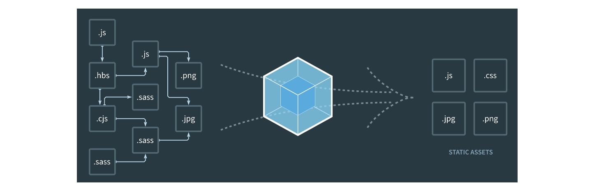

# 一、概念

`webpack` 本质上是一个打包工具，它会根据代码的内容解析模块依赖，帮助我们把多个模块的代码打包。借用 `webpack` 官网的图片：



如上图，`webpack` 会把我们项目中使用到的多个代码模块（可以是不同文件类型），打包构建成项目运行仅需要的几个静态文件。`webpack` 有着十分丰富的配置项，提供了十分强大的扩展能力，可以在打包构建的过程中做很多事情。我们先来看一下 `webpack` 中的几个基本概念。

## 入口

如上图所示，在多个代码模块中会有一个起始的 `.js` 文件，这个便是 `webpack` 构建的入口。`webpack` 会读取这个文件，并从它开始解析依赖，然后进行打包。如图，一开始我们使用 `webpack` 构建时，默认的入口文件就是 `./src/index.js`。

我们常见的项目中，如果是单页面应用，那么可能入口只有一个；如果是多个页面的项目，那么经常是一个页面会对应一个构建入口。

入口可以使用 `entry` 字段来进行配置，`webpack` 支持配置多个入口来进行构建：

```js
module.exports = {
  entry: './src/index.js' 
}

// 上述配置等同于
module.exports = {
  entry: {
    main: './src/index.js'
  }
}

// 或者配置多个入口
module.exports = {
  entry: {
    foo: './src/page-foo.js',
    bar: './src/page-bar.js', 
    // ...
  }
  output: {
    // [name] home, other
    filename: '[name].js',
    path: path.resolve(__dirname, 'dist')
  },
  plugins: [
    new HTMLWebpackPlugin({
      template: './index.html',
      filename: 'home.html',
      chunks: ['home']
    }),
    new HTMLWebpackPlugin({
      template: './index.html',
      filename: 'other.html',
      chunks: ['other']
    })
  ]
}

// 使用数组来对多个文件进行打包
module.exports = {
  entry: {
    main: [
      './src/foo.js',
      './src/bar.js'
    ]
  }
}
```

**最后的例子，可以理解为多个文件作为一个入口，`webpack` 会解析两个文件的依赖后进行打包。**

## 输出

`webpack` 的输出即指 `webpack` 最终构建出来的静态文件，可以看看上面 `webpack` 官方图片右侧的那些文件。当然，构建结果的文件名、路径等都是可以配置的，使用 `output` 字段：

```js
let path = require('path')

module.exports = {
  // ...
  output: {
    path: path.resolve(__dirname, 'dist'), // 路径必须是一个绝对路径
    filename: 'bundle.js', // 打包后的文件名
  },
}

// 或者多个入口生成不同文件
module.exports = {
  entry: {
    foo: './src/foo.js',
    bar: './src/bar.js',
  },
  output: {
    filename: '[name].js',
    path: __dirname + '/dist',
  },
}

// 路径中使用 hash，每次构建时会有一个不同 hash 值，避免发布新版本时线上使用浏览器缓存
module.exports = {
  // ...
  output: {
    filename: '[name].js',
    path: __dirname + '/dist/[hash]',
  },
}

```

我们一开始直接使用 `webpack` 构建时，默认创建的输出内容就是 `./dist/main.js`。

## loader

`webpack` 中提供一种处理多种文件格式的机制，便是使用 loader。我们可以把 loader 理解为是一个转换器，负责把某种文件格式的内容转换成 `webpack` 可以支持打包的模块。

举个例子，在没有添加额外插件的情况下，`webpack` 会默认把所有依赖打包成 `js` 文件，如果入口文件依赖一个 `.hbs` 的模板文件以及一个 `.css` 的样式文件，那么我们需要 `handlebars-loader` 来处理 `.hbs` 文件，需要 `css-loader` 来处理 `.css` 文件（这里其实还需要 `style-loader`，后续详解），最终把不同格式的文件都解析成 `js` 代码，以便打包后在浏览器中运行。

当我们需要使用不同的 `loader` 来解析处理不同类型的文件时，我们可以在 `module.rules` 字段下来配置相关的规则，例如使用 `Babel` 来处理 `.js` 文件：

```js
module: {
  // ...
  rules: [
    {
      test: /\.jsx?/, // 匹配文件路径的正则表达式，通常我们都是匹配文件类型后缀
      include: [
        path.resolve(__dirname, 'src') // 指定哪些路径下的文件需要经过 loader 处理
      ],
      use: 'babel-loader', // 指定使用的 loader
    },
  ],
}

```

`loader` 是 `webpack` 中比较复杂的一块内容，它支撑着 `webpack` 来处理文件的多样性。后续我们还会介绍如何更好地使用 `loader` 以及如何开发 `loader`。

## `plugin`

在 `webpack` 的构建流程中，`plugin` 用于处理更多其他的一些构建任务。可以这么理解，模块代码转换的工作由 loader 来处理，除此之外的其他任何工作都可以交由 `plugin` 来完成。通过添加我们需要的 `plugin`，可以满足更多构建中特殊的需求。例如，要使用压缩 `JS` 代码的 `uglifyjs-webpack-plugin` 插件，只需在配置中通过 `plugins` 字段添加新的 `plugin` 即可：

```js
const UglifyPlugin = require('uglifyjs-webpack-plugin')

module.exports = {
  plugins: [
    new UglifyPlugin()
  ],
}
```

除了压缩 `JS` 代码的 [uglifyjs-webpack-plugin](https://webpack.js.org/plugins/uglifyjs-webpack-plugin/)，常用的还有定义环境变量的 [DefinePlugin](https://webpack.js.org/plugins/define-plugin/)，生成 `CSS` 文件的 [mini-css-extract-plugin](https://webpack.docschina.org/plugins/mini-css-extract-plugin/) 等。在这里提到这些 `plugin`，只是希望读者们能够对 `plugin` 的作用有个大概的印象，后续的小节会详细介绍如何使用这些 `plugin`。

`plugin` 理论上可以干涉 `webpack` 整个构建流程，可以在流程的每一个步骤中定制自己的构建需求。第 15 小节我们会介绍如何开发 `plugin`，让读者们在必要时，也可以在 `webpack` 的基础上开发 `plugin` 来应对一些项目的特殊构建需求。

## 一个简单的 `webpack` 配置

我们把上述涉及的几部分配置内容合到一起，就可以创建一个简单的 `webpack` 配置了，`webpack` 运行时默认读取项目下的 `webpack.config.js` 文件作为配置。

所以我们在项目中创建一个 `webpack.config.js` 文件：

```json
const path = require('path')
const UglifyPlugin = require('uglifyjs-webpack-plugin')

module.exports = {
  mode: 'production', // 模式 默认为production development
  entry: './src/index.js',

  output: {
    path: path.resolve(__dirname, 'dist'),
    filename: 'bundle.js',
  },

  module: {
    rules: [
      {
        test: /\.jsx?/,
        include: [
          path.resolve(__dirname, 'src')
        ],
        use: 'babel-loader',
      },
    ],
  },

  // 代码模块路径解析的配置
  resolve: {
    modules: [
      "node_modules",
      path.resolve(__dirname, 'src')
    ],

    extensions: [".wasm", ".mjs", ".js", ".json", ".jsx"],
  },

  plugins: [
    new UglifyPlugin(), 
    // 使用 uglifyjs-webpack-plugin 来压缩 JS 代码
    // 如果你留意了我们一开始直接使用 webpack 构建的结果，你会发现默认已经使用了 JS 代码压缩的插件
    // 这其实也是我们命令中的 --mode production 的效果，后续的小节会介绍 webpack 的 mode 参数
  ],
}

```

`webpack` 的配置其实是一个 `Node.js` 的脚本，这个脚本对外暴露一个配置对象，`webpack` 通过这个对象来读取相关的一些配置。因为是 `Node.js` 脚本，所以可玩性非常高，你可以使用任何的 `Node.js` 模块，如上述用到的 `path` 模块，当然第三方的模块也可以。

创建了 `webpack.config.js` 后再执行 `webpack` 命令，`webpack` 就会使用这个配置文件的配置了。

有的时候我们开始一个新的前端项目，并不需要从零开始配置 `webpack`，而可以使用一些工具来帮助快速生成 `webpack` 配置。

## 脚手架中的 `webpack` 配置

现今，大多数前端框架都提供了简单的工具来协助快速生成项目基础文件，一般都会包含项目使用的 `webpack` 的配置，如：

* [create-react-app](https://github.com/facebookincubator/create-react-app)

  `create-react-app` 的 `webpack` 配置在这个项目下：[react-scripts](https://github.com/facebookincubator/create-react-app/blob/master/packages/react-scripts/README.md)。

* [angular/devkit/build-webpack](https://github.com/angular/devkit/blob/master/packages/angular_devkit/build_webpack/README.md)

  通常 angular 的项目开发和生产的构建任务都是使用 `angular-cli` 来运行的，但 `angular-cli` 只是命令的使用接口，基础功能是由 [angular/devkit](https://github.com/angular/devkit) 来实现的，`webpack` 的构建相关只是其中一部分，详细的配置可以参考 [webpack-configs](https://github.com/angular/devkit/tree/master/packages/angular_devkit/build_webpack/src/angular-cli-files/models/webpack-configs) 。

* [vue-cli](https://github.com/vuejs/vue-cli/)

  `vue-cli` 使用 `webpack` 模板生成的项目文件中，`webpack` 相关配置存放在 build 目录下。

这些工具都提供了极其完整的配置来帮助开发者快捷开始一个项目，我们可以学习了解它们所提供的 `webpack` 配置，有些情况下，还会尝试修改这些配置以满足特殊的需求。

所以你也会发现，这些极其流行的前端类库或者框架都提供了基于 `webpack` 的工具，`webpack` 基本成为前端项目构建工具的标配。

> 这三个工具中，只有 `angular-cli` 使用了 `4.x` 版本的 `webpack`，其他的都还是用的 `3.x` 版本，学习的时候要留意一下版本区别。

## 小结

`webpack` 的安装和使用和大多数使用 `Node.js` 开发的命令行工具一样，使用 `npm` 安装后执行命令即可，`webpack 4.x` 版本的零配置特性也让上手变得更加简单。

# 二、 `webpack-dev-server`

在构建代码并部署到生产环境之前，我们需要一个本地环境，用于运行我们开发的代码。这个环境相当于提供了一个简单的服务器，用于访问 `webpack` 构建好的静态文件，我们日常开发时可以使用它来调试前端代码。

`webpack-dev-server` 是 `webpack` 官方提供的一个工具，可以基于当前的 `webpack` 构建配置快速启动一个静态服务。当 `mode` 为 `development` 时，会具备 `hot reload` 的功能，即当源码文件变化时，会即时更新当前页面，以便你看到最新的效果。

## 基础使用

`webpack-dev-server` 是一个 `npm package`，安装后在已经有 `webpack` 配置文件的项目目录下直接启动就可以：

```bash
npm install webpack-dev-server -g
webpack-dev-server --mode development 
```

`webpack-dev-server` 本质上也是调用 `webpack`，`4.x` 版本的也要指定 `mode`。建议把 `webpack-dev-server` 作为开发依赖安装，然后使用 `npm scripts` 来启动

```bash
npm i webpack-dev-server -D
# npm install webpack-dev-server --save-dev
```

`package` 中的 `scripts` 配置：

> `--mode development` 和 `--config webpack.config.js`可省略

```json
{
  // ...
  "scripts": {
    "start": "webpack-dev-server --mode development",
    "build": "webpack --config webpack.config.js"
  }
}
```

```bash
npm run start
```

`webpack-dev-server` 默认使用 `8080` 端口，如果你使用了 `html-webpack-plugin` 来构建 HTML 文件，并且有一个 `index.html` 的构建结果，那么直接访问 http://localhost:8080/ 就可以看到 `index.html` 页面了。如果没有 HTML 文件的话，那么 `webpack-dev-server` 会生成一个展示静态资源列表的页面。


## 配置

```js
module.exports = {
  devServer: {
    port: 3000,							 // 3000端口
    progress: true,          // 滚动条
    contentBase: './build',  // 起服务的地址
    open: true,              // 自动打开浏览器
    compress： true,         // gzip压缩
    proxy: {
      '/api': {
        target: "http://localhost:3000", // 将 URL 中带有 /api 的请求代理到本地的 3000 端口的服务上
        changeOrigin: true,
        ws: true,
        pathRewrite: {
          '^/api': ''
        } // 把 URL 中 path 部分的 `api` 移除掉
      },
		}
	},
  // ...
  output: {
    path: path.resolve(__dirname, 'dist'), // 路径必须是一个绝对路径
    filename: 'bundle.js', // 打包后的文件名
  },
}
```


在 `webpack` 的配置中，可以通过 `devServer` 字段来配置 `webpack-dev-server`，如端口设置、启动 `gzip` 压缩等，这里简单讲解几个常用的配置。

### public

`public` 字段用于指定静态服务的域名，默认是 http://localhost:8080/ ，当你使用 `Nginx` 来做反向代理时，应该就需要使用该配置来指定 `Nginx` 配置使用的服务域名。

### port

`port` 字段用于指定静态服务的端口，如上，默认是 8080，通常情况下都不需要改动。

### `publicPath`

`publicPath` 字段用于指定构建好的静态文件在浏览器中用什么路径去访问，默认是 `/`，例如，对于一个构建好的文件 `bundle.js`，完整的访问路径是 `http://localhost:8080/bundle.js`，如果你配置了 `publicPath: 'assets/'`，那么上述 `bundle.js` 的完整访问路径就是 `http://localhost:8080/assets/bundle.js`。可以使用整个 URL 来作为 `publicPath` 的值，如 `publicPath: 'http://localhost:8080/assets/'`。**如果你使用了 `HMR`，那么要设置 `publicPath` 就必须使用完整的 URL**。

> 建议将 `devServer.publicPath` 和 `output.publicPath` 的值保持一致。

### proxy

`proxy` 用于配置 `webpack-dev-server` 将特定 URL 的请求代理到另外一台服务器上。当你有单独的后端开发服务器用于请求 `API` 时，这个配置相当有用。例如：

```js
proxy: {
  '/api': {
    target: "http://localhost:3000", // 将 URL 中带有 /api 的请求代理到本地的 3000 端口的服务上
    changeOrigin: true,
    ws: true,
    pathRewrite: {
      '^/api': ''
    } // 把 URL 中 path 部分的 `api` 移除掉
  },
}

```

`webpack-dev-server` 的 proxy 功能是使用 [http-proxy-middleware](https://github.com/chimurai/http-proxy-middleware) 来实现的，如果需要更详细的 proxy 配置，可以参考官方文档 [http-proxy-middleware](https://github.com/chimurai/http-proxy-middleware#example)。

```
target：要使用url模块解析的url字符串
forward：要使用url模块解析的url字符串
agent：要传递给http（s）.request的对象（请参阅Node的https代理和http代理对象）
ssl：要传递给https.createServer（）的对象
ws：true / false，是否代理websockets
xfwd：true / false，添加x-forward标头
secure：true / false，是否验证SSL Certs
toProxy：true / false，传递绝对URL作为路径（对代理代理很有用）
prependPath：true / false，默认值：true - 指定是否要将目标的路径添加到代理路径
ignorePath：true / false，默认值：false - 指定是否要忽略传入请求的代理路径（注意：如果需要，您必须附加/手动）。
localAddress：要为传出连接绑定的本地接口字符串
changeOrigin：true / false，默认值：false - 将主机标头的原点更改为目标URL
```

### `contentBase`

`contentBase` 用于配置提供额外静态文件内容的目录，之前提到的 `publicPath` 是配置构建好的结果以什么样的路径去访问，而 `contentBase` 是配置额外的静态文件内容的访问路径，即那些不经过 webpack 构建，但是需要在 webpack-dev-server 中提供访问的静态资源（如部分图片等）。推荐使用绝对路径：

```js
// 使用当前目录下的 public
contentBase: path.join(__dirname, "public") 

// 也可以使用数组提供多个路径
contentBase: [path.join(__dirname, "public"), path.join(__dirname, "assets")]

```

> `publicPath` 的优先级高于 `contentBase`。

### `before和after`

`before` 和 `after` 配置用于在 `webpack-dev-server` 定义额外的中间件，如

```js
before(app){
  app.get('/some/path', function(req, res) { // 当访问 /some/path 路径时，返回自定义的 json 数据
    res.json({ custom: 'response' })
  })
}

```

`before` 在 `webpack-dev-server` 静态资源中间件处理之前，可以用于拦截部分请求返回特定内容，或者实现简单的数据 mock。

`after` 在 `webpack-dev-server` 静态资源中间件处理之后，比较少用到，可以用于打印日志或者做一些额外处理。

`webpack-dev-server` 的配置项比较多，这里只列举了一些日常比较有用的，更多的请参考官方文档 [webpack-dev-server](https://doc.webpack-china.org/configuration/dev-server/)。

# 三、`webpack-dev-middleware`

如果你熟悉使用 `Node.js` 来开发 Web 服务，使用过 [Express](https://expressjs.com/) 或者 [Koa](http://koajs.com/)，那么对中间件的概念应该会有所了解。

简而言之，中间件就是在 Express 之类的 Web 框架中实现各种各样功能（如静态文件访问）的这一部分函数。多个中间件可以一起协同构建起一个完整的 Web 服务器。

不熟悉 Express 中间件概念的同学可以参考 Express 的官方文档 [使用中间件](http://www.expressjs.com.cn/guide/using-middleware.html)。

[webpack-dev-middleware](https://github.com/webpack/webpack-dev-middleware) 就是在 Express 中提供 `webpack-dev-server` 静态服务能力的一个中间件，我们可以很轻松地将其集成到现有的 Express 代码中去，就像添加一个 Express 中间件那么简单。

首先安装 w`ebpack-dev-middleware` 依赖：

```bash
npm install webpack-dev-middleware --save-dev

```

接着创建一个 `Node.js` 服务的脚本文件，如 `app.js`：

```js
const webpack = require('webpack')
const middleware = require('webpack-dev-middleware')
const webpackOptions = require('./webpack.config.js') // webpack 配置文件的路径

// 本地的开发环境默认就是使用 development mode
webpackOptions.mode = 'development'

const compiler = webpack(webpackOptions)
const express = require('express')
const app = express()

app.use(middleware(compiler, {
  // webpack-dev-middleware 的配置选项
}))

// 其他 Web 服务中间件
// app.use(...)

app.listen(3000, () => console.log('Example app listening on port 3000!'))

```

然后用 `Node.js` 运行该文件即可：

```bash
node app.js # 使用刚才创建的 app.js 文件

```

使用 `webpack-dev-server` 的好处是相对简单，直接安装依赖后执行命令即可，而使用 `webpack-dev-middleware` 的好处是可以在既有的 Express 代码基础上快速添加 `webpack-dev-server` 的功能，同时利用 Express 来根据需要添加更多的功能，如 mock 服务、代理 `API` 请求等。

其实 `webpack-dev-server` 也是基于 Express 开发的，前面提及的 `webpack-dev-server` 中 `before` 或 `after` 的配置字段，也可以用于编写特定的中间件来根据需要添加额外的功能。

## 简单的 mock 服务

在前端的日常开发工作中，我们本地需要的不仅仅是提供静态内容访问的服务，还需要模拟后端 `API` 数据来做一些应用测试工作，这个时候我们需要一个 mock 数据的服务，而 `webpack-dev-server` 的 `before` 或 `proxy` 配置，又或者是 `webpack-dev-middleware` 结合 Express，都可以帮助我们来实现简单的 mock 服务。

这一部分内容涉及比较多的 `Node.js` 代码实现，这里不做过于详细的例子解释，只提供一些实现的思路。

我们最主要的需求是当浏览器请求某一个特定的路径时（如 /some/path ），可以访问我们想要的数据内容。

我们先基于 `Express app` 实现一个简单 mock 功能的方法：

```js
module.export = function mock(app) {
  app.get('/some/path', (req, res) => {
    res.json({ data: '' })
  })

  // ... 其他的请求 mock
  // 如果 mock 代码过多，可以将其拆分成多个代码文件，然后 require 进来
}

```

然后应用到配置中的 `before` 字段：

```js
const mock = require('./mock')

// ...
before(app) {
  mock(app) // 调用 mock 函数
}

```

这样的 `mock` 函数照样可以应用到 Express 中去，提供与 `webpack-dev-middleware` 同样的功能。

由于 `app.get('', (req, res) => { ... })` 的 callback 可以拿到 `req` 请求对象，其实可以根据请求参数来改变返回的结果，即通过参数来模拟多种场景的返回数据来协助测试多种场景下的代码应用。

当你单独实现或者使用一个 mock 服务时，你可以通过 proxy 来配置部分路径代理到对应的 mock 服务上去，从而把 mock 服务集成到当前的开发服务中去，相对来说也很简单。

当你和后端开发进行联调时，亦可使用 proxy 代理到对应联调使用的机器上，从而可以使用本地前端代码的开发环境来进行联调。当然了，连线上环境的异常都可以这样来尝试定位问题。

## 小结

本小节介绍了 `webpack-dev-server` 的基础使用及其更多的一些配置选项，如何使用 `webpack-dev-middleware` 来将 `webpack` 的开发环境集成到现有的 Node 服务中去，以及如何在 `webpack-dev-server` 和 `webpack-dev-middleware` 的基础上实现简单的 mock 服务。

# 四、搭建基本的前端开发环境

我们日常使用的前端开发环境应该是怎样的？我们可以尝试着把基本前端开发环境的需求列一下：

*   构建我们发布需要的 `HTML、CSS、JS` 文件
*   使用 `CSS` 预处理器来编写样式
*   处理和压缩图片
*   使用 `Babel` 来支持 ES 新特性
*   本地提供静态服务以方便开发调试

上述几项应该可以满足比较简单的前端项目开发环境需求了，下面会一一介绍如何配置 `webpack` 来满足这些需求。

## 关联 HTML

`webpack` 默认从作为入口的 `.js` 文件进行构建（更多是基于 SPA 去考虑），但通常一个前端项目都是从一个页面（即 HTML）出发的，最简单的方法是，创建一个 HTML 文件，使用 `script` 标签直接引用构建好的 `JS` 文件，如：

```
<script src="./dist/bundle.js"></script>

```

但是，如果我们的文件名或者路径会变化，例如使用 `[hash]` 来进行命名，那么最好是将 HTML 引用路径和我们的构建结果关联起来，这个时候我们可以使用 [html-webpack-plugin](https://doc.webpack-china.org/plugins/html-webpack-plugin/)。

`html-webpack-plugin` 是一个独立的 node package，所以在使用之前我们需要先安装它，把它安装到项目的开发依赖中：

```bash
npm install html-webpack-plugin -D 

# 或者
yarn add html-webpack-plugin -D

```

然后在 `webpack` 配置中，将 `html-webpack-plugin` 添加到 `plugins` 列表中：

```js
const HtmlWebpackPlugin = require('html-webpack-plugin')

module.exports = {
  // ...
  plugins: [
    new HtmlWebpackPlugin(),
  ],
}

```

这样配置好之后，构建时 `html-webpack-plugin` 会为我们创建一个 HTML 文件，其中会引用构建出来的 `JS` 文件。实际项目中，默认创建的 HTML 文件并没有什么用，我们需要自己来写 HTML 文件，可以通过 `html-webpack-plugin` 的配置，传递一个写好的 HTML 模板：

```js
module.exports = {
  // ...
  plugins: [ // 数组  放着所有的webpack插件
    new HtmlWebpackPlugin({
      filename: 'index.html', // 配置输出文件名和路径
      template: 'assets/index.html', // 配置html模板所在的文件路径
      minify: {  // 压缩HTML文件
        removeAttributeQuotes: true,  // 删除属性的双引号
        collapseWhitespace: true,     // 折叠空行（输出的html变成一行）
        removeComments: true, 				// 移除HTML中的注释
      },
      hash: true										// 添加hash戳,每次构建时会有一个不同 hash 值，避免发布新版本时线上使用浏览器缓存
    }),
  ],
}

```

这样，通过 `html-webpack-plugin` 就可以将我们的页面和构建 `JS` 关联起来，回归日常，从页面开始开发。如果需要添加多个页面关联，那么实例化多个 `html-webpack-plugin`， 并将它们都放到 `plugins` 字段数组中就可以了。

更多配置这里就不展开讲解了，参考文档 [html-webpack-plugin](https://github.com/jantimon/html-webpack-plugin) 以及官方提供的例子 [html-webpack-plugin/examples](https://github.com/jantimon/html-webpack-plugin/tree/master/examples)。

> [webpack4 之html-webpack-plugin](https://www.jianshu.com/p/08a60756ffda)

## 构建 `CSS`

我们编写 `CSS`，并且希望使用 `webpack` 来进行构建，为此，需要在配置中引入 `loader` 来解析和处理 `CSS` 文件：

```js
module.exports = {
  module: {  // 模块
    rules: [ // 规则
      //css-loader解析@import这种语法
      //style-loader是把css插入到head标签中
      //需要先安装css-loader和style-loader
      //loader的顺序，默认是从右向左，从下到上执行
      //loader还可以写成对象方式
      {
        test: /\.css$/,
        include: [
          path.resolve(__dirname, 'src'),
        ],
        use: [
          {
            loader: 'style-loader',
            options: {
              insertAt: 'top'  // 默认情况下，style-loader 将 <style> 元素附加到样式目标(style target)的末尾，即页面															  // 的 <head> 标签。这将导致 loader 创建的 CSS 优先于目标中已经存在的 CSS。要在目标的起																//始处插入 style 元素，请将此查询参数(query parameter)设置为 'top'
            }
          },
          'css-loader',
          'postcss-loader',  //给css样式加前缀,npm安装postcss-loader autoprefixer,还需要配置postcss.config.js文件
          // 'less-loader'      // 把less -》css，安装less less-loader
        ],
      },
    ],
  }
}

```

> `style-loader` 和 `css-loader` 都是单独的 `node package`，需要安装。

我们创建一个 `index.css` 文件，并在 `index.js` 中引用它，然后进行构建。

```js
import "./index.css"

```

可以发现，构建出来的文件并没有 `CSS`，先来看一下新增两个 loader 的作用：

*   `css-loader` 负责解析 `CSS` 代码，主要是为了处理 `CSS` 中的依赖，例如 `@import` 和 `url()` 等引用外部文件的声明；
*   `style-loader` 会将 `css-loader` 解析的结果转变成 `JS` 代码，运行时动态插入 `style` 标签来让 `CSS` 代码生效。

## 抽离`css`

经由上述两个 loader 的处理后，`CSS` 代码会转变为 `JS`，和 `index.js` 一起打包了。如果需要**单独把 `CSS` 文件分离出来**，我们需要使用 [mini-css-extract-plugin](https://webpack.docschina.org/plugins/mini-css-extract-plugin/) 插件。

```bash
npm install mini-css-extract-plugin -D
# yarn add mini-css-extract-plugin -D
```

看一个简单的例子：

```js
let MiniCssExtractPlugin = require('mini-css-extract-plugin');

module.exports = {
  // ...
  module: {
    rules: [
      {
        test:/\.css$/,
        use:[
          MiniCssExtractPlugin.loader,  // 将css单独抽离出来，而不是通过style loader将css样式插入到head标签中 
          'css-loader',
          'postcss-loader',  //给css样式加前缀,npm安装postcss-loader autoprefixer,还需要配置postcss.config.js文件
        ]
      }
    ],
  },
  plugins: [
    // 引入插件，配置文件名，这里同样可以使用 [hash]
    // 将js中所有引用的css打包到一个css文件中，以link方式插入html。需结合loader一起使用。 不推荐使用会造成额外http请求。但		// 如果要去除无用css代码，必须适用该插件。
    new MiniCssExtractPlugin({
      filename: '[name].css'
    }),
  ],
}

```

使用了[mini-css-extract-plugin](https://webpack.docschina.org/plugins/mini-css-extract-plugin/)插件之后，`css`文件默认不会被优化压缩。此时我们可以使用`optimize-css-assets-webpack-plugin`和[uglifyjs-webpack-plugin](https://www.webpackjs.com/plugins/uglifyjs-webpack-plugin/)插件来优化

```js
// webpack4+
const OptimizeCssAssetsPlugin = require('optimize-css-assets-webpack-plugin');
const MiniCssExtractPlugin = require('mini-css-extract-plugin');

// webpack4 
module.exports = {
  optimization: {
    minimizer: [
      new UglifyJsPlugin({
        cache: true,
        parallel: true,
        sourcMap: true
      }),
      new OptimizeCssAssetsPlugin({
        assetNameRegExp: /\.optimize\.css$/g,
        cssProcessor: require('cssnano'),
        cssProcessorOptions: { safe: true, discardComments: { removeAll: true } },
        canPrint: true
      }),
    ],
  },
  module: {
    rules: [
      {
        test: /\.css$/,
        use: [
          MiniCssExtractPlugin.loader,
          'css-loader'
        ],
      },
    ],
  },
  plugins: [
    new MiniCssExtractPlugin({
      filename: "[name].css",
    }),
  ]
};
```

## `CSS` 预处理器

在上述使用 `CSS` 的基础上，通常我们会使用 Less/Sass 等 `CSS` 预处理器，`webpack` 可以通过添加对应的 loader 来支持，以使用 `Less` 为例，我们可以在官方文档中找到对应的 [loader](https://doc.webpack-china.org/loaders/less-loader)。

我们需要在上面的 `webpack` 配置中，添加一个配置来支持解析后缀为 .less 的文件：

```js
module.exports = {
  // ...
  module: {
    rules: [
      {
        test: /\.less$/,
        use: [
          MiniCssExtractPlugin.loader,
          'css-loader', 
          'postcss-loader',  //给css样式加前缀,npm安装postcss-loader autoprefixer,还需要配置postcss.config.js文件
          'less-loader',    // 把less -》css，安装less-loader
        ],
      },
    ],
  },
  // ...
}

```

## 处理图片文件

在前端项目的样式中总会使用到图片，虽然我们已经提到 `css-loader` 会解析样式中用 `url()` 引用的文件路径，但是图片对应的 `jpg/png/gif` 等文件格式，`webpack` 处理不了。是的，我们只要添加一个处理图片的 loader 配置就可以了，现有的 file-loader 就是个不错的选择。

file-loader 可以用于处理很多类型的文件，它的主要作用是**直接输出文件，把构建后的文件路径返回（file-loader默认会在内部生成一张图片到build目录下，把生成的图片的路径返回）**。配置很简单，在 `rules`中添加一个字段，增加图片类型文件的解析配置：

```js
module.exports = {
  // ...
  module: {
    rules: [
      {
        test: /\.(png|jpg|gif)$/,
        use: [
          {
            loader: 'file-loader',
            options: {
              outputPath: '/img/',  // 放到img目录下
              publicPath: 'http://www.lijiawei0627.xyz'  
              //  当我们想把图片放到其他站点（比如CDN上）的时候，可以通过设置publicPath来实现。此时返回的图片路径会自动加上								//  http://www.lijiawei0627.xyz
            },
          },
        ],
      },
    ],
  },
}

```

更多关于 file-loader 的配置可以参考官方文档 [file-loader](https://webpack.js.org/loaders/file-loader/)。

## 使用 Babel

[Babel](http://babeljs.io/) 是一个让我们能够使用 ES 新特性的 `JS` 编译工具，我们可以在 `webpack` 中配置 `Babel`，以便使用 `ES6`、`ES7` 标准来编写 `JS` 代码。

```js
module.exports = {
  // ...
  module: {
    rules: [
      {
        test: /\.jsx?/, // 支持 js 和 jsx
        include: [
          path.resolve(__dirname, 'src'), // src 目录下的才需要经过 babel-loader 处理
        ],
        exclude: /node_modules/, // 不处理node_modules目录下的文件
        loader: 'babel-loader',
      },
    ],
  },
}

```

Babel 的相关配置可以在目录下使用 `.babelrc` 文件来处理，详细参考 Babel 官方文档 [.babelrc](http://babeljs.io/docs/usage/babelrc/)。

## 使用`eslint`

使用`eslint`对代码做校验

```bash
npm install --save-dev eslint-loader
```

```js
module.exports = {
  // ...
  module: {
    rules: [
      {
        test: /\.js$/,
        loader: 'eslint-loader',
        enforce: "pre",  // previous
        include: [path.resolve(__dirname, 'src')], // 指定检查的目录
        options: { // 这里的配置项参数将会被传递到 eslint 的 CLIEngine 
          formatter: require('eslint-friendly-formatter') // 指定错误报告的格式规范
        }
      }
    ],
  },
}

```

项目想要使用哪些`eslin`规则，可以创建一个配置项文件 `.eslintrc.js`，在里面配置校验规则。

## 使用`sourceMap`

>[你所不知道的sourceMap](https://juejin.im/post/6844903971648372743#heading-6)

通常，`js`代码出错，控制台会提示第几行第几列代码出错。但是`webpack`打包压缩后的代码，都被压缩到了一行。代码出错，控制台就没法正确的提示错误位置。`sourceMap`就可以解决这个问题。`sourceMap`就是一个信息文件，里面储存着打包前的位置信息。有了它，出错的时候，浏览器控制台将直接显示原始代码出错的位置，而不是转换后的代码，点击出错信息将直接跳转到原始代码位置。

```js
module.exports = {
  // ...
  // 1)源码映射，会单独生成一个sourcemap文件，出错了会表示当前报错的列和行
  // devtool: 'source-map' // 增加映射文件，可以帮助我们调试源代码
  // 2) 不会产生单独的文件，但是可以显示行和列
  // devtool: 'eval-source-map',
  // 3) 不会产生列，但是是一个单独的映射文件
  // devtool: 'cheap-module-source-map'
  // 4) 不会产生文件，集成在打包后的文件中，不会产生列
  devtool：'cheap-module-eval-source-map'
}
```

## 使用watch

```js
module.exports = {
  // ...
  watch: true,  // 观察文件内容更改，重新打包
  watchOptions: {
    poll: 1000,  // 每秒监听1000次
    aggregateTimeout: 500,  // 防抖
    ignored: /node_modules/ // 不需要监控node_modules文件夹
  }
}
```


## 启动静态服务

至此，我们完成了处理多种文件类型的 `webpack` 配置。我们可以使用 [webpack-dev-server](https://github.com/webpack/webpack-dev-server) 在本地开启一个简单的静态服务来进行开发。

在项目下安装 `webpack-dev-server`，然后添加启动命令到 package.json 中：

```json
"scripts": {
  "build": "webpack --mode production",
  "start": "webpack-dev-server --mode development"
}

```

> 也可以全局安装 `webpack-dev-server`，但通常建议以项目开发依赖的方式进行安装，然后在 `npm package` 中添加启动脚本。

尝试着运行 `npm run start` 或者 `yarn start`，然后就可以访问 http://localhost:8080/ 来查看你的页面了。默认是访问 `index.html`，如果是其他页面要注意访问的 URL 是否正确。

## 小结

我们现在已经可以使用 `webpack` 来完成日常中需要的基础前端构建需求：构建 `HTML、CSS、JS` 文件、使用 `CSS` 预处理器来编写样式、处理和压缩图片、使用 `Babel`、方便开发调试的静态服务，接下来的小节会在这个基础上，深入 `webpack` 配置细节，结合实际工作中的一些需要，更进一步地了解 `webpack` 的使用。

# 五、配置 loader

在第 1 小节，我们提到过，webpack 的 loader 用于处理不同的文件类型，在日常的项目中使用 loader 时，可能会遇到比较复杂的情况，本小节我们来深入探讨 loader 的一些配置细节。

## loader 匹配规则

当我们需要配置 loader 时，都是在 `module.rules` 中添加新的配置项，在该字段中，每一项被视为一条匹配使用 loader 的规则。

先来看一个基础的例子：

```js
module.exports = {
  // ...
  module: {
    rules: [ 
      {
        test: /\.jsx?/, // 条件
        include: [ 
          path.resolve(__dirname, 'src'),
        ], // 条件
        use: 'babel-loader', // 规则应用结果
      }, // 一个 object 即一条规则
      // ...
    ],
  },
}

```

loader 的匹配规则中有两个最关键的因素：一个是匹配条件，一个是匹配规则后的应用。

匹配条件通常都使用请求资源文件的绝对路径来进行匹配，在官方文档中称为 `resource`，除此之外还有比较少用到的 `issuer`，则是声明依赖请求的源文件的绝对路径。举个例子：在 /path/to/app.js 中声明引入 `import './src/style.scss'`，`resource` 是 /path/to/src/style.scss，`issuer` 是 /path/to/app.js，规则条件会对这两个值来尝试匹配。

上述代码中的 `test` 和 `include` 都用于匹配 `resource` 路径，是 `resource.test` 和 `resource.include` 的简写，你也可以这么配置：

```js
module.exports = {
  // ...
  rules: [ 
      {
        resource: { // resource 的匹配条件
          test: /\.jsx?/, 
          include: [ 
            path.resolve(__dirname, 'src'),
          ],
        },
        // 如果要使用 issuer 匹配，便是 issuer: { test: ... }
        use: 'babel-loader',
      },
      // ...
    ], 
}

```

> issuer 规则匹配的场景比较少见，你可以用它来尝试约束某些类型的文件中只能引用某些类型的文件。

当规则的条件匹配时，便会使用对应的 loader 配置，如上述例子中的 `babel-loader`。关于 loader 配置后面再详细介绍，这里先来看看如何配置更加复杂的规则匹配条件。

## 规则条件配置

大多数情况下，配置 loader 的匹配条件时，只要使用 `test` 字段就好了，很多时候都只需要匹配文件后缀名来决定使用什么 loader，但也不排除在某些特殊场景下，我们需要配置比较复杂的匹配条件。webpack 的规则提供了多种配置形式：

*   `{ test: ... }` 匹配特定条件
*   `{ include: ... }` 匹配特定路径
*   `{ exclude: ... }` 排除特定路径
*   `{ and: [...] }`必须匹配数组中所有条件
*   `{ or: [...] }` 匹配数组中任意一个条件
*   `{ not: [...] }` 排除匹配数组中所有条件

上述的所谓条件的值可以是：

*   字符串：必须以提供的字符串开始，所以是字符串的话，这里我们需要提供绝对路径
*   正则表达式：调用正则的 `test` 方法来判断匹配
*   函数：(path) => boolean，返回 `true` 表示匹配
*   数组：至少包含一个条件的数组
*   对象：匹配所有属性值的条件

通过例子来帮助理解：

```js
rules: [
  {
    test: /\.jsx?/, // 正则
    include: [
      path.resolve(__dirname, 'src'), // 字符串，注意是绝对路径
    ], // 数组
    // ...
  },
  {
    test: {
      js: /\.js/,
      jsx: /\.jsx/,
    }, // 对象，不建议使用
    not: [
      (value) => { /* ... */ return true; }, // 函数，通常需要高度自定义时才会使用
    ],
  },
],

```

上述多个配置形式结合起来就能够基本满足各种各样的构建场景了，通常我们会结合使用 `test/and` 和 `include&exclude` 来配置条件，如上述那个简单的例子。

## module type

webpack 4.x 版本强化了 module type，即模块类型的概念，不同的模块类型类似于配置了不同的 loader，webpack 会有针对性地进行处理，现阶段实现了以下 5 种模块类型。

*   `javascript/auto`：即 webpack 3 默认的类型，支持现有的各种 JS 代码模块类型 —— CommonJS、AMD、ESM
*   `javascript/esm`：ECMAScript modules，其他模块系统，例如 CommonJS 或者 AMD 等不支持，是 `.mjs` 文件的默认类型
*   `javascript/dynamic`：CommonJS 和 AMD，排除 ESM
*   `javascript/json`：JSON 格式数据，`require` 或者 `import` 都可以引入，是 `.json` 文件的默认类型
*   `webassembly/experimental`：WebAssembly modules，当前还处于试验阶段，是 `.wasm` 文件的默认类型

如果不希望使用默认的类型的话，在确定好匹配规则条件时，我们可以使用 `type` 字段来指定模块类型，例如把所有的 JS 代码文件都设置为强制使用 ESM 类型：

```js
{
  test: /\.js/,
  include: [
    path.resolve(__dirname, 'src'),
  ],
  type: 'javascript/esm', // 这里指定模块类型
},

```

上述做法是可以帮助你规范整个项目的模块系统，但是如果遗留太多不同类型的模块代码时，建议还是直接使用默认的 `javascript/auto`。

webpack 后续的开发计划会增加对更多模块类型的支持，例如极其常见的 CSS 和 HTML 模块类型，这个特性值得我们期待一下。

## 使用 loader 配置

当然，在当前版本的 webpack 中，`module.rules` 的匹配规则最重要的还是用于配置 loader，我们可以使用 `use` 字段：

```js
rules: [
  {
    test: /\.less/,
    use: [
      'style-loader', // 直接使用字符串表示 loader
      {
        loader: 'css-loader',
        options: {
          importLoaders: 1
        },
      }, // 用对象表示 loader，可以传递 loader 配置等
      {
        loader: 'less-loader',
        options: {
          noIeCompat: true
        }, // 传递 loader 配置
      },
    ],
  },
],

```

我们看下上述的例子，先忽略 loader 的使用情况，单纯看看如何配置。`use` 字段可以是一个数组，也可以是一个字符串或者表示 loader 的对象。如果只需要一个 loader，也可以这样：`use: { loader: 'babel-loader', options: { ... } }`。

我们还可以使用 `options` 给对应的 loader 传递一些配置项，这里不再展开。当你使用一些 loader 时，loader 的说明一般都有相关配置的描述。

## loader 应用顺序

前面提到，一个匹配规则中可以配置使用多个 loader，即一个模块文件可以经过多个 loader 的转换处理，执行顺序是从最后配置的 loader 开始，一步步往前。例如，对于上面的 `less` 规则配置，一个 style.less 文件会途径 less-loader、css-loader、style-loader 处理，成为一个可以打包的模块。

loader 的应用顺序在配置多个 loader 一起工作时很重要，通常会使用在 CSS 配置上，除了 style-loader 和 css-loader，你可能还要配置 less-loader 然后再加个 postcss 的 autoprefixer 等。

上述从后到前的顺序是在同一个 rule 中进行的，那如果多个 rule 匹配了同一个模块文件，loader 的应用顺序又是怎样的呢？看一份这样的配置：

```js
rules: [
  {
    test: /\.js$/,
    exclude: /node_modules/,
    loader: "eslint-loader",
  },
  {
    test: /\.js$/,
    exclude: /node_modules/,
    loader: "babel-loader",
  },
],

```

这样无法法保证 eslint-loader 在 babel-loader 应用前执行。webpack 在 `rules` 中提供了一个 `enforce` 的字段来配置当前 rule 的 loader 类型，没配置的话是普通类型，我们可以配置 `pre` 或 `post`，分别对应前置类型或后置类型的 loader。

> eslint-loader 要检查的是人工编写的代码，如果在 babel-loader 之后使用，那么检查的是 Babel 转换后的代码，所以必须在 babel-loader 处理之前使用。

还有一种行内 loader，即我们在应用代码中引用依赖时直接声明使用的 loader，如 `const json = require('json-loader!./file.json')` 这种。不建议在应用开发中使用这种 loader，后续我们还会再提到。

顾名思义，所有的 loader 按照**前置(`pre`) -> 普通(`normal`) -> 行内(`inline`) -> 后置(`postloader`)**的顺序执行。所以当我们要确保 `eslint-loader` 在 babel-loader 之前执行时，可以如下添加 `enforce` 配置：

```js
rules: [
  {
    enforce: 'pre', // 指定为前置类型
    test: /\.js$/,
    exclude: /node_modules/,
    loader: "eslint-loader",
  },
]

```

当项目文件类型和应用的 loader 不是特别复杂的时候，通常建议把要应用的同一类型 loader 都写在同一个匹配规则中，这样更好维护和控制。

## 使用 `noParse`

在 `webpack` 中，我们需要使用的 `loader` 是在 `module.rules` 下配置的，`webpack` 配置中的 `module` 用于控制如何处理项目中不同类型的模块。

除了 `module.rules` 字段用于配置 loader 之外，还有一个 `module.noParse` 字段，可以用于配置哪些模块文件的内容不需要进行解析。对于一些**不需要解析依赖（即无依赖）** 的第三方大型类库等，可以通过这个字段来配置，以提高整体的构建速度。

> 使用 `noParse` 进行忽略的模块文件中不能使用 `import`、`require`、`define` 等导入机制。

```js
module.exports = {
  // ...
  module: {
    noParse: /jquery|lodash/, // 正则表达式

    // 或者使用 function
    noParse(content) {
      return /jquery|lodash/.test(content)
    },
  }
}

```

`noParse` 从某种程度上说是个优化配置项，日常也可以不去使用。

## 小结

webpack 的 loader 相关配置都在 `module.rules` 字段下，我们需要通过 `test`、`include`、`exclude` 等配置好应用 loader 的条件规则，然后使用 `use` 来指定需要用到的 loader，配置应用的 loader 时还需要注意一下 loader 的执行顺序。

除此之外，`webpack 4.x` 版本新增了模块类型的概念，相当于 `webpack` 内置一个更加底层的文件类型处理，暂时只有 `JS` 相关的支持，后续会再添加 `HTML 和 CSS` 等类型。

# 六、使用 `plugin`

`webpack` 中的 `plugin` 大多都提供额外的能力，它们在 `webpack` 中的配置都只是把插件实例添加到 `plugins` 字段的数组中。不过由于需要提供不同的功能，不同的插件本身的配置比较多样化。

社区中有很多 `webpack` 插件可供使用，而优秀的插件基本上都提供了详细的使用说明文档。更多的插件可以在这里查找：[plugins in awesome-webpack](https://github.com/webpack-contrib/awesome-webpack#webpack-plugins)。

下面通过介绍几个常用的插件来了解插件的使用方法。

## `html-webpack-plugin`

构建时 `html-webpack-plugin` 会为我们创建一个 HTML 文件，其中会引用构建出来的 `JS` 文件。实际项目中，默认创建的 HTML 文件并没有什么用，我们需要自己来写 HTML 文件，可以通过 `html-webpack-plugin` 的配置，传递一个写好的 HTML 模板：

```js
module.exports = {
  // ...
  plugins: [ // 数组  放着所有的webpack插件
    new HtmlWebpackPlugin({
      filename: 'index.html', // 配置输出文件名和路径
      template: 'assets/index.html', // 配置html模板所在的文件路径
      minify: {  // 压缩HTML文件
        removeAttributeQuotes: true,  // 删除属性的双引号
        collapseWhitespace: true,     // 折叠空行（输出的html变成一行）
        removeComments: true, 				// 移除HTML中的注释
      },
      hash: true										// 添加hash戳,每次构建时会有一个不同 hash 值，避免发布新版本时线上使用浏览器缓存
    }),
  ],
}

```

这样，通过 `html-webpack-plugin` 就可以将我们的页面和构建 `JS` 关联起来，回归日常，从页面开始开发。如果需要添加多个页面关联，那么实例化多个 `html-webpack-plugin`， 并将它们都放到 `plugins` 字段数组中就可以了。

## `clean-webpack-plugin`

## `copy-webpack-plugin`

## `BannerPlugin`

```js
let CleanWebpackPlugin = require('clean-webpack-plugin');
let CopyWebpackPlugin = require('copy-webpack-plugin');
let webpack = require('webpack');
module.exports = {
  // ...
  plugins: [ // 数组  放着所有的webpack插件
    new CleanWebpackPlugin('./dist'), // 每次构建都删掉之前构建的目录
    new CopyWebpackPlugin([
      {from: 'doc', to: './'}  // 将doc目录下的文件拷贝到dist目录下
    ]),
    new webpack.BannerPlugin('make 2020 by ljw') // 添加版权信息
  ],
}
```

## `DefinePlugin`

DefinePlugin 是 webpack 内置的插件，可以使用 `webpack.DefinePlugin` 直接获取。

这个插件用于创建一些在编译时可以配置的全局常量，这些常量的值我们可以在 `webpack` 的配置中去指定，例如：

```js
module.exports = {
  // ...
  plugins: [
    new webpack.DefinePlugin({
      Env: JSON.stringify('dev'), // const Env = 'dev'
      Env: JSON.stringify('production'), // const Env = 'production'
      PRODUCTION: JSON.stringify(true), // const PRODUCTION = true
      VERSION: JSON.stringify('5fa3b9'), // const VERSION = '5fa3b9'
      BROWSER_SUPPORTS_HTML5: true, // const BROWSER_SUPPORTS_HTML5 = 'true'
      TWO: '1+1', // const TWO = 1 + 1,
      CONSTANTS: {
        APP_VERSION: JSON.stringify('1.1.2') // const CONSTANTS = { APP_VERSION: '1.1.2' }
      }
    }),
  ],
}

```

有了上面的配置，就可以在应用代码文件中，访问配置好的变量了，如：

```js
console.log("Running App version " + VERSION);

if(!BROWSER_SUPPORTS_HTML5) require("html5shiv");

```

上面配置的注释已经简单说明了这些配置的效果，这里再简述一下整个配置规则。

*   如果配置的值是字符串，那么整个字符串会被当成代码片段来执行，其结果作为最终变量的值，如上面的 `"1+1"`，最后的结果是 `2`
*   如果配置的值不是字符串，也不是一个对象字面量，那么该值会被转为一个字符串，如 `true`，最后的结果是 `'true'`
*   如果配置的是一个对象字面量，那么该对象的所有 key 会以同样的方式去定义

这样我们就可以理解为什么要使用 `JSON.stringify()` 了，因为 `JSON.stringify(true)` 的结果是 `'true'`，`JSON.stringify("5fa3b9")` 的结果是 `"5fa3b9"`。

社区中关于 DefinePlugin 使用得最多的方式是定义环境变量，例如 `PRODUCTION = true` 或者 `__DEV__ = true` 等。部分类库在开发环境时依赖这样的环境变量来给予开发者更多的开发调试反馈，例如 `react` 等。

> 建议使用 process.env.NODE\_ENV: ... 的方式来定义 process.env.NODE\_ENV，而不是使用 process: { env: { NODE\_ENV: ... } } 的方式，因为这样会覆盖掉 process 这个对象，可能会对其他代码造成影响。

## copy-webpack-plugin

这个插件看名字就知道它有什么作用，没错，就是用来复制文件的。

我们一般会把开发的所有源码和资源文件放在 src/ 目录下，构建的时候产出一个 build/ 目录，通常会直接拿 build 中的所有文件来发布。有些文件没经过 webpack 处理，但是我们希望它们也能出现在 build 目录下，这时就可以使用 CopyWebpackPlugin 来处理了。

我们来看下如何配置这个插件：

```js
const CopyWebpackPlugin = require('copy-webpack-plugin')

module.exports = {
  // ...
  plugins: [
    new CopyWebpackPlugin([
      { from: 'src/file.txt', to: 'build/file.txt', }, // 顾名思义，from 配置来源，to 配置目标路径
      { from: 'src/*.ico', to: 'build/*.ico' }, // 配置项可以使用 glob
      // 可以配置很多项复制规则
    ]),
  ],
}

```

> glob 用法可以参考 [glob-primer](https://github.com/isaacs/node-glob#glob-primer)。

上述的配置日常应用已经足够，更多的配置内容可以参考 [copy-webpack-plugin](https://github.com/webpack-contrib/copy-webpack-plugin)。

## `mini-css-extract-plugin`

如果需要**单独把 `CSS` 文件分离出来**，我们需要使用 [mini-css-extract-plugin](https://webpack.docschina.org/plugins/mini-css-extract-plugin/) 插件。

```bash
npm install mini-css-extract-plugin -D
# yarn add mini-css-extract-plugin -D
```

看一个简单的例子：

```js
let MiniCssExtractPlugin = require('mini-css-extract-plugin');

module.exports = {
  // ...
  module: {
    rules: [
      {
        test:/\.css$/,
        use:[
          MiniCssExtractPlugin.loader,  // 将css单独抽离出来，而不是通过style loader将css样式插入到head标签中 
          'css-loader',
          'postcss-loader',  //给css样式加前缀,npm安装postcss-loader autoprefixer,还需要配置postcss.config.js文件
        ]
      }
    ],
  },
  plugins: [
    // 引入插件，配置文件名，这里同样可以使用 [hash]
    // 将js中所有引用的css打包到一个css文件中，以link方式插入html。需结合loader一起使用。 不推荐使用会造成额外http请求。但		// 如果要去除无用css代码，必须适用该插件。
    new MiniCssExtractPlugin({
      filename: '[name].css'
    }),
  ],
}

```

使用了[mini-css-extract-plugin](https://webpack.docschina.org/plugins/mini-css-extract-plugin/)插件之后，`css`文件默认不会被优化压缩。此时我们可以使用`optimize-css-assets-webpack-plugin`和[uglifyjs-webpack-plugin](https://www.webpackjs.com/plugins/uglifyjs-webpack-plugin/)插件来优化

```js
// webpack4+
const OptimizeCssAssetsPlugin = require('optimize-css-assets-webpack-plugin');
const MiniCssExtractPlugin = require('mini-css-extract-plugin');

// webpack4 
module.exports = {
  optimization: {
    minimizer: [
      new UglifyJsPlugin({
        cache: true,
        parallel: true,
        sourcMap: true
      }),
      new OptimizeCssAssetsPlugin({
        assetNameRegExp: /\.optimize\.css$/g,
        cssProcessor: require('cssnano'),
        cssProcessorOptions: { safe: true, discardComments: { removeAll: true } },
        canPrint: true
      }),
    ],
  },
  module: {
    rules: [
      {
        test: /\.css$/,
        use: [
          MiniCssExtractPlugin.loader,
          'css-loader'
        ],
      },
    ],
  },
  plugins: [
    new MiniCssExtractPlugin({
      filename: "[name].css",
    }),
  ]
};
```

## extract-text-webpack-plugin

extract-text-webpack-plugin 之前的章节有简单介绍过，我们用它来把依赖的 CSS 分离出来成为单独的文件。这里再看一下使用 extract-text-webpack-plugin 的配置：

```js
const ExtractTextPlugin = require('extract-text-webpack-plugin')

module.exports = {
  // ...
  module: {
    rules: [
      {
        test: /\.css$/,
        // 因为这个插件需要干涉模块转换的内容，所以需要使用它对应的 loader
        use: ExtractTextPlugin.extract({ 
          fallback: 'style-loader',
          use: 'css-loader',
        }), 
      },
    ],
  },
  plugins: [
    // 引入插件，配置文件名，这里同样可以使用 [hash]
    new ExtractTextPlugin('index.css'),
  ],
}

```

在上述的配置中，我们使用了 index.css 作为单独分离出来的文件名，但有的时候构建入口不止一个，extract-text-webpack-plugin 会为每一个入口创建单独分离的文件，因此最好这样配置：

```js
plugins: [
  new ExtractTextPlugin('[name].css'),
],

```

这样确保在使用多个构建入口时，生成不同名称的文件。

这里再次提及 extract-text-webpack-plugin，一个原因是它是一个蛮常用的插件，另一个原因是它的使用方式比较特别，除了在 `plugins` 字段添加插件实例之外，还需要调整 loader 对应的配置。

在这里要强调的是，在 webpack 中，loader 和 plugin 的区分是很清楚的，针对文件模块转换要做的使用 loader，而其他干涉构建内容的可以使用 plugin。 ExtractTextWebpackPlugin 既提供了 plugin，也提供了 extract 方法来获取对应需要的 loader。

## ProvidePlugin

ProvidePlugin 也是一个 webpack 内置的插件，我们可以直接使用 `webpack.ProvidePlugin` 来获取。

该组件用于引用某些模块作为应用运行时的变量，从而不必每次都用 `require` 或者 `import`，其用法相对简单：

```js
new webpack.ProvidePlugin({
  identifier: 'module',
  // ...
})

// 或者
new webpack.ProvidePlugin({
  identifier: ['module', 'property'], // 即引用 module 下的 property，类似 import { property } from 'module'
  // ...
})

```

在你的代码中，当 `identifier` 被当作未赋值的变量时，module 就会被自动加载了，而 `identifier` 这个变量即 module 对外暴露的内容。

注意，如果是 ES 的 `default export`，那么你需要指定模块的 `default` 属性：`identifier: ['module', 'default'],`。

更多使用例子可以查看官方文档 [ProvidePlugin](https://doc.webpack-china.org/plugins/provide-plugin/)。

## `IgnorePlugin`

`IgnorePlugin` 和 `ProvidePlugin` 一样，也是一个 `webpack` 内置的插件，可以直接使用 `webpack.IgnorePlugin` 来获取。

这个插件用于忽略某些特定的模块，让 `webpack` 不把这些指定的模块打包进去。例如我们使用 [moment.js](http://momentjs.com/)，直接引用后，里边有大量的 `i18n` 的代码，导致最后打包出来的文件比较大，而实际场景并不需要这些 `i18n` 的代码，这时我们可以使用 `IgnorePlugin` 来忽略掉这些代码文件，配置如下：

```js
module.exports = {
  // ...
  plugins: [
    new webpack.IgnorePlugin(/^\.\/locale$/, /moment$/)
  ]
}

```

`IgnorePlugin` 配置的参数有两个，第一个是匹配引入模块路径的正则表达式，第二个是匹配模块的对应上下文，即所在目录名。

## 小结

本小节介绍了几个相对常见的 `webpack plugin` 的使用：

* `html-webpack-plugin`
* `clean-webpack-plugin`
* `BannerPlugin`

*   `DefinePlugin`
*   `copy-webpack-plugin`
*   `mini-css-extract-plugin`
*   `extract-text-webpack-plugin`
*   `ProvidePlugin`
*   `IgnorePlugin`

更多其他组件的使用就请有兴趣的同学自行摸索了：[plugins in awesome-webpack](https://github.com/webpack-contrib/awesome-webpack#webpack-plugins)。

# 七、`webpack` 如何解析代码模块路径

在 `webpack` 支持的前端代码模块化中，我们可以使用类似 `import * as m from './index.js'` 来引用代码模块 `index.js`。

引用第三方类库则是像这样：`import React from 'react'`。`webpack` 构建的时候，会解析依赖后，然后再去加载依赖的模块文件，那么 `webpack` 如何将上述编写的 `./index.js` 或 `react` 解析成对应的模块文件路径呢？

> 在 JavaScript 中尽量使用 `ECMAScript` 2015 Modules 语法来引用依赖。

`webpack` 中有一个很关键的模块 [enhanced-resolve](https://github.com/webpack/enhanced-resolve/) 就是处理依赖模块路径的解析的，这个模块可以说是 `Node.js` 那一套模块路径解析的增强版本，有很多可以自定义的解析配置。

> 不熟悉 `Node.js` 模块路径解析机制的同学可以参考这篇文章：[深入 Node.js 的模块机制](http://www.infoq.com/cn/articles/nodejs-module-mechanism)。

## 模块解析规则

我们简单整理一下基本的模块解析规则，以便更好地理解后续 `webpack` 的一些配置会产生的影响。

*   解析相对路径
    1.  查找相对当前模块的路径下是否有对应文件或文件夹
    2.  是文件则直接加载
    3.  是文件夹则继续查找文件夹下的 `package.json` 文件
    4.  有 `package.json` 文件则按照文件中 `main` 字段的文件名来查找文件
    5.  无 `package.json` 或者无 `main` 字段则查找 `index.js` 文件
*   解析模块名  
    查找当前文件目录下，父级目录及以上目录下的 `node_modules` 文件夹，看是否有对应名称的模块
*   解析绝对路径（不建议使用）  
    直接查找对应路径的文件

在 `webpack` 配置中，和模块路径解析相关的配置都在 `resolve` 字段下：

```js
module.exports = {
  resolve: {
    // ...
  }
}

```

接下来的内容会省略上述代码，直接描述 `resolve` 字段中的内容。

## 常用的一些配置

我们先从一些简单的需求来阐述 webpack 可以支持哪些解析路径规则的自定义配置。

### `resolve.alias`

假设我们有个 `utils` 模块极其常用，经常编写相对路径很麻烦，希望可以直接 `import 'utils'` 来引用，那么我们可以配置某个模块的别名，如：

```js
alias: {  // 别名
  utils: path.resolve(__dirname, 'src/utils'), // 这里使用 path.resolve 和 __dirname 来获取绝对路径
  bootstrap: 'bootstrap/dist/css/bootstrap.css' // 通过bootstrap别名，代替bootstrap/dist/css/bootstrap.css
}

```

上述的配置是模糊匹配，意味着只要模块路径中携带了 `utils` 就可以被替换掉，如：

```js
import 'utils/query.js' // 等同于 import '[项目绝对路径]/src/utils/query.js'
import 'bootstrap'  // 等同于import 'bootstrap/dist/css/bootstrap.css'
```

如果需要进行精确匹配可以使用：

```js
alias: {
  utils$: path.resolve(__dirname, 'src/utils') // 只会匹配 import 'utils'
}

```

更多匹配相关的写法可以参考官方文档 [Resolve Alias](https://doc.webpack-china.org/configuration/resolve/#resolve-alias)，这里不一一举例说明。

### `resolve.extensions`

在看第 1 小节中的 `webpack` 配置时，你可能留意到了这么一行：

```js
extensions: ['.wasm', '.mjs', '.js', '.json', '.jsx'],
// 这里的顺序代表匹配后缀的优先级，例如对于 index.js 和 index.jsx，会优先选择 index.js

```

看到数组中配置的字符串大概就可以猜到，这个配置的作用是和文件后缀名有关的。是的，这个配置可以定义在进行模块路径解析时，`webpack` 会尝试帮你补全那些后缀名来进行查找，例如有了上述的配置，当你在 `src/utils/` 目录下有一个 `common.js` 文件时，就可以这样来引用：

```
import * as common from './src/utils/common'

```

`webpack` 会尝试给你依赖的路径添加上 `extensions` 字段所配置的后缀，然后进行依赖路径查找，所以可以命中 `src/utils/common.js` 文件。

但如果你是引用 `src/styles` 目录下的 `common.css` 文件时，如 `import './src/styles/common'`，`webpack` 构建时则会报无法解析模块的错误。

你可以在引用时添加后缀，`import './src/styles/common.css'` 来解决，或者在 `extensions` 添加一个 `.css` 的配置：

```js
extensions: ['.wasm', '.mjs', '.js', '.json', '.jsx', '.css'],

```

### `resolve.modules`

前面的内容有提到，对于直接声明依赖名的模块（如 `react` ），`webpack` 会类似 `Node.js` 一样进行路径搜索，搜索 node\_modules 目录，这个目录就是使用 `resolve.modules` 字段进行配置的，默认就是：

```js
resolve: {
  modules: ['node_modules'],
},

```

通常情况下，我们不会调整这个配置，但是如果可以确定项目内所有的第三方依赖模块都是在项目根目录下的 node\_modules 中的话，那么可以在 node\_modules 之前配置一个确定的绝对路径：

```js
resolve: {
  modules: [
    path.resolve(__dirname, 'node_modules'), // 指定当前目录下的 node_modules 优先查找
    'node_modules', // 如果有一些类库是放在一些奇怪的地方的，你可以添加自定义的路径或者目录
  ],
},

```

这样配置在某种程度上可以简化模块的查找，提升构建速度。

### `resolve.mainFields`

> 有 `package.json` 文件则按照文件中 `main` 字段的文件名来查找文件

我们之前有提到这么一句话，其实确切的情况并不是这样的，`webpack` 的 `resolve.mainFields` 配置可以进行调整。当引用的是一个模块或者一个目录时，会使用 `package.json` 文件的哪一个字段下指定的文件，默认的配置是这样的：

```js
resolve: {
  // 配置 target === "web" 或者 target === "webworker" 时 mainFields 默认值是：
  mainFields: ['browser', 'module', 'main'],

  // target 的值为其他时，mainFields 默认值为：
  mainFields: ["module", "main"],
},

```

因为通常情况下，模块的 package 都不会声明 `browser` 或 `module` 字段，所以便是使用 `main` 了。

在 `NPM packages` 中，会有些 package 提供了两个实现，分别给浏览器和 `Node.js` 两个不同的运行时使用，这个时候就需要区分不同的实现入口在哪里。如果你有留意一些社区开源模块的 `package.json` 的话，你也许会发现 `browser` 或者 `module` 等字段的声明。

### `resolve.mainFiles`

当目录下没有 `package.json` 文件时，我们说会默认使用目录下的 `index.js` 这个文件，其实这个也是可以配置的，是的，使用 `resolve.mainFiles` 字段，默认配置是：

```js
resolve: {
  mainFiles: ['index'], // 你可以添加其他默认使用的文件名
},

```

通常情况下我们也无须修改这个配置，`index.js` 基本就是约定俗成的了。

### `resolve.resolveLoader`

这个字段 `resolve.resolveLoader` 用于配置解析 loader 时的 resolve 配置，原本 resolve 的配置项在这个字段下基本都有。我们看下默认的配置：

```js
resolve: {
  resolveLoader: {
    extensions: ['.js', '.json'],
    mainFields: ['loader', 'main'],
  },
},

```

这里提供的配置相对少用，我们一般遵从标准的使用方式，使用默认配置，然后把 loader 安装在项目根路径下的 node\_modules 下就可以了。

## 小结

`webpack` 依赖 [enhanced-resolve](https://github.com/webpack/enhanced-resolve/) 来解析代码模块的路径，`webpack` 配置文件中和 `resolve` 相关的选项都会传递给 enhanced-resolve 使用，我们介绍了这些选项的作用：

*   `resolve.alias`
*   `resolve.extensions`
*   `resolve.modules`
*   `resolve.mainFiles`
*   `resolve.resolveLoader`

`webpack` 提供的这些选项可以帮助你更加灵活地去控制项目中代码模块的解析，除了上述的选项外，其他的选项在日常项目中相对比较少用到，如若需要，可以参考官方文档 [Resolve](https://doc.webpack-china.org/configuration/resolve/)。

# 八、用 `HMR` 提高开发效率

`HMR` 全称是 Hot Module Replacement，即模块热替换。在这个概念出来之前，我们使用过 Hot Reloading，当代码变更时通知浏览器刷新页面，以避免频繁手动刷新浏览器页面。`HMR` 可以理解为增强版的 Hot Reloading，但不用整个页面刷新，而是局部替换掉部分模块代码并且使其生效，可以看到代码变更后的效果。所以，`HMR` 既避免了频繁手动刷新页面，也减少了页面刷新时的等待，可以极大地提高前端页面开发效率。

## 配置使用 `HMR`

`HMR` 是 `webpack` 提供的非常有用的一个功能，跟我们之前提到的一样，安装好 `webpack-dev-server`， 添加一些简单的配置，即在 `webpack` 的配置文件中添加启用 `HMR` 需要的两个插件：

```js
const webpack = require('webpack')

module.exports = {
  // ...
  devServer: {
    hot: true // dev server 的配置要启动 hot，或者在命令行中带参数开启
  },
  plugins: [
    // ...
    new webpack.NamedModulesPlugin(), // 用于启动 HMR 时可以显示模块的相对路径
    new webpack.HotModuleReplacementPlugin(), // Hot Module Replacement 的插件
  ],
}

```

> 笔者觉得 `HMR` 应该是 development mode 默认启动的功能，这个希望 `webpack` 后续能有优化。

## `HMR` 运行原理

`HMR` 的实现和运行相对复杂，需要多个部分协同配合，这里稍微介绍一下 `HRM` 的运行原理。

首先我们要知道一个概念：`webpack` 内部运行时，会维护一份用于管理构建代码时各个模块之间交互的表数据，`webpack` 官方称之为 **Manifest**，其中包括入口代码文件和构建出来的 bundle 文件的对应关系。可以使用 [WebpackManifestPlugin](https://github.com/danethurber/webpack-manifest-plugin) 插件来输出这样的一份数据。

了解这个概念后，我们来看一下 `HMR` 的大致运行流程图。


当你使用前面的配置启动了支持 `HMR` 的 `webpack-dev-server`，然后在浏览器打开页面时，你也可以从控制台看到大概的 `HMR` 执行流程：


开启了 hot 功能的 `webpack` 会往我们应用的主要代码中添加 `WS` 相关的代码，用于和服务器保持连接，等待更新动作。

当你配置了 `HMR` 的插件时，会往应用代码中添加 `HMR` 运行时的代码，主要用于定义代码模块应用更新时的 `API`，后面会详细介绍。

> 有兴趣可以查看源码：[HotModuleReplacement.runtime.js](https://github.com/webpack/webpack/blob/master/lib/HotModuleReplacement.runtime.js)。

有了这两个部分就可以支持整个 `HMR` 的功能了。我们先忽略流程图的右上角部分，左下角的流程相对容易理解：当有更新时，`webpack-dev-server` 发送更新信号给 `HMR` 运行时，然后 `HMR` 再请求所需要的更新数据，请求的更新数据没有问题的话就应用更新。

如果 `HMR` 只是简单替换了代码模块的内容，如替换掉所谓的 `installedModules` 中需要更新的部分，那么这样并没有办法把更新后的结果实时地在浏览器上显示出来，所以才会需要流程图的右上角部分。

> 如果无法理解 `installedModules`，可以参考第 13 小节中的「bundler 的基础流程」这一部分的内容

前面提到的 `HMR` 运行时代码会提供定义代码模块应用更新时执行的 `API`，这些 `API` 可以让我们在模块中定义接收到 `HMR` 更新应用信号时，需要额外做什么工作。例如， [style-loader](https://github.com/webpack-contrib/style-loader) 就需要实现 `HMR` 接口，当收到更新时，使用新的样式替换掉旧的样式，大概是这样：

```js
if (module.hot) {
  module.hot.accept('/some/path', function() {
    // ... 用新样式替换旧样式
  })
}

```

详情可以参考 [style-loader](https://github.com/webpack-contrib/style-loader) 中的代码实现：[HMR interface implemention in style-loader](https://github.com/webpack-contrib/style-loader/blob/master/index.js#L36)。

`HMR` 应用更新时是使用 `webpackHotUpdate` 来处理的：

```js
webpackHotUpdate(id, { 
  'modulePath': 
  function() {
    // 模块更新后的代码
  }
})

```

执行 `webpackHotUpdate` 时如发现模块代码实现了 `HMR` 接口，就会执行相应的回调或者方法，从而达到应用更新时，模块可以自行管理自己所需要额外做的工作。不过，并不是所有的模块都需要做相关的处理，当遇见没有实现 `HMR` 接口的模块时，就会往上层冒泡，如本节开头部分的流程图所示。

这里还有一个问题是，`webpack` 如何保证 `HMR` 接口中的引用是最新的模块代码？我们看一个简单的例子：

```js
import './index.css'
import hello from './bar'

hello()

if (module.hot) {
  module.hot.accept('./bar', () => {
    // console.log('Accepting the updated bar module!')
    hello()
  })
}

```

从代码上看，hello 都是同一个，这样的话并没有办法引用最新的模块代码，但是我们看一下上述代码在 `webpack` 构建后的结果：

```js
if (true) {
  module.hot.accept("./src/bar.js", function(__WEBPACK_OUTDATED_DEPENDENCIES__) { 
    /* harmony import */ 
    __WEBPACK_IMPORTED_MODULE_1__bar__ = __webpack_require__("./src/bar.js"); 
    (() => {
      // console.log('Accepting the updated bar module!')
      Object(__WEBPACK_IMPORTED_MODULE_1__bar__["default"])()
    })(__WEBPACK_OUTDATED_DEPENDENCIES__); 
  })
}

```

其他代码比较杂，我们集中看 `module.hot` 的处理部分。这里可以发现，我们的 hello 已经重新使用 `__webpack_require__` 来引用了，所以可以确保它是最新的模块代码。

基本上 `HMR` 的执行原理就是这样，更具体的实现部分就不展开讲解了。在日常开发中，我们需要更多的工具来帮助我们实现 `HMR` 的接口，避免编写过多 `HMR` 需要的代码。例如，React 在组件代码更新时可能需要触发重新 render 来实现实时的组件展示效果，官方提供了一些现有的工具，需要的可以参考一下：[hot module replacement tools](https://webpack.js.org/guides/hot-module-replacement/#other-code-and-frameworks)。

## `module.hot` 常见的 `API`

前面 `HMR` 实现部分已经讲解了实现 `HMR` 接口的重要性，下面来看看常见的 `module.hot` `API` 有哪些，以及如何使用。

之前已经简单介绍过，`module.hot.accept` 方法指定在应用特定代码模块更新时执行相应的 callback，第一个参数可以是字符串或者数组，如：

```js
if (module.hot) {
  module.hot.accept(['./bar.js', './index.css'], () => {
    // ... 这样当 bar.js 或者 index.css 更新时都会执行该函数
  })
}

```

`module.hot.decline` 对于指定的代码模块，拒绝进行模块代码的更新，进入更新失败状态，如 `module.hot.decline('./bar.js')`。这个方法比较少用到。

`module.hot.dispose` 用于添加一个处理函数，在当前模块代码被替换时运行该函数，例如：

```js
if (module.hot) {
  module.hot.dispose((data) => {
    // data 用于传递数据，如果有需要传递的数据可以挂在 data 对象上，然后在模块代码更新后可以通过 module.hot.data 来获取
  })
}

```

`module.hot.accept` 通常用于指定当前依赖的某个模块更新时需要做的处理，如果是当前模块更新时需要处理的动作，使用 `module.hot.dispose` 会更加容易方便。

`module.hot.removeDisposeHandler` 用于移除 `dispose` 方法添加的 callback。

关于 `module.hot` 的更多 `API` 详情可以参考官方文档：[Hot Module Replacement APIs](https://doc.webpack-china.org/api/hot-module-replacement)。

## 小结

`Hot Module Replacement` 是 `webpack` 具备的一个相当重要的特性，用于提升开发效率和体验。在这一小节中，我们介绍了：

*   在 `webpack` 中配置使用 `HMR`
*   `HMR` 的运行原理
*   模块中的 `HMR` 接口 `API`

# 九、开发和生产环境的构建配置差异

我们在日常的前端开发工作中，一般都会有两套构建环境：一套开发时使用，构建结果用于本地开发调试，不进行代码压缩，打印 debug 信息，包含 `sourcemap` 文件；另外一套构建后的结果是直接应用于线上的，即代码都是压缩后，运行时不打印 debug 信息，静态文件不包括 `sourcemap` 的。有的时候可能还需要多一套测试环境，在运行时直接进行请求 mock 等工作。

`webpack 4.x` 版本引入了 mode 的概念，在运行 `webpack` 时需要指定使用 production 或 development 两个 mode 其中一个，这个功能也就是我们所需要的运行两套构建环境的能力。

当你指定使用 production mode 时，默认会启用各种性能优化的功能，包括构建结果优化以及 `webpack` 运行性能优化，而如果是 development mode 的话，则会开启 debug 工具，运行时打印详细的错误信息，以及更加快速的增量编译构建。关于这两个 mode 的更详细区别，可以查阅 `webpack` 作者的这篇文章：[webpack 4: mode and optimization](https://medium.com/webpack/webpack-4-mode-and-optimization-5423a6bc597a)。

虽然 `webpack` 的 mode 参数已经给我们带来了一些很方便的环境差异化配置，但是针对一些项目情况，例如使用 `css-loader` 或者 `url-loader` 等，不同环境传入 loader 的配置也不一样，而 mode 并没有帮助我们做这些事情，因此有些配置还是需要手动区分环境后来进行调整。

## 在配置文件中区分 mode

之前我们的配置文件都是直接对外暴露一个 `JS` 对象，这种方式暂时没有办法获取到 `webpack` 的 `mode` 参数，我们需要更换一种方式来处理配置。根据官方的文档[多种配置类型](https://doc.webpack-china.org/configuration/configuration-types/)，配置文件可以对外暴露一个函数，因此我们可以这样做：

```js
module.exports = (env, argv) => ({
  // ... 其他配置
  optimization: {
    minimize: false,
    // 使用 argv 来获取 mode 参数的值
    minimizer: argv.mode === 'production' ? [
      new UglifyJsPlugin({ /* 你自己的配置 */ }), 
      // 仅在我们要自定义压缩配置时才需要这么做
      // mode 为 production 时 webpack 会默认使用压缩 JS 的 plugin
    ] : [],
  },
})

```

这样获取 mode 之后，我们就能够区分不同的构建环境，然后根据不同环境再对特殊的 loader 或 `plugin` 做额外的配置就可以了。

以上是 `webpack 4.x` 的做法，由于有了 mode 参数，区分环境变得简单了。不过在当前业界，估计还是使用 `webpack 3.x` 版本的居多，所以这里也简单介绍一下 `3.x` 如何区分环境。

`webpack` 的运行时环境是 `Node.js`，我们可以通过 `Node.js` 提供的机制给要运行的 `webpack` 程序传递环境变量，来控制不同环境下的构建行为。例如，我们在 `npm` 中的 `scripts` 字段添加一个用于生产环境的构建命令：

```json
{
  "scripts": {
    "build": "NODE_ENV=production webpack",
    "develop": "NODE_ENV=development webpack-dev-server"
  }
}

```

然后在 `webpack.config.js` 文件中可以通过 `process.env.NODE_ENV` 来获取命令传入的环境变量：

```js
const config = {
  // ... webpack 配置
}

if (process.env.NODE_ENV === 'production') {
  // 生产环境需要做的事情，如使用代码压缩插件等
  config.plugins.push(new UglifyJsPlugin())
}

module.exports = config

```

## 运行时的环境变量

我们使用 `webpack` 时传递的 mode 参数，是可以在我们的应用代码运行时，通过 `process.env.NODE_ENV` 这个变量获取的。这样方便我们在运行时判断当前执行的构建环境，使用最多的场景莫过于控制是否打印 debug 信息。

下面这个简单的例子，在应用开发的代码中实现一个简单的 console 打印封装：

```js
export default function log(...args) {
  if (process.env.NODE_ENV === 'development' && console && console.log) {
    console.log.apply(console, args)
  }
}

```

同样，以上是 `webpack 4.x` 的做法，下面简单介绍一下 `3.x` 版本应该如何实现。这里需要用到 [DefinePlugin](https://doc.webpack-china.org/plugins/define-plugin) 插件，它可以帮助我们在构建时给运行时定义变量，那么我们只要在前面 `webpack 3.x` 版本区分构建环境的例子的基础上，再使用 `DefinePlugin` 添加环境变量即可影响到运行时的代码。

在 `webpack` 的配置中添加 `DefinePlugin` 插件：

```js
module.exports = {
  // ...
  // webpack 的配置

  plugins: [
    new webpack.DefinePlugin({
      // webpack 3.x 的 process.env.NODE_ENV 是通过手动在命令行中指定 NODE_ENV=... 的方式来传递的
      'process.env.NODE_ENV': JSON.stringify(process.env.NODE_ENV),
    }),
  ],
}

```

## 常见的环境差异配置

前面提及的使用环境变量的方式可以让我们在不同的构建环境中完成不同的构建需求，这里列举一下常见的 webpack 构建差异配置：

*   生产环境可能需要分离 `CSS` 成单独的文件，以便多个页面共享同一个 `CSS` 文件
*   生产环境需要压缩 `HTML/CSS/JS` 代码
*   生产环境需要压缩图片
*   开发环境需要生成 `sourcemap` 文件
*   开发环境需要打印 debug 信息
*   开发环境需要 live reload 或者 hot reload 的功能

以上是常见的构建环境需求差异，可能更加复杂的项目中会有更多的构建需求（如划分静态域名等），但是我们都可以通过判断环境变量来实现这些有环境差异的构建需求。

`webpack 4.x` 的 mode 已经提供了上述差异配置的大部分功能，mode 为 production 时默认使用 `JS` 代码压缩，而 mode 为 development 时默认启用 hot reload，等等。这样让我们的配置更为简洁，我们只需要针对特别使用的 loader 和 `plugin` 做区分配置就可以了。

`webpack 3.x` 版本还是只能自己动手修改配置来满足大部分环境差异需求，所以如果你要开始一个新的项目，建议直接使用 `webpack 4.x` 版本。

## 拆分配置

前面我们列出了几个环境差异配置，可能这些构建需求就已经有点多了，会让整个 `webpack` 的配置变得复杂，尤其是有着大量环境变量判断的配置。我们可以把 `webpack` 的配置按照不同的环境拆分成多个文件，运行时直接根据环境变量加载对应的配置即可。基本的划分如下：

*   `webpack.base.js`：基础部分，即多个文件中共享的配置
*   `webpack.development.js`：开发环境使用的配置
*   `webpack.production.js`：生产环境使用的配置
*   `webpack.test.js`：测试环境使用的配置

一些复杂的项目可能会有更多配置。这里介绍一下如何处理这样的配置拆分。

首先我们要明白，对于 `webpack` 的配置，其实是对外暴露一个 `JS` 对象，所以对于这个对象，我们都可以用 `JS` 代码来修改它，例如：

```js
const config = {
  // ... webpack 配置
}

// 我们可以修改这个 config 来调整配置，例如添加一个新的插件
config.plugins.push(new YourPlugin());

module.exports = config;

```

当然，如果是对外暴露一个 `JS` 函数的话，像本小节第一个例子那样，那么修改配置就更加容易了，这里不再举例说明。

因此，只要有一个工具能比较智能地合并多个配置对象，我们就可以很轻松地拆分 `webpack` 配置，然后通过判断环境变量，使用工具将对应环境的多个配置对象整合后提供给 `webpack` 使用。这个工具就是 [webpack-merge](https://github.com/survivejs/webpack-merge)。

我们的 `webpack` 配置基础部分，即 `webpack.base.js` 应该大致是这样的：

```js
module.exports = {
  entry: '...',
  output: {
    // ...
  },
  resolve: {
    // ...
  },
  module: {
    // 这里是一个简单的例子，后面介绍 API 时会用到
    rules: [
      {
        test: /\.js$/, 
        use: ['babel'],
      },
    ],
    // ...
  },
  plugins: [
    // ...
  ],
}

```

然后 `webpack.development.js` 需要添加 loader 或 `plugin`，就可以使用 `webpack-merge` 的 `API`，例如：

```js
const { smart } = require('webpack-merge')
const webpack = require('webpack')
const base = require('./webpack.base.js')

module.exports = smart(base, {
  mode: 'development',
  devtool: 'source-map',
  module: {
    rules: [
      // 用 smart API，当这里的匹配规则相同且 use 值都是数组时，smart 会识别后处理
      // 和上述 base 配置合并后，这里会是 { test: /\.js$/, use: ['babel', 'coffee'] }
      // 如果这里 use 的值用的是字符串或者对象的话，那么会替换掉原本的规则 use 的值
      {
        test: /\.js$/,
        use: ['coffee'],
      },
      // ...
    ],
  },
  plugins: [
    // plugins 这里的数组会和 base 中的 plugins 数组进行合并
    new webpack.DefinePlugin({
      'process.env.NODE_ENV': JSON.stringify(process.env.NODE_ENV),
    }),
  ],
})

```

可见 `webpack-merge` 提供的 `smart` 方法，可以帮助我们更加轻松地处理 loader 配置的合并。`webpack-merge` 还有其他 `API` 可以用于自定义合并行为，这里就不详细介绍了，需要深入了解的同学可以查阅官方文档 [webpack-merge](https://github.com/survivejs/webpack-merge)。

## 小结

本小节介绍了 `webpack 4.x 和 3.x` 如何在配置文件中区分环境来应用不同的配置选项（`4.x` 使用 mode 参数，`3.x` 使用 `Node.js` 的 `process.env.NODE_ENV`），如何在应用代码运行时携带当前构建环境的相关信息，以及如何利用 [webpack-merge](https://github.com/survivejs/webpack-merge) 这个工具来更好地维护不同构建环境中对应的构建需求配置。

# 十、探究 `webpack` 内部工作流程

了解 `webpack` 整个基础工作流程，有助于我们解决日常使用 `webpack` 时遇到的一些问题，也有助于我们更好地理解 `webpack loader` 和 `plugin` 的使用。

抛开复杂的 `loader` 和 `plugin` 机制，`webpack` 本质上就是一个 `JS Module Bundler`，用于将多个代码模块进行打包，所以我们先撇开 `webpack` 错综复杂的整体实现，来看一下一个相对简单的 `JS Module Bunlder` 的基础工作流程是怎么样的，在了解了 bundler 如何工作的基础上，再进一步去整理 `webpack` 整个流程，将 `loader` 和 `plugin` 的机制弄明白。

> 以下内容将 module bundler 简称为 bundler。

## bundler 的基础流程

首先，bundler 从一个构建入口出发，解析代码，分析出代码模块依赖关系，然后将依赖的代码模块组合在一起，在 JavaScript bundler 中，还需要提供一些胶水代码让多个代码模块可以协同工作，相互引用。下边会举一些简单的例子来说明一下这几个关键的部分是怎么工作的。

首先是解析代码，分析依赖关系，对于 [ES6 Module](http://es6.ruanyifeng.com/#docs/module) 以及 [CommonJS Modules](http://www.commonjs.org/specs/modules/1.0/) 语法定义的模块，例如这样的代码：

```js
// entry.js
import { bar } from './bar.js'; // 依赖 ./bar.js 模块

// bar.js
const foo = require('./foo.js'); // 依赖 ./foo.js 模块

```

bundler 需要从这个入口代码（第一段）中解析出依赖 `bar.js`，然后再读取 `bar.js` 这个代码文件，解析出依赖 `foo.js` 代码文件，继续解析其依赖，递归下去，直至没有更多的依赖模块，最终形成一颗模块依赖树。

> 至于如何从 JavaScript 代码中解析出这些依赖，作者写过一篇文章，可以参考下：[使用 Acorn 来解析 JavaScript](https://juejin.im/post/582425402e958a129926fcb4)。

如果 `foo.js` 文件没有依赖其他的模块的话，那么这个简单例子的依赖树也就相对简单：`entry.js -> bar.js -> foo.js`，当然，日常开发中遇见的一般都是相当复杂的代码模块依赖关系。

分析出依赖关系后，`bunlder` 需要将依赖关系中涉及的所有文件组合到一起，但由于依赖代码的执行是有先后顺序以及会引用模块内部不同的内容，不能简单地将代码拼接到一起。`webpack` 会利用 JavaScript Function 的特性提供一些代码来将各个模块整合到一起，即是将每一个模块包装成一个 `JS Function`，提供一个引用依赖模块的方法，如下面例子中的 `__webpack__require__`，这样做，既可以避免变量相互干扰，又能够有效控制执行顺序，简单的代码例子如下：

```js
// 分别将各个依赖模块的代码用 modules 的方式组织起来打包成一个文件
// entry.js
modules['./entry.js'] = function() {
  const { bar } = __webpack__require__('./bar.js')
}

// bar.js
modules['./bar.js'] = function() {
  const foo = __webpack__require__('./foo.js')
};

// foo.js
modules['./foo.js'] = function() {
  // ...
}

// 已经执行的代码模块结果会保存在这里
const installedModules = {}

function __webpack__require__(id) {
  // ... 
  // 如果 installedModules 中有就直接获取
  // 没有的话从 modules 中获取 function 然后执行，将结果缓存在 installedModules 中然后返回结果
}

```

这只是 `webpack` 的实现方式的简单例子，[rollup](https://rollupjs.org/guide/en) 有另外的实现方式，并且笔者个人觉得 `rollup` 的实现方式比 `webpack` 要更加优秀一些，`rollup` 可以让你构建出来的代码量更少一点，有兴趣的同学可以看看这个文章：[Webpack and Rollup: the same but different](https://medium.com/webpack/webpack-and-rollup-the-same-but-different-a41ad427058c)，也可以使用 [rollup](https://rollupjs.org/guide/en) 来构建一个简单的例子，看看结果是什么样子的。

我们在介绍 bundler 的基础流程时，把各个部分的实现细节简化了，这有利于我们从整体的角度去看清楚整个轮廓，至于某一部分的具体实现，例如解析代码依赖，模块依赖关系管理，胶水代码的生成等，深入细节的话会比较复杂，这里不再作相关的展开。

## `webpack` 的结构

> [脑壳疼的Webpack-tapable](https://juejin.im/post/6844903825774493710#heading-0)

`webpack` 需要强大的扩展性，尤其是插件实现这一块，`webpack` 利用了 [tapable](https://github.com/webpack/tapable) 这个库（其实也是 `webpack` 作者开发的库）来协助实现对于整个构建流程各个步骤的控制。

关于这个库更多的使用内容可以去查看官方的文档：[tapable](https://github.com/webpack/tapable)，使用上并不算十分复杂，最主要的功能就是用来添加各种各样的钩子方法（即 Hook）。

`webpack` 基于 `tapable` 定义了主要构建流程后，使用 `tapable` 这个库添加了各种各样的钩子方法来将 `webpack` 扩展至功能十分丰富，同时对外提供了相对强大的扩展性，即 `plugin` 的机制。

在这个基础上，我们来了解一下 `webpack` 工作的主要流程和其中几个重要的概念。

*   Compiler，`webpack` 的运行入口，实例化时定义 `webpack` 构建主要流程，同时创建构建时使用的核心对象 compilation
*   Compilation，由 Compiler 实例化，存储构建过程中各流程使用到的数据，用于控制这些数据的变化
*   Chunk，即用于表示 chunk 的类，对于构建时需要的 chunk 对象由 Compilation 创建后保存管理
*   Module，用于表示代码模块的类，衍生出很多子类用于处理不同的情况，关于代码模块的所有信息都会存在 Module 实例中，例如 `dependencies` 记录代码模块的依赖等
*   Parser，其中相对复杂的一个部分，基于 [acorn](https://github.com/acornjs/acorn) 来分析 `AST` 语法树，解析出代码模块的依赖
*   Dependency，解析时用于保存代码模块对应的依赖使用的对象
*   Template，生成最终代码要使用到的代码模板，像上述提到的胶水代码就是用对应的 Template 来生成

> 官方对于 Compiler 和 Compilation 的定义是：
>
> **compiler** 对象代表了完整的 `webpack` 环境配置。这个对象在启动 `webpack` 时被一次性建立，并配置好所有可操作的设置，包括 options，loader 和 `plugin`。当在 `webpack` 环境中应用一个插件时，插件将收到此 compiler 对象的引用。可以使用它来访问 `webpack` 的主环境。
>
> **compilation** 对象代表了一次资源版本构建。当运行 `webpack` 开发环境中间件时，每当检测到一个文件变化，就会创建一个新的 compilation，从而生成一组新的编译资源。一个 compilation 对象表现了当前的模块资源、编译生成资源、变化的文件、以及被跟踪依赖的状态信息。compilation 对象也提供了很多关键步骤的回调，以供插件做自定义处理时选择使用。

上述是 `webpack` 源码实现中比较重要的几个部分，`webpack` 运行的大概工作流程是这样的：

```js
创建 Compiler -> 
调用 compiler.run 开始构建 ->
创建 Compilation -> 
基于配置开始创建 Chunk -> 
使用 Parser 从 Chunk 开始解析依赖 -> 
使用 Module 和 Dependency 管理代码模块相互关系 -> 
使用 Template 基于 Compilation 的数据生成结果代码

```

上述只是笔者理解中的大概流程，细节相对复杂，一方面是技术实现的细节有一定复杂度，另一方面是实现的功能逻辑上也有一定复杂度，深入介绍的话，篇幅会很长，并且可能效果不理想，当我们还没到了要去实现具体功能的时候，无须关注那么具体的实现细节，只需要站在更高的层面去分析整体的流程。

有兴趣探究某一部分实现细节的同学，可以查阅 `webpack` 源码，从 `webpack` 基础流程入手：[Compiler Hooks](https://github.com/webpack/webpack/blob/master/lib/Compiler.js#L29)。

> 这里提供的是 `4.x` 版本的源码 master 分支的链接地址，`webpack` 的源码相对难懂，如果是想要学习 bundler 的整个工作流程，可以考虑看阅读 [rollup](https://github.com/rollup/rollup) 的源码，可读性相对会好很多。

## 从源码中探索 `webpack`

`webpack` 主要的构建处理方法都在 `Compilation` 中，我们要了解 loader 和 `plugin` 的机制，就要深入 `Compilation` 这一部分的内容。

Compilation 的实现也是比较复杂的，`lib/Compilation.js` 单个文件代码就有近 2000 行之多，我们挑关键的几个部分来介绍一下。

### `addEntry 和 \_addModuleChain`

`addEntry` 这个方法顾名思义，用于把配置的入口加入到构建的任务中去，当解析好 `webpack` 配置，准备好开始构建时，便会执行 `addEntry` 方法，而 `addEntry` 会调用 `_addModuleChain` 来为入口文件（入口文件这个时候等同于第一个依赖）创建一个对应的 `Module` 实例。

`_addModuleChain` 方法会根据入口文件这第一个依赖的类型创建一个 `moduleFactory`，然后再使用这个 `moduleFactory` 给入口文件创建一个 `Module` 实例，这个 `Module` 实例用来管理后续这个入口构建的相关数据信息，关于 `Module` 类的具体实现可以参考这个源码：[lib/Module.js](https://github.com/webpack/webpack/blob/master/lib/Module.js)，这个是个基础类，大部分我们构建时使用的代码模块的 `Module` 实例是 [lib/NormalModule.js](https://github.com/webpack/webpack/blob/master/lib/NormalModule.js) 这个类创建的。

我们介绍 `addEntry` 主要是为了寻找整个构建的起点，让这一切有迹可循，后续的深入可以从这个点出发。

### `buildModule`

当一个 `Module` 实例被创建后，比较重要的一步是执行 `compilation.buildModule` 这个方法，这个方法主要会调用 `Module` 实例的 `build` 方法，这个方法主要就是创建 `Module` 实例需要的一些东西，对我们梳理流程来说，这里边最重要的部分就是调用自身的 [runLoaders](https://github.com/webpack/webpack/blob/master/lib/NormalModule.js#L218) 方法。

`runLoaders` 这个方法是 `webpack` 依赖的这个类库实现的：[loader-runner](https://github.com/webpack/loader-runner)，这个方法也比较容易理解，就是执行对应的 loaders，将代码源码内容一一交由配置中指定的 loader 处理后，再把处理的结果保存起来。

我们之前介绍过，`webpack` 的 loader 就是转换器，loader 就是在这个时候发挥作用的，至于 loader 执行的细节，有兴趣深入的同学可以去了解 [loader-runner](https://github.com/webpack/loader-runner) 的实现。

上述提到的 `Module` 实例的 `build` 方法在执行完对应的 loader，处理完模块代码自身的转换后，还有相当重要的一步是调用 [Parser](https://github.com/webpack/webpack/blob/master/lib/Parser.js) 的实例来解析自身依赖的模块，解析后的结果存放在 `module.dependencies` 中，首先保存的是依赖的路径，后续会经由 `compilation.processModuleDependencies` 方法，再来处理各个依赖模块，递归地去建立整个依赖关系树。

### Compilation 的钩子

我们前边提到了 `webpack` 会使用 [tapable](https://github.com/webpack/tapable) 给整个构建流程中的各个步骤定义钩子，用于注册事件，然后在特定的步骤执行时触发相应的事件，注册的事件函数便可以调整构建时的上下文数据，或者做额外的处理工作，这就是 `webpack 的 plugin` 机制。

在 `webpack` 执行入口处 [lib/webpack.js](https://github.com/webpack/webpack/blob/master/lib/webpack.js#L35) 有这么一段代码：

```js
if (options.plugins && Array.isArray(options.plugins)) {
	for (const plugin of options.plugins) {
		plugin.apply(compiler); // 调用每一个 plugin 的 apply 方法，把 compiler 实例传递过去
	}
}

```

这个 `plugin` 的 `apply` 方法就是用来给 `compiler` 实例注册事件钩子函数的，而 `compiler` 的一些事件钩子中可以获得 `compilation` 实例的引用，通过引用又可以给 `compilation` 实例注册事件函数，以此类推，便可以将 `plugin` 的能力覆盖到整个 `webpack` 构建过程。

而关于这些事件函数的名称和定义可以查看官方的文档：[compiler 的事件钩子](https://doc.webpack-china.org/api/compiler/#%E4%BA%8B%E4%BB%B6%E9%92%A9%E5%AD%90) 和 [compilation 的事件钩子](https://doc.webpack-china.org/api/compilation/)。

后续的 15 小节会介绍如何编写 `webpack plugin`，可以将两部分的内容结合一下，来帮助理解 `webpack plugin` 的执行机制。

### 产出构建结果

最后还有一个部分，即用 `Template` 产出最终构建结果的代码内容，这一部分不作详细介绍了，仅留下一些线索，供有兴趣继续深入的同学使用：

*   `Template` 基础类：[lib/Template.js](https://github.com/webpack/webpack/blob/master/lib/Template.js)
*   常用的主要 `Template` 类：[lib/MainTemplate.js](https://github.com/webpack/webpack/blob/master/lib/MainTemplate.js)
*   Compilation 中产出构建结果的代码：[compilation.createChunkAssets](https://github.com/webpack/webpack/blob/master/lib/Compilation.js#L1722)

这一部分内容的介绍就到这里了，对此部分内容有兴趣继续深入探索的同学，建议使用断点调试的方式，结合笔者介绍的这些内容，大致走一遍 `webpack` 的构建流程，会对这一部分的内容印象更加深刻，同时也可以通过断点更有针对性地了解某一部分的细节处理。

## 小结

本小节介绍了一个 bundler 的基础流程应该是怎么样的，以及 `webpack` 在 bundler 的基础上如何去增强自己的扩展性，同时我们介绍了 `webpack` 主要构建流程中比较重要的几个概念，并且从 `webpack` 这些概念的关键部分的源码来探索 `webpack` 的主要执行流程，希望这些内容可以帮助你更好地理解 `webpack`。

# 十一、提升 `webpack` 的构建速度

我们的前端项目随着时间推移和业务发展，页面可能会越来越多，或者功能和业务代码会越来越多，又或者依赖的外部类库会越来越多，这个时候原本不足为道的 `webpack` 构建时间消耗就会慢慢地进入我们的视野。

构建消耗的时间变长了，如果是使用 CI 服务来做构建，大部分情况下我们无须等待，其实影响不大。但是本地的 `webpack` 开发环境服务启动时的速度和我们日常开发工作息息相关，在一些性能不是特别突出的设备上（例如便携式笔记本等等），启动时的长时间等待可能会让你越来越受不了。

笔者亲身经历的一个项目，使用 `webpack` 构建的时长可以达到 6 分钟左右，这种场景下，就算用 CI 服务，在遇见需要紧急发布修复问题时，也会让人很抓狂。所以这一小节我们来聊聊如何提升 `webpack` 的构建速度，也许某一天你负责的项目也会到了需要优化 `webpack` 构建性能的时候。

## 让 `webpack` 少干点活

提升 `webpack` 构建速度本质上就是想办法让 `webpack` 少干点活，活少了速度自然快了，尽量避免 `webpack` 去做一些不必要的事情。

### 减少 `resolve` 的解析

在前边第三小节我们详细介绍了 `webpack` 的 `resolve` 配置，如果我们可以精简 `resolve` 配置，让 `webpack` 在查询模块路径时尽可能快速地定位到需要的模块，不做额外的查询工作，那么 `webpack` 的构建速度也会快一些，下面举个例子，介绍如何在 `resolve` 这一块做优化：

```
resolve: {
  modules: [
    path.resolve(__dirname, 'node_modules'), // 使用绝对路径指定 node_modules，不做过多查询
  ],

  // 删除不必要的后缀自动补全，少了文件后缀的自动匹配，即减少了文件路径查询的工作
  // 其他文件可以在编码时指定后缀，如 import('./index.scss')
  extensions: [".js"], 

  // 避免新增默认文件，编码时使用详细的文件路径，代码会更容易解读，也有益于提高构建速度
  mainFiles: ['index'],
},

```

上述是可以从配置 `resolve` 下手提升 `webpack` 构建速度的配置例子。

我们在编码时，如果是使用我们自己本地的代码模块，尽可能编写完整的路径，避免使用目录名，如：`import './lib/slider/index.js'`，这样的代码既清晰易懂，`webpack` 也不用去多次查询来确定使用哪个文件，一步到位。

### 把 loader 应用的文件范围缩小

我们在使用 loader 的时候，尽可能把 loader 应用的文件范围缩小，只在最少数必须的代码模块中去使用必要的 loader，例如 node\_modules 目录下的其他依赖类库文件，基本就是直接编译好可用的代码，无须再经过 loader 处理了：

```
rules: [ 
  {
    test: /\.jsx?/,
    include: [ 
      path.resolve(__dirname, 'src'), 
      // 限定只在 src 目录下的 js/jsx 文件需要经 babel-loader 处理
      // 通常我们需要 loader 处理的文件都是存放在 src 目录
    ],
    use: 'babel-loader',
  },
  // ...
],

```

如上边这个例子，如果没有配置 `include`，所有的外部依赖模块都经过 Babel 处理的话，构建速度也是会收很大影响的。

### 减少 `plugin` 的消耗

`webpack` 的 `plugin` 会在构建的过程中加入其它的工作步骤，如果可以的话，适当地移除掉一些没有必要的 `plugin`。

这里再提一下 `webpack 4.x` 的 `mode`，区分 mode 会让 `webpack` 的构建更加有针对性，更加高效。例如当 mode 为 development 时，`webpack` 会避免使用一些提高应用代码加载性能的配置项，如 `UglifyJsPlugin，ExtractTextPlugin` 等，这样可以更快地启动开发环境的服务，而当 mode 为 production 时，`webpack` 会避免使用一些便于 debug 的配置，来提升构建时的速度，例如极其消耗性能的 Source Maps 支持。

### 换种方式处理图片

我们在前边的小节提到图片可以使用 `webpack` 的 [image-webpack-loader](https://github.com/tcoopman/image-webpack-loader) 来压缩图片，在对 `webpack` 构建性能要求不高的时候，这样是一种很简便的处理方式，但是要考虑提高 `webpack` 构建速度时，这一块的处理就得重新考虑一下了，思考一下是否有必要在 `webpack` 每次构建时都处理一次图片压缩。

这里介绍一种解决思路，我们可以直接使用 [imagemin](https://github.com/imagemin/imagemin-cli) 来做图片压缩，编写简单的命令即可。然后使用 [pre-commit](https://github.com/observing/pre-commit) 这个类库来配置对应的命令，使其在 `git commit` 的时候触发，并且将要提交的文件替换为压缩后的文件。

这样提交到代码仓库的图片就已经是压缩好的了，以后在项目中再次使用到的这些图片就无需再进行压缩处理了，`image-webpack-loader` 也就没有必要了。

## `noParse`

`noParse`是`module`中的一个属性。当某些包是独立的个体没有依赖，可以不去解析属性值代表的库的依赖。

以`jquery`为例，`npm install jquery -D`,它是一个独立的包没有依赖，可以在`webpack`配置中，配置它不再查找依赖。

```js
let path = require('path');
let HtmlWebpackPlugin = require('html-webpack-plugin');
module.exports = {
	mode:'development',
	entry:'./src/index.js',
	output:{
		filename:'bundle.js',
		path:path.resolve(__dirname,'dist')
	},
	module:{
		noParse:/jquery/,  //不去解析jquery中的依赖库
		rules:[
			{
				test:/\.js$/,
				use:{
					loader:'babel-loader',
					options:{
						presets:[
							'@babel/preset-env',
							'@babel/preset-react'
						]
					}
				}
			}
		]
	},
	plugins:[
		new HtmlWebpackPlugin({
			template:'./public/index.html'	
		})
	]
}
```

## `IgnorePlugin`

`IgnorePlugin` 和 `ProvidePlugin` 一样，也是一个 `webpack` 内置的插件，可以直接使用 `webpack.IgnorePlugin` 来获取。

这个插件用于忽略某些特定的模块，让 `webpack` 不把这些指定的模块打包进去。例如我们使用 [moment.js](http://momentjs.com/)，直接引用后，里边有大量的 `i18n`(语言包) 的代码，导致最后打包出来的文件比较大，而实际场景并不需要这些 `i18n` 的代码，这时我们可以使用 `IgnorePlugin` 来忽略掉这些代码文件，配置如下：

```js
module.exports = {
  // ...
  plugins: [
    new webpack.IgnorePlugin(/^\.\/locale$/, /moment$/)
  ]
}

```

`IgnorePlugin` 配置的参数有两个，第一个是匹配引入模块路径的正则表达式，第二个是匹配模块的对应上下文，即所在目录名。

## 使用 `DLLPlugin`

[DLLPlugin](https://doc.webpack-china.org/plugins/dll-plugin) 是 `webpack` 官方提供的一个插件，也是用来分离代码的，和 `optimization.splitChunks`（`3.x` 版本的是 `CommonsChunkPlugin`）有异曲同工之妙，之所以把 `DLLPlugin` 放到 `webpack` 构建性能优化这一部分，是因为它的配置相对繁琐，如果项目不涉及性能优化这一块，基本上使用 `optimization.splitChunks` 即可。

我们来看一下 `DLLPlugin` 如何使用，使用这个插件时需要额外的一个构建配置，用来打包公共的那一部分代码，举个例子，假设这个额外配置是 `webpack.dll.config.js`：

```js
module.exports = {
  name: 'vendor',
  entry: ['lodash'], // 这个例子我们打包 lodash 作为公共类库

  output: {
    path: path.resolve(__dirname, "dist"),
    filename: "vendor.js",
    library: "vendor_[hash]" // 打包后对外暴露的类库名称
  },

  plugins: [
    new webpack.DllPlugin({
      name: 'vendor_[hash]',
      path: path.resolve(__dirname, "dist/manifest.json"), // 使用 DLLPlugin 在打包的时候生成一个 manifest 文件
    })
  ],
}

```

然后就是我们正常的应用构建配置，在那个的基础上添加一个新的 `webpack.DllReferencePlugin` 配置：

```js
module.exports = {
  plugins: [
    new webpack.DllReferencePlugin({
      manifest: path.resolve(__dirname, 'dist/manifest.json'), 
      // 指定需要用到的 manifest 文件，
      // webpack 会根据这个 manifest 文件的信息，分析出哪些模块无需打包，直接从另外的文件暴露出来的内容中获取
    }),
  ],
}

```

在构建的时候，我们需要优先使用 `webpack.dll.config.js` 来打包，如 `webpack -c webpack.dll.config.js --mode production`，构建后生成公共代码模块的文件 `vendor.js` 和 `manifest.json`，然后再进行应用代码的构建。

你会发现构建结果的应用代码中不包含 `lodash` 的代码内容，这一部分代码内容会放在 `vendor.js` 这个文件中，而你的应用要正常使用的话，需要在 HTML 文件中按顺序引用这两个代码文件，如：

```js
<script src="vendor.js"></script>
<script src="main.js"></script>

```

作用是不是和 `optimization.splitChunks` 很相似，但是有个区别，`DLLPlugin` 构建出来的内容无需每次都重新构建，后续应用代码部分变更时，你不用再执行配置为 `webpack.dll.config.js` 这一部分的构建，沿用原本的构建结果即可，所以相比 `optimization.splitChunks`，使用 `DLLPlugin` 时，构建速度是会有显著提高的。

但是很显然，`DLLPlugin` 的配置要麻烦得多，并且需要关心你公共部分代码的变化，当你升级 `lodash`（即你的公共部分代码的内容变更）时，要重新去执行 `webpack.dll.config.js` 这一部分的构建，不然沿用的依旧是旧的构建结果，使用上并不如 `optimization.splitChunks` 来得方便。这是一种取舍，根据项目的实际情况采用合适的做法。

还有一点需要注意的是，[html-webpack-plugin](https://github.com/jantimon/html-webpack-plugin) 并不会自动处理 `DLLPlugin` 分离出来的那个公共代码文件，我们需要自己处理这一部分的内容，可以考虑使用 [add-asset-html-webpack-plugin](https://github.com/SimenB/add-asset-html-webpack-plugin)，关于这一个的使用就不讲解了，详细参考官方的说明文档：[使用 add-asset-html-webpack-plugin](https://github.com/SimenB/add-asset-html-webpack-plugin#basic-usage)。

> [DLLPlugin 和 DLLReferencePlugin的使用](https://juejin.im/post/6847902219418009607)

## `happypack`

```bash
 npm i -D happypack
```

运⾏在 Node之上的`Webpack`是单线程模型的，也就是说`Webpack`需要⼀个一个地处理任务，不能同时处理多个任务。 `Happy Pack` 就能让`Webpack`做到这一点，它将任务分解给多个子进程去并发执行，子进程处理完后再将结果发送给主进程。从⽽发挥多核 CPU 电脑的威力。

```js
let happypack = require('happypack');
module.exports = {
  // ...
  module: {
    rules: [ 
      {
        test: /\.jsx?$/,
        exclude: /node_modules/,
        use: [
            {
                loader: "happypack/loader?id=babel"
            }
        ]
      },
      {
        test: /\.css$/,
        include: path.resolve(__dirname, "./src"),
        use: ["happypack/loader?id=css"]
        },
    ],
  },
  plugins:[
    new HappyPack({
      // ⽤唯一的标识符id，来代表当前的HappyPack是⽤来处理一类特定的文件 id:'babel',
      // 如何处理.js文件，⽤法和Loader配置中一样 
      loaders:['babel-loader?cacheDirectory'],
      threadPool: happyThreadPool,
    }),
    new HappyPack({
      id: "css",
      loaders: ["style-loader", "css-loader"]
    }),
  ]
}
 

```

## `webpack 4.x` 的构建性能

从官方发布的 `webpack 4.0` 更新日志来看，`webpack 4.0` 版本做了很多关于提升构建性能的工作，我觉得比较重要的改进有这么几个：

*   [AST](https://zh.wikipedia.org/zh-hans/%E6%8A%BD%E8%B1%A1%E8%AA%9E%E6%B3%95%E6%A8%B9) 可以直接从 loader 直接传递给 `webpack`，避免额外的解析，对这一个优化细节有兴趣的可以查看这个 [PR](https://github.com/webpack/webpack/pull/5925)。
*   使用速度更快的 `md4` 作为默认的 hash 方法，对于大型项目来说，文件一多，需要 hash 处理的内容就多，`webpack` 的 hash 处理优化对整体的构建速度提升应该还是有一定的效果的。
*   Node 语言层面的优化，如用 `for of` 替换 `forEach`，用 `Map` 和 `Set` 替换普通的对象字面量等等，这一部分就不展开讲了，有兴趣的同学可以去 `webpack` 的 [PRs](https://github.com/webpack/webpack/pulls?q=is%3Apr+is%3Aclosed) 寻找更多的内容。
*   默认开启 [uglifyjs-webpack-plugin](https://github.com/webpack-contrib/uglifyjs-webpack-plugin) 的 `cache` 和 `parallel`，即缓存和并行处理，这样能大大提高 production mode 下压缩代码的速度。

除此之外，还有比较琐碎的一些内容，可以查阅：[webpack release 4.0](https://github.com/webpack/webpack/releases/tag/v4.0.0)，留意 **performance** 关键词。

很显然，`webpack` 的开发者们越来越关心 `webpack` 构建性能的问题，有一个关于 `webpack 4.x` 和 `3.x` 构建性能的简单对比：

> 6 entries, `dev` mode, source maps off, using a bunch of loaders and `plugins. dat` speed ⚡️


从这个对比的例子上看，`4.x` 的构建性能对比 `3.x` 是有很显著的提高，而 `webpack` 官方后续计划加入多核运算，持久化缓存等特性来进一步提升性能（可能要等到 `5.x` 版本了），所以，及时更新 `webpack` 版本，也是提升构建性能的一个有效方式。

## 换个角度

`webpack` 的构建性能优化是比较琐碎的工作，当我们需要去考虑 `webpack` 的构建性能问题时，往往面对的是项目过大，涉及的代码模块过多的情况。在这种场景下你单独做某一个点的优化其实很难看出效果，你可能需要从我们上述提到的多个方面入手，逐一处理，验证，有些时候你甚至会觉得吃力不讨好，投入产出比太低了，这个时候我们可以考虑换一个角度来思考我们遇到的问题。

例如，拆分项目的代码，根据一定的粒度，把不同的业务代码拆分到不同的代码库去维护和管理，这样子单一业务下的代码变更就无须整个项目跟着去做构建，这样也是解决因项目过大导致的构建速度慢的一种思路，并且如果处理妥当，从工程角度上可能会给你带来其他的一些好处，例如发布异常时的局部代码回滚相对方便等等。

这可能有点跑题，但是不得不说，`webpack` 的确是一个好工具，但总归多多少少会有一些局限性，再怎么优化，不可能总能达到理想的效果，因为它确确实实完成那些构建任务就是需要这么一些时间。作为开发者，面对项目中各种各样的情况要随机应变，灵活处理，不能被好工具捆绑了思维模式，很多问题你不要过于依赖于 `webpack`，换个角度，可能可以找到更好的处理方式。

## 小结

本小节中我们介绍了提高 `webpack` 构建速度的一些方法：

*   减少 `resolve` 的解析
*   减少 `plugin` 的消耗
*   换种方式处理图片
*   使用`noParse`、`IgnorePlugin`、`DLLPlugin`、`happypack`
*   积极更新 `webpack` 版本

当我们面对因项目过大而导致的构建性能问题时，我们也可以换个角度，思考在 `webpack` 之上的另外一些解决方案，不要过分依赖于 `webpack`。

# 十二、优化前端资源加载 1 - 图片加载优化和代码压缩

前面我们已经提及如何使用 `webpack` 来满足不同环境的构建需求，其中在生产环境构建时会做额外的一些工作，例如代码压缩等。这一部分的工作就是这一小节的主题，即优化前端资源的加载性能。

我们总是希望浏览器在加载页面时用的时间越短越好，所以构建出来的文件应该越少越小越好，一来减少浏览器需要发起请求的数量，二来减少下载静态资源的时间。

其实 `webpack` 把多个代码文件打包成几个必需的静态资源，已经很大程度减少了静态资源请求数量了，接下来我们来介绍下如何使用 `webpack` 实现更多的前端资源加载的优化需求。

## `CSS Sprites`

[CSS Sprites](https://developer.mozilla.org/en-US/docs/Web/CSS/CSS_Images/Implementing_image_sprites_in_CSS) 技术是前端领域一种很常见的用于减少图片资源请求数的优化方式，这里不做详细的介绍。

> 在了解 `webpack` 配置之前，需要明白 `CSS Sprites` 的原理。

如果你使用的 `webpack 3.x` 版本，需要 `CSS Sprites` 的话，可以使用 [webpack-spritesmith](https://github.com/mixtur/webpack-spritesmith) 或者 [sprite-webpack-plugin](https://github.com/kezoo/sprite-webpack-plugin)。

我们以 `webpack-spritesmith` 为例，先安装依赖：

```bash
npm install webpack-spritesmith --save-dev

```

在 `webpack` 的配置中应用该插件：

```js
module: {
  loaders: [
    // ... 这里需要有处理图片的 loader，如 file-loader
  ]
},
resolve: {
  modules: [
    'node_modules', 
    'spritesmith-generated', // webpack-spritesmith 生成所需文件的目录
  ],
},
plugins: [
  new SpritesmithPlugin({
    src: {
      cwd: path.resolve(__dirname, 'src/ico'), // 多个图片所在的目录
      glob: '*.png' // 匹配图片的路径
    },
    target: {
      // 生成最终图片的路径
      image: path.resolve(__dirname, 'src/spritesmith-generated/sprite.png'), 
      // 生成所需 SASS/LESS/Stylus mixins 代码，我们使用 Stylus 预处理器做例子
      css: path.resolve(__dirname, 'src/spritesmith-generated/sprite.styl'), 
    },
    apiOptions: {
      cssImageRef: "~sprite.png"
    },
  }),
],

```

在你需要的样式代码中引入 `sprite.styl` 后调用需要的 mixins 即可：

```js
@import '~sprite.styl'

.close-button
    sprite($close)
.open-button
    sprite($open)

```

更多的 `webpack-spritesmith` 配置可以参考：[Config of webpack-spritesmith](https://github.com/mixtur/webpack-spritesmith#config)。

遗憾的是，上面提到的这两个 `plugin` 还没更新到支持 `webpack 4.x` 版本，如果你使用的是 `webpack 4.x`，你需要配合使用 [postcss](https://github.com/postcss/postcss) 和 [postcss-sprites](https://github.com/2createStudio/postcss-sprites)，才能实现 `CSS Sprites` 的相关构建。

## 图片压缩

在一般的项目中，图片资源会占前端资源的很大一部分，既然代码都进行压缩了，占大头的图片就更不用说了。

我们之前提及使用 file-loader 来处理图片文件，在此基础上，我们再添加一个 [image-webpack-loader](https://github.com/tcoopman/image-webpack-loader) 来压缩图片文件。简单的配置如下：

```js
module.exports = {
  // ...
  module: {
    rules: [
      {
        test: /.*\.(gif|png|jpe?g|svg|webp)$/i,
        use: [
          {
            loader: 'file-loader',
            options: {}
          },
          {
            loader: 'image-webpack-loader',
            options: {
              mozjpeg: { // 压缩 jpeg 的配置
                progressive: true,
                quality: 65
              },
              optipng: { // 使用 imagemin-optipng 压缩 png，enable: false 为关闭
                enabled: false,
              },
              pngquant: { // 使用 imagemin-pngquant 压缩 png
                quality: '65-90',
                speed: 4
              },
              gifsicle: { // 压缩 gif 的配置
                interlaced: false,
              },
              webp: { // 开启 webp，会把 jpg 和 png 图片压缩为 webp 格式
                quality: 75
              },
          },
        ],
      },
    ],
  },
}

```

`image-webpack-loader` 的压缩是使用 [imagemin](https://github.com/imagemin) 提供的一系列图片压缩类库来处理的，如果需要进一步了解详细的配置，可以查看对应类库的官方文档 [usage of image-webpack-loader](https://github.com/tcoopman/image-webpack-loader#usage)。

## 使用 `DataURL`

有的时候我们的项目中会有一些很小的图片，因为某些缘故并不想使用 `CSS Sprites` 的方式来处理（譬如小图片不多，因此引入 `CSS Sprites` 感觉麻烦），那么我们可以在 `webpack` 中使用 `url-loader` 来处理这些很小的图片。

[url-loader](https://github.com/webpack-contrib/url-loader) 和 [file-loader](https://github.com/webpack-contrib/file-loader) 的功能类似，但是在处理文件的时候，可以通过配置指定一个大小，当文件小于这个配置值时，`url-loader` 会将其转换为一个 `base64` 编码的 `DataURL`，配置如下：

```js
module.exports = {
  // ...
  module: {
    rules: [
      {
        test: /\.(png|jpg|gif)$/,
        use: [
          {
            loader: 'url-loader',
            options: {
              limit: 8192, // 单位是 Byte，当文件小于 8KB 时作为 DataURL 处理
            },
          },
        ],
      },
    ],
  },
}

```

更多关于 `url-loader` 的配置可以参考官方文档 [url-loader](https://github.com/webpack-contrib/url-loader)，一般情况仅使用 `limit` 即可。

## 代码压缩

`webpack 4.x` 版本运行时，mode 为 production 即会启动压缩 `JS` 代码的插件，而对于 `webpack 3.x`，使用压缩 `JS` 代码插件的方式也已经介绍过了。在生产环境中，压缩 `JS` 代码基本是一个必不可少的步骤，这样可以大大减小 JavaScript 的体积，相关内容这里不再赘述。

除了 `JS` 代码之外，我们一般还需要 HTML 和 `CSS` 文件，这两种文件也都是可以压缩的，虽然不像 `JS` 的压缩那么彻底（替换掉长变量等），只能移除空格换行等无用字符，但也能在一定程度上减小文件大小。在 `webpack` 中的配置使用也不是特别麻烦，所以我们通常也会使用。

对于 HTML 文件，之前介绍的 `html-webpack-plugin` 插件可以帮助我们生成需要的 HTML 并对其进行压缩：

```js
module.exports = {
  // ...
  plugins: [
    new HtmlWebpackPlugin({
      filename: 'index.html', // 配置输出文件名和路径
      template: 'assets/index.html', // 配置文件模板
      minify: { // 压缩 HTML 的配置
        minifyCSS: true, // 压缩 HTML 中出现的 CSS 代码
        minifyJS: true // 压缩 HTML 中出现的 JS 代码
      }
    }),
  ],
}

```

如上，使用 `minify` 字段配置就可以使用 HTML 压缩，这个插件是使用 [html-minifier](https://github.com/kangax/html-minifier#options-quick-reference) 来实现 HTML 代码压缩的，`minify` 下的配置项直接透传给 `html-minifier`，配置项参考 `html-minifier` 文档即可。

对于 `CSS` 文件，我们之前介绍过用来处理 `CSS` 文件的 `css-loader`，也提供了压缩 `CSS` 代码的功能：

```js
module.exports = {
  module: {
    rules: [
      // ...
      {
        test: /\.css/,
        include: [
          path.resolve(__dirname, 'src'),
        ],
        use: [
          'style-loader',
          {
            loader: 'css-loader',
            options: {
              minimize: true, // 使用 css 的压缩功能
            },
          },
        ],
      },
    ],
  }
}

```

在 `css-loader` 的选项中配置 `minimize` 字段为 `true` 来使用 `CSS` 压缩代码的功能。`css-loader` 是使用 [cssnano](http://cssnano.co/) 来压缩代码的，`minimize` 字段也可以配置为一个对象，来将相关配置传递给 `cssnano`。更多详细内容请参考 [cssnano](http://cssnano.co/) 官方文档。

## 小结

由于优化前端资源加载这个主题相关的内容比较多，所以拆分成多个小节。本小节先介绍了比较基础的部分：`CSS Sprites`、图片压缩、使用 `DataURL`，以及基本的代码压缩，接下来的第 10、11 小节还会继续围绕前端资源加载优化的这个主题，介绍更加深入的内容。

# 十三、优化前端资源加载 2 - 分离代码文件

上一小节介绍了如何做图片加载相关的优化以及压缩代码，这一部分内容会稍微深入点，讲解如何利用浏览器的缓存以及在 `webpack` 中实现按需加载代码。

## 分离代码文件

关于分离 `CSS` 文件这个主题，之前在介绍如何搭建基本的前端开发环境时有提及，在 `webpack` 中使用 [mini-css-extract-plugin](https://webpack.docschina.org/plugins/mini-css-extract-plugin/)插件即可。

先简单解释一下为何要把 `CSS` 文件分离出来，而不是直接一起打包在 `JS` 中。最主要的原因是我们希望更好地利用缓存。

假设我们原本页面的静态资源都打包成一个 `JS` 文件，加载页面时虽然只需要加载一个 `JS` 文件，但是我们的代码一旦改变了，用户访问新的页面时就需要重新加载一个新的 `JS` 文件。有些情况下，我们只是单独修改了样式，这样也要重新加载整个应用的 `JS` 文件，相当不划算。

还有一种情况是我们有多个页面，它们都可以共用一部分样式（这是很常见的，`CSS Reset`、基础组件样式等基本都是跨页面通用），如果每个页面都单独打包一个 `JS` 文件，那么每次访问页面都会重复加载原本可以共享的那些 `CSS` 代码。如果分离开来，第二个页面就有了 `CSS` 文件的缓存，访问速度自然会加快。虽然对第一个页面来说多了一个请求，但是对随后的页面来说，缓存带来的速度提升相对更加可观。

因此当我们考虑更好地利用缓存来加速静态资源访问时，会尝试把一些公共资源单独分离开来，利用缓存加速，以避免重复的加载。除了公共的 `CSS` 文件或者图片资源等，当我们的 `JS` 代码文件过大的时候，也可以用代码文件拆分的办法来进行优化。

那么，如何使用 `webpack` 来把代码中公共使用的部分分离成为独立的文件呢？由于 `webpack 4.x 和 webpack 3.x` 在代码分离这一块的内容差别比较大，因而我们分别都介绍一下。

`3.x` 以前的版本是使用 `CommonsChunkPlugin` 来做代码分离的，而 `webpack 4.x` 则是把相关的功能包到了 `optimize.splitChunks` 中，直接使用该配置就可以实现代码分离。

我们先介绍在 `webpack 4.x` 中如何使用这个配置来实现代码分离。

## `webpack 4.x` 的 optimization

> [webapck4 玄妙的 SplitChunks Plugin](https://juejin.im/post/6844903732673527815)

`webpack` 的作者推荐直接这样简单地配置：

```js
module.exports = {
  // ... webpack 配置

  optimization: {
    splitChunks: {   // 分割代码块
      chunks: "all", // 所有的 chunks 代码公共的部分分离出来成为一个单独的文件
    },
  },
}

```

我们需要在 HTML 中引用两个构建出来的 `JS` 文件，并且 `commons.js` 需要在入口代码之前。下面是个简单的例子：

```html
<script src="commons.js" charset="utf-8"></script>
<script src="entry.bundle.js" charset="utf-8"></script>

```

如果你使用了 `html-webpack-plugin`，那么对应需要的 `JS` 文件都会在 HTML 文件中正确引用，不用担心。如果没有使用，那么你需要从 `stats` 的 `entrypoints` 属性来获取入口应该引用哪些 `JS` 文件，可以参考 [Node API](https://doc.webpack-china.org/api/node/) 了解如何从 `stats` 中获取信息，或者开发一个 `plugin` 来处理正确引用 `JS` 文件这个问题。第 15 小节会介绍如何开发 `webpack plugin，plugin` 提供的 `API` 也可以正确获取到 `stats` 中的数据。

之前我们提到拆分文件是为了更好地利用缓存，分离公共类库很大程度上是为了让多页面利用缓存，从而减少下载的代码量，同时，也有代码变更时可以利用缓存减少下载代码量的好处。从这个角度出发，笔者建议将公共使用的第三方类库显式地配置为公共的部分，而不是 `webpack` 自己去判断处理。因为公共的第三方类库通常升级频率相对低一些，这样可以避免因公共 chunk 的频繁变更而导致缓存失效。

显式配置共享类库可以这么操作：

```js
module.exports = {
  entry: {
    vendor: ["react", "lodash", "angular", ...], // 指定公共使用的第三方类库
  },
  optimization: {
    splitChunks: {
      cacheGroups: {
        vendor: {
          chunks: "initial",
          test: "vendor",
          name: "vendor", // 使用 vendor 入口作为公共部分
          enforce: true,
        },
      },
    },
  },
  // ... 其他配置
}

// 或者
module.exports = {
  optimization: {
    splitChunks: {
      cacheGroups: {
        vendor: {
          test: /react|angluar|lodash/, // 直接使用 test 来做路径匹配
          chunks: "initial",
          name: "vendor",
          enforce: true,
        },
      },
    },
  },
}

// 或者
module.exports = {
  optimization: {
    splitChunks: {
      cacheGroups: {
        vendor: {
          chunks: "initial",
          test: path.resolve(__dirname, "node_modules") // 路径在 node_modules 目录下的都作为公共部分
          name: "vendor", // 使用 vendor 入口作为公共部分
          enforce: true,
        },
      },
    },
  },
}

```

上述第一种做法是显示指定哪些类库作为公共部分，第二种做法实现的功能差不多，只是利用了 `test` 来做模块路径的匹配，第三种做法是把所有在 node\_modules 下的模块，即作为依赖安装的，都作为公共部分。你可以针对项目情况，选择最合适的做法。

## `webpack 3.x 的 CommonsChunkPlugin`

下面我们简单介绍一下在 `webpack 3.x` 中如何配置代码分离。`webpack 3.x` 以下的版本需要用到 `webpack` 自身提供的 `CommonsChunkPlugin` 插件。我们先来看一个最简单的例子：

```js
module.exports = {
  // ...
  plugins: [
    new webpack.optimize.CommonsChunkPlugin({
      name: "commons", // 公共使用的 chunk 的名称
      filename: "commons.js", // 公共 chunk 的生成文件名
      minChunks: 3, // 公共的部分必须被 3 个 chunk 共享
    }),
  ],
}

```

chunk 在这里是构建的主干，可以简单理解为一个入口对应一个 chunk。

以上插件配置在构建后会生成一个 `commons.js` 文件，该文件就是代码中的公共部分。上面的配置中 `minChunks` 字段为 3，该字段的意思是当一个模块被 3 个以上的 chunk 依赖时，这个模块就会被划分到 `commons` chunk 中去。单从这个配置的角度上讲，这种方式并没有 `4.x` 的 `chunks: "all"` 那么方便。

`CommonsChunkPlugin` 也是支持显式配置共享类库的：

```js
module.exports = {
  entry: {
    vendor: ['react', 'react-redux'], // 指定公共使用的第三方类库
    app: './src/entry',
    // ...
  },
  // ...
  plugins: [
    new webpack.optimize.CommonsChunkPlugin({
      name: 'vendor' // 使用 vendor 入口作为公共部分
      filename: "vendor.js", 
      minChunks: Infinity, // 这个配置会让 webpack 不再自动抽离公共模块
    }),
  ],
}

```

上述配置会生成一个名为 `vendor.js` 的共享代码文件，里面包含了 `React 和 React-Redux` 库的代码，可以提供给多个不同的入口代码使用。这里的 `minChunks` 字段的配置，我们使用了 `Infinity`，可以理解为 `webpack` 不自动抽离公共模块。如果这里和之前一样依旧设置为 3，那么被 3 个以上的 chunk 依赖的模块会和 React、`React-Redux` 一同打包进 vendor，这样就失去显式指定的意义了。

`minChunks` 其实还可以是一个函数，如：

```js
minChunks: (module, count) => {
  console.log(module, count);
  return true;
},

```

该函数在分析每一个依赖的时候会被调用，传入当前依赖模块的信息 `module`，以及已经被作为公共模块的数量 `count`，你可以在函数中针对每一个模块做更加精细化的控制。看一个简单的例子：

```js
minChunks: (module, count) => {
  return module.context && module.context.includes("node_modules"); 
  // node_modules 目录下的模块都作为公共部分，效果就如同 webpack 4.x 中的 test: path.resolve(__dirname, "node_modules")
},

```

更多使用 `CommonsChunkPlugin` 的配置参考官方文档 [commons-chunk-plugin](https://doc.webpack-china.org/plugins/commons-chunk-plugin/#-)。

而关于 `webpack 4.x 的 splitChunks` 配置，笔者写这一部分的时候官方文档还没有更新出来，上述配置预估可以满足大部分项目的需求，更加详细的内容还请等待官方文档更新后查阅。

## 小结

本小节是优化前端资源加载这个主题的第二部分，主要分别介绍了在 `webpack 4.x` 版本和 `3.x` 版本中，如何配置分离代码文件来更加高效地利用浏览器缓存。`webpack` 两个版本关于分离代码这一块的使用差异比较大，笔者还是推荐使用 `4.x` 版本，因为它的配置相对来说要更加简单一些。接下来第 11 小节会介绍优化前端资源加载的最后一个部分的内容。

# 十四、优化前端资源加载 3 - 进一步控制 `JS` 大小

前面已经介绍了一些优化资源加载的方法，这一小节是这个主题的最后一部分，内容更为深入，主要介绍如何把我们的 JS 代码文件变得更小。

## 按需加载模块

前面讲述了如何把大的代码文件进行拆分，抽离出多个页面共享的部分，但是当你的 Web 应用是单个页面，并且极其复杂的时候，你会发现有一些代码并不是每一个用户都需要用到的。你可能希望将这一部分代码抽离出去，仅当用户真正需要用到时才加载，这个时候就需要用到 `webpack` 提供的一个优化功能 —— 按需加载代码模块。

在 `webpack` 的构建环境中，要按需加载代码模块很简单，遵循 ES 标准的动态加载语法 [dynamic-import](https://github.com/tc39/proposal-dynamic-import) 来编写代码即可，`webpack` 会自动处理使用该语法编写的模块：

```js
// import 作为一个方法使用，传入模块名即可，返回一个 promise 来获取模块暴露的对象
// 注释 webpackChunkName: "lodash" 可以用于指定 chunk 的名称，在输出文件时有用
import(/* webpackChunkName: "lodash" */ 'lodash').then((_) => { 
  console.log(_.lash([1, 2, 3])) // 打印 3
})

```

注意一下，如果你使用了 [Babel](http://babeljs.io/) 的话，还需要 [Syntax Dynamic Import](https://babeljs.io/docs/plugins/syntax-dynamic-import/) 这个 Babel 插件来处理 `import()` 这种语法。

由于动态加载代码模块的语法依赖于 promise，对于低版本的浏览器，需要添加 promise 的 [polyfill](https://github.com/stefanpenner/es6-promise) 后才能使用。

如上的代码，`webpack` 构建时会自动把 `lodash` 模块分离出来，并且在代码内部实现动态加载 `lodash` 的功能。动态加载代码时依赖于网络，其模块内容会异步返回，所以 `import` 方法是返回一个 promise 来获取动态加载的模块内容。

`import` 后面的注释 `webpackChunkName: "lodash"` 用于告知 `webpack` 所要动态加载模块的名称。我们在 `webpack` 配置中添加一个 `output.chunkFilename` 的配置：

```js
output: {
  path: path.resolve(__dirname, 'dist'),
  filename: '[name].[hash:8].js',
  chunkFilename: '[name].[hash:8].js' // 指定分离出来的代码文件的名称
},

```

这样就可以把分离出来的文件名称用 `lodash` 标识了，如下图：


如果没有添加注释 `webpackChunkName: "lodash"` 以及 `output.chunkFilename` 配置，那么分离出来的文件名称会以简单数字的方式标识，不便于识别。

## Tree shaking

Tree shaking 这个术语起源于 `ES2015` 模块打包工具 [rollup](https://github.com/rollup/rollup)，依赖于 `ES2015` 模块系统中的[静态结构特性](http://exploringjs.com/es6/ch_modules.html#static-module-structure)，可以移除 JavaScript 上下文中的未引用代码，删掉用不着的代码，能够有效减少 `JS` 代码文件的大小。拿官方文档的例子来说明一下。

```js
// src/math.js
export function square(x) {
  return x * x;
}

export function cube(x) {
  return x * x * x;
}

// src/index.js
import { cube } from './math.js' // 在这里只是引用了 cube 这个方法

console.log(cube(3))

```

如果整个项目代码只是上述两个文件，那么很明显，`square` 这个方法是未被引用的代码，是可以删掉的。在 `webpack` 中，只有启动了 `JS` 代码压缩功能（即使用 `uglify`）时，会做 Tree shaking 的优化。`webpack 4.x` 需要指定 mode 为 production，而 `webpack 3.x` 的话需要配置 `UglifyJsPlugin`。启动了之后，构建出来的结果就会移除 `square` 的那一部分代码了。

如果你在项目中使用了 [Babel](http://babeljs.io/) 的话，要把 Babel 解析模块语法的功能关掉，在 `.babelrc` 配置中增加 `"modules": false` 这个配置：

```js
{
  "presets": [["env", { "modules": false }]]
}

```

这样可以把 `import/export` 的这一部分模块语法交由 `webpack` 处理，否则没法使用 Tree shaking 的优化。

有的时候你启用了 Tree shaking 功能，但是发现好像并没有什么用，例如这样一个例子：

```js
// src/component.js
export class Person {
  constructor ({ name }) {
    this.name = name
  }

  getName () {
    return this.name
  }
}

export class Apple {
  constructor ({ model }) {
    this.model = model
  }
  getModel () {
    return this.model
  }
}

// src/index.js
import { Apple } from './components'

const appleModel = new Apple({
  model: 'X'
}).getModel()

console.log(appleModel)

```

打包压缩后还是可以发现，`Person` 这一块看起来没用到的代码出现在文件中。关于这个问题，详细讲解的话篇幅太长了，建议自行阅读这一篇文章：[你的Tree-Shaking并没什么卵用](https://zhuanlan.zhihu.com/p/32831172)。

这篇文章最近没有更新，但是 `uglify` 的相关 issue [Class declaration in IIFE considered as side effect](https://github.com/mishoo/UglifyJS2/issues/1261) 是有进展的，现在如果你在 Babel 配置中增加 `"loose": true` 配置的话，`Person` 这一块代码就可以在构建时移除掉了。

## `sideEffects`

这是 `webpack 4.x` 才具备的特性，暂时官方还没有比较全面的介绍文档，笔者从 `webpack` 的 examples 里找到一个东西：[side-effects/README.md](https://github.com/webpack/webpack/blob/master/examples/side-effects/README.md)。

我们拿 [lodash](https://github.com/lodash/lodash) 举个例子。有些同学可能对 [lodash](https://github.com/lodash/lodash) 已经蛮熟悉了，它是一个工具库，提供了大量的对字符串、数组、对象等常见数据类型的处理函数，但是有的时候我们只是使用了其中的几个函数，全部函数的实现都打包到我们的应用代码中，其实很浪费。

`webpack` 的 `sideEffects` 可以帮助解决这个问题。现在 `lodash` 的 [ES 版本](https://www.npmjs.com/package/lodash-es) 的 `package.json` 文件中已经有 `sideEffects: false` 这个声明了，当某个模块的 `package.json` 文件中有了这个声明之后，`webpack` 会认为这个模块没有任何副作用，只是单纯用来对外暴露模块使用，那么在打包的时候就会做一些额外的处理。

例如你这么使用 `lodash`：

```js
import { forEach, includes } from 'lodash-es'

forEach([1, 2], (item) => {
  console.log(item)
})

console.log(includes([1, 2, 3], 1))

```

由于 `lodash-es` 这个模块的 `package.json` 文件有 `sideEffects: false` 的声明，所以 `webpack` 会将上述的代码转换为以下的代码去处理：

```js
import { default as forEach } from 'lodash-es/forEach'
import { default as includes } from 'lodash-es/includes'

// ... 其他代码

```

最终 `webpack` 不会把 `lodash-es` 所有的代码内容打包进来，只是打包了你用到的那两个方法，这便是 `sideEffects` 的作用。

## 小结

本小节主要是介绍如何使用 `webpack` 来进一步控制 `JS` 文件的大小：

*   如何在 `webpack` 中实现按需加载模块
*   如何利用 `webpack` 的 `Tree shaking` 特性
*   如何利用 `webpack 的 sideEffects` 特性

前端资源加载优化的道路还很远，我们前面介绍的这些内容都是 `webpack` 可以提供给我们的关于这个方面的一些功能，而如何利用好这些功能取决于我们开发者。我们在日常的开发工作中可以多多思考，将更多的前端资源优化加载的思路和 `webpack` 整合在一起，应用到实践中去。

## 例子

本小节提及的一些简单的 Demo 可以在 [webpack-examples](https://github.com/teabyii/webpack-examples) 找到。

# 十五、创建自己的 loader

在这一小节我们会来介绍如何创建一个 `webpack` 可用的 loader。

## loader 是一个函数

先来看一个简单的例子：

```js
"use strict";

const marked = require("marked");
const loaderUtils = require("loader-utils");

module.exports = function (markdown) {
    // 使用 loaderUtils 来获取 loader 的配置项
    // this 是构建运行时的一些上下文信息
    const options = loaderUtils.getOptions(this);

    this.cacheable();

    // 把配置项直接传递给 marked
    marked.setOptions(options);

    // 使用 marked 处理 markdown 字符串，然后返回
    return marked(markdown);
};

```

这是 [markdown-loader](https://github.com/peerigon/markdown-loader) 的实现代码，笔者添加了一些代码说明，看上去很简单。

markdown-loader 本身仅仅只是一个函数，接收模块代码的内容，然后返回代码内容转化后的结果。`webpack loader` 的本质就是这样的一个函数。

上述代码中用到的 [loader-utils](https://github.com/webpack/loader-utils) 是 `webpack` 官方提供的一个工具库，提供 loader 处理时需要用到的一些工具方法，例如用来解析上下文 loader 配置项的 `getOptions`。关于这个工具库的内容和功能不是特别复杂，就不展开了，直接参考这个库的官方文档即可。

代码中还用到了 [marked](https://github.com/markedjs/marked)，marked 是一个用于解析 Markdown 的类库，可以把 Markdown 转为 HTML，markdown-loader 的核心功能就是用它来实现的。基本上，`webpack` loader 都是基于一个实现核心功能的类库来开发的，例如 [sass-loader](https://github.com/webpack-contrib/sass-loader) 是基于 [node-sass](https://github.com/sass/node-sass) 实现的，等等。

## 开始一个 loader 的开发

我们可以在 `webpack` 配置中直接使用路径来指定使用本地的 loader，或者在 loader 路径解析中加入本地开发 loader 的目录。看看配置例子：

```js
// ... 
module: {
  rules: [
    {
      test: /\.js$/,
      exclude: /node_modules/,
      loader: path.resolve('./loader/index.js'), // 使用本地的 ./loader/index.js 作为 loader
    },
  ],
},

// 在 resolveLoader 中添加本地开发的 loaders 存放路径
// 如果你同时需要开发多个 loader，那么这个方式会更加适合你
resolveLoader: {
  modules: [
    'node_modules',
    path.resolver(__dirname, 'loaders')
  ],
},

```

如果你熟悉 Node 的话，也可以使用 `npm link` 的方式来开发和调试，关于这个方式，可以参考 `npm` 的官方文档 [npm-link](https://docs.npmjs.com/cli/link)。

## 复杂一点的情况

当我们选择上述任意一种方法，并且做好相应的准备后，我们就可以开始写 loader 的代码了，然后通过执行 `webpack` 构建来查看 loader 是否正常工作。

上面已经提到，loader 是一个函数，接收代码内容，然后返回处理结果，有一些 loader 的实现基本上就是这么简单，但是有时候会遇见相对复杂一点的情况。

首先 loader 函数接受的参数是有三个的：`content, map, meta`。`content` 是模块内容，但不仅限于字符串，也可以是 buffer，例如一些图片或者字体等文件。`map` 则是 `sourcemap` 对象，`meta` 是其他的一些元数据。loader 函数单纯返回一个值，这个值是当成 content 去处理，但如果你需要返回 `sourcemap` 对象或者 meta 数据，甚至是抛出一个 loader 异常给 `webpack` 时，你需要使用 `this.callback(err, content, map, meta)` 来传递这些数据。

我们日常使用 `webpack`，有时候会把多个 loader 串起来一起使用，最常见的莫过于 `css-loader` 和 style-loader 了。当我们配置 `use: ['bar-loader', 'foo-loader']` 时，loader 是以相反的顺序执行的，即先跑 `foo-loader`，再跑 bar-loader。这一部分内容在配置 loader 的小节中有提及，这里再以开发 loader 的角度稍稍强调下，搬运官网的一段说明：

*   最后的 loader 最早调用，传入原始的资源内容（可能是代码，也可能是二进制文件，用 buffer 处理）
*   第一个 loader 最后调用，期望返回是 `JS` 代码和 `sourcemap` 对象（可选）
*   中间的 loader 执行时，传入的是上一个 loader 执行的结果

虽然有多个 loader 时遵循这样的执行顺序，但对于大多数单个 loader 来说无须感知这一点，只负责好处理接受的内容就好。

还有一个场景是 loader 中的异步处理。有一些 loader 在执行过程中可能依赖于外部 I/O 的结果，导致它必须使用异步的方式来处理，这个使用需要在 loader 执行时使用 `this.async()` 来标识该 loader 是异步处理的，然后使用 `this.callback` 来返回 loader 处理结果。例子可以参考官方文档：[异步 loader](https://doc.webpack-china.org/api/loaders/#%E5%BC%82%E6%AD%A5-loader)。

## Pitching loader

我们可以使用 `pitch` 来跳过 loader 的处理，`pitch` 方法是 loader 额外实现的一个函数，看下官方文档中的一个例子：

```js
module.exports = function(content) {
  return someSyncOperation(content, this.data.value); // pitch 的缘故，这里的 data.value 为 42
}

// 挂在 loader 函数上的 pitch 函数
module.exports.pitch = function(remainingRequest, precedingRequest, data) {
  data.value = 42;
}

```

我们可以简单把 `pitch` 理解为 loader 的前置钩子，它可以使用 `this.data` 来传递数据，然后具备跳过剩余 loader 的能力。

在一个 `use` 配置中所有 loader 执行前会先执行它们对应的 `pitch`，并且与 loader 执行顺序是相反的，如：

```js
use: [
  'bar-loader',
  'foo-loader',
],
// 执行 bar-loader 的 pitch
// 执行 foo-loader 的 pitch
// bar-loader
// foo-loader

```

其中，当 pitch 中返回了结果，那么执行顺序会回过头来，跳掉剩余的 loader，如 `bar-loader` 的 pitch 返回结果了，那么执行只剩下

```js
// 执行 bar-loader 的 pitch

```

可能只有比较少的 loader 会用到 pitch 这个功能，但有的时候考虑实现 loader 功能需求时把 pitch 纳入范围会有不一样的灵感，它可以让你更加灵活地去定义 loader 的执行。

这里的简单介绍仅做抛砖引玉之用，详细的学习和了解可以参考官方文档 [Pitching loader](https://doc.webpack-china.org/api/loaders/#%E8%B6%8A%E8%BF%87-loader-pitching-loader-) 或者 bundler-loader 源码 [bundler-loader](https://github.com/webpack-contrib/bundle-loader/blob/master/index.js)。

## loader 上下文

上述提及的一些代码会使用到 `this`，即 loader 函数的上下文，包括 `this.callback` 和 `this.data` 等，可以这样简单地理解： `this` 是作为 loader 运行时数据和调用方法的补充载体。

loader 上下文有很多运行时的信息，如 `this.context` 和 `this.request` 等等，而最重要的方法莫过于 `this.callback` 和 `this.async`，关于上下文这里不做展开，官方文档有比较详细的说明：[loader API](https://doc.webpack-china.org/api/loaders/#this-version)。当你在开发 loader 过程中发现需要某些运行时数据时，就可以查阅 `loader API`，基本上该有的数据都有了。

## 一个好 loader 是怎么样的

loader 作为 `webpack` 解析资源的一种扩展方式，最重要的是足够简单易用，专注于处理自己那一块的内容，便于维护，可以和其他多个 loader 协同来处理更加复杂的情况。

官方对于 loader 的使用和开发有一些准则，一个好的 loader 应该符合官方的这些定义：[Loader 准则](https://doc.webpack-china.org/contribute/writing-a-loader/#%E7%94%A8%E6%B3%95%E5%87%86%E5%88%99-guidelines-)。

社区中有相当多的优秀 loader 可以作为参考，例如刚开始提及的 markdown-loader，相当地简单易用。由于 loader 的这种准则和特性，大部分的 loader 源码都相对容易解读，便于我们学习参考。

作为一个 loader 开发者，你应该尽可能遵循这些准则（有些特殊情况需要特殊处理），这样会让你开发出质量更高、更易维护和使用的 `webpack loader`。

## 小结

本小节我们从下面几个方面介绍了如何开发一个 `webpack loader`：

*   loader 本质上的实现是一个函数
*   如何开始着手开发一个 loader
*   loader 的输入和输出
*   pitch 函数的作用
*   loader 函数的上下文
*   一个好的 loader 是怎么样的

loader 的实现相对简单，`webpack` 社区现成可用的 loader 很多，当你在开发 loader 时遇见了问题，不妨去查阅一下现有 loader 的源码，或许会有不一样的灵感。

## 例子

本小节提及的一些简单的 Demo 可以在 [webpack-examples](https://github.com/teabyii/webpack-examples) 找到。

# 十六、创建自己的 `plugin`

前面一些小节中，有一些相对复杂一点的构建功能，例如分离 `CSS` 代码文件等，都是通过 `webpack` 的插件来实现的，`webpack` 强大扩展性的基础就是它的插件机制。当我们需要一个构建功能是 `webpack` 本身暂未支持的，我们便可以通过寻找合适的 `webpack` 插件来帮助实现需要的功能，或者我们也可以尝试自己开发一个 `webpack` 插件来满足项目的构建需求，这一小节会介绍如何开发一个 webpack 插件。

## 一个简单的 `plugin`

`plugin` 的实现可以是一个类，使用时传入相关配置来创建一个实例，然后放到配置的 `plugins` 字段中，而 `plugin` 实例中最重要的方法是 `apply`，该方法在 `webpack compiler` 安装插件时会被调用一次，`apply` 接收 `webpack compiler` 对象实例的引用，你可以在 compiler 对象实例上注册各种事件钩子函数，来影响 `webpack` 的所有构建流程，以便完成更多其他的构建任务。

下边的这个例子，是一个可以创建 `webpack` 构建文件列表 markdown 的 `plugin`，实现上相对简单，但呈现了一个 `webpack plugin` 的基本形态。

```js
class FileListPlugin {
  constructor(options) {}

  apply(compiler) {
    // 在 compiler 的 emit hook 中注册一个方法，当 webpack 执行到该阶段时会调用这个方法
    compiler.hooks.emit.tap('FileListPlugin', (compilation) => {
      // 给生成的 markdown 文件创建一个简单标题
      var filelist = 'In this build:\n\n'

      // 遍历所有编译后的资源，每一个文件添加一行说明
      for (var filename in compilation.assets) {
        filelist += ('- '+ filename +'\n')
      }

      // 将列表作为一个新的文件资源插入到 webpack 构建结果中
      compilation.assets['filelist.md'] = {
        source: function() {
          return filelist
        },
        size: function() {
          return filelist.length
        },
      }
    })
  }
}

module.exports = FileListPlugin

```

`webpack 4.0` 版本之前使用的是旧版本的 [tapable](https://github.com/webpack/tapable/tree/tapable-0.2)，`API` 和新版本的差别很大，但是事件钩子基本还是那一些，只是注册的方式有了变化，现在官方关于 `plugin` 新版本的文档还没有出来，对于各个钩子返回什么数据，调整后的影响，我们可以在 `3.x` 版本的官方文档基础上合理猜测，然后编码测试结果。

## 开发和调试 `plugin`

你要在本地开发和调试 `webpack plugin` 是很容易的一件事情，你只需要创建一个 `js` 代码文件，如同上述的例子一样，该文件对外暴露一个类，然后在 `webpack` 配置文件中引用这个文件的代码，照样运行 `webpack` 构建查看结果即可。大概的配置方式如下：

```js
// 假设我们上述那个例子的代码是 ./plugins/FileListPlugin 这个文件
const FileListPlugin = require('./plugins/FileListPlugin.js')

module.exports = {
  // ... 其他配置
  plugins: [
    new FileListPlugin(), // 实例化这个插件，有的时候需要传入对应的配置
  ],
}

```

`webpack` 是基于 `Node.js` 开发的，`plugin` 也不例外，所以 `plugin` 的调试和调试 `Node.js` 代码并无两样，简单的使用 `console` 来打印相关信息，复杂一点的使用断点，或者利用编辑器提供的功能，例如 [VSCode](https://code.visualstudio.com/) 的 DEBUG，对于这一部分内容，有兴趣的同学可以去查找相关资料，不再展开。

## `webpack` 中的事件钩子

当开发 `plugin` 需要时，我们可以查阅官方文档中提供的事件钩子列表：[compiler 的事件钩子](https://doc.webpack-china.org/api/compiler/#%E4%BA%8B%E4%BB%B6%E9%92%A9%E5%AD%90) 和 [compilation 的事件钩子](https://doc.webpack-china.org/api/compilation/)。

或者查看源码：[compiler hooks](https://github.com/webpack/webpack/blob/master/lib/Compiler.js#L29) 和 [compilation hooks](https://github.com/webpack/webpack/blob/master/lib/Compilation.js#L91) 来寻找更加详细的信息。

我们可以看到在事件钩子列表中看到，`webpack` 中会有相当多的事件钩子，基本覆盖了 `webpack` 构建流程中的每一个步骤，你可以在这些步骤都注册自己的处理函数，来添加额外的功能，这就是 `webpack` 提供的 `plugin` 扩展。

如果你查看了前面 compiler hooks 或者 compilation hooks 的源码链接，你会看到事件钩子是这样声明的：

```js
this.hooks = {
  shouldEmit: new SyncBailHook(["compilation"]), // 这里的声明的事件钩子函数接收的参数是 compilation，
  done: new AsyncSeriesHook(["stats"]), // 这里接收的参数是 stats，以此类推
	additionalPass: new AsyncSeriesHook([]),
	beforeRun: new AsyncSeriesHook(["compilation"]),
  run: new AsyncSeriesHook(["compilation"]),
  emit: new AsyncSeriesHook(["compilation"]),
	afterEmit: new AsyncSeriesHook(["compilation"]),
	thisCompilation: new SyncHook(["compilation", "params"]),
  // ...
};

```

从这里你可以看到各个事件钩子函数接收的参数是什么，你还会发现事件钩子会有不同的类型，例如 `SyncBailHook`，`AsyncSeriesHook`，`SyncHook`，接下来我们再介绍一下事件钩子的类型以及我们可以如何更好地利用各种事件钩子的类型来开发我们需要的 `plugin`。

## 了解事件钩子类型

上述提到的 `webpack compiler` 中使用了多种类型的事件钩子，根据其名称就可以区分出是同步还是异步的，对于同步的事件钩子来说，注册事件的方法只有 `tap` 可用，例如上述的 `shouldEmit` 应该这样来注册事件函数的：

```js
apply(compiler) {
  compiler.hooks.shouldEmit.tap('PluginName', (compilation) => { /* ... */ })
}

```

但如果是异步的事件钩子，那么可以使用 `tapPromise` 或者 `tapAsync` 来注册事件函数，`tapPromise` 要求方法返回 `Promise` 以便处理异步，而 `tapAsync` 则是需要用 `callback` 来返回结果，例如：

```js
compiler.hooks.done.tapPromise('PluginName', (stats) => {
  // 返回 promise
  return new Promise((resolve, reject) => {
    // 这个例子是写一个记录 stats 的文件
    fs.writeFile('path/to/file', stats.toJson(), (err) => err ? reject(err) : resolve())
  })
})

// 或者
compiler.hooks.done.tapAsync('PluginName', (stats, callback) => {
  // 使用 callback 来返回结果
  fs.writeFile('path/to/file', stats.toJson(), (err) => callback(err))
})

// 如果插件处理中没有异步操作要求的话，也可以用同步的方式
compiler.hooks.done.tap('PluginName', (stats, callback) => {
  callback(fs.writeFileSync('path/to/file', stats.toJson())
})

```

然而 [tapable](https://github.com/webpack/tapable) 这个工具库提供的钩子类型远不止这几种，多样化的钩子类型，主要是为了能够覆盖多种使用场景：

*   连续地执行注册的事件函数
*   并行地执行注册的事件函数
*   一个接一个地执行注册的事件函数，从前边的事件函数获取输入，即瀑布流的方式
*   异步地执行注册的事件函数
*   在允许时停止执行注册的事件函数，一旦一个方法返回了一个非 `undefined` 的值，就跳出执行流

除了同步和异步的区别，我们再参考上述这一些使用场景，以及官方文档的 [Plugin API](https://doc.webpack-china.org/api/plugins/#tapable-%E5%92%8C-tapable-%E5%AE%9E%E4%BE%8B)，进一步将事件钩子类型做一个区分。

名称带有 `parallel` 的，注册的事件函数会并行调用，如：

*   `AsyncParallelHook`
*   `AsyncParallelBailHook`

名称带有 `bail` 的，注册的事件函数会被顺序调用，直至一个处理方法有返回值（ParallelBail 的事件函数则会并行调用，第一个返回值会被使用）：

*   `SyncBailHook`
*   `AsyncParallelBailHook`
*   `AsyncSeriesBailHook`

名称带有 `waterfall` 的，每个注册的事件函数，会将上一个方法的返回结果作为输入参数，如：

*   `SyncWaterfallHook`
*   `AsyncSeriesWaterfallHook`

通过上面的名称可以看出，有一些类型是可以结合到一起的，如 `AsyncParallelBailHook`，这样它就具备了更加多样化的特性。

了解了 `webpack` 中使用的各个事件钩子的类型，才能在开发 `plugin` 更好地去把握注册事件的输入和输出，同步和异步，来更好地完成我们想要的构建需求。

> 关于 `webpack 3.x 的 plugin API`，现在还可以参考官方文档，趁着还没更新到 `4.x` 版本：[plugin API](https://doc.webpack-china.org/api/plugins/)。

## 小结

本小节我们介绍了一个简单的 `webpack plugin` 是怎么样的，以及如何去开发和调试 `plugin`。

`webpack plugin` 的实现本质上就是基于 `webpack` 的构建流程注册各种各样的钩子事件函数来添加额外的构建功能，所以我们也介绍了 `webpack` 流程中的事件钩子以及事件钩子的类型和区别，以便我们更好地在开发 `plugin` 时把握输入输出。

# 十六、总结

## `从 webpack 3.x 到 4.x`

我们整个小册主要内容是基于最新的 `webpack 4.x` 版本来写的，但其实从一开始就提及 `webpack 3.x 到 4.x` 的变化，各个小节的内容多多少少都介绍到了 `3.x 和 4.x` 的差异，这里再作一下简单的关于 `3.x 到 4.x` 变化的总结。

首先，第 1 小节的时候就已经提到了，`4.x` 拆出来了一个 [webpack-cli](https://github.com/webpack/webpack-cli)，把 `webpack` 实际核心和命令行接口工具分开，并且 [webpack-cli](https://github.com/webpack/webpack-cli) 担任了一些项目上管理的工作，例如项目初始化，`webpack` 版本升级的迁移等等，功能相对全面，并且这些的确不应该归由 `webpack` 核心去处理。

之前 [parcel-bundler](https://parceljs.org/) 的出现，对 `webpack` 还是有一定的冲击，`webpack 4.x` 立马就引入了零配置的概念，同时新增了 mode 参数（`4.x` 是必要的参数），这样既协助开发者去区分环境，也可以更加自然地根据不同 mode 来添加更多默认的配置，如开发环境的 `HMR`、生产环境的代码压缩等，更加顺应零配置的需求。

然后 `webpack 4.x` 删除了 `CommonsChunkPlugin`，把代码分离的功能纳入到 `optimization` 配置去管理。

顺应整个开发社区的需求，`webpack 4.x` 默认支持 [WebAssembly](https://developer.mozilla.org/en-US/docs/WebAssembly) 了，同时为了以后的发展，开始着重强调代码模块类型的概念，现在主要还是支持了 `JS` 相关的代码模块类型，后续计划是添加更多的类型，如 HTML、`CSS` 等。

还有很重要的一点，`4.x` 做了很多构建性能方面的优化，让 `webpack` 在以后面对大型项目构建时更加游刃有余。

上面提到的是变化比较大的点，其实 `webpack 3.x 从 4.x` 做了很多很多，可以看出 `webpack` 自身项目的维护工作是相当活跃和优秀的，这里再把官方比较重要、详细的介绍内容放在这里，方便希望更加详细和深入了解的同学们查阅：

*   [webpack 4 released today](https://medium.com/webpack/webpack-4-released-today-6cdb994702d4)
*   [webpack 4 release log](https://github.com/webpack/webpack/releases/tag/v4.0.0)
*   [webpack 4 import and commonjs](https://medium.com/webpack/webpack-4-import-and-commonjs-d619d626b655)
*   [webpack 4: Code Splitting, chunk graph and the splitChunks optimization](https://medium.com/webpack/webpack-4-code-splitting-chunk-graph-and-the-splitchunks-optimization-be739a861366)
*   [webpack 4 mode and optimization](https://medium.com/webpack/webpack-4-mode-and-optimization-5423a6bc597a)
*   [webpack 4: migration guide for plugins/loaders](https://medium.com/webpack/webpack-4-migration-guide-for-plugins-loaders-20a79b927202)

## 回顾

我们上面提到了，`webpack 从 4.x` 开始支持零配置，这让我们的基础使用变得更加简单，但是根据不同项目的实际需要，我们还是需要花费一定时间去配置 `webpack`。

在 `webpack` 配置中，`resolve` 字段下的选项可以用来控制 `webpack` 如何解析代码模块的路径，`webpack` 解析代码模块路径的这部分功能是使用 [enhanced-resolve](https://github.com/webpack/enhanced-resolve/) 来实现的。

我们可以在 `webpack` 中配置使用不同的 loader 来处理不同的代码文件类型，例如使用 `less-loader` 来使用 [Less](https://github.com/less/less.js) 预处理器，利用好 loader 可以打包前端中使用到的各种各样的资源文件。

`webpack` 社区提供了很多优秀的 `plugin` 供前端开发者使用，我们在 `webpack` 配置中的 `plugins` 字段中添加需要的 `plugin` 实例即可，`plugin` 的具体使用选项由各个插件自身去定义，所以要用好插件，需要耐心地阅读插件官方提供的使用文档。

`webpack` 提供了 `webpack-dev-server 和 webpack-dev-middleware` 来简单快速地创建开发环境中使用的静态服务，通过该静态服务可以访问 `webpack` 构建好的结果，并且在这个基础上，`webpack` 提供了 hot reload 的能力，代码变更时自动更新页面。

在日常的前端开发工作中，我们需要进一步掌握使用 `webpack` 来优化前端资源加载的技巧，包括图片处理、代码压缩、分离代码和按需加载模块等。在处理各种前端资源加载优化的问题时，要学会灵活地思考应用场景，将 `webpack` 提供的各种能力与实际项目中的实践结合一起。

当我们能够自由地使用社区中的 `loader` 和 `plugin` 之后，我们可以尝试进一步地去开发自己需要的 `loader 和 plugin`，来满足更多项目中需要的特殊构建需求。

`webpack` 是个相当优秀的前端构建工具，`webpack` 优秀的开发者们和 `webpack` 本身强大的扩展能力造就了现在热闹非凡的 webpack 前端社区，周边工具和产品非常多，这也是 `webpack` 最最核心的竞争力。

我们可以利用 `webpack` 超级灵活的配置来帮助我们尽可能地去优化 `webpack` 的构建速度，但是这些努力可能会有一定的局限性，有的时候要学会跳出 `webpack` 构建工具，从另外的角度去思考问题，来帮助我们更好地解决实际项目中的问题。

## 未来的展望

`webpack` 未来的一些发展方向和更新计划也都在筹备中了，在 `4.x 到 5.x` 的一些预备特性中，不乏相当让人期待的东西：

*   `ESM` 模块导出支持
*   构建结果的持久缓存
*   Preset 的支持，类似 Babel 的 [Preset](https://babeljs.io/docs/plugins/preset-env/) 来做预设的配置，实现更加灵活的零配置
*   `CSS` 模块类型的支持，可以用 `CSS` 文件作为入口
*   HTML 模块类型的支持，可以用 HTML 文件作为入口
*   自定义的代码模块类型
*   多线程的构建方式

让我们期待 `webpack` 越来越好。