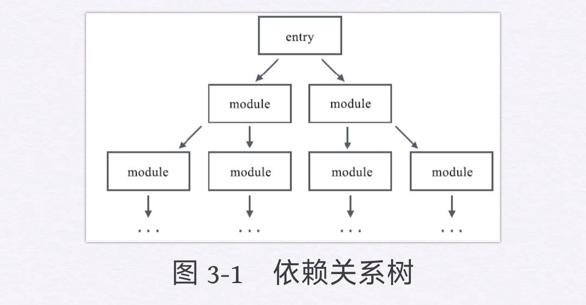
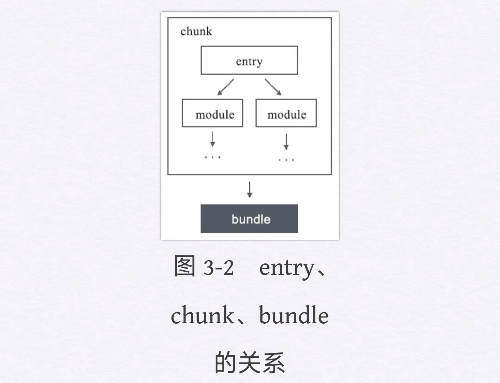
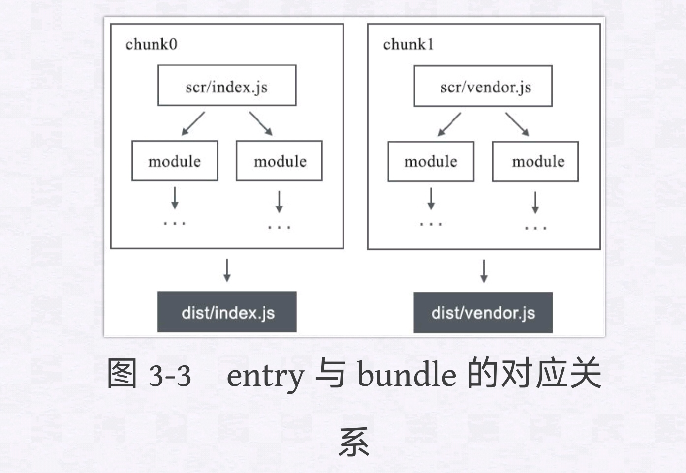
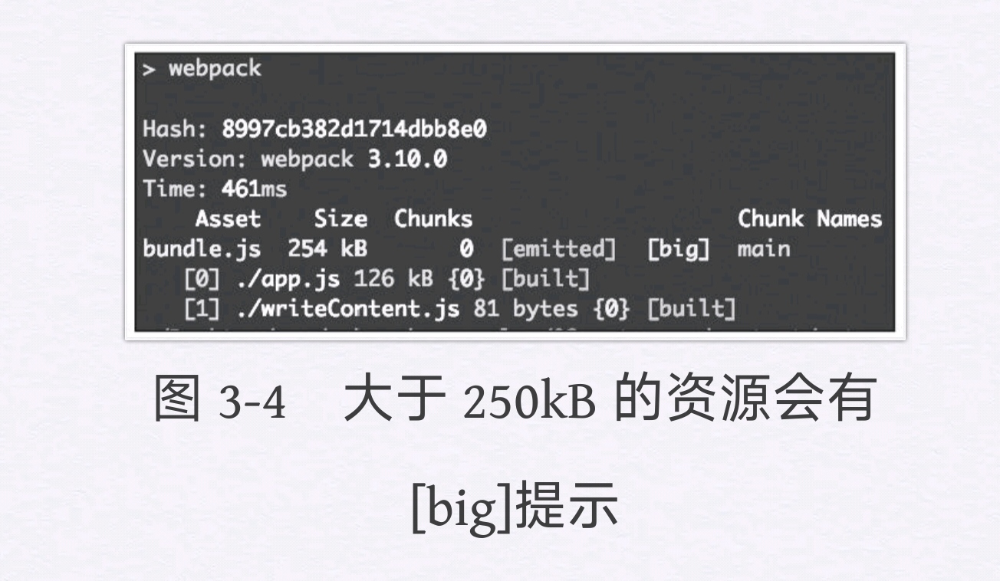
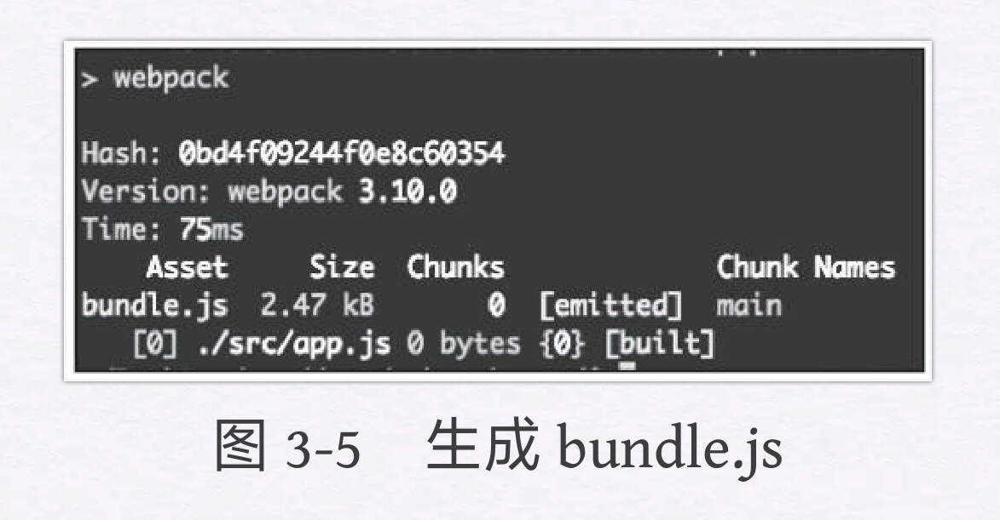
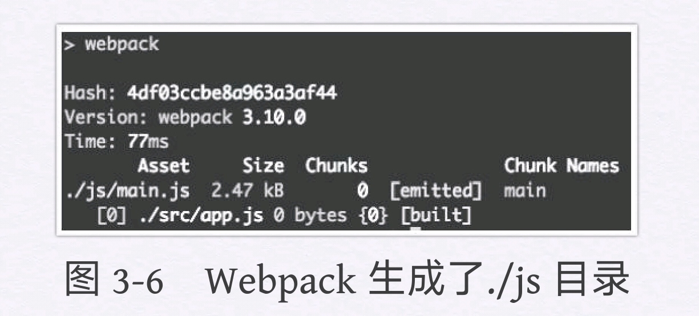
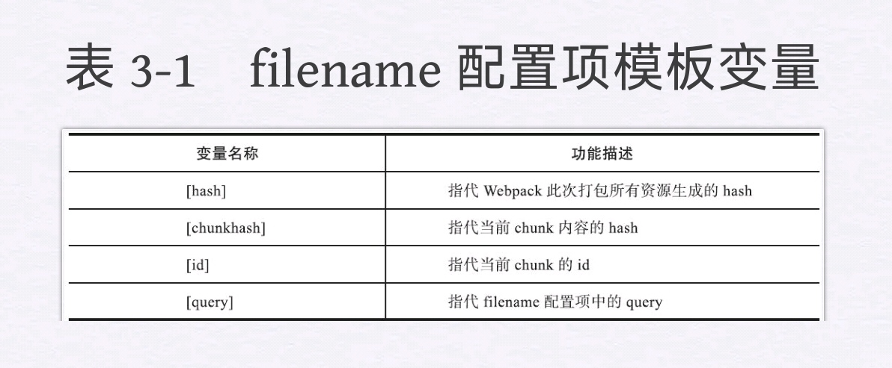
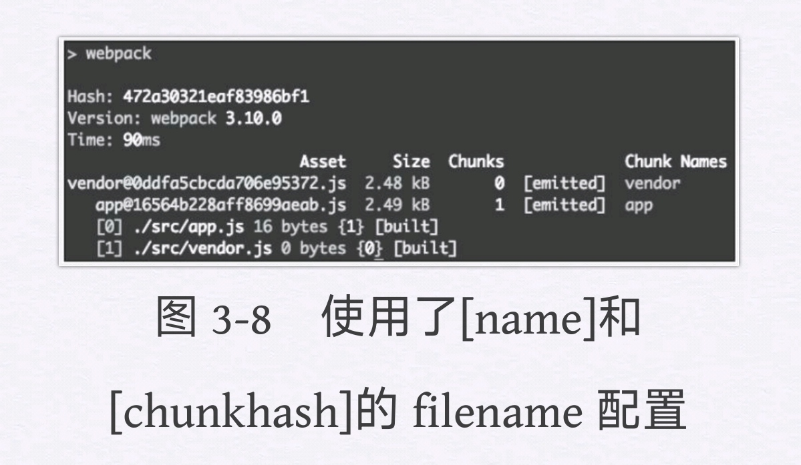

# 一、`Webpack`简介

`Webpack`是一个开源的`JavaScript`模块打包工具，其最核心的功能就是解决模块之前的依赖，把各个模块按照特定的规则和顺序组织在一起，最终合并为一个`JS`文件（有时会有多个）。这个过程就叫模块打包。

## 何为模块

开发中，每时每刻都在与模块打交道。比如，在工程中引入一个日期处理的`npm`包，或者编写一个提供工具方法的`JS`文件，这些都可以称为模块。

在设计程序结构时，把所有代码都堆到一起是非常糟糕的做法。更好的组织方式是按照特定的功能将其拆分为多个代码段，每个代码段实现一个特定的目的。可以对其进行独立的设计、开发和测试，最终通过接口来将它们组合在一起。这就是基本的模块思想。

## JavaScript中的模块

在`ES6`之前，`JavaScript`还并不支持模块化开发。如果工程中有多个`JS`文件，我们只能通过`script`标签将它们一个个插入到页面中。但是这种做法，存在很多缺点，如：

- **需要手动维护`JavaScript`的加载顺序。**页面多个`script`之间通常会有依赖关系，但由于这种依赖关系是隐式的，除了添加注释以外很难清晰地指明谁依赖了谁，这样当页面中加载的文件过多时，就很容易出现问题。
- **每一个`script`标签都意味着要向服务器请求一次静态资源，在`HTTP2`还没出现的时期，建立连接的成本是很高的，过多的请求会严重拖慢网页的渲染速度。**
- **在每个`script`标签中，顶层作用域即全局作用域，如果没有任何处理而直接在代码中进行变量或函数声明，就会造成全局作用域的污染。**

而模块化则解决了上述的所有问题：

* **通过导入和导出语句，我们可以清晰地看到模块间的依赖关系。**
* **模块可以借助工具来进行打包，在页面中只需要加载合并后的资源文件，减少了网络开销。**
* **多个模块之间的作用域是隔离的，彼此不会有命名冲突。**

从2009年开始，`JavaScript`社区开始对模块化进行不断的尝试，并依次出现了`AMD、CommonJS、CMD`等解决方案，但这些都只是社区提出的，并不能算语言本身的特性。而在2015年，`ECMAScript6.0（ES6）`正式定义了`JavaScript`模块标准，使得这门语言拥有了模块这一概念。

## 模块打包工具

模块打包工具（`module bundler`）的任务就是解决模块间的依赖，使其打包后的结果能运行在浏览器上。它的工作方式主要分为两种：

* **将存在依赖关系的模块按照特定规则合并为单个`JS`文件，一次全部加载进页面中。**
* **在页面初始时加载一个入口模块，其他模块异步地进行加载。**

目前社区中比较流行的模块打包工具有`Webpack、Parcel、Rollup`等。

## `Webpack`的优势

1. **`Webpack`默认支持多种模块标准**，包括`AMD、CommonJS`，以及最新的`ES6`模块，而其他工具大多只能支持一到两种。这对于一些同时使用多种模块标准的工程非常有用，`Webpack`会帮我们处理好不同类型模块之间的依赖关系。
2. **`Webpack`有完备的代码分割（`code splitting`）解决方案**。从字面意思去理解，它**可以分割打包后的资源，首屏只加载必要的部分，不太重要的功能放到后面动态地加载。**这对于资源体积较大的应用来说尤为重要，可以有效地减小资源体积，提升首页渲染速度。
3. **`Webpack`可以处理各种类型的资源。除了`JavaScript`以外，`Webpack`还可以处理样式、模板，甚至图片等**，而开发者需要做的仅仅是导入它们。比如你可以从`JavaScript`文件导入一个`CSS`或者`PNG`，而这一切最终都可以由第4章讲到的`loader`来处理。
4. **`Webpack`拥有庞大的社区支持。**除了`Webpack`核心库以外，还有无数开发者来为它编写周边插件和工具，绝大多数的需求你都可以直接找到已有解决方案，甚至会有多个解决方案供你挑选。

## `Webpack`安装

`Webpack`对于操作系统没有要求，使用`Windows、Mac、Linux`操作系统均可。**它唯一的依赖就是`Node.js`**。安装好`Node.js`之后，需要使用`Node.js`的包管理器`npm`来安装`Webpack`。**`npm`安装模块的方式有两种：一种是全局安装，一种是本地安装。**对于`Webpack`来说，也有这两种选择。

* 全局安装`Webpack`的好处是`npm`会帮我们绑定一个命令行环境变量，一次安装、处处运行；
* 本地安装则会添加其成为项目中的依赖，只能在项目内部使用。

**建议使用本地安装的方式**，主要有以下两点原因：

* **如果采用全局安装，那么在与他人进行项目协作的时候，由于每个人系统中的`Webpack`版本不同，可能会导致输出结果不一致。**
* 部分依赖于`Webpack`的插件会调用项目中`Webpack`的内部模块，这种情况下仍然需要在项目本地安装`Webpack`，而如果全局和本地都有，则容易造成混淆。

## `webpack-dev-server`

单纯使用`Webpack`以及它的命令行工具来进行开发调试的效率并不高。以往只要编辑项目源文件（`JS、CSS、HTML`等），刷新页面即可看到效果。现在多了一步打包，我们在改完项目源码后要执行`npm run build`更新`bundle.js`，然后才能刷新页面生效。

**`Webpack`社区已经为我们提供了一个便捷的本地开发工具——`webpack-dev-server`。**用以下命令进行安装：

```bash
npm install webpack-dev-server --save-dev
```

**安装指令中的`--save-dev`参数是将`webpack-dev-server`作为工程的`devDependencies`（开发环境依赖）记录在`package.json`中。**这样做是因为`webpack-dev-server`仅仅在本地开发时才会用到，在生产环境中并不需要它，所以放在`devDependencies`中是比较恰当的。**假如工程上线时要进行依赖安装，就可以通过`npm install--production`过滤掉`devDependencies`中的冗余模块，从而加快安装和发布的速度。**为了便捷地启动`webpack-dev-server`，我们在`package.json`中添加一个`dev`指令：

```json
……
  "scripts": {
    "build": "webpack",
    "dev": "webpack-dev-server"
  },
……
```

最后，我们还需要对`webpack-dev-server`进行配置。编辑`webpack.config.js`如下：

```javascript
module.exports = {
    entry: './src/index.js'fsad
    output: {
        filename: './bundle.js',
    },
    mode: 'develpoment',
    devServer: {
        publicPath: '/dist',
    },
};
```

可以看到，我们在配置中添加了一个`devServer`对象，它是专门用来放`webpack-dev-server`配置的。**`webpack-dev-server`可以看作一个服务者，它的主要工作就是接收浏览器的请求，然后将资源返回。当服务启动时，会先让`Webpack`进行模块打包并将资源准备好（在示例中就是`bundle.js`）。当`webpack-dev-server`接收到浏览器的资源请求时，它会首先进行`URL`地址校验。如果该地址是资源服务地址（上面配置的`publicPath`），就会从`Webpack`的打包结果中寻找该资源并返回给浏览器。反之，如果请求地址不属于资源服务地址，则直接读取硬盘中的源文件并将其返回。**

综上可以总结出`webpack-dev-server`的两大职能：

* **令`Webpack`进行模块打包，并处理打包结果的资源请求。**
* **作为普通的Web Server，处理静态资源文件请求。**

> **直接用`Webpack`开发和使用`webpack-dev-server`有一个很大的区别，前者每次都会生成`budnle.js`，而`webpack-dev-server`只是将打包结果放在内存中。并不会写入实际的`bundle.js`，在每次`webpack-dev-server`接收到请求时都只是将内存中的打包结果返回给浏览器。**
>
> 这一点可以通过删除工程中的`dist`目录来验证，你会发现即便`dist`目录不存在，刷新页面后功能仍然是正常的。从开发者的角度来看，这其实是符合情理的。在本地开发阶段我们经常会调整目录结构和文件名，如果每次都写入实际文件最后就会产生一些没用的垃圾文件，还会干扰我们的版本控制，因此`webpack-dev-server`的处理方式显得更加简洁。

**`webpack-dev-server`还有一项很便捷的特性就是live-reloading（自动刷新）。当`webpack-dev-server`发现工程源文件进行了更新操作就会自动刷新浏览器，显示更新后的内容。该特性可以提升我们本地开发的效率。在后面我们还会讲到更先进的`hot-module-replacement`（模块热替换），我们甚至不需要刷新浏览器就能获取更新之后的内容。**

## 小结

1. 介绍了`Webpack`的功能，它可以**处理模块之间的依赖，将它们串联起来合并为单一的`JS`文件。**
2. 在安装`Webpack`时一般选择在项目本地安装的方式，这样可以使团队开发时共用一个版本，并且可以让其他插件直接获取`Webpack`的内部模块。**配置本地开发环境可以借助`npm scripts`来维护命令行脚本，当打包脚本参数过多时，我们需要将其转化为`webpack.config.js`，用文件的方式维护复杂的`Webpack`配置。**
3. **`webpack-dev-server`的作用是启动一个本地服务，可以处理打包资源与静态文件的请求。它的`live-reloading`功能可以监听文件变化，自动刷新页面来提升开发效率。**

# 二、模块打包

## `CommonJS`

`CommonJS`是由`JavaScript`社区于2009年提出的**包含模块、文件、IO、控制台在内的一系列标准**。在`Node.js`的实现中采用了`CommonJS`标准的一部分，并在其基础上进行了一些调整。**我们所说的`CommonJS`模块和`Node.js`中的实现并不完全一样，现在一般谈到`CommonJS`其实是`Node.js`中的版本，而非它的原始定义。**`CommonJS`最初只为服务端而设计，直到有了`Browserify`——一个运行在`Node.js`环境下的模块打包工具，它可以将`CommonJS`模块打包为浏览器可以运行的单个文件。这意味着客户端的代码也可以遵循`CommonJS`标准来编写了。

不仅如此，借助`Node.js`的包管理器，`npm`开发者还可以获取他人的代码库，或者把自己的代码发布上去供他人使用。这种可共享的传播方式使`CommonJS`在前端开发中逐渐流行了起来。

### 模块

`CommonJS`中规定每个文件是一个模块。**将一个`JavaScript`文件直接通过`script`标签插入页面中与封装成`CommonJS`模块最大的不同在于，前者的顶层作用域是全局作用域，在进行变量及函数声明时会污染全局环境；而后者会形成一个属于模块自身的作用域，所有的变量及函数只有自己能访问，对外是不可见的。**请看下面的例子：

```javascript
// calculator.js
var name = 'calculator.js';

// index.js
var name = 'index.js';
require('./calculator.js');
console.log(name); // index.js
```

这里有两个文件，在`index.js`中我们通过`CommonJS`的`require`函数加载`calculator.js`。运行之后控制台结果是`“index.js”`，这说明`calculator.js`中的变量声明并不会影响`index.js`，可见每个模块是拥有各自的作用域的。

### 导出

#### `module.exports`

**导出是一个模块向外暴露自身的唯一方式。**在`CommonJS`中，通过`module.exports`可以导出模块中的内容，如：

```javascript
module.exports = {
    name: 'calculater',
    add: function(a, b) {
        return a + b;
    }
};
```

**`CommonJS`模块内部会有一个`module`对象用于存放当前模块的信息，可以理解成在每个模块的最开始定义了以下对象：**

```javascript
var module = {...};
// 模块自身逻辑
module.exports = {...};
```

#### `exports`

`module.exports`用来指定该模块要对外暴露哪些内容，在上面的代码中我们导出了一个对象，包含`name`和`add`两个属性。为了书写方便，`CommonJS`也支持另一种简化的导出方式—直接使用`exports`。

```javascript
exports.name = 'calculater';
exports.add = function(a, b) {
    return a + b;
};
```

在实现效果上，这段代码和上面的`module.exports`没有任何不同。其内在机制是将`exports`指向了`module.exports`，而`module.exports`在初始化时是一个空对象。我们可以简单地理解为，`CommonJS`在每个模块的首部默认添加了以下代码：

```javascript
var module = {
    exports: {},
};
var exports = module.exports;
```

因此，为`exports.add`赋值相当于在`module.exports`对象上添加了一个属性。

**在使用`exports`时要注意一个问题，即不要直接给`exports`赋值，否则会导致其失效。**如：

```javascript
exports = {
    name: 'calculater'
};
```

上面代码中，**由于对exports进行了赋值操作，使其指向了新的对象，`module.exports`却仍然是原来的空对象，因此`name`属性并不会被导出。**

#### `module.exports与exports`混用

另一个在导出时容易犯的错误是不恰当地把`module.exports与exports`混用。

```javascript
exports.add = function(a, b) {
    return a + b;
};
module.exports = {
    name: 'calculater'
};
```

**上面的代码先通过`exports`导出了`add`属性，然后将`module.exports`重新赋值为另外一个对象。这会导致原本拥有add属性的对象丢失了，最后导出的只有`name`。**

#### 导出语句不代表模块的末尾

另外，要注意**导出语句不代表模块的末尾，在`module.exports`或`exports`后面的代码依旧会照常执行。**比如下面的`console`会在控制台上打出`“end”`：

```javascript
module.exports = {
    name: 'calculater'
};
console.log('end');
```

**在实际使用中，为了提高可读性，不建议采取上面的写法，而是应该将`module.exports及exports`语句放在模块的末尾。**

### 导入

在`CommonJS`中使用`require`进行模块导入。如：

```javascript
// calculator.js
module.exports = {
    add: function(a, b) {return a + b;}
};
// index.js
const calculator = require('./calculator.js');
const sum = calculator.add(2, 3);
console.log(sum); // 5
```

我们在`index.js`中导入了`calculator`模块，并调用了它的`add`函数。

#### 二次导入

当我们`require`一个模块时会有两种情况：

* **`require`的模块是第一次被加载。这时会首先执行该模块，然后导出内容。**
* **`require`的模块曾被加载过。这时该模块的代码不会再次执行，而是直接导出上次执行后得到的结果。**

```javascript
// calculator.js
console.log('running calculator.js');
module.exports = {
    name: 'calculator',
    add: function(a, b) {
        return a + b;
    }
};

// index.js
const add = require('./calculator.js').add;
const sum = add(2, 3);
console.log('sum:', sum);
const moduleName = require('./calculator.js').name;
console.log('end');
```

控制台的输出结果如下：

```
running calculator.js
sum: 5
end
```

**从结果可以看到，尽管我们有两个地方`require`了`calculator.js`，但其内部代码只执行了一遍。**

我们前面提到，**模块会有一个`module`对象用来存放其信息，这个对象中有一个属性`loaded`用于记录该模块是否被加载过。它的值默认为`false`，当模块第一次被加载和执行过后会置为`true`，后面再次加载时检查到`module.loaded`为`true`，则不会再次执行模块代码。**

#### 其他特性

有时我们加载一个模块，不需要获取其导出的内容，只是想要通过执行它而产生某种作用，比如把它的接口挂在全局对象上，此时直接使用`require`即可。

```JavaScript
require('./task.js');
```

另外，`require`函数可以接收表达式，借助这个特性我们可以动态地指定模块加载路径。

```javascript
const moduleNames = ['foo.js', 'bar.js'];
moduleNames.forEach(name => {
    require('./' + name);
});
```

## `ES6 Module`

### 模块

`ES6 Module`也是将每个文件作为一个模块，每个模块拥有自身的作用域，不同的是导入、导出语句。`import和export`也作为保留关键字在`ES6`版本中加入了进来（`CommonJS中的module`并不属于关键字）。

**`ES6 Module`会自动采用严格模式**，这在`ES5（ECMAScript 5.0）`中是一个可选项。以前我们可以通过选择是否在文件开始时加上`“use strict”`来控制严格模式，**在`ES6 Module`中不管开头是否有`“use strict”`，都会采用严格模式。**如果将原本是`CommonJS`的模块或任何未开启严格模式的代码改写为`ES6 Module`要注意这点。

### 导出

在`ES6 Module`中使用`export`命令来导出模块。`export`有两种形式：

* **命名导出**
* **默认导出**

#### 命名导出

一个模块可以有多个命名导出。它有两种不同的写法：

```javascript
// 写法1
export const name = 'calculator';
export const add = function(a, b) { return a + b; };

// 写法2
const name = 'calculator';
const add = function(a, b) { return a + b; };
export { name, add };
```

**第1种写法是将变量的声明和导出写在一行；第2种则是先进行变量声明，然后再用同一个export语句导出。**两种写法的效果是一样的。**在使用命名导出时，可以通过`as`关键字对变量重命名。**如：

```javascript
const name = 'calculator';
const add = function(a, b) { return a + b; };
export { name, add as getSum }; // 在导入时即为 name 和 getSum
```

#### 默认导出

**与命名导出不同，模块的默认导出只能有一个。**如：

```Javascript
export default {
    name: 'calculator',
    add: function(a, b) {
        return a + b;
    }
};
```

我们**可以将`export default`理解为对外输出了一个名为`default`的变量，因此不需要像命名导出一样进行变量声明，直接导出值即可。**

```javascript
// 导出字符串
export default 'This is calculator.js';
// 导出 class
export default class {...}
// 导出匿名函数
export default function() {...}
```

### 导入

#### 变量导入

`ES6 Module`中使用`import`语法导入模块。首先我们来看如何加载带有命名导出的模块，请看下面的例子：

```javascript
// calculator.js
const name = 'calculator';
const add = function(a, b) { return a + b; };
export { name, add };

// index.js
import { name, add } from './calculator.js';
add(2, 3);
```

加载带有命名导出的模块时，`import`后面要跟一对大括号来将导入的变量名包裹起来，并且**这些变量名需要与导出的变量名完全一致。导入变量的效果相当于在当前作用域下声明了这些变量（`name和add`），并且不可对其进行更改，也就是所有导入的变量都是只读的。**

与命名导出类似，我们可以**通过as关键字可以对导入的变量重命名。**如：

```JavaScript
import { name, add as calculateSum } from './calculator.js';
calculateSum(2, 3);
```

#### 整体导入

在导入多个变量时，我们还可以采用整体导入的方式。如：

```javascript
import * as calculator from './calculator.js';
console.log(calculator.add(2, 3));
console.log(calculator.name);
```

**使用`import*as<myModule>`可以把所有导入的变量作为属性值添加到`<myModule>`对象中，从而减少了对当前作用域的影响。**

#### 默认导入

```javascript
// calculator.js
export default {
    name: 'calculator',
    add: function(a, b) { return a + b; }
};

// index.js
import myCalculator from './calculator.js';
calculator.add(2, 3);
```

对于默认导出来说，`import`后面直接跟变量名，并且这个名字可以自由指定（比如这里是`myCalculator`），它指代了`calculator.js`中默认导出的值。从原理上可以这样去理解：

```javascript
import { default as myCalculator } from './calculator.js';
```

#### 混合导入

```javascript
// index.js
import React, { Component } from 'react';
```

这里的`React`对应的是该模块的默认导出，而`Component`则是其命名导出中的一个变量。

**注意：这里的React必须写在大括号前面，而不能顺序颠倒，否则会提示语法错误。**

### 复合写法

**在工程中，有时需要把某一个模块导入之后立即导出，比如专门用来集合所有页面或组件的入口文件。此时可以采用复合形式的写法：**

```javascript
export { name, add } from './calculator.js';
```

复合写法目前只支持当被导入模块（这里的`calculator.js`）通过命名导出的方式暴露出来的变量，默认导出则没有对应的复合形式，只能将导入和导出拆开写。

```javascript
import calculator from "./calculator.js ";
export default calculator;
```

## `CommonJS与ES6 Module`的区别

### 动态与静态

`CommonJS与ES6 Module`最本质的区别在于前者对模块依赖的解决是“动态的”，而后者是“静态的”。**在这里“动态”的含义是，模块依赖关系的建立发生在代码运行阶段；而“静态”则是模块依赖关系的建立发生在代码编译阶段。**

> **“动态”在模块执行前，没办法确定明确的依赖关系，而“静态”的依赖关系在代码编译阶段就已建立。**

#### `CommonJS`：动态

让我们先看一个`CommonJS`的例子：

```javascript
// calculator.js
module.exports = { name: 'calculator' };
// index.js
const name = require('./calculator.js').name;
```

在上面介绍`CommonJS`的部分时我们提到过，当模块A加载模块B时（在上面的例子中是`index.js`加载`calculator.js`），会执行B中的代码，并将其`module.exports`对象作为`require`函数的返回值进行返回。**并且`require`的模块路径可以动态指定，支持传入一个表达式，我们甚至可以通过if语句判断是否加载某个模块。因此，在`CommonJS`模块被执行前，并没有办法确定明确的依赖关系，模块的导入、导出发生在代码的运行阶段。**

#### `ES6 Module`：静态

同样的例子，让我们再对比看下`ES6 Module`的写法：

```javascript
// calculator.js
export const name = 'calculator';
// index.js
import { name } from './calculator.js';
```

**`ES6 Module`的导入、导出语句都是声明式的，它不支持导入的路径是一个表达式，并且导入、导出语句必须位于模块的顶层作用域（比如不能放在if语句中）。因此我们说，`ES6 Module`是一种静态的模块结构，在`ES6`代码的编译阶段就可以分析出模块的依赖关系。**

##### `ES6 Module`的优势

它相比于`CommonJS`来说具备以下几点优势：

* **死代码检测和排除。我们可以用静态分析工具检测出哪些模块没有被调用过。**比如，在引入工具类库时，工程中往往只用到了其中一部分组件或接口，但有可能会将其代码完整地加载进来。未被调用到的模块代码永远不会被执行，也就成为了死代码。通过静态分析可以在打包时去掉这些未曾使用过的模块，以减小打包资源体积。
* **模块变量类型检查。**JavaScript属于动态类型语言，不会在代码执行前检查类型错误（比如对一个字符串类型的值进行函数调用）。`ES6 Module`的静态模块结构有助于确保模块之间传递的值或接口类型是正确的。
* **编译器优化。在`CommonJS`等动态模块系统中，无论采用哪种方式，本质上导入的都是一个对象，而`ES6 Module`支持直接导入变量，减少了引用层级，程序效率更高。**

### 值拷贝与动态映射

#### `CommonJS`：值拷贝

**在导入一个模块时，对于`CommonJS`来说获取的是一份导出值的拷贝；而在`ES6 Module`中则是值的动态映射，并且这个映射是只读的。**

上面的话直接理解起来可能比较困难，可以通过下面这个例子，了解一下什么是`CommonJS`中的值拷贝。

```javascript
// calculator.js
var count = 0;
module.exports = {
    count: count,
    add: function(a, b) {
        count += 1;
        return a + b;
    }
};

// index.js
var count = require('./calculator.js').count;
var add = require('./calculator.js').add;

console.log(count); // 0（这里的count是对 calculator.js 中 count 值的拷贝）
add(2, 3);
console.log(count); // 0（calculator.js中变量值的改变不会对这里的拷贝值造成影响）

count += 1;
console.log(count); // 1（拷贝的值可以更改）
```

`index.js`中的`count`是对`calculator.js`中`count`的一份值拷贝，**因此在调用`add`函数时，虽然更改了原本`calculator.js`中`count`的值，但是并不会对`index.js`中导入时创建的副本造成影响。**

另一方面，**在`CommonJS`中允许对导入的值进行更改。我们可以在`index.js`更改`count`和`add`，将其赋予新值。同样，由于是值的拷贝，这些操作不会影响`calculator.js`本身。**

#### `ES6 Module`：动态映射

下面我们使用`ES6 Module`将上面的例子进行改写：

```javascript
// calculator.js
let count = 0;
const add = function(a, b) {
    count += 1;
    return a + b;
};
export { count, add };

// index.js
import { count, add } from './calculator.js';

console.log(count); // 0（对 calculator.js 中 count 值的映射）
add(2, 3);
console.log(count); // 1（实时反映calculator.js 中 count值的变化）

// count += 1; // 不可更改，会抛出SyntaxError: "count" is read-only
```

**上面的例子展示了`ES6 Module`中导入的变量其实是对原有值的动态映射。`index.js`中的`count`是对`calculator.js`中的`count`值的实时反映，当我们通过调用`add`函数更改了`calculator.js`中`count`值时，`index.js`中`count`的值也随之变化。**

我们**不可以对`ES6 Module`导入的变量进行更改，可以将这种映射关系理解为一面镜子，从镜子里我们可以实时观察到原有的事物，但是并不可以操纵镜子中的影像。**

### 循环依赖

**循环依赖是指模块A依赖于模块B，同时模块B依赖于模块A。**比如下面这个例子：

```javascript
// a.js
import { foo } from './b.js';
foo();

// b.js
import { bar } from './a.js';
bar();
```

**一般来说工程中应该尽量避免循环依赖的产生，因为从软件设计的角度来说，单向的依赖关系更加清晰，而循环依赖则会带来一定的复杂度。而在实际开发中，循环依赖有时会在我们不经意间产生，因为当工程的复杂度上升到足够规模时，就容易出现隐藏的循环依赖关系。**

简单来说，A和B两个模块之间是否存在直接的循环依赖关系是很容易被发现的。但实际情况往往是A依赖于B，B依赖于C，C依赖于D，最后绕了一大圈，D又依赖于A。当中间模块太多时就很难发现A和B之间存在着隐式的循环依赖。

#### `CommonJS`

因此，如何处理循环依赖是开发者必须要面对的问题。我们首先看一下在`CommonJS`中循环依赖的例子。

```javascript
// foo.js
const bar = require('./bar.js');
console.log('value of bar:', bar);
module.exports = 'This is foo.js';

// bar.js
const foo = require('./foo.js');
console.log('value of foo:', foo);
module.exports = 'This is bar.js';

// index.js
require('./foo.js');
```

在这里，`index.js`是执行入口，它加载了`foo.js，foo.js和bar.js`之间存在循环依赖。让我们观察`foo.js和bar.js`中的代码，理想状态下我们希望二者都能导入正确的值，并在控制台上输出。

```javascript
value of foo: This is foo.js
value of bar: This is bar.js
```

而当我们运行上面的代码时，实际输出却是：

```javascript
value of foo: {}
value of bar: This is bar.js
```

为什么`foo`的值会是一个空对象呢？让我们从头梳理一下代码的实际执行顺序。

1. `index.js`导入了`foo.js`，此时开始执行`foo.js`中的代码。
2. `foo.js`的第1句导入了`bar.js`，这时`foo.js`不会继续向下执行，而是进入了`bar.js`内部。
3. **在`bar.js`中又对`foo.js`进行了`require`，这里产生了循环依赖。需要注意的是，执行权并不会再交回`foo.js`，而是直接取其导出值，也就是`module.exports`。但由于`foo.js`未执行完毕，导出值在这时为默认的空对象，因此当`bar.js`执行到打印语句时，我们看到控制台中的`value of foo`就是一个空对象。**
4. `bar.js`执行完毕，将执行权交回`foo.js`。
5. `foo.js`从`require`语句继续向下执行，在控制台打印出`value of bar`（这个值是正确的），整个流程结束。

由上面可以看出，尽管循环依赖的模块均被执行了，但模块导入的值并不是我们想要的。**因此在`CommonJS`中，若遇到循环依赖我们没有办法得到预想中的结果。**
我们再从`Webpack`的实现角度来看，将上面例子打包后，`bundle`中有这样一段代码非常重要：

```javascript
// The require function
function __webpack_require__(moduleId) {
  if(installedModules[moduleId]) {
    return installedModules[moduleId].exports;
  }
  // Create a new module (and put it into the cache)
  var module = installedModules[moduleId] = {
    i: moduleId,
    l: false,
    exports: {}
  };
  ...
}
```

**当`index.js`引用了`foo.js`之后，相当于执行了这个`__webpack_require__`函数，初始化了一个`module`对象并放入`installedModules`中。当`bar.js`再次引用`foo.js`时，又执行了该函数，但这次是直接从`installedModules`里面取值，此时它的`module.exports`是一个空对象。这就解释了上面在第3步看到的现象。**

#### `ES6 Module`

接下来让我们使用`ES6 Module`的方式重写上面的例子。

```javascript
// foo.js
import bar from './bar.js';
console.log('value of bar:', bar);
export default 'This is foo.js';

// bar.js
import foo from './foo.js';
console.log('value of foo:', foo);
export default 'This is bar.js';

// index.js
import foo from './foo.js';

执行结果如下：
value of foo: undefined
value of bar: This is bar.js
```

很遗憾，**在`bar.js`中同样无法得到`foo.js`正确的导出值，只不过和`CommonJS`默认导出一个空对象不同，这里获取到的是`undefined`。**

上面我们谈到，在导入一个模块时，`CommonJS`获取到的是值的拷贝，`ES6 Module`则是动态映射，那么我们能否利用`ES6 Module`的特性使其支持循环依赖呢？请看下面这个例子：

```javascript
//index.js
import foo from './foo.js';
foo('index.js');

// foo.js
import bar from './bar.js';
function foo(invoker) {
    console.log(invoker + ' invokes foo.js');
    bar('foo.js');
}
export default foo;

// bar.js
import foo from './foo.js';
let invoked = false;
function bar(invoker) {
    if(!invoked) {
        invoked = true;
        console.log(invoker + ' invokes bar.js');
        foo('bar.js');
    }
}
export default bar;
```

上面代码的执行结果如下：

```javascript
index.js invokes foo.js
foo.js invokes bar.js
bar.js invokes foo.js
```

可以看到，`foo.js和bar.js`这一对循环依赖的模块均获取到了正确的导出值。下面让我们分析一下代码的执行过程。

1. `index.js`作为入口导入了`foo.js`，此时开始执行`foo.js`中的代码。
2. 从`foo.js`导入了`bar.js`，执行权交给`bar.js`。
3. 在`bar.js`中一直执行到其结束，完成`bar`函数的定义。注意，此时由于`foo.js`还没执行完，`foo`的值现在仍然是`undefined`。
4. **执行权回到`foo.js`继续执行直到其结束，完成`foo`函数的定义。由于`ES6 Module`动态映射的特性，此时在`bar.js`中`foo`的值已经从`undefined`成为了我们定义的函数，这是与`CommonJS`在解决循环依赖时的本质区别，`CommonJS`中导入的是值的拷贝，不会随着被夹在模块中原有值的变化而变化。**
5. 执行权回到`index.js`并调用`foo`函数，此时会依次执行`foo→bar→foo`，并在控制台打出正确的值。

由上面的例子可以看出，`ES6 Module`的特性使其可以更好地支持循环依赖，只是需要由开发者来保证当导入的值被使用时已经设置好正确的导出值。

## 加载`npm`模块

如何从我们的本地工程安装和加载一个外部的`npm`模块呢？首先我们需要初始化一个`npm`工程，并通过`npm`来获取模块。下面以`lodash`这个库为例：

```bash
# 项目初始化
npm init –y
# 安装 lodash
npm install lodash
```

执行了上面的命令之后，`npm`会将`lodash`安装在工程的`node_modules`目录下，并将对该模块的依赖信息记录在`package.json`中。在使用时，加载一个`npm`模块的方式很简单，只需要引入包的名字即可。

```javascript
// index.js
import _ from 'lodash';
```

**当`Webpack`在打包时解析到这条语句，就会自动去`node_modules`中寻找名为`lodash`的模块了，而不需要我们写出从源文件`index.js`到`node_modules`中`lodash`的路径。**现在我们知道，在导入一个`npm`模块时，只要写明它的名字就可以了。那么在实际打包的过程中具体加载的是`npm`模块中哪个`JS`文件呢？

**每一个`npm`模块都有一个入口。当我们加载一个模块时，实际上就是加载该模块的入口文件。这个入口被维护在模块内部`package.json`文件的`main`字段中。**

比如对于前面的`lodash`模块来说，它的`package.json`内容如下：

```javascript
// ./node_modules/underscore/package.json
{
  "name": "lodash",
  ……
  "main": "lodash.js"
}
```

**当加载该模块时，实际上加载的是`node_modules/lodash/lodash.js`。**

**除了直接加载模块以外，我们也可以通过`<package_name>/<path>`的形式单独加载模块内部的某个`JS`文件。**如：

```javascript
import all from 'lodash/fp/all.js';
console.log('all', all);
```

这样，`Webpack`最终只会打包`node_modules/lodash/fp/all.js`这个文件，而不会打包全部的`lodash`库，通过这种方式可以减小打包资源的体积。

## 非模块化文件

非模块化文件指的是并不遵循任何一种模块标准的文件。如果你维护的是一个几年前的项目，那么极有可能里面会有非模块化文件，最常见的就是在`script`标签中引入的`jQuery`及其各种插件。

如何使用`Webpack`打包这类文件呢？其实只要直接引入即可，如：

```javascript
import './jquery.min.js';
```

这句代码会直接执行`jquery.min.js`，**一般来说`jQuery`这类库都是将其接口绑定在全局，因此无论是从`script`标签引入，还是使用`Webpack`打包的方式引入，其最终效果是一样的。**

**但假如我们引入的非模块化文件是以隐式全局变量声明的方式暴露其接口的，则会发生问题。**如：

```JavaScript
// 通过在顶层作用域声明变量的方式暴露接口
var calculator = {
    // ...
}
```

由于`Webpack`在打包时会为每一个文件包装一层函数作用域来避免全局污染，上面的代码将无法把calculator对象挂在全局，因此这种以隐式全局变量声明需要格外注意。

## `AMD`

`AMD`是英文`Asynchronous Module Definition`（异步模块定义）的缩写，它是由`JavaScript`社区提出的专注于支持浏览器端模块化的标准。从名字就可以看出它与`CommonJS和ES6 Module`最大的区别在于**它加载模块的方式是异步的。**

下面的例子展示了如何定义一个`AMD`模块。

```javascript
define('getSum', ['calculator'], function(math) {
    return function(a, b) {
        console.log('sum: ' + calculator.add(a, b));
    }
});
```

在`AMD`中使用`define`函数来定义模块，它可以接受3个参数。第1个参数是当前模块的`id`，相当于模块名；第2个参数是当前模块的依赖，比如上面我们定义的`getSum`模块需要引入`calculator`模块作为依赖；第3个参数用来描述模块的导出值，可以是函数或对象。如果是函数则导出的是函数的返回值；如果是对象则直接导出对象本身。

和`CommonJS`，`AMD`也使用`require`函数来加载模块，只不过采用异步的形式。

```javascript
require(['getSum'], function(getSum) {
    getSum(2, 3);
});
```

`require`的第1个参数指定了加载的模块，第2个参数是当加载完成后执行的回调函数。

**通过`AMD`这种形式定义模块的好处在于其模块加载是非阻塞性的，当执行到`require`函数时并不会停下来去执行被加载的模块，而是继续执行`require`后面的代码，这使得模块加载操作并不会阻塞浏览器。**

**尽管`AMD`的设计理念很好，但与同步加载的模块标准相比其语法要更加冗长。另外其异步加载的方式并不如同步显得清晰，并且容易造成回调地狱（`callback hell`）。在目前的实际应用中已经用得越来越少，大多数开发者还是会选择`CommonJS或ES6 Module`的形式。**

## `UMD`

我们已经介绍了很多的模块形式，`CommonJS、ES6 Module、AMD`及非模块化文件，在很多时候工程中会用到其中两种形式甚至更多。有时对于一个库或者框架的开发者来说，如果面向的使用群体足够庞大，就需要考虑支持各种模块形式。

严格来说，`UMD`并不能说是一种模块标准，不如说它是一组模块形式的集合更准确。`UMD`的全称是`Universal Module Definition`，也就是通用模块标准，它的目标是使一个模块能运行在各种环境下，不论是`CommonJS、AMD`，还是非模块化的环境（当时`ES6 Module`还未被提出）

请看下面的例子：

```javascript
// calculator.js
(function (global, main) {
    // 根据当前环境采取不同的导出方式
    if (typeof define === 'function' && define.amd) {
        // AMD
        define(...);
    } else if (typeof exports === 'object') {
        // CommonJS
        module.exports = ...;
    } else {
        // 非模块化环境
        global.add = ...;
    }
}(this, function () {
    // 定义模块主体
    return {...}
}));
```

**可以看出，`UMD`其实就是根据当前全局对象中的值判断目前处于哪种模块环境。当前环境是`AM`D，就以`AMD`的形式导出；当前环境是`CommonJS`，就以`CommonJS`的形式导出。**

需要注意的问题是，`UMD`模块一般都最先判断`AMD`环境，也就是全局下是否有`define`函数，而通过`AMD`定义的模块是无法使用`CommonJS`或`ES6 Module`的形式正确引入的。在`Webpack`中，由于它同时支持`AMD及CommonJS`，也许工程中的所有模块都是`CommonJS`，而`UMD`标准却发现当前有`AMD`环境，并使用了`AMD`方式导出，这会使得模块导入时出错。当需要这样做时，我们可以更改`UMD`模块中判断的顺序，使其以`CommonJS`的形式导出即可

## 模块打包原理

面对工程中成百上千个模块，`Webpack`究竟是如何将它们有序地组织在一起，并按照我们预想的顺序运行在浏览器上的呢？下面我们将从原理上进行探究。

还是使用前面`calculator`的例子。

```javascript
// index.js
const calculator = require('./calculator.js');
const sum = calculator.add(2, 3);
console.log('sum', sum);

// calculator.js
module.exports = {
    add: function(a, b) {
        return a + b;
    }
};
```

上面的代码经过`Webpack`打包后将会成为如下的形式（为了易读性这里只展示代码的大体结构）：

```JavaScript
// 立即执行匿名函数
(function(modules) {
    //模块缓存
    var installedModules = {};
    // 实现require
    function __webpack_require__(moduleId) {
        ...
    }
    // 执行入口模块的加载
    return __webpack_require__(__webpack_require__.s = 0);
})({
    // modules：以key-value的形式储存所有被打包的模块
    0: function(module, exports, __webpack_require__) {
        // 打包入口
        module.exports = __webpack_require__("3qiv");
    },
    "3qiv": function(module, exports, __webpack_require__) {
        // index.js内容
    },
    jkzz: function(module, exports) {
        // calculator.js 内容
    }
});
```

这是一个最简单的`Webpack`打包结果（`bundle`），但已经可以清晰地展示出它是如何将具有依赖关系的模块串联在一起的。上面的`bundle`分为以下几个部分：

1. **最外层立即执行匿名函数。它用来包裹整个bundle，并构成自身的作用域。**
2. **`installedModules`对象。每个模块只在第一次被加载的时候执行，之后其导出值就被存储到这个对象里面，当再次被加载的时候直接从这里取值，而不会重新执行。**
3. **`__webpack_require__`函数。对模块加载的实现，在浏览器中可以通过调用`__webpack_require__(module_id)`来完成模块导入。**
4. **`modules`对象。工程中所有产生了依赖关系的模块都会以`key-value`的形式放在这里。`key`可以理解为一个模块的`id`，由数字或者一个很短的`hash`字符串构成；`value`则是由一个匿名函数包裹的模块实体，匿名函数的参数则赋予了每个模块导出和导入的能力。**

接下来让我们看看一个bundle是如何在浏览器中执行的。

1. **在最外层的匿名函数中会初始化浏览器执行环境**，包括定义`installedModules`对象、`__webpack_require__`函数等，为模块的加载和执行做一些准备工作。
2. **加载入口模块**。每个`bundle`都有且只有一个入口模块，在上面的示例中，`index.js`是入口模块，在浏览器中会从它开始执行。
3. **执行模块代码。**如果执行到了`module.exports`则记录下模块的导出值；如果中间遇到`require`函数（准确地说是`__webpack_require__`），则会暂时交出执行权，进入`__webpack_require__`函数体内进行加载其他模块的逻辑。
4. **在`__webpack_require__`中会判断即将加载的模块是否存在于`installedModules`中。如果存在则直接取值，否则回到第3步，执行该模块的代码来获取导出值。**
5. **所有依赖的模块都已执行完毕，最后执行权又回到入口模块。当入口模块的代码执行到结尾，也就意味着整个`bundle`运行结束。**

不难看出，**第3步和第4步是一个递归的过程。`Webpack`为每个模块创造了一个可以导出和导入模块的环境，但本质上并没有修改代码的执行逻辑，因此代码执行的顺序与模块加载的顺序是完全一致的，这就是`Webpack`模块打包的奥秘。**

## 小结

**`CommonJS`和`ES6 Module`是目前使用较为广泛的模块标准。它们的主要区别在于前者建立模块依赖关系是在运行时，后者是在编译时；在模块导入方面，`CommonJS`导入的是值拷贝，`ES6 Module`导入的是只读的变量映射；`ES6 Module`通过其静态特性可以进行编译过程中的优化，并且具备处理循环依赖的能力。**

# 三、资源输入输出

## 资源处理流程

**在`Webpack`中，资源处理流程的最开始，我们需要指定一个或多个入口（`entry`），也就是告诉`Webpack`具体从源码目录下的哪个文件开始打包。如果把工程中各个模块的依赖关系当作一棵树，那么入口就是这棵依赖树的根，如图3-1所示。**

**这些存在依赖关系的模块会在打包时被封装为一个`chunk`。**

> **`chunk`字面的意思是代码块，在`Webpack`中可以理解成被抽象和包装过后的一些模块。它就像一个装着很多文件的文件袋，里面的文件就是各个模块，`Webpack`在外面加了一层包裹，从而形成了`chunk`。根据具体配置不同，一个工程打包时可能会产生一个或多个`chunk`。**



从上面我们已经了解到，**`Webpack`会从入口文件开始检索，并将具有依赖关系的模块生成一棵依赖树，最终得到一个`chunk`。由这个`chunk`得到的打包产物我们一般称之为`bundle`。**`entry、chunk、bundle`的关系如图3-2所示。



**在工程中可以定义多个入口，每一个入口都会产生一个结果资源。**比如我们工程中有两个入口`src/index.js和src/lib.js`，在一般情形下会打包生成`dist/index.js和dist/lib.js`，因此可以说，`entry与bundle`存在着对应关系，如图3-3所示。



> 在一些特殊情况下，一个入口也可能产生多个`chunk`并最终生成多个`bundle`。

## 配置资源入口

`Webpack`通过`context和entry`这两个配置项来共同决定入口文件的路径。在配置入口时，实际上做了两件事：

1. **确定入口模块位置，告诉`Webpack`从哪里开始进行打包。**
2. **定义`chunk name`。**如果工程只有一个入口，那么默认其`chunk name为“main”`；如果工程有多个入口，我们需要为每个入口定义`chunk name`，来作为该`chunk`的唯一标识。

### `context`

**`context`可以理解为资源入口的路径前缀，在配置时要求必须使用绝对路径的形式。**请看下面两个例子：

```javascript
// 以下两种配置达到的效果相同，入口都为 <工程根路径>/src/scripts/index.js
module.exports = {
    context: path.join(__dirname, './src'),
    entry: './scripts/index.js',
};
module.exports = {
    context: path.join(__dirname, './src/scripts'),
    entry: './index.js',
};
```

**配置`context`的主要目的是让`entry`的编写更加简洁，尤其是在多入口的情况下。`context`可以省略，默认值为当前工程的根目录。**

### `entry`

与`context`只能为字符串不同，**`entry`的配置可以有多种形式：字符串、数组、对象、函数。**可以根据不同的需求场景来选择。

1. 字符串类型入口

  直接传入文件路径：

  ```JavaScript
  module.exports = {
   entry: './src/index.js',
   output: {
       filename: 'bundle.js',
   },
   mode: 'development',
  };
  ```

2. 数组类型入口

  **传入一个数组的作用是将多个资源预先合并，在打包时`Webpack`会将数组中的最后一个元素作为实际的入口路径。**如：

  ```JavaScript
  module.exports = {
      entry: ['babel-polyfill', './src/index.js'] ,
  };
  ```

  上面的配置等同于：

  ```javascript
  // webpack.config.js
  module.exports = {
      entry: './src/index.js',
  };
  
  // index.js
  import 'babel-polyfill';
  ```

3. 对象类型入口

  **如果想要定义多入口，则必须使用对象的形式。对象的属性名（key）是chunk name，属性值（value）是入口路径。**如：

  ```javascript
  module.exports = {
      entry: {
          // chunk name为index，入口路径为./src/index.js
          index: './src/index.js',
          // chunk name为lib，入口路径为./src/lib.js
          lib: './src/lib.js',
      },
  };
  ```

  对象的属性值也可以为字符串或数组。如：

  ```javascript
  module.exports = {
      entry: {
          index: ['babel-polyfill', './src/index.js'],
          lib: './src/lib.js',
      },
  };
  ```

  在使用字符串或数组定义单入口时，并没有办法更改`chunk name`，只能为默认的`“main”`。**在使用对象来定义多入口时，则必须为每一个入口定义`chunk name`。**

4. 函数类型入口

  **用函数定义入口时，只要返回上面介绍的任何配置形式即可**，如：

  ```javascript
  // 返回一个字符串型的入口
  module.exports = {
      entry: () => './src/index.js',
  };
  
  // 返回一个对象型的入口
  module.exports = {
      entry: () => ({
          index: ['babel-polyfill', './src/index.js'],
          lib: './src/lib.js',
      }),
  };
  ```

  **传入一个函数的优点在于我们可以在函数体里添加一些动态的逻辑来获取工程的入口。**另外，函数也支持返回一个`Promise`对象来进行异步操作。

  ```javascript
  module.exports = {
      entry: () => new Promise((resolve) => {
          // 模拟异步操作
          setTimeout(() => {
              resolve('./src/index.js');
          }, 1000);
      }),
  };
  ```

### 实例

#### 单页面应用

对于单页应用（`SPA`）来说，一般定义单一入口即可。

```javascript
module.exports = {
    entry: './src/app.js',
};
```

**无论是框架、库，还是各个页面的模块，都由`app.js`单一的入口进行引用。这样做的好处是只会产生一个`JS`文件，依赖关系清晰。而这种做法也有弊端，即所有模块都打包到一起，当应用的规模上升到一定程度之后会导致产生的资源体积过大，降低用户的页面渲染速度。**在`Webpack`默认配置中，当一个bundle大于`250kB`时（压缩前）会认为这个`bundle`已经过大了，在打包时会发生警告，如图3-4所示。



#### 提取`vendor`

试想一下，**假如工程只产生一个`JS`文件并且它的体积很大，一旦产生代码更新，即便只有一点点改动，用户都要重新下载整个资源文件，这对于页面的性能是非常不友好的。**

为了解决这个问题，我们可以使用提取`vendor`的方法。`vendor`的意思是“供应商”，**在`Webpack`中`vendor`一般指的是工程所使用的库、框架等第三方模块集中打包而产生的`bundle`。**请看下面这个例子：

```javascript
module.exports = {
    context: path.join(__dirname, './src'),
    entry: {
        app: './src/app.js',
        vendor: ['react', 'react-dom', 'react-router'],
    },
};
```

在上面的配置中，`app.js`仍然和最开始一样，其内容也不需要做任何改变。只是我们**添加了一个新的`chunk name`为`vendor`的入口，并通过数组的形式把工程所依赖的第三方模块放了进去。**那么问题来了，我们并没有为`vendor`设置入口路径，`Webpack`要如何打包呢？这时我们可以使用`CommonsChunkPlugin`（在`Webpack` 4之后`CommonsChunkPlugin`已被废弃，可以采用`optimization.splitChunks`，具体参考第6章内容），将`app`与`vendor`这两个`chunk`中的公共模块提取出来。通过这样的配置，**`app.js`产生的`bundle`将只包含业务模块，其依赖的第三方模块将会被抽取出来生成一个新的`bundle`**，这也就达到了我们提取`vendor`的目标。**由于`vendor`仅仅包含第三方模块，这部分不会经常变动，因此可以有效地利用客户端缓存，在用户后续请求页面时会加快整体的渲染速度。**

#### 多页应用

**对于多页应用的场景，为了尽可能减小资源的体积，我们希望每个页面都只加载各自必要的逻辑，而不是将所有页面打包到同一个`bundle`中。**因此每个页面都需要有一个独立的`bundle`，这种情形我们使用多入口来实现。请看下面的例子：

```javascript
module.exports = {
    entry: {
        pageA: './src/pageA.js',
        pageB: './src/pageB.js',
        pageC: './src/pageC.js',
    },
};
```

在上面的配置中，入口与页面是一一对应的关系，这样每个`HTML`只要引入各自的`JS`就可以加载其所需要的模块。

另外，对于多页应用的场景，我们同样可以使用提取vendor的方法，将各个页面之间的公共模块进行打包。如：

```javascript
module.exports = {
    entry: {
        pageA: './src/pageA.js',
        pageB: './src/pageB.js',
        pageC: './src/pageC.js',
        vendor: ['react', 'react-dom'] ,
    },
};
```

可以看到，我们**将`react和react-dom`打包进了`vendor`，之后再配置`optimization.splitChunks`，将它们从各个页面中提取出来，生成单独的`bundle`即可。**

## 配置资源出口

接着我们来看资源输出相关的配置，所有与出口相关的配置都集中在`output`对象里。请看下面的例子：

```javascript
const path = require('path');
module.exports = {
    entry: './src/app.js',
    output: {
        filename: 'bundle.js',
        path: path.join(__dirname, 'assets'),
        publicPath: '/dist/',
    },
};
```

output对象里可以包含数十个配置项，其中的大多数在日常开发中使用频率都不高，我们这里只介绍几个常用的，基本上可以覆盖大多数场景。

### `filename`

顾名思义，**`filename`的作用是控制输出资源的文件名，其形式为字符串**，如：

```javascript
module.exports = {
    entry: './src/app.js',
    output: {
        filename: 'bundle.js',
    },
};
```

使用上面的配置打包的结果如图3-5所示。



**`filename`可以不仅仅是`bundle`的名字，还可以是一个相对路径，即便路径中的目录不存在也没关系，`Webpack`会在输出资源时创建该目录。**请看下面的例子：

```javascript
module.exports = {
    entry: './src/app.js',
    output: {
        filename: './js/bundle.js',
    },
```

打包结果如图3-6所示。



#### 动态生成文件名

在多入口的场景中，我们需要为对应产生的每个`bundle`指定不同的名字，`Webpack`**支持使用一种类似模板语言的形式动态地生成文件名**，如：

```javascript
module.exports = {
    entry: {
        app: './src/app.js',
        vendor: './src/vendor.js',
    },
    output: {
        filename: '[name].js',
    },
};
```

**在资源输出时，上面配置的`filename`中的[`name`]会被替换为`chunk name`**，因此最后项目中实际生成的资源是`vendor.js与app.js`，如图3-7所示。


除了`[name]`可以指代`chunk name`以外，还有其他几种模板变量可以用于`filename`的配置中，如表3-1所示。



上述变量一般有如下两种作用：

* **当有多个`chunk`存在时对不同的`chunk`进行区分。如`[name]、[chunkhash]和[id]`，它们对于每个`chunk`来说都是不同的。**
* **控制客户端缓存**。**表中的`[hash]`和`[chunkhash]`都与`chunk`内容直接相关，在`filename`中使用了这些变量后，当`chunk`的内容改变时，可以同时引起资源文件名的更改，从而使用户在下一次请求资源文件时会立即下载新的版本而不会使用本地缓存。**[query]也可以起到类似的效果，只不过它与chunk内容无关，要由开发者手动指定。

**在实际工程中，我们使用比较多的是`[name]`，它与`chunk`是一一对应的关系，并且可读性较高。如果要控制客户端缓存，最好还要加上`[chunkhash]`，因为每个`chunk`所产生的`[chunkhash]`只与自身内容有关，单个`chunk`内容的改变不会影响其他资源，可以最精确地让客户端缓存得到更新。**

让我们看以下的例子：

```javascript
module.exports = {
    entry: {
        app: './src/app.js',
        vendor: './src/vendor.js',
    },
    output: {
        filename: '[name]@[chunkhash].js',
    },
};
```

打包结果如图3-8所示。



**注意：更新缓存一般只用在生产环境的配置下，在开发环境中可以不必配置`[chunkhash]`，详见第7章介绍分离配置文件的部分。**

### `path`

**`path`可以指定资源输出的位置，要求值必须为绝对路径。**如：

```javascript
const path = require('path');
module.exports = {
    entry: './src/app.js',
    output: {
        filename: 'bundle.js',
        path: path.join(__dirname, 'dist') ,
    },
};
```

上述配置将资源输出位置设置为工程的`dist`目录。**在`Webpack 4`之后，`output.path`已经默认为`dist`目录，除非我们需要更改它，否则不必单独配置。**

### `publicPath`

`publicPath`是一个非常重要的配置项，并且容易与`path`相混淆。从功能上来说，**`path`用来指定资源的输出位置，而`publicPath`则用来指定资源的请求位置。**让我们详细解释这两个定义。

* **输出位置：打包完成后资源产生的目录，一般将其指定为工程中的`dist`目录。**
* 请求位置：由`JS`或`CSS`所请求的间接资源路径。页面中的资源分为两种，一种是由`HTML`页面直接请求的，比如通过`script`标签加载的`JS`；**另一种是由`JS或CSS`请求的，如异步加载的`JS、从CSS`请求的图片字体等。`publicPath`的作用就是指定这部分间接资源的请求位置。**

`publicPath`有3种形式：

1. `HTML`相关

   与HTML相关，也就是说我们可以将`publicPath`指定为HTML的相对路径，在请求这些资源时会**以当前页面`HTML`所在路径加上相对路径，构成实际请求的`URL`。**如：

   ```javascript
   // 假设当前HTML地址为 https://example.com/app/index.html
   // 异步加载的资源名为 0.chunk.js
   publicPath: "" // 实际路径https://example.com/app/0.chunk.js
   publicPath: "./js" // 实际路径https://example.com/app/js/0.chunk.js
   publicPath: "../assets/" // 实际路径https://example.com/aseets/0.chunk.js
   ```

   > **注意　这里不需要过多关注如何异步加载`JS`，后面章节会进行详细介绍。**

2. `Host`相关

   **若`publicPath`的值以“/”开始**，则代表此时`publicPath`是**以当前页面的`host name`为基础路径的。**如：

   ```javascript
   // 假设当前HTML地址为 https://example.com/app/index.html
   // 异步加载的资源名为 0.chunk.js
   publicPath: "/" // 实际路径https://example.com/0.chunk.js
   publicPath: "/js/" // 实际路径https://example.com/js/0.chunk.js
   publicPath: "/dist/" // 实际路径
   ```

3. `CDN`相关

   上面两种配置都是相对路径，我们也可以使用绝对路径的形式配置`publicPath`。这种情况一般发生于静态资源放在`CDN`上面时，由于其域名与当前页面域名不一致，需要以绝对路径的形式进行指定。**当`publicPath`以协议头或相对协议的形式开始时，代表当前路径是`CDN`相关。**如：

   ```javascript
   // 假设当前页面路径为 https://example.com/app/index.html
   // 异步加载的资源名为 0.chunk.js
   publicPath: "http://cdn.com/" // 实际路径http://cdn.com/0.chunk.js
   publicPath: "https://cdn.com/" // 实际路径https://cdn.com/0.chunk.js
   publicPath: "//cdn.com/assets/" 实际路径 //cdn.com/assets/0.chunk.js
   ```

#### `webpack-dev-server`中的`publicPath`

**`webpack-dev-server`的配置中也有一个`publicPath`**，值得注意的是，这个`publicPath与Webpack`中的配置项含义不同，**它的作用是指定`webpack-dev-server`的静态资源服务路径。**请看下面的例子：

```javascript
const path = require('path');
module.exports = {
    entry: './src/app.js',
    output: {
        filename: 'bundle.js',
        path: path.join(__dirname, 'dist'),
    },
    devServer: {
        publicPath: '/assets/',
        port: 3000,
    },
};
```

从上面可以看到，`Webpack`配置中`output.path`为`dist`目录，因此`bundle.js`应该生成在`dist`目录。但是当我们启动`webpack-dev-server`的服务后，访问`localhost：3000/dist/bundle.js`时却会得到404。这是因为`devServer.publicPath`配置项将资源位置指向了`localhost：3000/assets/`，因此只有访问`localhost：3000/assets/bundle.js`才能得到我们想要的结果。

**为了避免开发环境和生产环境产生不一致而造成开发者的疑惑，我们可以将`webpack-dev-server`的`publicPath与Webpack中的output.path`保持一致，这样在任何环境下资源输出的目录都是相同的。**

请看下面的例子：

```javascript
const path = require('path');
module.exports = {
    entry: './src/app.js',
    output: {
        filename: 'bundle.js',
        path: path.join(__dirname, 'dist') ,
    },
    devServer: {
        publicPath: '/dist/',
        port: 3000,
    },
};
```

上面的配置可以保证访问`localhost：3000/dist/bundle.js`时得到预期的结果。

### 实例

#### 单入口


对于单入口的场景来说，通常不必设置动态的`output.filename`，直接指定输出的文件名即可。下面是一个简单的例子：

```JavaScript
const path = require('path');
module.exports = {
 entry: './src/app.js',
 output: {
     filename: 'bundle.js',
 },
 devServer: {
     publicPath: '/dist/',
 },
};
```

上面是通常情况下的配置。工程的源码目录为`src`，资源的输出目录为`dist`（`Webpack 4`以后已经默认）。此时我们还不需要配置`output.publicPath`，但是对于`webpack-dev-server`来说需要为其指定资源的服务路径，因此我们设置了`devServer.publicPath`为`/dist/`。

#### 多入口

在多入口的场景下，必然会需要模板变量来配置`filename`。请看下面的例子：

```javascript
const path = require('path');
module.exports = {
    entry: {
        pageA: './src/pageA.js',
        pageB: './src/pageB.js',
    },
    output: {
        filename: '[name].js',
    },
    devServer: {
        publicPath: '/dist/',
    },
};
```

我们通过`output.filename`中`[name]`变量指代`chunk name`，使最最终生成的资源为`pageA.js和pageB.js`。如果是生产环境下的配置，还可以把`[name].js`改为`[name]@[chunkhash].js`。

## 小结

**介绍了资源的输入输出流程，以及相关的配置项`context、entry、output`。**

1. **在配置打包入口时，`context`相当于路径前缀，`entry`是入口文件路径。单入口的`chunk name`不可更改，多入口的话则必须为每一个`chunk`指定`chunk name`。**
2. **当第三方依赖较多时，我们可以用提取`vendor`的方法将这些模块打包到一个单独的`bundle`中，以更有效地利用客户端缓存，加快页面渲染速度。**
3. **`path和publicPath`的区别在于`path`指定的是资源的输出位置，而`publicPath`指定的是间接资源的请求位置。**