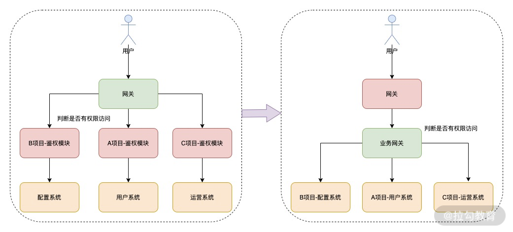

# 一、`Node.js` 在前端工程化和后端服务应用的区别

工程化最重要的就是 `Webpack` 工具，而` Webpack `核心是基于` Node.js `来运行的，当然还有其他场景比如说` SSR` 的实现以及前端的一些工具化场景。这些应用最终目标都是为了提升前端研发效率或者保证研发质量，其实并没有真正地应用到 `Node.js `核心特点，而后端服务应用才是真正地应用 `Node.js `异步事件驱动的特性

**两者之间的区别:**


## 1.1 运行环境

- **工程化的大部分情况都是基于当前开发环境，运行在本地开发机器上，可以快速地判断定位、分析、解决问题。**
- **而后端服务应用一般运行在远程服务器上，需要利用一些工具来分析判断或者监控其运行情况。**

**环境上的差异会引发的不同点：**

* 首先需要应用工具将服务发布到远程机器上，这里就涉及`devops` 工具；
* 需要保证远程服务的安全与稳定，这就涉及一些进程管理工具，例如常见的 `PM2`；
* 需要判断远程服务运行是否正常，这就涉及远程服务的监控和告警机制；
* 遇到运行问题时，需要通过远程日志来定位分析问题，这就涉及日志打印和跟踪染色。

## 1.2 受众群体

* 前端工程化一般都是服务于开发者，比如我自己在本地应用 `Webpack` 打包或者将 `ES6、ES7 `转为 `ES5` 语法等，都是基于开发者工具，而这部分用户则是我们开发者自己。

* 而后端服务应用则服务于真实的用户群体，为用户提供各种交互体验方面的数据处理等。

**受众群体的差异会引发的不同点：**

* **工程化侧重于为开发者提升研发效率或者研发质量。**

* **后端服务应用则必须关注服务的稳定与安全。**因为都是基于用户发送的内容，用户有时候发送一些非法或者违法的内容。其次需要关注并发性能，因此必须充分考量服务器所能承载的最大用户并发数，在并发即将达到阈值时，又需要考量平行扩容方案。还有就是为了用户体验，需要充分做好服务的性能优化，做到极致的接口响应时间。

## 1.3 问题调试

* 因为前端工程化在本地运行，你可以随意地 `console.log` 打印日志进行调试，因为这些影响的也只是个人，或者说即使变成通用的工具，打印一些 `console.log` 也对工具的影响不大。

* 但是在后端服务应用时，你就需要考虑一些方法来进行问题调试和定位策略了。

你需要在每个业务场景中，思考在哪里进行一些关键逻辑或者数据打印日志信息，这里就需要 `Node.js` 日志服务模块，而这类日志服务又不能影响性能，因此**需要考虑一些高性能日志打印工具。其次在服务端运行，你可能会遇到诸如内存泄漏、句柄泄漏或者进程异常退出等问题，因此这里就需要这类工具和方法来分析定位现网问题**。

## 1.4 关注点

前端工程化的应用着重于开发效率的提升和研发质量的保证，后端服务应用则是真正发挥出了 `Node.js` 的异步驱动特性。因为异步驱动特性，在主线程不被` CPU `密集型所影响时，可以真正发挥出 `Node.js `高并发特性，可以作为大部分网络 `I/O` 较高的后端服务。

# 二、事件循环：高性能到底是如何做到的？

`Node.js` 事件循环原理和浏览器的原理是不同的，`Node.js 10+` 版本后虽然在运行结果上与浏览器一致，但是两者在原理上一个是基于浏览器，一个是基于` libuv `库。浏览器核心的是宏任务和微任务，而在` Node.js` 还有阶段性任务执行阶段。

## 2.1 `Node.js` 循环原理

 `Node.js` 官网的事件循环原理的核心流程如下图1所示。


可以看到，这一流程包含 6 个阶段，每个阶段代表的含义如下所示。

1. `timers`：本阶段执行已经被 `setTimeout() `和 `setInterval() `调度的回调函数，简单理解就是由这两个函数启动的回调函数。

2. `pending callbacks`：本阶段执行某些系统操作（如 `TCP` 错误类型）的回调函数。

3. `idle、prepare`：仅系统内部使用，你只需要知道有这 2 个阶段就可以。

4. `poll`：检索新的` I/O `事件，执行与` I/O` 相关的回调，其他情况 `Node.js` 将在适当的时候在此阻塞。这也是最复杂的一个阶段，所有的事件循环以及回调处理都在这个阶段执行，接下来会详细分析这个过程。

5. `check：setImmediate()` 回调函数在这里执行，`setImmediate` 并不是立马执行，而是当事件循环 `poll` 中没有新的事件处理时就执行该部分，如下代码所示：

   ```javascript
   const fs = require('fs');
   setTimeout(() => { // 新的事件循环的起点
       console.log('1'); 
   }, 0);
   setImmediate( () => {
       console.log('setImmediate 1');
   });
   /// 将会在 poll 阶段执行
   fs.readFile('./test.conf', {encoding: 'utf-8'}, (err, data) => {
       if (err) throw err;
       console.log('read file success');
   });
   /// 该部分将会在首次事件循环中执行
   Promise.resolve().then(()=>{
       console.log('poll callback');
   });
   // 首次事件循环执行
   console.log('2');
   
   // 2
   // poll callback
   // 1
   // setImmediate 1
   // read file success
   ```

   在这一代码中有一个非常奇特的地方，就是 `setImmediate` 会在 `setTimeout` 之后输出。有以下几点原因：

   - **`setTimeout `如果不设置时间或者设置时间为 0，则会默认为 `1ms`；**

   - **主流程执行完成后，超过 `1ms` 时，会将` setTimeout` 回调函数逻辑插入到待执行回调函数poll 队列中；**

   - **由于当前 `poll` 队列中存在可执行回调函数，因此需要先执行完，待完全执行完成后，才会执行`check：setImmediate`。**

   因此这也验证了这句话，先执行回调函数，再执行 `setImmediate`。

6. `close callbacks`：执行一些关闭的回调函数，如 `socket.on('close', ...)`。

## 2.2 `Node.js` 事件循环

> **微任务或者宏任务的回调函数依然是由主线程执行**

在上面的核心流程中真正需要关注循环执行的就是 `poll` 这个过程。**在 poll 过程中，主要处理的是异步 I/O 的回调函数，以及其他几乎所有的回调函数，异步 I/O 又分为网络 I/O 和文件 I/O。**这是我们常见的代码逻辑部分的异步回调逻辑。

事件循环的主要包含微任务和宏任务。具体是怎么进行循环的呢？如图 2 所示。


在解释上图之前，我们先来解释下两个概念，微任务和宏任务。

### 微任务

在 `Node.js` 中微任务包含 2 种——`process.nextTick` 和 `Promise`。微任务在事件循环中优先级是最高的，因此在同一个事件循环中有其他任务存在时，优先执行微任务队列。并且`process.nextTick` 和 `Promise`也存在优先级，`process.nextTick `高于 `Promise`。

### 宏任务

在 `Node.js` 中宏任务包含 4 种——`setTimeout、setInterval、setImmediate` 和 `I/O`。宏任务在微任务执行之后执行，因此在同一个事件循环周期内，如果既存在微任务队列又存在宏任务队列，那么优先将微任务队列清空，再执行宏任务队列。

### 主线程

在图 2 的左侧，我们可以看到有一个核心的主线程，它的执行阶段主要处理三个核心逻辑。

* **同步代码。**

* **将异步任务插入到微任务队列或者宏任务队列中。**

* **执行微任务或者宏任务的回调函数。**在主线程处理回调函数的同时，也需要判断是否插入微任务和宏任务。根据优先级，先判断微任务队列是否存在任务，存在则先执行微任务，不存在则判断在宏任务队列是否有任务，有则执行。

### 示例

**示例1**

如果微任务和宏任务都只有一层时，那么看起来是比较简单的，比如下面的例子：

```javascript
const fs = require('fs');
// 首次事件循环执行
console.log('start');
/// 将会在新的事件循环中的阶段执行
fs.readFile('./test.conf', {encoding: 'utf-8'}, (err, data) => {
    if (err) throw err;
    console.log('read file success');
});
setTimeout(() => { // 新的事件循环的起点
    console.log('setTimeout'); 
}, 0);
/// 该部分将会在首次事件循环中执行
Promise.resolve().then(()=>{
    console.log('Promise callback');
});
/// 执行 process.nextTick
process.nextTick(() => {
    console.log('nextTick callback');
});
// 首次事件循环执行
console.log('end');

// start
// end
// nextTick callback
// Promise callback
// setTimeout
// read file success
```

根据上面介绍的执行过程，我们来分析下上面代码的执行过程：

1. 第一个事件循环主线程发起，因此先执行同步代码，所以先输出 `start`，然后输出 `end`；
2. 再从上往下分析，遇到微任务，插入微任务队列，遇到宏任务，插入宏任务队列，分析完成后，微任务队列包含：`Promise.resolve 和 process.nextTick`，宏任务队列包含：`fs.readFile 和 setTimeout`；
3. 先执行微任务队列，但是根据优先级，先执行` process.nextTick` 再执行 `Promise.resolve`，所以先输出` nextTick callback` 再输出 `Promise callback`；
4. 再执行宏任务队列，根据宏任务插入先后顺序执行 `setTimeout 再执行 fs.readFile`，这里需要注意，先执行 `setTimeout` 由于其回调时间较短，因此回调也先执行，并非是 `setTimeout `先执行所以才先执行回调函数，但是它执行需要时间肯定大于 `1ms`，所以虽然 `fs.readFile `先于 `setTimeout` 执行，但是` setTimeout `执行更快，所以先输出 `setTimeout `，最后输出 `read file success`。

**示例2**

当微任务和宏任务又产生新的微任务和宏任务时，又应该如何处理呢？如下代码所示：

```javascript
const fs = require('fs');
setTimeout(() => { // 新的事件循环的起点
    console.log('1'); 
    fs.readFile('./config/test.conf', {encoding: 'utf-8'}, (err, data) => {
        if (err) throw err;
        console.log('read file sync success');
    });
}, 0);
/// 回调将会在新的事件循环之前
fs.readFile('./config/test.conf', {encoding: 'utf-8'}, (err, data) => {
    if (err) throw err;
    console.log('read file success');
});
/// 该部分将会在首次事件循环中执行
Promise.resolve().then(()=>{
    console.log('poll callback');
});
// 首次事件循环执行
console.log('2');

// 2
// poll callback
// 1
// read file success
// read file sync success
```

在上面代码中，有 2 个宏任务和 1 个微任务，宏任务是 `setTimeout` 和 `fs.readFile`，微任务是 `Promise.resolve`。

1. 整个过程优先执行主线程的第一个事件循环过程，所以先执行同步逻辑，先输出 2。
2. 接下来执行微任务，输出 `poll callback`。
3. 再执行宏任务中的` fs.readFile 和 setTimeout`，由于 `fs.readFile` 优先级高，先执行` fs.readFile`。但是处理时间长于 `1ms`，因此会先执行 `setTimeout` 的回调函数，输出 1。这个阶段在执行过程中又会产生新的宏任务 `fs.readFile`，因此又将该 `fs.readFile` 插入宏任务队列。
4. 最后由于只剩下宏任务了 `fs.readFile`，因此执行该宏任务，并等待处理完成后的回调，输出` read file sync success`。

## 2.3 实践分析

### `CPU` 密集型的业务

`Node.js` 不善于处理 `CPU` 密集型的业务，就会导致性能问题，如果要实现一个耗时 `CPU `的计算逻辑，处理方法有 2 种：

* 直接在主业务流程中处理；

* 通过网络异步 I/O 给其他进程处理。

#### 主流程执行

为了效果，我们把两部分计算分开，这样能更好地形成对比，没有异步驱动计算的话，只能同步的去执行两个函数 `startCount` 和 `nextCount`，然后将两部分计算结果相加。

```javascript
const http = require('http');
/**
 * 
 * 创建 http 服务，简单返回
 */
const server = http.createServer((req, res) => {
    res.write(`${startCount() + nextCount()}`);
    res.end();
});
/**
 * 从 0 计算到 500000000 的和
 */
function startCount() {
    let sum = 0;
    for(let i=0; i<500000000; i++){
        sum = sum + i;
    }
    return sum;
}
/**
 * 从 500000000 计算到 1000000000 之间的和
 */
function nextCount() {
    let sum = 0;
    for(let i=500000000; i<1000000000; i++){
        sum = sum + i;
    }
    return sum;
}
/**
 * 
 * 启动服务
 */
server.listen(4000, () => {
    console.log('server start http://127.0.0.1:4000');
});
```

接下来使用下面命令启动该服务：

```bash
node sync.js
```

启动成功后，再在另外一个命令行窗口执行如下命令，查看响应时间，运行命令如下：

```bash
time curl http://127.0.0.1:4000
```

运行完成以后可以看到如下的结果：

```
499999999075959400
real    0m1.100s
user    0m0.004s
sys     0m0.005s
```

启动第一行是计算结果，第二行是执行时长。经过多次运行，其结果基本相近，都在 `1.1s `左右。接下来我们利用 `Node.js `异步事件循环的方式来优化这部分计算方式。

#### 异步网络 `I/O`

异步网络` I/O` 对比主流程执行，优化的思想是将上面的两个计算函数` startCount 和 nextCount` 分别交给其他两个进程来处理，然后主进程应用异步网络` I/O` 的方式来调用执行。

我们先看下主流程逻辑，如下代码所示：

```javascript
const http = require('http');
const rp = require('request-promise');
/**
 * 
 * 创建 http 服务，简单返回
 */
const server = http.createServer((req, res) => {
    Promise.all([startCount(), nextCount()]).then((values) => {
        let sum = values.reduce(function(prev, curr, idx, arr){
            return parseInt(prev) + parseInt(curr);
        })
        res.write(`${sum}`);
        res.end(); 
    })
});
/**
 * 从 0 计算到 500000000 的和
 */
async function startCount() {
    return await rp.get('http://127.0.0.1:5000');
}
/**
 * 从 500000000 计算到 1000000000 之间的和
 */
async function nextCount() {
    return await rp.get('http://127.0.0.1:6000');
}
/**
 * 
 * 启动服务
 */
server.listen(4000, () => {
    console.log('server start http://127.0.0.1:4000');
});
```

代码中使用到了 `Promise.all` 来异步执行两个函数` startCount 和 nextCount`，待 2 个异步执行结果返回后再计算求和。其中两个函数 `startCount` 和 `nextCount` 中的 `rp.get` 地址分别是：

```
http://127.0.0.1:5000
http://127.0.0.1:6000
```

其实是两个新的进程分别计算两个求和的逻辑，具体以 5000 端口的逻辑为例看下，代码如下：

```javascript
const http = require('http');
/**
 * 
 * 创建 http 服务，简单返回
 */
const server = http.createServer((req, res) => {
    let sum = 0;
    for(let i=0; i<500000000; i++){
        sum = sum + i;
    }
    res.write(`${sum}`);
    res.end();
});
/**
 * 
 * 启动服务
 */
server.listen(5000, () => {
    console.log('server start http://127.0.0.1:5000');
});
```

接下来我们分别打开三个命令行窗口，使用以下命令分别启动三个服务：

```bash
node startServer.js
node nextServer.js 
node async.js
```

启动成功后，再运行如下命令，查看执行时间：

```bash
time curl http://127.0.0.1:4000
```

运行成功后，你可以看到如下结果：

```
499999999075959400
real    0m0.575s
user    0m0.004s
sys     0m0.005s
```

结果还是一致的，但是运行时间缩减了一半，大大地提升了执行效率。

#### 响应分析

两个服务的执行时间相差一半，因为异步网络` I/O `充分利用了 `Node.js` 的异步事件驱动能力，将耗时 `CPU `计算逻辑给到其他进程来处理，而无须等待耗时 `CPU` 计算，可以直接处理其他请求或者其他部分逻辑。第一种同步执行的方式就无法去处理其逻辑，导致性能受到影响。

## 2.4 问题

### 1、谁来启动这个循环过程

从图 1 中我们可以看出事件循环的起点是 `timers`，如下代码所示：

```javascript
setTimeout(() => {
    console.log('1');
}, 0);
console.log('2')
```

在代码 `setTimeout` 中的回调函数就是新一轮事件循环的起点，看到这里有很多同学会提出非常合理的疑问：“为什么会先输出 2 然后输出 1，不是说 `timer` 的回调函数是运行起点吗？”

**这里有一个非常关键点，当 `Node.js` 启动后，会初始化事件循环，处理已提供的输入脚本，它可能会先调用一些异步的 `API`、调度定时器，或者 `process.nextTick()`，然后再开始处理事件循环。因此可以这样理解，`Node.js` 进程启动后，就发起了一个新的事件循环，也就是事件循环的起点。**

总结来说，`Node.js `事件循环的发起点有 4 个：

* `Node.js` 启动后；

* `setTimeout` 回调函数；

* `setInterval` 回调函数；

* 也可能是一次 `I/O` 后的回调函数。

### 2、谁来执行回调函数

>在 `Node.js` 中由于主线程是单线程的，无论是主线程逻辑，还是回调处理逻辑，最终都是在主线程处理

**微任务或者宏任务的回调函数依然是由主线程执行**

### 3、主线程是否会被阻塞

在上面的例子中，我们来思考一个问题，主线程是否会被阻塞，具体我们来看一个代码例子：

```
const fs = require('fs');
setTimeout(() => { // 新的事件循环的起点
    console.log('1'); 
    sleep(10000)
    console.log('sleep 10s');
}, 0);
/// 将会在 poll 阶段执行
fs.readFile('./test.conf', {encoding: 'utf-8'}, (err, data) => {
    if (err) throw err;
    console.log('read file success');
});
console.log('2');
/// 函数实现，参数 n 单位 毫秒 ；
function sleep ( n ) { 
    var start = new Date().getTime() ;
    while ( true ) {
        if ( new Date().getTime() - start > n ) {
            // 使用  break  实现；
            break;
        }
    }
}
```

我们在 `setTimeout` 中增加了一个阻塞逻辑，这个阻塞逻辑的现象是，只有等待当次事件循环结束后，才会执行 `fs.readFile` 回调函数。这里会发现 `fs.readFile` 其实已经处理完了，并且通知回调到了主线程，但是由于主线程在处理回调时被阻塞了，导致无法处理 `fs.readFile `的回调。因此可以得出一个结论，主线程会因为回调函数的执行而被阻塞，这也符合图 2 中的执行流程图。

如果把上面代码中 `setTimeout` 的时间修改为 10 ms，你将会优先看到 `fs.readFile` 的回调函数，因为` fs.readFile` 执行完成了，并且还未启动下一个事件循环，修改的代码如下：

```javascript
setTimeout(() => { // 新的事件循环的起点
    console.log('1'); 
    sleep(10000)
    console.log('sleep 10s');
}, 10);
```

### 4、无限循环有没有终点

当所有的微任务和宏任务都清空的时候，虽然当前没有任务可执行了，但是也并不能代表循环结束了。因为可能存在当前还未回调的异步 `I/O`，所以这个循环是没有终点的，只要进程在，并且有新的任务存在，就会去执行。

### 5、循环的任务是否存在优先级概念

微任务优先于宏任务。但是微任务中`process.nextTick `高于 `Promise`，宏任务中`IO `和 `timers`严格意义上没有优先级概念，但是`IO `和 `timers`肯定优先于 `setImmediate`。

### 6、什么进程或者线程来执行这个循环

主要还是主线程来循环遍历当前事件

### 7、`Node.js` 是单线程的还是多线程的

主线程是单线程执行的，但是` Node.js` 存在多线程执行，多线程包括 `setTimeout` 和异步` I/O `事件。其实` Node.js` 还存在其他的线程，包括垃圾回收、内存优化等。

### 8、在运行时，`Nodejs`有线程数量限制吗

`setTimeout` 没有遇到过限制。但是 `I/O` 是会的，和系统有关因为 `I/O` 是会占用句柄的，假设文件句柄超出限制，那么肯定是无法启动新的线程来处理的。有些 `I/O `是网络的，那么和系统的网络模块也是相关，有些是文件 `I/O` 那跟文件 `I/O `限制相关。但是这些都是来自于系统，而不是 `Node.js` 。

### 9、`Node`与浏览器的 `Event Loop` 差异

#### `Node10`及其之前版本:

* `Node.JS` 事件循环有6个阶段，而浏览器事件循环没有
* 浏览器中没有`process.nextTick()和I/O`
* **`Node.js`在执行相应每一个阶段 `macro-task` 中的所有宏任务之后，才开始执行`micro-task`中的微任务。**

#### `Node11`及其以后版本：

* `Node.JS` 事件循环有6个阶段，而浏览器事件循环没有
* 浏览器中没有`process.nextTick()和I/O`
* **在 `Node11` 里面都修改为一旦执行一个阶段里的一个宏任务就立刻执行清空微任务队列，和浏览器端运行一致。**

# 三、`Node.js` 作为后台可以提供哪些服务？

## 3.1 服务分类

我们常听说的服务有 `RESTful` 和 `RPC`，但这都是架构设计规范。我们也可以从另外一个角度来分析后台服务，如图 1 所示。


以上分类并不能代表所有的服务，但是各个系统都或多或少包含这些服务。有些大型系统可能会比这复杂；有些小型系统可能没有这么多模块系统。

下面我们看下每个模块主要的工作是什么：

* 网关，处理请求转发和一些通用的逻辑，例如我们常见的 `Nginx`；

* 业务网关，处理业务相关的逻辑，比如一些通用的协议转化、通用的鉴权处理，以及其他统一的业务安全处理等；

* 运营系统，负责我们日常的运营活动或者运营系统；

* 业务系统，负责我们核心的业务功能的系统；

* 中台服务，负责一些通用 `App` 类的服务，比如配置下发、消息系统及用户反馈系统等；

* 各类基础层，这些就是比较单一的核心后台服务，例如用户模块，这就需要根据不同业务设计不同的核心底层服务；

* 左侧的数据缓存和数据存储，则是相应的数据类的服务。

在这些分层中，我们**需要寻找网络` I/O` 较多，但是` CPU `计算较少、业务复杂度高的服务**，基于这点我们可以分析出 **`Node.js` 应用在业务网关、中台服务及运营系统**几个方面。接下来我们就分别**从系统的业务场景及系统特性**来分析为什么 `Node.js` 更合适。

## 3.2 适用场景

### 业务网关

我们都了解 `Nginx `作为负载均衡转发层，负责负载分发，那么业务网关又是什么呢？

可以这样考虑，**比如我们后台管理系统有鉴权模块，以往都是在管理后台服务中增加一个鉴权的类，然后在统一路由处增加鉴权判断。而现在不仅仅是这个管理系统需要使用这个鉴权类，多个管理系统都需要这个鉴权类**，这时你会考虑复制这个类到其他项目，又或者设计一个专门的服务来做鉴权，图 2 是一个转变的过程效果图。



**从上图我们可以看到，其实每个项目的鉴权都是相似的，没有必要在每个项目中维护一份通用的鉴权服务。因此可以提炼一层叫作业务网关，专门处理业务相关的通用逻辑，包括鉴权模块。**

接下来我们就从一个实际的例子 `OPEN API `的业务网关来介绍下这类服务场景。

#### 业务场景

`OPEN API` 一般会有一个统一的` token `鉴权，通过 `token` 鉴权后还需要判断第三方的 `appid` 是否有接口权限，其次判断接口是否到达了请求频率上限。为了服务安全，我们也可以做一些降级处理，在服务过载时，可以根据优先级抛弃一些请求，具体可以查看图 3。


接下来我们从技术层面来看为什么 `Node.js` 更适合此类应用场景。

#### 服务特性

根据图 2 的场景应用，我们专注看下 `Nginx` 后面的业务网关处理层，它的业务场景如图 4 所示。


这 3 个功能都是**基于缓存来处理业务逻辑的，大部分都是网络 `I/O` ，并未涉及 `CPU` 密集型逻辑**，这也是` Node.js` 的优势，其次异步驱动的方案能够处理更高的并发。`Node.js `的代码核心是不阻塞主线程处理，而这类业务网关都是轻` CPU `运算服务。因此在这类场景的技术选型中，可以考虑使用 `Node.js` 作为服务端语言。

### 中台服务

**在 `Web `或者 `App `应用中都存在一些通用服务，以往都是独立接口、独立开发。随着公司应用越来越多，需要将一些通用的业务服务进行集中，这也是中台的概念。**而这部分业务场景往往也是**网络 I/O 高、并发较大、业务关联性高、数据库读写压力相对较小**。下面我们就来分析下这种业务场景。

#### 业务场景

为了避免资源浪费、人力浪费，我们可以使用如图 5 所示的中台服务系统：


* 前端配置系统是在服务端根据客户端的版本、设备、地区和语言，下发不同的配置（`JSON`或者文件包）；

* 反馈系统，即用户可以在任何平台，调用反馈接口，并将反馈内容写入队列，并落地到系统中进行综合分析；

* 推送系统用于管理消息的推送、用户红点和消息数的拉取，以及消息列表的管理；

* 系统工具用于处理用户端日志捞取、用户端信息调试上报、性能定位问题分析提取等。

以上是多个中台系统的业务说明，我们再来具体看看每个系统的特性，从特性来分析为什么 `Node.js `适合作为服务端语言。

#### 服务特性

在中台系统的设计中，系统着重关注：**网络` I/O`、并发、通用性及业务复杂度，一般情况下不涉及复杂的 CPU 运算**。这里我们以上面列举的系统来做分析，如表 1 所示。


在上述系统对比中，可以分析出` Node.js` 作为中台服务，要求是：

* 通用性必须好；

* 低 `CPU `计算；

* 网络 `I/O` 高或者低都行；

* 并发高或者低都行。

因为这样的服务在 `Node.js` 主线程中，可以快速处理各类业务场景，不会存在阻塞的情况，因此这类场景也适合使用 `Node.js` 作为服务端语言。

### 运营系统

在各类互联网项目中，经常用运营活动来做项目推广，而这类运营系统往往逻辑复杂，同时需要根据业务场景进行多次迭代、不断优化。往往这些活动并发很高，但是可以不涉及底层数据库的读写，而更多的是缓存数据的处理。比如我们常见的一些投票活动、排行榜活动等，如图 6 所示。


## 3.3 不适合场景

之前介绍了事件循环原理，在原理中突出的是不能阻塞主线程，而一些密集型 `CPU `运算的服务则非常不适合使用` Node.js` 来处理。比如：

* 图片处理，比如图片的裁剪、图片的缩放，这些非常损耗 `CPU` 计算，应该用其他进程来处理；

* 大字符串、大数组类处理，当涉及这些数据时，应该考虑如何通过切割来处理，或者在其他进程异步处理；

* 大文件读写处理，有时会使用 `Node.js `服务来处理 `Excel`，但是遇到 `Excel `过大时，会导致` Node.js `内存溢出，因为 `V8 `内存上限是 `1.4 G`。

可能还有更多场景，这里只是列举了很小的一部分，总之两个关键因素：**大内存和`CPU `密集**，这样的场景都不适合使用 `Node.js` 来提供服务。

# 四、如何构建一个简单的 `RESTful` 服务？

## 4.1 基础技术点

* 什么是 `RESTful` 规范；

* 数据库的读写处理过程；

* 目前常用的 `MVC` 架构模式，以及后续本专栏所应用的一套新的、独创的架构模式——`MSVC `架构模式。

### `RESTful`

`RESTful（Representational State Transfer）`是一种架构的约束条件和规则。在倡导前后端分离后，该架构规范的应用愈加广泛。具体知识点，[你可以参考这里进行学习](https://github.com/aisuhua/restful-api-design-references)。

### `MongoDB`

### `MVC`

我们应该都比较熟知 `MVC` 架构，它在前后端分离中起到了非常重要的作用，我们先来看下传统的 `MVC`架构的模式，如图 1 所示。


此模式中：

* `M（Model）`层处理数据库相关的操作（只有数据库操作时）；

* `C（Controller）`层处理业务逻辑；

* `V（View）`层则是页面显示和交互。

### `MSVC`

但是在目前服务划分较细的情况下，`M` 层不仅仅是数据库操作，因此这种架构模式显得有些力不从心，导致开发的数据以及业务逻辑有时候在 `M `层，有时候却在 `C` 层。出现这类情况的核心原因是 `C 与 C `之间无法进行复用，如果需要复用则需要放到` M `层，那么业务逻辑就会冗余在` M`，代码会显得非常繁杂，如图 2 所示。


为了解决以上问题，在经过一些实践后，在研发过程中提出了一套新的架构模式（比如 `Eggjs` 框架中的模式）。这种模式也会应用在本专栏的整个架构体系中，暂且叫作 `MSVC（Model、Service、View、Controller）`。 `MSVC` 的架构模式，如图 3 所示。


将所有数据相关的操作都集中于` M` 层，而 `M `层复用的业务逻辑则转到新的 `S `层，`C` 层则负责核心业务处理，可以调用` M `和 `S `层。以上是相关知识点，接下来我们进行架构的实践设计。

## 4.2 系统实践

要实现的是一个获取用户发帖的列表信息 `API`，该 `API` 列表的内容包含两部分，一部分是从数据库获取的发帖内容，但是这部分只包含用户` ID`，另外一部分则是需要通过` ID `批量拉取用户信息。

我们先来设计 `RESTful API`，由于是拉取列表内容接口，因此这里设计为一个` GET `接口，根据 `RESTful `约束规则设计为：`GET /v1/contents`；另外还需要设计一个独立的服务用来获取用户信息，将接口设计为：`GET /v1/userinfos`。

为了更清晰些，我绘制了一个时序图来表示，如图 4 所示。


在图 4 中详细的过程是：

1. 用户先调用 `/v1/contents API` 拉取 `restful server `的内容；
2. `restful server `会首先去 `MongoDB` 中获取 `contents`；
3. 拿到 `contents` 后解析出其中的 `userIds`；
4. 然后再通过 `/v1/userinfos API `调用 `API server `的服务获取用户信息列表；
5. `API server` 同样需要和 `MongoDB `交互查询到所需要的 `userinfos`；
6. 拿到` userinfos` 后通过 `addUserinfo` 将用户信息整合到 `contents` 中去；
7. 最后将` contents` 返回给到调用方。

在不考虑任何架构模式的情况下，我们来实现一个简单版本的 `restful` 服务，上面分析了需要实现 2 个` server`，这里分别叫作 `API server 和 restful server`。

### 简单版本`RESTful`

> 为什么一个`restful server`，一个`api server`层？
>
> 这里只是一个演示，为了告诉大家获取数据的方式可能有多种，一种是来自数据库，一种是来自其他服务，而这里的`api`层，就是代表其他服务层。

#### `API server`

`server` 包含 2 个部分：解析请求路径和解析请求参数，在 `Node.js `中我们可以用以下代码来解析：

```javascript
/**
 * 
 * 创建 http 服务，简单返回
 */
const server = http.createServer(async (req, res) => {
    // 获取 get 参数
    const pathname = url.parse(req.url).pathname;
    paramStr = url.parse(req.url).query,
    param = querystring.parse(paramStr);
    // 过滤非拉取用户信息请求
    if('/v1/userinfos' != pathname) {
      return setResInfo(res, false, 'path not found');
    }
    // 参数校验，没有包含参数时返回错误
    if(!param || !param['user_ids']) {
      return setResInfo(res, false, 'params error');
    }
});
```

参数和请求路径解析成功后，再进行路径的判断和校验，如果不满足我们当前的要求，调用 `setResInfo` 报错返回相应的数据给到前端。`setResInfo `这个函数实现比较简单，使用 `res` 对象来设置返回的数据，具体你可以前往 [GitHub 源码](https://github.com/love-flutter/nodejs-column)中查看。

路径和参数解析成功后，我们再根据当前参数查询 `MongoDB` 中的 `userinfo` 数据，具体代码如下：

```javascript
const baseMongo = require('./lib/baseMongodb')();
const server = http.createServer(async (req, res) => {
    // ...省略上面部分代码
    // 从 db 查询数据，并获取，有可能返回空数据
    const userInfo = await queryData({'id' : { $in : param['user_ids'].split(',')}});
    return setResInfo(res, true, 'success', userInfo);
});
/**
 * 
 * @description db 数据查询
 * @param object queryOption 
 */
async function queryData(queryOption) {
  const client = await baseMongo.getClient();
  const collection = client.db("nodejs_cloumn").collection("user");
  const queryArr = await collection.find(queryOption).toArray();
  return queryArr;
}
```

#### `restful server`

和 `API server` 相似，前面 2 个过程是解析请求路径和请求参数，解析成功后，根据时序图先从` MongoDB` 中拉取 `10 `条 `content `数据，代码如下：

```javascript
const server = http.createServer(async (req, res) => {
    // 获取 get 参数
    const pathname = url.parse(req.url).pathname;
    paramStr = url.parse(req.url).query,
    param = querystring.parse(paramStr);
    // 过滤非拉取用户信息请求
    if('/v1/contents' != pathname) {
      return setResInfo(res, false, 'path not found', null, '404');
    }
    // 从 db 查询数据，并获取，有可能返回空数据
    let contents = await queryData({}, {limit: 10});

    contents = await filterUserinfo(contents);
    return setResInfo(res, true, 'success', contents);
});
```

运行成功后，我们在浏览器中打开如下地址：

```bash
http://127.0.0.1:5000/v1/userinfos?user_ids=1001,1002
```

你将会看到一个` JSON` 的返回结构，如图 6 所示。


接下来我们请求 `restful server 的 API`，同样使用浏览器打开如下接口地址：

```bash
http://127.0.0.1:4000/v1/contents
```

你将会看到如图 7 所示的响应结果。


以上就实现了一个简单 `restful `服务的功能，你可以看到代码都堆积在` index.js` 中，并且代码逻辑还比较简单，如果稍微复杂一些，这种架构模式根本没法进行团队合作，或者后期维护，因此就需要 `MVC 和 MVCS `架构模式来优化这种场景。

### 进阶实现`MVC`

既然是 `M` 和` C`，我们就先思考下，上面的 `restful server `中哪些是 `M` 层的逻辑，哪些是` C `层的逻辑。


以上是所有的逻辑，根据表格，我们首先创建两个目录分别是 `model 和 Controller`：

* 在 `model` 中创建一个 `content.js` 用来处理 `content model` 逻辑；

* 在 `Controller` 中也创建一个 `content.js` 用来处理 `content 的 Controller` 逻辑。

#### `index.js`

**在源代码中有一个 `index.js `文件，在没有架构模式时，基本上处理了所有的业务，但是根据当前架构模式，如表 1 所示，只适合处理 `url `路径解析、路由判断及转发**，因此需要简化原来的逻辑，和第一部分代码一样，我们就不再列举了，主要看路由判断。首先需要根据 `restful url` 路由配置一份路由转发逻辑，配置如下：

```javascript
const routerMapping = {
    '/v1/contents' : {
        'Controller' : 'content',
        'method' : 'list'
    },
    '/v1/test' : {
        'Controller' : 'content',
        'method' : 'test'
    }
};
```

上面代码的意思是：

* 如果请求路径是` /v1/contents `就转发到 `content.js` 这个 `Controller`，并且调用其 `list` 方法；

* 如果是` /v1/test `则也转发到 `content.js `这个 `Controller`，但调用的是 `test `方法。

> 注意：其中 test 是一个同步方法，list 是一个异步方法。

路由配置完成以后，就需要根据路由配置，将请求路径、转发到处理相应功能的模块或者类、函数中去，`index.js`代码如图 所示。


* 第一个红色框内的部分，判断的是路由是否在配置内，不存在则返回 404；

* 第二个红色框内的部分，加载对应的 `Controller `模块；

* 第三个红色框内的部分，表示判断所调用的方法类型是异步还是同步，如果是异步使用 `await `来获取执行结果，如果是同步则直接调用获取返回结果。

>注意：这里使用` try catch` 的目的是确保调用安全，避免 `crash `问题。

####  `Controller`

##### `Controller` 基类

接下来我们实现一个 `Controller`，为了合理性，我们先实现一个基类，然后让每个` Controller `继承这个基类：

* 在项目根目录下我们创建一个` core `文件夹，并创建一个` Controller.js` 作为基类；

* 然后我们把一些相同的功能放入这个基类，比如 `res 和 req` 的赋值，以及通用返回处理，还有` url`参数解析等。

我们来看下这部分代码，如图所示。


##### `content.js`

再实现` content.js` 这个 `Controller`，代码如图所示：


#### `Model` 

##### `Model` 基类

再来实现 `Model` 层部分，和 `Controller `类似，我们也需要一个基类来处理 `Model `层相似的逻辑，然后其他` Model `来继承这个基类，这部分如图所示。


这个基类首先设置了 `db` 名称，其次定义了一个 `GET` 方法来获取表的操作句柄，这部分代码与上面简单` restful` 服务的类似。完成基类后，我们再来完善 `model `中的 `content.js` 逻辑。

#####  `content.js` 


这部分代码主要方法是 `getList`，原理和简单` restful server `中的查询类似，在第 11 行通过父类的 `GET `方法获取表 `content` 的操作句柄，再调用` MongoDB` 的 `find `方法查询` contents`。有了` model content` 后，我们再回去完善` content.js Controller `中的` list `函数部分逻辑，代码封装的比较简洁，如下所示：

```javascript
async list() {
  let contentList = await new ContentModel().getList();
  contentList = await this._filterUserinfo(contentList);

  return this.resAPI(true, 'success', contentList);
}
```

上面代码中的第 4 行，只能在当前 `Controller `下实现一个私有方法` _filterUserinfo` 来处理用户信息部分，这部分逻辑也和简单 `restful `服务的一样。

这样就实现了一个 `MVC` 的架构，将原来的复杂不可扩展性的代码，转化为可扩展、易维护的代码。

### 进阶实现`MVCS`

在上面的代码中存在一个问题，就是` _filterUserinfo` 是放在` Controller `来处理，这个方法又会涉及调用` API server `的逻辑，看起来也是数据处理部分，从原理上说这部分不适合放在` Controller`。其次在其他 `Controller` 也需要 `_filterUserinfo` 时，这时候就比较懵逼了，比如我们现在有另外一个 `Controller `叫作 `recommend.js`，这里面也是拉取推荐的` content`，也需要这个 `_filterUserinfo` 方法，如图所示。


其中左边是存在的矛盾，因为` _filterUserinfo 在 Controller `是私有方法，`recommend Controller `调用不到，那么为了复用，我们只能将该方法封装到 `content-model `中，并且将数据也集中在 `Model`层去。

虽然解决了问题，但是你会发现：

* `Model` 层不干净了，它现在既要负责数据处理，又要负责业务逻辑；

* `Controller` 层的业务减少了，但是分层不明确了，有些业务放在 `Model`，有些又在` Controller`层，对于后期代码的维护或者扩展都非常困难了。

为了解决这个问题，有一个新的概念——`Service` 层，具体如图所示。

#### `Service` 层


* 图中的浅红色框内，就是新架构模式的 M 层；

* 两个绿色框内为 C 层；

* 最上面的浅蓝色框则为 Service 层。

这样就可以复用 `_filterUserinfo`，并解决` M `与` C `层不明确的问题。接下来我们来实践这部分代码：

* 首先我们需要创建一个文件夹 `service` 来存放相应的` Service `层代码；

* 然后创建一个` content.js `来表示` content-service `这个模块；
* 再将原来代码中的 `_filterUserinfo` 逻辑转到 `content-service `中去；
* 最后修改` Controller `代码。

如下代码所示：

```javascript
 async list() {
   let contentList = await new ContentModel().getList();
   contentList = await contentService.filterUserinfo(contentList);
   return this.resAPI(true, 'success', contentList);
 }
```

注意代码中的第 3 行，从原来调用本类的方法，修改为调用 `contentService 的 filterUserinfo`。

通过使用 `MSVC` 来解决 `MVC` 中 `M `和 `C` 业务界定不清晰的问题。

# 五、大主流系统框架：由浅入深分析 `Express、Koa` 和 `Egg.js`

目前比较流行的 `Node.js` 框架有`Express、KOA 和 Egg.js`，其次是另外一个正在兴起的与 `TypeScript` 相关的框架——`Nest.js`。

无论是哪个 `Node.js` 框架，都是基于中间件来实现的，而中间件（可以理解为一个类或者函数模块）的执行方式就需要依据洋葱模型来介绍。`Express 和 KOA `之间的区别也在于洋葱模型的执行方式上。

## 5.1 洋葱模型

洋葱我们都知道，一层包裹着一层，层层递进，但是现在不是看其立体的结构，而是需要将洋葱切开来，从切开的平面来看，如图所示。


可以看到要从洋葱中心点穿过去，就必须先一层层向内穿入洋葱表皮进入中心点，然后再从中心点一层层向外穿出表皮，这里有个特点：**进入时穿入了多少层表皮，出去时就必须穿出多少层表皮。先穿入表皮，后穿出表皮，符合我们所说的栈列表，先进后出的原则。**

## 5.2 中间件

然后再回到 `Node.js` 框架，洋葱的表皮我们可以思考为中间件：

* 从外向内的过程是一个关键词` next()`；

* 而从内向外则是每个中间件执行完毕后，进入下一层中间件，一直到最后一层。

### 中间件执行

为了理解上面的洋葱模型以及其执行过程，我们用 `Express` 作为框架例子，来实现一个后台服务。

以下代码，其中的 `app.use `部分的就是 3 个中间件，从上到下代表的是洋葱的从外向内的各个层：1 是最外层，2 是中间层，3 是最内层。

.png)

中间件的执行过程：

1. 先执行第一个中间件，输出` first`；
2. 遇到` next()` 执行第二个中间件，输出` second`；
3. 再遇到 `next() `执行第三个中间件，输出 `third`；
4. 中间件都执行完毕后，往外一层层剥离，先输出` third end`；
5. 再输出 `second`；
6. 最后输出` first end`。

以上就是中间件的执行过程，不过 `Express 和 KOA` 在中间件执行过程中还是存在一些差异的。

### `Express & KOA`中间件执行差异

随着 `Node.js `的不断迭代，出现了以 `await/async `为核心的语法糖，`Express `原班人马为了实现一个高可用、高性能、更健壮，并且符合当前 `Node.js` 版本的框架，开发出了 `KOA `框架。

那么两者存在哪些方面的差异呢：

* `Express `封装、内置了很多中间件，比如 `connect 和 router` ，而` KOA` 则比较轻量，开发者可以根据自身需求定制框架；

* `Express` 是基于 `callback `来处理中间件的，而 `KOA `则是基于 `await/async`；

* 在异步执行中间件时，`Express `并非严格按照洋葱模型执行中间件，而 `KOA `则是严格遵循的。

#### `Express`

为了更清晰地对比两者在中间件上的差异，我们对上面那段代码进行修改，其次用 `KOA` 来重新实现，看下两者的运行差异。

因为两者在中间件为异步函数的时候处理会有不同，因此我们保留原来三个中间件，同时在 2 和 3 之间插入一个新的异步中间件，代码如下：

```javascript
/**
 * 异步中间件
 */
app.use(async (req, res, next) => {
    console.log('async');
    await next();
    await new Promise(
        (resolve) => 
            setTimeout(
                () => {
                    console.log(`wait 1000 ms end`);
                    resolve()
                }, 
            1000
        )
    );
    console.log('async end');
});
```

然后将其他中间件修改为 `await next() `方式，如下中间件 1 的方式：

```javascript
/**
 * 中间件 1
 */
app.use(async (req, res, next) => {
    console.log('first');
    await next();
    console.log('first end');
});
```

执行结果为：

```
Example app listening on port 3000!
first
second
async
third
third end
second end
first end
wait 1000 ms end
async end
```

**可以看出，从内向外的是正常的，一层层往里进行调用，从外向内时则发生了一些变化，最主要的原因是异步中间件并没有按照顺序输出执行结果。**

####  `KOA` 

这部分我们只看中间件 1 和异步中间件即可

```javascript
const Koa = require('koa');
const app = new Koa();
/**
 * 中间件 1
 */
app.use(async (ctx, next) => {
    console.log('first');
    await next();
    console.log('first end');
});
/**
 * 异步中间件
 */
app.use(async (ctx, next) => {
    console.log('async');
    await next();
    await new Promise(
        (resolve) => 
            setTimeout(
                () => {
                    console.log(`wait 1000 ms end`);
                    resolve()
                }, 
            1000
        )
    );
    console.log('async end');
});
app.use(async ctx => {
    ctx.body = 'Hello World';
  });

app.listen(3000, () => console.log(`Example app listening on port 3000!`));
```

和 `express` 代码基本没有什么差异，只是将中间件中的` res、req `参数替换为 `ctx`。

执行结果：

```
Example app listening on port 3000!
first
second
async
third
third end
wait 1000 ms end
async end
second end
first end
```

你会发现，`KOA `严格按照了洋葱模型的执行，从上到下，也就是从洋葱的内部向外部，输出` first、second、async、third`；接下来从内向外输出` third end、async end、second end、first end`。

因为两者基于的 `Node.js` 版本不同，所以只是出现的时间点不同而已，并没有孰优孰劣之分。`Express `功能较全，发展时间比较长，也经受了不同程度的历练，因此在一些项目上是一个不错的选择。当然你也可以选择 `KOA`，虽然刚诞生不久，但它是未来的一个趋势。

### `KOA & Egg.js`

上面我们说了` KOA `是一个可定制的框架，开发者可以根据自己的需要，定制各种机制，比如多进程处理、路由处理、上下文 `context` 的处理、异常处理等，非常灵活。而 **`Egg.js` 就是在 `KOA` 基础上，做了各种比较成熟的中间件和模块，可以说是在` KOA `框架基础上的最佳实践，用以满足开发者开箱即用的特性。**

我们说到 `KOA `是未来的一个趋势，然后` Egg.js `是目前` KOA `的最佳实践，因此在一些企业级应用后台服务时，可以使用` Egg.js` 框架，如果你需要做一些高性能、高定制化的框架也可以在 `KOA` 基础上扩展出新的框架。

# 六、多进程解决方案：`cluster` 模式以及 `PM2` 工具的原理介绍

都使用了一种非常简单暴力的方式（`node app.js`）启动 `Node.js` 服务器，而在线上我们要考虑使用多核 `CPU`，充分利用服务器资源，这里就用到多进程解决方案，所以本讲介绍 `PM2` 的原理以及如何应用一个 `cluster` 模式启动 `Node.js` 服务。

## 6.1 单线程问题

分析了 `Node.js` 主线程是单线程的，如果我们使用 `node app.js` 方式运行，就启动了一个进程，只能在一个 `CPU` 中进行运算，无法应用服务器的多核 `CPU`，因此我们需要寻求一些解决方案。你能想到的解决方案肯定是多进程分发策略，即主进程接收所有请求，然后通过一定的负载均衡策略分发到不同的 `Node.js` 子进程中。如图的方案所示：


这一方案有 2 个不同的实现：

* 主进程监听一个端口，子进程不监听端口，通过主进程分发请求到子进程；

* 主进程和子进程分别监听不同端口，通过主进程分发请求到子进程。

在 `Node.js` 中的 `cluster` 模式使用的是第一个实现。

### `cluster` 模式

`cluster` 模式其实就是我们上面图 1 所介绍的模式，一个主进程和多个子进程，从而形成一个集群的概念。我们先来看看 `cluster` 模式的应用例子。

#### 应用

我们先实现一个简单的 `app.js`，代码如下：

```javascript
const http = require('http');
/**
 * 
 * 创建 http 服务，简单返回
 */
const server = http.createServer((req, res) => {
    res.write(`hello world, start with cluster ${process.pid}`);
    res.end();
});
/**
 * 
 * 启动服务
 */
server.listen(3000, () => {
    console.log('server start http://127.0.0.1:3000');
});
console.log(`Worker ${process.pid} started`);
```

这是最简单的一个 `Node.js` 服务，接下来我们应用 `cluster` 模式来包装这个服务，代码如下：

```javascript
const cluster = require('cluster');
const instances = 2; // 启动进程数量
if (cluster.isMaster) {
    for(let i = 0;i<instances;i++) { // 使用 cluster.fork 创建子进程
        cluster.fork();
    }
} else {
    require('./app.js');
}
```

首先判断是否为主进程：

* 如果是则使用 `cluster.fork` 创建子进程；

* 如果不是则为子进程 `require` 具体的 `app.js`。

当访问服务时，可以看到如下输出：

```
hello world, start with cluster 4543
hello world, start with cluster 4542
hello world, start with cluster 4543
hello world, start with cluster 4542
```

后面的进程 `ID` 是比较有规律的随机数，有时候输出 4543，有时候输出 4542，4543 和 4542 就是我们` fork` 出来的两个子进程，接下来我们看下为什么是这样的。

#### 原理

首先我们需要搞清楚两个问题：

* `Node.js` 的 `cluster `是如何做到多个进程监听一个端口的；

* `Node.js` 是如何进行负载均衡请求分发的。

##### 多进程端口问题

在 `cluster `模式中存在` master 和 worker` 的概念，`master`就是主进程，`worker` 则是子进程，因此这里我们需要看下 `master` 进程和 `worker` 进程的创建方式。如下代码所示：

```javascript
const instances = 2; // 启动进程数量
if (cluster.isMaster) {
    for(let i = 0;i<instances;i++) { // 使用 cluster.fork 创建子进程
        cluster.fork();
    }
} else {
    require('./app.js');
}
```

这段代码中，第一次 `require` 的 `cluster` 对象就默认是一个 `master`，这里的判断逻辑在[源码](https://github.com/nodejs/node/blob/master/lib/cluster.js)中，如下代码所示：

```javascript
'use strict';
	
	const childOrPrimary = 'NODE_UNIQUE_ID' in process.env ? 'child' : 'primary';
	module.exports = require(`internal/cluster/${childOrPrimary}`);
```

通过**进程环境变量设置**来判断：

* 如果没有设置`NODE_UNIQUE_ID`则为 `master `进程；

* 如果有设置`NODE_UNIQUE_ID`则为子进程。

因此第一次调用 `cluster` 模块是` master` 进程，而后都是子进程。

主进程和子进程 `require` 文件不同：

* 前者是 `internal/cluster/primary`；

* 后者是 `internal/cluster/child`。

#### 负载均衡原理

既然`Node.js cluster `模块使用的是主子进程方式，那么它是如何进行负载均衡处理的呢，这里就会涉及` Node.js cluster` 模块中的两个模块。

* `round_robin_handle.js`（非 `Windows` 平台应用模式），这是一个轮询处理模式，也就是轮询调度分发给空闲的子进程，处理完成后回到 `worker `空闲池子中，这里要注意的就是如果绑定过就会复用该子进程，如果没有则会重新判断，这里可以通过上面的 `app.js`代码来测试，用浏览器去访问，你会发现每次调用的子进程 `ID `都会不变。

* `shared_handle.js`（ `Windows` 平台应用模式），通过将文件描述符、端口等信息传递给子进程，子进程通过信息创建相应的 `SocketHandle / ServerHandle`，然后进行相应的端口绑定和监听、处理请求。

以上就是` cluster` 的原理，总结一下就是 `cluster `模块应用 `child_process `来创建子进程，子进程通过复写掉 `cluster._getServer `方法，从而在` server.listen `来保证只有主进程监听端口，主子进程通过` IPC `进行通信，其次主进程根据平台或者协议不同，应用两种不同模块（`ound_robin_handle.js 和 shared_handle.js`）进行请求分发给子进程处理。

### `PM2` 原理

`PM2` 是守护进程管理器，可以帮助你管理和保持应用程序在线。`PM2` 入门非常简单，它是一个简单直观的 `CLI `工具，可以通过 `NPM`安装，接下来我们看下一些简单的用法。

#### 应用

你可以使用如下命令进行 `NPM 或者 Yarn`的安装：

```bash
$ npm install pm2@latest -g
# or
$ yarn global add pm2
```

安装成功后，可以使用如下命令查看是否安装成功以及当前的版本：

```bash
$ pm2 --version
```

接下来我们使用 `PM2` 启动一个简单的` Node.js `项目，进入本讲代码的项目根目录，然后运行下面命令：

```bash
$ pm2 start app.js
```

运行后，再执行如下命令：

```bash
$ pm2 list
```

可以看到如图所示的结果，代表运行成功了。


`PM2 `启动时可以带一些配置化参数，具体参数列表你可以参考[官方文档](https://pm2.keymetrics.io/docs/usage/pm2-doc-single-page/)。在开发中我总结出了一套最佳的实践，如以下配置所示：

```javascript
module.exports = {
    apps : [{
      name: "nodejs-column", // 启动进程名
      script: "./app.js", // 启动文件
      instances: 2, // 启动进程数
      exec_mode: 'cluster', // 多进程多实例
      env_development: {
        NODE_ENV: "development",
        watch: true, // 开发环境使用 true，其他必须设置为 false
      },
      env_testing: {
        NODE_ENV: "testing",
        watch: false, // 开发环境使用 true，其他必须设置为 false
      },
      env_production: {
        NODE_ENV: "production",
        watch: false, // 开发环境使用 true，其他必须设置为 false
      },
      log_date_format: 'YYYY-MM-DD HH:mm Z',
      error_file: '~/data/err.log', // 错误日志文件，必须设置在项目外的目录，这里为了测试
      out_file: '~/data/info.log', //  流水日志，包括 console.log 日志，必须设置在项目外的目录，这里为了测试
      max_restarts: 10,
    }]
  }
```

在上面的配置中要特别注意 `error_file 和 out_file`，这里的日志目录在项目初始化时要创建好，如果不提前创建好会导致线上运行失败，特别是无权限创建目录时。其次如果存在环境差异的配置时，可以放置在不同的环境下，最终可以使用下面三种方式来启动项目，分别对应不同环境。

```bash
$ pm2 start pm2.config.js --env development
$ pm2 start pm2.config.js --env testing
$ pm2 start pm2.config.js --env production
```

#### 原理

主要关注进程创建管理的原理。

首先我们来看下进程创建的方式，整体的流程如图所示。


这一方式涉及五个模块文件。

* `CLI（lib/binaries/CLI.js）`处理命令行输入，如我们运行的命令：

  ```bash
  pm2 start pm2.config.js --env development
  ```

* `API（lib/API.js）`对外暴露的各种命令行调用方法，比如上面的 `start `命令对应的` API->start `方法。

* `Client （lib/Client.js）`可以理解为命令行接收端，负责创建守护进程 `Daemon`，并与 `Daemon（lib/Daemon.js）`保持` RPC` 连接。

* `God （lib/God.js）`主要负责进程的创建和管理，主要是通过 `Daemon` 调用，`Client `所有调用都是通过 `RPC `调用 `Daemon`，然后 `Daemon` 调用` God `中的方法。

* 最终在 `God `中调用 `ClusterMode（lib/God/ClusterMode.js）`模块，在 `ClusterMode` 中调用 `Node.js` 的 `cluster.fork` 创建子进程。

上图中首先通过命令行解析调用 `API，API `中的方法基本上是与` CLI `中的命令行一一对应的，`API `中的 `start `方法会根据传入参数判断是否是调用的方法，一般情况下使用的都是一个 `JSON `配置文件，因此调用 `API `中的私有方法 `_startJson`。

接下来就开始在 `Client` 模块中流转了，在` _startJson `中会调用 `executeRemote `方法，该方法会先判断`PM2 `的守护进程 `Daemon` 是否启动，如果没有启动会先调用 `Daemon` 模块中的方法启动守护进程 `RPC` 服务，启动成功后再通知 `Client` 并建立` RPC `通信连接。

成功建立连接后，`Client` 会发送启动 `Node.js` 子进程的命令` prepare`，该命令传递 `Daemon，Daemon` 中有一份对应的命令的执行方法，该命令最终会调用` God` 中的` prepare `方法。

在 `God` 中最终会调用` God `文件夹下的` ClusterMode `模块，应用 `Node.js` 的 `cluster.fork` 创建子进程，这样就完成了整个启动过程。

**综上所述，`PM2` 通过命令行，使用` RPC` 建立` Client` 与` Daemon `进程之间的通信，通过` RPC `通信方式，调用` God`，从而应用` Node.js` 的 `cluster.fork `创建子进程的。以上是启动的流程，对于其他命令指令，比如` stop、restart` 等，也是一样的通信流转过程。**

## 6.2 问题

**问：**`pm2`的`RPC`通信连接和`cluster`的`IPC`主子通信有什么联系吗？

**答：**

`RPC`通信其实是一种 `IPC` 通信方式。但是对于` PM2` 和` cluster` 模式来说这两者其实没什么关联性。最终目的都是实现消息的传递，只是 `PM2` 利用 `RPC` 命令行指令，而` cluster` 应用 `IPC `传递进程间的请求消息。

# 七、哪些因素会影响 `Node.js` 性能？

`Node.js` 作为后台服务性能是非常关键的一点，而影响 `Node.js` 的性能不仅仅要考虑其本身的因素，还应该考虑所在服务器的一些因素。前面我们介绍的 `Node.js` 的事件循环机制和 `cluster` 模式就是一种` Node.js` 潜在的内在因素，而网络` I/O` 、磁盘 `I/O` 以及其他内存、句柄的一些问题则是因为服务器的资源因素导致的性能问题。

## 7.1 代码逻辑

影响性能的一个最大的原因就是在写 `Node.js `代码时，没有注重性能影响问题，接下来我们就从三个方面来分析下到底哪些代码会出现性能影响。

### `CPU` 密集型计算

`CPU` 负责了程序的运行和业务逻辑的处理，而` CPU` 密集型表示的主要是` CPU `承载了比较复杂的运算。

**在 `Node.js` 中由于主线程是单线程的，无论是主线程逻辑，还是回调处理逻辑，最终都是在主线程处理**，那么如果该线程一直在处理复杂的计算，其他请求就无法再次进来，也就是单个用户就可以阻塞所有用户的请求。因此保持主线程的通畅是非常关键的。

在 `Node.js` 中有以下几种情况，会影响到主线程的运行，应该主动避免：

* 大的数据循环，比如没有利用好数据流，一次性处理非常大的数组；

* 字符串处理转化，比如加解密、字符串序列化等；

* 图片、视频的计算处理，比如对图片进行裁剪、缩放或者切割等。

#### 例子

假设我们现在有 2 个功能：

* 大数组的循环；

* 一个非常简单的 `Hello World` 输出。

看下因为大计算的逻辑如何影响了其他逻辑的处理，代码如下:

```javascript
const Controller = require('../core/controller');
class Test extends Controller {
    constructor(res, req) {
        super(res, req);
    }
    /**
     * 复杂运算
     */
    bad() {
        let sum = 0;
        for(let i=0; i<10000000000; i++){
            sum = sum + i;
        }

        return this.resApi(true, 'success', {'sum' : sum});
    }
    /**
     * 正常请求
     */
    normal() {
        return this.resApi(true, 'good', 'hello world');
    }
}
module.exports = Test;
```

这段代码中` bad `是一个复杂的 `CPU `计算，而 `normal` 是一个正常的请求。

运行成功后，我们在浏览器可以多次访问该地址：

```bash
http://127.0.0.1:3000/v1/normal
或者在命令行运行
$ time curl http://127.0.0.1:3000/v1/normal
```

不管如何访问，响应速度都是非常快的，那么接下来我们打开浏览器的另外一个窗口，访问如下地址：

```bash
http://127.0.0.1:3000/v1/cpu
或者运行 
$ time curl http://127.0.0.1:3000/v1/cpu
```

你再切换到 `normal` 的请求链接，会发现响应时间变得非常慢了。

这样就会**因为某些用户的复杂运算，而影响到整个系统的请求处理，如果这种复杂运算占用的 `CPU `时间越久，那么就会导致请求堆积，而这就会进一步导致系统处于崩溃状态无法恢复。**

### 网络 `I/O`

网络` I/O `中有 2 种相关的类型，同步阻塞` I/O `和 异步非阻塞 `I/O`：

* 同步阻塞` I/O`的字面意思是发出网络请求后需要等待返回后，再处理其他计算；
* 异步非阻塞` I/O`就是发起网络 `I/O `后，还可以处理其他的计算，这也是为什么 `Node.js` 在处理网络` I/O `性能较高的原因。

#### 例子

假设我们有个功能需要访问一个 `API `的数据，`Node.js `调用 `API `就是一种网络` I/O`：

* 如果该` API `处理慢，那么则所有用户请求都被阻塞了；

* 而如果异步的话，则无须等待处理，可以继续其他的运行。

在 `CPU` 例子中，我们有一种办法就是将` CPU` 密集型计算使用其他进程来处理，那么这里我们可以来做一个简单的测试，启用 2 个服务，一个是使用` CPU `密集型计算（保留上面` CPU `的服务、代码不变）、另外一个则是正常请求的，这部分 `Controller` 代码如下：

```javascript
const rp = require('request-promise');
const Controller = require('../core/controller');
class Test extends Controller {
    constructor(res, req) {
        super(res, req);
    }
    /**
     * 复杂运算，使用网络 I/O 调用
     */
    async bad() {
        let result = await rp.get('http://127.0.0.1:3000/v1/cpu');

        let sumData = JSON.parse(result);
        let sum = sumData && sumData.data ? sumData.data.sum : false;
        return this.resApi(true, 'success', {'sum' : sum});
    }
    /**
     * 正常请求
     */
    normal() {
        return this.resApi(true, 'good', 'hello world io');
    }
}
module.exports = Test;
```

这部分代码和上面` CPU` 代码例子唯一不同在于`bad `函数中复杂的运算使用了网络` I/O`，这样就不会影响` normal` 的请求了。

接下来我们将 `CPU` 部分的服务启动，然后在浏览器再次访问。

```bash
http://127.0.0.1:4000/v1/cpu
http://127.0.0.1:4000/v1/normal
```

你会发现虽然 `/v1/cpu` 很慢，但是并不影响` /v1/normal` 的请求，这就是我们上面介绍到的为什么` Node.js `适合网络 I/O 密集型的服务的原因了。

#### 关注点

从上面的例子中，看到了网络 `I/O` 其实是 `Node.js` 的优势，虽然不影响主线程的处理，但是对于` http://127.0.0.1:4000/v1/cpu` 这个请求，如果要提升性能，我们应该关注什么呢？

* **通道复用**，比如我们现在每次访问` :4000/v1/cpu` 时都会发起一个 `TCP` 到 `:3000/v1/cpu`，如果能够通道复用，减少 `TCP` 握手，那么就可以提升该接口的性能，或者将某些内部服务使用 `UDP `来实现。
* **增加缓存**，对于相同响应的返回数据，增加缓存处理，避免不必要的计算，对于上面的计算，我们完全可以缓存计算结果，这样来减少网络 `I/O`。
* **长链接链接池**，有一些网络 `I/O `是长链接的形式，比如 `MySQL、Mamcached 或者 Redis`，为了避免排队使用长链接的问题，可以使用链接池，而由于` Redis 和 Node.js` 是单线程非阻塞处理，因此可以不用链接池。

**网络 `I/O `一般不影响主线程逻辑，往往网络 `I/O `请求的服务反而是瓶颈端，从而影响` Node.js `中涉及该网络服务的请求。其次网络 `I/O` 堆积较多会侧面影响：**

* 服务器本身的网络模块问题；

* `Node.js` 性能，导致其他服务接口受影响。

因此在网络 `I/O `瓶颈时需要考虑修改服务器网络相关的配置。

### 磁盘 `I/O`

和网络` I/O` 相似，在一般情况下磁盘` I/O `是不会影响到主线程性能的，因为磁盘` I/O `也是异步其他线程处理。这里所说的也不是主线程的问题，而是涉及磁盘` I/O` 的服务请求。因为服务器的磁盘性能是一定的，如果在高并发情况下，磁盘` I/O` 压力较大，从而导致磁盘 `I/O` 的服务性能下降。

在实际开发过程中，最常见的磁盘` I/O` 场景，那就是日志模块，因为日志是需要写文件，从而会有频繁的日志写入。和网络` I/O` 相似，磁盘 `I/O `也会从侧面的影响机器性能，导致` Node.js `服务性能受影响。

在上面 3 种情况中，只有`CPU` 密集计算会真正影响到 `Node.js `服务性能，而网络 `I/O` 和磁盘` I/O` 都是直接影响服务器性能，从而侧面影响到` Node.js `服务性能，一般这时候就需要调整服务器配置或者做一些队列优化方式来提升服务器性能。

## 7.2 集群服务

后台服务一般都有集群的概念，无论是多机器部署，还是单机器（`Node.js cluster` 模式），具体我们画一个集群的架构例子，如图下所示。在进程分发的主节点 `Nginx 和 Master` 都可能会存在性能影响因素点，本讲核心是介绍 `Node.js`，因此我们主要看` cluster `模式的性能影响问题。


### 多进程 `cluster `模式

在上一讲中我们详细地介绍了` cluster` 模式，在实际应用过程中这种模式也是存在性能瓶颈问题的。我们在上一讲中讲到的 `cluster` 模式，如图所示。


你会发现这种模式的主进程也就是上一讲中的`master` 进程会存在瓶颈，因为所有的请求都必须经过 `master` 进程进行分发，同时接收处理 `worker` 进程的返回。

在实际开发过程中，遇到一个问题，由于我们所用机器是一个 96 核以上的服务器，因此启用了比较多的 `worker` 进程，而主进程只有一个，从而在单机高并发时（2 万以上的每秒并发请求）会导致 `master` 进程处理瓶颈，这样就影响到了服务性能，并且这时候你会发现 `worker `进程的` CPU `并没有任何压力。

以上这点非常重要，在生产环境下一般很难发现这类问题，不过你应该有一个这样的概念：**大概在 2 万以上的并发时，`master` 进程会存在性能瓶颈。**

## 7.3 其他相关

对于 `Node.js `后台服务，我们不仅仅要考虑其本身的性能影响，更应该考虑它对服务器资源竞争产生的性能影响。比如无节制地使用服务器的内存或者句柄，都会导致服务器的异常，而服务器的异常则从侧面影响到` Node.js `本身的性能。

### 内存限制

**在 32 位服务器上` Node.js` 的内存限制是` 0.7 G`，而在 64 位服务器上则是 `1.4 G`，而这个限制主要是因为 `Node.js `的垃圾回收线程在超过限制内存时，回收时长循环会大于 `1s`，从而会影响性能问题。**

现网我们一般会启用多个进程，如果每个进程损耗 `1.4 G`，那么加起来可能超出了服务器内存上限，从而导致服务器瘫痪。其次如果内存不会超出服务器上限，而是在达到一定上限时，也就是我们上面说的` 0.7 G和 1.4 G`，会导致服务器重启，从而会导致接口请求失败的问题。

### 句柄限制

**句柄可以简单理解为一个 `ID `索引，通过这个索引可以访问到其他的资源，比如说文件句柄、网络` I/O `操作句柄等等，而一般服务器句柄都有上限。当`Node.js `没有控制好句柄，比如说无限的打开文件并未关闭，就会出现句柄泄漏问题，而这样会导致服务器异常，从而影响 `Node.js` 服务。**

# 八、`CPU `过载保护设计：如何在服务层面确保系统稳定？

上面我们介绍了影响 `Node.js` 服务性能的一个关键点，也就是` CPU `的密集型计算，通过例子，你可以看到只要出现这类请求，基本就会导致服务器瘫痪。那么是否有办法来保护我们的服务呢？比如说我们是否可以丢弃部分 `/v1/cpu` 的请求，但是可以正常响应 `/v1/normal `的用户请求，这就是我们这一讲要介绍的知识点，也就是 `CPU `过载保护机制。

## 过载保护

过载的保护，避免因事务积压，导致系统无法提供更好的服务。

### 什么是过载保护

这个词最早出现是在电路方面，在出现短路或者电压承载过大时，会触发电源的过载保护设备，该设备要不熔断、要不跳闸切断电源。

在服务端也是相似的原理，首先我们**需要设计一个过载保护的服务，在过载触发时，切断用户服务直接返回报错，在压力恢复时，正常响应用户请求。**

### `CPU` 过载保护

**在 `Node.js` 中最大的瓶颈在于 `CPU`，因此我们需要针对` CPU `的过载进行保护。当 `CPU `使用率超出一定范围时，进行请求熔断处理，直接报错返回**，接下来我们来看下具体的实现原理。

### 实现方案

在实现方案前，我们需要思考几个关键的问题：

* 获取当前进程所在的 `CPU` 使用率的方法；

* 应尽量避免影响服务性能；

* 什么时候触发过载，能否减少误处理情况；

* 请求丢弃方法和优先级；

#### 获取 `CPU` 使用率

`Node.js `进程启动后，都会绑定在单核 `CPU `上。假设机器有 2 个 `CPU`内核，我们只启动了一个进程，那么在没有其他外在因素影响的情况下，`Node.js` 即使跑满` CPU`，也最多只占用了 50% 的总机器的` CPU` 利用率。因此这里我需要获取该进程` CPU `使用率。

我们需要获取当前进程下的 `CPU` 使用情况，而不是整体机器的` CPU`，因此需要使用` PS` 这个命令，而不是利用` Node.js` 本身的` OS `模块。这里我们以` Mac `为例子，其他部分你可以参考 [`GitHub` 源码](https://github.com/love-flutter/nodejs-column)。

首先我们需要使用一个命令：

```bash
$ ps -p ${process.pid} -o pid,rss,vsz,pcpu,comm
```

这一命令是获取当前` Node.js `进程下的进程信息：

* `pid` 是进程 `ID`；

* `rss` 是实际内存占用；

* `vsz` 是虚拟内存占用；

* `pcpu` 是 `CPU` 使用率；

* `comm` 是进程执行的指令。

在 `Linux` 或者 `Mac` 系统中可以直接运行以上命令，查看某些进程的信息。

有了命令后，我们需要在 `Node.js` 中执行修改命令，并获取执行结果，以下代码就是在 `Node.js` 执行修改命令的方法。

```javascript
/**
 * @description 使用 ps 命令获取进程信息
 */
async _getPs() {
    // 命令行
    const cmd = `ps -p ${process.pid} -o pid,rss,vsz,pcpu,comm`;
    // 获取执行结果
    const { stdout, stderr } = await exec(cmd);
    if(stderr) { // 异常情况
      console.log(stderr);
      return false;
    }
    return stdout;
}
```

在上面代码中` exec `是一个经过 `util.promisify` 处理的方法，而不是` Node.js` 原生模块的 `exec `方法，处理逻辑如下：

```javascript
const util = require('util');
const exec = util.promisify(require('child_process').exec);
```

获取到进程信息后，我们需要将进程信息转化为相应的数据对象，具体方法如下：

```javascript
/**
 * @description 获取进程信息
 */
async _getProcessInfo() {
    let pidInfo, cpuInfo;

    if (platform === 'win32') { // windows 平台
      pidInfo = await this._getWmic();
    } else { // 其他平台 linux & mac
      pidInfo = await this._getPs();
    }
    cpuInfo = await this._parseInOs(pidInfo);

    if(!cpuInfo) { // 异常处理
      return false;
    }
    /// 命令行数据，字段解析处理
    const pid = parseInt(cpuInfo.pid, 10);
    const name = cpuInfo.name.substr(cpuInfo.name.lastIndexOf('/') + 1);
    const cpu = parseFloat(cpuInfo.cpu);
    const mem = {
    private: parseInt(cpuInfo.pmem, 10),
      virtual: parseInt(cpuInfo.vmem, 10),
      usage: cpuInfo.pmem / totalmem * 100
    };

    return {
      pid, name, cpu, mem
    }
}
```

在上面代码中，一开始需要根据平台的不同，调用不同的命令来获取进程信息。其他基本上都是一些字符串的处理，没有什么特殊的逻辑。

#### 性能影响

由于在 `Node.js `就只有一个主线程，因此必须严格减少框架在主线程的占用时间，控制框架基础模块的性能损耗，从而将主线程资源更多服务于业务，增强业务并发处理能力。为了满足这点，我们需要做两件事情：

* 只处理需要的数据，因此在第一步获取 `CPU` 使用率的基础上，我们需要缩减一些字段，只获取 `CPU `信息即可；

* 定时落地` CPU` 信息到内存中，而非根据用户访问来实时计算。

在第一点上，我们把原来获取的 `pid、rss、vsz、comm` 全部去掉，只留下 `pcpu`，然后将逻辑优化。第二点则需要定时设置内存中的 `CPU`使用率，这部分代码如下：

```javascript
async check(maxOverloadNum =30, maxCpuPercentage=80) {
     /// 定时处理逻辑
     setInterval(async () => {
        try {
            const cpuInfo = await this._getProcessInfo();
            if(!cpuInfo) { // 异常不处理
                return;
            }
            if(cpuInfo > maxCpuPercentage) {
                overloadTimes++;
            } else {
                overloadTimes = 0;
                return isOverload = false;
            }
            if(overloadTimes > maxOverloadNum){
                isOverload = true;
            }
        } catch(err){
            console.log(err);
            return;
        }
    }, 2000);
}
```

上面代码中使用了` setInterval`来实现，每秒执行一次。在代码中的两个参数 `maxOverloadNum 和 maxCpuPercentage`：

* `maxOverloadNum` 表示最大持续超出负载次数，当大于该值时才会判断为超出负载了；

* `maxCpuPercentage` 表示单次 `CPU` 使用率是否大于该分位值，大于则记录一次超载次数。

最后我们再看下应用的地方，如下所示，整个代码在 [`GitHub` 项目](https://github.com/love-flutter/nodejs-column)的 `index.js `文件中。

```javascript
cpuOverload.check().then().catch(err => {
  console.log(err)
});
```

上面代码主要是调用 `check` 方法，并且用来捕获异常，避免引起服务器崩溃。

#### 概率丢弃

在获取 `CPU `值以后，我们可以根据当前 `CPU `的情况进行一些丢弃处理，但是应尽量避免出现误处理的情况。比如当前` CPU` 某个时刻出现了过高，但是立马恢复了，这种情况下我们是不能进行丢弃请求的，**只有当 `CPU` 长期处于一个高负载情况下才能进行请求丢弃**。

即使要丢请求，也需要根据概率来丢弃，而不是每个请求都丢弃，我们需要根据三个变量：

* `overloadTimes`，用 o 表示，指 `CPU `过载持续次数，该值越高则丢弃概率越大，设定取值范围为 0 ~ 10；

* `currentCpuPercentage`，用 c 表示，指 CPU 当前负载越高，占用率越大则丢弃概率越大，这里设定范围为 0 ~ 10，10 代表是最大值 100% ；

* `baseProbability`，用 b 表示，是负载最大时的丢弃概率，取值范围为 0 ~ 1。

虽然都是正向反馈，但是三者对结果影响是不同的：

* `overloadTimes` 可以看作是直线型，但是影响系数为 0.1；

* `baseProbability` 我们也可以看作是直线型；

* 而 `currentCpuPercentage` 则是一个指数型增长模型。

可以得出一个简单的算法公式，如下所示：

```
P = (0.1 * o) * Math.exp(c) / (10 * Math.exp(10)) * b
```

其中 o 取最大值 100，c 取最大值 10，b 为固定值，这里假设为 0.7，那么求出来的最大概率是 0.7 ；那么在 o 为 30，c 为 90 的概率则是 0.19 ，因此会丢弃 19% 的用户请求。

接下来我们先实现该 P 概率公式，代码如下：

```javascript
/**
 * @description 获取丢弃概率
 */
_setProbability() {
     let o = overloadTimes >= 100 ? 100 : overloadTimes;
     let c = currentCpuPercentage >= 100 ? 10 : currentCpuPercentage/10;
     currentProbability = ((0.1 * o) * Math.exp(c) / maxValue * this.baseProbability).toFixed(4);
}
```

为了性能考虑，我们会将上面的 `10 * Math.exp(10) `作为一个 `const` 值，避免重复计算，其次这个方法是在 `check `函数中调用，2 秒处理一次，避免过多计算影响 `CPU `性能。然后我们再来实现一个获取随机数的方法，代码如下：

```javascript
/**
 * @description 获取一个概率值
 */
_getRandomNum(){
    return Math.random();
}
```

最后我们在` isAvailable` 函数中判断当前的随机数是否大于等于概率值，如果小于概率值则丢弃该请求，大于则认为允许请求继续访问，如下代码所示：

```javascript
isAvailable(path, uuid) {
    if(isOverload) {
      if(this._getRandomNum() <= this._getProbability()) {
          return false;
      }
      return true;
    }
    return true;
}
```

以上就是判断是否需要丢弃的逻辑。在某些情况下，我们需要做一定的优化，避免一些重要的请求无法触达用户，因此还需要做一些优化级和同一个 `uuid `进行优化的策略。

#### 优先级处理

这里我们需要考虑 2 个点：

* **优先级问题**，因为有些核心的请求我们不希望用户在访问时出现丢弃的情况，比如支付或者其他核心重要的流程；

* 其次对于一个用户，我们允许了该用户访问其中一个接口，那么其他接口在短时间内应该也允许请求，不然会导致有些接口响应成功，有些失败，那么用户还是无法正常使用。

##### 优先级的实现

优先级实现最简单的方式，就是接受一个白名单参数，如果设置了则会在白名单中的请求通过处理，无须校验，如果不在才会进行检查，代码实现如下：

```javascript
isAvailable(path, uuid) {
    if(this.whiteList.includes(path)) {
        return true;
    }
    if(isOverload) {
        if(this._getRandomNum() <= currentProbability) {
            return false;
        }
        return true;
    }
    return true;
}
```

##### `uuid` 处理

这部分稍微复杂一些，首先我们需要考虑时效性，如果存储没有时效会导致存储数据过大，从而引起内存异常问题，其次应该考虑使用共享内存 `Redis `方式，因为有可能是多机器部署。这里为了简单化，会使用本地内存的方式，但是也需要考虑上限，超过上限剔除第一个元素，代码实现如下：

```javascript
isAvailable(path, uuid) {
    if(path && this.whiteList.includes(path)) { // 判断是否在白名单内
        return true;
    }
    if(uuid && canAccessList.includes(uuid)){ // 判断是否已经放行过
        return true;
    }
    if(isOverload) {
         if(this._getRandomNum() <= currentProbability) {
            removeCount++;
            return false;
          }
    }
    if(uuid) { // 需要将 uuid 加入放行数组
        if(canAccessList.length > maxUser){
            canAccessList.shift()
        }
        canAccessList.push(uuid);
    }
    return true;
}
```

以上就实现这个过载模块了，重点要注意的是获取` CPU `使用率的方法、减少性能影响、概率丢弃和优先级处理。接下来我们就实践应用一下，首先我们可以对比下性能影响，在没有应用和应用之后两者的空转性能对比。

### 实践应用

#### 接入 `MSVC`

首先我们需要在入口文件初始化过载保护模块，并且调用 `check` 方法，定时获取 `CPU `信息，代码如下:

```javascript
const cpuOverload = new (require('./util/cpuOverload'))();
/**
 * 处理 cpu 信息采集
 */
cpuOverload.check().then().catch(err => {
    console.log(err)
});
```

接下来在请求转发处，先进行判断，在进入业务之前就进行拦截处理，代码如下图所示：


#### 性能分析对比

我们对移除 `CPU `过载保护代码和加上过载保护逻辑后的压测数据，使用压测工具进行压测，这里你只需要了解 `WRK `即可，后面会说明使用。最后我们可以得到如下表格所示的结果。


上面的测试数据是在持续时长为 20 秒、`CPU`占用大于 98、丢弃概率为 80% 时的测试数据，可以看出，整体上两者并没有多大差距（由于是本机器测试，会有部分误差），那么如果我们将 `CPU `占用修改为 80 时，我们可以看下 1000 并发时压测数据，如下所示：

```
10 threads and 1000 connections
  Thread Stats   Avg      Stdev     Max   +/- Stdev
    Latency    71.31ms    4.95ms 189.60ms   90.88%
    Req/Sec     1.40k   171.05     2.25k    80.83%
  416766 requests in 30.04s, 72.26MB read
  Socket errors: connect 0, read 3990, write 0, timeout 0
  Non-2xx or 3xx responses: 12779
Requests/sec:  13874.51
```

你可以看到结果中平均耗时减少了，从原来的 76.96 变成了 71.31，其次增加了 503 的返回量，原来是 0 现在是 12779，在 `scoket` 超时方面还是基本一致的。因此在实际情况，我们需要根据业务以及机器的配置来选择这几个参数的配置，具体的关系就是我上面所提到的。**随着并发越来越高，如果没有负载保护用户的处理时长会越来越长，但是有了负载保护就可以避免雪崩现象，从而保护服务器可以正常地提供服务。**

# 九、优化设计：在 `I/O` 方面应该注意哪些要点？

` I/O` 不会影响整体` Node.js` 服务的性能，但是会因为 `I/O` 影响服务器系统，从而侧面影响到 `Node.js `性能。

## 9.1 `I/O `基础介绍

`I/O（Input/Output）`意思是**输入输出**，其实就是**数据传递的一个过程**，作为后台服务需要更多地与外部进行数据交互，那么就免不了` I/O` 操作。`I/O `的类型也是非常多的，我们应该掌握常用的一些` I/O `模型分类。

`I/O` 分为以下 5 种模型，在介绍分类之前，我们先了解` I/O` 在系统层面会有 2 个阶段（以读为例子）：

* 第一个阶段是读取文件，将文件放入操作系统内核缓冲区；

* 第二阶段是将内核缓冲区拷贝到应用程序地址空间。

### 阻塞` I/O`

例如读取一个文件，我们**必须要等待文件读取完成后**，也就是完成上面所说的两个阶段，才能执行其他逻辑，而当前是无法释放` CPU` 的，因此无法去处理其他逻辑。

### 非阻塞` I/O`

非阻塞的意思是，我们发起了一个读取文件的指令，系统会返回正在处理中，然后这时候如果要释放进程中的 `CPU `去处理其他逻辑，你就必须间隔一段时间，然后**不停地去询问操作系统，使用轮询的判断方法看是否读取完成了**。

### 多路复用` I/O`

这一模型主要是为了**解决轮询调度**的问题，我们可以**将这些 `I/O Socket `处理的结果统一交给一个独立线程来处理，当 `I/O Socket `处理完成后，就主动告诉业务，处理完成了，这样不需要每个业务都来进行轮询查询了。**

**它包括目前常见的三种类型：`select 、poll 和 epoll`。首先` select `是比较旧的，它和` poll `的区别在于` poll `使用的是链表来保存` I/O Socket `数据，而 `select` 是数组，因此` select` 会有上限 1024，而 `poll `则没有。`select、poll 与 epoll `的区别在于，前两者不会告诉你是哪个` I/O Socket` 完成了，而 `epoll `会通知具体哪个 `I/O Socket `完成了哪个阶段的操作，这样就不需要去遍历查询了。**

当然这里有一个重点是**这三者只会告知文件读取进入了操作系统内核缓冲区**，也就是上面我们所说的第一阶段，但是第二阶段从内核拷贝到应用程序地址空间还是同步等待的。

### 信号驱动 `I/O`

这种模式和多路复用的区别在于**不需要有其他线程来处理**，而是在完成了读取进入操作系统内核缓冲区后，立马通知，也就是第一阶段可以由系统层面来处理，不需要独立线程来管理，但是第二阶段还是和多路复用一样。

### 异步` I/O`

**和信号驱动不同的是，异步 `I/O` 是两个阶段都完成了以后，才会通知，并不是第一阶段完成。**

**我们常说的`Node.js `是一个异步` I/O `这个是没有错的。具体来说` Node.js `是其` libv `库自行实现的一种类似异步 `I/O` 的模型，对于` Node.js` 应用来说是一个异步` I/O`，因此无须处理两个过程，而在 `libv `内部实现，则是多线程的一个` epoll `模型。这点是非常重要的，希望你可以牢记。**

## 9.2 本地磁盘 `I/O`

根据以上结论，我们可以思考以下六点：

* 如果是**写 I/O**，并且不需要获取写入结果时，则**不需要进行回调处理**，减少主线程压力，比如最常见的例子就是写日志；

* 如果是**写 I/O**，可以**使用文件流的方式**，避免重复的打开同一个文件，损耗不必要的打开和关闭文件的过程；

* 如果是**写 I/O**，为了缓解写并发对系统的压力，可以将需要写入的日志放入一个**临时内存**中，从而降低系统并发处理压力，从而降低系统负载；

* 如果是**读 I/O**，并且需要获取读取结果时，**能够使用缓存尽量使用缓存**，因为读 I/O 是需要时间，虽然不影响主线程性能，但是会影响用户响应时间，当读 I/O 过大，则系统压力较大，从而影响整体读接口的性能，因此需要使用缓存，减少并发对系统的 I/O 压力；

* 如果是**读 I/O**，并且无法进行缓存的，则**尽量考虑不使用本地磁盘 I/O 操作**；

* 如果是**读 I/O**，**涉及大文件读取操作时，则应使用数据流的方式，而不是一次性读取内存中进行处理**。

### 文件读取

后台服务会涉及较多的配置文件，而读取配置文件是与第 4 个场景相似的，因此这类情况处理比较简单，只需要在程序启动时，将配置文件读取到内存中即可。

另外一种就是读取大文件，这点和第 6 个大文件场景相似，比如说一次性读取一个 `Excel` 的大文件，然后对每一行进行处理，这时候如果使用 `Node.js 的 fs `会导致性能问题，并且处理时间也会非常长，这部分应该**尽量使用文件流方式**。

### 日志模块

日志存在很大的写情况，和我们上面说的 1、2 、3 场景是一致的，因此我们需要从这 3 个方面去提升性能。

接下来我们就来实现一个简单版本，包含这 3 个性能提升的点的模块：

* 保存待写入的日志信息，当超出最大保存日志条数时，则直接写入，不保存在日志信息中，主要是避免内存过大，引起垃圾回收性能问题；

* 定时从临时缓存中，取出数据写入文件中；

* 写入文件后，无须处理回调。

为了避免内存占用过大，我们设置最大的文件句柄保存数为 1000 个，每个文件最大的日志临时保存数为 100000 ，因此最大可能占用的内存为 1000*100000/1024/1024，约等于 100 M。将这些默认参数作为日志的变量，可供外部传入配置，如下所示：

```javascript
/**
     * 
     * @param {boolean} cacheEnable 是否打开日志缓存模式，默认打开
     * @param {int} cacheTime 缓存处理时间，默认 2 秒，会定时入文件
     * @param {int} maxLen 单个日志文件最大缓存长度，默认100000
     * @param {int} maxFileStream 最大缓存文件句柄数，默认是 1000
     */
    constructor(cacheEnable=true, cacheTime=2000, maxLen=100000, maxFileStream=1000) {
        this.cacheTime = cacheTime;
        this.cacheEnable = cacheEnable;
        this.maxLen = maxLen;
        this.maxFileStream = maxFileStream;
        this.currentFileStreamNum = 0;
    }
```

接下来我们看下整体日志逻辑的设计流转，如图所示。


在上面逻辑中日志写入有 2 个入口：

* `info`（假设只有一种 info 日志）

  `info `会调用 `_flush `判断当前缓存是否已满，或者是否开启了缓存，如果没有开启或者缓存已满，则直接调用 `_addLog `写入日志，其他情况都写入缓存中。

  * `_addLog `

    `_addLog `根据类型获取需要写入的文件路径，并调用 `_getFileStream `来获取文件流句柄，这里就会用到文件流缓存，当缓存有则返回，没有则创建一个文件流句柄。

* `start`

  `start` 会定时从临时缓存中获取待写入的日志内容，如果有则调用 `_addLog` 写入日志，写入完成后会调用 `_clean` 清理已经写入的内容，其次会清理未使用的空文件流句柄，避免空文件夹、 句柄流占用缓存。

#### ` _flush `

我们主要看下` _flush `和 `_intervalWrite` 两个代码，_flush 的代码实现逻辑如图所示：


这块代码最主要就是**判断是否开启了缓存以及当前文件流是否超出了最大缓存**，如果这两个条件任意一个满足，则直接写日志，不经过临时缓存。

#### `_intervalWrite`

`_intervalWrite` 的代码实现逻辑如图所示：


在上面代码中使用了 `setInterval `**定时获取临时缓存数据**，并写入文件。

在代码 57 行中，**对空缓存的文件流句柄进行清理**，避免一些没用的句柄缓存一直占用缓存数据。

其次在代码 61 行中可能会丢失日志，主要是在写入日志完成后，还没清理，又有数据写入了临时缓存中，导致部分丢失的现象，默认情况下允许这种情况，因为这种丢失的现象概率比较低。

## 9.3 网络 `I/O`

在后台服务中常见的网络` I/O `有如下几种类型：

* 缓存型，如 `MemCache、Redis`；

* 数据存储型，如 `MySQL、MongoDB`；

* 服务型，如内网 `API` 服务或者第三方 `API`。

网络 `I/O`的成本是最高的，因为会涉及两个最重要的点：

* 依赖其他服务的性能；

* 依赖服务器之间的延时。

针对上面的两个最重要的点，我们可以从以下几个方面来考虑优化的策略：

* 减少与网络 I/O 的交互，比如缓存已获取的内容；

* 使用更高性能的网络 I/O 替代其他性能较差的、成本更高的网络 I/O 类型，比如数据库读写的 I/O 成本是明显高于缓存型的，因此可以使用缓存型网络 I/O 替换存储型；

* 降低目标网络 I/O 服务的并发压力，可以采用异步队列方式。

下面我们就来看下以上三种方式的实现方案。

### 减少网络 `I/O`

对于一些与用户维度不相关的数据，或者批次用户数据类似的情况，我们可以通过网络` I/O` 获取数据后，缓存在本地服务器上，后面只需要从本地内存中读取即可。

这部分我们还是来看一个计算的逻辑，在 `Controller` 新增了一个叫作`locaCache.js `的文件，然后创建 `yes `和`no `两个方法，分别对应接口路由为：

```javascript
http://127.0.0.1:3000/v1/cache
http://127.0.0.1:3000/v1/no-cache
```

代码实现如图所示：


其中 yes 函数中就是增加了本地内存缓存，而 no 则没有。

接下来启动服务，我们使用如下两条命令（或者使用浏览器，打开 Chrome 的 Network 查看耗时）多次运行查看耗时情况。

```
time curl http://127.0.0.1:3000/v1/no-cache
time curl http://127.0.0.1:3000/v1/cache
```

你会发现`/v1/cache` 只有第一次耗时比较久，后面都非常快，而` /v1/no-cache `则每次耗时都比较久。

**因此本地缓存对于这种固定化，并且无用户差别的数据是可以进行缓存的，而且非常有必要。比如说，我们常见的一些客户端配置化信息。**

不过本地内存缓存有一个最大的问题点在于，每台机器可能缓存了不同的数据，比如每台机器缓存了运营配置，这时候运营修改了配置，不同机器过期时间不一致，导致用户每次刷新可能出现不同的首页配置。那么这个问题就需要高性能替换方案（共享内存方案）来解决了。

### 高性能替换

本地缓存是直接本地内存，性能高过共享内存，也就是网络` I/O` 中的共享内存方式，但是网络` I/O `共享内存的性能高于网络` I/O `中的磁盘` I/O` 性能。比如` Redis` 的性能是远高于` MySQL `的，主要有一点是前两者是共享内存的方式，内存的操作是快于磁盘` I/O`。因此可以通过 `MySQL` 获取数据后保存在高性能网络` I/O` 的` Redis` 上，这样可以大大提升性能。其次共享内存方案也可以解决本地缓存中数据不一致的问题。


在图中我们访问` API `服务，在 `API `中判断获取的数据是否有缓存，有缓存则直接从共享内存服务中读取，如果没有则先前往 `MySQL` 获取具体的数据，返回到 `API `服务以后，再设置共享内存，这样下次用户来访问该数据时，就有相应的数据了。从而实现了高性能网络 I/O 替换低性能网络 `I/O` 的方案。

共享内存适合那些可以延迟更新的数据服务，并且与用户维度无关，每个用户（或者有限用户分类）拉取的内容都是一致的。如果每个用户内容不一致，会导致缓存命中较低，同时浪费大量的内存空间。

### 异步队列

举一个用户抢票的例子，如果每个用户抢票，我们都执行一次查询并且购票，那么对于目标机器则压力非常大，特别像 12306 这种几亿人同时抢的情况，那么这里就可以采用异步队列的方式，也就是用户发送请求后只告知用户，你已经进入队列，但是真正情况是**用户的请求会缓存在一个队列中**，再一个个前往具体的网络 I/O 服务中，独立去处理，这时候并发压力就可控，因此也不会出现性能问题。

具体方案如图所示：


如图所示，假设我们现在有 3 个（实际情况可能几千万甚至几亿）用户同时向服务器请求，这时候服务器肯定是处理不过来的，只能告诉用户，你的请求我们已经收到了，并且在处理中了，请耐心等待通知。这时候将用户的请求放到一个队列中，然后通过另外一个服务，定时从队列中获取待处理的消息，根据实际情况处理完成后，将处理后的结果通知给具体的每个用户。

异步队列一个比较高性能的网络 I/O ，通过一个高性能网络 I/O 将其他的业务逻辑封装，让用户无感知，只是延迟了用户收到结果的时间。

以上就是网络 I/O 常见的三种优化策略，在实际应用过程中需要更巧妙和灵活的使用。

## 9.4 问题

**问：**`select、poll、epoll`的区别时讲到`select` 是数组，因此 `select` 会有上限 1024，请问这个怎么理解呢？

**答：**

数组是一个有限的、类型相同的数据的集合，在内存中是一段连续的内存区域。这里主要还是 C 语言的，你可以回想一下我们在初始化的时候，都必须标明数组的长度。在` Javascript` 是没有这样的限制，只要内存允许，大家可以任意设置长度。

**问：**“这时候将用户的请求放到一个队列中，然后通过另外一个服务，定时从队列中获取待处理的消息”——应该不能是定时吧，必须等上一个处理完再处理下一个吧？还有，这种情况下，前端的超时时间是不是要设置非常大？

 **答：**不需要

是这样的场景，比如说抢一个小米手机，我们只告诉用户你提交的请求我们正在处理，请稍后关注结果通知。我们只是将用户的抢的消息按照先后顺序放入了队列中，然后再用一个定时服务去消费这个队列，按照先后顺序开始发小米手机，每次发完后再发送一个通知给用户。前端不需要设置非常长的超时时间，因为这是异步的，不需要直接拿到结果。

# 十、缓存与应用：多级缓存策略介绍与应用要点

## 10.1 缓存概念

从我的理解上来介绍，**缓存是临时的一块存储空间，用于存放访问频次较高的数据，用空间换响应速度，核心是减少用户对数据库的查询压力**。

从以上概念介绍中，我们需要整理出以下几个关键词：

* **临时**，为了避免存储空间的浪费，我们应该尽量设置数据缓存的时间，当过期时自动销毁；

* **存储空间**，一般选择读写性能较高的内存（本地内存或者共享内存），有些会应用 `SSD `进一步提升性能；

* 访问频次较高的数据，为了避免存储空间的浪费，应该尽量选择访问频次较高的数据，切莫将任何数据放入缓存；

* 数据库的查询压力，我们需要将一些复杂的数据库查询进行缓存，减少数据库访问压力，从而提升用户的响应速度。

## 10.2 缓存问题

如果没有应用好缓存，将会导致一些不可见或者说很难定位的现网事故，主要是三点：缓**存雪崩、缓存击穿和缓存穿透**。

### 缓存雪崩

在上面概念中，提到了一个关键词叫作临时，因此大部分数据都有一个过期时间的概念，假设我们有一批数据是通过定时服务从数据库写入缓存中，然后我们统一设置了过期时间。当这个时间节点到了，但是由于某种原因数据又没有从数据库写入缓存，导致这时候所有的数据都会前往数据库查询数据，从而引起数据库查询压力，导致数据库并发过大而瘫痪无法正常服务。

那么应该如何应对呢？

1. **避免所有数据都设置同一个过期时间节点**，应该按数据类型、数据更新时效性来设置。
2. **数据过期时间应大于数据更新节点时间**，并考虑更新时长，同时增加更新失败异常告警提示。
3. 对于一些相对较高频次或者数据库查询压力较大的数据，**可不设置过期时间**，主动从程序上来控制该数据的移除或者更替。

### 缓存穿透

在上面概念中，提到了一个关键句叫作访问频繁较高的数据，这里就会出现一种情况，比如说查询信息一直是**空数据**，空数据按理不属于访问频繁较高的数据，所以经过了缓存，但是并没有缓存该空数据，而是直接穿透进入了数据库，虽然数据库查询也是空数据，但是还是需要经过数据库的查询，这种现象就是击穿了缓存直接前往了数据库查询。

那么应该如何应对呢？

1. **过滤非正常请求数据**，比如一些从参数就可以知道为空的数据，可以直接从程序上处理。
2. **缓存空的结果**，为了提升性能，可以将一些查询为空的结果也缓存起来，这样下次用户再进行访问时，可以直接从缓存中判断返回。
3. 由于第 2 种方案在空数据较多时会浪费内存空间，我们可以将这些空数据的键名，**使用布隆过滤器来缓存到缓存**，这样可以尽可能地减少内存占用，并且更加高效。

### 缓存击穿

这个概念和缓存雪崩有点类似，但不是大面积的缓存过期失效，而是某个访问频次较高的数据失效了，从而导致这一刻高并发的请求全部穿透到了数据库，从而数据库并发压力较高，响应较慢，也进一步导致数据库异常，影响其他业务。

那么应该如何应对呢？

1. 高频数据、查询较为复杂的数据，可以不设置过期时间，但是需要程序去维护数据的更替删除。
2. 如果需要缓存过期时间，要大于缓存更新时间，避免过期无法找到键。
3. 使用原子操作方案，当多个数据都需要前往数据库查询同一个数据时，告知程序缓存正在生成中，并且告知其他程序可以读取上一次缓存数据，避免同时读取同一份数据。

## 10.3 实现多级缓存

在上一讲中我们已经介绍了两种缓存方案：

* 本地缓存

* 共享内存

接下来我们主要基于这两个缓存来实现一个` Node.js `缓存库，以方便后续在项目中应用。

### 代码实现

关于本地缓存，我们可以借助一个第三方库 [node-cache](https://github.com/node-cache/node-cache?fileGuid=3HCRkDrgCrR8h6rY)，redis 的话则使用 [node-redis](https://github.com/NodeRedis/node-redis?fileGuid=3HCRkDrgCrR8h6rY) 第三方库，为了实现方便，这里就不详细地介绍 redis 安装和配置了，而是借助 [redis 云服务](https://app.redislabs.com/?fileGuid=3HCRkDrgCrR8h6rY)。这里我已经申请了一个，具体信息如下，你可以使用以下云服务配置，由于是免费的，也可以自行去申请试用。

```
host: 'redis-17353.c245.us-east-1-3.ec2.cloud.redislabs.com',
port: 17353,
password: 'nodejs@2021',
db: 0
```

接下来我们在项目的 lib 中新增一个 cache.js ，在 cache.js 中来实现多级缓存的代码。

还需要提供三种方案，一种是直接使用**本地缓存**，一种是使用 **redis 缓存**，还有一种就是**都使用**，因此我们需要为 Cache 这个类设置 2 个参数，构造函数实现如下：

```javascript
constructor(localCacheEnable=true, redisEnable=true) {
        this.localCacheEnable = localCacheEnable;
        this.redisEnable = redisEnable;
        if(localCacheEnable){
            this.myCache = new NodeCache();
        }
        if(redisEnable) {
            this.client = redis.createClient({
                host: 'redis-17353.c245.us-east-1-3.ec2.cloud.redislabs.com',
                port: 17353,
                password: 'nodejs@2021',
                db: 0
            });
        }
    }
```

在本地缓存 localCacheEnable 为 true 时，才会本地缓存初始化；在 redis 缓存 redisEnable 为 true 的时候，我们才会初始化 redis 缓存。

接下来我们主要看 2 个核心方法的实现，**一个是 get 获取缓存内容，一个是 set 设置缓存内容**。

#### `get `获取缓存内容

get 获取缓存内容的实现代码如下：

```javascript
 /**
     * 
     * @description 获取缓存信息
     * @param {string} key 
     */
    async get(key) {
        let value;
        if(this.localCacheEnable) {
            value = this.myCache.get(key);
            console.log(`local value is ${value}`);
        }
        if(!value && this.redisEnable) {
            try {
                value = await promisify(this.client.get).bind(this.client)(key);
                console.log(`redis value is ${value}`)
            } catch (err){
                console.log(err);
            }
        }
        return value;
    }
```

代码逻辑比较清晰，首先判断是否打开了本地缓存，如果有则先从本地缓存中获取，如果没有则查看 redis 缓存是否打开，并且是否存在缓存数据。上面这段代码中，需要将 redis 的 get 方法转化为 promise，所以应用到了 util 工具中的 promisify。

#### `set` 设置缓存内容

set 方法的实现代码如下：

```javascript
 /**
     * 
     * @description 保存缓存信息
     * @param {string} key 缓存key
     * @param {string} value 缓存值
     * @param {int} expire 过期时间/秒
     * @param {boolean} cacheLocal 是否本地缓存
     */
    async set(key, value, expire=10, cacheLocal=false) {
        let localCacheRet, redisRet;
        if(this.localCacheEnable && cacheLocal) {
            localCacheRet = this.myCache.set(key, value, expire);
        }
        if(this.redisEnable) { 
            try {
                redisRet = await promisify(this.client.set).bind(this.client)(key, value, 'EX', expire);
            } catch (err){
                console.log(err);
            }
        }
        return localCacheRet || redisRet;
    }
```

首先还是判断是否启用了本地缓存，同时判断该数据参数是否需要进行本地数据缓存操作，如果都需要则会调用 node-cache 的 set 方法缓存到本地内存中。接下来就判断是否需要进行 redis 缓存，如果需要则调用 node-redis 的 set 方法进行缓存。

以上就是 2 个核心方法的实现，其他方法比如说 delete 方法可以参照去实现。接下来我们主要看下业务侧的应用以及演示效果。

### 效果演示

我们在 controller 中新增一个 cache.js，并且新增 3 个方法，分别是 local、 redis 和 both，然后在中间件 router 中新增相应的路由配置。

在 `cache.js `中，我们首先需要创建 3 个类型的缓存对象，如下所示：

```javascript
const cache = require('../lib/cache')(true, false); // 本地缓存
const redisCache = require('../lib/cache')(false, true); // redis 缓存
const bothCache = require('../lib/cache')(true, true); // 本地+redis
```

我们先来看下本地缓存的应用实现，如下所示：

```javascript
async local() {
        const cacheKey = 'sum_result';
        let result = await cache.get(cacheKey);
        if(!result){
            result = 0;
            for(let i=0; i<1000000000; i++){
                result = result + i;
            }
            cache.set(cacheKey, result, 10, true).then();
        }
        return this.resApi(true, 'success', `sum 0 - 1000000000 is ${result}`);
    }
```

这块代码的逻辑还是与《08 | 优化设计：在 I/O 方面应该注意哪些要点？》的类似，都是一个耗 CPU 的计算，首先我们获取缓存内容，如果没有则去计算，计算完成后再缓存到本地内存中。与上一讲不同的是，我们将本地缓存的操作交给了 cache 库。

redis 和 both 两个方法的实现基本是一样的，只是应用的 cache 实例不一样，不过在 both 中缓存时间也设置得不一样，为了更容易演示，我们只看 both 就可以了，如下所示：

```javascript
async both() {
        const cacheKey = 'sum_result';
        let result = await bothCache.get(cacheKey);
        if(!result){ // result 为函数本地内存缓存
            result = 0;
            for(let i=0; i<1000000000; i++){
                result = result + i;
            }
            bothCache.set(cacheKey, result, 600, true).then();
        }
        //bothCache.set(cacheKey, result, 600, true).then();
        return this.resApi(true, 'success', `sum 0 - 1000000000 is ${result}`);
    }
```

启动成功后，我们先访问如下地址：

```
http://127.0.0.1:3000/v1/local-cache
```

你会发现第一次访问较慢，而接下来的 10 秒内访问响应都非常快，这就是本地缓存的作用。同样的方式，我们去访问以下地址：

```
http://127.0.0.1:3000/v1/redis-cache
```

也是得出一样的结论。虽然两者效果上是一致的，但是在性能上是有一定差距的

接下来我们访问如下地址：

```
http://127.0.0.1:3000/v1/both-cache
```

在访问 both-cache 地址后，你会看到缓存会优先从本地缓存中获取，接下来我们重启下服务，使用如下命令：

```bash
pm2 restart nodejs-column-io
```

然后我们再次访问时，你会发现缓存信息只能从 redis 中获取了，**因为本地重启，内存被释放，所以没有数据了**，因此在应用过程中，建议本地和 redis 缓存同时使用，避免因为现网版本发版或者异常重启导致的缓存穿透击穿现象，从而可能引发服务异常问题。

```
2021-02-27 11:25 +08:00: local value is undefined
2021-02-27 11:25 +08:00: redis value is 499999999067109000
```

## 10.4 问题

**问：**数据选择本地缓存或`redis`缓存的策略是什么....

**答：优先考虑本地缓存，其次再选择 Redis 缓存。**

选择本地缓存有以下几个特点： 

- 变化或者改动不频繁的数据，甚至是不会改变的数据； 
- 可允许多机器不一样返回的数据，因为要本地缓存，每台机器可能返回不一致，因此在业务上可允许这种场景出现；
- 缓存的内容要尽可能的小，避免过大存储文件，导致内存占用较大，垃圾回收时间过长； 其他的高频访问的数据，不存储在本地，那么就存储在 `Redis`。