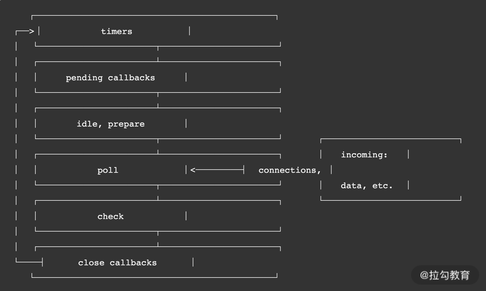
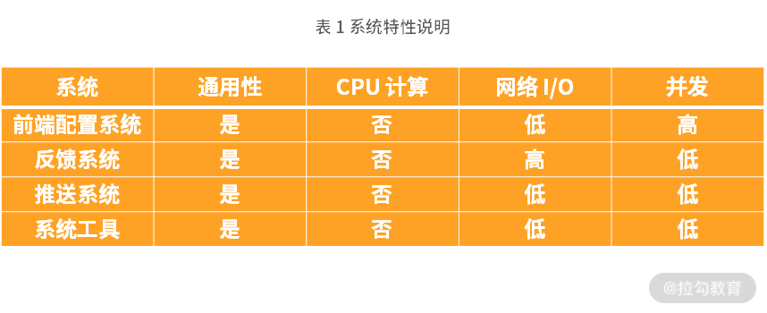
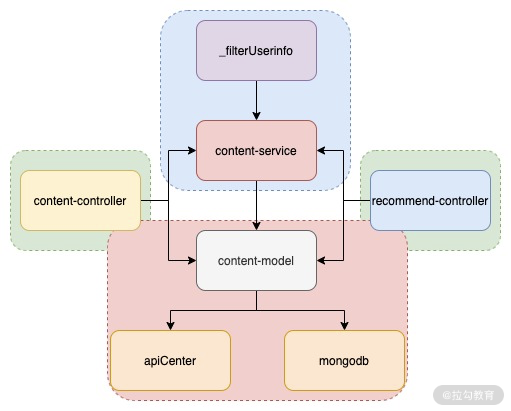

# 一、`Node.js` 在前端工程化和后端服务应用的区别

工程化最重要的就是 `Webpack` 工具，而` Webpack `核心是基于` Node.js `来运行的，当然还有其他场景比如说` SSR` 的实现以及前端的一些工具化场景。这些应用最终目标都是为了提升前端研发效率或者保证研发质量，其实并没有真正地应用到 `Node.js `核心特点，而后端服务应用才是真正地应用 `Node.js `异步事件驱动的特性

**两者之间的区别:**


## 1.1 运行环境

- **工程化的大部分情况都是基于当前开发环境，运行在本地开发机器上，可以快速地判断定位、分析、解决问题。**
- **而后端服务应用一般运行在远程服务器上，需要利用一些工具来分析判断或者监控其运行情况。**

**环境上的差异会引发的不同点：**

* 首先需要应用工具将服务发布到远程机器上，这里就涉及`devops` 工具；
* 需要保证远程服务的安全与稳定，这就涉及一些进程管理工具，例如常见的 `PM2`；
* 需要判断远程服务运行是否正常，这就涉及远程服务的监控和告警机制；
* 遇到运行问题时，需要通过远程日志来定位分析问题，这就涉及日志打印和跟踪染色。

## 1.2 受众群体

* 前端工程化一般都是服务于开发者，比如我自己在本地应用 `Webpack` 打包或者将 `ES6、ES7 `转为 `ES5` 语法等，都是基于开发者工具，而这部分用户则是我们开发者自己。

* 而后端服务应用则服务于真实的用户群体，为用户提供各种交互体验方面的数据处理等。

**受众群体的差异会引发的不同点：**

* **工程化侧重于为开发者提升研发效率或者研发质量。**

* **后端服务应用则必须关注服务的稳定与安全。**因为都是基于用户发送的内容，用户有时候发送一些非法或者违法的内容。其次需要关注并发性能，因此必须充分考量服务器所能承载的最大用户并发数，在并发即将达到阈值时，又需要考量平行扩容方案。还有就是为了用户体验，需要充分做好服务的性能优化，做到极致的接口响应时间。

## 1.3 问题调试

* 因为前端工程化在本地运行，你可以随意地 `console.log` 打印日志进行调试，因为这些影响的也只是个人，或者说即使变成通用的工具，打印一些 `console.log` 也对工具的影响不大。

* 但是在后端服务应用时，你就需要考虑一些方法来进行问题调试和定位策略了。

你需要在每个业务场景中，思考在哪里进行一些关键逻辑或者数据打印日志信息，这里就需要 `Node.js` 日志服务模块，而这类日志服务又不能影响性能，因此**需要考虑一些高性能日志打印工具。其次在服务端运行，你可能会遇到诸如内存泄漏、句柄泄漏或者进程异常退出等问题，因此这里就需要这类工具和方法来分析定位现网问题**。

## 1.4 关注点

前端工程化的应用着重于开发效率的提升和研发质量的保证，后端服务应用则是真正发挥出了 `Node.js` 的异步驱动特性。因为异步驱动特性，在主线程不被` CPU `密集型所影响时，可以真正发挥出 `Node.js `高并发特性，可以作为大部分网络 `I/O` 较高的后端服务。

# 二、事件循环：高性能到底是如何做到的？

`Node.js` 事件循环原理和浏览器的原理是不同的，`Node.js 10+` 版本后虽然在运行结果上与浏览器一致，但是两者在原理上一个是基于浏览器，一个是基于` libuv `库。浏览器核心的是宏任务和微任务，而在` Node.js` 还有阶段性任务执行阶段。

## 2.1 `Node.js` 循环原理

 `Node.js` 官网的事件循环原理的核心流程如下图1所示。



可以看到，这一流程包含 6 个阶段，每个阶段代表的含义如下所示。

1. `timers`：本阶段执行已经被 `setTimeout() `和 `setInterval() `调度的回调函数，简单理解就是由这两个函数启动的回调函数。

2. `pending callbacks`：本阶段执行某些系统操作（如 `TCP` 错误类型）的回调函数。

3. `idle、prepare`：仅系统内部使用，你只需要知道有这 2 个阶段就可以。

4. `poll`：检索新的` I/O `事件，执行与` I/O` 相关的回调，其他情况 `Node.js` 将在适当的时候在此阻塞。这也是最复杂的一个阶段，所有的事件循环以及回调处理都在这个阶段执行，接下来会详细分析这个过程。

5. `check：setImmediate()` 回调函数在这里执行，`setImmediate` 并不是立马执行，而是当事件循环 `poll` 中没有新的事件处理时就执行该部分，如下代码所示：

   ```javascript
   const fs = require('fs');
   setTimeout(() => { // 新的事件循环的起点
       console.log('1'); 
   }, 0);
   setImmediate( () => {
       console.log('setImmediate 1');
   });
   /// 将会在 poll 阶段执行
   fs.readFile('./test.conf', {encoding: 'utf-8'}, (err, data) => {
       if (err) throw err;
       console.log('read file success');
   });
   /// 该部分将会在首次事件循环中执行
   Promise.resolve().then(()=>{
       console.log('poll callback');
   });
   // 首次事件循环执行
   console.log('2');
   
   // 2
   // poll callback
   // 1
   // setImmediate 1
   // read file success
   ```

   在这一代码中有一个非常奇特的地方，就是 `setImmediate` 会在 `setTimeout` 之后输出。有以下几点原因：

   - **`setTimeout `如果不设置时间或者设置时间为 0，则会默认为 `1ms`；**

   - **主流程执行完成后，超过 `1ms` 时，会将` setTimeout` 回调函数逻辑插入到待执行回调函数poll 队列中；**

   - **由于当前 `poll` 队列中存在可执行回调函数，因此需要先执行完，待完全执行完成后，才会执行`check：setImmediate`。**

   因此这也验证了这句话，先执行回调函数，再执行 `setImmediate`。

6. `close callbacks`：执行一些关闭的回调函数，如 `socket.on('close', ...)`。

## 2.2 `Node.js` 事件循环

> **微任务或者宏任务的回调函数依然是由主线程执行**

在上面的核心流程中真正需要关注循环执行的就是 `poll` 这个过程。**在 poll 过程中，主要处理的是异步 I/O 的回调函数，以及其他几乎所有的回调函数，异步 I/O 又分为网络 I/O 和文件 I/O。**这是我们常见的代码逻辑部分的异步回调逻辑。

事件循环的主要包含微任务和宏任务。具体是怎么进行循环的呢？如图 2 所示。


在解释上图之前，我们先来解释下两个概念，微任务和宏任务。

### 微任务

在 `Node.js` 中微任务包含 2 种——`process.nextTick` 和 `Promise`。微任务在事件循环中优先级是最高的，因此在同一个事件循环中有其他任务存在时，优先执行微任务队列。并且`process.nextTick` 和 `Promise`也存在优先级，`process.nextTick `高于 `Promise`。

### 宏任务

在 `Node.js` 中宏任务包含 4 种——`setTimeout、setInterval、setImmediate` 和 `I/O`。宏任务在微任务执行之后执行，因此在同一个事件循环周期内，如果既存在微任务队列又存在宏任务队列，那么优先将微任务队列清空，再执行宏任务队列。

### 主线程

在图 2 的左侧，我们可以看到有一个核心的主线程，它的执行阶段主要处理三个核心逻辑。

* **同步代码。**

* **将异步任务插入到微任务队列或者宏任务队列中。**

* **执行微任务或者宏任务的回调函数。**在主线程处理回调函数的同时，也需要判断是否插入微任务和宏任务。根据优先级，先判断微任务队列是否存在任务，存在则先执行微任务，不存在则判断在宏任务队列是否有任务，有则执行。

### 示例

**示例1**

如果微任务和宏任务都只有一层时，那么看起来是比较简单的，比如下面的例子：

```javascript
const fs = require('fs');
// 首次事件循环执行
console.log('start');
/// 将会在新的事件循环中的阶段执行
fs.readFile('./test.conf', {encoding: 'utf-8'}, (err, data) => {
    if (err) throw err;
    console.log('read file success');
});
setTimeout(() => { // 新的事件循环的起点
    console.log('setTimeout'); 
}, 0);
/// 该部分将会在首次事件循环中执行
Promise.resolve().then(()=>{
    console.log('Promise callback');
});
/// 执行 process.nextTick
process.nextTick(() => {
    console.log('nextTick callback');
});
// 首次事件循环执行
console.log('end');

// start
// end
// nextTick callback
// Promise callback
// setTimeout
// read file success
```

根据上面介绍的执行过程，我们来分析下上面代码的执行过程：

1. 第一个事件循环主线程发起，因此先执行同步代码，所以先输出 `start`，然后输出 `end`；
2. 再从上往下分析，遇到微任务，插入微任务队列，遇到宏任务，插入宏任务队列，分析完成后，微任务队列包含：`Promise.resolve 和 process.nextTick`，宏任务队列包含：`fs.readFile 和 setTimeout`；
3. 先执行微任务队列，但是根据优先级，先执行` process.nextTick` 再执行 `Promise.resolve`，所以先输出` nextTick callback` 再输出 `Promise callback`；
4. 再执行宏任务队列，根据宏任务插入先后顺序执行 `setTimeout 再执行 fs.readFile`，这里需要注意，先执行 `setTimeout` 由于其回调时间较短，因此回调也先执行，并非是 `setTimeout `先执行所以才先执行回调函数，但是它执行需要时间肯定大于 `1ms`，所以虽然 `fs.readFile `先于 `setTimeout` 执行，但是` setTimeout `执行更快，所以先输出 `setTimeout `，最后输出 `read file success`。

**示例2**

当微任务和宏任务又产生新的微任务和宏任务时，又应该如何处理呢？如下代码所示：

```javascript
const fs = require('fs');
setTimeout(() => { // 新的事件循环的起点
    console.log('1'); 
    fs.readFile('./config/test.conf', {encoding: 'utf-8'}, (err, data) => {
        if (err) throw err;
        console.log('read file sync success');
    });
}, 0);
/// 回调将会在新的事件循环之前
fs.readFile('./config/test.conf', {encoding: 'utf-8'}, (err, data) => {
    if (err) throw err;
    console.log('read file success');
});
/// 该部分将会在首次事件循环中执行
Promise.resolve().then(()=>{
    console.log('poll callback');
});
// 首次事件循环执行
console.log('2');

// 2
// poll callback
// 1
// read file success
// read file sync success
```

在上面代码中，有 2 个宏任务和 1 个微任务，宏任务是 `setTimeout` 和 `fs.readFile`，微任务是 `Promise.resolve`。

1. 整个过程优先执行主线程的第一个事件循环过程，所以先执行同步逻辑，先输出 2。
2. 接下来执行微任务，输出 `poll callback`。
3. 再执行宏任务中的` fs.readFile 和 setTimeout`，由于 `fs.readFile` 优先级高，先执行` fs.readFile`。但是处理时间长于 `1ms`，因此会先执行 `setTimeout` 的回调函数，输出 1。这个阶段在执行过程中又会产生新的宏任务 `fs.readFile`，因此又将该 `fs.readFile` 插入宏任务队列。
4. 最后由于只剩下宏任务了 `fs.readFile`，因此执行该宏任务，并等待处理完成后的回调，输出` read file sync success`。

## 2.3 实践分析

### `CPU` 密集型的业务

`Node.js` 不善于处理 `CPU` 密集型的业务，就会导致性能问题，如果要实现一个耗时 `CPU `的计算逻辑，处理方法有 2 种：

* 直接在主业务流程中处理；

* 通过网络异步 I/O 给其他进程处理。

#### 主流程执行

为了效果，我们把两部分计算分开，这样能更好地形成对比，没有异步驱动计算的话，只能同步的去执行两个函数 `startCount` 和 `nextCount`，然后将两部分计算结果相加。

```javascript
const http = require('http');
/**
 * 
 * 创建 http 服务，简单返回
 */
const server = http.createServer((req, res) => {
    res.write(`${startCount() + nextCount()}`);
    res.end();
});
/**
 * 从 0 计算到 500000000 的和
 */
function startCount() {
    let sum = 0;
    for(let i=0; i<500000000; i++){
        sum = sum + i;
    }
    return sum;
}
/**
 * 从 500000000 计算到 1000000000 之间的和
 */
function nextCount() {
    let sum = 0;
    for(let i=500000000; i<1000000000; i++){
        sum = sum + i;
    }
    return sum;
}
/**
 * 
 * 启动服务
 */
server.listen(4000, () => {
    console.log('server start http://127.0.0.1:4000');
});
```

接下来使用下面命令启动该服务：

```bash
node sync.js
```

启动成功后，再在另外一个命令行窗口执行如下命令，查看响应时间，运行命令如下：

```bash
time curl http://127.0.0.1:4000
```

运行完成以后可以看到如下的结果：

```
499999999075959400
real    0m1.100s
user    0m0.004s
sys     0m0.005s
```

启动第一行是计算结果，第二行是执行时长。经过多次运行，其结果基本相近，都在 `1.1s `左右。接下来我们利用 `Node.js `异步事件循环的方式来优化这部分计算方式。

#### 异步网络 `I/O`

异步网络` I/O` 对比主流程执行，优化的思想是将上面的两个计算函数` startCount 和 nextCount` 分别交给其他两个进程来处理，然后主进程应用异步网络` I/O` 的方式来调用执行。

我们先看下主流程逻辑，如下代码所示：

```javascript
const http = require('http');
const rp = require('request-promise');
/**
 * 
 * 创建 http 服务，简单返回
 */
const server = http.createServer((req, res) => {
    Promise.all([startCount(), nextCount()]).then((values) => {
        let sum = values.reduce(function(prev, curr, idx, arr){
            return parseInt(prev) + parseInt(curr);
        })
        res.write(`${sum}`);
        res.end(); 
    })
});
/**
 * 从 0 计算到 500000000 的和
 */
async function startCount() {
    return await rp.get('http://127.0.0.1:5000');
}
/**
 * 从 500000000 计算到 1000000000 之间的和
 */
async function nextCount() {
    return await rp.get('http://127.0.0.1:6000');
}
/**
 * 
 * 启动服务
 */
server.listen(4000, () => {
    console.log('server start http://127.0.0.1:4000');
});
```

代码中使用到了 `Promise.all` 来异步执行两个函数` startCount 和 nextCount`，待 2 个异步执行结果返回后再计算求和。其中两个函数 `startCount` 和 `nextCount` 中的 `rp.get` 地址分别是：

```
http://127.0.0.1:5000
http://127.0.0.1:6000
```

其实是两个新的进程分别计算两个求和的逻辑，具体以 5000 端口的逻辑为例看下，代码如下：

```javascript
const http = require('http');
/**
 * 
 * 创建 http 服务，简单返回
 */
const server = http.createServer((req, res) => {
    let sum = 0;
    for(let i=0; i<500000000; i++){
        sum = sum + i;
    }
    res.write(`${sum}`);
    res.end();
});
/**
 * 
 * 启动服务
 */
server.listen(5000, () => {
    console.log('server start http://127.0.0.1:5000');
});
```

接下来我们分别打开三个命令行窗口，使用以下命令分别启动三个服务：

```bash
node startServer.js
node nextServer.js 
node async.js
```

启动成功后，再运行如下命令，查看执行时间：

```bash
time curl http://127.0.0.1:4000
```

运行成功后，你可以看到如下结果：

```
499999999075959400
real    0m0.575s
user    0m0.004s
sys     0m0.005s
```

结果还是一致的，但是运行时间缩减了一半，大大地提升了执行效率。

#### 响应分析

两个服务的执行时间相差一半，因为异步网络` I/O `充分利用了 `Node.js` 的异步事件驱动能力，将耗时 `CPU `计算逻辑给到其他进程来处理，而无须等待耗时 `CPU` 计算，可以直接处理其他请求或者其他部分逻辑。第一种同步执行的方式就无法去处理其逻辑，导致性能受到影响。

## 2.4 问题

### 1、谁来启动这个循环过程

从图 1 中我们可以看出事件循环的起点是 `timers`，如下代码所示：

```javascript
setTimeout(() => {
    console.log('1');
}, 0);
console.log('2')
```

在代码 `setTimeout` 中的回调函数就是新一轮事件循环的起点，看到这里有很多同学会提出非常合理的疑问：“为什么会先输出 2 然后输出 1，不是说 `timer` 的回调函数是运行起点吗？”

**这里有一个非常关键点，当 `Node.js` 启动后，会初始化事件循环，处理已提供的输入脚本，它可能会先调用一些异步的 `API`、调度定时器，或者 `process.nextTick()`，然后再开始处理事件循环。因此可以这样理解，`Node.js` 进程启动后，就发起了一个新的事件循环，也就是事件循环的起点。**

总结来说，`Node.js `事件循环的发起点有 4 个：

* `Node.js` 启动后；

* `setTimeout` 回调函数；

* `setInterval` 回调函数；

* 也可能是一次 `I/O` 后的回调函数。

### 2、谁来执行回调函数

**微任务或者宏任务的回调函数依然是由主线程执行**

### 3、主线程是否会被阻塞

在上面的例子中，我们来思考一个问题，主线程是否会被阻塞，具体我们来看一个代码例子：

```
const fs = require('fs');
setTimeout(() => { // 新的事件循环的起点
    console.log('1'); 
    sleep(10000)
    console.log('sleep 10s');
}, 0);
/// 将会在 poll 阶段执行
fs.readFile('./test.conf', {encoding: 'utf-8'}, (err, data) => {
    if (err) throw err;
    console.log('read file success');
});
console.log('2');
/// 函数实现，参数 n 单位 毫秒 ；
function sleep ( n ) { 
    var start = new Date().getTime() ;
    while ( true ) {
        if ( new Date().getTime() - start > n ) {
            // 使用  break  实现；
            break;
        }
    }
}
```

我们在 `setTimeout` 中增加了一个阻塞逻辑，这个阻塞逻辑的现象是，只有等待当次事件循环结束后，才会执行 `fs.readFile` 回调函数。这里会发现 `fs.readFile` 其实已经处理完了，并且通知回调到了主线程，但是由于主线程在处理回调时被阻塞了，导致无法处理 `fs.readFile `的回调。因此可以得出一个结论，主线程会因为回调函数的执行而被阻塞，这也符合图 2 中的执行流程图。

如果把上面代码中 `setTimeout` 的时间修改为 10 ms，你将会优先看到 `fs.readFile` 的回调函数，因为` fs.readFile` 执行完成了，并且还未启动下一个事件循环，修改的代码如下：

```javascript
setTimeout(() => { // 新的事件循环的起点
    console.log('1'); 
    sleep(10000)
    console.log('sleep 10s');
}, 10);
```

### 4、无限循环有没有终点

当所有的微任务和宏任务都清空的时候，虽然当前没有任务可执行了，但是也并不能代表循环结束了。因为可能存在当前还未回调的异步 `I/O`，所以这个循环是没有终点的，只要进程在，并且有新的任务存在，就会去执行。

### 5、循环的任务是否存在优先级概念

微任务优先于宏任务。但是微任务中`process.nextTick `高于 `Promise`，宏任务中`IO `和 `timers`严格意义上没有优先级概念，但是`IO `和 `timers`肯定优先于 `setImmediate`。

### 6、什么进程或者线程来执行这个循环

主要还是主线程来循环遍历当前事件

### 7、`Node.js` 是单线程的还是多线程的

主线程是单线程执行的，但是` Node.js` 存在多线程执行，多线程包括 `setTimeout` 和异步` I/O `事件。其实` Node.js` 还存在其他的线程，包括垃圾回收、内存优化等。

### 8、在运行时，`Nodejs`有线程数量限制吗

`setTimeout` 没有遇到过限制。但是 `I/O` 是会的，和系统有关因为 `I/O` 是会占用句柄的，假设文件句柄超出限制，那么肯定是无法启动新的线程来处理的。有些 `I/O `是网络的，那么和系统的网络模块也是相关，有些是文件 `I/O` 那跟文件 `I/O `限制相关。但是这些都是来自于系统，而不是 `Node.js` 。

### 9、`Node`与浏览器的 `Event Loop` 差异

#### `Node10`及其之前版本:

* `Node.JS` 事件循环有6个阶段，而浏览器事件循环没有
* 浏览器中没有`process.nextTick()和I/O`
* **`Node.js`在执行相应每一个阶段 `macro-task` 中的所有宏任务之后，才开始执行`micro-task`中的微任务。**

#### `Node11`及其以后版本：

* `Node.JS` 事件循环有6个阶段，而浏览器事件循环没有
* 浏览器中没有`process.nextTick()和I/O`
* **在 `Node11` 里面都修改为一旦执行一个阶段里的一个宏任务就立刻执行清空微任务队列，和浏览器端运行一致。**

# 三、`Node.js` 作为后台可以提供哪些服务？

## 3.1 服务分类

我们常听说的服务有 `RESTful` 和 `RPC`，但这都是架构设计规范。我们也可以从另外一个角度来分析后台服务，如图 1 所示。


以上分类并不能代表所有的服务，但是各个系统都或多或少包含这些服务。有些大型系统可能会比这复杂；有些小型系统可能没有这么多模块系统。

下面我们看下每个模块主要的工作是什么：

* 网关，处理请求转发和一些通用的逻辑，例如我们常见的 `Nginx`；

* 业务网关，处理业务相关的逻辑，比如一些通用的协议转化、通用的鉴权处理，以及其他统一的业务安全处理等；

* 运营系统，负责我们日常的运营活动或者运营系统；

* 业务系统，负责我们核心的业务功能的系统；

* 中台服务，负责一些通用 `App` 类的服务，比如配置下发、消息系统及用户反馈系统等；

* 各类基础层，这些就是比较单一的核心后台服务，例如用户模块，这就需要根据不同业务设计不同的核心底层服务；

* 左侧的数据缓存和数据存储，则是相应的数据类的服务。

在这些分层中，我们**需要寻找网络` I/O` 较多，但是` CPU `计算较少、业务复杂度高的服务**，基于这点我们可以分析出 **`Node.js` 应用在业务网关、中台服务及运营系统**几个方面。接下来我们就分别**从系统的业务场景及系统特性**来分析为什么 `Node.js` 更合适。

## 3.2 适用场景

### 业务网关

我们都了解 `Nginx `作为负载均衡转发层，负责负载分发，那么业务网关又是什么呢？

可以这样考虑，**比如我们后台管理系统有鉴权模块，以往都是在管理后台服务中增加一个鉴权的类，然后在统一路由处增加鉴权判断。而现在不仅仅是这个管理系统需要使用这个鉴权类，多个管理系统都需要这个鉴权类**，这时你会考虑复制这个类到其他项目，又或者设计一个专门的服务来做鉴权，图 2 是一个转变的过程效果图。


**从上图我们可以看到，其实每个项目的鉴权都是相似的，没有必要在每个项目中维护一份通用的鉴权服务。因此可以提炼一层叫作业务网关，专门处理业务相关的通用逻辑，包括鉴权模块。**

接下来我们就从一个实际的例子 `OPEN API `的业务网关来介绍下这类服务场景。

#### 业务场景

`OPEN API` 一般会有一个统一的` token `鉴权，通过 `token` 鉴权后还需要判断第三方的 `appid` 是否有接口权限，其次判断接口是否到达了请求频率上限。为了服务安全，我们也可以做一些降级处理，在服务过载时，可以根据优先级抛弃一些请求，具体可以查看图 3。


接下来我们从技术层面来看为什么 `Node.js` 更适合此类应用场景。

#### 服务特性

根据图 2 的场景应用，我们专注看下 `Nginx` 后面的业务网关处理层，它的业务场景如图 4 所示。


这 3 个功能都是**基于缓存来处理业务逻辑的，大部分都是网络 `I/O` ，并未涉及 `CPU` 密集型逻辑**，这也是` Node.js` 的优势，其次异步驱动的方案能够处理更高的并发。`Node.js `的代码核心是不阻塞主线程处理，而这类业务网关都是轻` CPU `运算服务。因此在这类场景的技术选型中，可以考虑使用 `Node.js` 作为服务端语言。

### 中台服务

**在 `Web `或者 `App `应用中都存在一些通用服务，以往都是独立接口、独立开发。随着公司应用越来越多，需要将一些通用的业务服务进行集中，这也是中台的概念。**而这部分业务场景往往也是**网络 I/O 高、并发较大、业务关联性高、数据库读写压力相对较小**。下面我们就来分析下这种业务场景。

#### 业务场景

为了避免资源浪费、人力浪费，我们可以使用如图 5 所示的中台服务系统：


* 前端配置系统是在服务端根据客户端的版本、设备、地区和语言，下发不同的配置（`JSON`或者文件包）；

* 反馈系统，即用户可以在任何平台，调用反馈接口，并将反馈内容写入队列，并落地到系统中进行综合分析；

* 推送系统用于管理消息的推送、用户红点和消息数的拉取，以及消息列表的管理；

* 系统工具用于处理用户端日志捞取、用户端信息调试上报、性能定位问题分析提取等。

以上是多个中台系统的业务说明，我们再来具体看看每个系统的特性，从特性来分析为什么 `Node.js `适合作为服务端语言。

#### 服务特性

在中台系统的设计中，系统着重关注：**网络` I/O`、并发、通用性及业务复杂度，一般情况下不涉及复杂的 CPU 运算**。这里我们以上面列举的系统来做分析，如表 1 所示。



在上述系统对比中，可以分析出` Node.js` 作为中台服务，要求是：

* 通用性必须好；

* 低 `CPU `计算；

* 网络 `I/O` 高或者低都行；

* 并发高或者低都行。

因为这样的服务在 `Node.js` 主线程中，可以快速处理各类业务场景，不会存在阻塞的情况，因此这类场景也适合使用 `Node.js` 作为服务端语言。

### 运营系统

在各类互联网项目中，经常用运营活动来做项目推广，而这类运营系统往往逻辑复杂，同时需要根据业务场景进行多次迭代、不断优化。往往这些活动并发很高，但是可以不涉及底层数据库的读写，而更多的是缓存数据的处理。比如我们常见的一些投票活动、排行榜活动等，如图 6 所示。


## 3.3 不适合场景

之前介绍了事件循环原理，在原理中突出的是不能阻塞主线程，而一些密集型 `CPU `运算的服务则非常不适合使用` Node.js` 来处理。比如：

* 图片处理，比如图片的裁剪、图片的缩放，这些非常损耗 `CPU` 计算，应该用其他进程来处理；

* 大字符串、大数组类处理，当涉及这些数据时，应该考虑如何通过切割来处理，或者在其他进程异步处理；

* 大文件读写处理，有时会使用 `Node.js `服务来处理 `Excel`，但是遇到 `Excel `过大时，会导致` Node.js `内存溢出，因为 `V8 `内存上限是 `1.4 G`。

可能还有更多场景，这里只是列举了很小的一部分，总之两个关键因素：**大内存和`CPU `密集**，这样的场景都不适合使用 `Node.js` 来提供服务。

# 四、如何构建一个简单的 `RESTful` 服务？

## 4.1 基础技术点

* 什么是 `RESTful` 规范；

* 数据库的读写处理过程；

* 目前常用的 `MVC` 架构模式，以及后续本专栏所应用的一套新的、独创的架构模式——`MSVC `架构模式。

### `RESTful`

`RESTful（Representational State Transfer）`是一种架构的约束条件和规则。在倡导前后端分离后，该架构规范的应用愈加广泛。具体知识点，[你可以参考这里进行学习](https://github.com/aisuhua/restful-api-design-references)。

### `MongoDB`

### `MVC`

我们应该都比较熟知 `MVC` 架构，它在前后端分离中起到了非常重要的作用，我们先来看下传统的 `MVC`架构的模式，如图 1 所示。


此模式中：

* `M（Model）`层处理数据库相关的操作（只有数据库操作时）；

* `C（Controller）`层处理业务逻辑；

* `V（View）`层则是页面显示和交互。

### `MSVC`

但是在目前服务划分较细的情况下，`M` 层不仅仅是数据库操作，因此这种架构模式显得有些力不从心，导致开发的数据以及业务逻辑有时候在 `M `层，有时候却在 `C` 层。出现这类情况的核心原因是 `C 与 C `之间无法进行复用，如果需要复用则需要放到` M `层，那么业务逻辑就会冗余在` M`，代码会显得非常繁杂，如图 2 所示。


为了解决以上问题，在经过一些实践后，在研发过程中提出了一套新的架构模式（比如 `Eggjs` 框架中的模式）。这种模式也会应用在本专栏的整个架构体系中，暂且叫作 `MSVC（Model、Service、View、Controller）`。 `MSVC` 的架构模式，如图 3 所示。


将所有数据相关的操作都集中于` M` 层，而 `M `层复用的业务逻辑则转到新的 `S `层，`C` 层则负责核心业务处理，可以调用` M `和 `S `层。以上是相关知识点，接下来我们进行架构的实践设计。

## 4.2 系统实践

要实现的是一个获取用户发帖的列表信息 `API`，该 `API` 列表的内容包含两部分，一部分是从数据库获取的发帖内容，但是这部分只包含用户` ID`，另外一部分则是需要通过` ID `批量拉取用户信息。

我们先来设计 `RESTful API`，由于是拉取列表内容接口，因此这里设计为一个` GET `接口，根据 `RESTful `约束规则设计为：`GET /v1/contents`；另外还需要设计一个独立的服务用来获取用户信息，将接口设计为：`GET /v1/userinfos`。

为了更清晰些，我绘制了一个时序图来表示，如图 4 所示。


在图 4 中详细的过程是：

1. 用户先调用 `/v1/contents API` 拉取 `restful server `的内容；
2. `restful server `会首先去 `MongoDB` 中获取 `contents`；
3. 拿到 `contents` 后解析出其中的 `userIds`；
4. 然后再通过 `/v1/userinfos API `调用 `API server `的服务获取用户信息列表；
5. `API server` 同样需要和 `MongoDB `交互查询到所需要的 `userinfos`；
6. 拿到` userinfos` 后通过 `addUserinfo` 将用户信息整合到 `contents` 中去；
7. 最后将` contents` 返回给到调用方。

在不考虑任何架构模式的情况下，我们来实现一个简单版本的 `restful` 服务，上面分析了需要实现 2 个` server`，这里分别叫作 `API server 和 restful server`。

### 简单版本`RESTful`

> 为什么一个`restful server`，一个`api server`层？
>
> 这里只是一个演示，为了告诉大家获取数据的方式可能有多种，一种是来自数据库，一种是来自其他服务，而这里的`api`层，就是代表其他服务层。

#### `API server`

`server` 包含 2 个部分：解析请求路径和解析请求参数，在 `Node.js `中我们可以用以下代码来解析：

```javascript
/**
 * 
 * 创建 http 服务，简单返回
 */
const server = http.createServer(async (req, res) => {
    // 获取 get 参数
    const pathname = url.parse(req.url).pathname;
    paramStr = url.parse(req.url).query,
    param = querystring.parse(paramStr);
    // 过滤非拉取用户信息请求
    if('/v1/userinfos' != pathname) {
      return setResInfo(res, false, 'path not found');
    }
    // 参数校验，没有包含参数时返回错误
    if(!param || !param['user_ids']) {
      return setResInfo(res, false, 'params error');
    }
});
```

参数和请求路径解析成功后，再进行路径的判断和校验，如果不满足我们当前的要求，调用 `setResInfo` 报错返回相应的数据给到前端。`setResInfo `这个函数实现比较简单，使用 `res` 对象来设置返回的数据，具体你可以前往 [GitHub 源码](https://github.com/love-flutter/nodejs-column)中查看。

路径和参数解析成功后，我们再根据当前参数查询 `MongoDB` 中的 `userinfo` 数据，具体代码如下：

```javascript
const baseMongo = require('./lib/baseMongodb')();
const server = http.createServer(async (req, res) => {
    // ...省略上面部分代码
    // 从 db 查询数据，并获取，有可能返回空数据
    const userInfo = await queryData({'id' : { $in : param['user_ids'].split(',')}});
    return setResInfo(res, true, 'success', userInfo);
});
/**
 * 
 * @description db 数据查询
 * @param object queryOption 
 */
async function queryData(queryOption) {
  const client = await baseMongo.getClient();
  const collection = client.db("nodejs_cloumn").collection("user");
  const queryArr = await collection.find(queryOption).toArray();
  return queryArr;
}
```

#### `restful server`

和 `API server` 相似，前面 2 个过程是解析请求路径和请求参数，解析成功后，根据时序图先从` MongoDB` 中拉取 `10 `条 `content `数据，代码如下：

```javascript
const server = http.createServer(async (req, res) => {
    // 获取 get 参数
    const pathname = url.parse(req.url).pathname;
    paramStr = url.parse(req.url).query,
    param = querystring.parse(paramStr);
    // 过滤非拉取用户信息请求
    if('/v1/contents' != pathname) {
      return setResInfo(res, false, 'path not found', null, '404');
    }
    // 从 db 查询数据，并获取，有可能返回空数据
    let contents = await queryData({}, {limit: 10});

    contents = await filterUserinfo(contents);
    return setResInfo(res, true, 'success', contents);
});
```

运行成功后，我们在浏览器中打开如下地址：

```bash
http://127.0.0.1:5000/v1/userinfos?user_ids=1001,1002
```

你将会看到一个` JSON` 的返回结构，如图 6 所示。


接下来我们请求 `restful server 的 API`，同样使用浏览器打开如下接口地址：

```bash
http://127.0.0.1:4000/v1/contents
```

你将会看到如图 7 所示的响应结果。


以上就实现了一个简单 `restful `服务的功能，你可以看到代码都堆积在` index.js` 中，并且代码逻辑还比较简单，如果稍微复杂一些，这种架构模式根本没法进行团队合作，或者后期维护，因此就需要 `MVC 和 MVCS `架构模式来优化这种场景。

### 进阶实现`MVC`

既然是 `M` 和` C`，我们就先思考下，上面的 `restful server `中哪些是 `M` 层的逻辑，哪些是` C `层的逻辑。


以上是所有的逻辑，根据表格，我们首先创建两个目录分别是 `model 和 Controller`：

* 在 `model` 中创建一个 `content.js` 用来处理 `content model` 逻辑；

* 在 `Controller` 中也创建一个 `content.js` 用来处理 `content 的 Controller` 逻辑。

#### `index.js`

**在源代码中有一个 `index.js `文件，在没有架构模式时，基本上处理了所有的业务，但是根据当前架构模式，如表 1 所示，只适合处理 `url `路径解析、路由判断及转发**，因此需要简化原来的逻辑，和第一部分代码一样，我们就不再列举了，主要看路由判断。首先需要根据 `restful url` 路由配置一份路由转发逻辑，配置如下：

```javascript
const routerMapping = {
    '/v1/contents' : {
        'Controller' : 'content',
        'method' : 'list'
    },
    '/v1/test' : {
        'Controller' : 'content',
        'method' : 'test'
    }
};
```

上面代码的意思是：

* 如果请求路径是` /v1/contents `就转发到 `content.js` 这个 `Controller`，并且调用其 `list` 方法；

* 如果是` /v1/test `则也转发到 `content.js `这个 `Controller`，但调用的是 `test `方法。

> 注意：其中 test 是一个同步方法，list 是一个异步方法。

路由配置完成以后，就需要根据路由配置，将请求路径、转发到处理相应功能的模块或者类、函数中去，`index.js`代码如图 所示。


* 第一个红色框内的部分，判断的是路由是否在配置内，不存在则返回 404；

* 第二个红色框内的部分，加载对应的 `Controller `模块；

* 第三个红色框内的部分，表示判断所调用的方法类型是异步还是同步，如果是异步使用 `await `来获取执行结果，如果是同步则直接调用获取返回结果。

>注意：这里使用` try catch` 的目的是确保调用安全，避免 `crash `问题。

####  `Controller`

##### `Controller` 基类

接下来我们实现一个 `Controller`，为了合理性，我们先实现一个基类，然后让每个` Controller `继承这个基类：

* 在项目根目录下我们创建一个` core `文件夹，并创建一个` Controller.js` 作为基类；

* 然后我们把一些相同的功能放入这个基类，比如 `res 和 req` 的赋值，以及通用返回处理，还有` url`参数解析等。

我们来看下这部分代码，如图所示。


##### `content.js`

再实现` content.js` 这个 `Controller`，代码如图所示：


#### `Model` 

##### `Model` 基类

再来实现 `Model` 层部分，和 `Controller `类似，我们也需要一个基类来处理 `Model `层相似的逻辑，然后其他` Model `来继承这个基类，这部分如图所示。


这个基类首先设置了 `db` 名称，其次定义了一个 `GET` 方法来获取表的操作句柄，这部分代码与上面简单` restful` 服务的类似。完成基类后，我们再来完善 `model `中的 `content.js` 逻辑。

#####  `content.js` 


这部分代码主要方法是 `getList`，原理和简单` restful server `中的查询类似，在第 11 行通过父类的 `GET `方法获取表 `content` 的操作句柄，再调用` MongoDB` 的 `find `方法查询` contents`。有了` model content` 后，我们再回去完善` content.js Controller `中的` list `函数部分逻辑，代码封装的比较简洁，如下所示：

```javascript
async list() {
  let contentList = await new ContentModel().getList();
  contentList = await this._filterUserinfo(contentList);

  return this.resAPI(true, 'success', contentList);
}
```

上面代码中的第 4 行，只能在当前 `Controller `下实现一个私有方法` _filterUserinfo` 来处理用户信息部分，这部分逻辑也和简单 `restful `服务的一样。

这样就实现了一个 `MVC` 的架构，将原来的复杂不可扩展性的代码，转化为可扩展、易维护的代码。

### 进阶实现`MVCS`

在上面的代码中存在一个问题，就是` _filterUserinfo` 是放在` Controller `来处理，这个方法又会涉及调用` API server `的逻辑，看起来也是数据处理部分，从原理上说这部分不适合放在` Controller`。其次在其他 `Controller` 也需要 `_filterUserinfo` 时，这时候就比较懵逼了，比如我们现在有另外一个 `Controller `叫作 `recommend.js`，这里面也是拉取推荐的` content`，也需要这个 `_filterUserinfo` 方法，如图所示。


其中左边是存在的矛盾，因为` _filterUserinfo 在 Controller `是私有方法，`recommend Controller `调用不到，那么为了复用，我们只能将该方法封装到 `content-model `中，并且将数据也集中在 `Model`层去。

虽然解决了问题，但是你会发现：

* `Model` 层不干净了，它现在既要负责数据处理，又要负责业务逻辑；

* `Controller` 层的业务减少了，但是分层不明确了，有些业务放在 `Model`，有些又在` Controller`层，对于后期代码的维护或者扩展都非常困难了。

为了解决这个问题，有一个新的概念——`Service` 层，具体如图所示。

#### `Service` 层



* 图中的浅红色框内，就是新架构模式的 M 层；

* 两个绿色框内为 C 层；

* 最上面的浅蓝色框则为 Service 层。

这样就可以复用 `_filterUserinfo`，并解决` M `与` C `层不明确的问题。接下来我们来实践这部分代码：

* 首先我们需要创建一个文件夹 `service` 来存放相应的` Service `层代码；

* 然后创建一个` content.js `来表示` content-service `这个模块；
* 再将原来代码中的 `_filterUserinfo` 逻辑转到 `content-service `中去；
* 最后修改` Controller `代码。

如下代码所示：

```javascript
 async list() {
   let contentList = await new ContentModel().getList();
   contentList = await contentService.filterUserinfo(contentList);
   return this.resAPI(true, 'success', contentList);
 }
```

注意代码中的第 3 行，从原来调用本类的方法，修改为调用 `contentService 的 filterUserinfo`。

通过使用 `MSVC` 来解决 `MVC` 中 `M `和 `C` 业务界定不清晰的问题。

# 五、大主流系统框架：由浅入深分析 `Express、Koa` 和 `Egg.js`

目前比较流行的 `Node.js` 框架有`Express、KOA 和 Egg.js`，其次是另外一个正在兴起的与 `TypeScript` 相关的框架——`Nest.js`。

无论是哪个 `Node.js` 框架，都是基于中间件来实现的，而中间件（可以理解为一个类或者函数模块）的执行方式就需要依据洋葱模型来介绍。`Express 和 KOA `之间的区别也在于洋葱模型的执行方式上。

## 5.1 洋葱模型

洋葱我们都知道，一层包裹着一层，层层递进，但是现在不是看其立体的结构，而是需要将洋葱切开来，从切开的平面来看，如图所示。


可以看到要从洋葱中心点穿过去，就必须先一层层向内穿入洋葱表皮进入中心点，然后再从中心点一层层向外穿出表皮，这里有个特点：**进入时穿入了多少层表皮，出去时就必须穿出多少层表皮。先穿入表皮，后穿出表皮，符合我们所说的栈列表，先进后出的原则。**

## 5.2 中间件

然后再回到 `Node.js` 框架，洋葱的表皮我们可以思考为中间件：

* 从外向内的过程是一个关键词` next()`；

* 而从内向外则是每个中间件执行完毕后，进入下一层中间件，一直到最后一层。

### 中间件执行

为了理解上面的洋葱模型以及其执行过程，我们用 `Express` 作为框架例子，来实现一个后台服务。

以下代码，其中的 `app.use `部分的就是 3 个中间件，从上到下代表的是洋葱的从外向内的各个层：1 是最外层，2 是中间层，3 是最内层。

.png)

中间件的执行过程：

1. 先执行第一个中间件，输出` first`；
2. 遇到` next()` 执行第二个中间件，输出` second`；
3. 再遇到 `next() `执行第三个中间件，输出 `third`；
4. 中间件都执行完毕后，往外一层层剥离，先输出` third end`；
5. 再输出 `second`；
6. 最后输出` first end`。

以上就是中间件的执行过程，不过 `Express 和 KOA` 在中间件执行过程中还是存在一些差异的。

### `Express & KOA`中间件执行差异

随着 `Node.js `的不断迭代，出现了以 `await/async `为核心的语法糖，`Express `原班人马为了实现一个高可用、高性能、更健壮，并且符合当前 `Node.js` 版本的框架，开发出了 `KOA `框架。

那么两者存在哪些方面的差异呢：

* `Express `封装、内置了很多中间件，比如 `connect 和 router` ，而` KOA` 则比较轻量，开发者可以根据自身需求定制框架；

* `Express` 是基于 `callback `来处理中间件的，而 `KOA `则是基于 `await/async`；

* 在异步执行中间件时，`Express `并非严格按照洋葱模型执行中间件，而 `KOA `则是严格遵循的。

#### `Express`

为了更清晰地对比两者在中间件上的差异，我们对上面那段代码进行修改，其次用 `KOA` 来重新实现，看下两者的运行差异。

因为两者在中间件为异步函数的时候处理会有不同，因此我们保留原来三个中间件，同时在 2 和 3 之间插入一个新的异步中间件，代码如下：

```javascript
/**
 * 异步中间件
 */
app.use(async (req, res, next) => {
    console.log('async');
    await next();
    await new Promise(
        (resolve) => 
            setTimeout(
                () => {
                    console.log(`wait 1000 ms end`);
                    resolve()
                }, 
            1000
        )
    );
    console.log('async end');
});
```

然后将其他中间件修改为 `await next() `方式，如下中间件 1 的方式：

```javascript
/**
 * 中间件 1
 */
app.use(async (req, res, next) => {
    console.log('first');
    await next();
    console.log('first end');
});
```

执行结果为：

```
Example app listening on port 3000!
first
second
async
third
third end
second end
first end
wait 1000 ms end
async end
```

**可以看出，从内向外的是正常的，一层层往里进行调用，从外向内时则发生了一些变化，最主要的原因是异步中间件并没有按照顺序输出执行结果。**

####  `KOA` 

这部分我们只看中间件 1 和异步中间件即可

```javascript
const Koa = require('koa');
const app = new Koa();
/**
 * 中间件 1
 */
app.use(async (ctx, next) => {
    console.log('first');
    await next();
    console.log('first end');
});
/**
 * 异步中间件
 */
app.use(async (ctx, next) => {
    console.log('async');
    await next();
    await new Promise(
        (resolve) => 
            setTimeout(
                () => {
                    console.log(`wait 1000 ms end`);
                    resolve()
                }, 
            1000
        )
    );
    console.log('async end');
});
app.use(async ctx => {
    ctx.body = 'Hello World';
  });

app.listen(3000, () => console.log(`Example app listening on port 3000!`));
```

和 `express` 代码基本没有什么差异，只是将中间件中的` res、req `参数替换为 `ctx`。

执行结果：

```
Example app listening on port 3000!
first
second
async
third
third end
wait 1000 ms end
async end
second end
first end
```

你会发现，`KOA `严格按照了洋葱模型的执行，从上到下，也就是从洋葱的内部向外部，输出` first、second、async、third`；接下来从内向外输出` third end、async end、second end、first end`。

因为两者基于的 `Node.js` 版本不同，所以只是出现的时间点不同而已，并没有孰优孰劣之分。`Express `功能较全，发展时间比较长，也经受了不同程度的历练，因此在一些项目上是一个不错的选择。当然你也可以选择 `KOA`，虽然刚诞生不久，但它是未来的一个趋势。

### `KOA & Egg.js`

上面我们说了` KOA `是一个可定制的框架，开发者可以根据自己的需要，定制各种机制，比如多进程处理、路由处理、上下文 `context` 的处理、异常处理等，非常灵活。而 **`Egg.js` 就是在 `KOA` 基础上，做了各种比较成熟的中间件和模块，可以说是在` KOA `框架基础上的最佳实践，用以满足开发者开箱即用的特性。**

我们说到 `KOA `是未来的一个趋势，然后` Egg.js `是目前` KOA `的最佳实践，因此在一些企业级应用后台服务时，可以使用` Egg.js` 框架，如果你需要做一些高性能、高定制化的框架也可以在 `KOA` 基础上扩展出新的框架。

# 六、多进程解决方案：`cluster` 模式以及 `PM2` 工具的原理介绍

都使用了一种非常简单暴力的方式（`node app.js`）启动 `Node.js` 服务器，而在线上我们要考虑使用多核 `CPU`，充分利用服务器资源，这里就用到多进程解决方案，所以本讲介绍 `PM2` 的原理以及如何应用一个 `cluster` 模式启动 `Node.js` 服务。

## 6.1 单线程问题

分析了 `Node.js` 主线程是单线程的，如果我们使用 `node app.js` 方式运行，就启动了一个进程，只能在一个 `CPU` 中进行运算，无法应用服务器的多核 `CPU`，因此我们需要寻求一些解决方案。你能想到的解决方案肯定是多进程分发策略，即主进程接收所有请求，然后通过一定的负载均衡策略分发到不同的 `Node.js` 子进程中。如图的方案所示：


这一方案有 2 个不同的实现：

* 主进程监听一个端口，子进程不监听端口，通过主进程分发请求到子进程；

* 主进程和子进程分别监听不同端口，通过主进程分发请求到子进程。

在 `Node.js` 中的 `cluster` 模式使用的是第一个实现。