# 一、`node.js`介绍

## `nvm`的使用

`nvm，nodejs`的版本管理工具，可切换多个`nodejs`版本

如果需要同时使用多个`node`版本，推荐用`nvm`

**安装：**

[安装地址](https://www.cnblogs.com/gaozejie/p/10689742.html)

**命令：**
 `nvm ls-remote`：列出所有可以安装的node版本号
 `nvm install v10.4.0`：安装指定版本号的node
 `nvm use v10.3.0`：切换node的版本，这个是全局的
 `nvm current`：当前node版本
 `nvm ls`：列出所有已经安装的node版本

## `cross-env`的使用

[cross-env不同环境配置](https://www.cnblogs.com/wpshan/p/11119597.html)

```javascript
//  package.json

{
  "name": "blog-koa2",
  "version": "0.1.0",
  "private": true,
  "scripts": {
    "start": "node bin/www",
     // 将NODE_ENV设置为开发环境，并且使用nodemon启动应用服务
    "dev": "cross-env NODE_ENV=dev ./node_modules/.bin/nodemon bin/www", 
     // 将NODE_ENV设置为线上环境，并且使用pm2启动应用服务
    "prd": "cross-env NODE_ENV=production pm2 start bin/www",
    "test": "echo \"Error: no test specified\" && exit 1"
  }
}
```


## `nodejs`和`JavaScript`的区别

* `ECMAScript`
  * 定义了语法，写`JavaScript`和`nodejs`都必须遵守
  * 不能操作`DOM`，不能监听`click`事件，不能发送`ajax`请求
  * 不能处理`http`请求，不能操作文件
  * 单纯只依靠`ECMAScript`，几乎做不了任何实际的项目
* `JavaScript`
  * 使用`ECMAScript`语法规范，外加`Web API`，缺一不可
  * `DOM`操作、`BOM`操作、事件绑定、`ajax`等
  * 两者结合，即可完成浏览器端的任何操作
* `nodejs`
  * 使用`ECMAScript`语法规范，外加`nodejs API`，缺一不可
  * 处理网络请求，处理文件等
  * 两者结合即可完成`server`端的任何操作

### 总结

* `ECMAScript`是语法规范
* `nodejs = ECMAScript + nodejs API`

## `commonjs`模块管理规范

* 核心模块（`http、net、fs`等）
* 第三方模块 （`loadsh、express`等）
* 自定义模块 （`a.js、module.js`等）

注意：除了`node`中的`commonjs`模块化，`ES6`中也提供了模块化功能

## `server`端和前端的区别

**服务稳定性、考虑内存和`CPU`、日志记录、安全、集群和服务拆分**

* 服务稳定性
  * `server`端可能会遭受各种恶意攻击和误操作
  * 单个客户端可以意外挂掉，但是服务端不能
  * 使用`pm2`做进程守候
* 考虑内存和`CPU`（优化、扩展）
  * 客户端独占一个浏览器，内存和`CPU`都不是问题
  * server端要承载很多请求，`CPU`和内存都是稀缺资源
  * 使用`stream`写日志，使用`redis`存`session`
* 日志记录
  * 前端也会参与写日志，但只是日志的发起者，不关心后续
  * `server`端要记录日志、存储日志、分析日志，前端不关心
* 安全
  * `server`端要随时准备接受各种恶意攻击，前端则少很多
  * 如：越权操作，数据库攻击等
* 集群和服务拆分
  * 产品发展速度块，流量可能会迅速增加
  * 如何通过扩展机器和服务拆分来承载大流量？

# 二、项目介绍

## 需求

* 首页、作者主页、博客详情页
* 登录页
* 管理中心、新建页、编辑页

## 技术方案

* 数据如何存储

  * 博客

    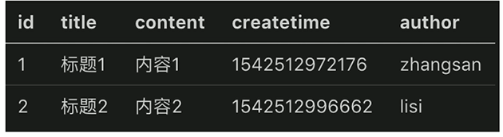

  * 用户

    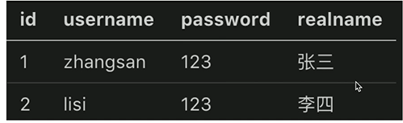

* 如何与前端对接，即接口设计

  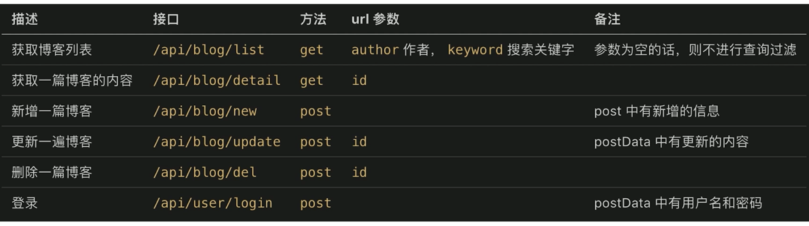

# 三、开发博客项目之接口

## `http`请求概述

* `DNS`解析，建立`TCP`连接，发送`http`请求
* `server`接收到`http`请求，处理，并返回
* 客户端接收到返回数据，处理数据（如渲染页面，执行`js`）

## `nodejs`处理`http`请求

* `get`请求和`querystring`
  * get请求，即客户端要想server端获取数据，如查询博客列表
  * 通过`querystring`来传递数据，如`a.html?a=100&b=200`
* `post`请求和`postdata`
  * `post`请求，即客户端要向服务端传递数据，如新建博客
  * 通过`post data`传递数据

**简单示例**

```javascript
const http = require('http');
const querystring = require('querystring');

const server = http.createServer((req, res) => {
  const method = req.method;
  const path = url.split('?')[0];
  const query = querystring.parse(url.split('?')[1])
  
  // 设置返回格式为JSON
  res.setHeader('Content-type', 'application/json')
  
  // 要返回的数据
  const resData = {
    method,
    url,
    path,
    query
  }
  
	if (method === 'GET') {
    res.end(JSON.stringify(resData))
  }
  if (method === 'POST') {
    // req数据格式
    console.log('req content-type', req.headers['content-type']);
    let postData = '';
    // 通过流的方式接受数据，每次接受到数据，都会触发data事件（事件监听）
    req.on('data', chunk => {
      // chunk是二进制格式，应转换成字符串
      postData += chunk.toString();
    })
    // 数据接收完毕
    req.on('end', () => {
      console.log(postData) // 打印最终接受到的数据
      resData.postData = postData;
      res.end(JSON.stringify(resData))
    })
  }
});
server.listen(8000);
```

# 四、`MySQL`数据库及`MySQL workbench`的使用

命令行中打开`mysql`服务

```bash
//开启mysql服务
mysql.server start

mysql.exe -hlocalhost -P3306(默认端口，可省略) -uroot -p // 回车，再输入密码（123654）即可

退出：quit
```

`MySQL与MongoDB`的对比

| 数据库       | `MongoDB`                                            | `MySQL`                      |
| ------------ | ---------------------------------------------------- | ---------------------------- |
| 数据库模型   | 非关系型                                             | 关系型                       |
| 存储方式     | 以类`JSON`的文档的格式存储                           | 不同引擎有不同的存储方式     |
| 查询语句     | `MongoDB`查询方式（类似JavaScript的函数）            | `SQL`语句                    |
| 数据处理方式 | 基于内存，将热数据存放在物理内存中，从而达到高速读写 | 不同引擎有自己的特点         |
| 成熟度       | 新兴数据库，成熟度较低                               | 成熟度高                     |
| 广泛度       | `NoSQL`数据库中，比较完善且开源，使用人数在不断增长  | 开源数据库，市场份额不断增长 |
| 事务性       | 仅支持单文档事务操作，弱一致性                       | 支持事务操作                 |
| 占用空间     | 占用空间大                                           | 占用空间小                   |
| `join`操作   | `MongoDB没有join`                                    | `MySQL支持join`              |

* `MySQL`：数据库、表（相当于集合）、字段（列）、记录（行）、索引

* `MongoDB`：数据库、集合、文档

  * 数据库和集合

    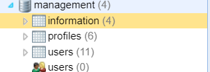

  * 文档

    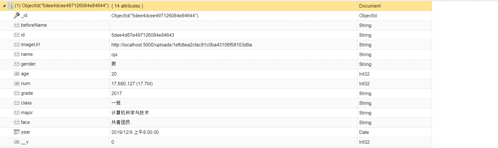

## 新建库

## 新建表结构

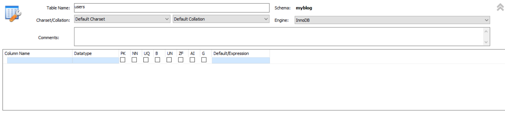

### 建表时常用的数据类型

* `INT` 大整数值
* `BIGINT`  极大整数值
* `VARCHAR(N)`  变长字符串（长度为N）
* `TEXT`  长文本数据
* `MEDIUMTEXT`  中等长度文本数据
* `LONGTEXT` 极大文本数据

### 字段类型标识说明

`PK：primary key` 主键
`NN：not null` 非空
`UQ：unique` 唯一索引
`BIN：binary` 二进制数据(比text更大)
`UN：unsigned` 无符号（非负数）
`ZF：zero fill` 填充0 例如字段内容是1 int(4), 则内容显示为0001
`AI：auto increment` 自增
`G: Generated Column mysql5.7`新特性：这一列由其他列计算而得

`Default：`默认值

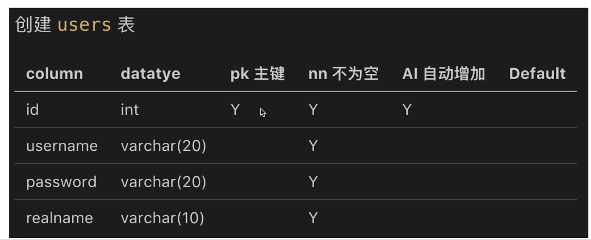

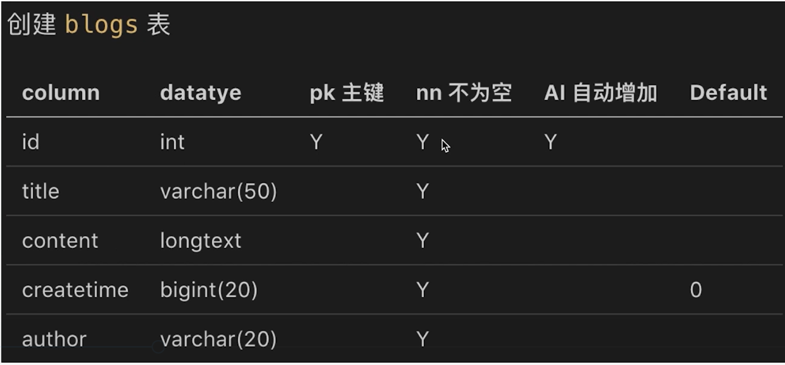

## 操作表

### 注释

```mysql
-- show tables
```

### 插入数据

```mysql
-- 插入数据('zhangsan', '123', '张三')到users表中，分别对应(username, `password`, realname)字段
-- password为关键字，因此使用``包裹
insert into users (username, `password`, realname) values('zhangsan', '123', '张三')
```

### 查询数据

```mysql
-- 尽量避免使用*，因为会耗费许多性能

-- 查询users表中的所有数据
   select * from users

-- 查询users表中，对应id，username字段的所有数据(只显示id、username字段的数据)
   select id, username from users;
   
-- 查询users表中，username字段为'zhangsan'的数据
   select * from users where username='zhangsan'

-- 查询users表中，username字段为'zhangsan'并且password字段为'123'的数据
   select * from users where username='zhangsan' and `password`='123';
   
-- 查询users表中，username字段为'zhangsan'或者password字段为'123'的数据
   select * from users where username='zhangsan' or `password`='123';
   
-- 模糊查询：查询users表中，username字段中包含'zhang'的数据
   select * from users where username like '%zhang%';
   
-- 查询结果排序：查询users表中，password字段中包含'1'的数据，并且根据id来排序
-- 默认为正序，在后面加上desc则为倒序
   select * from users where `password` like '%1%' order by id desc;
   
   
-- 查询数据总数
  select count(id) from blogs;
  
-- 给查询结果起个别名
  select count(id) as `count` from blogs;
  
  
-- 限制查询（分页查询）
-- 只查询最后两行
  select * from blogs order by id desc limit 2;
-- 跳过两行再查询两行
  select * from blogs order by id desc limit 2 offset 2;
```

### 更新数据

```mysql
-- 更新users表中，且username字段为'lisi'的记录中的realname为'李四2'
-- 注意：直接使用下面SQL语句可能会报错，可以先运行一次 SET SQL_SAFE_UPDATES=0;然后再运行下面的语句
   update users set realname='李四2' where username='lisi';
   
   update users set realname='李四2', password='123' where username='lisi';
```

### 删除数据

```mysql
-- 删除users表中，username字段为'lisi'的数据，通常不会使用这种方式进行删除数据操作
-- 注意：delete from users会将所有数据删除
   delete from users where username='lisi';


-- 通常我们要删除数据时，都是通过一个字段来标识数据是否可用，比如此处使用state字段来标识，设置默认值为'1'
-- state字段为'1'时为可用，为'0'时为不可用。称这种技术为软删除技术，该删除可以恢复，设置state字段为'1'

-- 查询users表中state为'1'的可用数据
   select * from users where state='1';
   
-- 查询state表中state不为'0'的可用数据
   select * from users where state<>'0';

-- 将lisi的state改为'0'，标识不可用，假装删除操作
   updata users set state='0' where username='lisi'; 
```

# 五、`nodejs操作MySQL`

## 简单示例

```javascript
// 导入mysql模块
const mysql = require("mysql");

// 连接数据库
const con = mysql.createConnection({
    host: "localhost",
    user: "root",
    password: "123654",
    database: "myblog"
});

// 开始连接
con.connect()

// 执行sql语句
const sql = 'select * from users;'
con.query(sql, (err, result) => {
  if (err) {
    console.log(err);
    return
  }
  console.log(result)
})

// 关闭连接
con.end()
```


## 常见报错问题

* `nodejs`连接`mysql`数据库，报错Client does not support authentication protocol requested by server的解决方法

  ```bash
  报错原因：MySQL8.0版本的加密方式和MySQL5.0的不一样，连接会报错。
  
  1、登陆数据库
  mysql -uroot -p
  2、输入root的密码
  Enter password: ******
  3、更改加密方式
  mysql> ALTER USER 'root'@'localhost' IDENTIFIED BY 'password' PASSWORD EXPIRE NEVER;
  4、更改密码：该例子中 123456为新密码
  mysql> ALTER USER 'root'@'localhost' IDENTIFIED WITH mysql_native_password BY '123456';
  5、刷新：
  mysql> FLUSH PRIVILEGES;
  ```

  

# 六、登录

## 登录校验

### cookie

* 什么是`cookie`

  * 存储在浏览器的一段字符串（最大`5KB`）
  * 跨域不共享
  * 格式如`k1=v1;k2=v2`；因此可以存储结构化数据
  * 每次发送`http`请求，会将请求域的`cookie`一起发送给`server`
  * `server`可以设置`cookie`并返回给浏览器

* `JavaScript`操作`cookie`（有限制），浏览器查看`cookie`

  * 请求头中可以查看到cookie

  * 可以通过`document.cookie`访问到`cookie`
  * `Application中的Cookies`

* `server`端操作`cookie`，实现登录验证

  * 通过`req.headers.cookie`可以获取到传过来的`cookie`

  * 通过`res.setHeader('Set-Cookie', 'k1 = v1; k2 = v2')`来设置`cookie`

    ```javascript
    // 通过在后面添加httpOnly，限制cookie只允许后端修改
    // 同时也可以添加expires来设置cookie过期时间
    res.setHeader('Set-Cookie', 'username=ljw; path=/; httpOnly;expires=time') 
    ```

    

### `session`

`cookie`存在的问题：cookie会暴露一些敏感信息，很危险

解决方法：在`cookie`中存储一个`sessionID`，该`sessionID`在`server`端获取对应`session`中的数据

如果单纯的把`session`以变量的形式存放在`nodejs`进程中，会存在一些问题：

* 第一，进程内存优先，访问量过大，内存会暴增，可能导致程序崩溃
* 第二，正式线上运行是多进程，进程之间内存无法共享

上述`session`中存在的问题，我们可以通过`redis`来解决，将`session`存放到`redis`中

## `redis`

[安装部署教程](https://blog.csdn.net/liangxw1/article/details/82864581)

* `web server`最常用的缓存数据库，数据存放在内存中
* 相比于`mysql`，访问速度快（内存和硬盘不是一个数量级的）
* 但是成本更高，可存储的数据量更小（内存的硬伤）

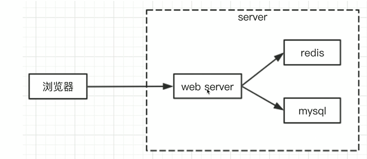

### 为何`session`适合用`redis`

* `session`访问频繁，对性能要求极高
* `session`可不考虑断点丢失数据的问题（内存的硬伤）
* session数据量不会太大（相比于`mysql`中存储的数据）

### 为何网站数据不适合用`redis`

* 操作频率不是太高（相比于`session`操作）
* 断电不能丢失，必须保留
* 数据量太大，内存成本太高

## `nodejs操作redis`

### 简单示例

```javascript
const redis = require('redis')

// 创建客户端
const redisClient = redis.createClient(6379, '127.0.0.1')
redisClient.on('error', err =>{
  console.log(err)
})

redisClient.set('myname', 'zhangsan2', redis.print)
redisClient.get('myname', (err, val) => {
  if (err) {
    console.error(err)
    return
  }
  console.log('val', val)

  // 退出
  redisClient.quit();
})
```

# 七、`nginx`

* 高性能的`web`服务器，开源免费

* 一般用于做静态服务、负载均衡

* 反向代理

  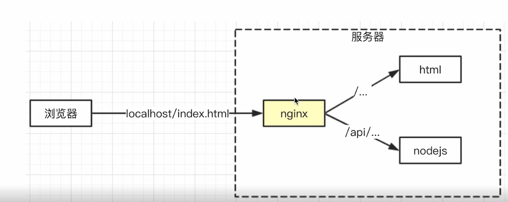

  [正向代理和反向代理的区别](https://blog.csdn.net/liuhenghui5201/article/details/90720442)

## `nginx命令`

```bash
# 测试配置文件格式是否正确
nginx -t
# 启动
nginx；
# 重启
nginx -s reload
# 停止
nginx -s stop
```

## `nginx`配置

[nginx环境变量配置](https://blog.csdn.net/rightbeforethesix/article/details/93175086)

> 此处以我个人的阿里云服务器为例，并且在`root`用户下进行演示。若找不到`nginx`位置，可使用`whereis nginx`命令进行查找

使用以下命令对`nginx`进行配置

```bash
vi /usr/local/nginx/conf/nginx.conf
```

```bash
#user  nobody;
# 此处CPU为几核，则为几
worker_processes  1;

#error_log  logs/error.log;
#error_log  logs/error.log  notice;
#error_log  logs/error.log  info;

#pid        logs/nginx.pid;


events {
    worker_connections  1024;
}


http {
    include       mime.types;
    default_type  application/octet-stream;


    sendfile        on;
    #tcp_nopush     on;

    #keepalive_timeout  0;
    keepalive_timeout  65;

    #gzip  on;

    server {
        # 监听端口
        listen       80;
        server_name  localhost;
        
        location / {
          #如果请求以/开头，则代理到http://localhost:8080;（以实际情况而定）
        	proxy_pass http://localhost:8080;
        }
        
        location /api/ {
        	#如果请求以/api/开头，则代理到http://localhost:5000;（以实际情况而定）
        	proxy_pass http://localhost:5000;
        	proxy_set_header Host $host;
        }


        error_page   500 502 503 504  /50x.html;
        location = /50x.html {
            root   html;
        }

    }

}
```

### `nginx`的反向代理服务配置

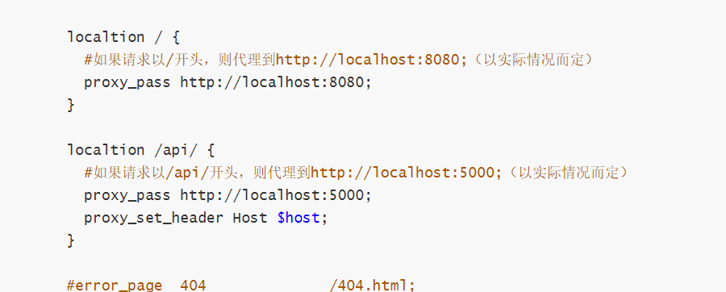


# 八、日志

* 系统没有日志，就等于人没有眼睛
* 自定义日志（包括自定义事件、错误记录等）
* 日志应该存储文件中（`nodejs`文件操作， `nodejs stream`）
* 日志功能开发和使用
* 日志文件拆分，日志内容分析

## `nodejs`文件操作

注意：`nodejs`文件操作默认情况下是异步的

### `IO`操作的性能瓶颈

* `IO`包括“网络`IO`”和“文件`IO`”
* 相比于`CPU`计算和内存读写，`IO`的突出特点就是：慢！
* 如何在有限的硬件资源下提高`IO`的操作效率

### `stream`

`nodejs`中，网络请求和响应都具有流的特性

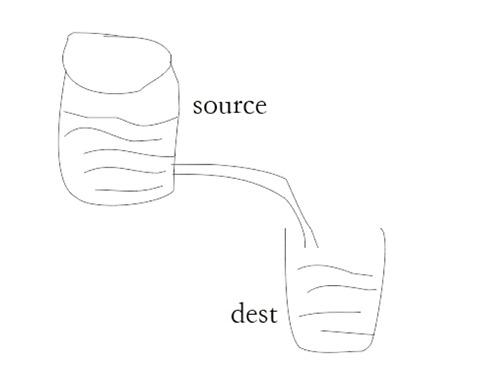

```javascript
// 标准输入输出，pipe就是管道（符合流水管道的模型图）
// process.stdin获取数据，直接通过管道传递给process.stdout进行输出
process.stdin.pipe(process.stdout)


// 下面代码实现功能：用户通过post请求传递什么数据，就立马返回什么数据给用户
const http = require('http')
const server = http.createServer((req, res) => {
  if (req.method === 'POST') {
    // `nodejs`中，网络请求（request）和响应（response）都具有stream（流）的特性
    req.pipe(res)
  }
});
server.listen(8000)


// 文件拷贝
const fs = require('fs')
const path = require('path')

let fileName1 = path.resolve(__dirname, 'data.txt')
let fileName2 = path.resolve(__dirname, 'data-bak.txt')
// 读取文件的stream对象
let readStream = fs.createReadStream(fileName1)
// 写入文件的stream对象
let writeStream = fs.createWriteStream(fileName2)
// 执行拷贝
readStream.pipe(writeStream)
// 数据读取完成，即完成拷贝
readStream.on('end', () => {
  console.log('拷贝完成')
})
```

**通过流的方式接受数据，每次接受到数据，都会触发data事件，进行数据接收**

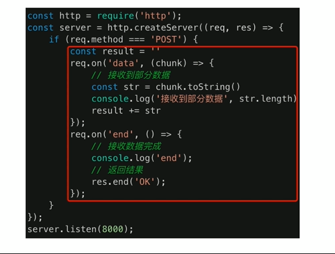

**通过流的方式拷贝文件**

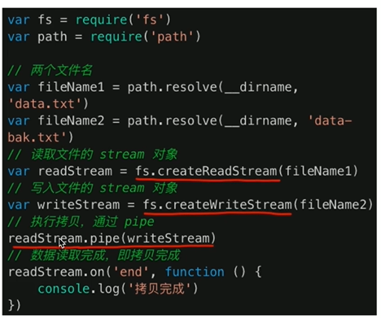

**通过网络请求读取文件内容，响应给用户**

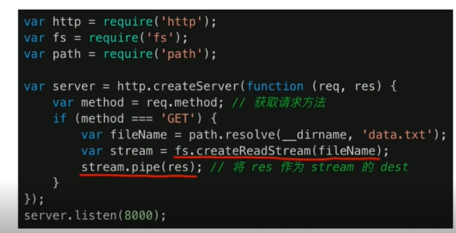

## 写日志

```javascript
//  src/utils/log.js

const fs = require('fs')
const path = require('path')

// 写日志
function writeLog (writeStream, log) {
  writeStream.write(log + '\n')  //关键代码 
}

// 生成write Stream
function createWriteStream (fileName) {
  // 获取日志文件地址
  const fullFileName = path.join(__dirname, '../', '../', 'logs', fileName)
  const writeStream = fs.createWriteStream(fullFileName, {
    flags: 'a' // 追加内容，而非覆盖
  })
  return writeStream
}

// 写访问日志
const accessWriteStream = createWriteStream('access.log')
function access (log) {
  writeLog(accessWriteStream, log)
}

module.exports = {
  access
}
```

```javascript
// App.js

// 获取日志写入函数
const { access } = require('./src/utils/log')

// 记录 access log（访问日志）
access(`${req.method} -- ${req.url} -- ${req.header['user-agent']} -- ${Date.now()}`)
```

## 日志拆分

* 日志内容会慢慢积累，放在一个文件中不好处理
* 按时间划分日志文件，如`2019-02-10.access.log`
* 实现方式：`linux`的`crontab`命令，即定时任务

### `crontab`

* 设置定时任务，格式：`***** command` ----- `分钟小时日期月份星期command` （command为要执行的命令）

* 将`access.log`拷贝并重命名为`2019-02-01.access.log`
* 清空`access.log`文件，继续积累日志

```bash
# 在utils中新建copy.sh文件

#!/bin/sh
# 此处具体地址根据实际项目目录地址而定
cd ~/online
# $(data + %Y-%m-%d)为当前日期
# 拷贝access.log文件，并将得到的文件1命名为$(data + %Y-%m-%d).access.log
cp ~/online/logs/access.log ~/online/logs/$(date +%Y-%m-%d).access.log
# 清空access.log文件
echo "" > ~/online/logs/access.log
```

```bash
# 使用命令对crontab进行编辑
crontab -e

# 输入要执行的操作
# 每天第0个小时，执行bash ~/online/utils/copy.sh
* 0 * * * bash ~/online/utils/copy.sh

# 查看当前存在的任务
crontab -l
```

## 日志分析

* 如针对`access.log`日志，分析Chrome的占比
* 日志是按行存储的，一行就是一条日志
* 使用`nodejs`的`readline`（基于`stream`，效率高）

```javascript
const fs = require('fs')
const path = require('path')
const readline = require('readline')

// 文件名
const fileName = path.join(__dirname, '../', '../', 'logs', 'access.log')
// 创建read stream
const readStream = fs.createReadStream(fileName)

// 创建readline对象
const rl = readline.createInterface({
  input: readStream
})

let chromeNum = 0;
let sum = 0;

// 逐行读取
rl.on('line', (lineData) => {
  if (!lineData) {
    return
  }
  // 记录总行数
  sum++
  const arr = lineData.split('--')
  if (arr[2] && arr[2].indexOf('Chrome') > 0) {
    // 累加Chrome数量
    chromeNum++;
  }
})

rl.on('close', () => {
  console.log('chrome占比:' + chromeNum / sum)
})
```

## 总结

* 日志对server端的重要性，相当于人的眼睛
* `IO`性能瓶颈，使用`stream`提高性能，`nodejs`中如何操作
* 使用`crontab`拆分日志文件，使用`readline`分析日志内容

# 九、安全

* `SQL`注入：窃取数据库内容
* `XSS`攻击：窃取前端的`cookie`内容
* 密码加密：保障用户信息安全（重要！）
* `server`端攻击方式非常多，预防手段也非常多
* 有些攻击需要硬件和服务来支持（需要`OP`支持），如`DDOS`

## `SQL`注入

* 最原始、最简单的攻击，从有了`web2.0`就有了`SQL`注入攻击

* 攻击方式：输入一个`SQL`片段，最终拼接成一段攻击代码

  ```JavaScript
  // 服务端根据用户传递的username和password拼接sql语句
  sql = `
        select username, realname from users where username='${username}' and password='${password}'
  `
  
  // 用户通过输入一些特定的字符串，致使服务端中sql拼接错误
  username="lisan'--"
  password="123"
  
  // 服务端接受到用户信息之后拼接的sql语句,导致--后面的sql语句被注释了
  sql = "select username, realname from users where username='lisan'--' and password='123'"
  ```

* 预防措施：使用`MySQL`的`escape`函数处理输入内容即可

  ```javascript
    // 预防SQL注入攻击
    username = escape(username)
    password = escape(password)
  
    const sql = `
        select username, realname from users where username=${username} and password=${password}
    `
  ```

## `XSS`攻击

* 攻击方式：在页面展示内容中掺杂`js`代码，以获取网页信息

* 预防措施：转换生成`js`的特殊字符串

  ```bash
  // 安装xss工具
  npm install xss
  ```

  ```javascript
  // 对前端传过来的内容使用xss函数即可
  const xss = require('xss')
  
  xss(blogData.title)
  ```

  

## 密码加密

* 万一数据库被用户攻破，最不应该泄露的就是用户信息
* 攻击方式：获取用户名和密码，再去尝试登录其他系统
* 预防措施：将密码加密，即使拿到密码也不知道明文

```javascript
// 秘钥 crypto为nodejs提供的模块
const crypto = require('crypto')

// 密钥（要对该密钥保密）
const SECRET_KEY = 'WJiol_8776#'

// 加密
function md5 (content) {
  let md5 = crypto.createHash('md5')
  return md5.update(content).digest('hex')
}

function genPassword (password) {
  const str = `password=${password}$key=${SECRET_KEY}`
  return md5(str)
}

module.exports = {
  genPassword
}
```

# 十、原生开发课程总结

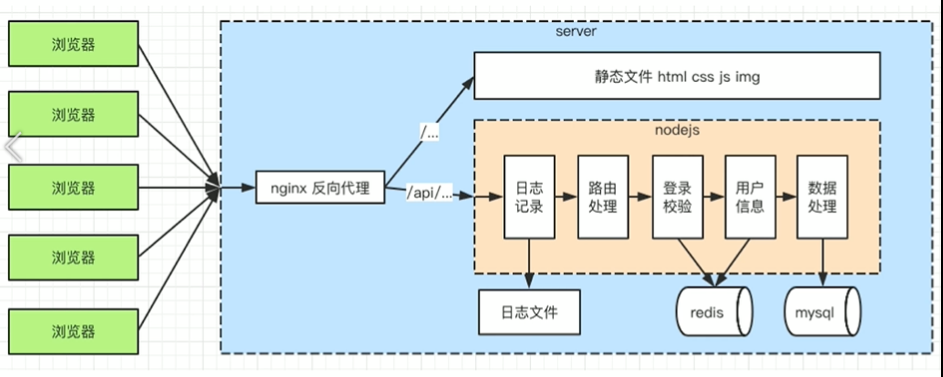

* 开发了哪些模块，完整的流程
  * 处理http接口
  * 连接数据库
  * 实现登录
  * 安全
  * 日志
* 用到了哪些核心知识点
  * `http、nodejs处理http、处理路由、mysql`
  * `cookie、session、redis、nginx反向代理`
  * `sql注入、xss攻击、加密`
  * `日志、stream、crontab、readline`
* 回顾server和前端的区别
  * 服务稳定性（`pm2`）
  * 内存`CPU`（优化扩展）
  * 日志记录
  * 安全（包括登录校验）
  * 集群和服务拆分（设计已支持）

# 十一、使用`express`

## `express`介绍

### 安装

使用脚手架`express-generator`

* `npm install express-generator -g`全局安装`express`脚手架

* `express express-test`  生成项目
* `npm install` 安装依赖
* `npm start`运行项目

### 中间件

参考`express-test`文件内容

### 总结

* 初始化代码中，各个插件的作用
* `express`如何处理路由
* `express`中间件

## `express`开发接口

### 登录

`session存储到redis（express-session和connect-redis的使用）`

* ```javascript
  //  ./db/redis
  
  const redis = require('redis')
  
  // 创建客户端
  const redisClient = redis.createClient(6379, 127.0.0.1)
  redisClient.on('error', err => {
    console.log(err)
  })
  
  module.exports = redisClient;
  ```

  ```javascript
  // app.js
  
  const session = require('express-session')
  const RedisStore = require('connect-redis')(session)
  const redisClient = require('./db/redis')
  
  
  const sessionStore = new RedisStore({
    client: redisClient
  })
  // 查看该cookie存储的connect.sid是否存在于session中，如果存在则获取session给req.session，
  // 否则生成一个cookie，返回给用户，同时将session赋值为{cookie: {...}} (cookie的一些配置)
  app.use(session({
    secret: 'WJiol#23123_', // 提供一个类似于密钥的作用
    cookie: {
      path: '/', // 默认为'/'
      httpOnly: true,  // 默认为true
      // 过期时间为24小时后
      maxAge: 24 * 60 * 60 * 1000
    },
    store: sessionStore // // 会将session自动存储到redis中（该session会包含COOkie的内容）
  }))
  ```

  [简单示例](https://segmentfault.com/a/1190000008276009?utm_source=tag-newest)

* `req.session`保存登录信息，登录校验做成`express`中间件

[express-session的使用](https://www.cnblogs.com/loaderman/p/11506682.html)

## `morgan`写日志

```JavaScript
// app.js
var logger = require('morgan');
var fs = require('fs')

// 使用morgan日志插件
// 第一个参数规定格式（有多种格式选择，如果是线上环境，我们选择'combined'）
// 第二个参数相关配置
const ENV = process.env.NODE_ENV
if (ENV !== 'production') {
  // 开发环境
  app.use(logger('dev'));
} else {
  // 线上环境
  const logFileName = path.join(__dirname, 'logs', 'access.log')
  const writeStream = fs.createWriteStream(logFileName, {
    flags: 'a'
  })
  app.use(logger('combined', {
    stream: writeStream  // 将日志写入到access.log文件中
  }))
}
```

## 总结

* 写法上的改变，如`req.query、req.body、res.json`
* 使用`express-session、connect-redis`，登录中间件
* 使用`morgan`

# 十二、`express`中间件原理

## 分析

* `app.use、app.get、app.post`用来注册中间件，先收集起来
* 遇到`http`请求，根据`path和method`判断触发哪些
* 实现`next`机制，即上一个通过`next`触发下一个

## 简单实现`express`中间件原理

具体可见`lib/express/like-express.js`

```javascript
const http = require('http')
const slice = Array.prototype.slice

class LikeExpress {
  constructor () {
    // 存放中间件的列表
    this.routes = {
      all: [],
      get: [],
      post: []
    }
  }
  register (path) {
    const info = {}
    if (typeof path === 'string') {
      // 当显式的传入路由地址时
      info.path = path
      // 从第二个参数开始，转换为数组，存入stack
      info.stack = slice.call(arguments, 1)
    } else {
      info.path = '/'
      // 从第二个参数开始，转换为数组，存入stack
      info.stack = slice.call(arguments, 0)
    }
    return info
  }
  use () {
    const info = this.register.apply(this, arguments)
    this.routes.all.push(info)
  }
  get () {
    const info = this.register.apply(this, arguments)
    this.routes.get.push(info)
  }
  post () {
    const info = this.register.apply(this, arguments)
    this.routes.post.push(info)
  }
  match (method, url) {
    // 存储可用的中间件
    let stack = []
    if (url === '/favicon.ico') {
      return stack
    }

    // 获取routes
    let curRoutes = []
    // 添加use注册的中间件
    curRoutes = curRoutes.concat(this.routes.all)
    // 添加get/post注册的中间件
    curRoutes = curRoutes.concat(this.routes[method])
    curRoutes.forEach(routeInfo => {
      if (url.indexOf(routeInfo.path) === 0) {
        // 注意此处只适合app.use处理情况
        // url === 'api/get-cookie' 时，不应该执行app.get('/api')中的中间件
        // 而在此处我们忽略了以上情况，因此该代码时十分不完善的
        
        // url === '/api/get-cookie' 且 'routeInfo.path === '/'
        // url === '/api/get-cookie' 且 'routeInfo.path === '/api'
        // url === '/api/get-cookie' 且 'routeInfo.path === '/api/get-cookie'
        stack = stack.concat(routeInfo.stack)
      }
    })
    return stack
  }
  // 核心的next机制
  handle (req, res, stack) {
    const next = () => {
      // 从头获取匹配的中间件
      const middleware = stack.shift()
      if (middleware) {
        // 执行中间件函数
        // 如果在middleware中，执行了next函数，那么将会再次执行该next方法
        // 以此执行stack，并最终执行完stack中所有函数，退出
        middleware(req, res, next)
      }
    }
    next()
  }
  callback () {
    return (req, res) => {
      // 定义res.json方法
      res.json = (data) => {
        res.setHeader('Content-type', 'application/json')
        res.end(JSON.stringify(data))
      }
      const url = req.url
      const method = req.method.toLowerCase()

      // 匹配可用的中间件列表
      const resultList = this.match(method, url)
      this.handle(req, res, resultList)
    }
  }
  listen (...args) {
    // 创建http服务
    const server = http.createServer(this.callback())
    server.listen(...args)
  }
}

// 工厂函数
module.exports = () => {
  return new LikeExpress()
}
```

# 十三、`Koa2`框架使用

* `express`中间件是异步回调，`Koa2`原生支持`async/await`
* 新开发框架和系统，都开始基于`Koa2`，例如`egg.js`
* `express`虽然未过时，但是`Koa2`肯定是未来趋势

## `async/await`要点

* `await`后面可以追加`promise`对象，获取到`resolve`的值
* `await`必须包裹在`async`函数里面
* `async`函数执行返回的也是一个`promise`对象
* `try-catch`截获`promies`中的`reject`的值

## 介绍`Koa2`

### 安装

使用脚手架`koa-generator`

* `npm install koa-generator -g`全局安装`koa`脚手架

* `koa2 koa2-test`  生成项目
* `npm install` 安装依赖
* `npm run dev`运行项目

## 路由介绍

### 登录

安装`koa-generic-session、 koa-redis、redis`插件，作用与express中一样

```JavaScript
//  ./conf/db.js

const env = process.env.NODE_ENV // 环境参数

// 配置
let REDIS_CONF

if (env === 'dev') {

  // redis
  REDIS_CONF = {
    port: 6379,
    host: '127.0.0.1'
  }
}

if (env === 'production') {
  // 在实际开发中，应该使用线上的实际配置
  // redis
  REDIS_CONF = {
    port: 6379,
    host: '127.0.0.1'
  }
}

module.exports = {
  REDIS_CONF
}
```

```javascript
// app.js

const session = require('koa-generic-session')
const redisStore = require('koa-redis')
const { REDIS_CONF } = require('./conf/db')

// session配置，提供一个类似于密钥的作用
app.keys = ['WJiol#23123_']
app.use(session({
  // 配置cookie
  cookie: {
    path: '/',
    httpOnly: true,
    maxAge: 24 * 60 * 60 * 1000
  },
  // 配置redis
  store: redisStore({
    // all: '127.0.0.1:6379'  // 暂时写死本地redis的server，线上根据实际情况而定
    all: `${REDIS_CONF}:${REDIS_CONF.port}`
  })
}))
```

## `koa-morgan`写日志

安装插件`npm i koa-morgan --save`

```javascript
// app.js
var morgan = require('koa-morgan');
var fs = require('fs')

// 使用koa-morgan日志插件
// 第一个参数规定格式（有多种格式选择，如果是线上环境，我们选择'combined'）
// 第二个参数相关配置
const ENV = process.env.NODE_ENV
if (ENV !== 'production') {
  // 开发环境
  app.use(morgan('dev'));
} else {
  // 线上环境
  const logFileName = path.join(__dirname, 'logs', 'access.log')
  const writeStream = fs.createWriteStream(logFileName, {
    flags: 'a'
  })
  app.use(morgan('combined', {
    stream: writeStream  // 将日志写入到access.log文件中
  }))
}
```

## `koa2`中间件原理

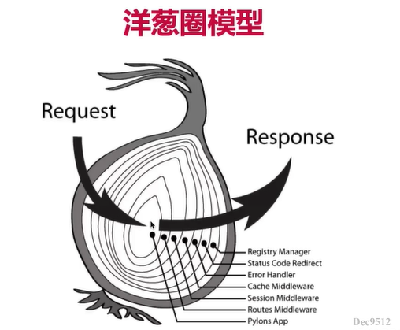

### 分析

* `app.use`用来注册中间件，先收集起来
* 实现next机制，即上一个用过next触发下一个
* 不涉及`method和path`的判断，因为`koa`不提供路由功能（使用`koa-router`插件）

### 简单实现`koa2`中间件原理

具体可见`lib/koa2/like-koa2.js`

```javascript
const http = require('http')

// 组合中间件
function compose (middlewareList) {
  return function (ctx) {
    function dispatch (i) {
      const fn = middlewareList[i]
      try {
        return Promise.resolve(fn(ctx, dispatch.bind(null, i + 1))) // 保证中间件返回的都是一个Promise对象
      } catch (err) {
        return Promise.reject(err)  // 保证中间件返回的都是一个Promise对象
      }
    }
    return dispatch[0]
  }
}

class LikeKoa2 {
  constructor () {
    this.middlewareList = []
  }

  use (fn) {
    this.middlewareList.push(fn)
    return this
  }

  createContext (req, res) {
    const ctx = {req, res}
    ctx.query = req.query
    return ctx
  }

  handleRequest (ctx, fn) {
    return fn(ctx)
  }

  callback () {
    const fn = compose(this.middlewareList)
    return (req, res) => {
      const ctx = this.createContext(req, res)
      return this.handleRequest(ctx, fn)
    }
  }

  listen (...args) {
    const server = http.createServer(this.callback())
    server.listen(...args)
  }
}

module.exports = LikeKoa2
```

# 十四、`PM2`

## 线上环境

* 服务器稳定性
* 充分利用服务器硬件资源，以便提高性能
* 线上日志记录

## `PM2介绍`

* 进程守护，系统崩溃自动重启
* 启动多进程，充分利用`CPU`和内存
* 自带日志记录功能

## `PM2使用`

* 下载安装

  ```bash
  npm install pm2 -g // 全局安装pm2
  
  pm2 --version
  ```

* `pm2`升级版本

  ```bash
  npm install pm2 -g // 不管是否已经安装过pm2，都应该先执行这条命令
  pm2 update // 将当前在运行的任务，迁移到新版的pm2上来
  ```

* 基本使用

  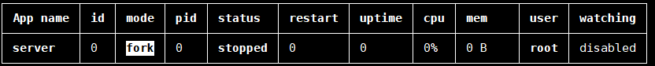

* 常用命令

  * `pm2 start ...` 

  * `pm2 list`

  * `pm2 restart <AppName>/<id>` 重启

  * `pm2 stop <AppName>/<id>` 停止

  * `pm2 delete <AppName>/<id>` 删除

  * `pm2 info <AppName>/<id>` 查看进程的基本信息

    * `script path：`当前进程所在目录
    * `error log path：`错误日志
    * `out log path：`自定义日志

    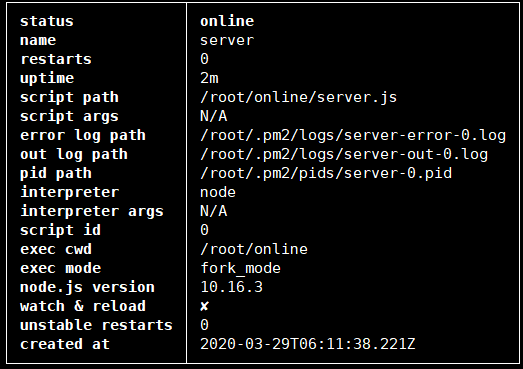

  * `pm2 log <AppName>/<id>`打印日志

  * `pm2 monit <AppName>/<id>`监控进程的CPU和内存信息等

## 配置文件

* 新建`PM2`配置文件（包括进程数量，日志文件目录等）
* 修改`PM2`启动命令，重启
* 访问`server`，检查日志文件的内容（日志记录是否生效）

```json
// pm2.conf.json

{
  "app": {
    "name": "pm2-test-server", // AppName
    "script": "app.js", // 启动文件
    "watch": true, // 监听文件变化自动重启，类似于nodemon
    "ignore_watch": [ // 哪些文件变化不会重启
      "node_modules",
      "logs"
    ],
    "instances": 4, // 配置多进程（几核就写几）
    "error_file": "./logs/err.log", // 自定义错误日志存放位置
    "out_file": "./logs/out.log", // console.log打印的内容存放位置
    "log_date_format": "YYY-MM-DD HH:mm:ss" // 每条日志都加上一个时间戳
  }
}
```

[PM2配置文件详解](https://www.jianshu.com/p/e2a929ea8cfd)

```json
// package.json
	  "prd": "cross-env NODE_ENV=production pm2 start app.js"改为
    "prd": "cross-env NODE_ENV=production pm2 start pm2.conf.json"
```


## 多进程

* 为何使用多进程

  * 操作系统限制一个进程的内存
  * 内存：无法充分利用机器全部内存
  * `CPU`：无法充分利用多核`CPU`的优势

  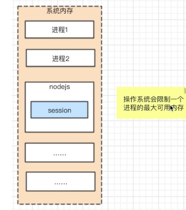

* 多进程和`redis`

  * 多进程之间，内存无法共享
  * 多进程访问一个`redis`，实现数据共享

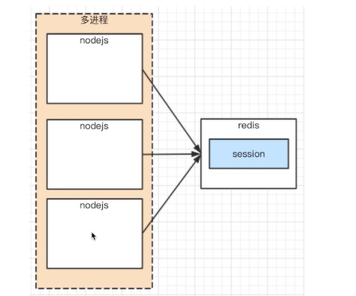

`npm run prd`

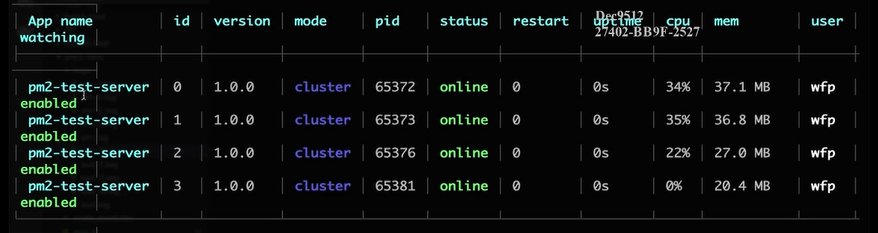

> `pm2`内置了负载均衡

