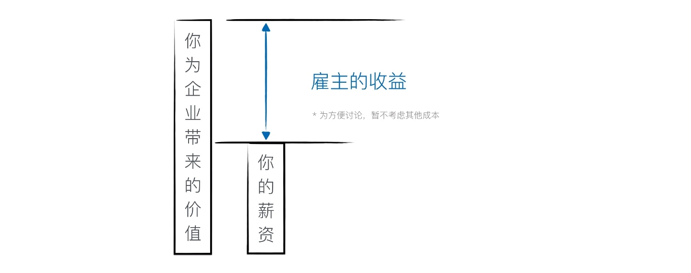
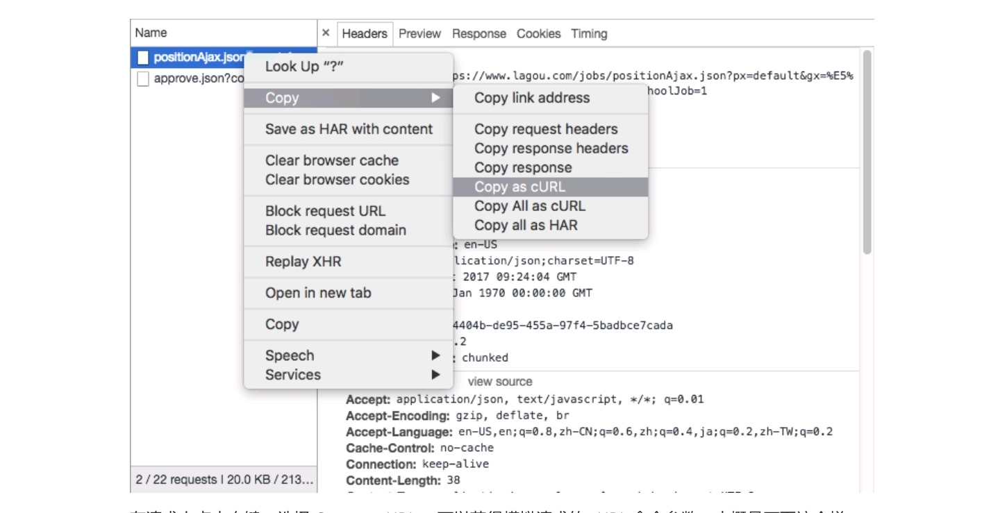
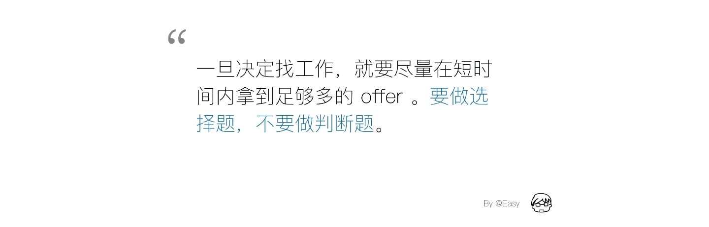

# 一、如何理解职业价值论

## 方法论

> 「求职」和「跳槽」我们虽然经常都在说，但却很少认真想过这些行为背后的意义。

在我决定自己写书之前，经常会有程序员遇到职业困扰来找我，我一般会给他们推荐一些职业书。

有一回我就遇到了一个认真的程序员，他记下了我推荐的书单，然后用一个长假买来读完了。假期过后，他又跑来找我，问了我一个问题。他说「这些书往往只告诉我要怎样怎样，却从来不告诉我为什么要这样。如果它解释不清楚这样做的意义，那凭什么我要相信它呢？仅仅是因为它的作者有名么？」


我仔细一想，发现他说得很有道理。从作者角度讲，要知其然才能触及本质，不然那些小技巧就流于表层；从读者角度讲，程序员天天和逻辑打交道，是一种逻辑动物，只有理解了求职到底是一种什么行为以后，才能做出有意义的行动。我当时没有回答出来，但这个问题就一直留在我脑子里，经过几年的思考，最后慢慢的形成了一套方法论。

这个方法论包含了三个工具。分别是：

*   ① 讲述原理的「职业价值论」
*   ② 展现行业职业概况和关键节点的「职业象限和路线图」
*   ③ 以及分析如何在职业节点移动的「职业画布」

顺便说一句，这种职业节点间的移动，其实就是我们常说的求职、内部转岗或者跳槽。


接下来的章节我们将重点讨论这三个工具。

## 价值论


> 价值论解决的问题就是，一个程序员应该值多少钱。

这是一个非常有意思的问题，我之前做人才拍卖服务的时候，经常问候选人说，你为什么觉得自己值这么多钱呢？

很多同学都说，我现在的薪资是怎样怎样啊、或者市场上同样工作年限的程序员都是多少多少呀。这些都没错，但都不算好答案，因为它还没有触及到本质，没有明白薪资到底是怎样的东西。

你想过老板为什么要雇用我们么？


老板之所以雇用我们，是想要我们给企业带来价值，说白了，就是直接或者间接的帮公司挣钱。

我们的薪资，一般是作为公司的人力成本。虽然控制成本很重要，但其实真正的重点却在「你为公司带来的价值」和「你的薪资」之间的差额。



所以当老板觉得「你的薪资高了」，其实是在说「你为公司带来的价值不够」。

当我们进入一家新公司的时候，由于没有实际工作的数据可以衡量，「你认为的你的价值」、「公司认为的你的价值」和最终「你给公司带来的实际价值」之间会存在一定误差。而简历和面试，就是为了让「你认为的你的价值」和「公司认为的你的价值」离得更近。


简历其实就是一个价值主张，它说的是：「我到这家公司来，能完成这些和那些工作，为公司带来这样和那样的价值，而我只要这么一点点的薪水，所以赶紧雇用我吧」。

### 改变思维方式很重要


总之，一定要改变「我上班别人给我钱」的思维方式，转换到「我能为这家公司创造什么价值」的方向上来。

这种换位思考能帮助你想明白很多事情，比如说：

**① 拥有一系列技能的同一个人，在不同的公司创造的价值往往是不同的，于是他能拿到的薪资也就不同。**

**② 公司雇佣一个人，并不是看他有多牛，而是看他能给公司带来哪些价值。**

虽然大部分情况下，个人能力和能给公司带来的价值是正相关的，但如果你能提出并证明一个更好的价值主张，你很可能就会比这个牛人更适合这家公司。

> 一个极端的例子是：一个顶级架构师在一家使用 ServerLess（无服务器端架构） 的创业公司很可能没有用武之地，而一个客户端高手在这家公司里可能能搞定一切。

### 其他因素

从整个求职市场来看，影响我们薪资的，除了「你能为公司创造的价值」也就是「人才的使用价值」本身，还会受到「市场供需」、「信息透明度」等因素的影响。

* * *

### 读者问答

问：「你为企业带来的价值」，这个自己怎么衡量，企业又是怎么衡量的？

> 答：未入职员工是你提价值主张，告诉企业你能提供哪些价值，通过简历、面试和笔试、以及试用期获得企业的认同，从而最终雇佣你。员工通过绩效系统来进行考量。自我价值一般是从之前工作经历和业绩的基础上估算的。

* * *

[下一篇试读：各种岗位上程序员的日常](https://juejin.im/book/59e17a7ff265da430629cc4e/section/59faea95f265da430d575a22)

# 二、市场供需


当一个岗位供大于求时，招聘方就有了更多的砝码来压低薪资，从而获取更多的剩余价值；而当一个岗位供小于求时，候选人就有了更多的选择，也就更值钱。

一个岗位的供求从长远来讲，是受行业和技术发展影响的，比如随着网络的大规模发展，同样是从事软件开发工作，传统软件的开发岗位就没有互联网和移动开发岗位的需求量大；而从短期来讲，每一波浪潮带来的新兴市场和高利润的行业交叉细分市场职位就会更值钱一些。

行业和技术发展趋势我们后边留了一个独立问题来讨论；这里先重点说说细分市场和新兴市场两种求职策略。

## 针对供需的求职策略

「专注细分市场」和「专注新兴市场」是最常见的两种求职策略。其中「专注细分市场」是通过削减宽度来提升深度的求职策略；「专注新兴市场」则是利用技术边界的变动来拉平经验差距的求职策略。

### 专注细分市场

细分市场是指整个市场的一小块，我们把原本用来覆盖整个市场的精力，用到这一小块上，来让我们在这个细分的领域里做得比别人更好。

这通常是行业和技术的一个交叉点，我们之所以能在这个市场上比其他人做得更好，是因为我们拥有适应这个细分市场的行业知识、行业技能和行业技术。这些行业相关的东西和通用技能 CrossOver ， 从而形成了我们独有的竞争力。

> 通俗一点的例子比如，「比我漂亮的没我聪明，比我聪明的没我漂亮」，这就是一个非常独特的细分定位。

在细分市场里边因为招聘方的选择并不是那么多，而我们的优势又足够的明显，所以通常会有很好的竞争力。

但是，我们将所有精力都投入到细分市场之前，要仔细考量这个细分市场的大小和发展，因为如果这个市场非常小，那么招聘方数量可能也就不够，尤其是对没有在北上广的同学来说，机会就非常少。这是专注细分市场策略需要注意的地方。

### 专注新兴市场

新兴市场也是一个有意思的策略。它只是说，当一个新技术出来的时候，原来的技术边界会发生变动。原来不能做的事情变得能做了，原来的一些规则和经验变得不再那么好用了。

所以呢，这是一个非常好的新人切入的机会。因为老人积累的经验很可能很大部分不适用了；这样我们和老人之间的差距就变小了。把握住这个差距，然后再勤奋一点，就可以在这些新兴市场上获得强竞争力。

比如 iOS 刚出来的时候如果适时跟进，你的竞争力可以在很短时间内赶上甚至超过那些用 J2ME 开发功能机的资深工程师。

最简单的判断一个新兴市场是否靠谱的方式，其实是看资本流入的速度。这个比较反直觉，大家都觉得资本是泡沫，但事实上，资本是很精明的。即使抛开最后这些方向能不能成功，单是资本的涌入，就会催生大量的公司，而这些公司就会大量的招人。然后就会在短时间内造出一个非常大量的需求，而供应端往往还非常小。所以不管资本带来的是不是泡沫，这些岗位的薪水都会水涨船高。

回过头来看，资本催生的高薪职位和方向，从云计算、移动开发，再到直播、区块链、人工智能，最先涉足这些领域的程序员们薪资都没有低过。退一步讲，一个行业没了，你在里边两三年挣到的钱是在那些稳定的行业挣到的三倍五倍，那也不亏吧。

新兴市场也是小市场，但对个人来讲，只要在里边做得足够好的话，总是能找到一些好机会的。除市场容量外，还会遇到 **早期技术接口不稳定** 和 **生态不成熟** 之类的问题，会带来额外的工作量和重复劳动。比如 Swift 的各个版本都有「轻微」的不兼容。


# 三、对供需进行量化分析

当然，除了这种面向整个行业和技术方向的定性分析，我们还可以通过工具来做定量分析。

## 量化分析

招聘网站的招聘启事中包含了大量的信息，只不过因为数据量较大，全部浏览下来往往会耗费大量时间。然而对于程序员来说，这都不叫事对吧。

这里我们以[拉勾网](https://www.lagou.com/)为数据源，来演示下如何通过数据来分析或者证实我们猜想。

> 拉勾网覆盖了20多万家互联网公司，在一二线城市的职位充足，算是不错的数据源。

最近有一些培训机构推出了面向初学者的免费培训课程，这本来是好事，但它们忽悠说，只要花几周学会 HTML5 ，就能找到工作。那么我们就来看看，只会 HTML5 到底能不能找到工作。

### 搜索结果在说话

在进行编码抓取数据之前，我们应该先确认下数据的量级，所以我们先搜索一把。先看看全国范围内，面向应届生的 HTML5 工作岗位，只有七个。

> 为什么要选择应届？因为培训完的同学也没有1~3年工作经验呀。


这也太少了，那么会不会是 HTML5 这个关键词的问题？我们再来试试 HTML 好了。


一样，看来拉勾做过同义词合并了。再来看看实习岗位：


更少一点，只有五个。这说明只会 HTML5 是找不到工作的，HTML5 只是前端岗位技能的一小部分，单是一个入门培训是完全不够的，如果要胜任前端岗位，我们还需要学习更多的东西。

### 前端到底要会什么？

那么，企业对应届的前端岗位的需求到底是什么？先搜一下。


总共有160个岗位，还算不错。这时候我们就不一个个去浏览了，该使用我们的技能了。思路是，先把包含这些岗位的全部页面抓下来，然后把每个职位的信息提取并保存为 JSON 。最后按需要分析统计这些 JSON 数据，就能得出我们需要的最终数据。

#### 通过 Chrome DevTools 查找数据源

打开 Chrome 的 DevTools 面板，切换到 Network > XHR 选项下（这样可以过滤掉无关请求），然后对满足我们要求的搜索页面进行翻页。


我们可以发现，数据就存在于下边这个 URL 里边：

```
https://www.lagou.com/jobs/positionAjax.json?px=default&gx=%E5%85%A8%E8%81%8C&needAddtionalResult=false&isSchoolJob=1
```

仔细观察它的 Header 会发现参数是通过 POST 请求发送过去的：


其中 pn 就是页数，我们这里总共有 11 页。

#### 通过构造请求抓取数据



在请求上点击右键，选择 Copy as cURL ，可以获得模拟请求的 cURL 命令参数。大概是下面这个样子。

```
curl 'https://www.lagou.com/jobs/positionAjax.json?px=default&gx=%E5%85%A8%E8%81%8C&needAddtionalResult=false&isSchoolJob=1' -H 'Cookie: ...' -H 'Origin: https://www.lagou.com' -H 'X-Anit-Forge-Code: 0' -H 'Accept-Language: en-US,en;q=0.8,zh-CN;q=0.6,zh;q=0.4,ja;q=0.2,zh-TW;q=0.2' -H 'X-Requested-With: XMLHttpRequest' -H 'Accept-Encoding: gzip, deflate, br' -H 'Connection: keep-alive' -H 'Pragma: no-cache' -H 'User-Agent: Mozilla/5.0 (Macintosh; Intel Mac OS X 10_12_6) AppleWebKit/537.36 (KHTML, like Gecko) Chrome/61.0.3163.100 Safari/537.36' -H 'Content-Type: application/x-www-form-urlencoded; charset=UTF-8' -H 'Accept: application/json, text/javascript, */*; q=0.01' -H 'Cache-Control: no-cache' -H 'Referer: https://www.lagou.com/jobs/list_%E5%89%8D%E7%AB%AF?px=default&gx=%E5%85%A8%E8%81%8C&gj=&isSchoolJob=1&city=%E5%85%A8%E5%9B%BD' -H 'X-Anit-Forge-Token: None' --data 'first=false&pn=1&kd=%E5%89%8D%E7%AB%AF' --compressed
```

我们只需要将 pn 参数替换，然后请求11次，就可以获得全部的职位数据了。

> 以下的内容均使用 PHP 来实现，逻辑很简单，如果你是合格的程序员，应该很轻松就能将其改写成自己想要的语言实现。

下边是实现的 PHP 代码（需要建立data目录，根目录要可写，PHP7.1 测试通过）：

```
<?php

for( $i = 1 ; $i <= 11 ; $i++ )
{
    $data = shell_exec("curl 'https://www.lagou.com/jobs/positionAjax.json?px=default&gx=%E5%85%A8%E8%81%8C&needAddtionalResult=false&isSchoolJob=1' -H 'Cookie:...' -H 'Origin: https://www.lagou.com' -H 'X-Anit-Forge-Code: 0' -H 'Accept-Language: en-US,en;q=0.8,zh-CN;q=0.6,zh;q=0.4,ja;q=0.2,zh-TW;q=0.2' -H 'X-Requested-With: XMLHttpRequest' -H 'Accept-Encoding: gzip, deflate, br' -H 'Connection: keep-alive' -H 'Pragma: no-cache' -H 'User-Agent: Mozilla/5.0 (Macintosh; Intel Mac OS X 10_12_6) AppleWebKit/537.36 (KHTML, like Gecko) Chrome/61.0.3163.100 Safari/537.36' -H 'Content-Type: application/x-www-form-urlencoded; charset=UTF-8' -H 'Accept: application/json, text/javascript, */*; q=0.01' -H 'Cache-Control: no-cache' -H 'Referer: https://www.lagou.com/jobs/list_%E5%89%8D%E7%AB%AF?px=default&gx=%E5%85%A8%E8%81%8C&gj=&isSchoolJob=1&city=%E5%85%A8%E5%9B%BD' -H 'X-Anit-Forge-Token: None' --data 'first=false&pn=" . $i . "&kd=%E5%89%8D%E7%AB%AF' --compressed");

    $data_array[] = json_decode( $data ,  1 );
    $fname = 'data/' . time() . '.txt';
    file_put_contents( $fname ,  $data );

    echo "SAVED ...$i 😀 \r\n";
}

file_put_contents( 'all.json' ,  json_encode( $data_array , JSON_PRETTY_PRINT | JSON_UNESCAPED_UNICODE ) );
echo " DONE 🤠";
```

最终在 all.json 文件中，我们得到了所有职位的信息，但是这些信息里边只包括了薪资范围，并没有技能要求。于是我们需要进一步的去抓取职位页面的信息。

观察 all.json 中的数组，发现职位数组位于 `$item['content']['positionResult']['result']` 部分，通过其属性 `positionId` ，我们可以构建职位页面的 URL ： `https://www.lagou.com/jobs/${positionId}.html`。

于是我们可以遍历 all.json 中的职位，来抓取对应的页面：

```
<?php

$data = json_decode( file_get_contents('all.json'), 1 );
$result = [];

foreach( $data as $item )
{
    if( $item['content']['positionResult']['result'] )
        $result = array_merge( $result , $item['content']['positionResult']['result']);
}

$i = 1;
$count = count($result);
foreach( $result as $item )
{
    $page_content = get_page_content( $item['positionId']);
    file_put_contents( 'pages/'.$item['positionId'].'.html' , $page_content );
    echo  $i . "/" . $count . " …… DONE " . " \r\n";
    $i++;
    sleep(1);
}

echo "ALL DONE";

function get_page_content( $pid )
{
    return shell_exec("curl 'https://www.lagou.com/jobs/" . $pid . ".html' -H 'Pragma: no-cache' -H 'Accept-Encoding: gzip, deflate, br' -H 'Accept-Language: en-US,en;q=0.8,zh-CN;q=0.6,zh;q=0.4,ja;q=0.2,zh-TW;q=0.2' -H 'Upgrade-Insecure-Requests: 1' -H 'User-Agent: Mozilla/5.0 (Macintosh; Intel Mac OS X 10_12_6) AppleWebKit/537.36 (KHTML, like Gecko) Chrome/61.0.3163.100 Safari/537.36' -H 'Accept: text/html,application/xhtml+xml,application/xml;q=0.9,image/webp,image/apng,*/*;q=0.8' -H 'Cache-Control: no-cache' -H 'Cookie:...' -H 'Connection: keep-alive' --compressed");
}
```

最后再通过正则表达式来分析这些页面中的包含的技术关键词的词频。严格的讲，要统计词频需要进行分词，不过绝大部分技术关键词都是英文的，这里我们简单粗暴的把英文单词提取出来排序。

> 在这种并不是经常进行的、只给自己看的分析工作中，可以更灵活的选择性价比。

```
<?php
foreach( glob( 'pages/*.html') as $file )
{
    echo $file ."\r\n";
    $content = file_get_contents(  $file );
    if( $words = get_info( $content ))
    {
        foreach( $words as $word )
        {
            $word = strtolower( $word );

            // 合并关键词
            if( $word == 'js' ) $word = 'javascript';
            if( $word == 'vuejs' ) $word = 'vue';
            if( $word == 'angularjs' ) $word = 'angular';
            if( $word == 'reactjs' ) $word = 'react';
            if( $word == 'node' ) $word = 'nodejs';
            if( $word == 'h5' ) $word = 'html5';
            if( $word == 'css3' ) $word = 'css';
            if( $word == 'css4' ) $word = 'css';

            if( !isset( $count[$word] ) ) $count[$word] = 1;
            else $count[$word] = intval($count[$word])+1;
        }
    }
    //break;
}

arsort( $count );
print_r( $count );


function get_info( $content )
{
    $reg = '/<dd\sclass="job_bt">(.+?)<\/dd>/is';
    if( preg_match($reg, strtolower($content) , $out ))
    {
        $out[1] = str_replace( ['&nbsp;','&amp'], [' ',' '] , $out[1] );
        $text = strip_tags($out[1]);
        return $words = get_tech_words( $text );
    }

    return false;
}

function get_tech_words( $string )
{
    // 提取英文单词
    $reg = "/([A-Za-z][0-9A-Za-z]+)/i";
    if( preg_match_all($reg, $string , $out ))
    {
        $ret = array_unique($out[0]);
        return $ret;
    }
}
```

然后我们就得到了招聘前端应届生的公司的精确的需求，虽然里边混有一些非技术关键词，我们可以很容易识别，算是无伤大雅了。

```
[javascript] => 152
[css] => 134
[web] => 101
[html5] => 74
[html] => 72
[react] => 56
[jquery] => 52
[vue] => 50
[nodejs] => 46
[angular] => 39
[ajax] => 35
[java] => 30
[php] => 30
[pc] => 25
[bootstrap] => 25
[http] => 24
[w3c] => 23
[webpack] => 22
[python] => 21
[ui] => 18
[app] => 17
[gulp] => 17
[git] => 16
[es6] => 15
[dom] => 14
[json] => 14
[xhtml] => 13
[github] => 12
[div] => 12
[xml] => 11
[mobile] => 11
[android] => 10
[native] => 10
...
```

可以看到 JavaScript 才是前端工程师的最大诉求；HTML/HTML5 加起来排名第二；然后是 CSS。接下来是几大框架：Vue 、React、jQuery、Angular；再然后是后端语言：Java、PHP、NodeJS。

这对应届生的指导意义非常明显：JS、HTML、CSS 三大块是核心，必须学完才能找到工作（在157个职位里边出现了超过150次）；主流框架也是要掌握的，Vue 和 React 目前正在风头、jQuery 也还没老（超过三分之一的职位要求会其中一种）；后端语言是加分项，NodeJS 和前端最为契合，其次是 Java 和 PHP（近五分之一的职位有提到）。

[完整的列表我放到GitHub上了，可以点这里查看。](https://gist.github.com/easychen/adb5e364193f48d9db74a43a77b30a93)

从上边的例子举一反三，可以很容易的知道诸如「北京地区前端应届生的薪资范围」、「重庆招聘 PHP 的公司都在使用什么技术栈」这些非常具体的问题，从而为自己量身定制对应的面试攻略。

## 均值的意义

需要注意的是，平均值的参考价值非常有限，数据越多，它就离个体值越远。它就像股市的大盘，大盘涨了，你未必能挣钱，只有你买的股票涨了才行。所以应该尽可能具体的去分析数据。

每隔一段时间，也应该去其他公司面试下，面试谈下来的薪资，就是你这只股票的「交易价格」，是你能拿到手的真金白银。

# 四、信息透明度

## 信息透明度对求职的影响

市场供需虽然存在，但是我们不可能凭空地去接触到它。只有透过各种渠道，我们才能接触到这些供需。信息透明度就是关于这些渠道的。


当人才市场很小的时候，信息很容易透明，比如学校院系有个几个兼职岗位，只要贴个招聘启事在公告栏，然后大家都知道了。

但当这个信息量变得很大以后，可能就没有精力读完所有招聘启事了，这时候，信息就会出现不对称。

只有你知道的职位对你来讲才有意义。比如北京现在有100家公司都在前端，但你只知道其中三家，那其他九十七家公司对你而言都是没有意义的。如果你急需工作，即使这三家给你的薪资比其他公司低，你也就只能被迫接受了。这就是信息透明度对我们的影响。

### 要做选择题，不要做判断题



我们要学会和这种信息不对称做斗争。最基本的规则就是，一旦决定要找工作，就要争取在短时间内拿到大量的 offer ，这样才能做选择题，而不是做判断题。

所谓选择题，就是你手上有一堆 offer ，可以选择这家或者那家；所谓判断题，是说你现在手上就一个 offer ，你要么去要么不去。不是说你实力好就一定能做选择题，这里更多的是时间上的考量，如果你总是等到一家公司面完再去找另一家，你就只能一直做判断题了。这其实在信息上边吃了很大的亏。

## 渠道

说到这了，我们就顺便说一下渠道。一般来讲，求职渠道越多，信息就越透明。

### 渠道成本

但是渠道本身是有成本的，以招聘网站为例吧，虽然绝大部分招聘网站对求职者都是免费的，但每去一个新的招聘网站都要注册帐号呀、填写资料呀、上传简历呀，一堆的事情。如果要去十个招聘网站投简历，这些事情得做十遍，这就是渠道成本。

这是可见的，还有不可见的成本在后边，比如你个人的信息安全甚至人身安全。很多不知名的新兴招聘网站，以及一些年久失修的上市招聘网站，在招聘方验证上偷工减料，在用户信息保护上做得也不算好；再加上很多企业对简历的保密意识不足，接触的渠道越多，越存在资料泄漏的风险。前段时间不是还出现过因为找工作误入传销，最后不幸身亡的事情么。

但我们不能因哽废食呀，该投的简历还是要投的，首先要在脑子里对陌生人电话保持警惕；然后可以买一个备用号码找工作专用。

> 我强烈建议三五年没有更换手机号的同学去买张新的流量卡，既可以用于招聘、租房等高危事务，又可以为日常提供充足的廉价流量。很多和网站合作的流量卡都可以对常用的业务免流量，比如微博的V卡直播免流量、B站的22/33卡对视频免流量、腾讯的大王卡对QQ音乐等旗下服务免流量。即使超出流量，也可以拿到几块钱1G的便宜价格，非常划算。PS：这段不是广告，只是对运营商无视老用户的吐槽😭

### 渠道优劣

那么到底哪些渠道更好了？

从我的个人经验来讲：内推 > 拍卖 > 猎头 > 官网/招聘网站投递。但拍卖和猎头通常对工作多年的人来讲更为合适，对于新人而言，基本可以无视了。

内推是我认为的最优渠道，最理想的找工作方式就是你正好要找一份工作，而你正好有一个熟识的朋友在这家公司，他/她对你的实力很了解，于是向公司 HR 推荐了你。这种内推是效果最好的，除了是内部渠道，还有员工背书在。

另一种就是你本来不认识这家公司的人，但你也可以找这家公司的员工帮你内推。一方面，你可以得到一些非官方的信息，比如公司是否加班、老大是否靠谱、团队是否好相处；另一方面，推荐人虽然不认识你，但他/她可以阅读你的简历，判断是否适合自己团队，然后决定是否推荐，因为大部分公司都有推荐奖金，所以很多员工也是很乐意干这件事情的。

内推的简历，尤其是用人部门员工内推的简历，一般只要不出现某些重大负面因素，基本都能获得面试机会，非常好用。

除了可以在微博上搜索这些公司的员工，然后私信求推荐以外，多参加技术大会、多参与技术社区、多贡献开源项目，都可以扩展你的行业人脉。

但求人推荐之前要记得看看对应职位的基本要求，确定自己满足再求推荐；贡献的开源项目要有价值，力争能让大家都用起来，在 GitHub 画猫这种事情就没啥意思了。

我之前建过一个内推的微信群，但人满了。稍后会开放两个Q群，分别用于校招和社招岗位的内推。

# 五、如何理解四大象限和使用职业路线图

## 四大象限

《穷爸爸富爸爸》的作者罗伯特·清崎，从现金流向将工作分到了四个象限，从而总结出来了这么一张图。


这张图里边有四个象限。

其中左上角是「雇员象限」，帮别人挣钱；左下角是「SOHO象限」，为自己挣钱；然后右上角呢，它其实是一个「企业主象限」，在这里我们把它写成了「创业象限」，因为对程序员来讲，企业主象限通常都是技术创业相关的，都是让雇员挣钱；而右下角的就是投资象限，让钱挣钱。

我们只要把在每一个象限里边的对应的职业节点加上，再画出它们之间的流动方向，就构成了一张相对完整的职业路线图。接下来，我们就在每一个象限里边挨个看看这些节点，及其之间的流动情况。

### 雇员象限

首先是雇员象限，这个象限风险小，收入稳定，起步点也低，属于绝大部分人最开始所在的象限。

稳定既是它的好处，也是它的坏处。你做的好的话，也就是比平均薪资高个三倍五倍，但很不错啊，不少人能做到百万年薪，但是你想要做到千万年薪，就很难了。

在这个象限里边，大体分为管理线和专家线。

#### 管理线


我们先把管理线的节点给画出来了，管理线主要是跟人打交道。

最开始进来，你是一个开发，做一段时间能力提升了，就会变成高级开发、资深开发；然后再往上走，就要开始管人了，这个时候你会变成小组经理，也就 Team Leader。  
然后小组管得比较多了，然后如果上边有部门的话可能再往上晋升就是部门经理；没有部门的话，就直接总监了。总监之上是CTO，小公司的话，层级会更少一些。

这就是管理线的大致方向。之所以叫它管理线，是因为它主要依赖于你的管理能力。资深开发、高级开发岗位上，你就基本完成了对自己能力的提升；从小组经理开始，你的任务就变成怎么批量的复制自己的能力，尤其是小组经理和部门经理这种中层岗位，实际上核心任务就是不断地去招募新人，然后通过培训培养，团队协作等各种各样的办法把他们的能力变得和你一样好，从而批量的、稳定的为公司提供各种研发能力。

再往上走，就是总监和CTO的部分。除了要管人，可能更多要开始管理公司的技术相关的资源，比如服务器啊、机房啊、对外的技术联调合同啊，各种和技术相关的杂七杂八的事情。

CTO除了管这些，他毕竟是公司的高管嘛，很可能还要参与到公司的发展决策里边去。比如将来公司要怎么发展啊，在技术上怎么去做保驾护航啊，各种备选方案的技术可行性是什么样子的啊，研发资源是否够分配啊，进度怎么控制、质量怎么保障啊，诸如此类。

各个公司会有所不同，但大体来讲，这个管理线就是这些事情。但是如果你不想就是去管那些人啊，资源啊，也不想和人类天天打交道，我知道很多程序员就对人类不感兴趣，那你可以选择专家线。

#### 专家线


一般大一点的公司才有专家线，小公司的专家线都是和管理线混在一起的。走专家线，一样要至少要做到高级开发，先就把自己的能力提上来，对技术对行业要有足够的了解。

然后你可以选择公司发展中会遇到的、有相当难度的技术方向，进行潜心研究，等出成果以后，自然就成为了这个领域的行业专家、或者公司的科学家之类的。

你也可以选择管理海量的机器和服务，从而走向架构师职位，但架构师要求对各种解决方案都有所了解，从而进行择优，从后端和运维岗位发展过来更为自然。

当然你也可以选择成为行业大牛，这个就是传统意义上的「专家」了。比如很多做布道师，整天就出去开会呀、然后写写文章、搞搞自媒体，让公司在技术圈里边更有影响力，更容易招到程序员，所谓「千金买马骨」嘛。

#### 流动方向

那不管是专家线还是管理线，它都还在这个雇员象限，也就有雇员象限的天花板。虽然有个别的同学通过股票等方式获得了很大的回报，但大部分人的收入天花板还是明显的。

刚进入公司做开发的时候都还是小年轻，等做到小组经理、部门经理了，经济压力就慢慢来了，要买房啊、还要养家糊口啊、小孩要上幼儿园、以后要不要买学区房…

另外就是，越往上走，岗位就越少。尤其是稳定的大公司，人员流动少。管理线并不是你能力好就能上位的，之前位置上的人得走，你才有机会。

所以这个象限有大量的人流向的「创业象限」。

### 创业象限和投资象限


#### 明确创业意愿

首先，我想和大家聊聊程序员如何来参与创业这个事情。大部分人，可能是受媒体影响，对创业是有误解的。不少人都还以为创业就是很苦情的在一个出租房里边，不拿工资，天天加班加到死，然后突然之间就一夜成名，一鸣惊人天下，什么钱都有了。

实际上，现在创业并不是这个样子了，而且很可能从来就没有这样子过。

现在创业已经变成一个很普遍的事情，你去创业不一定非要怎么破斧成舟、卧薪尝胆。  
而且也不是说每一个创业的人，都要成为一个创始人、CEO，要从无到有的去建立自己的公司。

实际上，完全可以根据你创业的目标，在创业生态里选择一个最合适的位置。一般来说，我觉得可以有下边几种选择。

*   「我有一个无论如何都要做成的idea」：创始人/CEO founder
*   「我遇到了一个和我想法相同的人，我们决定一起做」：联合创始人 co-founder
*   「我很认可某人的想法，我有很好的能力，我想帮他」：合伙人 partner
*   「我觉得创业很有钱途，想赌一把」：已获投资公司的核心员工，有期权的那种
*   「我觉得创业很有意思，想体验下」：已获投资公司的早期员工，如果你不缺钱，那么没投资的公司也无所谓

把自己的创业意愿明确了，才好确定自己的在创业生态中的位置，才能管理好自己的付出和预期。

#### CEO 和 CTO 的技能鸿沟

别看 CEO 和 CTO 只差一个字母，但它们之间的技能要求是完全不同的。一般情况下，我是不推荐没有团队管理经验和市场营销经验的同学直接去做 CEO 的，因为这个位置对技术的要求并不算高，对其他技能的要求却非常高，更多的是发现一个价值，然后把它制造出来，销售出去。

在绝大多数公司里边，技术并不破冰开路、而只是保驾护航的。当然，现在像大疆、讯飞这种技术驱动型公司也慢慢多了，随着 AI 的发展，预计会越来越多，但从当前的整体来看，技术起的还是支撑作用。

不是说技术出身的就做不了 CEO ，是说你得有这个意愿、也得有这个觉悟。CEO 是一个和人打交道的活，必要时还要和媒体打官腔，在员工面前装镇定。

总之，我觉得 CTO 是程序员们技术创业的首选职位。当然，也不是所有人都有能力和机会当 CTO 的，你也可以从核心员工干起。

创业象限的可能回报，注意是可能回报，是非常高的。一旦公司上市或者被收购，可以获得雇员象限很难得到的回报。从职业节点来看，一般是「创业公司核心员工」> 「创业公司CTO」> 「上市公司CTO」（公司上市了）。一旦做到上市公司CTO（知名公司的话，CD轮就差不多了），基本上就很容易在行业里边换公司了。

再次提醒一句，除了雇员象限，其他象限都是风险较高的象限。高收益往往都伴随着高风险。整个创业象限里边，风险较低的路径大概是从「大公司总监」到「B轮以后的创业公司CTO」。

#### 投资象限

简单说下投资象限，和我们关系不太大。简单的说就是钱太多了的人，想让钱来挣钱，于是通过天使投资的方式来赌一些高风险的小项目。

也有很多创业失败或者成功的同学，后来不想创业了，但在创业领域有非常丰富的经验，他们就很适合去做机构投资人。这种投资人其实算是雇员，需要天天跟各个创业团队聊天啊，然后去挖掘其中有潜力的项目。这种事情看起来很高大上，但其实特别的累，整天飞来飞去，很多行业 TOP 的投资机构，会把一个看好的行业几乎所有的创业团队都聊一遍，还要赶在别人之前，各种辛苦。

### SOHO象限

除了创业打拼以外呢，还有一个SOHO象限，这个象限的典型路径是「小老板线」。


这条线一般是从雇员象限的高级开发以及小组、部门经理这些中层，厌倦了职场、厌烦了给别人打工，转而改为给自己打工的路线。

有不少改行开饭馆的，这个我们不讨论；还有一般就是两种。一种是出售自己的技术，通常是建站和做外包；另一种是出售自己的产品，通常是搞工作室和自己独立做游戏、APP等产品的。

做外包的通常是有自己的客户来源，比如在国外的自由职业者网站接单、或者和国内云平台有合作，这样可以让订单相对稳定。

做独立开发的一般就是在 APP Store 和 Steam 上边出售应用了，随着现在个人支付意愿的快速提升，收益开始慢慢变好了。

小老板线往往还伴随了「逃离北上广」的剧情，因为你在家办公以后，就没必要在一个房价很贵的城市待着了。当然，也有很多因果倒置的，因为要离开北上广，所以走上了小老板线。

整体来讲，这条线算是一个可进可退的区域。因为在二线城市或者非核心区域，可以更容易控制成本。外包的更容易找到廉价的劳动力；独立开发的可以更少顾虑的专注于产品。

而且独立产品做好了，不但会有好的现金流，更会带来各种投资的机会，从而进入创业象限，而基于这种经过市场检验的产品再去创业，成功的可能性也会更大。

### 总结


把之前讨论的象限、节点和流向整合起来，我们就得到一个行业的职业路线图。通过这张图，你很容易就能对整个行业有一个全面的认识。

需要注意的是，这张图上只有各个象限里的常见节点，每一个行业，每一个公司和每个人的具体情况都不一样，你需要根据自己所在的行业、公司和自己整理的具体情况对其中的节点进行增减调整，从而为自己做出一张量身定制的职业路线图。

职业总是循序渐进，水到渠成的过程，虽然偶有意外，但基本都是一个节点一个节点移动的，很少有从开发直接变成CTO的，因为各个岗位负责的具体事务不同、能力的侧重也不同，直接提升风险太高。创业公司很多时候人出问题，就是因为跨过了这个过程。

职业节点之间的移动又是费时费力的，一个合理的移动，一般至少需要一两年。多花点时间想清楚路线图，可以节省你很多的时间。

# 六、程序员们的日常是怎样的

## 技术相关的岗位


我们来说一下互联网行业的技术岗。

现在几乎所有的软件都已经互联网化了，就算没有互联网化的，它以后也会互联网化，所以我们就不单纯地去说软件开发这个行业了。

### 开发岗

首先就是开发岗，这个就包括了，前端开发、后端开发和移动开发。

前端开发和后端开发，主要是 B/S 结构里的。B/S 结构就是 Browser-Server 结构。而前端指的就是浏览器这个端；后端指的就是服务器这个端。

#### 前端

前端主要做的事情，就是把从服务器端读取到的数据展现给用户，然后通过各种 UI 控件和用户互动，再将新的数据送回服务器端。具体的技术包括 HTML、CSS、JavaScript，还可能有一些嵌入浏览器运行的组件，比如 Flash 、 WebGL 。

#### 后端

后端则主要送数据给前端，一般有两种方式，以前用的比较多的是，将数据在服务器端先渲染完，然后将输出的结果发送给前端；现在用的比较多的方式是将纯数据通过 Json 或者 xml 等格式发送给前端，在浏览器中通过 JS 来进行渲染。

所以以前很多后端的工程师往往也懂一些前端的知识，比如我认识的很多 PHP 程序员，他们不但懂 MySQL 和 Apache，还懂 HTML 、 CSS 、 JS 和 PS。这种前后端都懂的工程师，也叫全栈工程师。

后端可以用各种语言开发，国内用的比较多的包括 Java、PHP ，还有相对小众一些的 Python 、 Ruby 、 Go。其实 C 也是可以写后端的，不过现在已经很少有公司直接用它写了。

后来有了 NodeJS ，JavaScript 也能跑到后端了，所以很多前端工程师也有了后端开发的能力，他们也占了全栈工程师的很大一部分。

#### 客户端

相对于 B/S 结构，还有 C/S 结构，就是 Client-Server 。C/S 结构下不用浏览器来展现数据和交互，而是用客户端，一般是 Mac/Win/Linux 三大平台。

#### 移动端

手机大潮起来以后，不管是 B/S 结构还是 C/S 结构，全部移动化了。B/S 结构对应的就是适配手机浏览器的移动网页、以及嵌入在微信、微博里边的 H5 页面; C/S 结构就是 APP ，一般覆盖 iOS 和 Android 两个主流平台。

除了这些标准开发岗，而还有一些新兴或者相对小众的开发方向，比如人工智能/算法工程师、做智能硬件的硬件开发工程师、给企业做解决方案的企业软件工程师。

### 其他岗位

软件并不是开发出来就完了的，在上线或者发布之前，我们还需要「测试工程师」来进行测试；而上线以后，还需要「运维工程师」来管理和优化服务器集群。现在服务器都虚拟化和容器化了，运维工程师中也出现了懂开发的分支，叫做 DevOps。

### 中高级岗位

不管是开发岗还是测试、运维岗，都有其对应的中高级岗位。开发一般是技术经理；运维一般是架构师；测试一般是测试总监。技术总监、CTO 就是更高一级的职位了。

以上的职位分类我们参考了招聘网站的分类，不一定准确，可能会有很多岗位没覆盖到，不少公司也会有自己独特的岗位设置。

## 程序员访谈

为了帮大家更深入的了解程序员们的日常，我们访谈了不同城市、不同岗位、处于不同职业阶段的程序员，并将其整理和汇总到了下边。  
访谈的内容只做了简单的标点和文字修正，以提供原汁原味的感受。


### 访谈一·后端工程师的日常（Java/福州公司）

**受访人**

[@一条死云](http://weibo.com/u/3537001281)，今年22岁，在福州一家做财政厅业务相关的公司担任Java后端开发。

**平时每天的上班时间和下班时间分别是？**

早上 9 点上班， 晚上 6 点下班

**最近一周有加班么？加班的天数是？一般加到多晚？**

最近一周加班三天，工作日加班到晚上8点30左右，周末一天加班一整天，晚上不加。

**能否按小时描述一下你的「典型的一天」？**

我是住在公司提供的宿舍，所以：

*   早上8:40起床，
*   9点到公司食堂吃早饭，
*   9:30左右开始正式上班，
*   到11:30会稍微休息一会，然后浏览一些技术博客、运动相关的东西。
*   12点在公司的食堂吃午饭，
*   12:30到一13:30回宿舍休息，14点左右再回到工位上开始上班。刚开始到位置上，如果任务赶的话直接开始敲代码，如果任务不赶，会拿30分钟到1一个小时看一下公司的前端框架。
*   期间会在公司的休闲室休息一会，然后到18.00下班。
*   18:00 去健身房锻炼一个小时
*   19:30 训练结束回到宿舍，洗澡，准备晚饭。
*   20:00 吃完饭，这时候追两集动漫，看看视频，刷刷微博
*   到22:00 因为自我感觉基础非常薄弱，这个时候通常会学一点东西。

**在上边描述的日常中，你最想吐槽的是什么？**

毕业之后一直在负责维护一个公司比较旧版本的项目，所以经常出现一些非常奇怪的需求。还有一些非常老旧的代码，找不到之前的author，也不知道如何调试。

**在上边描述的日常中，你最满意的是什么？**

很自由，我可以在正常的上班时间之内自己支配。

**在现在这个职位上，你遇到的最大的技术挑战是什么？怎么解决的？**

在熟悉公司新开发的一套框架上。因为文档不齐全，而且前端相对薄弱，所以一直不知道如何去下手。  
后面为了能够快速熟悉起来，我就找带我的小哥要了一个很简单的任务，直接进行下手，然后直接在开发中对遇到的问题  
进行跟踪调试，开发完这个模块花了一个礼拜，虽然进度很慢..但是现在对这个框架已经有点熟悉了。

**在现在这个职位上，你遇到的最大的非技术挑战是什么？怎么解决的？**

刚毕业因为对薪酬不满意，在纠结了很久之后向经理提出了提薪的申请（经理说毕业生对薪资不满意可以申请），申请完经理也不知道为什么就没有回复我。在这之后我很经常在想，是要留在这家公司（传统IT，活少钱少）先利用时间学习，还是直接裸辞去北上广深杭找一家规模小点的互联网公司先学习一段时间。解决：和家人朋友商量之后决定，现在先在现在这家公司积累一些经验，然后明年再去大城市发展。

**你是怎么度过从新人到熟手的阶段的？公司有安排培训么？如果有，你觉得其中对你最有用的内容是什么？**

其实现在还是一个新人。公司曾在我们实习的时候安排了一个月的培训，主要是对公司在使用中的框架（Spring MyBatis）等进行培训。我觉得最有用的还是给我们上课的大牛给我们的一些学习方法，以及工作方法。

**你对即将入职这个岗位的新人，有什么建议？（做什么、不要做什么）**

要做：我是一个非985/211大学的学生，等我有职业规划的想法的时候已经是大三下学期了，所以我感觉自己起步非常非常慢，技术也很差。所以我想说的是，如果想走技术这条路，那一定不要呆在懒惰区，而且对基础的东西要更重视，同时也要关注新的技术。

不要做：对自己的规划模棱俩可.不知道自己为什么要做技术相关的工作。

**你在这些年的工作中，有没有遇到特别好的工具、资料、书籍之类，想要推荐给大家？一两样也行哦**

①Java的Jrebel 热部署插件，可以节省很多时间  
②Xrebel 开发的时候可以直接看到SQL语句，花费的时间，以及一些错误信息。


### 访谈二·后端工程师的日常（Java/北京/D轮知名创业公司）

**受访人**

[@ScienJus](http://weibo.com/ScienJus) ，今年 23 岁，北京土著，后端产品研发工程师。

**平时每天的上班时间和下班时间分别是？**

前公司一般是 11 点上班，现在是 10 点，下班时间我一般工作外也会待在公司做些别的，大概平均也得 9、10 点吧。

**最近一周有加班么？加班的天数是？一般加到多晚？**

属于比较忙的组，之前一直封闭开发，差不多 11、10、6 吧（也就持续一两周）。

**能否按小时描述一下你的「典型的一天」？**

一般来说是：

*   9:00 起床
*   10:00 打车到公司
*   上午主要是整理性质，会开站会，整理下今天要做的事（不光工作，翻翻邮件、订阅的博客、Github 之类的）
*   12:00 在食堂吃饭，然后出去散散步，没有午睡的习惯
*   下午基本都在工作
*   7:00 在食堂吃晚饭
*   之后如果工作还比较忙就接着弄工作，否则会按照优先级选一些个人的事去做（Side Project、知识积累、阅读）
*   9:00~10:00 下班回家。到家基本上就只是放松了，看看日剧、追番
*   偶尔有很感兴趣的事驱动的时候（比如 Side Project 灵感很多的时候），会熬夜做，大概到 3:00 为底线

**在上边描述的日常中，你最想吐槽的是什么？**

在最近一条推特中吐槽过：

> 目前在新公司还有两个比较严重的问题：
>
> 1.  对任务的估时准确度不高，很多时候要么过忙，要么被严重 Block。
> 2.  对任务的优先级分配有问题，我希望能静下心做一些重要且不紧急的事情，但是实际上大部分时间都在帮别人解决一些小问题。

之前订阅过一年付费的 Todoist，觉得自己对任务管理已经挺有把握了，但是来了新公司还是不太适应，准备买 Things3 重新靠 GTD 帮助我改善现状。

**在上边描述的日常中，你最满意的是什么？**

上家公司是技术很好的小团队（ 好到什么程度呢？后端 + 平台 15 人左右，能维护一套微服务，并且自研容器编排 ），但是很遗憾的是业务本身没有太大量级，对后端来说历练还太小。

来新公司主要是为了技术挑战，业务上的压力肯定是有的，就看自己能不能抓住机会了。

**在现在这个职位上，你遇到的最大的技术挑战是什么？怎么解决的？**

技术挑战可能不会太多，我认为很多业务场景都是有取巧的解决方案的（取巧可能形容有误，非贬义，类似于分库分表即使不需要太多技术也可以 Hard Coding 实现，并且能有效解决问题）。而中小型公司的平台方案一般又都是追随开源的，所以我也选择尽量追随开源社区。

**在现在这个职位上，你遇到的最大的非技术挑战是什么？怎么解决的？**

我比较不擅长编程以外的任何事，最不擅长的就是与人相处。讨厌漫长的会议，讨厌一些混日子的同事。

**你是怎么度过从新人到熟手的阶段的？公司有安排培训么？如果有，你觉得其中对你最有用的内容是什么？**

呆的都是中小型公司，没参与过什么培训，个人感觉比较幸运的主要还是多逛开源社区吧，很多时候公司交给我去做的事都是因为我之前有过了解（哪怕只是简单了解，也比大部分人强很多），这样慢慢的就能成为良性循环。

**你对即将入职这个岗位的新人，有什么建议？（做什么、不要做什么）**

不要盲目崇拜自己公司的技术，很多时候技术会因为架构师的喜好、成本、甚至一些和技术无关的因素而决定。即使去用了，也要明白这些技术有哪些优点、哪些缺点、如何改进。这样你至少迈出了第一步：不会因为最开始运气不好去了一家不好的公司或是部门而陷入技术上的恶性循环。

其次就是无论前端也好、后端也好，多去了解了解新技术，即使作为一个后端我也会偶尔和 Android 同事聊聊 Kotlin，和前端同事聊聊 React、Vue，你会发现只需花费非常低的成本就能学到一门可以弥补你短板的新技术，让你之前很多看似做不到的想法都可以轻松实现。

**你在这些年的工作中，有没有遇到特别好的工具、资料、书籍之类，想要推荐给大家？一两样也行哦。**

如果买了 Mac，一定要好好用，先装上 iTerm、Zsh、Homebrew，在适当买一些付费软件，比如 GTD 工具、笔记工具等。我有一个习惯就是喜欢通过看一个人的开发环境来评估他的技术水平，因为如果一个经常敲代码、对工作效率有追求的人，一定会尝试用软件改善自己的开发环境。


### 访谈三·前端工程师的日常（前端/北京/人工智能创业公司）

**受访人**

[梁杰](http://weibo.com/numbbbbb)，24岁，在北京一家做人工智能平台的创业公司工作。

**平时每天的上班时间和下班时间分别是？**

9点上班，18点下班

**最近一周有加班么？加班的天数是？一般加到多晚？**

因为是新公司，业务压力还没有那么大，所以目前没有加班。

**能否按小时描述一下你的「典型的一天」？**

*   7点起床，
*   7点半出门（再晚五号线就上不去了），
*   9点到公司开始工作，
*   11点半吃午饭，
*   14点继续工作到18点下班，
*   19点半左右到家。
*   偶尔下午会开会，不过时间不会太长，一般在半个小时以内

**在上边描述的日常中，你最想吐槽的是什么？**

毫无疑问是交通。北京的五号线人实在太多了，几乎从7点到10点都是高峰期，挤得要死，到公司之后心情很差。如果遇上雾霾天，会更难受

**在上边描述的日常中，你最满意的是什么？**

公司氛围不错，创业公司没有那么多乱七八糟的内耗，大家都能专心在工作上，老板也很亲切。另外技术上没太多限制，可以用自己喜欢的东西，只要完成目标。

**在现在这个职位上，你遇到的最大的技术挑战是什么？怎么解决的？**

最大的技术挑战就是重复性的工作太多，只是不断使用已经熟练的技术，没有压力也没有太多动力尝试新东西。我能想到的解决方法就是多看书，先在理论上学会新东西，然后再找机会用在新项目中。当然，很可能没有实际使用的机会，但是学了总比不学强。

**在现在这个职位上，你遇到的最大的非技术挑战是什么？怎么解决的？**

最大的非技术挑战是沟通。虽然创业公司人数不多，但是有同事是远程工作，所以很多问题需要在线上沟通，感觉效率偏低，没有那么顺畅。解决方法其实也没啥，就是适应，尽量在一次沟通中把问题描述清楚，把自己需要对方处理的地方明确出来，减少整体的沟通次数。

**你是怎么度过从新人到熟手的阶段的？公司有安排培训么？如果有，你觉得其中对你最有用的内容是什么？**

公司没有安排培训。我过渡的方式就是多写代码，这可能是最简单也是最实用的方式。刚开始写前端的时候什么都不懂，我就自己跟着教程写网站，不断添加功能。在这个阶段你会遇到很多很多问题，这很正常，卡住了就去搜解决方案，解决问题的过程就是成长的过程。做完一个项目之后，可以再做一两个去巩固技术，心里有底之后再做东西就不害怕了。

**你对即将入职这个岗位的新人，有什么建议？（做什么、不要做什么）**

多写代码，大部分工作内容其实没太多技术含量，唯手熟尔；多读书，读好书，读英文原版书；多参加活动，开拓眼界，也多认识一些朋友，找工作时候内推永远比投简历靠谱。少抱怨，单纯的抱怨并不能解决问题，同事和老板不是你爸妈，没义务开导你，如果你确实遇到了问题，更好的方式是尝试找出解决方案并反馈给老板。少做低效的事，能看书就别看文章，能看文章就别看视频，能自己搜问题就别问人，能打字就别发语音，能不废话就不废话（你看这条我自己都没做到）

**你在这些年的工作中，有没有遇到特别好的工具、资料、书籍之类，想要推荐给大家？一两样也行哦。**

技术角度，推荐几本书：

*   《You Don’t Know JS》系列书，GitHub上有作者开放的免费版可以看；
*   《Speaking JavaScript》从实现原理角度讲解JS，进阶必备；
*   《精通CSS（第二版）》名字很俗但是一本入门好书；
*   《CSS Secrets》CSS进阶书籍，让你看看CSS到底有多少种用法。

另外，我个人不推荐犀牛书和高级程序设计，或许在当年这两本算是JS圣经，但现在已经有了很多更好的书，比如我推荐的那两本，所以如果你相信我，就不要再看犀牛和高程了。

非技术角度，能推荐的就太多了，只推荐三个吧：

*   第一个是吴军博士写的所有书，通俗易懂，看完之后会对整个计算机行业和计算机发展历史有一个宏观的了解；
*   第二个是《Algorithms to Live By: The Computer Science of Human Decisions》，这本书讲了很多算法在日常生活中的应用，能帮助你开拓眼界，非常有趣；
*   第三个是Easy之前写的《程序员跳槽全攻略》，不讨论观点对错，这本书的重点是提出了许多新想法，能帮你从不同角度分析跳槽这件事，读完会有很多启发。


### 访谈四·前端工程师的日常（前端/北京/D轮知名移动互联网公司）

**受访人**

某丸，21岁，在北京某D轮知名移动互联网公司担任前端。

**平时每天的上班时间和下班时间分别是？**

早9点，晚6:30。

**最近一周有加班么？加班的天数是？一般加到多晚？**

最近有加班因为双11，基本天天加班，加班到7:30，平时较少加班。

**能否按小时描述一下你的「典型的一天」？**

*   每天 8:30 起床，
*   接近 9 点出门，
*   到公司 9 点多一点，
*   中午 11:30 骑摩拜去公司另一个食堂吃饭，
*   回来 12:30 开始午休，
*   1:30 缓一会儿看看邮件消息，
*   2点开始干活，
*   6:30去楼下食堂吃饭然后回家

**在上边描述的日常中，你最想吐槽的是什么？**

最想吐槽日常低效率的沟通，每天花费在看邮件和消息的时间比较多，很多内容和自己没有太大的关系，比较影响工作效率，还有就是需求变更比较频繁。

**在上边描述的日常中，你最满意的是什么？**

日常比较满意的是宽松的工作氛围，和谐的上下级关系，以及团队有技术上的大牛，当然还有很多妹纸~

**在现在这个职位上，你遇到的最大的技术挑战是什么？怎么解决的？**

其实目前来说还没有遇到真正意义上的技术挑战，因为轮子已经有前人造好了，挑战可能更多的是需要自己去了解这些实现细节。如果确实遇到困难，我会先去看看之前项目里面的代码别人是怎么实现的，然后自己也会了。

**在现在这个职位上，你遇到的最大的非技术挑战是什么？怎么解决的？**

非技术挑战可能是需要协调好在开发过程中与PM，设计，运营以及其他工程师之间的teamwork，避免因为交流不够彻底而导致做一些无意义或者重复的事情。

解决这个问题其实是比较困难的，我们可能有时问同一项目里面不同两个人对相同的问题给出不同的答案，这个时候我一般会明确的这个问题真正的需求是什么，同时会和同一团队的成员都确认一下。

**你是怎么度过从新人到熟手的阶段的？公司有安排培训么？如果有，你觉得其中对你最有用的内容是什么？**

从新人到现在的转变就是不明确的或者不会的地方，就去看前人是怎么实现，再不会就问leader(一般很少发生这种情况)。

公司有安排培训，培训的价值其实在输出的内容上并没有对我有多大的提升，反倒是让我对认识问题的态度有很大的转变，我们喜欢用事实标准去讲一个问题，而不是通过别人的经验或者某些技术博客的介绍就认为问题就是这样。

技术人看待问题就应该是非常严谨，就像写代码一样，我们要做到bug free，虽然这是不可能的。

**你对即将入职这个岗位的新人，有什么建议？（做什么、不要做什么）**

我想说，与其把大把的时间花在学习几个瞬息万变的新框架API使用中，不如多花点时间在基础知识学习。我认为这才是真正决定一个技术人能走多远的基石，虽然这句话可能你已经听烦了。

新的东西解决了很多问题，但是很多人甚至都不知道为什么会存在这些问题更别谈解决方案和实现的原理，还有就是不要盲目的相信技术网红的一些观点，他们不一定是正确或者恰当的。

前端最不缺网红，工作后我才认识到大部分真正牛逼的人都是比较低调的(但并不是高调的人就不牛)；在有一些基础后可以多看一些原理性质或者质量高的博客，多读一些业界认可度高的书籍，看看一些开源项目从简单的入手，自己去实践并验证你学习到的知识，同时多关注开源社区

**你在这些年的工作中，有没有遇到特别好的工具、资料、书籍之类，想要推荐给大家？一两样也行哦。**

**推荐一本书《JavaScript高级程序设计》，相当于 Web API Wiki 的 MDN ，以及 Google 开发者文档中的 Web 部分，更细节可以看看 W3C 标准、ECMAScript 标准、WHATWG 标准。在准备读一本书的时候可以先去豆瓣上看看评价，如果只有6、7分你就要慎重了，因为他可能不仅仅是在浪费你的时间还可能误导你。**


### 访谈五·前端工程师的日常（PHP·前端/成都公司）

**受访人**

[peakcool](http://weibo.com/u/2085118413)，23岁，在成都一家企业信息化解决方案公司工作。入职是php，现在是前端工程师。

**平时每天的上班时间和下班时间分别是？**

9:30-18:00

**最近一周有加班么？加班的天数是？一般加到多晚？**

没有。

**能否按小时描述一下你的「典型的一天」？**

*   7:30：起床
*   9:00：出门上班
*   9:30：开始工作
*   12:00：午饭
*   13:00：休息
*   14:00：开始工作
*   18:00：下班回家
*   18:30：到家
*   19:30：吃完饭看直播、看书、看剧、弄花、玩游戏
*   23:00：洗簌
*   24:00：休息

**在上边描述的日常中，你最想吐槽的是什么？**

最近看书越来越少，看剧和玩游戏越来越多……（自制力啊……吐槽下自己）

**在上边描述的日常中，你最满意的是什么？**

*   没有加过班！！！
*   薪水中上吧，上司人很nice。
*   早上起来弄完花，看会儿书，每天都是好心情，哈哈哈。

**在现在这个职位上，你遇到的最大的技术挑战是什么？怎么解决的？**

做项目前端的架构，工程化，不能算解决，在一步一步优化学习中。

**在现在这个职位上，你遇到的最大的非技术挑战是什么？怎么解决的？**

演示产品吧，无力吐槽自己的普通话了。

**你是怎么度过从新人到熟手的阶段的？公司有安排培训么？如果有，你觉得其中对你最有用的内容是什么？**

今年毕业，不过大二暑假开始在外无薪实习，大四在现在公司做实习生直到6月份转正；新人的时期算是大二暑假那段时间吧，没薪资住学校，但是每天很充实，第一次发现原来代码是这样写的，也养成了一些不错的写代码习惯；有问题请教老大，慢慢地熟悉了代码，熟悉了业务。小公司，自力更生，没培训。

**你对即将入职这个岗位的新人，有什么建议？（做什么、不要做什么）**

多看看，多玩玩，拥抱变化（了解地越多，越能融会贯通）

**你在这些年的工作中，有没有遇到特别好的工具、资料、书籍之类，想要推荐给大家？一两样也行哦。**

*   **snap** 神器！Mac上设置快捷键软件，现在开发已经离不开它了...
*   《深入浅出node js》 《Javascript高级指南》


### 访谈六·客户端工程师的日常（iOS/上海/日企）

**受访人**

[udspj](http://weibo.com/udspj)，30岁，在上海一家日企工作。

**平时每天的上班时间和下班时间分别是？**

9:00-18:00 和 10:30-19:30 之间弹性，去掉中午1小时，满8小时即可。

**最近一周有加班么？加班的天数是？一般加到多晚？**

最近一周都没有加班，平时加班也不多，唯一一次连续一周包括周末每天加班是因为同事把项目搞砸了，在紧急帮他修一堆bug。

**能否按小时描述一下你的「典型的一天」？**

*   早上8点闹铃，
*   9点前出门，
*   9点半到公司，
*   上午时间基本都做些零碎的事情比如修bug、开小会、和同事讨论项目问题等，
*   12点－13点吃午饭，
*   下午开始干正事专心写代码，
*   晚上6点半准时下班。

**在上边描述的日常中，你最想吐槽的是什么？**

似乎没啥特别的槽点，除了，日常工作大多只能做iOS开发，没有其他方面的技术工作可以给我做。

**在上边描述的日常中，你最满意的是什么？**

在不加班的情况下薪水算还不错的了；公司氛围轻松没有政治斗争；可以有机会练习日语口语。

**在现在这个职位上，你遇到的最大的技术挑战是什么？怎么解决的？**

由于是日企，日本人在手工测试方面很严格，经常需要解决一些很细节的问题。

**在现在这个职位上，你遇到的最大的非技术挑战是什么？怎么解决的？**

「不会营销自己」这个算不算。

**你是怎么度过从新人到熟手的阶段的？公司有安排培训么？如果有，你觉得其中对你最有用的内容是什么？**

（在第一家公司实习时）没有培训，新人阶段是跟着开发部做页游模块，开局一人一任务，剩下全靠自学。

**你对即将入职这个岗位的新人，有什么建议？（做什么、不要做什么）**

移动端开发差不多都饱和了，如果不是特别喜欢这方面的话还是选择其他技术入行吧。


### 访谈七·创业公司技术负责人的日常（PHP/深圳/创业中）

**受访人**

[安正超](https://github.com/overtrue)，今年 27 ，5月份离开微博到深圳已经半年，目前与几个朋友创业中，负责技术部分。

**平时每天的上班时间和下班时间分别是？**

创建阶段也没有固定吧，其实也与大家都差不多。

**最近一周有加班么？加班的天数是？一般加到多晚？**

创业阶段就没有加班一说了，因为也没有固定的下班时间，有事情就多忙一会儿，晚点回家，没事就早点回去。

**能否按小时描述一下你的「典型的一天」？**

*   一般是 8 点左右起床，
*   然后 9 点从坪洲站出发，
*   9 点 50 左右到水湾站，出站就是公司所在地：深圳自贸中心。
*   整体感觉还是很方便的。
*   中午楼下吃饭，
*   然后工作到 7-8 点左右回家。

**在上边描述的日常中，你最想吐槽的是什么？**

其实相对于北京，深圳给我的印象没有太多槽点，大家都很有秩序的排队是印象最深刻的，地铁也不挤（也许是我9点才出发的原因吧），  
因为我住坪洲，办公室在深圳自贸中心稍微离我稍微远一点，40-50 分钟左右的地铁也许是最差的一点了吧，不过都还能接受了。

**在上边描述的日常中，你最满意的是什么？**

最满意的就是团队了，几个合伙人的执行力是我见过最棒的，然后很满意的就是公司环境很好，大家有空可以来参观一下。

**在现在这个职位上，你遇到的最大的技术挑战是什么？怎么解决的？**

由于我们是创业项目，线上线下联动，并非纯互联网项目，我们没有太多的难点需要解决，所以大部分是在接入一些服务时感觉比较麻烦一些吧，目前来讲没有遇到什么技术难题，因为不管从项目复杂度上还是用户量级上都还没有到有挑战的程度。

**在现在这个职位上，你遇到的最大的非技术挑战是什么？怎么解决的？**

作为技术负责人，除了搞定技术问题外，更多的时间都是与大家在讨论产品，用户体验，以及一些未来规划可能需要做的准备工作。另外就是需要扩大技术广度来避免团队扩大时的管理难题。目前来讲就是在时间管理上还需要一些调整，不是太能控制好个人时间。

**你是怎么度过从新人到熟手的阶段的？公司有安排培训么？如果有，你觉得其中对你最有用的内容是什么？**

其实很多的实践经验基本都来自公司项目或者自己业余项目，工作之外的时间主要就是做一些基础知识的积累。还是得感谢这几年经历的几家公司，对我的成长提升都很大，在微博的两年，领导的大力支持给了我很多帮助。然后折腾开源项目的时间也是我个人成长过程中收益最大的投入。  
公司培训的话，有过，不过比较少，更多的是团队内的知识分享，这方面手机微博做得还是很棒的。其实分享不在于能让你在这么短时间内学会什么，我觉得它最大的益处就是增加知识面：你会的东西，在分享过程中可能会看到新的玩法，或者更有效的玩法，你不会的东西，增加知识广度，新东西能增加个人的学习气氛（折腾新东西的时候持续的兴奋感特别棒）。另外主动分享也能锻炼表达能力。

**你对即将入职这个岗位的新人，有什么建议？（做什么、不要做什么）**

新人最大的难点可能在选择上，这个选择包括很多方面吧，比如用什么语言（这个争吵太多了）、用什么编辑器到用什么框架、写不写注释等等，我个人的建议是：把握一个方向，找比较能入手的（像 PHP 就很容易入手），大家都在用的（或者说用得人多的）深入学习，精通它，在项目中去实践，然后扩大知识面，了解一下其它周边的东西，比如你写后端，你起码也得懂 CSS，js 之类的基础使用比较好。少看社区八卦，他们爱吵不吵，不要受影响，相信自己的选择。因为到后面你会发现，真正的牛人，不是在于哪个语言他用得 6 不 6，而是在项目上的架构能力，解决问题的能力才是最厉害的。

**你在这些年的工作中，有没有遇到特别好的工具、资料、书籍之类，想要推荐给大家？一两样也行哦。**

太多了，不过不常用的我就不提了，自己常用的东西有：

工具方面（全部已购买正版授权）：

写代码：Sublime Text 3 + PHPStorm(开源授权)  
做设计：Sketch  
数据库：Sequel pro  
记笔记：Bear  
TODO：Things 3  
办公：企业微信  
项目管理：Teambition  
其它工具：1password、Charles、Item2 等

书籍方面其实我不太有发言权，因为比较懒，不过还是有两本认为很棒的推荐给大家：《深入PHP：面向对象、模式与实践（第3版）》、《C和指针》系列。


### 访谈八·CTO 的日常（CTO/北京/云计算创业公司）

**受访人**

董先生，39岁，北京某云计算公司 CTO ，原知名上市公司研发总监。

**平时每天的上班时间和下班时间分别是？**

早10:30到晚8:30。

**最近一周有加班么？加班的天数是？一般加到多晚？**

有加班，2天，一般加班到9点30。

**能否按小时描述一下你的「典型的一天」？**

*   8点起床，
*   9点出门，
*   10点半到公司，处理邮件，处理和工作相关的微信，和同事讨论工作进展情况，
*   12点吃饭，
*   12点半看业内资讯、技术文章，
*   1点半休息半小时，
*   2点会议或者面试，
*   3点会议或者面试，
*   4点和同事或者客户沟通工作，
*   5点看工作相关的运营数据、邮件、文档、了解各项工作的进展，
*   6点吃饭，有时候约了饭局出发，不出去的话，
*   6点半和同事沟通工作，
*   8点半下班。

**在上边描述的日常中，你最想吐槽的是什么？**

上班太远，路上总堵车。

**在上边描述的日常中，你最满意的是什么？**

发展空间大。

**在现在这个职位上，你遇到的最大的技术挑战是什么？怎么解决的？**

产品和服务的质量，体现在服务的响应速度快、稳定性好故障率底，主要通过不断改进系统的缺陷，完善技术开发和变更的流程机制。

**在现在这个职位上，你遇到的最大的非技术挑战是什么？怎么解决的？**

非技术挑战就是拓展业务，跟更多的潜在客户沟通，介绍公司的产品，争取测试的机会。

**你是怎么度过从新人到熟手的阶段的？公司有安排培训么？如果有，你觉得其中对你最有用的内容是什么？**

自己和公司的人多沟通，了解公司的人、流程、部门。

**你在这些年的工作中，有没有遇到特别好的工具、资料、书籍之类，想要推荐给大家？一两样也行哦。**

事物管理工具用 JIRA ，文档管理用 Confluence ，代码管理用 BitBucket 。

* * *

[下一篇试读：如何写出一份专业的程序员简历](https://juejin.im/book/59e17a7ff265da430629cc4e/section/59faec225188252abc5db42c)

# 七、应届生和新手如何提升竞争力

我们接下来讲一下应届生和新手如何提升职业竞争力。因为应届生和新手，没有经验或者经验比较少，所以在求职的时候难度相对来说比较大。一旦你熟悉了这个方法，在后边就会走得比较顺了。

## 职业画布

在这里会用到我们前边提到的第三个工具——「职业画布」。「职业画布」其实是从「商业模式画布」演变过来的，虽然作用的行业不同，但它们其实都是关于价值的规划工具，只不过一个是商业价值，一个是职业价值。


### 设计价值主张

在画布被分成了九个格子。最中间的格子，就是我们的价值主张。这个格子不是独立的，它其实是和最右边的格子联动的。其实就是说，「我们能给什么样的公司，贡献什么样的价值」。同样能力的人，对于不同的公司的价值不同，这个之前我们已经强调过了。

### 构建价值

左边的格子，是关于如何构建价值的，我们把价值主张定义好了，那我们要按照这个定义来构建价值。

首先是清晰的自我分析，我是谁、我具备哪些资源和技能、相对于其他求职者，我的竞争优势是什么；然后是在我们所做的价值主张中，哪些能力是我薄弱的或者暂时还不具备的，通过什么样的手段可以获得或增强，具体的措施和时间表是什么；最左边，是外部资源和优势，属于加分项，有最好，没有也无所谓。

### 传递价值主张

右边的格子，是关于如何传递和证明价值主张的。我们规划好了价值主张，又及时的补齐了对应的能力，但酒好也怕巷子深，这样是不够的。首先要考虑「如何让雇主知道你」，也就是求职渠道问题，这个前边我们有过讨论；然后是「如何让雇主相信你」，是说我们还要尽可能的提供可信的证据来证明我们的价值主张是正确的，一般是在简历中和面试提供「经历证明」和「能力证明」来达到目的的。关于简历在下一章会详细讲，这里先略过。

## 应届生求职实践

这里我们以一个虚拟的大学生——薛小生同学为例子，来进行一个完整的求职实践。

### 薛小生的基本情况


从上边的图可以看到，薛小生同学是一个非重点大学（学校虚构的）的计算机系学生，现在大三。

为什么应届生的求职实践我们找了一个大三的同学呢？因为「构建价值」需要时间。尤其是应届生，绝大部分都不具备和其他同学不一样的价值，所以越早进行职业规划、越容易和同学们拉开差距，在校招中，你只需要「跑赢同学」。

薛小生同学有一点不算突出的爱好，就是喜欢拍照，所以会用 PS 修图，在科技社缺人的情况下，他帮着做过网页，懂一点 HTML 。

大体来讲，这就是一个稍微懂点技术的计算机系学生的样本。

### 薛小生的求职意向


去什么样的公司，似乎是一个傻问题。当然是去能的最好最有名薪资最多还不加班的公司了对吧。但越好的公司，对求职者的要求就越高，竞争就越激烈，需要为其准备的时间就越长、难度就越大。

而从薛小生同学的个人情况看，并不属于 90 分以上人群；从剩余时间来看，他大概还有三个月到六个月的时间来构建自己的竞争优势（也就是职业价值）。

如何合理的利用这段时间，成为了求职的关键。

### 适用于薛小生的求职策略

如前所述，薛小生同学在最优秀公司的竞争中，很可能会失败；所以应该重点保证他在次一级公司中的竞争力。这里我们借鉴高考志愿的方式，将他想去的公司划分为三等，第一志愿、第二志愿、第三志愿；每一级志愿可以有好几家公司。

在公司的选择上，我们要尽量保证各个级别的公司的要求逐级追加的，只要每个公司都选择同样的岗位，这点基本上能保证。

然后就是岗位的选择。考虑到薛小生同学做过网页，而且有具备较好的美感，离他最近就是前端岗了。

通过之前在「需求的量化分析」一节中描述的方法，我们可以对招聘方的需求关键字进行分析。同时，我们还可以将公司按上述第一到第三志愿分级后分别分析需求关键字，然后结合分级来考虑学习或者强化的顺序和精力。

通过这样的分析，我们大体得出了一个技能补全的顺序。


首先，补全已经接触过的 HTML 和 CSS ，因为已经实际用过，所以学习成本应该不高。这里需要特别注意的是，将「响应式设计」和「移动浏览器的优化」也纳入到学习中来，等这一部分内容学完时，薛小生同学就可以改网站的移动版和嵌入微博微信的 H5 页面。这样，我们就构成了一个基本但相对完整的价值主张。

接着，是学习 JavaScript 。从之前的量化分析可以看到，绝大部分公司都要求 HTML 、CSS 和 JavaScript 三大块技能。这部分内容较多，学习时间会比较长，要学会分成一个个小目标，不断获取成就感。每学到一部分内容，就可以加到原来做的 HTML 和 CSS 的页面上去，使其动起来。

在 JavaScript 基本学习完成后，我们应该算是完成了一个大的独立价值 —— 能独立开发一些基础的前端功能。应该回过头来强化这三部分技巧，同时选择一个常用框架，去实际的写一些例子。从之前的分析数据看，jQuery + Vue 是一个不错的组合。对框架的学习应该先理解基本原理，然后不断的在实际业务中发现问题和解决问题。如果以你想入职的公司的产品为目标去写 DEMO ，在将来面试中会很有优势。

框架层使用熟练后，就基本达到进入一般创业公司的水平了。如果这时候还有时间，为了在一流公司的求职者中脱颖而出，可以学习下如何使用 NodeJS 写后端，这部分作为加分项，通晓流程，能做基本的开发即可。

另一方面，如果薛小生同学一直跨不过框架层这一关（可能性不小，因为即使 Vue 这种号称易学的框架，也已经是 Vue + VueX + Vue-Router 这样的全家桶了），或者自觉没有竞争力，那么可以考虑学习下 PHP 作为加分项，毕竟五分之一的公司都提到了。

### 薛小生的职业画布

然后我们来填写薛小生的职业画布。其中黄色的是第一志愿，表示最好的情况；红色的是第三志愿（假设只分了三级），表示最差的情况。紫色部分表示各级志愿公用。


我们先讲紫色部分。

#### 认清自己

首先是「我是谁」。薛小生同学要认识到自己一个二本大学的计算机系学生，这意味着他在学历上不占优势；然后他熟悉网页制作、有较好的美感，有基本的 C 语言编程能力，所以学习其他的编程语言问题应该不大。

#### 怎么让雇主知道你

最靠谱的是在该公司的学长帮你内推，然后是官网投递和校园招聘会。另外就是如果该公司有其他岗位的实习，你能胜任，但是可能没啥发展，比如最后不能转正之类的，你可以先去实习，然后将来再想办法转岗。因为在实习的时候，你的能力会逐渐表现出来，如果被认可的话，内部转岗的门槛是很低的。

#### 怎么让雇主相信你

对于应届生来讲，经历证明主要就是实习经历了；不过对程序员来讲，还有你参与或者主导的一些开源项目也可以算进来。

然后是你的个人品牌，比如你写的技术分析文章之类、你在技术社区做的分享和演讲之类的。

最后就是大公司技术部门一般有自己的微博和博客，你可以经常去互动，给他们一些反馈，讨论一些技术细节，这也会增强对你的信任感。不过切记不懂装懂。

#### 第一志愿（黄色部分）

##### 价值主张

这是一个对知名上市互联网公司提出的价值主张。

> 有专业的计算机知识，然后能熟练地使用 Vue 框架，同时对于刚开始流行的 PWA 有深入的研究。

这些描述背后在说，「我基础扎实、能胜任日常开发；愿意学习，对新技术有专研精神」。这些都是大公司比较看重的。

##### 我缺少的能力

薛小生同学现在的基础并没有所说的那么扎实，所以需要安排时间，将计算机专业的那些基础课程从头到尾再过一遍，然后针对将来的面试去做相应的一些准备，比如算法和网络基础这种互联网公司经常面的东西。

「旺盛的兴趣」可以试着培养下，如果培养不出来，那就当你是在对钱感兴趣吧。

「对细节的深究」这个相对简单，主要是要学会分析问题和解决问题的方法。具体来说就是「读源码」、「跟踪分析」、「修复BUG」和「调整解决方案」的能力。

这里的这些能力要求，不是绝对的，不用和行业里边的高手去比，只要和跟你一起毕业的同学们比就好了，所以难度其实未必像看起来那么大，多花些时间，就会有收获。

##### 我要加入这家公司付出什么

> 三个月到六个月的认真学习，三个以上的实际项目的实践，一个以上的关键细节的精通。

这里还包含了「即使你都做到了，还是可能进不去」的风险。

##### 我加入了这家公司能得到什么

> 良好的培训、有竞争力的薪资、强大的职业背景、巨大的发展空间。

毕竟是国内顶级的互联网公司嘛。

#### 第三志愿（红色部分）

然后我们来看最坏的情况。

##### 价值主张

> 熟练使用 jQuery，会做移动网页适配和 H5 ，了解 PHP 和 PS。

这个价值主张背后的意思是，我过来就能干活，不但能做前端，后端还能帮点忙，学习一段时间就能独当一面。

##### 我缺少的能力

从薛小生同学的情况来看，他虽然有一些基础，但还没能形成独立的价值。需要再强化一下做网页的能力，同时将 PHP 等后端能力作为备用和加分项。

##### 我要加入这家公司付出什么

相对来说，要比之前容易多了。网页薛小生同学本来就做过，只需强化下。PHP 只要简单了解，能架设基本就能及格。

##### 我加入了这家公司能得到什么

首先是，有工作肯定比没工作好对吧，至少你有一个基本的薪资，不用整天处于没钱吃饭的恐惧中。

然后你可以留在互联网这个行业里，虽然当前的状况不是那么好，但埋好了火种，等到能力提升了，就有机会去更好的公司。

最后吧，它给了你一个用于学习的真实环境，那些教程都是纸上得来的，和跑着业务的系统还是不一样，各种在真实世界中才能遇到的场景，会帮你一点点累积经验。万一运气好的话，还有人手把手教。

### 总结

OK，我们大致梳理了职业画布，每一部分都还可以做进一步的深化，比如「我缺少的能力」的「补全策略」的深化我们就在「薛小生的画布」前一节详细讨论过了。

「职业画布」本身没有好坏，它只给你提供一个围绕职业价值的多维度思考方式，多花些时间去想它，会帮你更全面的解构问题。

「职业画布」也是动态的，最初填写的时候很粗糙，当你开始实践以后，就会获知更多的细节，也会发现之前的错误，这时候要回来充实它修正它，把它一直维持在最新，让你的职业竞争力一目了然。

# 八、如何写出一份专业的技术简历

在这一部分，我们聊一聊怎么写简历，尤其是技术简历。我们将从简历的本质、简历的内容和简历模版等方面来和大家分享。

## 简历的本质

首先，在写之前，要明白简历的本质，也就是说，它的作用是什么、写简历是为了什么？


往深了说，简历其实就是一个销售文案，是你向招聘方销售你的价值主张的载体。你要在里边清楚的告诉招聘方，我是谁、我想来这家公司担任什么职位、我将在这个职位上完成哪些工作、为公司带来怎样的价值、我期望的薪水是多少，赶紧雇用我吧！

但是这些话也可以留到面试时去讲，所以往浅点说呢，简历最重要的作用就是帮你约到面试。

## 简历的形态

从形式上来讲，简历并不一定非得是文本的，它可以就是一段视频、一个开源项目、一张照片、甚至是一行字。但对于绝大部分普通人来讲，简历就是一份最好不超过一页的文本。因为就算你不走寻常路，拿到了 offer ，最后办理各种入职手续的时候，HR 还是需要一份文本简历来归档。

所以呢，无论你要准备视频简历还是其他，那都是锦上添花的事，文本简历是逃不掉的，不要想偷懒，好好准备吧。

从格式上来讲，我们推荐使用 Markdown 写，用 PDF 发。使用 Markdown 书写可以更好的控制格式，而通过 PDF 发送可以保证对方的阅读效果，不会因为在不同的机器、不同的操作系统导致样式丢失。

如果你没有称手的简历写作工具，可以试试[冷熊简历](http://cv.ftqq.com/)，它是一个运行在浏览器里边的 Markdown 编辑器，可以一键生成 PDF ，提供简单大方的单页式排版。

## 简历和面试关系

我一般把简历看成面试的一个提纲，简历上浓缩了你的价值主张，而面试，则是展开讨论这个价值主张的时候。

很多同学觉得面试是招聘方选候选人，是单向的；但实际上，面试也是你选招聘方的时候，在认真回答了招聘方的问题之后，你完全可以围绕着「我如何为公司提供价值」这个核心，提出自己有疑惑的问题。如果招聘方不能很好做出回答，那么很可能他们对于这个岗位、甚至这个部门（尤其是新部门）没有想清楚，失败的可能性会陡增，需要慎重考虑。

## 简历的内容

很多同学都很喜欢写流水账，我在什么地方出生、上的什么小学中学大学、读过什么专业、得过什么奖、参加过哪些项目、甚至自己的兴趣爱好都写上。

其实简历并不是履历，你要明白你其实是处在一个竞争环境，你是在 **推销** 自己。你不但要让对方明白你做过什么，还要低调的把你的价值主张潜移默化的植入到招聘方的大脑里边，让他/她不由自主的觉得，「这个人对我们公司非常有价值，我一定不能放过」。

那么如何才能做到呢？三个要点，第一是按 FAB 法则来陈述、第二是给论据但不给论点、第三是提供充足的证明。

### FAB 法则

FAB 法则的思路其实非常简单，就是你不但要说「是什么」、还要回答「好在哪里」以及「能给对方带来什么价值」。


下边是一个简单的 FAB 的例子：

> 2006年，参与了手机XX网发布系统WAPCMS的开发（F，是什么）。  
> 作为核心程序员，不但完成了网站界面、调度队列的开发工作，更提出了高效的组件级缓存系统，通过碎片化缓冲有效的提升了系统的渲染效率（F，细化具体工作，要写出你在这个项目中具体负责的部分，以及你贡献出来的价值）。  
> 在该系统上线后，Web前端性能从10QPS提升到200QPS，服务器由10台减少到3台（A，通过量化的数字进行对比）。  
> 2008年升任WAPCMS项目负责人，带领一个3人小组支持着每天超过2亿的PV（B，你能带给前雇主的价值，也就是你能带给新雇主的价值）。

### 给论据不给论点

议论文的结构通常是最有说服力的，但是简历是一篇你自己介绍自己的文章，如果你的论点是你很优秀，论据是你这里优秀那里优秀，即使你真的那么优秀，读起来也容易招人反感。因为我们的文化是一个内敛的文化，所以要学会留一些话不要说。

这里的一个小技巧就是，把论点隐藏起来，只大量去说论据。让简历的读者自己去得出这个论点，这样他/她就会相信这是自己的想法，从而更容易接受它。

### 提供充足的证明

企业招人其实也是有风险的，光是时间成本就是非常大，所以招聘方往往希望从你的简历上寻找一些证明，来降低风险，说服自己招聘这个候选人。

#### 经历证明

最靠谱的证明是「经历证明」，「经历证明」的逻辑是，这个人既然在别的公司做过这样的事情，那么让他/她在我们工作也做这样的事情，应该也能胜任。「经历证明」屡试不爽，即使偶有失误，公司也不会怪罪到招聘方上。经常有同学问我大学毕业应该去大公司还是创业公司，从「经历证明」的角度来看，肯定是去大公司，因为之后你在大公司的这一段「经历证明」，可以帮你很多，甚至在创业时都会很有用。

#### 能力证明

其次就是「能力证明」，「能力证明」的问题在于对招聘方的要求较高，他们得有验证的能力和手段。技术面试就是一种能力证明，开源项目则是另外一种能力证明。在简历中透露一些解决高难度问题的细节，同样是一种能力证明。

当「经历证明」不够强时，要通过「能力证明」来做补充。

#### 学习能力也是一种能力

对于应届生和新人来说，「学习能力」也是一种「能力证明」，它表现出来的就是「成长」。当你的绝对数据不是那么好的时候，要强调增长数据。因为企业对新人的要求，往往并不是有现成的技能（有当然最好，但一般候选人都没有），而是「聪明」和「学得快」。

## 简历模板

最后我们提供了一系列的简历模板供大家参考，[可以访问 GitHub 获取](https://github.com/geekcompany/ResumeSample)。

* * *

[试读内容结束，如果您觉得不错，可点此购买全本](https://juejin.im/book/59e17a7ff265da430629cc4e)

# 九、如何理解程序员职业的本质

程序员这个职业，和其他职业非常不一样。这大概是由软件的本质决定的。

## 自动化

其他行业的工作，都需要由人来完成；今天做的事情，明天可能还要同样的做一遍。但这是人类工作的方式，不是机器工作的方式。

软件，仔细想想，它不就是一系列可以重复执行的命令么？

为了让机器去做重复的工作，我们才需要编码，通过各种编程语言告诉机器如何去完成一项特定的工作，而在这之后，这项工作就由机器完成了，再也不需要人类来参与。程序员的注意力会转移到下一个还没有被自动化的工作上。对，「自动化」就是软件的本质。

### DRY 是程序员的职业信条

所有重复的工作，都应该被抽象和描述成命令，交给机器去做；人类，至少程序员，应该把时间花在创造性的工作上。


《程序员修炼之道》中提出的 DRY 原则（ Don't Repeat Yourself ）将这种内在信念表现得更为具体。相对的，我们把违反DRY原则的解决方案通常被称为 WET （ Write Everything Twice ）。

仔细想想，为了避免重复，程序员们都做过什么：从函数库到框架再到脚手架、从面向过程的函数级重用到面向对象的继承式重用、从软件分包和管理到SOA和服务发现，我们不断的改良着重用的技巧。

更进一步，为了不重复别人的代码，从古代开始，程序员们就开始通过软盘交换程序；有了互联网以后，更是发起了规模庞大的开源运动，把一个巨大的代码仓库毫无保留的开放给了全世界，让新一代的程序员们可以轻松的站在巨人的肩上，写出更美妙的程序。

### 为什么一个好的程序员可以代替很多普通的程序员？

深入理解了程序员们和重复的不共戴天以后，你就会明白为什么一个好的程序员可以代替成百上千个普通的程序员，因为机器放大了这个差距。如果一个普通程序员在重复劳动，那么一个好的程序员花一天写段代码就能干掉他/她一年的活。

所以你看，程序员就是不断的干掉自己的后路，逼着自己去做创造性的工作，不断指数级的提升生产率的职业。

### 自动化的残酷现实和应对策略

所有尝试过将工作自动化的程序员最后都会毫无例外的认识到，理想是丰满的、现实是骨干的。在现实世界，并不是所有东西都可以自动化的，有各种原因，一些是因为时间和精力所限、一些是因为有不遵守规则的人类参与。

好在我们所处的世界并不是二元的，在「完全自动化」和「不能自动化」之间，还有各种选择。在多年的「自动化」尝试之后，我总结出了一个准则，可以在理想和现实之间做一个不错的折中：


#### 能自动化的自动化，不能自动化的半自动化

完美主义害死人，我见过不少做着重复劳动的程序员，问为什么不用代码将其自动化时，他们总是会说，因为不能完全自动化，所以干脆就全部手写好了。

其实不能全自动化的工作，是可以半自动化的，可以通过交互操作来完成，Web 界面就是最常见的一种、而命令行询问输入参数是写起来最方便的一种。

整个工作流程不能自动化时，只自动一小部分也能提升不少效率。

我之前做过的一个小工具，就是把数据表的各个字段都显示出来，你复选上以后，可以生成增删改查的 SQL 语句。这个工具至少帮我节省了上千次字段拼写，因为用到它的那个项目表很多字段更多，最后做下来光 SQL 都 100 多K。

再举一个例子。之前我们的一些资料是编辑给的，他们都用 Word 发过来。当时没有特别好的 Doc 格式解析工具，所以好多同学都放弃了解析数据。我给的解决方案是这样的，直接在 Word 里边选中表格，然后粘贴到一个 textarea 里边。用 PHP 分析 tab 和换行就能把数据抓取出来。多动动脑子，解决办法很多。不完美，也可以很精彩。

#### 只为自己设计

通用工具往往无法面面俱到，而只为自己设计的时候，事情就变得非常简单，生成器最终只需要生成你每天写的代码而已，工具也只是在重复你的日常，你非常清楚元数据是哪儿来的，应该怎样被加工，最终要生成怎样的输出才合格。当然坏处就是，这个只为自己设计的工具，也只能自己开发。

#### 使用最高性价比的工具

凡事都自动化还有一个现实问题，就是成本太高。但如果这些自动化工具只是为你或者你的团队设计，只给程序员使用，那么我们不一定非要用图形界面这种更友好的但是开发周期更长的东西。

交互式命令行就是一个廉价又好用的解决方案，即使最后要做图像用户界面，也应该先用脚本把整个流程弄通，先把工作效率提升起来，再用节省下来的时间去开发界面细节。

## 工程化

另一方面，程序员其实是「软件工程师」，持续稳定的保证整个工程的质量是最为重要的。所有的「创造性」都要臣服于这个核心目标。

工程最重要的不是创造，而是去风险化。

### 工程是关于如何 低成本、高效率、按时按量完成既定任务的。

所以判断一个工程师是否优秀，并不是他多有创意多有名气，而是看他有多稳，看他能多 Getting Things Done，中文就是「靠谱」。

有时候一个好的解决方案，未必采用了最新的技术和框架，而是看上去朴实无华，功力都包涵在背后的细节里。就像顶尖高手打的斯洛克台球，每一杆都平淡无奇，只是因为上一杆的回球太到位。

同样的，一个好的工程师，会选择最适合需求和团队的方案，考虑开发效率和系统效率的均衡，从而已达到最优效果；而不是整天和别人去争论什么语言最好、哪些框架过时了。

### 工程的另一个要求是进度控制和质量控制。

在项目立项之后动工之前，对要做的事项作出详尽的规划，对未来一到两周的工作给出细致的排期，这是进度控制的基础。

代码的及时入库与合并，自动化测试和每日构建，Code Review 和文档编写，这些看似无关紧要的习惯则决定了项目质量。

不幸的是，很多程序员把这些工程上至关重要的东西当成垃圾，视为对他们「创造力」的压抑。

他们总是以创造力为借口去寻求自身的自在，比如上班不带胸牌不打卡，中午休息时间在公司看视频打游戏，最好可以远程上班，项目到期之前再来检查进度，公司不要用统一框架，只有傻X才写文档。

对职业的理解偏差和工程能力上的荒芜，培养了大批能写代码但死活写不好代码的「码农」，反而让那些有着彪悍工程能力和良好习惯的程序员变得奇货可居。

## 总结

「工程化」和「自动化」可能是程序员职业中最重要的两个信念，如何在保证「工程」品质的前提下，「创造性」的通过「自动化」来避免重复劳动，是值得我们花上经年累月的时间，在工作中时刻思考和实践的问题。对这个问题的思考，将帮助你获得前所未有的竞争力，比如说，如果你拥有了一系列的半自动化工具，在人工智能日益成熟的时代，它们就可能变成全自动工具，这背后的职业价值和商业价值不言而喻。

# 十、如何选择技术方向和编程语言

如何选择技术方向和编程语言，大概是新人们最困惑的问题之一了，当然也是我被问到最多的问题之一。这里就和大家详细的聊聊。

## 先选技术方向，再选语言

各种语言都各有所长，所以在选择语言之前，最好先选定你想从事的技术方向，然后根据这个技术方向，再去选对应的语言。

### 各个语言的适用场景

#### Python：人工智能的好选择


举例来说，如果你想做人工智能方向的话，[Python](https://github.com/vinta/awesome-python)语言就是非常不错的选择。因为它在各个大学和研究机构用的非常多，有成熟好用的数学库，适合于科学计算。在深度学习等热门方向上，有大量用 Python 开发的框架，新出的 Paper 也能很快在 GitHub 上找到 Python 的代码实现，可以说是不二选择了。

#### JavaScript：前端和全端


如果你想做前端，那么目前来看，除了 JavaScript 还真没有别的选择，因为现在能在浏览器里边跑起来，也就是它了。过两年等 wasm 成熟可能会有其他选择，但现在，是真没有。

而相应的，如果你学会了 JavaScript ，想在这个基础上再把后端给做了，那么 [Node.JS](https://nodejs.org/zh-cn/) 就是非常好的选择。因为它使用的就是 JavaScript 的解释器，按 JavaScript 写就好了。从学习成本上来讲，它是非常低的，可以通过很低的投入，就进入了服务器端的领域。

同时，如果你已经学了 [React](https://reactjs.org/) 这个 JS 框架的话，你可以再花点时间把 [React Native](https://facebook.github.io/react-native/) 也给学了，这样的话，你就可以通过 JS 来写移动客户端，甚至通过 [Electron](https://electron.atom.io/) 等框架来写电脑客户端。

这些应用可能会比原生的差一点，但可以适用于大部分场景，加上投入成本又不高，非常适合作为新手的切入点。

#### Go：云计算和容器管理


如果你现在要想去做云计算，那 [Go](https://github.com/avelino/awesome-go) 就是一个非常好的选择。

因为它就是为了大规模计算设计的，并发管理和性能都非常不错。而且有很多云计算的软件，它就是 Go 写的，如果你要去修改它，调整里边的实现逻辑的话，不会 Go 可能很麻烦。当然，理论上讲，你也可以通过容器和微服务的方式来搞定，但肯定比直接改代码麻烦。

#### PHP：依然是网站首选


如果你要做网站，那么 [PHP](https://github.com/ziadoz/awesome-php) 就是首选了。一方面是有大量的可用代码，世界上超过80%的网站都用的 PHP，基本上你能想到的网站功能，都有能找到的实现，悬念只是有没有免费的；另一方面，PHP7 的性能提升了很多，用来写 API 也非常好。

另外一点，就是目前使用 PHP 的团队非常多，即使在二三线城市也比较容易找到工作，当然，组建团队也同样相对容易。

#### Java：大数据分析


如果你要做大数据分析，那么可能就离不开 Java 了。从 [Hadoop](http://hadoop.apache.org/) 开始一系列的 Google Big Table 的开源实现都是 Java 的，用于海量数据搜索的 [Elastic Stack](https://www.elastic.co/products) 也是 Java 的。

### 语言并没有对立关系

需要说明的是，语言这种东西不是配偶，只能选一个。技多不压身嘛，多学几门语言也是挺好的，这样就能在适合的场景下，用适合的语言了。

作为初学者，我们的学习时间是有限的，所以我们可以先去学习离我们想做的技术方向最近的一种，先把工作找到、把业务跑起来，然后再拿空余时间慢慢的来补其他可能用到的语言。

另外，对初学者来说，要尽量选择主流语言。这样你遇到问题时，才有社区可以问、才有 Stack Overflow 可以搜。你要选一个小众语言，你会发现出了问题只有看源码。

事实上，你也很难成为只会一种语言的人，我们的工作是以业务为导向的，业务总是会推着我们去做各种事情，比如当你需要做全文检索时，就算你是 PHP 程序员，也得尝试着去假设 Elastic Search，这种时候就可以把 Java 学一学。

## 我们看到的那些趋势

预测技术趋势是一种高风险的事情，就和猜股票差不多，所以之前我一直不怎么想做。但我同时也明白初学者的那种迷茫，就像没带手机被扔在一个完全陌生的城市里边一样。

所以我们这里做一个折中，只对看见的趋势做分析，不对未来的趋势做预测，预测部分交给你自己。


### Web 的富媒体化趋势

这个趋势非常明显，它其实是跟着网速发展的。

#### 文本时代

古代我们上网的时候，还是用电话线，拨号上网，那个时候非常的慢，看个图片都要等半天。论坛帖子标题里经常写的一句话叫「多图杀猫」，就是说这个帖子图片太多了，打开以后要等半天才出内容。

所以在那个时代，互联网应用必然是以文字为主流的。比如聊天室，大家都是打字聊天的；然后门户，也是整屏的都是密密麻麻的字，为什么？因为新开一个网页，要等老半天才显示出来，还不如在一个网页里边塞足够多的字。那时候很多门户的网页编码都用 GB2312 不用 UTF-8，就为了省那么点字节。

甚至游戏都是文字的，MUD嘛，场景都是要靠想象力的，大概类似于勇者斗恶龙把上边的图给去掉，「你受到了史莱姆的会心一击，损失了20点HP」…

#### 图文时代

再往后，大家的网速慢慢就好一些了，图片就开始了大量的上了。但基本都局限在「看图」，这是因为那时候智能手机和移动网络都没起来，图片要用数码相机拍，然后再导入到电脑，传到网站上去。这个对于 PGC（ Professional Generated Content，专业生产内容 ） 的编辑来说没什么，但对于 UGC（ User Generated Content，用户生产内容 ）来说，还是太复杂了。

所以当时兴起的基本还是图文内容，博客是其中一大代表，也是聚集了一大批的流量。

再往后，移动资费慢慢下来了，再后来有了以 iPhone 为代表的智能机，这时候 UGC 的图片才大规模的上来。观察微博所带的图片比例，就可以很明显的发现这个趋势，09年时，带图的微博并不多，到现在，不带图的微博已经非常少了。

智能机的发展极大的推动了互联网的富媒体化，因为它是数据的采集端嘛。

#### 视频和直播时代

视频网站倒是很早就来了，那时候优酷土豆天天打架。但视频 UGC 是没有跟上，那时候叫做「播客」，主推就是音频和视频。后来也一直没发展起来，主流视频网站最后还是买版权，然后靠 PGC 做了自制剧。我觉得很大程度上和视频的沉浸式体验有关，这种体验抑制了传播，现在微博上，长度超过十分钟的视频依然是很难传播的。

直播为视频带来了互动性，同时对带宽和实时性提出了新的要求。其实直播，尤其是移动直播是一个很有意思的事情，以前电脑直播，你基本就只能看对方在一个房间里边唱歌跳舞，秀秀身材；但移动直播却可以带你到地球的每一个角落，只要有手机信号，就能看得到的。

直播的互动性也为视频带来了前所未有的体验，比如说，以前看数码测评，只能看编辑整理好的内容；而现在看测评直播，你可以让测评的同学把手机转过来让你看看电源口，还能让他们装个农药看看卡不卡。

#### 趋势背后

这些趋势背后，都是各种支撑技术。比如文字上来了，要做分词和搜索吧？图片来了，要做识别和监管吧？直播来了，要做 P2P 、视频压缩和实时数据传送吧？

最明显的，就是做 CDN 的只要活下来的都很挣钱，因为这么下去，消费的带宽只会越来越多嘛。

另外就是，我们可以明显的看到，一个技术上的能实现的事情，到大规模的商用之间，还隔得很远。图片和视频的普及就是一个例子；同样，VR 技术的成熟，也要等到硬件、内容等边界条件达到一个临界点的。


### 后移动互联网时代的应用开发

过去五年是移动优先（ Mobile first ）的时代，我们的生活、娱乐和工作正在大规模的从电脑向手机转移。

一方面是，Android 的廉价化，让很多买不起或者不想买电脑的人，买了手机；另一方面是，天天用电脑的人回到家里以后，已经不想再碰电脑，就想躺沙发上，听着电视刷手机。

#### APP 撼动了 Web 的地位

移动优先这事，其实对于 Web 的打击挺大的。最主要是苹果开了个坏头，对把他们所有东西都弄成 APP 了，当然，Web 在手机上的确有操作上的不便，光是输入网址就要花好久，还一堆英文符号数字，没法用语言输入。APP 点一下就开了，的确是一个更好的入口。

但是 APP 虽然体验更好，但也有它自己的问题。首先是制造成本更高了，要为每个平台做一个，开发完还要一直维护；然后它又给设计成一个中心化的东西，要提交应用商店走审核。人家不给通过，用户就没法用，驳回理由千奇百怪的；就算所有内容都 OK ，每次更新又要审一回。另外就是 APP 的体积越来越大了，不买个 64G 的手机都不好意思装应用。

而 Web 是完全开放的，没有这些繁文缛节。所以很多公司就想，能不能把 APP 和 Web 的优点给结合下，搞点免安装的 APP 出来？

于是 Google 做了 [PWA](https://developers.google.com/web/progressive-web-apps/) ，微信出了小程序。

总之，APP 对 Web 的冲击是非常大的，记得前几年，现在好像也还是吧，很多创业公司的产品是没有 Web 版的，官网就一个 APP 下载页面。

#### 后端语言的移动化方案

说到这里，微信还在国内给 Web 开辟了另外一块生存空间，那就是 H5 。

> 这个 H5 并不是指的 HTML5 而是特指嵌入到微信和微博之类应用的 WebView 里边的移动网页。

大部分后端程序，比如 PHP ，对于移动化的解决方案就是 Responsive Web。不管你是手机还是电脑，我就一个页面，然后根据屏幕的宽度来显示内容，你宽呢，我就显示更多内容；你窄呢，我就只显示核心的内容。

这种方案其实也还算好用，在 H5 生态下工作得挺好。但是如果这家公司开始做移动客户端了，他们就会面临一个问题，移动客户端的 API 从哪儿来？简单粗暴的方式当然是重写一个了，但出于一致性等因素考虑，将 Web 也前后端分离才是正解。

后端语言只负责 API ，也就是数据的输出。Web 被视为客户端的一种，和 iOS、Android、Mac、PC并列，通过 JS 读取数据，并进行渲染。

在这种模式下，随着 JS 的进化，它慢慢变成了一个全栈语言。这个前边我也提到过，有了 NodeJS ，它就能做后端了，提供 API；有了 React Native，它就可以写移动客户端；还有 Electron 这种封装 NodeJS 和 JS 为电脑 APP 的包装方案，它又能覆盖电脑客户端。

#### 混合 APP VS 原生 APP

在 JS 的全栈方案中，它使用混合（ Hybrid ）方式来构建 APP。有两种层次的混合，一种是里边用 WebView ，外边封一个壳，这种方案学习成本低，开发者只需要使用原有的 Web 技术就 OK ，但性能上会差一点，遇到超长列表可能会卡顿，另外动效也不如原生的顺滑；另一种是内置一个 JS 引擎，解析 JS 代码然后去渲染原生的 UI 组件，这种方案性能更好，感官上和原生 APP 非常接近，但需要开发者学习各个平台对应的 UI 库，有较高的学习成本。

但整体来讲，混合 APP 的出现，给很多创业公司和预算不充裕的团队提供了一种渐进式的解决方案。你可以选择先用 H5 来做产品，在微信里边内测；然后将其打包成 APP ，通过应用市场分发，占领手机的入口；再之后可以通过 React Native 等方案，提升其性能；如果这些都达不到体验的要求时，再去开发原生 APP 。


### 后端开发的平台化

聊完了前端我们来说后端。后端其实有一个非常明显的趋势，那就是后端慢慢的云化了。

最开始我们都用物理机，需要经常跑机房，还要打电话让看机房的大爷给重启服务器；后来有了虚拟机，有了 VPS ， 操作方便了，利用率也慢慢上来了。

不管是什么样的企业，今天都开始用云，区别只是用别人的云还是自己的云，别人的云就是公有云、自己的云就是私有云，混着用就是混合云。

随着云平台的成熟，很多后端日常使用的功能，慢慢的就变成了云平台上的标准服务，比如数据库、高速缓存、队列、对象存储和CDN，而后端程序本身，更专注在实现业务逻辑本身上边，这是一个非常明显的趋势。那就是所有能服务化的功能，最后都会服务化；而后端程序会成为业务逻辑和服务之间的胶水。

AI 很可能就是下一个被大规模服务化的领域，我们可能需要很顶尖的专家来设计和优化模型，但一旦调整好，规范好接口，对接到云平台上，它就变成一个标准服务。工程师们不需要懂 AI ，他们只需要懂 API 就能做出不错的人工智能应用。

这件事情已经发生在 iOS 程序员身上了，很多 iOS 程序员利用 Apple 提供的人工智能库，做出了很多令人惊讶的 APP ，即使他们一点都不懂人工智能。

所以整体来讲，以后的后端会更加纯粹，要么处理业务，要么处理服务。

后端的云化的同时，还会导致运维的云化。因为大家都用云了，管机器的人就不需要那么多了，需要的是管理云的人了。但云里边都是虚拟机啊，不需要你挨个跑机房换硬盘，直接用命令就 OK ，这要求运维也能写程序，这就是最近提的很多的 DevOps 。


### AI 优先的时代

#### 深度学习是人工智能新起点

人工智能其实已经说了很多年了，但以前我一直对它不看好，主要是因为它们不够自动化，需要人工制定规则，远不如UGC+推荐系统+正则表达式效果好。但现在的人工智能有些不同了，因为有了深度学习这个东西，下边我详细说。

传统的机器学习很蛋疼，它的特征提取是人工做的。别看用起来很牛逼，但其实边界条件变一点，规则就要进行调整，特别脆弱。这哪儿能叫机器学习，这是人学习，机器干活，和我们以前的编程没什么区别。

但深度学习不同。深度学习是通过模拟神经网络，用训练数据动态调整权重来自动发现规则生成模型，这个就NB了。首先是普适性，特征和规则的自动发现让人力从「机器学习」中解放出来（虽然取而代之的是昂贵的计算资源），可以瞬间规模化，从而让人工智能真正有了能成了水和电一样的东西的可能。不同的行业，只要喂给它不同训练数据，它就能得出不同的规则（当然，有很大的优化空间），从而更好的完成以前机器无法完成的任务。

然后是动态性。以前的规则是人搞的，数据和需求是实时变化的，而人是要睡觉的，很容易规则跟不上数据的变化；现在换成机器以后，规则是机器出的，一旦用户反馈数据不对，就引导进入数据纠错流程，让用户对数据做标记，然后机器再从大量的已标记数据中生成新规则，当用户量足够大的时候，这个过程可以非常快。

以前，我们通过一个规则系统将人类强大但不确定的能力封装起来，搞出了一堆基于UGC和Web2.0的系统。而现在，深度学习封装了机器自动生成规则这个强大而不确定的能力，可以大规模的替换掉经济系统中的人力。

似乎之前因为机器不够智能的曲线救国，现在可以回归正轨了，付出的代价就是，我们必须要拥抱不确定性 —— 因为我们完全不知道这些规则是怎么来的。

这本不是什么新鲜事，我们到现在也没弄明白量子坍塌的细节，但一样在外边建立起来了相关理论，才有了整个数码世界。就算在编程领域，很多程序员从github下载软件包时，其实也没看过内部实现 😂。

#### 机器取代人类的大部分工作，悬念只是时间

以十年为粒度去看，深度学习是非常可怕的。一方面在于计算成本会持续下降；另一方面在于机器智能的自举。前者比较好理解，你只要关注下GPU的性价比就清楚；  
后者我解释下。

Google已经开始在用机器给深度学习调参了，这是一个快速自举的过程。用60分智能的机器给60分智能的机器调参，通过深度学习使其变成65分；然后再换65分智能机器去给65分的机器调参。这TM就是进化，可怕的是这种进化是以光速进行的。

但我们无需害怕丢掉工作（真正值得关注的是失去对机器的控制权），如果你认同我之前对软件本质的定义的话，就会明白，程序员其实就是一个用机器不断减少（恶意一点叫剥夺也行）人类工作的职业。而人类就会把旧工作交给机器，发明新的工作，整个社会的服务能力、人类生活的舒适和美好程度都因此往前不停推进。想想工业革命。

#### 为什么现在AI看着像假的

很多同学都觉得，现在人工智能就是个人工智障，完全不堪大用。你们是对的。因为现在 AI 大概也就能做人类在几秒钟内能做的事情。而且局限于「图片分类」、「语音识别」等常规任务，以及通过 GAN （生成式对抗网络）等生成一些喜忧参半的内容。

然而，很多同学没有意识到，其实大部分人的日常工作，不过也都是由一堆「几秒钟能做」的「分类」和「识别」任务组合而成的。

现在 AI 无法胜任日常工作，其实是没有人去把这些繁杂的工作，分解成简单的任务。这个分解过程，其实就是自动化的过程，也就是领域语言的建模过程。

大家对 AI 的期望，是它可以自动完成领域语言的建模，并在此基础上直接完成任务。这种复杂程度的智能，我觉得还要过些年实现了机器的自我学习以后才能实现。但如果我们自己来完成领域语言的建模，让 AI 只处理那些分解以后的简单任务，那么 AI 很快就能进入实用领域了。

#### 当 DL 遇到 DL

所以，光有 Deep Learning 其实很难直接应用于业务上，还需要有 Domain Language。大公司们现在的精力都放在通用行业的 Domain Language 上，比如自动驾驶。这正好给各个细分行业的小公司们留下了几年的机会窗口。而最熟悉行业 Domain Language 的，恰恰就是工程师这个岗位。

其实很多工程师已经开始各种尝试了，让我印象深刻的几个例子是：亚马逊的工程师用 AI 调整 RDS 数据库配置，测试效果超过了资深DBA。还有自动扫描界面图片，生成 iOS 和 Android APP的布局代码。

所以说，不是 AI 没应用场景，而是领域语言没有跟上。就像当年支付没跟上，电商就做不起来一样。当前公司最要紧的工作，是完成业务的领域建模，这样不管是以半自动还是以AI的方式运作，都能大规模的提升生产效率。

由于 AI 对于输入的数据高度敏感，所以领域语言上的差距会被加倍放大到最终结果里边。随着AI常用算法的日益成熟，应用上竞争可能反而会慢慢转到领域语言上来。这也将会是工程x算法跨界人才最值钱的一段时间（ 我猜🤠 ）。

## 总结

以上就是我们看到的技术趋势，能力有限，错误难免，请大家带着质疑精神来读吧。

# 十一、新手如何快速起步

## 充电期

我们还是新人的时候，并不是一进来就能给公司贡献价值，往往需要一个相当长的时期来学习专业知识、练习专业技能。在处于充电期时，你在网上看到的职业鸡汤很可能不适用，这是为什么我们专门分一个话题来讲。

处于充电期的你，基本不能为公司贡献价值，而公司不但要支付你的工资，还要提供培训、安排专人指导，这些都是成本。换句话说，你对公司的价值是负数，这是一个非常不利的状态。

而你最重要的任务就是，尽快的充满电，然后脱离这个状态。一旦过久的处于这个状态，公司的耐心就会耗尽，判定你的学习能力不足，成长空间有限，从未来的种子选手名单中去除。

所以充电期最主要考虑的事情，就是怎么尽快的成长，再无其他。每当我在网上看到一堆同学抱怨自己的实习薪资低时，我就觉得他们根本没弄明白自己的处境。如果一家公司可以为你提供良好的培训、指派行业大牛一对一的对你进行指导，让你在短时间内从一个新手变成合格的程序员，即使公司不给你提供实习薪资，这也是绝对划算的买卖啊。只要你很快的度过了充电期，就可以成为正式员工，领正式员工的薪水，甚至还可能在转正时涨薪。所以目光要放长远一点，实习期那点小钱，根本就不是个事儿。

相反的，如果一家公司给你不错的实习薪资，但却没有培训和培养，让你在那里自身自灭，这种公司恰恰是对不能去的。因为刚毕业的这一年，是非常关键的时期。

## 利用好校招

校园招聘是一个非常特殊的渠道，从这个渠道来的同学，即使「什么都不懂」那也是很正常的。我们对校招的预期就是，这个人聪明而且又肯学，那就够了，不指望你有太多工作经验。

但是，如果你没有利用好校招这个时间窗口，即使是几个月以后，再以社会招聘的渠道进来，就完全不一样了。因为我们对社招的预期就是，你应该有工作经验，你来了以后就应该立刻能工作。你都毕业半年一年了，充电期应该已经过了，应该能输出价值了。如果你现在还没学好，那就是能力不行了。

和你竞争的对手也变了，从大学同学变成了已经充完电的同行们。不要以为你毕业一年，就只有同样毕业一年的同行能和你竞争，我们经常说「一个有三年工作经验的，能抵五六个一年工作经验的」。这个行业残酷的竞争会毫不留情的压到你的身上。

所以好好利用这大学最后的礼物吧。

## 放电期

前边说了，充电期不要被薪资迷惑，你将来一个月的薪资，可能是你刚开始工作时的五倍十倍，提升自己的能力才是当务之急；这里要说的是，放电期不要被人情迷惑。

有很多小公司很不错，培养你的时候很用心，同事也和蔼可亲，老板也 Nice ，但是时间久了你开始发现，自己在技术上再也没有成长空间了。如果你的技术已经到了行业里很高的水平，这倒也无所谓了；但如果还只是个初中级开发者，就要留意了。

比如一些外包建站的公司（ 并不是说所有的这样哈 ），它可能什么都好，但就是每天的工作就是写表单，增删改查；为了降低学习成本，版本管理可能用的还是 SVN；新技术客户没需求，天天都在别人的平台上二次开发。

如果你在这种公司停留时间过长，那么很可能会对你职业发展不利。因为这些时间你都处于放电状态，没有成长；但别人在成长啊。如果一个十年工作经验的 PHP 和三年工作经验的 PHP 能力相当，我们会选择三年的，因为那个十年的要么学习能力不行，要么学习意愿不行。

这个行业很残酷，如果你不能确定将来你找不到工作的时候，你的老板和同事会养着你，那么把自己能力的提升放到第一位吧。其实离职以后，原来的同事还是可以变成朋友的。

之所以写到「新人篇」里边，是因为等你变成老人，离职多了就习惯了，也就不会纠结了…… 🤣

# 十二、老手如何远离职业误区

即使工作了蛮多年的同学，在职业上还是会有一些容易掉进去的陷阱，这里把我经常被咨询的问题整理出来。

## 工作不是一分钱一分货的交易

之前在微博上有一个讨论，大概是说，一个员工觉得公司给他的工资不够多，就消极怠工，明明能做到八十分的工作，只做到六十分。

但其实工作并不是一分钱一分货的交易，表面上看，你的确是在为公司上班，公司给你付薪资，但实际上，你还在付出时间。

这个时间是非常宝贵的，我们花了十多年的时间去读书，二十岁到四十岁也就只有二十年的时间。每周除去吃饭睡觉上下班和周末，真正用到工作上的时间并不多。

这就像玩 RPG 游戏一样，我们去打怪表面上看是为了挣金币，但事实上我们更是为了尽快升级，提升自己的能力；我们表面上是为了工资去公司上班，但事实上我们更是为了提升我们的能力，增强我们的职业竞争力。如果我们不把时间花在最能涨经验的地方，我们就可能被同行拉下；如果我们还每天对能做好的事情敷衍了事，最后就会养成做不好事情的习惯，白白浪费了自己的时间和天赋。

有同学可能会想，公司那么不待见我，我还那么用心的工作，我又不是受虐狂。是的，我们没必要做不讨好的事，但你可以换一家待见你的公司待着呀。如果你发现你找不到比现在这家更好的公司，那么就先用心提升自己的能力吧。

## 谁对谁错没有意义，没人犯错才有意义

太在意对错，也是程序员们在职场容易犯的一个问题，我刚毕业时就有这毛病。比如服务出问题了，第一时间想的就是去查到底是谁的错，查完了不是自己的错，就一副事不关己的样子。一些责任不清的地方出问题，还和同事争论这到底应该算是谁的错。

我当时觉得，对的就是对的，错的就是错的；对的就应该得到表扬，错的就应该得到惩罚。

但工作时间久一些了我就慢慢发现，团队里边不管是谁的错，只要有人犯错，最后整个团队都要为这个错误付出代价 —— 并不是你对了，你就可以幸免。所以谁对谁错没有意义，没人犯错才有意义。

于是后来我开始有意识的去留意和自己接口的人可能犯错的地方，然后在出错之前想办法去确认状况。也开始留意团队总是出错的细节，在必要时提醒项目经理确认。一段时间以后，背锅的次数少了很多，虽然刚开始有同事会不习惯，但时间久了，效果出来以后，他们也慢慢认可了。比起做老好人，想尽一切办法把事情做好更重要一些，因为流量压过来的时候，你和服务器关系再好也扛不住的。

## 公司不能培养自己时，要学会自己培养自己

很多同学抱怨公司不用新技术，自己没有办法接触一些新的东西，成长的空间受到了限制。或者没有办法接触到公司的核心业务，天天都在做外围。

在很多同学眼里，公司就应该像大学一样提供完整的培训课程，帮助员工成长和提高。在很多大公司的确是这个样子的，但事实上，公司毕竟不是一个慈善机构，它只是一个为了挣钱而存在的商业实体。所以从比例上来讲，绝大部分公司是希望你进去以后能尽快的提供价值，而不是消耗公司资源。只不过大公司有足够的影响力，以至于你看得见的都是这些公司提供的空间和福利。

那么没有机会进这些大公司或者进了大公司，却在一个没有什么发展空间的部门的同学要怎么样来成长呢。

我觉得首先有一点，就是大家一定要想明白，成长是你个人的事情，公司只是助力。你要把成长这件事牢牢地控制在自己手上，不能把它交给运气。

从课程角度讲，现在美国很多大学都开放了他们非常好的课程，字幕组现在也很勤奋，看不懂英文，看字幕都可以把它给学下来。

在国内，周末通常也会有很多的行业技术分享会，有很多一流的互联网公司，也能接触到他们很多的技术。

从实战角度讲，如果公司没有发展空间，不愿意使用新技术，那么你可以把自己的业余时间花在这些新技术上去做一些开源项目或者独立项目。这些东西不但会为你带来能力上的提升，还会给你带来意想不到的机会。

之前投资人找到我，是因为我用业余时间做了teamtoy。出版社找到我，是因为我用业余时间写了《程序员跳槽全攻略》。

当然，如果这样还是不能满足你的成长规划，那么跳槽也是一种选择，但前提是你得找到一家更好的公司。

关于跳槽我有一个特别重要的建议就是尽量不要去长期 996 （早九点到晚九点，一周上六天）的公司，因为这样你就再也没有业余时间了，它看起来只是一周一天的时间，但实际上是你所有的可能性，是你可以自主控制的成长空间。

## 三十五岁不是程序员的中年危机

华为前段时间清退了一些三十到四十岁左右的程序员，又将这个经常被讨论的话题推了起来。

我们经常感叹，那个人三十多了还在做程序员。其实并不是说三十多不能写程序，五六十的大爷写程序我们也习以为常了，之所以感叹，是因为我们对一个写了多年程序的人，有一个更高的预期。

就像我们之前在职业路线图里边看到的，如果二十岁开始写程序，十多年的时间，走管理线的应该走到经理层级了；走专家线的也应该在业内小有名气了。而如果一个人十多年了都还在原地踏步，那么他的运气坏到了极点，要么他的职业竞争力出了大问题。

所以，所谓的中年危机，本质上还是竞争力的危机，是能力的危机和职业的危机。如果年轻的时候有好好的规划自己的职业，一步一个脚印的走下来，三十多岁正是收获的时期。因为虽然体力上不能和二十多岁比了，但经验慢慢的累积起来了，有资本去选择一些不是那么累的公司和职位了。

规划好你的职业，哪年都不会有危机。

# 十三、如何跨过高阶成长中的常见瓶颈

所谓高阶成长，主要就是指管理线的中高级岗位。专家线本来也算，但只要一心专注于技术本身就好了，所以就不花太多时间来说了。

## 瓶颈一：不明白人和机器的区别

一旦进入管理线，我们会非常明显的感受到和以前的不同。因为之前主要都是和机器打交道，纯逻辑的二元化生物，非此即彼，非常好相处。

但是从管理线开始呢，我们就要开始和人打交道了。这些人可能是你的下属、也可能是公司其他部门的同事，比如我们「深恶痛绝」的产品经理、测试部门、HR部门（ 招聘面试 ）等等。各种各样的人都会进入到你的工作中来，人嘛，都是情绪化的动物，和机器是完全不同的。所以我们在进入管理线的时候，要尽快适应和他们打交道的方法。

## 瓶颈二：不理解规则的意义，崇尚「自由主义」

当程序员的时候，往往是单枪匹马解决问题，很多东西自己想怎么来就怎么来。但当你走上管理岗位以后，人一多就会发现，不能由着每个人按自己的想法来，不然这个程序员用 PHP ，旁边那个用 Python ，代码库格式百花齐放，完全没法看。

所以规则是为了提升整体的生产效率，所做的一些妥协。不要敌视规则，现在你可以一定程度的参与规则的制定了，尝试好好的改进它和利用它。

## 瓶颈三：缺乏良好的沟通和表达能力

在开发岗时，虽然也需要一定的沟通和表达能力，但其实基本也就写文档、和做工作汇报时会用到；但在管理岗上，就不一样了。

这是一个承上启下的岗位，一方面你需要理解领导的意图，将其转化为对应的解决方案，再提交领导审阅，想办法说服领导支持你的方案；另一方面你又要培养新人，确保他们明白自己要做的工作，习得对应的技能，能按时按量的完成开发工作。在这种岗位，一旦在沟通和表达中出现问题，就会被成倍的放大。

这种能力需要花时间去培养，很难一蹴而就。但好在我们虽然是管理岗，但它依然是技术相关的，它描述的依然是非常理性的东西，不太会出现创意行业那种「跳跃性思维」和「无法用语言来表述的感觉」之类的内容。所以基本上，只要我们把条理性把握好，就能输出简单易懂的内容。即使它可能有一点点枯燥，但会很清晰。如果你还能自然的嵌几个笑话进去，那么应付技术讲座就绰绰有余了。

## 瓶颈四：不能迅猛的招聘和培养下属，将工作分担下去

招聘和培养下属，是中层管理者除技术以外最重要的能力之一，我们要持续而稳定的为公司提供研发能力，确保能支持公司现在的业务，并能跟得上未来的发展。

所以我们必须掌握一整套的方法，包括如何招聘新人、招聘进来以后如何培养、试用期如何识别种子选手、转正后如何最大的为公司贡献价值，还要留意他们对公司的满意度啊、个人的发展意愿和发展空间，以免刚培养出来就跳槽了之类的。

掌握不好这些技能，就无法放大自己的能力，所有的事情都只好亲力亲为，天天加班。为了避免这种悲惨未来，我们甚至从进入管理线之前，就应该有意识的去培养这些能力。首先要养成写技术博客或者笔记的习惯；然后可以试试把日常工作中的经验和教训总结下来，以书籍或课程的方式分享出去，这样除了能提升能力，还可以挣点零花钱。

## 瓶颈五：面对大挑战时失去斗志，茫然无措

刚进入管理线，或者突然老板给了你一个难度很大的任务的时候，面对千头万绪的事情，很容易发蒙。这种时候，首先要镇定下来，然后将这个任务拆分成一个一个的小挑战，去分析其中的风险，从而制定出一系列容易达到的小目标。

当我们不断的去完成这些难度不大的小目标时，会获得持续的小成功，这些成功堆积起来的信心，最后会帮助我们解决掉最后的那个难题。因为在难题面前，最常见的失败就是失去信心。你都不相信自己能做出来的时候，那当然就做不出来了。

## 一个小建议：来一次「迷你技术创业」

管理是非常依赖于实践的事情，你看着那些管理大师的巨著，然后在脑海中演练，其实最后什么用都没有的，只有实际经历过，才能感同身受。

好在我们是程序员，可以从无到有的创建一个软件。所以我们可以利用业余时间，去开发一个商业软件，或者 Lead 一个开源项目。当你控制着一个有业务在流动的组织的时候，就能清晰的感受到各种问题、然后想出自己的解决方案，并能看到这些方案最终的效果。

这样做，不但可以更深入的理解人和组织，也可以更好的理解商业。产品如何被设计、被制作、被销售、被运营；现金如何变成资源、商品最后又变回更多的钱。当你明白了这些之后，就能对自己的岗位有新的看法，也能和老板们有更多的共同语言。

# 十四、常见问题解答

方法论往往看起来简单，但实际操作时遇到的问题总是千奇百怪。所以这里把我之前在微博问答中回答过的一些相对典型的问题整理出来，供大家参考。

**A：初级程序员，如何建立自己工作之余的学习规划。我是花大部分时间到读技术方面的书籍还是花更多的时间在开拓视野的书籍？**

> Q：对于程序员来讲，通常不是书读的太少，而是代码写的太少。所以我觉得对于初级程序员来讲，最好的学习规划是去写一个实用的、和工作相关的开源小项目或者可以发布到市场的独立小软件。

> 如果在写这个小项目的过程中，你遇到了问题，再带着这些问题去看其他开源项目的代码，或者去读相关的论文和技术书籍，你的成长会比单纯的去读书要快得多。

> 当我刚学完PHP的时候，我读了很多技术书，比如设计模式，比如敏捷开发，这些书都非常的不错，但是他们很难直接提升我的技术能力，而我用两个月的业余时间写完一个CMS时，回过头看，发现成长比过去一年都多。

**A：Easy老师您好。我大学毕业两年了，现在在北京一家国企上班，想利用业余时间学习编程。想请教您三个问题： 1.我现在只是单纯想学，还不知道究竟能派上什么用场，想的是也许边学边能发现用处，但毕竟工作性质与码农毫不沾边，像我这种情况，您觉得究竟有无学的必要呢？ 2.周围有人推荐我从Python学起，有人推荐我从Ruby on Rails开始，众说纷纭，您的观点呢？ 3.关于学习方法。纯靠看书+自己摸索，我觉得对我这种纯小白来说难度太大，“从0开始学习编程”，您有推荐的学习方法吗？**

> 一

> 我觉得你首先要弄明白的是你为什么要来学习编程，这是非常重要的。如果你有很强烈的创造欲望，或者需要持续编码的场景，再投入精力去学会比较好。不是说编程有多难，你学不会，而是说如果你只是学会，但是你不经常去使用的话，那么很快就会慢慢的忘掉。我学过Java，也学过Python，还学过Rails。刚学完的时候还能写一些小程序，但过上一两年很快就忘掉了。即使没有忘，以这行业现在的发展速度，可能你休个长假回来，发现好多项目依赖的组件都变了。😂

> 总而言之，就是如果你确定要来学习编程，就要想办法把它坚持下去，一直写一直用，否则的话还不如干脆就不要学了，省下时间去做一些更有意思的事情。比如逛街吃饭看电影🍲。

> 二

> 具体学习什么语言，主要看你想学来干什么。如果你想搞人工智能的话，Python会比较好；如果你想做云计算的话，GO就是首选；如果你要写APP当然是Swift；如果你想做Web的话，那就去学JavaScript；如果你想尽快找到份专职编程的工作，那么现在PHP缺得还是蛮多的。当然，关于语言每个人的看法都会不一样，以上这都是我的一些个人偏见。

> 三

> 如果你没有编程基础，那么你需要找一门语言把它的语法全部学会，然后逐渐的把它变成一个日常工具。

> 学习资料上的话，如果你英文比较好，可以找国外大学的语言教学视频。如果英文不太好，那么买国内的也行。

> 遇到问题以后，可以去搜stack overflow，绝大部分的技术问题在上边都有答案。

> 如果你不幸要做微信这种只有中国人才大量用的东西，那么记得去加入对应的开发交流群。

> 在这个基础上，再给自己定一些小任务。比如日常工作中，哪些重复劳动可以通过编写代码自动化掉。这样用以致学，想不学好都不行。

**A：我零基础，非科班，想通过培训进入程序员行业，可行性大吗？互联网公司招聘对学校专业限制大吗？**

> 如果你的培训质量足够的好，你学的也足够用心，能完成大部分互联网公司的日常开发工作，那么成为一个程序员问题不太大。

> 从我了解的情况来看，要找一份工作还是比较容易的（毕竟还有一堆的外包公司），但要找一份好工作，则是需要运气的（因为现在培训出来的程序员有点多了）。

> 不管是科班、培训还是自学，都是一个过程，最终看的还是你的能力，能干多少活，能管多少人。

> 专业一般不会成为门槛，但是会成为竞争优势。如果能力差不多的两个候选人，其中一个是计算机专业，那么他被优先录取的可能性会很高。

**A：Easy老师，你好。我是一位工作刚好半年的前端开发工程师。最近觉得公司发展前景和培养新人方面很大欠缺，所以想换个工作。自认为已经完全可以胜任一年经验的工作，没想到企业好像都商量好一样，简历都石沉大海。您对工作刚满半年却想要换工作的新人怎么看待？希望得到您的指点。**

> 我觉得有两点你需要想明白。

> 第一，通常来讲只有大公司，有比较完备的培养计划，但事实上完全不懂的新手是很难有机会进入大公司的，即使是应届毕业生，里面也是百里挑一。而小公司，基本都不会在新人上边投入大量的培养精力，一般给你分配一个师傅带着往前走就已经很不错了，所以，越是新手，培养这事儿越要靠自己，不能老指望公司。公司能培养你的时候，让公司培养你；公司不能培养你的时候，你要自己培养自己。

> 第二，在程序员这个行业是不论工龄的，半年经验和一年经验其实都是没啥经验。重点是你能写出什么样的代码、会用哪些框架、能处理哪些需求？在产品经理频繁变更的情况下，能否保持准时上线？是否有习惯写单元测试，如何保证你的代码质量。

> 所以，问题的中心又重新回到了你在这半年时间以来，你的能力提升了多少？你现在的能力，是否达到或者超过了你应聘公司的要求。

> 只要你自己能力彪悍，完全可以碾压其他工作更久的程序员。不服的话把代码摊开来，大家一比谁好谁坏，一目了然。这可能是这个行业最有意思，但又最残忍的地方。

更多的问题，可以到我的[微博问答](https://weibo.com/1088413295/wenda?filter=3) 上边查看，绝大部分问题都已经超过三个月了，可以免费看。

# 十五、小册总结

好了，这本小册子到这里也就结束了，非常感谢花上时间和金钱来阅读，也希望它能给你的职业带来新的气象。除了在掘金，大家还可以通过以下方式和我交流：

* 微博：[@Easy](https://weibo.com/easy/) (主要活动场所)

* Twitter：[@EasyChen](https://twitter.com/easychen) (主要分享二次元小姐姐)

* 博客：[方糖气球](http://ftqq.com/%E7%80%9A%E6%B9%96%E5%90%AC%E9%9B%A8/002.adoc) （有一些很不错的免费内容）

* 公众号：方糖君 （很少更新，因为懒🤣）
