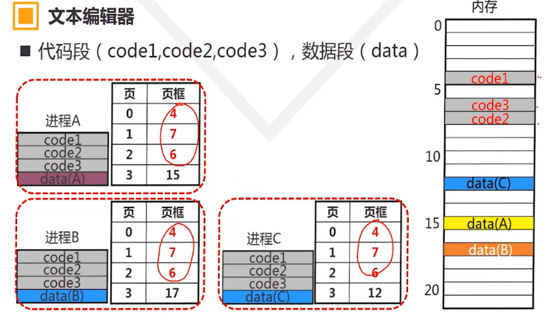

# 一、操作系统的概述

## 操作系统的功能

### 进程控制

1. 进程控制：创建，暂停，唤醒，撤销
2. 进程调度：调度策略、优先级
3. 进程通信：进程间通信。

### 内存管理

1. 内存分配
2. 内存共享
3. 内存保护
4. 虚拟内存

### 设备管理

1. 设备的分配和调度
2. 设备无关性作
3. 设备传输控制
4. 设备驱动

### 文件管理

1. 存储空间管理
2. 文件的操作
3. 目录的操作
4. 文件和目录的存取权限管理

> 不是每个操作系统都必须要有设备管理和文件管理


### 用户接口

* 系统命令
* 编程接口

### 总结

操作系统是一个大型的系统程序：

-  提供用户**接口**，方便用户控制计算机；
- 负责为应用程序**分配和调度软硬件资源**，并控制与协调应用程序并发活动，帮助用户存取和保护信息。

## 操作系统发展历史

### 手工操作

-  效率低：CPU有效运行时间极低
- 用户独占
- 缺少交互


### 单道批处理系统

- **批量**：作业队列
- 自动：识别作业，装入和撤出
- **单道**：依次、串行


### 多道批处理系统

* 提高系统CPU利用率

* 提供系统吞吐量

  

#### 特点：

* 多道：内存同时存放多道程序
* 并行：宏观上
* 串行：微观上

#### 缺点：

* 作业处理时间长。
* 交互能力差。
* 运行过程不确定。

## 分时技术和分时操作系统

### 中断技术

CPU收到外部信号（中断信号）后，停止当前工作，转去处理外部事件，处理完毕后，回到原来工作的中断处（断点）继续原来的工作。

### 通道技术

专门处理外设与内存之间的数据传输的处理机。

### 分时技术

* 主机以很短的“时间片”为单位，把CPU轮流分配给每个终端使用，直到全部作业被运行完。
* 由于时间片很短，在终端数量不多的情况下，每个终端都能很快获得CPU，使得每个终端都能及时响应。
* 等待周期 = 时间片 X 终端数量

### 分时操作系统UNIX

#### 革新和创造

- 实现操作系统的可移植性

- 实现了硬件无关性

- 引进了“特殊文件”的概念

  把外设看作文件，实现对外设统一管理

# 二、操作系统逻辑结构

## 操作系统的逻辑结构

### 逻辑结构种类

- 整体式结构
- 层次式结构
- 微内核结构（客户/服务器结构，Client/Server）
- 宏内核结构（单内核）

### 整体式结构

1. 特点
   - 模块设计、编码和调试独立
   - 模块调用自由
   - 模块通信多以**全局变量**形式完成
2.  缺点
   - 信息传递随意，维护和更新困难。

### 层次结构

层次结构的软件例子：`TCP/IP`协议栈

#### 分层结构的操作系统


#### 优点

* 结构清晰，避免循环调用。
* 整体问题局部化，系统的正确性容易保证
* 有利于操作系统的维护、扩充和移植

### 微内核结构

* 操作系统 = 微内核 + 核外服务器
* 微内核
  - 足够小，提供OS最基本的核心功能和服务
  - ①实现与硬件紧密相关的处理
  - ②实现一些较基本的功能
  - ③负责客户和服务器间的通信

* 核外服务器
  - 完成OS的绝大部分服务功能，等待应用程序提出请求。
  - 由若干服务器或进程共同构成
    - 例如：进程/线程服务器，虚存服务器，设备管理服务器等，以进程形式运行在用户态

### 宏内核结构（单内核）

 简单来说，就是把很多东西都集成进内核，例如`linux`内核，除了最基本的进程、线程管理、内存管理外，文件系统，驱动，网络协议等等都在内核里面。优点是效率高。缺点是稳定性差，开发过程中的bug经常会导致整个系统挂掉。 

## CPU的态

### 支持操作系统的最基本硬件结构

- CPU
- 内存
- 中断
- 时钟

### CPU

#### CPU态

- CPU的工作状态
- 对资源和指令使用权限的描述

#### 态的分类

* 核态
  - 能够访问所有资源和执行所有指令
  - 管理程序/OS内核

* 用户态（User、mode、目态）
  - 仅能访问部分资源，其他资源受限
  - 用户程序

* 管态
  - 介于核态和用户态之间

#### 用户态和核态之间的转换

##### 用户态向核态转换

* 用户请求OS提供服务
* 发生中断
* 用户进程发生错误（内部中断）
* 用户企图执行特权指令

##### 核态向用户态转换的情形

* 一般是执行中断返回：`IRET`

#### 硬件和OS对CPU的观察

* 硬件按“态“来区分CPU的状态
* OS按“进程”来区分CPU的状态

### 存储器

#### 分类

* 按存储器读写工作方式
  - RAM
  - ROM

* 按与CPU的联系
  - 主存（内存）：直接和CPU交换信息
  - 辅存（外存，即硬盘之类的）：不能直接和CPU交换信息

#### 存储体系


### 分层存储系统的工作原理


## 中断机制

### 定义

- 指CPU对突发的外部事件的反应过程或机制
- CPU收到外部信号（中断信号）后，停止当前工作，转去处理外部事件，处理完毕后，回到原来工作的中断处（断点）继续原来的工作。


### 目的

* 实现并发活动
* 实现实时处理
* 故障自动处理

### 概念


# 三、操作系统用户界面

## BIOS和主引导记录`MBR`

### 计算机工作模式

* 实模式（开机过程中）
  * 程序安装好8086寻址方法访问`0h—FFFFFh`（`1MB`）空间
  
    * 前面`640K`【00000 -- `9FFFF`】：基本内存
  
    * 中间`128K`【`A0000` -- `BFFFF`】：显卡显存
  
    * 末尾`256K`【`C0000` -- `FFFFF`】：BIOS
  
      
  
  * 寻址方式：物理地址（20位）= 段地址 ：偏移地址
  
  * CPU单任务运行
* 保护模式（开机之后）
  * 段页式寻址机制
  * 寻址方式：段（32位）和偏移量（32位），寻址`4GB`空间
  * 虚拟地址、进程、封闭空间
  * 应用程序和操作系统的运行环境受保护
  * CPU支持多任务

### 系统BIOS

以硬件形式存在的程序，也就是固件

#### 功能

* 系统启动配置
* 基本的设备I/O服务
* 系统的加电自检和启动

### 主启动记录`MBR`

* 存放在硬盘/软盘的首扇区
* 存放和OS启动的相关信息（Main Boot Record）
* `512BYTES`
* 结束：`0xAA55h`

#### `MBR`/硬盘分区/格式化


### `BIOS`和`MBR`程序运行过程


> 注：PORT为系统的加电启动

## 操作系统启动过程

### 启动过程

从加电到用户工作环境准备好的过程

* 初始引导
  * 把OS核心装入内存并使之开始工作接管计算机系统
* 核心初始化
  * OS内核初始化系统的核心数据
* 系统初始化
  * 为用户使用系统作准备，是系统处于待命状态。

## 操作系统的生成

满足特定硬件环境和用户需要，组装和构建操作系统过程

## 用户界面（用户接口）

### 概念

OS提供给用户控制计算机的机制，又称用户接口

### 分类

* 操作界面
* 系统调用（System Call。系统功能调用，程序界面）

### Shell

* Shell是操作系统与用户交互的界面

* 表现为通过控制台执行用户命令的方式
* 本身不执行命令，仅仅是组织和管理命令

### 管道

* 特殊的重定向操作。
* 管道操作符|
  * “|”符用于连接左右两个命令，将“|”左边命令的执行结果（输出）作为“|”右边命令的输入

## 系统调用

操作系统内核为应用程序提供的**服务**/**函数**

### 特点

* 一般涉及核心资源或硬件的操作

* 运行于核态（与普通用户程序不同）

* 每个系统调用具有唯一的编号：ID

* 调用过程会产生中断：自愿中断

  * 系统调用的中断过程

    

# 四、进程管理

## 进程概念

### 进程定义

* 进程是程序在某个数据集合上的一次运行活动。
* 数据集合：软/硬件环境，多个进程共存/共享的环境。

### 进程特征

* 动态性
  * 进程是程序的一次执行过程，动态产生/消亡
* 并发性
  * 进程同其他进程一起向前推进
* 异步性
  * 进程按各自速度向前推进
* 独立性
  * 进程是系统分配资源和调度CPU的单位

### 进程与程序的区别

* 动态与静态
  * 进程是动态的：程序的一次执行过程
  * 程序是静态的：一组指令的有序集合
* 暂存与长存
  * 进程是暂存的：在内存中驻留
  * 程序是长存的：在介质中长期保存
* 程序和进程的对应
  * 一个程序可能有多个进程

### 进程状态

* 运行状态
  * 进程已经占有CPU，在CPU上运行
* 就绪状态
  * 具备运行条件但由于无CPU，暂时不能运行
* 阻塞状态
  * 因为等待某项服务完成或信号不能运行的状态
  * 如等待：系统调用、I/O操作、合作进程信号。。。


### Linux下的进程状态

* 可运行态
  * 就绪：TASK_RUNNING
    * 在就绪队列中等待调度

* 阻塞（等待）态
  * 浅度阻塞：TASK_INTERRUPTIBLE（可中断）
    * 能被其他进程的信号或时钟唤醒。
  * 深度阻塞（不可中断）
    * 不能被其他进程的信号或时钟唤醒。

* 僵死态
  * 进程终止执行，释放大部分资源

* 挂起态
  * 进程被挂起


### 进程控制块（Process Control Block， PCB）

描述进程状态、资源、和与相关进程关系的数据结构

* PCB是进程的标志
* 创建进程时创建PCB；进程撤销后PCB同时撤销。

### Linux的进程控制块`PCB：task_struct`

1. 进程状态
2. 调度信息
3. 标识符
4. 内部进程通信信息
5. 链接信息
6. 时间和计时器
7. 文件系统
8. 虚拟内存信息
9. 处理器信息

### Linux进程的标识

* `PID`
* `PPID`：父进程ID
* `PGID`：进程组ID

## 进程控制

在进程生命全期间，对其全部行为的控制

### 四个典型的控制行为

* 创建进程
* 阻塞进程
* 唤醒进程
* 撤销进程

### 进程撤销的实现

* 在PCB队列中检索出该PCB

* 获取该进程的状态

* 若该进程处在运行态，立即终止该进程

  **【递归】检查是否有子进程，先撤销子进程**

* 释放进程占有的资源

* 将进程从PCB队列中移除

  

### 创建进程——fork

```c
pid_t fork(void);  // 类型定义:pid_t,这个类型定义实际上就是int型

例：pid_t pid = fork(); // fork
```

* 新进程是当前进程的子进程
* 父进程和子进程
  * 父进程：fork（）的调用者
  * 子进程：新建的进程

* 子进程是父进程的复制（除了进程ID和时间不同）
* 父进程和子进程并发运行。

```c
// 文件名 testfork.c
int main()
{
	fork();
	printf("Hello World\n");
	return 0;
}
```

```bash
[root@localhost~]# ./testfork
Hello World!
Hello World!
```

#### fork返回值`pid`

```c
int main(void)
{
  pid_t pid;
  pid = fork(); // 创建子进程，返回子进程ID
  if(pid == 0)  // 从此处进行子进程的并发
  {
    printf("Hello World!\n");
  }else if(pif > 0)
  {
    printf("How are you!\n");
  }
}
```

* 在子进程中，`pid` = 0；
* 在父进程中，`pid` > 0;（子进程ID）
* 出错：`pid` = -1；

>父进程fork()之后返回值为子进程的`pid`号，而子进程fork()之后的返回值为0。那么，现在就有一个问题了，子进程fork()的返回值是怎么来的？如果子进程又执行了一遍fork()函数，那么，按着完全复制的效果，父进程应该还会再fork()一次才对啊。

> 其实，在fork()函数执行中，返回值是存放在寄存器`eax`中的，在子进程中fork()的结尾处，把`eax`置为0就可以啦。这样，就造成一种子进程也完整运行一次fork()的“假象”

### exec函数簇（包括若干函数）

* 功能
  * 装入一个指定的可执行程序运行
  * 使子进程具有和父进程完全不同的新功能

* 步骤
  * 根据文件名找到相应的可执行程序
  * 将可执行程序的内容填入子进程的地址空间
  * 进入新进程执行且不再返回。

## 线程

* 线程是可由CPU直接运行的实体；
* 一个进程可以创建多个线程
* 多个线程共享CPU可以实现并发运行

### 单线程

整个进程只有一个线程。Windows程序缺省只有一个线程（主线程，main线程）

### 多线程

整个进程至少有2个线程。主线程和至少一个用户线程。

### Linux线程

* 线程的创建`pthread_create()`

  ```c
  #include <pthread.h>
  int pthread_create(
    pthread_t *restrict tidp,   //新创建的线程ID指向的内存单元，线程句柄。
    const pthread_attr_t *restrict attr,  //线程属性，默认为NULL
    void *(*start_rtn)(void *), //新创建的线程从start_rtn函数的地址开始运行，线程函数入口地址
    void *restrict arg //默认为NULL。若上述函数需要参数，将参数放入结构中并将地址作为arg传入。
  );
  ```

## 临界区和锁

问题：怎么解决如下两个程序并发执行时，可能会出现的问题


答案：


### 临界资源【Critical Resource】

* 一次只允许一个进程独占访问（使用）的资源

  例：例子中的共享变量i

### 临界区【Critical Section】

* 进程中访问临界资源的程序段

  例：例子中的**特定区域**

### 临界区访问机制的四个原则

* 忙则等待
  * 当临界区忙时，其他进程必须在临界区外等待

* 空闲让进
  * 当无进程处于临界区时，任何有权进程可进入临界区。

* 有限等待
  * 进程进入临界区的请求应在有闲时间内得到满足

* 让权等待
  * 等待进程放弃CPU。（让其他进程有机会得到CPU）

### 锁机制

* 基本原理
  * 设置一个“标志”S
    * 表明临界资源“可用”还是“不可用”？1 ： 0

* 上锁操作：
  * 进入临界区之前检查标志是否可用？
    * 若为不可用状态：进程在临界区之外等待
    * 若为可用状态：
      * 访问临界资源
      * 且将标志修改为“不可用”

* 开锁操作：
  * 退出临界区时，将标志修改为可用

## 同步和P-V操作

### 进程的互斥关系

* 多个进程由于共享了**独占性资源**，必须协调各进程对资源的存取顺序：确保没有任何两个或以上的进程同时进行存取操作

### 进程的同步关系

* 若干**合作进程**为了完成一个共同的任务，需要相互协调运行步伐：**一个进程**开始某个操作**之前**必须要求**另一个**进程已经完成某个操作，否则前面的进程只能**等待**

### P-V操作解决互斥问题

* 实质

  允许最多一个进程处于临界区

* 应用过程
  * 进入临界区之前先执行P操作；（可能阻塞当前进程）
  * 离开临界区之后再执行V操作；（可能唤醒某个进程）

### P-V操作解决同步问题


## Linux同步

### wait函数

进程调用wait（int status）阻塞自己

* 阻塞到有子进程结束
  * 没有：进程一直阻塞
  * 有：僵尸进程
    * wait收集子进程信息并彻底销毁它后返回

* status保存进程退出时的状态

  * 若忽略退出信息

    pid = wait（NULL）；

### sleep（int nSecond）

* 进程暂停执行nSecond秒
* 系统暂停调度该进程

### exit函数

* 调用void exit（int status）终结进程

* 进程终结是要释放资源并报告父进程
  * 利用status传递进程结束时的状态
  * 变为僵尸状态，保留部分PCB信息供wait收集
    * 正常结束还是异常结束
    * 占用总系统CPU时间
    * 缺页中断次数
  * 调用schedule（）函数，选择新进程运行

### 例子

```c
#include <pthread.h>
#include <stdio.h>
#include <unistd.h>
#include <math.h>
main()
{
        pid_t pid, pid_1, pid_2;
        pid = fork();
        if (pid == 0) { /* 子进程 */
                pid_1 = getpid();
                printf("pid_1 = %d\n",pid_1);
                sleep(10);
        }
        if (pid > 0) {/* 父进程 */
                pid_2 = wait(NULL);
                printf("pid_2 = %d\n",pid_2);
        }
				exit(0);
}

```

上面程序中，先打印pid_1 = 17467，等待十秒后，再打印pid_2 = 17467

### 父子进程共享普通变量和文件资源

* 对于普通变量，父子进程各自操作变量副本，互相不影响
* 对于文件，父子进程共享同一文件和读写指针

## 进程通信

### 管道通信机制

#### 定义

管道是进程间的一种通信机制。一个进程（A）可以通过管道把数据传输给另外一个进程（B）。前者（A）向管道输入数据，后者（B）从管道读取数据。


#### 工作原理


#### 双向通信

双向通信必须建立两个管道


### 信号通信机制

* 键盘上按下“Ctr+C”杀死一个进程
* 键盘上按下“Ctr+Z"挂起（暂停）一个进程
* 终端命令kill -9 杀死一个进程

```c
#include <signal.h>
#include <stdio.h>

void int_handler(int signum)
{
  			// 按下CTRL+C之后，会打印BYE BYE，并结束进程
        printf("\n BYE BYE! \n");
        exit(-1);
}

int main()
{
  			// SIGINT即是CTRL+C产生的信号
  			// int_handler是SIGINT信号自定义的信号处理函数
        signal(SIGINT, int_handler);
        printf("int_handler set for SIGINT \n");

        while(1)
        {
                printf("go to sleep. \n");
                sleep(1);
        }
        return 0;
}

```

#### 信号来源

* 键盘输入特殊组合键产生信号，如：“Ctr+C"
* 终端命令，如：kill系列命令
* 程序中调用函数，如：kill（）、abort（）
* 硬件异常或内核产生相应信号，如：内存访问错误

# 五、死锁

## 概念

* 两个或者多个进程无限期地等待永远不会发生的条件的一种系统状态（结果：每个进程都永远阻塞)
* 在两个或多个进程中，每个进程都持有某种资源，但又继续申请其他进程已持有的某种资源。此时每个进程都拥有其运行所需的一部分资源，但是又都不够，从而每个进程都不能向前推进，陷入阻塞状态。这种状态称为死锁。

## 起因

* 系统资源有限
* 并发进程的推进顺序不当
  * 进程请求资源和释放资源的顺序不当，导致死锁


## 预防策略

* 破坏互斥条件 —— （难）
* 破坏不剥夺条件 —— （代价大）
* 破坏部分分配条件 —— （预先静态分配）
* 破坏环路条件 —— （有序资源分配）

# 六、进程调度

在合适的时候以一定策略选择一个就绪进程运行

## 目标

* 响应速度尽可能块
* 进程处理的时间尽可能短
* 系统吞吐量尽可能大
* 资源利用率尽可能高
* 对所有进程要公平
* 避免饥饿
* 避免死锁

## 典型调度算法

1. 先来先服务调度（`FCFS`）

   * 算法：按照作业进入系统的时间先后来挑选作业。先进入系统的作业优先被运行
   * 特点：
     * 容易实现，效率不高
     * 只考虑作业的等候时间，而没有考虑运行时间的长短。此算法不利于短作业。

2. 短作业优先调度算法（`SJF`）

   * 算法：参考运行时间，选取运行时间最短的作业投入运行
   * 特点
     * 易于实现，效率不高
     * 忽视了作业等待时间，一个早来但是很长的作业将会在很长时间得不到调度，易出现资源“饥饿”现象。

3. 响应比高者优先调度算法（`HRRN`）

   * 响应比定义

     * 作业的响应时间和运行时间的比值

     * 响应比 = 响应时间/运行时间 

       ​            = （等待时间 + 运行时间）/ 运行时间

       ​            = 1 +  等待时间 / 运行时间

   * 算法

     * 计算每个作业的响应比，选择响应比最高的作业优先投入运行

4. 优先数调度算法

   * 算法

     * 根据进程优先数，把CPU分配给最高的进程

     * 进程优先数 = 静态优先数 + 动态优先数

   * 静态优先数

     * 创建进程时确定，在整个进程运行期间不改变

   * 动态优先数

     * 动态优先数在进程运行期间可以改变

5. 

   循环轮转调度法

   * 概念
     * 把所有就绪进程按先进先出的原则排成队列。新来进程加到队列末尾
     * 进程以时间片为单位轮流使用CPU。刚刚运行一个时间片的进程排到队列末尾，等待下一轮运行。
     * 队列逻辑上是环形的。


## Linux进程调度

* 普通进程
  * 采用动态优先级来调度
  * 调度程序周期性地修改优先级（避免饥饿）
* 实时进程
  * 采用静态优先级来调度
  * 由用户预先指定，以后不会改变

### 静态优先级

* 进程创建时指定或由用户修改

### 动态优先级

* 在进程运行期间可以按调度策略改变
* 非实时进程采用动态优先级，由调度程序计算
* 只要进程占用CPU，优先级就随时间流失而不断减少
* `task_struct`的`counter`表示动态优先级。

### 进程切换

* 概念：内核挂起当前CPU上的进程并恢复之前挂起的某个进程

* 与中断上下文的切换有差别
  * 中断前后在同一进程上下文中，只是用户态转向内核态执行

# 七、存储管理

## 内存管理功能

### 多道程序并行带来的问题

* 共享
  * 代码和数据共享，节省内存

* 保护
  * 不允许内存中的程序相互间非法访问

### 实际存储器体系

* 三级存储体系
* Cache（快，小，贵） + 内存（适中）+ 辅存（慢，大，快）

* 基本原理：
  * 当内存太小不够用时，用辅存来支援内存
  * 暂时不运行的模块换出到辅存上，必要时再换入内存

* 地址映射
  * 定义
    * 把程序中的地址（虚拟地址/虚地址/逻辑地址）变成内存的真实地址（实地址/物理地址）的过程
    * 地址重定位，地址重映射。
  * 方式
    * 固定地址映射
    * 静态地址映射
    * 动态地址映射
* 虚拟存储
* 内存分配
* 存储保护

### 动态地址映射

* 定义：在程序执行过程中把逻辑地址转换为物理地址
* 映射过程
  * MA = BA + VA
  * 逻辑地址：VA
  * 装入基址：BA
  * 物理地址：MA
  * 如果程序有移动，BA可能会有改变，自动计算新的MA

* 特点

  * 程序占用的内存空间可动态变化

    * 要求及时更新基址BA

  * 程序不要求占用连续的内存地址

    * 每段放置基址BA系统应该知道

  * 便于多个进程共享代码

    * 共享代码作为独立的一段存放

    

* 缺点
  * 硬件支持（`MMU`：内存管理单元）
  * 软件复杂

### 虚拟存储

* 

* 

## 物理内存管理

### 分区存储管理

* 单一区存储管理
* 分区存储管理
  * 固定分区
  * 动态分区

#### 固定分区

* 定义：把内存固定划分为若干个大小不等的分区供各个程序使用。每个分区的大小和位置都固定，系统运行期间不再重新划分
* 缺点
  * 浪费内存：程序比所在分区小
  * 大程序可能无法运行：程序可能比最大分区大

#### 动态分区

* 定义： 在程序装入时创建分区，使分区大小刚好与程序的大小相等
* 例子
  * 
  * 

* 特点
  * 分区的个数和大小均可变
  * 存在内存碎片

### 内存覆盖技术

* 目的
  * 在较小的内存空间中运行较大的程序

* 内存分区
  * 常驻区：被某段单独且固定地占用，可划分多个
  * 覆盖区：能被多段共用（覆盖），可划分多个
* 覆盖的例子
  * 内存（`110k`）：一个常驻区，两个覆盖区
  * 程序（`190k`）：6个段


* 缺点
  * 编程复杂：程序员划分程序模块并确定覆盖关系
  * 程序执行时间长：从外村装入内存耗时

### 内存交换技术

* 原理
  * 内存不够时，把程序写到磁盘（换出/`Swap Out`）
  * 当进程要运行时，重新写回内存（换入/Swap In)

* 优点
  * 增加进程并发数
  * 不考虑程序结构


* 缺点
  * 换入和换出增加CPU开销
  * 交换单位太大（整个进程）

* 需要考虑的问题
  * 减少交换传送的信息量
  * 外存交换空间的管理方法
  * 程序换入时的地址重定位

### 内存碎片

动态分区容易产生内存碎片：内存反复分配和分割

#### 解决方法

* 规定门限值
  * 分割空闲区时，若剩余部分小于门限值，则此空闲区不进行分割，而是全部分配给用户

* 内存拼接技术
  * 将所有空闲区集中一起构成一个大的空闲区
  * 缺点
    * 消耗系统资源
    * 离线拼接
    * 重新定义作业

* 解除程序占用连续内存才能运行的限制
  * 把程序分拆多个部分装入不同分区，充分利用碎片


## 虚拟内存管理

### 目标


### 实现思路


### 程序运行的局部性

* 程序在一个**有限的时间段**内访问的代码和数据往往集中在**有限的地址**范围内。
* 把程序**一部分**转入内存在**较大概率**上也足够让其运行一小段时间
  * 为什么是大概率，因为程序可能有跳转

### 虚拟内存管理方法

* 页式虚拟存储管理
* 段式虚拟存储管理
* 段页式虚拟存储管理 

## 页式虚拟存储

### 概念


### 进程装入和使用内存的原则


### 页表和页式地址映射

* 虚拟地址（VA）可以分解成**页号**P和**页内偏移**W

  * 页号（P)

    VA所处页的编号 = VA / 页的大小

  * 页内偏移（W)

    VA所在页中的偏移 = VA % 页的大小

* 例子

  * VA = 2500；页面大小`1K`
    * P = 2500 / 1024 = 2
    * W = 2500 % 1024 = 452

* 速度更快的计算方法
  * 页号P = VA >> n
  * 页内偏移W = 低n位 = VA && （2^n - 1）

#### 页面映射表

* 记录页与页框之间的对应关系。也叫页表
* 页号：登记程序地址的页号
* 页框号：登记页所在的物理页号
* 例子

### 快表技术和页面共享技术

#### 快表

##### 机制

* 慢表：页表放在内存中
* 快表：页表放在Cache中

##### 特点

* 容量小，访问块，成本高
* 快表是慢表的部分内容复制
* 地址映射优先访问快表

#### 页面的共享

##### 原理

* 在不同进程的页表中填上**相同的页框 号**，多个进程能访问相同的内存空间，从而实现**页面共享**；
* **共享页面**在内存只有**一份**真实存储，节省内存

##### 例子

* 文本编辑器：**`150KB`代码段**和**`50KB`数据段**

* 有10进程并发执行该文本编辑器
* 占用内存 = 10 X （150 + 50）KB = `2M`
* 采用代码段共享，代码段在内存只有一份真实存储
  * 占用内存 = 150 + 10 X 50 = `650KB`



### 缺页中断

在地址映射过程中，当所要访问的目的页不在内存时，则系统产生异常中断 —— **缺页中断**


#### 页表扩充

扩充有中断位和辅存地址的页表


中断位I —— 标识该页是否在内存

* 若I = 1，不在内存
* 若I = 2，在内存

#### 访问指令的执行过程（含缺页中断处理）


### 页面淘汰

**选择淘汰哪一页的规则称淘汰策略**

#### 页面抖动

* 页面在内存和辅存间频繁交换的现象
* “抖动”会导致系统效率降低

#### 好的淘汰策略

* 具有较低的缺页率（高命中率）
* 页面抖动较少

#### 常用的淘汰算法

* 最佳算法（OPT算法）
* 先进先出淘汰算法（FIFO算法）
* 最久未使用淘汰算法（`LUR`算法）
* 最不经常使用（`LFU`算法）

### 页式系统的缺点

* 页面划分无逻辑含义
* 页的共享不灵活
  * 可能只有半个页的共享代码段，但是整个页都要被共享出去
* 页内碎片

>在内存管理中，内部碎片是已经被分配出去的的内存空间大于请求所需的内存空间。外部碎片是指还没有分配出去，但是由于大小太小而无法分配给申请空间的新进程的内存空间空闲块。

## 段式和段页式虚拟存储

### 进程分段

把进程按逻辑意义划分为多个短，每段都有段名，长度不定。进程由多段组成。

#### 例：

一个具有代码段、数据段、堆栈段的进程


#### 段式内存管理系统的内存分配

* 以段为单位装入，每段分配连续的内存
* 但是段和段不要求相邻。

#### 段式系统的虚拟地址

* 段式虚拟地址VA包括段号S和段内偏移W

#### 段表


#### 段式地址映射过程

* 由逻辑地址VA分离出（S，W）
* 查询段表（检索段号S，查询该段基地址B和长度L）
* 物理地址MA = B + W


#### 段表的扩充

* 基本字段：段号，长度，基址
* 扩展字段：中断位，访问位，修改位，R/W/X等权限

#### 段的共享

* 共享段在内存中只有一份存储
* 共享段被多个进程映射到各自段表
* 需要共享的模块都可以设置为单独的段

#### 段式系统的缺点

* 段需要连续的存储空间
* 段的最大尺寸受到内存大小的限制
* 在辅存中管理可变尺寸的段比较困难

### 段式系统 VS 页式系统


### 段页式存储管理

* 在段中划分页面

  

#### 地址构成

段号，页号，页内偏移


* 逻辑地址：段号S、页号P和页内位移W
* 内存按页划分，按页装入

#### 地址映射


# 设备管理