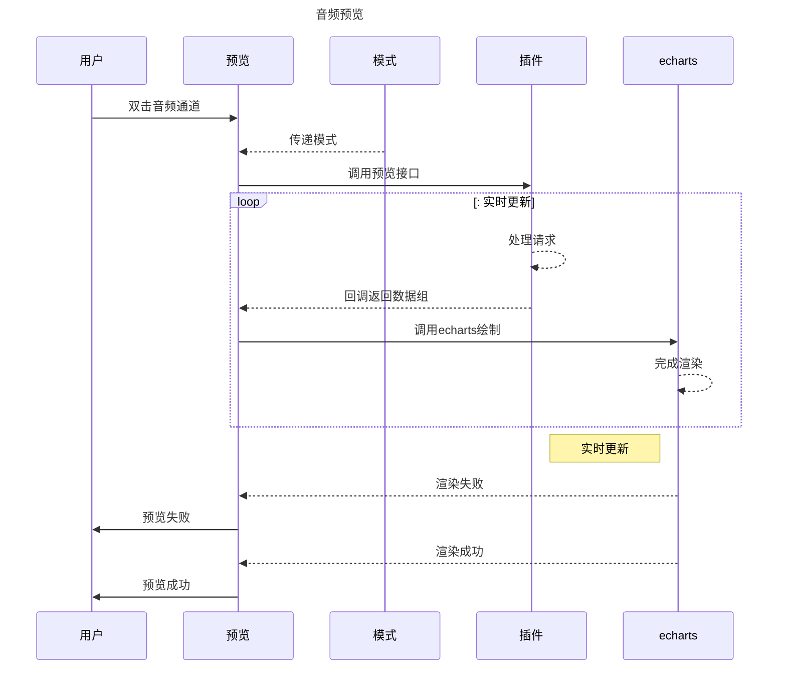
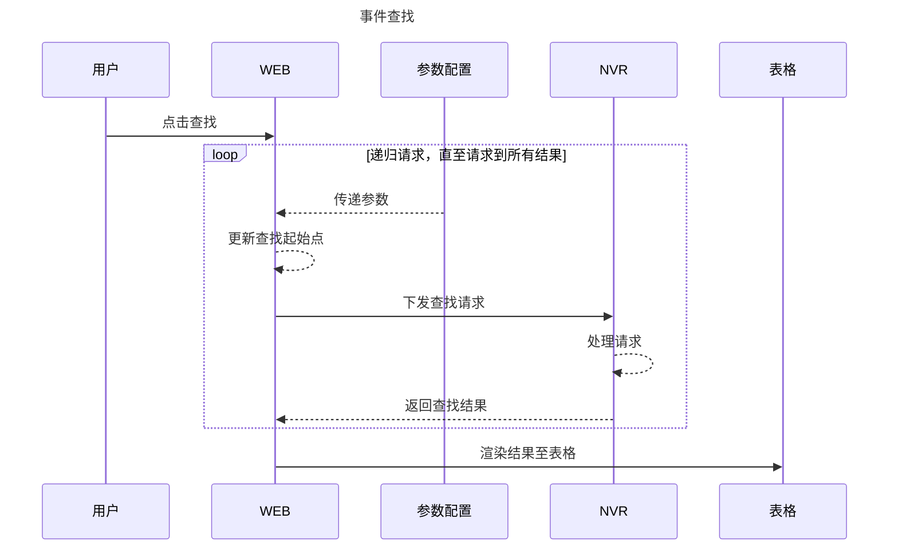
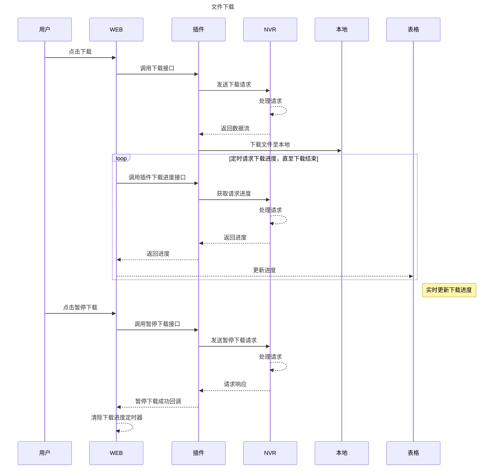
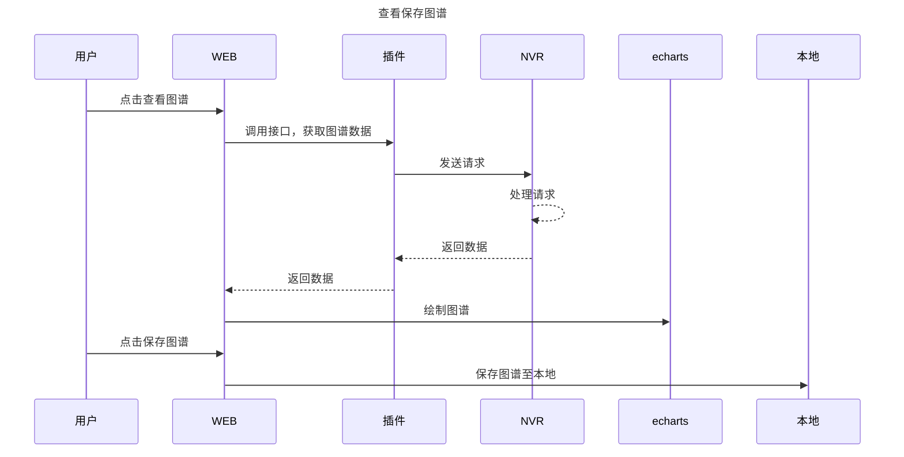

```mermaid
sequenceDiagram
Title: 音频预览
用户->>预览: 双击音频通道
模式-->>预览: 传递模式
预览->>插件: 调用预览接口
loop: 实时更新
插件-->>插件: 处理请求
插件-->>预览: 回调返回数据组
预览->>echarts: 调用echarts绘制
echarts-->>echarts: 完成渲染
end
Note right of 插件: 实时更新
echarts-->>预览: 渲染失败
预览->>用户: 预览失败
echarts-->>预览: 渲染成功
预览->>用户: 预览成功
```

```mermaid
sequenceDiagram
Title: 事件查找
用户->>WEB: 点击查找
loop 递归请求，直至请求到所有结果
参数配置-->>WEB: 传递参数
WEB-->>WEB: 更新查找起始点
WEB->>NVR: 下发查找请求
NVR-->>NVR: 处理请求
NVR-->>WEB: 返回查找结果
end
WEB->>表格: 渲染结果至表格
```

```mermaid
sequenceDiagram
Title: 文件下载
用户->>WEB: 点击下载
WEB->>插件: 调用下载接口
插件->>NVR: 发送下载请求
NVR-->>NVR: 处理请求
NVR-->>插件: 返回数据流
插件->>本地: 下载文件至本地
loop 定时请求下载进度，直至下载结束
WEB->>插件: 调用插件下载进度接口
插件->>NVR: 获取请求进度
NVR-->>NVR: 处理请求
NVR-->>插件: 返回进度
插件-->>WEB: 返回进度
WEB-->>表格: 更新进度
end
Note right of 表格: 实时更新下载进度
用户->>WEB: 点击暂停下载
WEB->>插件: 调用暂停下载接口
插件->>NVR: 发送暂停下载请求
NVR-->>NVR: 处理请求
NVR-->>插件: 请求响应
插件-->>WEB: 暂停下载成功回调
WEB-->>WEB: 清除下载进度定时器
```

```mermaid
	sequenceDiagram
Title: 查看保存图谱
用户->>WEB: 点击查看图谱
WEB->>插件: 调用接口，获取图谱数据
插件->>NVR: 发送请求
NVR-->>NVR: 处理请求
NVR-->>插件: 返回数据
插件-->>WEB: 返回数据
WEB->>echarts: 绘制图谱
用户->>WEB: 点击保存图谱
WEB->>本地: 保存图谱至本地
```

