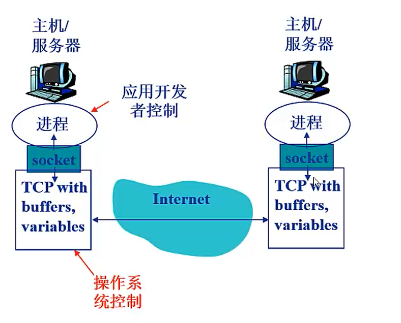
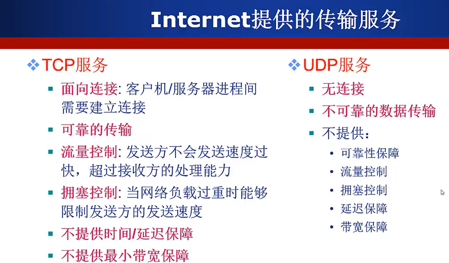
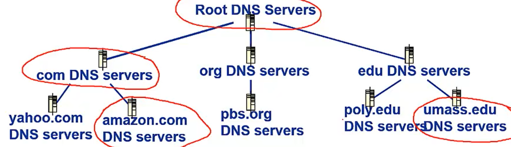
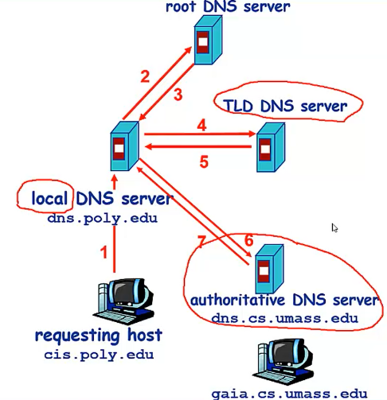
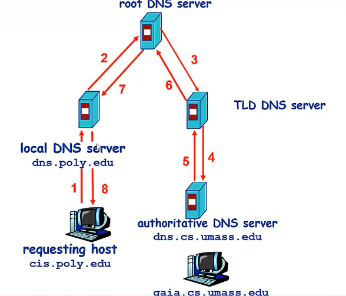

# 一、概述

# 二、网络应用

## 体系结构

* 客户机/服务器结构（Client-Server，C/S）

  * 服务器：7*24小时不间断的运行、永久性的访问域名/IP地址、利用大量服务器实现可拓展
  * 客户机：与服务器通讯，领用服务器提供的服务、间接性的接入网络、I可能使用动态IP地址、不会与其他客户机直接通讯

  *  web应用是C/S结构，不过web应用的客户端采用的是浏览器，因此web应用的结构也叫作B/S结构 

  

* 点对点结构（Peer-To-Peer，P2P）
  * 没有永远在线的服务器
  * 任意端系统/节点之间可以直接通讯
  * 节点间歇性接入网络
  * 节点可能改变IP地址
  * 相较于C/S结构高度可伸缩，但是却难于管理
* 混合结构（Hybrid）
  * 文件传输使用P2P结构
  * 文件的搜索采用C/S结构 —— 集中式

## 基本原理

### 进程间通信

* 客户机进程：发起通信的进程
* 服务器进程：等待通信请求的进程

### 套接字

* 进程间通信利用socket发送/接受消息实现
* 类似于寄信
* 传输基础设施向进程提供API
  * 传输协议的选择
  * 参数的设置

### 寻址

* 不同主机上的进程间通信，每个进程必须拥有标识符
* 进程的标识符
  * IP地址 + 端口号

## 对传输服务的需求

* 数据丢失/可靠性

  * 某些网络应用能够容忍一定的数据丢失：网络电话
  * 某些网络应用要求100%可靠的数据传输：文件传输，Telnet

* 时间/延迟

  * 网络延迟：指各式各样的数据在[网络介质](https://baike.baidu.com/item/网络介质/6915733)中通过[网络协议](https://baike.baidu.com/item/网络协议/328636)(如TCP/IP)进行传输，如果信息量过大不加以限制，超额的[网络](https://baike.baidu.com/item/网络)流量就会导致设备反应缓慢，造成网络延迟。

  * 延迟时间： 从[报文](https://baike.baidu.com/item/报文)开始进入网络到它开始离开网络之间的时间。

  * 有些应用只有在延迟最优低时才“有效”
  * 网络电话/网络游戏

* 带宽

  * 某些应用只有一个在带宽达到最低要求时才“有效”：网络视频
  * 某些应用能够适应任何带宽 —— 弹性应用：email

* 不局限于此：对于某些敏感信息的传输，还要考虑安全性之类的。

## Internet提供的传输服务

# 三、WEB应用（基于TCP）

## HTTP协议

请求（`request`）、响应（`response`）

## 无状态协议

http是一种不保存状态的协议，即无状态协议。http协议自身不对请求和响应之间的通信状态进行保存

## 有状态协议

有状态协议更复杂：

* 需维护状态（历史信息）
* 如果客户或服务器失效，会产生状态的不一致，解决这种不一致代价高。

## HTTP连接的两种类型

* 非持久性连接
  * 每个TCP连接最多允许传输一个对象，每个对象需要两个`RTT`（Round Trip Time）
  * 操作系统需要为每个TCP连接开销资源
* HTTP 1.0版本使用非持久性连接
  
* 持久性连接
  
  * 发送响应后，服务器保持TCP连接的打开，后续的HTTP消息可以通过这个连接发送。
  
  * 每个TCP连接允许传输多个对象
  * HTTP 1.1版本默认使用持久性连接

## 持久性连接

* 无流水（pipelineing）的持久性连接
  * 客户端只有收到前一个响应后才发送新的请求
  * 每个被引用的对象耗时1个RTT
* 带有流水机制的持久性连接
  * HTTP1.1的默认选项
  * 客户端只要遇到一个引用对象就尽快发出请求
  * 理想情况下，收到所有的引用对象只需耗时约1个RTT

> **RTT（Round Trip Time）：指从客户端发送一个很小的数据包到服务器并返回所经历的时间**

## HTTP消息格式

* 请求消息：包括三个部分，请求方法URL协议、请求头、请求体
  * 第一行是请求方法URL协议，里面包括请求方法是 GET、POST还是PUT等 + url 和HTTP版本
  * 第二部分是请求头，包括主机host，请求的浏览器user-agent，连接，接受的语言、
  * 换行
  * 第三部分请求体，比如post一般都会把参数放入到请求体中，PUT将消息体中的文件上传到url中指定的路径。

* 响应消息：状态行、消息报头，响应正文
  * 状态行：HTTP版本 200/404等（代表返回的结果）。
  * 消息报头：data（web服务器产生响应消息的时间）、server服务器的类型、内容长度
    空行
  * 响应正文：html代码等

## `Cookie`技术

某些网站为了辨别用户身份、进行session跟踪而储存在用户本地终端上的数据（通常经过加密）

### Cookie的组件

* HTTP响应消息的cookie头部行
* HTTP请求消息的Cookie头部行
* 保存在客户端主机上的cookie文件，由浏览器管理
* Web服务器端的后台数据库

### 原理

第一次访问服务器时，Cookie会根据从服务端发送的响应报文内的一个叫做**Set-Cookie**的首部字段信息，通知客户端**保存Cookie**。当下次客户端再往该服务器发送请求时，客户端会自动**在请求报文中加入Cookie值（键值对形式）**后发送出去。服务端发现客户端发送过来的Cookie后，会去检查究竟是从哪一个客户端发送过来的连接请求，然后对比服务器上的记录，最后得到之前的状态信息。

### 缺点

**存在隐私问题**

## WEB缓存

### HTTP缓存

当客户端向服务器请求资源时，会先抵达浏览器缓存，如果浏览器有“要请求资源”的副本，就可以直接从浏览器缓存中提取而不是从原始服务器中提取这个资源。

---

### **强缓存**

浏览器直接从本地缓存中获取数据，不与服务器进行交互。

用户发起了一个http请求后，浏览器发现先本地已有所请求资源的缓存，便开始检查缓存是否过期。有两个http头部字段控制缓存的有效期：Expires和Cache-Control，浏览器是根据以下两步来判定缓存是否过期的：

**1、查看缓存是否有Cache-Control的s-maxage或max-age指令，若有，则使用响应报文生成时间Date + s-maxage/max-age获得过期时间，再与当前时间进行对比（s-maxage适用于多用户使用的公共缓存服务器）；**

**2、如果没有Cache-Control的s-maxage或max-age指令，则比较Expires中的过期时间与当前时间。Expires是一个绝对时间。**

> **注**：**从字面意思上很容易把no-cache误解成为不缓存,但事实上no-cache代表不缓存过期的资源,缓存会向源服务器进行有效期确认后处理资源,也许格do-not-serve-from-cache-without--revalidation更合适。no-store才是真正地不进行缓存**

---

### **协商缓存**

浏览器发送请求到服务器，服务器判定是否可使用本地缓存。

* **若未命中强缓存，则浏览器会将请求发送至服务器。服务器根据http头信息中的Last-Modify/If-Modify-Since或Etag/If-None-Match来判断是否命中协商缓存。如果命中，则http返回码为304，浏览器从缓存中加载资源。**

* **Last-Modify/If-Modify-Since**

  浏览器第一次请求一个资源的时候，服务器返回的header中会加上Last-Modify，Last-modify是一个时间标识该资源的最后修改时间，例如Last-Modify: Thu,31 Dec 2037 23:59:59 GMT。

* **ETag/If-None-Match**

  与Last-Modify/If-Modify-Since不同的是，Etag/If-None-Match返回的是一个校验码（ETag: entity tag）。ETag可以保证每一个资源是唯一的，资源变化都会导致ETag变化。ETag值的变更则说明资源状态已经被修改。服务器根据浏览器上发送的If-None-Match值来判断是否命中缓存。

# 五、DNS应用（基于UDP）

## 域名解析系统`DNS`

* 多层命名服务器构成的分布式系统
* 应用层协议：完成名字的解析

## `DNS`服务

* 域名向IP地址翻译
* 主机别名
* 邮件服务器别名
* 负载均衡：Web服务器

## 分布式层次式数据库

### 为什么不使用集中式的DNS

* 单点故障
* 通信容量
* 远距离的集中式数据库
* 维护性问题

## 查询IP

客户端想要查询www.amazon.com的IP

* 客户端查询根服务器，找到`com`域名解析服务器
* 客户端查询`com`域名解析服务器，找到`amazon.com`域名解析服务器
* 客户端查询`amazon.com`域名解析服务器，获得www.amazon.com的IP地址

例如Cis.poly.edu的主机想获得gaia.cs.umass.edu的IP地址

### 根服务器（root）：

 根服务器主要用来管理互联网的主目录 

### 顶级域名服务器（`TLD`）：

负责com，org，net，edu等顶级域名和国籍顶级域名，例如cn，uk，fr等

### 权威域名服务器（Authoritative）：

组织的域名解析服务器，提供组织内部服务器的解析服务

### 迭代查询

### 递归查询

## `DNS`记录缓存和更新

只要域名解析服务获得域名 — IP映射，即缓存这一映射

* 一段时间过后，缓存条目失效（删除）
* 本地域名服务器一般会缓存顶级域名服务器的映射
  * 因此根域名服务器不经常被访问

## DNS协议

* 查询（query）和回复（reply消息）
* 消息格式相同

# 六、传输层

## 传输层 VS 网络层

* 网络层：提供主机之间的逻辑通信机制
* 传输层：提供应用进程之间的逻辑通信机制
  * 位于网络层之上
  * 依赖于网络层服务
  * 对网络层服务进行（可能的）增强

## TCP

可靠、按序的交付服务

* 拥塞控制
* 流量控制
* 连接控制

## UDP

* 基于“尽力而为”的网络层IP协议，没有做（可靠性方面的）扩展
  * 复用/分用
  * 简单的错误校验
* `Best effort`服务，UDP段可能
  * 丢失
  * 非按序到达
* 无连接
  * UDP发送方和接收方之间不需要握手
  * 每个UDP段的处理独立于其他段

### 优点

* 无需建立连接（减少延迟）
* 实现简单：无需维护连接状态
* 头部开销少
* 没有拥塞控制：应用可更好地控制发送时间和速率

### 应用

常用于流媒体应用

* 容忍丢失
* 速率敏感

### 实现可靠数据传输

* 在应用层增加可靠性机制
* 应用特定的错误恢复机制

> 以上两种服务（TCP、UDP）均不保证延迟和带宽

## 多路复用和多路分用

 **如果某层的一个协议对应直接上层的多个协议/实体，则需要复用/分用。** 

  

### 分用如何工作

* 主机接收到IP数据报(datagram)

  * 每个数据报携带源IP地址、目的IP地址。
  * 每个数据报携带一个传输层的段(Segment
    ）。
  * 每个段携带源端口号和目的端口号

* 主机收到Segment之后，传输层协议提取IP地址和端口号信息，将Segment导向相应的Socket

  * TCP做更多处理

  

  

