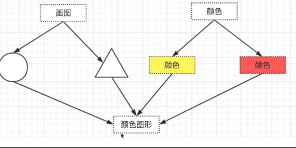

# 一、`UML`类图

`Unified Modeling Language`统一建模语言

类图，`UML`包含很多种图，和本课相关的是类图

关系，主要讲解泛化和关联，泛化表示继承，关联表示引用

演示，代码和类图结合


```javascript
class People {
  constructor(name, house) {
    this.name = name
    this.house = house
  }
  saySomething() {
    
  }
}

class A extends People {
  constructor(name, house) {
    super(name)
  }
  saySomething() {
    alert('I am A')
  }
}

class B extends People {
  constructor(name, house) {
    super(name)
  }
  saySomething() {
    alert('I am B')
  }
}

class House {
  constructor(city) {
    this.city = city
  }
  showCity() {
    alert(`house in ${this.city}`)
  }
}

let aHouse = new House('beijing')
let a = new A('a', aHouse)
a.saySomething()
let b = new B('b')
b.saySomething()
```

下面为代码对应的类图


# 二、设计原则

## 何为设计

### 描述

* 即按照哪一种思路或者标准来实现功能
* 功能相同，可以有不同设计方案来实现
* 伴随着需求增加，设计的作用才能体现出来

### 《UNIX/LINUX设计哲学》

#### 准则

* 小即是美
* 让每个程序都做好一件事
* 快速建立原型
* 舍弃高效率而取可移植性
* 采用纯文本来存储数据
* 充分利用软件的杠杆效应（软件复用）
* 使用shell脚本来提高杠杆效应和可移植性
* 避免强制性的用户界面
* 让每个程序都称为过滤器

#### 小准则

* 允许用户定制环境
* 尽量是操作系统内核小而轻量化
* 使用小写字母并尽量简短
* 沉默是金
* 各部分之和大于整体
* 寻求`90%`的解决方案

## `SOLID`五大设计原则

solo、open、interface、dependent

### S — 单一职责原则

* 一个程序只做好一件事
* 如果功能过于复杂就拆分开，每个部分保持独立

### O — 开放封闭原则

* 对外扩展开放，对修改封闭
* 增加需求时，扩展新代码，而非修改已有代码
* 这是软件设计的终极目标

### L — 李氏置换原则

* 子类能覆盖父类
* 父类能出现的地方子类就能出现
* `JS`中使用较少（弱类型&继承使用较少）

### I — 接口独立原则

* 保持接口的单一独立，避免出现"胖接口"
* `JS`中没有接口（`typescript`例外），使用较少
* 类似于单一职责原则，这里更关注接口

### D — 依赖导致原则

* 面向接口编程，依赖于抽象而不依赖于具体
* 使用方只关注接口而不关注具体类的实现
* `JS`中使用较少（没有接口&弱类型）

## 从设计到模式

## 介绍二十三种设计模式

### 创建型

* 工厂模式（工厂方法模式，抽象工厂模式，建造者模式）
* 单例模式
* 原型模式

### 组合型

* 适配器模式
* 装饰器模式
* 代理模式
* 外观模式
* 桥接模式
* 组合模式
* 享元模式

### 行为型

* 策略模式
* 模板方法模式
* 观察者模式
* 迭代器模式
* 职责链模式
* 命令模式
* 备忘录模式
* 状态模式
* 访问者模式
* 中介者模式
* 解释器模式

## 如何学习设计模式

* 明白每个设计的道理和用意
* 通过经典应用体会它的真正使用场景
* 自己编码时多思考，尽量模式

## 面试真题

### 面试题1

* 打车时，可以打专车或者快车。任何车都有车牌号和名称
* 不同车价格不同，快车每公里1元，专车每公里2元
* 行程开始时，显示车辆信息
* 行程结束时，显示打车金额（假定行程就5公里）
* 画出`UML`类图
* 用`ES6`语法写出该示例

```javascript
// 车 父类
class Car {
  constructor(number, name) {
    this.number = number
    this.name = name
  }
}
// 快车
class Kuaiche extends Car {
  constructor(number, name) {
    super(number, name)
    this.price = 1
  }
}
// 专车
class Zhuanche extends Car {
  constructor(number, name) {
    super(number, name)
    this.price = 2
  }
}
// 行程
class Trip{
  constructor(car) {
    this.car = car
  }
  start() {
    console.log(`行程开始，名称：${this.car.name}, 车牌号：${this.car.price}`)
  }
  end() {
    console.log('行程结束，价格：' + (this.car.price * 5))
  }
}

let car = new Kuaiche(100, '桑塔纳')
let trip = new Trip(car)
trip.start()
trip.end()
```


### 面试题2

* 某停车场，分3层，每层100车位
* 每个车位都能监控到车辆的驶入和离开
* 车辆进入前，显示每层的空余车位数量
* 车辆进入时，摄像头可识别车牌号和时间
* 车辆出来时，出口显示器显示车牌号和停车时长
* 画出`UML`类图


```javascript
// 车辆
class Car {
  constructor(num) {
    this.num = num
  }
}

// 摄像头
class Camera {
  shot(car) {
    return {
      num: car.num,
      inTime: Date.now()
    }
  }
}

// 出口显示屏
class Screen {
  show(car, inTime) {
    console.log('车牌号', car.num)
    console.log('停车时间', Date.now() - inTime)
  }
}

// 停车场
class Park {
  constructor(floors) {
    this.floors = floors || []
    this.camera = new Camera()
    this.screen = new Screen()
    this.carList = {} // 存储摄像头拍摄返回的车辆信息
  }
  in(car) {
    // 通过摄像头获取信息
    const info = this.camera.shot(car)
    // 停到某个停车位
    const i = parseInt(Math.random() * 100 % 100)
    const place = this.floors[0].places[i]
    place.in()
    info.place = place
    // 记录信息
    this.carList[car.num] = info
  }
  out(car) {
    // 获取信息
    const info = this.carList[car.num]
    // 将该停车位置为空
    const place = info.place
    place.out()
    // 显示时间
    this.screen.show(car, info.inTime)
    // 清空记录
    delete this.carList[car.num]
  }
  emptyNum() {
    return this.floors.map(floor => {
      return `${floor.index}层还有${floor.emptyPlaceNum()}个空余车位`
    }).join('\n')
  }
}

// 层
class Floor {
  constructor(index, places) {
    this.index = index
    this.places = places || []
  }
  // 计算每层空车位的数量
  emptyPlaceNum() {
    let num = 0
    this.places.forEach(p => {
      if (p.empty) {
        num = num + 1
      }
    });
    return num
  }
}

// 车位
class Place {
  constructor() {
    this.empty = true
  }
  in() {
    this.empty = false
  }
  out() {
    this.empty = true
  }
}

// 初始化停车场
const floors = []
for (let i = 0; i < 3; i++) {
  const places = []
  for (let j = 0; j < 100; j++) {
    places[j] = new Place()
  }
  floors[i] = new Floor(i + 1, places)
}

const park = new Park(floors)

// 初始化车辆
const car1 = new Car(100)
const car2 = new Car(200)
const car3 = new Car(300)

console.log('第一辆车进入')
console.log(park.emptyNum())
park.in(car1)
console.log('第二辆车进入')
console.log(park.emptyNum())
park.in(car2)
console.log('第一辆车离开')
park.out(car1)
console.log('第二辆车离开')
park.out(car2)
```

# 三、工厂模式

## 介绍

* 将`new`操作单独封装
* 遇到`new`时，就要考虑是否该使用工厂模式

## 演示

```javascript
class Product {
  constructor(name) {
    this.name = name
  }
  init() {
    alert('init')
  }
  fun1() {
    alert('fun1')
  }
  fun2() {
    alert('fun2')
  }
}
class Creator {
  create(name) {
    return new Product(name)
  }
}
let creator = new Creator()
let p = creator.create('p1')
p.init()
p.fun1()
```


## 场景

* `jQuery`中`$('div')`和原生获取`div`元素的区别

* `React.createElement`

  


* `Vue`异步组件

  

## 设计原则验证

* 构造函数和创建者分离
* 符合开放封闭原则

# 四、单例模式

## 介绍

**保证一个类仅有一个实例，并提供一个访问它的全局访问点**

* 系统中被唯一使用
* 一个类只有一个实例

### 示例

* 登录框
* 购物车

## 演示

```javascript
class SingleObject {
  login() {
    console.log('login...')
  }
}
SingleObject.getInstance = (function () {
  let instance
  return function () {
    if (!instance) {
      instance = new SingleObject()
    }
    return instance
  }
})()

let obj1 = SingleObject.getInstance()
let obj2 = SingleObject.getInstance()
obj1.login()
obj2.login()
console.log(obj1 === obj2) // true
```

## 场景

* `jQuery`只有一个`$`
* 登录框和购物车
* `Vuex和redux中的store`

## 设计原则验证

* 符合单一职责原则，只实例化唯一的对象
* 没法具体开放封闭原则，但是绝对不违反开放封闭原则

# 五、适配器模式

## 介绍

* 旧接口格式和使用者不兼容
* 中间加一个适配转换接口

## 演示

```javascript
class Adaptee {
  specifiRequest() {
    return '德国标准头'
  }
}

class Target {
  constructor() {
    this.adaptee = new Adaptee()
  }
  request() {
    let info = this.adaptee.specifiRequest()
    return `${info} - 转换器 - 中国标准插头`
  }
}

let target = new Target()
let res = target.request()
console.log(res)
```


## 场景

* 封装旧接口

* `Vue computed`

  ```javascript
  computed: {
    reversedMessage: function () {
      return this.message.split('').reverse().join('')
    }
  }
  ```

## 设计原则验证

* 将旧接口和使用者进行分离
* 符合开放封闭原则

# 六、装饰器模式

## 介绍

* 为对象添加新功能
* 不改变其原有的结果和功能

## 演示


```javascript
class Circle {
  draw () {
    console.log('画一个圆形')
  }
}

class Decorator {
  constructor(circle) {
    this.circle = circle
  }
  draw() {
    this.circle.draw()
    this.setRedBorder(circle)
  }
  setRedBorder(circle) {
    console.log('设置红色边框')
  }
}

let circle = new Circle()
circle.draw()

let dec = new Decorator(circle)
dec.draw()
```

## 场景

* `ES7`装饰器

  ```javascript
  // 例一
  @testDec
  class Demo {
    // ...
  }
  function testDec(target) {
    target.isDec = true;
  }
  alert(Demo.isDec) // true
  
  // 例二
  function mixins(...list) {
    return function(target) {
      Object.assign(target.prototype, ...list)
    }
  }
  const Foo = {
    foo() {
      alert('foo')
    }
  }
  @mixins(Foo)
  class MyClass {
    
  }
  let obj = new MyClass()
  obj.foo()
  ```

* `core-decorators`

  ```javascript
  import {} from 'core-decorators'
  
  class Person {
    @readonly
    name() {
      return 'zhangsan'
    }
  }
  let p = new Person()
  alert(p.name()) // 'zhangsan'
  p.name = function () {} // 会报错，只可读
  ```

## 设计原则验证

* 将现有对象和装饰器进行分离，两者独立
* 符合开放封闭原则

# 七、代理模式

## 介绍

* 使用者无权访问目标对象
* 中间加代理，通过代理做授权和控制

### 示例

* 科学上网，访问`github.com`
* 明星经纪人

## 演示


```javascript
class ReadImg {
  constructor(fileName) {
    this.fileName = fileName
    this.loadFromDisk() // 初始化即从硬盘中加载
  }
  display() {
    console.log('display...' + this.fileName)
  }
  loadFromDisk() {
    console.log('loading...' + this.fileName)
  }
}
// 代理读取img
class ProxyImg {
  constructor(fileName) {
    this.realImg = new ReadImg(fileName)
  }
  display() {
    this.realImg.display()
  }
}
let proxyImg = new ProxyImg('1.png')
proxyImg.display()
```

## 场景

* 网页事件代理
* `ES6 Proxy`
* `Vue`响应式数据原理

## 代理模式 VS 适配器模式

* 适配器模式： 提供一个不同的接口（如不同版本的插头）
* 代理模式：提供一模一样的接口

## 代理模式 VS 装饰器模式

* 装饰器模式：扩展功能，原有功能不变且可直接使用
* 代理模式：显示原有功能，但是经过限制或者阉割之后的

# 八、外观模式

## 介绍

* 为子系统中的一组接口提供了一个高层接口
* 使用者使用这个高层接口


### 示例

* 去医院看病，接待员去挂号、门诊、划价、取药

## 演示

```javascript
function bindEvent(elem, type, selector, fn) {
  if (fn == null) {
    fn = selector
    selector = null
  }
  // ******
}
// 调用
bindEvent(elem, 'click', '#div', fn)
bindEvent(elem, 'click', fn)
```

## 设计原则验证

* 不符合单一职责原则和开放封闭原则，因此谨慎使用，不可滥用

# 九、观察者模式

## 介绍

* 发布&订阅
* 一对多

### 示例

* 点咖啡，点好之后坐等被叫
* 订报纸

## 演示

```javascript
// 主题
class Subject {
  constructor() {
    this.state = 0
    // 保存所有观察者
    this.observers = []
  }
  getState() {
    return this.state
  }
  setState(state) {
    this.state = state
    // 改变state时，派发更新
    this.notifyAllObservers()
  }
  notifyAllObservers() {
    // 调用所有观察者的update，执行更新操作
    this.observers.forEach(observer => {
      observer.update()
    })
  }
  attach(observer) {
    this.observer.push(observer)
  }
}
// 观察者
class Observer {
  constructor(name, subject) {
    this.name = name
    this.subject = subject
    // 将该观察者实例添加到subject实例的observers中
    this.subject.attach(this)
  }
  update() {
    console.log(`${this.name} update, state: ${this.subject.getState()}`)
  }
}

let s = new Subject()
let o1 = new Observer('o1', s)
let o2 = new Observer('o2', s)
let o3 = new Observer('o3', s)

s.setState(1)
```

## 场景

* 网页事件绑定

  

* `Promise`

* `JQuery callbacks`

  

* `nodejs`自定义事件

  

# 十、迭代器模式

## 介绍

* 顺序访问一个集合
* 使用者无需知道集合的内部结构（封装）

## 演示


## 场景

* `ES Iterator`

## 设计原则验证

* 迭代器对象和目标对象分离
* 迭代器将使用者和目标对象隔离开
* 符合开放封闭原则

# 十一、状态模式

## 介绍

* 一个对象有状态变化
* 每次状态变化都会触发一个逻辑
* 不能总是用`if...else`来控制

### 示例

* 交通信号灯不同颜色的变化

## 演示


```javascript
// 状态（红灯、绿灯、黄灯）
class State {
  constructor(color) {
    this.color = color
  }
  handle(context) {
    console.log(`turn to ${this.color} light`)
    // 设置状态
    context.setState(this.color)
  }
}

// 主体
class Context {
  constructor() {
    this.state = null
  }
  // 获取装填
  getState() {
    return this.state
  }
  setState(state) {
    this.state = state
  }
}

let context = new Context()
let green = new State('green')
let yellow = new State('yellow')
let red = new State('red')
//绿灯亮了
green.handle(context)
console.log(context.getState()) // 打印状态
//黄灯亮了
yellow.handle(context)
console.log(context.getState()) // 打印状态
//红灯亮了
red.handle(context)
console.log(context.getState()) // 打印状态
```

## 场景

* 有限状态机

  * 有限个状态、以及在这些状态之间的变化
  * 如交通号灯
  * 使用开源`lib：javascript-state-machine`

  

  

* 写一个简单的`Promise`

# 十二、其他设计模式

## 原型模式

### 概念

* `clone`自己，生成一个新对象
* `java`默认有`clone`接口，不用自己实现

### 演示

```JavaScript
// `Object.create`用到了原型模式的思想
// 基于一个原型创建一个对象
var prototype = {
  getName: function() {
    return this.first + '' + this.last
  },
  say: function() {
    console.log('hello')
  }
}

// 基于原型创建x
var x = Object.create(protoype)
x.first = 'A'
x.last = 'B'
console.log(x.getName())
x.say()
```

## 桥接模式

### 概念

* 用于把抽象画与实现化解耦
* 使得二者可以独立变化

### 演示




```javascript
class Color {
  constructor(name) {
    this.name = name
  }
}

class Shape {
  constructor(name, color) {
    this.name = name
    this.color = color
  }
  draw() {
    console.log(`${this.color.name} ${this.name}`)
  }
}

let red = new Color('red')
let yellow = new Color('yellow')
let circle = new Shape('circle', red)
circle.draw()
let triangle = new Shape('triangle', yellow)
triangel.draw()
```

## 组合模式

### 概念

* 生成树形结构，表示“整体-部分”关系
* 让整体和部分都具有一致的操作方式


### 演示

* 虚拟`DOM中的vnode`是这种形式，但数据类型简单
* `JS`实现菜单

### 设计原则验证

* 将整体和单个节点的操作抽象出来
* 符合开放封闭原则

## 享元模式

### 概念

* 共享内存（主要考虑内存，而非效率）
* 相同的数据，共享使用
* （`JS`中未找到经典应用场景）

### 演示

```html
<!-- 无限下拉列表，将事件代理到高层节点上 -->
<!-- 如果都绑定到`<a>`标签，对内存开销太大 -->
<div id="div">
  <a href="#">a1</a>
  <a href="#">a2</a>
  <a href="#">a3</a>
  <!-- 无限下拉列表 -->
</div>

<script>
  var div1 = document.getElementById('div')
  div1.addEventListen('click', function(e) {
    var target = e.target
    if (e.nodeName === 'A') {
      alert(target.innerHTML)
    }
  })
</script>
```

### 设计原则验证

* 将相同的部分抽象出来
* 符合开放封闭原则

## 策略模式

### 概念

* 不同策略分开处理
* 避免出现大量`if...else或者switch..case`
* （`JS`中未找到经典应用场景）

### 演示

```javascript
class User {
  constructor(type) {
    this.type = type
  }
  buy() {
    if (this.type === 'ordinary') {
      console.log('普通用户')
    } else if (this.type === 'member') {
      console.log('会员用户购买')
    } else if (this.type === 'vip') {
      console.log('vip 用户购买')
    }
  }
}

var u1 = new User('ordinary')
u1.buy()
var u2 = new User('member')
u2.buy()
var u3 = new User('vip')
u3.buy()


// 策略模式
class ordinaryUser {
  buy() {
    console.log('普通用户购买')
  }
}
class MemberUser {
  buy() {
    console.log('会员用户购买')
  }
}
class VipUser {
  buy() {
    console.log('vip用户购买')
  }
}
var u1 = new OrdinaryUser()
u1.buy()
var u2 = new MemberUser()
u2.buy()
var u3 = new VipUser()
u3.buy()
```

### 设计原则验证

* 不同策略，分开处理，而不是混合在一起
* 符合开放封闭原则

## 模板方法模式

```javascript
class Action {
  handle() {
    handle1()
    handle2()
    handle3()
  }
  handle1() {
    console.log(1)
  }
  handle2() {
    console.log(2)
  }
  handle3() {
    console.log(3)
  }
}
```

## 职责链模式

### 概念

* 一步操作可能分位多个职责角色来完成
* 把这些角色都分开，然后用一个链串起来
* 将发起者和各个处理者进行隔离

### 演示

```javascript
class Action {
  constructor(name) {
    this.name = name
    this.nextAction = null
  }
  setNextAction(action) {
    this.nextAction = action
  }
  handle() {
    console.log(`${this.name} 审批`)
    if (this.nextAction != null) {
      this.nextAction.handle()
    }
  }
}

let a1 = new Action('组长')
let a2 = new Action('经理')
let a3 = new Action('总监')
a1.setNextAction(a2)
a2.setNextAction(a3)
a.handle()
```

### 场景

* `jQuery`的链式操作，`Promise.then`的链式操作

### 设计原则验证

* 发起者于各个处理者进行隔离
* 符合开放封闭原则

## 命令模式

### 概念


### 演示


## 备忘录模式

### 概念

* 随时记录一个对象的状态变化
* 随时可以恢复之前的某个状态（如撤销功能）
* 未找到`JS`中经典应用，除了一些工具（如编辑器）

### 演示


### 设计原则验证

* 状态对象与使用者分开，解耦
* 符合开放封闭原则

## 中介者模式

### 概念


### 演示


### 设计原则验证

* 将各关联对象通过中介者隔离
* 符合开放封闭原则

## 访问者模式

* 将数据操作和数据结构进行分离
* 使用场景不多

## 解释器模式

* 描述语言语法如何定义，如何解释和编译
* 用于专业场景

# 关于面试与日常使用

* 能说出课程重点讲解的设计模式即可
* 重点的设计模式，要强制自己模仿、掌握
* 非常用的设计模式，视业务场景选择性使用

